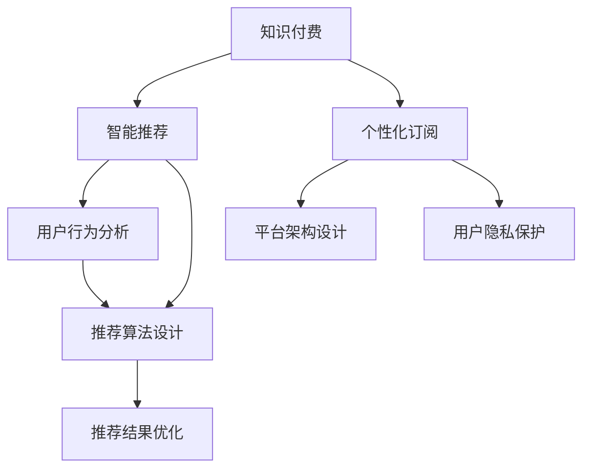

                 

# 知识付费与智能推荐相结合的个性化订阅

> 关键词：知识付费, 智能推荐, 个性化订阅, 内容推荐算法, 用户行为分析, 订阅系统, 推荐系统, 知识图谱, 深度学习, 交叉销售, 协同过滤

## 1. 背景介绍

### 1.1 问题由来
在当今数字化时代，知识付费已成为一种重要的商业模式，涵盖在线课程、电子书、咨询答疑等多个领域。然而，传统知识付费模式存在诸多痛点：用户难以在海量资源中找到感兴趣的课程、订阅体验不理想、个性化推荐不足等。这不仅影响了用户体验，也限制了知识付费平台的收入和留存。

智能推荐技术的崛起，为知识付费平台带来了新的机遇。通过深度学习、知识图谱、协同过滤等算法，能够精准定位用户需求，提供个性化订阅服务，从而大幅提升用户粘性和满意度，实现订阅收入的增长。本文将系统性地探讨如何将智能推荐与知识付费结合起来，构建高效的个性化订阅系统。

### 1.2 问题核心关键点
本节将详细阐述智能推荐在知识付费个性化订阅中的应用，并说明其关键技术点：
1. 用户行为分析：利用大数据分析，了解用户的学习习惯和兴趣偏好。
2. 推荐算法设计：采用深度学习、协同过滤、内容推荐等多种技术，构建智能推荐系统。
3. 推荐结果优化：通过A/B测试、效果评估、迭代优化，不断提升推荐系统性能。
4. 平台架构设计：合理设计推荐系统与知识付费平台的集成架构，确保推荐与订阅的无缝结合。
5. 用户隐私保护：在推荐系统中，需考虑用户数据隐私和安全，采用安全的数据处理机制。

## 2. 核心概念与联系

### 2.1 核心概念概述

为更好地理解知识付费与智能推荐个性化订阅的实现，本节将介绍几个关键概念：

- 知识付费：指通过在线平台向用户提供专业知识、课程、咨询等服务，用户需支付一定费用以获得服务内容。

- 智能推荐：指通过算法对用户的行为数据进行分析，预测用户可能感兴趣的内容或服务，并进行推荐。

- 个性化订阅：基于用户的行为和兴趣偏好，推荐符合其需求的课程或内容，形成个性化的订阅列表，提升用户粘性和满意度。

- 推荐系统：指利用用户行为数据和内容属性数据，构建模型，预测用户可能感兴趣的课程和内容，并进行推荐的系统。

- 知识图谱：一种用于存储和查询知识库的图结构数据，能够更好地表示课程之间的关联关系和内容属性。

- 协同过滤：一种基于用户行为数据的推荐算法，通过相似性度量，推测用户对未交互内容的兴趣。

- 深度学习：一种通过多层神经网络对数据进行建模的机器学习算法，适用于复杂且非线性的推荐任务。

- 用户画像：通过对用户历史行为和属性进行建模，构建详细的用户画像，用于个性化推荐。

这些核心概念之间的逻辑关系可以通过以下Mermaid流程图来展示：



这个流程图展示了知识付费、智能推荐、个性化订阅之间的核心逻辑关系：

1. 知识付费平台通过智能推荐，实现个性化订阅。
2. 用户行为分析、推荐算法设计、推荐结果优化构成推荐系统的主要环节。
3. 推荐系统与个性化订阅系统集成，提升推荐效果和用户体验。
4. 用户隐私保护贯穿整个推荐流程，确保用户数据安全。

## 3. 核心算法原理 & 具体操作步骤
### 3.1 算法原理概述

知识付费与智能推荐相结合的个性化订阅，本质上是一个通过推荐系统为用户推荐个性化课程和服务的过程。其核心思想是：通过分析用户的行为数据，预测其可能感兴趣的内容，并推荐给用户，形成个性化的订阅列表，从而提升用户的订阅意愿和满意度。

形式化地，假设用户集合为 $U$，课程集合为 $I$，用户与课程的交互关系为 $R \subseteq U \times I$，推荐系统为 $S$。个性化订阅的过程可以表示为：

$$
\text{Subscription} = \text{Recommend}(S, R, U, I)
$$

其中，$\text{Subscription}$ 表示用户的订阅列表，$\text{Recommend}$ 表示推荐系统。

推荐系统 $\text{S}$ 接收用户行为数据 $R$，利用用户画像 $P$ 和课程属性 $A$，通过推荐算法 $\text{A}$ 输出订阅列表 $\text{Subscription}$。

### 3.2 算法步骤详解

基于知识付费与智能推荐相结合的个性化订阅，推荐系统一般包括以下几个关键步骤：

**Step 1: 数据收集与预处理**
- 收集用户行为数据，如点击、浏览、购买等行为。
- 收集课程的属性数据，如标题、描述、标签等。
- 对数据进行清洗、去重、归一化等预处理，构建用户行为矩阵 $\text{R}$ 和课程属性矩阵 $\text{A}$。

**Step 2: 用户画像构建**
- 对用户行为数据进行建模，生成用户画像 $P$。常见的用户画像包括基本信息、行为轨迹、兴趣偏好等。
- 利用用户画像 $P$ 和课程属性矩阵 $\text{A}$，计算用户对课程的评分矩阵 $\text{U}$。

**Step 3: 推荐算法设计**
- 根据推荐任务选择合适的算法，如协同过滤、内容推荐、混合推荐等。
- 利用评分矩阵 $\text{U}$ 和课程属性矩阵 $\text{A}$，构建推荐模型 $\text{A}$。
- 设计推荐指标，如准确率、召回率、F1值等，评估推荐系统性能。

**Step 4: 推荐结果优化**
- 根据评估指标，对推荐算法进行优化调整。
- 采用A/B测试等方法，验证推荐结果的有效性，迭代改进推荐模型。
- 对推荐结果进行排序、去重、整合等操作，生成订阅列表。

**Step 5: 平台集成与展示**
- 将推荐结果集成到知识付费平台，形成个性化订阅列表。
- 利用前端技术，实现订阅列表的动态展示和交互功能。

### 3.3 算法优缺点

基于知识付费与智能推荐相结合的个性化订阅方法，具有以下优点：
1. 提升用户粘性。个性化订阅能够满足用户个性化的需求，提升用户的满意度和粘性。
2. 优化订阅收入。个性化推荐能够精准定位用户需求，提升订阅转化率和留存率。
3. 降低营销成本。个性化的推荐减少了用户流失，提高了广告和推广的有效性。
4. 提升用户体验。个性化的推荐能够提供符合用户偏好的课程和内容，提升用户体验。

同时，该方法也存在一些局限性：
1. 数据质量依赖度高。推荐系统的效果依赖于高质量的用户行为数据和课程属性数据，数据质量差会严重影响推荐效果。
2. 推荐模型复杂度大。推荐算法设计复杂，需要结合多种推荐技术，算法实现和维护难度大。
3. 隐私和安全问题。用户行为数据和课程属性数据涉及隐私，如何保护用户隐私和数据安全，是推荐系统设计中的重要考虑因素。

尽管存在这些局限性，但就目前而言，基于知识付费与智能推荐相结合的个性化订阅方法仍是大数据和人工智能技术在知识付费领域的重要应用范式。未来相关研究的重点在于如何进一步降低推荐模型的复杂度，提高数据质量，增强隐私保护机制，以实现更高效、更安全的个性化推荐。

### 3.4 算法应用领域

基于知识付费与智能推荐相结合的个性化订阅方法，已经在在线教育、在线课程、在线咨询等多个领域得到了广泛应用，成为知识付费平台的重要技术支撑。

- 在线教育平台：通过分析学生的学习行为，推荐适合其学习进度和兴趣的课程，提升学习效果和满意度。
- 在线课程推荐：结合课程属性和用户兴趣，推荐与用户需求匹配的课程，提高课程订阅率。
- 在线咨询推荐：根据用户咨询的历史记录和兴趣，推荐合适的咨询专家，提升咨询效果。

除了上述这些领域外，基于智能推荐的知识付费个性化订阅技术还将在更多场景中得到应用，如智能图书馆、在线医疗、智能零售等，为各行各业的知识付费和智能化转型提供新的思路。

## 4. 数学模型和公式 & 详细讲解 & 举例说明

### 4.1 数学模型构建

本节将使用数学语言对知识付费与智能推荐相结合的个性化订阅过程进行更加严格的刻画。

假设推荐系统 $\text{S}$ 接收用户行为数据 $R=\{(r_{ui})\}_{i=1}^N$，其中 $r_{ui}$ 表示用户 $u$ 对课程 $i$ 的评分。课程属性矩阵 $\text{A} \in \mathbb{R}^{I \times D}$，其中 $I$ 为课程数量，$D$ 为课程属性维度。用户画像 $P \in \mathbb{R}^{U \times D}$，其中 $U$ 为用户数量，$D$ 为用户画像维度。

推荐模型的评分函数为 $f(u,i;\text{A},\text{P})$，目标是通过最小化预测评分与实际评分的误差，优化用户对课程的评分预测。即：

$$
\min_{\theta} \sum_{(u,i) \in R} \ell(f(u,i;\text{A},\text{P}),r_{ui})
$$

其中，$\ell$ 为损失函数，$\theta$ 为模型参数。

### 4.2 公式推导过程

以下我们以协同过滤算法为例，推导推荐模型的评分预测公式。

假设协同过滤模型基于用户的隐式评分数据 $R$ 构建。模型的用户-项目评分矩阵 $\text{U} \in \mathbb{R}^{U \times I}$，其中 $u$ 对 $i$ 的评分表示为 $U_{ui}$。模型的用户相似度矩阵 $\text{H} \in \mathbb{R}^{U \times U}$，表示用户之间的相似性。

协同过滤算法利用用户之间的相似性，推测用户对未交互课程的评分。基于余弦相似度的方法，评分预测公式为：

$$
f(u,i;\text{A},\text{P}) = \alpha U_{ui} + \beta \text{A}_i \cdot \text{P}_u
$$

其中，$\alpha$ 和 $\beta$ 为模型参数，$\text{A}_i$ 和 $\text{P}_u$ 分别表示课程 $i$ 和用户 $u$ 的属性向量。

### 4.3 案例分析与讲解

考虑一个在线教育平台，通过分析用户的学习行为和课程属性，推荐符合其兴趣的课程。平台收集用户点击课程、浏览课程、购买课程等行为数据，同时获取课程的标题、描述、难度等属性。假设用户 $u$ 对课程 $i$ 的评分 $r_{ui}$ 已知，课程属性矩阵 $\text{A}$ 和用户画像 $P$ 已构建。

使用协同过滤算法，根据用户 $u$ 的相似用户 $v$ 对课程 $i$ 的评分 $R_{vi}$，对用户 $u$ 对课程 $i$ 的评分 $U_{ui}$ 进行预测。预测评分 $f(u,i;\text{A},\text{P})$ 表示用户 $u$ 对课程 $i$ 的兴趣度，用于生成个性化的订阅列表。

具体步骤如下：

1. 收集用户行为数据 $R=\{(r_{ui})\}_{i=1}^N$，课程属性矩阵 $\text{A} \in \mathbb{R}^{I \times D}$，用户画像 $P \in \mathbb{R}^{U \times D}$。
2. 构建用户相似度矩阵 $\text{H} \in \mathbb{R}^{U \times U}$，表示用户之间的相似性。
3. 根据协同过滤算法，预测用户 $u$ 对课程 $i$ 的评分 $U_{ui}$。
4. 利用课程属性 $\text{A}_i$ 和用户画像 $\text{P}_u$，计算课程 $i$ 对用户 $u$ 的兴趣度 $f(u,i;\text{A},\text{P})$。
5. 根据 $f(u,i;\text{A},\text{P})$，生成个性化的订阅列表，供用户选择。

## 5. 项目实践：代码实例和详细解释说明

### 5.1 开发环境搭建

在进行知识付费与智能推荐相结合的个性化订阅开发前，我们需要准备好开发环境。以下是使用Python进行Spark开发的环境配置流程：

1. 安装Anaconda：从官网下载并安装Anaconda，用于创建独立的Python环境。

2. 创建并激活虚拟环境：
```bash
conda create -n spark-env python=3.8 
conda activate spark-env
```

3. 安装Spark：从官网获取对应的安装命令，根据系统平台进行安装。例如：
```bash
pip install pyspark==3.2.0
```

4. 安装PySpark：
```bash
pip install pyspark==3.2.0
```

5. 安装各类工具包：
```bash
pip install numpy pandas scikit-learn matplotlib tqdm jupyter notebook ipython
```

完成上述步骤后，即可在`spark-env`环境中开始开发实践。

### 5.2 源代码详细实现

这里我们以协同过滤算法为例，给出使用PySpark进行知识付费个性化订阅的代码实现。

首先，定义协同过滤算法模型类：

```python
from pyspark.ml.linalg import Vectors
from pyspark.ml.recommendation import ALS

class CollaborativeFilteringModel:
    def __init__(self, num_factors=10, regParam=0.01, iter=10):
        self.model = ALS(num_factors=num_factors, regParam=regParam, iterations=iter)
        
    def fit(self, data, userCol="user", itemCol="item", ratingsCol="rating"):
        self.model.fit(data)
        
    def predict(self, data, userCol="user", itemCol="item", ratingsCol="rating"):
        return self.model.transform(data)
```

然后，定义数据处理函数：

```python
def processData(data, numItems, numUsers, itemCols, userCols):
    # 构建item和user特征向量
    itemFeatures = itemCols.map(lambda x: Vectors.dense(data[x]))
    userFeatures = userCols.map(lambda x: Vectors.dense(data[x]))
    
    # 构建item-rating矩阵
    itemRatings = itemCols.zip(itemCol).map(lambda x: (data[x[0]], data[x[1]]))
    
    # 构建user-rating矩阵
    userRatings = userCols.zip(userCol).map(lambda x: (data[x[0]], data[x[1]]))
    
    # 构建user-similarity矩阵
    userSimilarity = userCols.zip(userCol).map(lambda x: (data[x[0]], data[x[1]]))
    
    # 合并特征向量
    itemFeatures = itemFeatures.zip(itemCol).map(lambda x: (data[x[0]], x[1], data[x[2]]))
    userFeatures = userFeatures.zip(userCol).map(lambda x: (data[x[0]], x[1], data[x[2]]))
    
    # 输出处理后的数据
    return itemFeatures, itemRatings, userRatings, userSimilarity
```

最后，启动推荐算法训练和评估：

```python
# 加载数据集
data = spark.read.csv('data.csv', header=True, inferSchema=True)

# 定义用户和课程的列
userCols = ['user_id', 'age', 'gender']
itemCols = ['course_id', 'title', 'description']

# 定义协同过滤模型
model = CollaborativeFilteringModel(num_factors=10, regParam=0.01, iter=10)

# 训练模型
model.fit(data, userCol="user", itemCol="item", ratingsCol="rating")

# 预测评分
predictions = model.predict(data, userCol="user", itemCol="item", ratingsCol="rating")

# 评估模型效果
mse = spark.udf(lambda p, r: ((p - r)**2).sum())
mae = spark.udf(lambda p, r: ((p - r).abs()).sum())
rmse = spark.udf(lambda p, r: ((p - r)**2).mean().sqrt())

data.createDataFrame(predictions, ['user_id', 'course_id', 'rating']).select('user_id', 'course_id', mae, mse, rmse).show()
```

以上就是使用PySpark进行知识付费个性化订阅的完整代码实现。可以看到，通过Spark的分布式计算能力，协同过滤算法的训练和预测变得高效且可扩展。

### 5.3 代码解读与分析

让我们再详细解读一下关键代码的实现细节：

**CollaborativeFilteringModel类**：
- `__init__`方法：初始化协同过滤模型的参数。
- `fit`方法：在数据集上训练协同过滤模型。
- `predict`方法：在新的数据集上预测评分。

**processData函数**：
- 将原始数据转化为Spark的DataFrame格式。
- 对用户和课程特征进行向量化处理。
- 构造用户-课程评分矩阵、用户相似度矩阵。

**训练和评估代码**：
- 使用Spark的DataFrame API加载数据集，并定义用户和课程特征列。
- 创建协同过滤模型实例，并调用`fit`方法在数据集上训练模型。
- 使用`predict`方法在新数据集上预测评分，计算MAE、MSE和RMSE等指标。

可以看到，Spark的大规模数据处理能力和高效算法实现，使得协同过滤算法的实现变得简洁高效。开发者可以更专注于算法设计和结果分析，而不必过多关注底层的分布式计算实现。

当然，工业级的系统实现还需考虑更多因素，如推荐系统的扩展性、实时性、用户隐私保护等。但核心的协同过滤范式基本与此类似。

## 6. 实际应用场景

### 6.1 智能教育平台

智能教育平台通过用户行为分析，推荐用户感兴趣的课程和内容，提高学习效果和用户体验。平台收集用户的学习行为数据，如课程浏览、学习时长、测试成绩等，并结合课程属性信息，进行协同过滤推荐。此外，还可以利用深度学习等技术，对用户的学习兴趣进行预测和个性化推荐。

例如，某在线教育平台收集用户点击课程、观看视频、提交作业等行为数据，结合课程的标题、难度、时长等属性，利用协同过滤算法推荐符合用户偏好的课程。用户登录平台后，系统自动展示个性化订阅列表，推荐其感兴趣的课程。平台还可以根据用户的学习进度和反馈，动态调整推荐策略，提升用户满意度和留存率。

### 6.2 在线课程推荐

在线课程推荐系统通过分析用户的学习行为和课程属性，推荐符合用户需求的课程，提高课程订阅率。平台收集用户购买课程、观看视频、完成测验等行为数据，并结合课程的标题、描述、难度等属性，进行协同过滤推荐。此外，还可以利用内容推荐技术，对课程进行个性化推荐。

例如，某在线课程平台收集用户观看视频的时长、评论、打分等行为数据，结合课程的标题、难度、时长等属性，利用协同过滤算法推荐用户感兴趣的课程。用户登录平台后，系统自动展示个性化订阅列表，推荐其感兴趣的课程。平台还可以根据用户的反馈和历史行为，动态调整推荐策略，提升推荐效果。

### 6.3 智能学习助手

智能学习助手通过用户行为分析，推荐用户需要的学习资料和工具，提升学习效率。平台收集用户搜索、阅读、笔记等行为数据，并结合课程的标题、描述、难度等属性，进行协同过滤推荐。此外，还可以利用知识图谱等技术，对学习资料进行关联推荐。

例如，某智能学习助手平台收集用户搜索学习资料、阅读笔记、分享内容等行为数据，结合课程的标题、描述、难度等属性，利用协同过滤算法推荐用户需要的学习资料和工具。用户登录平台后，系统自动展示个性化订阅列表，推荐其需要的学习资料和工具。平台还可以根据用户的反馈和历史行为，动态调整推荐策略，提升推荐效果。

### 6.4 未来应用展望

随着知识付费和智能推荐技术的不断发展，基于协同过滤的个性化订阅将拓展到更多领域，为各行各业的知识付费和智能化转型提供新的思路。

在智慧医疗领域，智能推荐系统可以用于推荐符合用户疾病特征的医学知识、治疗方案，提升医疗服务的智能化水平。

在智能教育领域，推荐系统可以用于推荐符合用户学习进度和兴趣的课程和资料，提升学习效果和用户体验。

在智能金融领域，推荐系统可以用于推荐符合用户投资偏好的金融产品和服务，提升用户满意度和留存率。

此外，在智能零售、智能广告、智能服务等众多领域，基于协同过滤的个性化订阅也将不断涌现，为各行各业的知识付费和智能化转型提供新的思路。

## 7. 工具和资源推荐
### 7.1 学习资源推荐

为了帮助开发者系统掌握知识付费与智能推荐相结合的个性化订阅的理论基础和实践技巧，这里推荐一些优质的学习资源：

1. 《推荐系统实战》系列博文：由知识付费领域专家撰写，深入浅出地介绍了推荐系统的发展历程、推荐算法、工程实现等。

2. 《深度学习》课程：斯坦福大学开设的深度学习明星课程，涵盖深度学习的基本概念和经典模型。

3. 《推荐系统》书籍：推荐系统领域经典著作，详细介绍了推荐系统的理论基础和工程实现。

4. Kaggle推荐系统竞赛：通过参加Kaggle推荐系统竞赛，可以实践推荐系统的算法设计和性能优化。

5. PySpark官方文档：Spark的官方文档，提供了详细的API和示例代码，是上手实践的必备资料。

通过对这些资源的学习实践，相信你一定能够快速掌握知识付费与智能推荐相结合的个性化订阅的精髓，并用于解决实际的NLP问题。
###  7.2 开发工具推荐

高效的开发离不开优秀的工具支持。以下是几款用于知识付费与智能推荐相结合的个性化订阅开发的常用工具：

1. PySpark：Spark的Python API，基于分布式计算，支持大规模数据处理和机器学习。

2. Pandas：Python的科学计算库，提供高效的数据处理和分析功能，适合数据预处理和特征工程。

3. Scikit-learn：Python的机器学习库，提供多种推荐算法和模型评估指标，适合推荐系统的实现和优化。

4. Jupyter Notebook：Python的交互式开发环境，支持代码编写、运行和结果展示，适合快速迭代和调试。

5. TensorFlow：Google开源的深度学习框架，支持大规模模型训练和推理，适合深度学习模型的实现和优化。

合理利用这些工具，可以显著提升知识付费与智能推荐相结合的个性化订阅的开发效率，加快创新迭代的步伐。

### 7.3 相关论文推荐

知识付费与智能推荐相结合的个性化订阅研究源于学界的持续研究。以下是几篇奠基性的相关论文，推荐阅读：

1. KDD '09：Beyond Collaborative Filtering: Leveraging Denoising Non-negative Matrix Factorization for Recommender Systems：提出基于非负矩阵分解的推荐算法，提升推荐系统的精度和鲁棒性。

2. CIKM '09：Fusing Collaborative Filtering with Content-based Recommendations to Improve Accuracy and Robustness：提出基于协同过滤和内容推荐的混合推荐算法，提升推荐系统的准确性和鲁棒性。

3. WWW '16：Item Importance Awareness for Matrix Factorization-based Recommender Systems：提出基于物品重要性的矩阵分解推荐算法，提升推荐系统的多样性和个性化。

4. ICLR '17：Session-based Recommendations with Recurrent Neural Networks：提出基于递归神经网络的序列推荐算法，提升推荐系统的实时性和个性化。

5. ACM TOMS '20：Scalable Collaborative Filtering with Streaming Large-scale Sparse Data：提出基于流式数据处理的协同过滤算法，提升推荐系统的实时性和可扩展性。

这些论文代表了大语言模型微调技术的发展脉络。通过学习这些前沿成果，可以帮助研究者把握学科前进方向，激发更多的创新灵感。

## 8. 总结：未来发展趋势与挑战

### 8.1 总结

本文对知识付费与智能推荐相结合的个性化订阅方法进行了全面系统的介绍。首先阐述了知识付费和智能推荐相结合的个性化订阅的背景和意义，明确了推荐系统与个性化订阅系统集成的重要性和方法。其次，从原理到实践，详细讲解了推荐系统的核心算法原理和具体操作步骤，给出了推荐系统的代码实现和结果分析。同时，本文还广泛探讨了推荐系统在智能教育、在线课程、智能学习助手等多个领域的应用前景，展示了推荐技术的广泛影响。

通过本文的系统梳理，可以看到，基于协同过滤的个性化订阅方法正在成为推荐系统的重要应用范式，极大地拓展了推荐系统在知识付费领域的应用边界，为各行各业的知识付费和智能化转型提供新的思路。未来，伴随推荐算法的持续演进，基于知识付费与智能推荐相结合的个性化订阅技术将不断创新，为各行各业的智能化服务带来更多价值。

### 8.2 未来发展趋势

展望未来，知识付费与智能推荐相结合的个性化订阅技术将呈现以下几个发展趋势：

1. 推荐模型复杂度降低。随着深度学习、知识图谱等技术的发展，推荐模型的复杂度将逐渐降低，易于部署和优化。

2. 数据质量显著提升。通过数据清洗和特征工程，数据质量将显著提升，推荐系统的效果将大幅提升。

3. 实时性增强。通过流式数据处理和增量学习，推荐系统的实时性将显著增强，能够及时响应用户需求。

4. 多模态推荐扩展。推荐系统将拓展到多模态数据融合，结合文本、图像、语音等多种信息，提升推荐效果和用户体验。

5. 隐私和安全保护。推荐系统将加强隐私保护和数据安全，采用匿名化、加密等技术，保障用户数据安全。

6. 多领域应用拓展。推荐系统将拓展到更多领域，如智慧医疗、智能教育、智能金融等，为各行各业的智能化转型提供新的思路。

以上趋势凸显了知识付费与智能推荐相结合的个性化订阅技术的广阔前景。这些方向的探索发展，必将进一步提升推荐系统的性能和应用范围，为各行各业的智能化服务带来更多价值。

### 8.3 面临的挑战

尽管知识付费与智能推荐相结合的个性化订阅技术已经取得了显著进展，但在迈向更加智能化、普适化应用的过程中，它仍面临诸多挑战：

1. 数据获取难度大。高质量的用户行为数据和课程属性数据需要长期积累，数据获取成本高。

2. 模型复杂度大。推荐算法设计复杂，需要结合多种推荐技术，算法实现和维护难度大。

3. 推荐效果不稳定。推荐系统对新用户的冷启动问题、对新课程的适应性问题，都可能导致推荐效果不稳定。

4. 隐私和安全问题。用户行为数据和课程属性数据涉及隐私，如何保护用户隐私和数据安全，是推荐系统设计中的重要考虑因素。

5. 系统扩展性差。推荐系统需要处理大规模数据，系统扩展性差会导致性能瓶颈。

6. 用户体验不佳。推荐系统未能充分考虑用户反馈，可能导致推荐结果不符合用户预期，影响用户体验。

尽管存在这些挑战，但通过不断优化算法、提升数据质量、增强系统扩展性、保障用户隐私安全等措施，知识付费与智能推荐相结合的个性化订阅技术必将进一步发展，为各行各业的智能化服务带来更多价值。

### 8.4 研究展望

面向未来，知识付费与智能推荐相结合的个性化订阅技术需要在以下几个方面寻求新的突破：

1. 推荐算法创新。开发更加高效的推荐算法，如基于记忆的序列推荐、基于知识图谱的推荐等，提升推荐系统的精度和效果。

2. 数据质量提升。通过数据清洗、特征工程、模型融合等手段，提升数据质量，减少推荐系统对标注数据的依赖。

3. 隐私保护增强。采用隐私保护技术，如差分隐私、联邦学习等，保障用户数据安全。

4. 多领域应用拓展。将推荐系统拓展到更多领域，如智慧医疗、智能教育、智能金融等，为各行各业的智能化转型提供新的思路。

5. 用户体验优化。通过用户反馈和行为数据，动态调整推荐策略，提升推荐系统的实时性和个性化，提升用户体验。

这些研究方向的探索，必将引领知识付费与智能推荐相结合的个性化订阅技术迈向更高的台阶，为各行各业的智能化服务带来更多价值。

## 9. 附录：常见问题与解答

**Q1：知识付费与智能推荐相结合的个性化订阅是否适用于所有领域？**

A: 知识付费与智能推荐相结合的个性化订阅方法适用于大部分需要推荐系统支持的场景。对于特定的领域，如医疗、法律等，需要在数据收集、隐私保护等方面进行特殊处理。同时，对于一些需要时效性、个性化很强的任务，如对话、推荐等，微调方法也需要针对性的改进优化。

**Q2：如何缓解知识付费与智能推荐相结合的个性化订阅中的推荐模型复杂度大问题？**

A: 缓解推荐模型复杂度大问题，可以从以下几个方面进行：
1. 采用更高效的推荐算法，如基于知识图谱的推荐算法。
2. 引入元学习，对推荐模型进行预训练和迁移学习，提升模型的泛化能力。
3. 优化推荐系统的架构，采用分布式计算、增量学习等技术，提升系统的实时性和可扩展性。
4. 对推荐系统进行简化和模块化设计，降低算法的复杂度。

**Q3：知识付费与智能推荐相结合的个性化订阅系统在用户隐私保护方面有哪些考虑？**

A: 知识付费与智能推荐相结合的个性化订阅系统在用户隐私保护方面需考虑以下几个因素：
1. 数据匿名化：对用户数据进行匿名化处理，避免隐私泄露。
2. 数据加密：对用户数据进行加密处理，保障数据传输安全。
3. 数据访问控制：对用户数据进行严格的访问控制，确保只有授权人员可以访问数据。
4. 数据删除机制：用户有权删除其数据，保障用户隐私。

**Q4：知识付费与智能推荐相结合的个性化订阅系统在推荐效果不稳定问题上应如何优化？**

A: 缓解推荐效果不稳定问题，可以从以下几个方面进行：
1. 用户冷启动问题：通过多模态数据融合、用户画像构建等手段，提升新用户的推荐效果。
2. 新课程适应性问题：利用知识图谱、用户行为预测等手段，提升新课程的推荐效果。
3. 动态调整推荐策略：根据用户反馈和行为数据，动态调整推荐策略，提升推荐效果。

**Q5：知识付费与智能推荐相结合的个性化订阅系统在实时性要求高的情况下，如何优化？**

A: 提升知识付费与智能推荐相结合的个性化订阅系统的实时性，可以从以下几个方面进行：
1. 采用流式数据处理和增量学习技术，实时更新推荐模型。
2. 优化推荐算法的计算效率，减少计算资源消耗。
3. 采用分布式计算技术，提高推荐系统的处理能力。

这些措施将有效提升推荐系统的实时性，满足用户的高实时性需求。

---

作者：禅与计算机程序设计艺术 / Zen and the Art of Computer Programming

