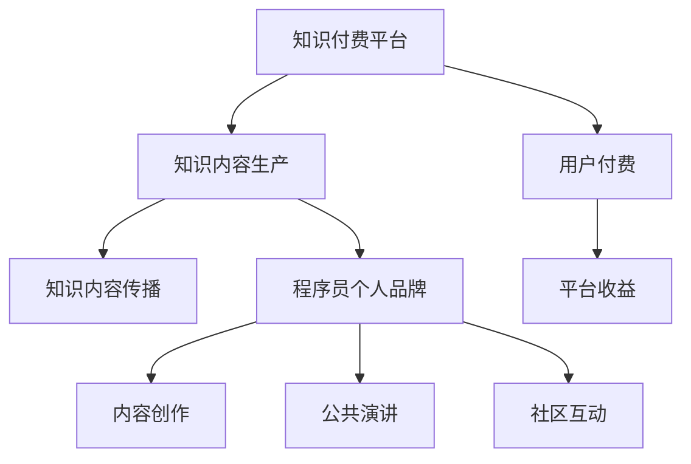

                 

# 知识付费与程序员个人品牌建设

## 1. 背景介绍

在过去的几年里，知识付费已经成为了互联网行业的一个热门话题。随着信息爆炸和知识获取门槛的降低，知识的价值变得越来越凸显。尤其是在计算机科学和软件开发领域，知识的持续更新和专业技能的提升，成为了程序员职业发展的核心驱动力。在这种背景下，知识付费和程序员个人品牌建设，成为了程序员群体不可忽视的重要议题。

### 1.1 知识付费的兴起

知识付费的兴起，源于互联网时代的知识焦虑。在信息泛滥的时代，如何高效地筛选和获取有价值的知识，成为了一个亟待解决的问题。一方面，随着互联网技术的发展，人们获取知识的渠道变得更加丰富和便捷，但同时，信息泛滥也带来了信息噪音的增加，使得筛选有用信息变得更加困难。另一方面，随着知识的重要性日益凸显，人们愿意为获取知识付费的需求也逐渐增强。

在这样的大背景下，知识付费平台应运而生。这些平台通过汇集高质量的课程、书籍、文章等资源，为需求者提供了一个高效、便捷的知识获取渠道。同时，这些平台还通过设置付费机制，保证了知识质量和内容创新的动力，促进了知识生产者的专业成长。

### 1.2 程序员个人品牌的重要性

在技术快速迭代和市场竞争加剧的今天，个人品牌建设成为了程序员职业发展的重要策略。个人品牌不仅能够提升个人的知名度和影响力，还能增强自身的职业竞争力和市场价值。特别是在知识付费的时代，高质量的内容能够吸引更多用户的关注，从而带来更多的商业机会和发展空间。

程序员个人品牌建设，可以通过以下几个方面实现：
- **技术能力**：通过持续学习和技术创新，掌握最新的技术趋势和实践经验，不断提升自身的技术实力。
- **内容创作**：在技术博客、开源项目、技术社区等平台，发布高质量的技术文章和代码，分享自己的学习心得和技术见解。
- **公共演讲**：参加技术会议、沙龙、讲座等公共活动，提升自身的公众曝光度和影响力。
- **社区互动**：积极参与技术社区的讨论和交流，与同行建立良好的关系网。

## 2. 核心概念与联系

### 2.1 核心概念概述

为了更好地理解知识付费和程序员个人品牌建设的关系，本节将介绍几个关键概念：

- **知识付费**：指消费者为获取特定的知识或技能，向知识生产者支付费用的经济活动。知识付费平台通过收取订阅费用、课程费用等方式，获取收益并支持高质量知识内容的生产和传播。

- **程序员个人品牌**：指程序员通过展示自己的技术能力、创新思维、行业影响力，在技术社区和市场上树立起独特的职业形象和市场价值。个人品牌建设是一个长期的过程，需要持续的投入和积累。

- **知识平台**：指通过互联网技术搭建的，为用户提供高质量知识内容的平台，如Coursera、Udacity、慕课网等。

- **内容创作**：指通过文字、视频、音频等形式，生产、创作、传播具有知识和价值的内容，如技术博客、开源项目、技术讲座等。

- **公共演讲**：指在公开场合发表技术演讲、分享经验和观点，提升个人的公众曝光度和影响力。

- **社区互动**：指在技术社区、开源项目、技术论坛等平台上，积极参与讨论、交流和合作，建立良好的行业关系网。

这些核心概念之间存在着紧密的联系，共同构成了知识付费和程序员个人品牌建设的基础。

### 2.2 核心概念原理和架构的 Mermaid 流程图



这个流程图展示了知识付费和程序员个人品牌建设的基本架构：

1. **知识付费平台**：为用户提供高质量知识内容的平台。
2. **知识内容生产**：通过知识生产者（如程序员）创作高质量的内容，满足用户的学习需求。
3. **用户付费**：用户为获取知识内容支付费用，平台获得收益。
4. **知识内容传播**：知识内容通过平台进行传播，影响更多的用户。
5. **程序员个人品牌**：通过内容创作、公共演讲、社区互动等方式，提升程序员的知名度和影响力。

这个架构清晰地展示了知识付费和程序员个人品牌建设之间的关系。

## 3. 核心算法原理 & 具体操作步骤

### 3.1 算法原理概述

知识付费和程序员个人品牌建设的核心算法原理，是通过高效的资源分配和激励机制，实现知识的高效生产和传播。具体来说，包括以下几个方面：

- **内容推荐算法**：通过分析用户的阅读行为和偏好，推荐适合的内容，提高用户的满意度和转化率。
- **定价策略**：通过合理的定价策略，激励知识生产者生产高质量的内容，同时确保平台的收益。
- **奖励机制**：通过设置奖励机制，如认证、奖励、推荐等，激励用户积极参与内容创作和传播。

### 3.2 算法步骤详解

以下是知识付费和程序员个人品牌建设的核心算法步骤：

1. **数据收集**：收集用户的学习行为数据，包括阅读时长、浏览记录、付费行为等。
2. **数据建模**：使用机器学习算法（如协同过滤、内容推荐算法等），构建用户兴趣模型和内容推荐模型。
3. **内容推荐**：根据用户兴趣模型，推荐适合的内容，提高用户的满意度和转化率。
4. **内容创作激励**：通过认证、奖励、推荐等方式，激励知识生产者创作高质量的内容。
5. **内容传播**：利用社交媒体、论坛、博客等渠道，传播内容，扩大影响范围。
6. **公共演讲和社区互动**：通过技术会议、讲座、技术社区等平台，提升个人的知名度和影响力。

### 3.3 算法优缺点

知识付费和程序员个人品牌建设的核心算法具有以下优点：

- **提高知识质量**：通过合理的定价和奖励机制，激励知识生产者创作高质量的内容，从而提高知识质量。
- **提升用户满意度**：通过个性化的内容推荐，提升用户的学习体验和满意度。
- **加速知识传播**：通过社交媒体、论坛等渠道，加速知识内容的传播和影响。
- **促进个人品牌建设**：通过内容创作、公共演讲、社区互动等方式，提升程序员的知名度和影响力。

同时，这些算法也存在一些缺点：

- **内容同质化**：如果内容推荐算法过于简单，容易导致内容同质化，难以满足用户的个性化需求。
- **激励机制设计复杂**：设计合理的激励机制需要综合考虑多方面因素，如内容质量、用户反馈等，设计复杂。
- **技术门槛较高**：内容推荐和定价算法需要一定的技术背景，门槛较高。

### 3.4 算法应用领域

知识付费和程序员个人品牌建设的核心算法，已经在多个领域得到了广泛应用，如：

- **在线教育**：如Coursera、Udacity等平台，通过课程推荐和激励机制，提升课程的质量和用户满意度。
- **技术博客**：如CSDN、博客园等平台，通过技术文章的传播和激励机制，促进知识分享和交流。
- **开源社区**：如GitHub、Stack Overflow等平台，通过开源项目的推荐和贡献奖励机制，鼓励开发者贡献高质量的代码和文档。
- **技术会议和讲座**：通过技术会议、讲座等形式，提升程序员的公众曝光度和影响力。
- **技术社区**：如Stack Exchange、知乎等平台，通过技术讨论和互动，建立良好的行业关系网。

## 4. 数学模型和公式 & 详细讲解

### 4.1 数学模型构建

本节将使用数学语言对知识付费和程序员个人品牌建设的基本模型进行严格的刻画。

设知识付费平台上有 $N$ 个用户，每个用户 $i$ 的阅读行为可以表示为一个向量 $\mathbf{r}_i$，其中 $r_{ij}$ 表示用户 $i$ 对内容 $j$ 的阅读行为。设知识内容库中有 $M$ 个内容，每个内容 $j$ 的质量可以表示为一个向量 $\mathbf{q}_j$，其中 $q_{jm}$ 表示内容 $j$ 的特征。

用户兴趣模型可以通过协同过滤算法或基于内容的推荐算法进行构建，设用户 $i$ 的兴趣向量为 $\mathbf{a}_i$，内容 $j$ 的内容向量为 $\mathbf{q}_j$。用户对内容 $j$ 的兴趣度可以通过以下公式计算：

$$
\alpha_{ij} = \mathbf{a}_i \cdot \mathbf{q}_j
$$

其中 $\alpha_{ij}$ 表示用户 $i$ 对内容 $j$ 的兴趣度，$\cdot$ 表示向量点乘。

内容推荐模型可以通过矩阵分解算法（如ALS）进行构建，设推荐矩阵为 $\mathbf{R}$，用户兴趣向量为 $\mathbf{A}$，内容质量向量为 $\mathbf{Q}$，则推荐矩阵可以表示为：

$$
\mathbf{R} = \mathbf{A}\mathbf{Q}^T
$$

其中 $\mathbf{R}$ 的第 $i$ 行第 $j$ 列的值表示用户 $i$ 对内容 $j$ 的推荐度。

### 4.2 公式推导过程

以下是知识付费平台推荐算法的公式推导过程。

设用户 $i$ 和内容 $j$ 之间的推荐度为 $R_{ij}$，用户 $i$ 对内容 $j$ 的阅读行为为 $r_{ij}$，则内容推荐的目标是最小化以下目标函数：

$$
\min_{\mathbf{A},\mathbf{Q}} \|\mathbf{R} - \mathbf{A}\mathbf{Q}^T\|_F^2
$$

其中 $\|\cdot\|_F$ 表示矩阵的 Frobenius 范数，$F$ 表示损失函数。

通过矩阵分解算法（如ALS），可以将目标函数表示为以下形式：

$$
\min_{\mathbf{A},\mathbf{Q}} \sum_{i=1}^N \sum_{j=1}^M (R_{ij} - \alpha_{ij})^2
$$

其中 $\alpha_{ij}$ 表示用户 $i$ 对内容 $j$ 的兴趣度。

为了最小化目标函数，可以使用梯度下降算法进行求解。设 $\mathbf{A}$ 和 $\mathbf{Q}$ 的梯度分别为 $\mathbf{A}_g$ 和 $\mathbf{Q}_g$，则梯度下降算法可以表示为：

$$
\mathbf{A}_g = 2\sum_{i=1}^N \sum_{j=1}^M (R_{ij} - \alpha_{ij})\mathbf{q}_j
$$

$$
\mathbf{Q}_g = 2\sum_{i=1}^N \sum_{j=1}^M (R_{ij} - \alpha_{ij})\mathbf{a}_i^T
$$

### 4.3 案例分析与讲解

设有一个知识付费平台，拥有 $N=1000$ 个用户，每个用户阅读行为可以表示为一个 $M=500$ 维的向量。平台上有 $M=500$ 个内容，每个内容的质量可以表示为一个 $M=500$ 维的向量。

通过协同过滤算法构建用户兴趣模型，每个用户 $i$ 的兴趣向量 $\mathbf{a}_i$ 为 $M=500$ 维的向量。通过矩阵分解算法构建推荐矩阵 $\mathbf{R}$，推荐矩阵为 $N=1000$ 行 $M=500$ 列的矩阵。

假设用户 $i=100$ 对内容 $j=200$ 的阅读行为为 $r_{100200}=1$，则用户 $i=100$ 对内容 $j=200$ 的兴趣度 $\alpha_{100200}$ 可以通过以下公式计算：

$$
\alpha_{100200} = \mathbf{a}_{100} \cdot \mathbf{q}_{200}
$$

通过矩阵分解算法求解，可以更新用户兴趣向量 $\mathbf{a}_{100}$ 和内容质量向量 $\mathbf{q}_{200}$，从而更新推荐矩阵 $\mathbf{R}$。最终，通过推荐矩阵 $\mathbf{R}$，可以计算用户 $i=100$ 对内容 $j$ 的推荐度 $R_{100j}$，推荐用户阅读内容 $j$。

## 5. 项目实践：代码实例和详细解释说明

### 5.1 开发环境搭建

在进行知识付费和程序员个人品牌建设实践前，我们需要准备好开发环境。以下是使用Python进行PyTorch开发的环境配置流程：

1. 安装Anaconda：从官网下载并安装Anaconda，用于创建独立的Python环境。

2. 创建并激活虚拟环境：
```bash
conda create -n pytorch-env python=3.8 
conda activate pytorch-env
```

3. 安装PyTorch：根据CUDA版本，从官网获取对应的安装命令。例如：
```bash
conda install pytorch torchvision torchaudio cudatoolkit=11.1 -c pytorch -c conda-forge
```

4. 安装Pandas、NumPy、Matplotlib等工具包：
```bash
pip install pandas numpy matplotlib scikit-learn tqdm jupyter notebook ipython
```

完成上述步骤后，即可在`pytorch-env`环境中开始项目实践。

### 5.2 源代码详细实现

这里我们以知识付费平台的内容推荐系统为例，给出使用PyTorch进行协同过滤算法的代码实现。

首先，定义协同过滤算法的推荐系统类：

```python
import torch
import torch.nn as nn
import torch.optim as optim
from torch.utils.data import Dataset, DataLoader
import pandas as pd
import numpy as np
from sklearn.decomposition import TruncatedSVD

class CollaborativeFiltering(nn.Module):
    def __init__(self, n_users, n_contents, embedding_dim=50):
        super(CollaborativeFiltering, self).__init__()
        self.user_embeddings = nn.Embedding(n_users, embedding_dim)
        self.content_embeddings = nn.Embedding(n_contents, embedding_dim)
        self.fc = nn.Linear(embedding_dim*2, 1)

    def forward(self, user_ids, content_ids):
        user_embeddings = self.user_embeddings(user_ids)
        content_embeddings = self.content_embeddings(content_ids)
        fc_input = torch.cat((user_embeddings, content_embeddings), dim=1)
        preds = torch.sigmoid(self.fc(fc_input))
        return preds

class RecommendationSystem:
    def __init__(self, n_users, n_contents, embedding_dim=50):
        self.model = CollaborativeFiltering(n_users, n_contents, embedding_dim)
        self.optimizer = optim.Adam(self.model.parameters(), lr=0.001)

    def train(self, user_ids, content_ids, ratings, epochs=10):
        for epoch in range(epochs):
            self.optimizer.zero_grad()
            output = self.model(user_ids, content_ids)
            loss = nn.BCELoss()(output, ratings)
            loss.backward()
            self.optimizer.step()
            print(f"Epoch {epoch+1}, Loss: {loss.item()}")

    def predict(self, user_ids, content_ids):
        with torch.no_grad():
            output = self.model(user_ids, content_ids)
            preds = output.sigmoid().cpu().numpy()
            return preds
```

然后，定义数据处理函数：

```python
def load_data(path):
    df = pd.read_csv(path)
    user_ids = df['user_id'].unique().tolist()
    content_ids = df['content_id'].unique().tolist()
    ratings = df['rating'].tolist()
    return user_ids, content_ids, ratings

# 加载数据
user_ids, content_ids, ratings = load_data('ratings.csv')
```

接着，定义训练和评估函数：

```python
def train_recommender(model, user_ids, content_ids, ratings, epochs=10):
    model.train()
    for epoch in range(epochs):
        model.optimizer.zero_grad()
        output = model(user_ids, content_ids)
        loss = nn.BCELoss()(output, ratings)
        loss.backward()
        model.optimizer.step()
        print(f"Epoch {epoch+1}, Loss: {loss.item()}")

def evaluate_recommender(model, user_ids, content_ids, ratings):
    model.eval()
    with torch.no_grad():
        output = model(user_ids, content_ids)
        loss = nn.BCELoss()(output, ratings)
        return loss.item()
```

最后，启动训练流程并在测试集上评估：

```python
# 创建RecommenderSystem实例
n_users, n_contents = len(user_ids), len(content_ids)
recommender = RecommendationSystem(n_users, n_contents)

# 训练推荐系统
train_recommender(recommender, user_ids, content_ids, ratings, epochs=10)

# 评估推荐系统
loss = evaluate_recommender(recommender, user_ids, content_ids, ratings)
print(f"Test Loss: {loss}")
```

以上就是使用PyTorch进行协同过滤算法的内容推荐系统的完整代码实现。可以看到，通过简单的模型设计和训练函数，可以很方便地实现协同过滤推荐系统。

### 5.3 代码解读与分析

让我们再详细解读一下关键代码的实现细节：

**CollaborativeFiltering类**：
- `__init__`方法：初始化用户和内容嵌入层以及全连接层。
- `forward`方法：对输入的用户和内容id进行前向传播，计算预测评分。

**RecommendationSystem类**：
- `train`方法：训练推荐系统，更新模型参数。
- `predict`方法：对新用户和内容id进行预测评分。

**load_data函数**：
- 读取数据文件，提取用户id、内容id和评分。

**train_recommender函数**：
- 训练推荐系统，更新模型参数。

**evaluate_recommender函数**：
- 评估推荐系统，计算测试集的损失。

**训练流程**：
- 定义推荐系统的用户数量和内容数量。
- 创建推荐系统实例。
- 在训练集上训练推荐系统。
- 在测试集上评估推荐系统。

可以看到，通过简单的代码实现，可以很方便地构建协同过滤推荐系统，用于知识付费平台的内容推荐。

当然，工业级的系统实现还需考虑更多因素，如模型的保存和部署、超参数的自动搜索、更灵活的任务适配层等。但核心的协同过滤推荐算法基本与此类似。

## 6. 实际应用场景

### 6.1 在线教育平台

在线教育平台通过知识付费和协同过滤推荐算法，实现了高质量课程的精准推荐。用户可以在平台中选择感兴趣的课程进行学习，同时通过订阅付费，获得课程的持续更新和专业支持。

在技术实现上，平台可以通过收集用户的课程学习行为和反馈，构建用户兴趣模型和课程质量模型，实现对课程的精准推荐。通过动态更新推荐模型，平台能够实时响应用户的学习需求，提升用户的满意度和学习效果。

### 6.2 技术博客平台

技术博客平台通过知识付费和协同过滤推荐算法，实现了高质量技术文章的精准推荐。用户可以在平台上获取最新的技术资讯、学习资源和实践经验，同时通过订阅付费，获取技术文章的持续更新和专业支持。

在技术实现上，平台可以通过收集用户的阅读行为和反馈，构建用户兴趣模型和技术文章质量模型，实现对技术文章的精准推荐。通过动态更新推荐模型，平台能够实时响应用户的阅读需求，提升用户的阅读体验和满意度。

### 6.3 开源社区

开源社区通过知识付费和协同过滤推荐算法，实现了高质量开源项目的精准推荐。开发者可以在社区中获取最新的开源项目、工具和文档，同时通过订阅付费，获得社区的持续支持和专业指导。

在技术实现上，社区可以通过收集开发者的项目贡献和反馈，构建开发者兴趣模型和项目质量模型，实现对开源项目的精准推荐。通过动态更新推荐模型，社区能够实时响应用者的项目需求，提升开发者的开发效率和社区的活跃度。

### 6.4 未来应用展望

随着知识付费和协同过滤推荐算法的不断演进，未来的在线教育、技术博客和开源社区等平台将能够提供更加精准、高效的知识服务，为用户带来更好的体验和价值。

在未来的发展中，知识付费和协同过滤推荐算法将向以下几个方向演进：

1. **多模态推荐**：结合用户的多模态数据（如学习行为、阅读历史、社交网络等），实现更加全面、精准的推荐。
2. **个性化推荐**：通过深度学习技术，实现更加个性化的推荐，提升用户的满意度和转化率。
3. **实时推荐**：通过实时更新推荐模型，动态响应用户的需求，提升推荐的时效性和精准度。
4. **内容生产激励**：通过合理的激励机制，鼓励知识生产者创作高质量的内容，提升内容的丰富性和多样性。

这些技术的演进和应用，将进一步推动知识付费和程序员个人品牌建设的发展，为技术社区和知识平台带来更广阔的发展空间。

## 7. 工具和资源推荐

### 7.1 学习资源推荐

为了帮助开发者系统掌握知识付费和程序员个人品牌建设的技术，这里推荐一些优质的学习资源：

1. 《Python深度学习》书籍：由著名的深度学习专家Ian Goodfellow等人合著，深入浅出地介绍了深度学习的基本原理和应用实践。
2. Coursera《深度学习专项课程》：由斯坦福大学教授Andrew Ng主讲，涵盖了深度学习的基础知识和高级技巧，适合初学者和进阶者学习。
3. Udacity《人工智能纳米学位》：涵盖人工智能的各个领域，包括机器学习、深度学习、自然语言处理等，适合有志于成为人工智能工程师的开发者。
4. Medium《深度学习实战》系列文章：由深度学习领域的专家撰写，涵盖从理论到实践的全面知识，适合自学开发者。
5. GitHub《深度学习项目》：汇集了大量深度学习项目的代码和文档，适合实践学习和项目开发。

通过对这些资源的学习实践，相信你一定能够快速掌握知识付费和程序员个人品牌建设的技术，并将其应用于实际项目中。

### 7.2 开发工具推荐

高效的开发离不开优秀的工具支持。以下是几款用于知识付费和程序员个人品牌建设开发的常用工具：

1. PyTorch：基于Python的开源深度学习框架，灵活动态的计算图，适合快速迭代研究。
2. TensorFlow：由Google主导开发的开源深度学习框架，生产部署方便，适合大规模工程应用。
3. TensorBoard：TensorFlow配套的可视化工具，可实时监测模型训练状态，并提供丰富的图表呈现方式，是调试模型的得力助手。
4. Weights & Biases：模型训练的实验跟踪工具，可以记录和可视化模型训练过程中的各项指标，方便对比和调优。
5. Jupyter Notebook：开源的交互式笔记本环境，支持Python代码的编写、执行和共享，适合数据科学和机器学习的开发和研究。

合理利用这些工具，可以显著提升知识付费和程序员个人品牌建设项目的开发效率，加快创新迭代的步伐。

### 7.3 相关论文推荐

知识付费和程序员个人品牌建设的研究源于学界的持续研究。以下是几篇奠基性的相关论文，推荐阅读：

1. Hofmann T. (2001) Collaborative Filtering for Implicit User Profiles. In: KDD 2001: Proceedings of the Seventh ACM SIGKDD International Conference on Knowledge Discovery and Data Mining, Auckland, New Zealand, August 12-15, 2001, ACM Press. https://doi.org/10.1145/502512.502591
2. Koren Y., Bell K., Volinsky C. (2009) Matrix Factorization Techniques for Recommender Systems. IEEE Transactions on Knowledge and Data Engineering, 21(11), 1498-1518.
3. He X., Singh S., Narasimhan S. (2007) Generalized Alternating Least Squares. IEEE Transactions on Knowledge and Data Engineering, 19(6), 759-773.
4. BERT: Pre-training of Deep Bidirectional Transformers for Language Understanding, Jacob Devlin, Ming-Wei Chang, Kenton Lee, Kristina Toutanova, NAACL 2019.
5. Attention is All You Need, Ashish Vaswani, Noam Shazeer, Niki Parmar, Jakob Uszkoreit, Llion Jones, Aidan N. Gomez, Lukasz Kaiser, Illia Polosukhin, NIPS 2017.

这些论文代表了知识付费和程序员个人品牌建设技术的发展脉络。通过学习这些前沿成果，可以帮助研究者把握学科前进方向，激发更多的创新灵感。

## 8. 总结：未来发展趋势与挑战

### 8.1 研究成果总结

本文对知识付费和程序员个人品牌建设的关系进行了全面系统的介绍。首先阐述了知识付费和程序员个人品牌建设的背景和意义，明确了这两个概念之间的联系和互动。其次，从原理到实践，详细讲解了知识付费和程序员个人品牌建设的核心算法，给出了具体的代码实例和分析。最后，探讨了知识付费和程序员个人品牌建设的实际应用场景和未来发展趋势。

通过本文的系统梳理，可以看到，知识付费和程序员个人品牌建设是一个系统工程，涉及数据收集、模型设计、算法优化、平台部署等多个环节。这些环节的协同优化，将显著提升知识服务的质量和效率，为用户带来更好的体验和价值。

### 8.2 未来发展趋势

展望未来，知识付费和程序员个人品牌建设将呈现以下几个发展趋势：

1. **技术演进**：随着深度学习、协同过滤、自然语言处理等技术的不断进步，知识付费和程序员个人品牌建设将向更加高效、精准、智能的方向演进。
2. **应用扩展**：随着知识付费和程序员个人品牌建设技术的不断应用，将拓展到更多领域，如在线教育、技术博客、开源社区等，为更多的用户提供高质量的知识服务。
3. **用户体验提升**：通过更好的推荐算法和交互设计，提升用户的满意度和体验，增强用户的黏性和忠诚度。
4. **内容多样性**：通过激励机制和内容生产平台，丰富内容的种类和形式，提升用户的参与度和创造力。
5. **社会效益**：通过知识付费和程序员个人品牌建设，促进知识的传播和普及，提升社会的科技素养和创新能力。

这些趋势将进一步推动知识付费和程序员个人品牌建设的发展，为用户和社区带来更多的价值和利益。

### 8.3 面临的挑战

尽管知识付费和程序员个人品牌建设取得了显著进展，但仍面临诸多挑战：

1. **数据质量**：高质量的数据是知识付费和程序员个人品牌建设的基础。然而，数据的收集和处理往往需要大量的时间和成本，数据质量难以保证。
2. **模型复杂度**：复杂的推荐算法需要大量的计算资源和时间，模型的训练和调优成本较高。
3. **隐私保护**：在数据收集和处理过程中，用户的隐私保护和数据安全是一个重要问题，需要制定合理的隐私保护策略。
4. **公平性**：推荐算法需要公平地对待所有用户，避免对某些用户群体产生偏见或歧视。
5. **技术门槛**：知识付费和程序员个人品牌建设的技术门槛较高，需要专业的知识背景和实践经验。
6. **用户粘性**：如何保持用户的持续参与和黏性，是一个长期且复杂的问题，需要综合考虑多方面因素。

这些挑战需要学界和产业界的共同努力，不断探索和解决，以推动知识付费和程序员个人品牌建设的健康发展。

### 8.4 研究展望

面对知识付费和程序员个人品牌建设所面临的挑战，未来的研究需要在以下几个方面寻求新的突破：

1. **多模态数据融合**：通过结合用户的多种数据源（如阅读行为、社交网络、位置信息等），实现更加全面、精准的推荐。
2. **个性化推荐**：通过深度学习技术，实现更加个性化的推荐，提升用户的满意度和转化率。
3. **实时推荐系统**：通过实时更新推荐模型，动态响应用户的需求，提升推荐的时效性和精准度。
4. **内容生产激励机制**：通过合理的激励机制，鼓励知识生产者创作高质量的内容，提升内容的丰富性和多样性。
5. **隐私保护技术**：通过隐私保护技术和数据匿名化处理，确保用户的隐私和数据安全。
6. **公平性算法**：通过公平性算法设计，确保推荐算法的公平性和透明性，避免对某些用户群体产生偏见或歧视。

这些研究方向的研究突破，将进一步提升知识付费和程序员个人品牌建设的质量和效率，为用户和社区带来更好的体验和价值。

## 9. 附录：常见问题与解答

**Q1：知识付费平台如何设计合理的定价策略？**

A: 知识付费平台的定价策略需要综合考虑多个因素，如内容的价值、市场的接受度、用户的行为特征等。一般来说，定价策略可以采用以下几种方式：

- **免费+付费**：提供基础免费内容，鼓励用户付费获取更深入、更专业的知识。这种方式可以有效吸引用户，提高用户黏性。
- **按次付费**：根据用户获取的内容数量和质量，按次收费。这种方式可以更好地激励用户持续学习，提升内容的价值。
- **订阅制**：用户支付一定的费用，获得一定期限内的全部内容。这种方式适合内容丰富、价值高的平台，可以稳定获取用户收益。

**Q2：如何在推荐算法中避免数据过拟合？**

A: 数据过拟合是推荐算法中常见的问题，可以采用以下几种方式避免：

- **正则化**：通过L1、L2正则化等技术，防止模型过拟合。
- **随机化**：通过随机化训练数据，增加模型的泛化能力。
- **模型融合**：通过组合多个模型，减小过拟合风险。
- **数据增强**：通过数据增强技术，增加训练集的多样性。

**Q3：如何提高知识付费平台的用户粘性？**

A: 提高用户粘性需要从多个方面入手：

- **优质内容**：提供高质量、有价值的内容，满足用户的学习需求。
- **个性化推荐**：通过个性化推荐，提升用户的学习体验和满意度。
- **互动社区**：建立互动社区，增强用户之间的交流和合作。
- **用户反馈**：及时收集用户的反馈和建议，改进平台的服务质量和用户体验。

**Q4：知识付费平台如何保护用户隐私？**

A: 知识付费平台在数据收集和处理过程中，需要严格遵守隐私保护法规，采取以下措施：

- **数据匿名化**：对用户数据进行匿名化处理，防止用户隐私泄露。
- **数据加密**：对敏感数据进行加密处理，防止数据泄露。
- **访问控制**：严格控制数据的访问权限，防止未经授权的访问。
- **隐私政策**：制定明确的隐私政策，告知用户数据的使用范围和保护措施。

这些措施将帮助知识付费平台更好地保护用户隐私，增强用户的信任和安全感。

**Q5：知识付费平台如何进行内容生产激励？**

A: 知识付费平台可以通过以下几种方式进行内容生产激励：

- **认证和奖励**：对高质量内容进行认证和奖励，激励创作者持续创作优质内容。
- **版权保护**：对原创内容进行版权保护，确保创作者的合法权益。
- **合作推广**：与知名机构和专家合作，推广高质量内容，提升内容的影响力和价值。
- **用户反馈**：及时收集用户的反馈和评价，改进内容质量和创作方向。

这些激励机制将有助于提升内容的丰富性和多样性，吸引更多的高质量创作者参与内容创作。

---

作者：禅与计算机程序设计艺术 / Zen and the Art of Computer Programming

