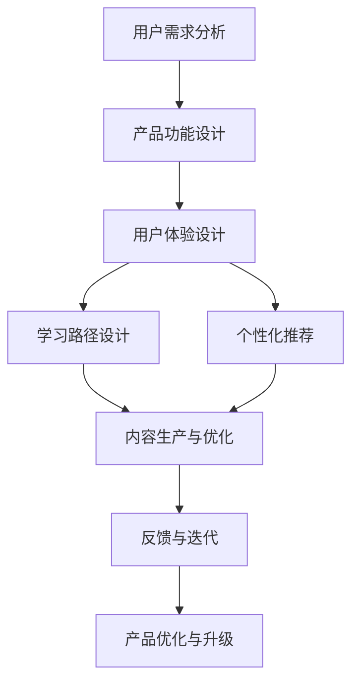

                 

## 1. 背景介绍

在数字化时代，知识付费成为一种新的学习方式，为大众提供了丰富多样的知识内容。但随之而来的挑战是，如何设计用户友好的知识付费产品，提升用户体验，促进知识内容的有效传播和吸收。本文将从用户需求、产品功能和设计原则等方面，探讨知识付费产品的用户体验设计最佳实践。

## 2. 核心概念与联系

### 2.1 核心概念概述

为了更好地理解知识付费产品的用户体验设计，本节将介绍几个核心概念：

- **知识付费**：通过付费方式获取专有知识，以提升自身知识和技能。
- **用户需求分析**：通过调查和分析，了解用户在使用知识付费产品时的实际需求和痛点。
- **用户体验设计**：通过合理布局和交互设计，提升用户在使用产品时的舒适度和满意度。
- **学习路径设计**：为知识内容建立合理的结构，帮助用户按需获取并吸收知识。
- **个性化推荐**：根据用户行为和兴趣，推荐适合的学习内容，提高学习效率。
- **反馈与迭代**：通过用户反馈不断改进产品，提升用户体验和产品价值。

### 2.2 核心概念原理和架构的 Mermaid 流程图



此图展示了知识付费产品从需求分析到内容优化，再到反馈迭代的整体流程。每个环节相互关联，共同构建了产品的用户体验。

## 3. 核心算法原理 & 具体操作步骤

### 3.1 算法原理概述

知识付费产品的用户体验设计，本质上是通过数据驱动的设计方式，提升用户获取知识的过程和效率。其核心思想是通过对用户行为数据的分析，了解用户需求，优化产品功能和交互设计，从而实现更好的用户体验。

### 3.2 算法步骤详解

1. **用户需求分析**：
   - 使用问卷调查、用户访谈等方式，收集用户对知识付费产品的反馈和建议。
   - 通过数据分析工具，如Google Analytics，了解用户的行为路径、停留时间和跳出率等指标。
   - 识别用户的常见问题，如内容匹配度、学习路径混乱等，作为设计改进的方向。

2. **产品功能设计**：
   - 根据用户需求，设计产品的基础功能，如注册登录、课程搜索、课程购买等。
   - 增加高级功能，如学习进度跟踪、学习笔记记录、学习数据分析等。
   - 集成个性化推荐算法，根据用户兴趣推荐相关课程和内容。

3. **用户体验设计**：
   - 使用UI/UX设计原则，如简洁性、一致性、可用性等，提升用户界面的美观性和操作便捷性。
   - 优化交互设计，如页面加载速度、导航栏的清晰度和响应性，减少用户的操作负担。
   - 提供良好的反馈机制，如学习进度的可视化展示、学习成果的即时反馈等，增强用户的成就感和动力。

4. **学习路径设计**：
   - 根据课程结构和内容，设计合理的课程学习路径，帮助用户系统化地学习。
   - 提供智能推荐系统，根据用户的进度和兴趣推荐下一节课或章节。
   - 设计学习导航，如章节目录、学习计划、学习提醒等，引导用户按计划学习。

5. **个性化推荐**：
   - 收集用户的学习历史、搜索行为、评分等数据，构建用户画像。
   - 应用机器学习算法，如协同过滤、内容推荐等，实时推荐符合用户兴趣的内容。
   - 定期更新推荐模型，根据用户反馈和行为数据不断优化推荐效果。

6. **反馈与迭代**：
   - 定期收集用户反馈，如产品满意度调查、用户建议箱等，了解用户的真实需求和痛点。
   - 分析反馈数据，识别改进的方向，如功能优化、界面改进等。
   - 持续迭代产品功能，结合技术更新和市场变化，不断提升用户体验。

### 3.3 算法优缺点

**优点**：
- 数据驱动的设计方式，能够更好地满足用户需求，提升用户体验。
- 通过个性化推荐和动态优化，提高用户的学习效率和满意度。
- 不断收集和分析用户反馈，有助于快速迭代产品，提升产品的市场竞争力。

**缺点**：
- 初期需要投入大量资源进行数据收集和分析，成本较高。
- 算法模型需要持续优化和更新，技术复杂度较高。
- 过度依赖数据和算法，可能忽视一些非数据化的用户体验因素。

### 3.4 算法应用领域

知识付费产品的用户体验设计，适用于各种在线教育平台、移动应用和网站。例如：

- **在线教育平台**：如Coursera、Udemy、网易云课堂等，提供系统化课程和个性化学习体验。
- **知识付费应用**：如得到、喜马拉雅、知乎等，提供多样化的知识内容和服务。
- **学习管理系统**：如Moodle、Canvas等，提供全面的学习管理和反馈机制。

## 4. 数学模型和公式 & 详细讲解 & 举例说明

### 4.1 数学模型构建

在知识付费产品的用户体验设计中，可以构建如下数学模型：

- **用户行为模型**：通过用户行为数据，如学习时长、课程完成率、学习路径等，描述用户的学习行为和模式。
- **用户兴趣模型**：基于用户的学习历史和搜索行为，构建用户兴趣的向量表示。
- **内容推荐模型**：根据用户兴趣模型和课程特征，计算课程推荐度，选择最合适的课程进行推荐。

### 4.2 公式推导过程

以内容推荐模型为例，假设用户兴趣向量为 $\boldsymbol{u}$，课程特征向量为 $\boldsymbol{v}$，课程推荐度为 $r$，则推荐公式可以表示为：

$$
r(\boldsymbol{u},\boldsymbol{v}) = \frac{\boldsymbol{u}^T \boldsymbol{v}}{\|\boldsymbol{u}\| \|\boldsymbol{v}\|}
$$

其中 $\boldsymbol{u}^T$ 为用户兴趣向量的转置，$\|\cdot\|$ 为向量范数。通过最大化 $r(\boldsymbol{u},\boldsymbol{v})$，可以选择与用户兴趣最相关的课程进行推荐。

### 4.3 案例分析与讲解

假设某知识付费平台收集到用户 A 的学习历史数据 $\{(1,0),(2,1),(3,1)\}$，表示用户在课程 1、课程 2、课程 3 上的评分分别为 1、0、1。同时，收集到课程特征数据 $\{(1,0.5),(2,0.7),(3,0.3)\}$，表示课程 1、课程 2、课程 3 的难度和知识深度分别为 0.5、0.7、0.3。

使用余弦相似度计算用户 A 对课程 2 的推荐度，假设用户 A 的兴趣向量 $\boldsymbol{u}$ 为 $(0.3, 0.6, 0.1)$，课程 2 的特征向量 $\boldsymbol{v}$ 为 $(0.7, 0.3, 0.0)$。计算公式为：

$$
r(\boldsymbol{u},\boldsymbol{v}) = \frac{0.3 \times 0.7 + 0.6 \times 0.3 + 0.1 \times 0.0}{\sqrt{0.3^2 + 0.6^2 + 0.1^2} \sqrt{0.7^2 + 0.3^2 + 0.0^2}} \approx 0.5
$$

因此，课程 2 推荐度为 0.5，可作为用户 A 的推荐课程。

## 5. 项目实践：代码实例和详细解释说明

### 5.1 开发环境搭建

在知识付费产品的用户体验设计中，一般需要搭建如下开发环境：

- **服务器环境**：选择高性能服务器，安装 Linux 操作系统，配置 Apache 或 Nginx 等 Web 服务器。
- **数据库环境**：选择 MySQL 或 MongoDB 等数据库，用于存储用户数据、课程数据和行为数据。
- **前端环境**：使用 React、Vue 或 Angular 等前端框架，开发用户界面和交互功能。
- **后端环境**：使用 Node.js、Java 或 Python 等后端语言，开发业务逻辑和推荐算法。
- **缓存环境**：使用 Redis 等缓存系统，提高数据访问效率和推荐算法性能。

### 5.2 源代码详细实现

以下是一个使用 Python 和 TensorFlow 实现内容推荐系统的示例代码：

```python
import tensorflow as tf
from tensorflow.keras.layers import Input, Dense
from tensorflow.keras.models import Model
from tensorflow.keras.optimizers import Adam
from tensorflow.keras.losses import MeanSquaredError

# 定义用户兴趣模型
user_input = Input(shape=(1,))
user_model = Dense(10, activation='relu')(user_input)
user_output = Dense(1, activation='sigmoid')(user_model)

# 定义课程特征模型
course_input = Input(shape=(3,))
course_model = Dense(10, activation='relu')(course_input)
course_output = Dense(1, activation='sigmoid')(course_model)

# 定义推荐模型
combined = tf.keras.layers.concatenate([user_output, course_output])
recommendation = Dense(1, activation='sigmoid')(combined)

# 定义模型和优化器
model = Model(inputs=[user_input, course_input], outputs=recommendation)
optimizer = Adam(learning_rate=0.001)
model.compile(optimizer=optimizer, loss=MeanSquaredError())

# 训练模型
train_data = ...
train_labels = ...
model.fit(x=[train_data['user'], train_data['course']], y=train_labels, epochs=10, batch_size=32)

# 预测推荐
test_data = ...
test_labels = ...
predictions = model.predict(x=[test_data['user'], test_data['course']])
```

### 5.3 代码解读与分析

以上代码实现了使用 TensorFlow 搭建推荐系统的基本流程：

1. **用户兴趣模型**：使用输入层的用户特征，通过多个密集层构建用户兴趣向量，最后输出一个 1 维的推荐度。
2. **课程特征模型**：使用输入层的课程特征，通过多个密集层构建课程特征向量，最后输出一个 1 维的推荐度。
3. **推荐模型**：将用户和课程的推荐度进行拼接，通过多层密集层输出最终的推荐度。
4. **模型训练**：使用训练数据和标签，通过优化器 Adam 和损失函数 MeanSquaredError 进行模型训练。
5. **预测推荐**：使用测试数据进行预测，输出推荐的课程评分。

### 5.4 运行结果展示

通过上述代码，可以生成一个推荐系统模型，输出用户对不同课程的推荐度。例如，对于用户 A 和课程 2，推荐度为 0.5，说明课程 2 与用户 A 的兴趣较为匹配，可以考虑将该课程推荐给用户 A。

## 6. 实际应用场景

### 6.1 智能课程推荐

在知识付费产品中，智能课程推荐是其核心功能之一。通过分析用户的学习历史、行为数据和评分反馈，为用户推荐感兴趣的课程，可以显著提升用户的学习动力和满意度。

### 6.2 个性化学习路径

对于系统化学习的用户，个性化的学习路径设计可以提升学习效率。通过学习历史和进度数据，推荐适合的课程和学习路径，帮助用户按需获取知识。

### 6.3 用户行为分析

通过用户行为数据，可以分析用户的学习习惯、兴趣偏好和行为模式，为内容优化和产品迭代提供依据。例如，通过用户停留时间、课程完成率等指标，优化课程内容和推荐算法。

### 6.4 未来应用展望

随着技术的不断进步，知识付费产品的用户体验设计将会有更多创新和突破。例如：

- **增强现实 AR**：结合 AR 技术，提供沉浸式的学习体验，增强用户的学习兴趣和互动性。
- **语音交互**：通过语音识别和合成技术，提供语音辅助的学习功能，方便用户随时随地学习。
- **脑机接口**：通过脑机接口技术，提供更加自然和高效的学习方式，提升用户的学习效率和体验。

## 7. 工具和资源推荐

### 7.1 学习资源推荐

为了帮助开发者系统掌握知识付费产品的用户体验设计，这里推荐一些优质的学习资源：

1. **《设计心理学》**：菲利普·夏米特（Philippe Schmitt）著，介绍了如何从心理学角度设计优秀的用户体验。
2. **《用户故事地图》**：吉娜·安·贾布（Jina Abrahams）著，讲述了如何通过用户故事地图来构建和优化产品。
3. **《用户体验设计指南》**：马克·鲁奇（Mark Lučić）著，系统介绍了用户体验设计的原理和实践方法。
4. **Udacity 用户体验设计课程**：通过在线课程，学习用户体验设计的最佳实践和工具使用。
5. **Nielsen Norman Group**：提供丰富的用户体验设计资源，包括报告、文章、培训等。

### 7.2 开发工具推荐

高效的开发离不开优秀的工具支持。以下是几款用于知识付费产品用户体验设计开发的常用工具：

1. **Sketch**：原型设计和用户界面设计工具，提供丰富的组件库和设计模板。
2. **Figma**：在线协作的设计工具，支持实时编辑和分享，方便团队协作。
3. **InVision**：用户界面设计和原型验证工具，提供丰富的设计原型和交互演示功能。
4. **Adobe XD**：设计工具，支持原型设计和交互动画制作。
5. **Adobe Illustrator**：矢量图形设计工具，支持图形和图标的设计和编辑。

### 7.3 相关论文推荐

知识付费产品的用户体验设计，离不开多学科的交叉和创新。以下是几篇奠基性的相关论文，推荐阅读：

1. **《设计心理学》**：唐·诺曼（Donald Norman）著，探讨了设计的心理原则和用户体验设计的基本原则。
2. **《认知心理学与设计》**：唐·诺曼（Donald Norman）著，介绍了认知心理学在用户体验设计中的应用。
3. **《用户体验设计的人本主义》**：唐·诺曼（Donald Norman）著，系统介绍了用户体验设计的人本主义和实践方法。
4. **《用户体验设计：用户为中心的设计》**：让·罗森蒙德（Jean-Robert Thireau）著，介绍了用户体验设计的核心概念和实践方法。
5. **《交互设计：理论与实践》**：珍·佩皮（Jane McDonnell）著，系统介绍了交互设计的理论和实践方法。

## 8. 总结：未来发展趋势与挑战

### 8.1 总结

本文对知识付费产品的用户体验设计进行了全面系统的介绍。首先阐述了知识付费产品的发展背景和重要性，明确了用户体验设计在知识付费产品中的核心地位。其次，从用户需求、产品功能、设计原则等方面，详细讲解了知识付费产品的用户体验设计最佳实践。最后，分析了知识付费产品用户体验设计的应用场景和未来发展趋势，并推荐了一些学习资源和工具。

通过本文的系统梳理，可以看到，知识付费产品的用户体验设计是一个多学科交叉的复杂问题，需要从用户需求、产品功能、设计原则等多个方面进行全面考虑和优化。只有综合考虑这些因素，才能设计出真正满足用户需求、提升用户满意度的知识付费产品。

### 8.2 未来发展趋势

展望未来，知识付费产品的用户体验设计将呈现以下几个发展趋势：

1. **数据驱动的个性化设计**：通过分析用户行为数据，实现更加精准和个性化的产品设计，提升用户满意度和粘性。
2. **沉浸式和交互式设计**：结合 AR、VR 和语音交互等技术，提供更加沉浸式和交互式的学习体验，增强用户的学习兴趣和互动性。
3. **人工智能辅助设计**：引入 AI 技术，如机器学习、自然语言处理等，辅助设计更加高效和精准的用户体验设计方案。
4. **多学科融合设计**：将心理学、认知科学、人机交互等多个学科的最新研究成果，融入用户体验设计中，提升设计的科学性和合理性。

这些趋势将推动知识付费产品的用户体验设计不断创新和突破，为用户的知识获取和学习提供更加丰富和高效的方式。

### 8.3 面临的挑战

尽管知识付费产品的用户体验设计已经取得了显著成果，但在迈向更加智能化、普适化应用的过程中，仍面临以下挑战：

1. **数据隐私和安全**：用户数据的安全和隐私保护是一个重要挑战，需要在设计过程中充分考虑用户隐私保护的需求。
2. **跨平台和跨设备兼容性**：用户在不同平台和设备上使用知识付费产品，需要设计兼容性和一致性较好的用户体验。
3. **技术实现复杂性**：用户体验设计涉及多学科的交叉和融合，技术实现复杂度较高，需要不断优化和迭代。
4. **用户需求变化快**：用户需求和市场趋势变化较快，需要持续跟踪和分析用户反馈，及时优化产品设计。
5. **设计资源有限**：中小企业在设计资源上可能存在不足，需要高效利用有限资源，提升设计质量和效率。

这些挑战需要在设计和实施过程中不断克服，才能确保知识付费产品的用户体验设计不断提升和创新。

### 8.4 研究展望

未来的研究需要在以下几个方面寻求新的突破：

1. **数据隐私保护**：引入数据匿名化和加密技术，保护用户隐私，增强用户信任。
2. **多设备协同设计**：研究多设备协同设计的方法，实现跨平台和跨设备的用户体验一致性。
3. **AI辅助设计**：引入 AI 辅助设计工具，提高设计效率和质量，降低设计成本。
4. **用户行为分析**：深入研究用户行为和心理，设计更加符合用户需求的产品。
5. **用户体验评估**：引入更加科学和客观的用户体验评估方法，持续优化产品设计。

这些研究方向将推动知识付费产品的用户体验设计不断提升和创新，为用户提供更加高效、智能和人性化的学习体验。

## 9. 附录：常见问题与解答

**Q1：如何确定知识付费产品的用户需求？**

A: 确定用户需求的关键在于深入调查和分析。可以通过以下方法：
1. 用户访谈和问卷调查，了解用户的真实需求和痛点。
2. 数据分析工具，如 Google Analytics，分析用户行为数据，发现用户兴趣和行为模式。
3. 用户测试和原型测试，通过实际使用和反馈，优化产品设计。

**Q2：知识付费产品如何实现个性化推荐？**

A: 实现个性化推荐的关键在于构建用户兴趣模型和课程特征模型，然后应用推荐算法进行推荐。具体步骤包括：
1. 收集用户行为数据和课程特征数据，构建用户兴趣和课程特征向量。
2. 应用推荐算法，如协同过滤、内容推荐等，计算课程推荐度。
3. 根据推荐度排序，选择最合适的课程进行推荐。

**Q3：如何设计知识付费产品的学习路径？**

A: 设计学习路径的关键在于系统化和结构化。具体步骤包括：
1. 分析课程结构和内容，确定课程的逻辑顺序和层次关系。
2. 设计课程推荐算法，根据用户学习进度和兴趣推荐下一节课或章节。
3. 提供学习导航工具，如章节目录、学习计划、学习提醒等，引导用户按计划学习。

**Q4：如何优化知识付费产品的用户体验设计？**

A: 优化用户体验设计的关键在于持续收集和分析用户反馈，不断迭代产品。具体步骤包括：
1. 定期收集用户反馈，如满意度调查、用户建议箱等，了解用户的真实需求和痛点。
2. 分析反馈数据，识别改进的方向，如功能优化、界面改进等。
3. 持续迭代产品功能，结合技术更新和市场变化，不断提升用户体验。

**Q5：如何保障知识付费产品的数据隐私和安全？**

A: 保障数据隐私和安全的关键在于设计和管理数据隐私保护机制。具体步骤包括：
1. 数据匿名化和加密技术，保护用户隐私。
2. 访问控制和权限管理，防止未授权的数据访问。
3. 定期进行安全审计，发现和修复潜在的安全漏洞。

**Q6：如何评估知识付费产品的用户体验？**

A: 评估用户体验的关键在于建立科学和客观的评估指标，具体步骤包括：
1. 定义用户体验的关键指标，如用户满意度、学习效率、使用频率等。
2. 使用用户测试和 A/B 测试，验证产品的用户体验设计效果。
3. 定期收集用户反馈，持续优化用户体验设计。

这些常见问题的解答，为知识付费产品的用户体验设计提供了具体的实践指导，帮助开发者更好地应对设计和实施中的挑战。

---

作者：禅与计算机程序设计艺术 / Zen and the Art of Computer Programming

