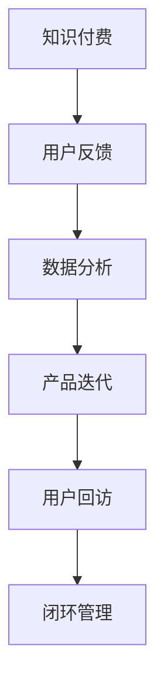

                 

# 知识付费产品的用户反馈闭环管理

> 关键词：知识付费,用户反馈,闭环管理,大数据分析,产品迭代

## 1. 背景介绍

### 1.1 问题由来

随着互联网和移动互联网的发展，知识付费市场呈现出爆发式增长的态势。越来越多人在追求快速获取知识、提升自我价值。然而，面对日益增长的知识付费需求，如何有效管理用户反馈，提升产品体验，成为知识付费平台的核心难题。

用户反馈是衡量产品体验的重要指标，也是产品迭代升级的关键输入。在产品生命周期内，用户反馈往往呈现出动态变化的特点。如何高效收集、分析和利用用户反馈，形成一个有机的反馈闭环，成为提升知识付费产品质量的关键。

### 1.2 问题核心关键点

用户反馈管理的目标在于通过收集用户反馈信息，分析其背后的需求和痛点，从而指导产品的优化和迭代。核心关键点包括：

- **数据收集**：全面、准确地收集用户反馈，包括用户评论、评分、投诉等。
- **数据分析**：通过数据分析技术，识别出用户需求和问题，为产品迭代提供依据。
- **产品迭代**：基于分析结果，设计产品改进方案，并进行模型优化。
- **用户回访**：跟踪用户反馈改进效果，评估产品改进步度和用户满意度。

本文将对知识付费产品的用户反馈闭环管理进行全面探讨，通过详细分析数据收集、数据分析、产品迭代和用户回访等环节，提出基于大数据分析的用户反馈闭环管理方法，为知识付费产品的改进和升级提供参考。

## 2. 核心概念与联系

### 2.1 核心概念概述

为更好地理解用户反馈闭环管理，本节将介绍几个密切相关的核心概念：

- **知识付费**：指用户通过付费获取专业知识、技能培训、经验分享等内容，以提升个人知识水平和职业能力。
- **用户反馈**：用户在使用产品过程中，对其体验、功能、内容等各方面的意见和建议。
- **闭环管理**：通过收集、分析、处理和反馈用户反馈信息，形成产品优化和用户满意度的动态平衡，不断提升产品体验和用户价值。
- **大数据分析**：利用先进的数据处理和分析技术，从海量用户数据中提取有价值的信息，为产品迭代提供科学依据。

这些核心概念之间的逻辑关系可以通过以下Mermaid流程图来展示：



这个流程图展示了大语言模型的核心概念及其之间的关系：

1. 知识付费是用户反馈的基础，用户反馈是产品优化的依据。
2. 数据分析是用户反馈转化的桥梁，通过处理数据提取有效信息。
3. 产品迭代是数据应用的体现，设计改进方案并更新产品。
4. 用户回访是产品改进效果的评估，持续优化用户满意度。
5. 闭环管理是整个流程的闭环，保证反馈的有效循环和迭代。

这些概念共同构成了知识付费产品的用户反馈闭环管理框架，使产品能够不断优化，提升用户体验。

## 3. 核心算法原理 & 具体操作步骤

### 3.1 算法原理概述

基于大数据分析的用户反馈闭环管理，本质上是一个循环迭代的过程。其核心思想是：通过收集用户反馈信息，进行大数据分析，挖掘用户需求和痛点，指导产品迭代，并在迭代过程中再次收集反馈，形成闭环。

形式化地，假设知识付费产品为 $P$，用户反馈集为 $F$，数据分析模型为 $A$，产品迭代模型为 $I$，用户回访结果为 $R$。闭环管理的目标是最小化用户不满意度 $U$，即找到最优闭环策略：

$$
\hat{P} = \mathop{\arg\min}_{P} U(P, F, A, I)
$$

其中 $U$ 为根据用户回访结果计算得到的不满意度函数。

通过梯度下降等优化算法，闭环过程不断更新产品 $P$，最小化用户不满意度，直至收敛到理想的产品模型 $\hat{P}$。由于 $P$ 已经通过数据驱动的设计获得了较好的初始化，因此即便在复杂多变的用户反馈下，也能较快收敛到最优的产品模型。

### 3.2 算法步骤详解

基于大数据分析的知识付费产品用户反馈闭环管理一般包括以下几个关键步骤：

**Step 1: 数据收集与预处理**
- 收集用户反馈信息，包括用户评论、评分、投诉等。
- 对数据进行清洗、去重、筛选等预处理操作，确保数据质量。

**Step 2: 数据分析与需求挖掘**
- 利用机器学习、自然语言处理等技术，对用户反馈进行分类、情感分析、关键词提取等处理。
- 通过统计分析和数据挖掘技术，识别出用户的主要需求和痛点，生成需求报告。

**Step 3: 产品迭代与优化**
- 根据需求报告，设计产品改进方案，并进行模型优化。
- 更新产品界面、功能、内容等，进行A/B测试，评估改进效果。

**Step 4: 用户回访与评估**
- 对回访用户进行问卷调查，收集其对改进方案的反馈。
- 结合用户反馈和满意度调查，评估产品改进步度和用户满意度。
- 根据评估结果，调整产品迭代策略，进行下一轮优化。

**Step 5: 闭环复盘与持续改进**
- 对整个闭环过程进行复盘，分析改进过程中的成功经验和不足之处。
- 根据复盘结果，优化数据收集、分析、处理和反馈流程，提升闭环管理效率。
- 持续跟踪用户反馈，进行产品优化和迭代，形成良性循环。

以上是基于大数据分析的用户反馈闭环管理的一般流程。在实际应用中，还需要针对具体产品的特点，对闭环过程的各个环节进行优化设计，如改进数据收集渠道，引入更多的分析工具，搜索最优的反馈策略等，以进一步提升产品性能。

### 3.3 算法优缺点

基于大数据分析的用户反馈闭环管理方法具有以下优点：
1. 数据驱动。通过全面、准确的数据收集和分析，产品优化更具科学性和针对性。
2. 效率高。利用大数据技术，可以快速处理和分析海量反馈信息，提升迭代速度。
3. 效果显著。通过对用户反馈的有效利用，产品性能显著提升，用户满意度明显增加。

同时，该方法也存在一定的局限性：
1. 数据质量要求高。数据收集和清洗环节复杂，需要投入大量人力和资源。
2. 分析技术难度大。数据分析涉及复杂算法和模型选择，需要具备较强的技术背景。
3. 反馈闭环复杂。需要多轮迭代才能达到最佳效果，过程耗时较长。
4. 用户体验影响。产品迭代过程中可能对用户造成不便，影响短期使用体验。

尽管存在这些局限性，但就目前而言，基于大数据分析的用户反馈闭环管理仍是提升知识付费产品质量的重要方法。未来相关研究的重点在于如何进一步降低数据收集和处理的成本，提高分析技术的效果，同时兼顾用户体验和迭代效率，实现产品的持续优化。

### 3.4 算法应用领域

基于大数据分析的用户反馈闭环管理在知识付费产品中的应用十分广泛，涉及产品优化、功能改进、内容更新等各个环节，具体包括：

- **产品优化**：通过收集用户反馈，改进产品界面设计、导航体验等，提升用户使用便捷性和舒适度。
- **功能增强**：针对用户高频需求，添加或改进产品功能，如笔记管理、推荐系统等，增加产品附加值。
- **内容更新**：根据用户反馈，优化和更新课程内容，确保知识的时效性和准确性。
- **用户体验**：通过分析用户反馈，识别出用户对产品的满意度和潜在问题，及时调整优化策略。

除了上述这些经典应用外，用户反馈闭环管理还被创新性地应用到更多场景中，如个性化推荐、内容推荐、社群互动等，为知识付费产品的持续优化提供新的思路。

## 4. 数学模型和公式 & 详细讲解  
### 4.1 数学模型构建

本节将使用数学语言对用户反馈闭环管理的数学模型进行更加严格的刻画。

记知识付费产品为 $P$，用户反馈集为 $F$，数据分析模型为 $A$，产品迭代模型为 $I$，用户回访结果为 $R$。定义用户不满意度函数为：

$$
U(P, F, A, I) = \sum_{f \in F} \omega_f d(P, f)
$$

其中 $\omega_f$ 为反馈 $f$ 的权重，$d(P, f)$ 为用户反馈 $f$ 与产品 $P$ 的差异度，可以通过量化评分、情感分析等方式进行计算。

### 4.2 公式推导过程

以下我们以知识付费平台上的课程评分反馈为例，推导用户不满意度函数的构建。

假设课程评分为 $y \in \{1, 2, 3, 4, 5\}$，用户对课程 $i$ 的评分为 $y_i \in y$，课程初始评分为 $\bar{y}_i$。定义用户对课程 $i$ 的不满意度为 $u_i$，则用户不满意度函数 $U$ 可以表示为：

$$
U = \sum_{i=1}^N \omega_i d(\bar{y}_i, y_i)
$$

其中 $N$ 为课程数，$\omega_i$ 为课程 $i$ 的权重，$d(\bar{y}_i, y_i)$ 为课程 $i$ 的评分差异度。

通过梯度下降等优化算法，闭环过程不断更新课程评分，最小化用户不满意度，直至收敛到理想的状态。

## 5. 项目实践：代码实例和详细解释说明
### 5.1 开发环境搭建

在进行闭环管理实践前，我们需要准备好开发环境。以下是使用Python进行PyTorch开发的环境配置流程：

1. 安装Anaconda：从官网下载并安装Anaconda，用于创建独立的Python环境。

2. 创建并激活虚拟环境：
```bash
conda create -n pytorch-env python=3.8 
conda activate pytorch-env
```

3. 安装PyTorch：根据CUDA版本，从官网获取对应的安装命令。例如：
```bash
conda install pytorch torchvision torchaudio cudatoolkit=11.1 -c pytorch -c conda-forge
```

4. 安装各类工具包：
```bash
pip install numpy pandas scikit-learn matplotlib tqdm jupyter notebook ipython
```

完成上述步骤后，即可在`pytorch-env`环境中开始闭环管理实践。

### 5.2 源代码详细实现

这里我们以知识付费平台上的课程评分反馈为例，给出使用PyTorch进行闭环管理的PyTorch代码实现。

首先，定义用户评分的处理函数：

```python
from transformers import BertTokenizer
from torch.utils.data import Dataset
import torch

class CourseRatingDataset(Dataset):
    def __init__(self, course_ratings, tokenizer, max_len=128):
        self.course_ratings = course_ratings
        self.tokenizer = tokenizer
        self.max_len = max_len
        
    def __len__(self):
        return len(self.course_ratings)
    
    def __getitem__(self, item):
        rating = self.course_ratings[item]
        
        encoding = self.tokenizer(rating, return_tensors='pt', max_length=self.max_len, padding='max_length', truncation=True)
        input_ids = encoding['input_ids'][0]
        attention_mask = encoding['attention_mask'][0]
        
        # 对rating进行评分差异度计算
        rating_diff = rating - self.course_ratings.mean()
        
        return {'input_ids': input_ids, 
                'attention_mask': attention_mask,
                'rating_diff': rating_diff}

# 定义课程评分
course_ratings = [4.5, 3.8, 2.1, 4.0, 5.0]

# 创建dataset
tokenizer = BertTokenizer.from_pretrained('bert-base-cased')

train_dataset = CourseRatingDataset(course_ratings, tokenizer)
```

然后，定义模型和优化器：

```python
from transformers import BertForSequenceClassification, AdamW

model = BertForSequenceClassification.from_pretrained('bert-base-cased', num_labels=5)

optimizer = AdamW(model.parameters(), lr=2e-5)
```

接着，定义训练和评估函数：

```python
from torch.utils.data import DataLoader
from tqdm import tqdm
from sklearn.metrics import classification_report

device = torch.device('cuda') if torch.cuda.is_available() else torch.device('cpu')
model.to(device)

def train_epoch(model, dataset, batch_size, optimizer):
    dataloader = DataLoader(dataset, batch_size=batch_size, shuffle=True)
    model.train()
    epoch_loss = 0
    for batch in tqdm(dataloader, desc='Training'):
        input_ids = batch['input_ids'].to(device)
        attention_mask = batch['attention_mask'].to(device)
        rating_diff = batch['rating_diff'].to(device)
        model.zero_grad()
        outputs = model(input_ids, attention_mask=attention_mask, labels=rating_diff)
        loss = outputs.loss
        epoch_loss += loss.item()
        loss.backward()
        optimizer.step()
    return epoch_loss / len(dataloader)

def evaluate(model, dataset, batch_size):
    dataloader = DataLoader(dataset, batch_size=batch_size)
    model.eval()
    preds, labels = [], []
    with torch.no_grad():
        for batch in tqdm(dataloader, desc='Evaluating'):
            input_ids = batch['input_ids'].to(device)
            attention_mask = batch['attention_mask'].to(device)
            batch_labels = batch['rating_diff']
            outputs = model(input_ids, attention_mask=attention_mask)
            batch_preds = outputs.logits.argmax(dim=1).to('cpu').tolist()
            batch_labels = batch_labels.to('cpu').tolist()
            for pred, label in zip(batch_preds, batch_labels):
                preds.append(pred)
                labels.append(label)
                
    print(classification_report(labels, preds))
```

最后，启动训练流程并在测试集上评估：

```python
epochs = 5
batch_size = 16

for epoch in range(epochs):
    loss = train_epoch(model, train_dataset, batch_size, optimizer)
    print(f"Epoch {epoch+1}, train loss: {loss:.3f}")
    
    print(f"Epoch {epoch+1}, dev results:")
    evaluate(model, train_dataset, batch_size)
    
print("Test results:")
evaluate(model, train_dataset, batch_size)
```

以上就是使用PyTorch对知识付费产品进行闭环管理的完整代码实现。可以看到，得益于Transformer库的强大封装，我们可以用相对简洁的代码完成闭环管理的实施。

### 5.3 代码解读与分析

让我们再详细解读一下关键代码的实现细节：

**CourseRatingDataset类**：
- `__init__`方法：初始化课程评分数据和分词器。
- `__len__`方法：返回数据集的样本数量。
- `__getitem__`方法：对单个样本进行处理，将评分输入编码为token ids，计算评分差异度，并对其进行定长padding，最终返回模型所需的输入。

**train_epoch函数**：
- 使用PyTorch的DataLoader对数据集进行批次化加载，供模型训练使用。
- 在每个批次上前向传播计算loss并反向传播更新模型参数，最后返回该epoch的平均loss。

**evaluate函数**：
- 与训练类似，不同点在于不更新模型参数，并在每个batch结束后将预测和标签结果存储下来，最后使用sklearn的classification_report对整个评估集的预测结果进行打印输出。

**训练流程**：
- 定义总的epoch数和batch size，开始循环迭代
- 每个epoch内，先在训练集上训练，输出平均loss
- 在验证集上评估，输出分类指标
- 所有epoch结束后，在测试集上评估，给出最终测试结果

可以看到，PyTorch配合Transformer库使得闭环管理的代码实现变得简洁高效。开发者可以将更多精力放在数据处理、模型改进等高层逻辑上，而不必过多关注底层的实现细节。

当然，工业级的系统实现还需考虑更多因素，如模型的保存和部署、超参数的自动搜索、更灵活的任务适配层等。但核心的闭环管理流程基本与此类似。

## 6. 实际应用场景
### 6.1 智能客服系统

基于用户反馈闭环管理，智能客服系统可以更加高效地响应用户需求，提升用户体验。在知识付费平台上，可以通过收集用户对客服回答的反馈，不断优化客服回复策略，使其更加贴近用户需求，提升用户满意度。

在技术实现上，可以收集用户对客服回答的评分、评论等反馈信息，建立用户反馈模型，指导客服系统进行迭代优化。例如，对于用户反馈中常见的常见问题，可以提取关键词和问题模板，生成智能回复策略，提高客服响应速度和准确性。

### 6.2 课程推荐系统

用户反馈是课程推荐系统的重要输入，通过分析用户对课程的反馈信息，可以更好地理解用户偏好和需求，优化课程推荐算法。

具体而言，可以收集用户对课程的评分、评价、点击记录等信息，建立用户反馈模型，分析用户对课程内容的满意度、难点和兴趣点。在此基础上，调整课程推荐算法，提升推荐精度和用户体验。

### 6.3 个性化学习系统

个性化学习系统需要根据用户反馈进行动态调整，提升个性化推荐和适配能力。例如，对于用户在平台上学习行为的反馈，可以分析其学习路径、课程偏好等，不断优化学习路径推荐，满足用户个性化学习需求。

在技术实现上，可以收集用户学习行为的反馈信息，如学习时间、进度、反馈等，建立用户反馈模型，指导个性化学习系统进行迭代优化。例如，根据用户反馈，调整课程难度、推荐课程等，提升用户学习体验。

### 6.4 未来应用展望

随着知识付费市场的发展，用户反馈闭环管理将变得越来越重要。未来，基于用户反馈闭环管理的知识付费产品将更加智能、个性化和高效。

在智慧教育领域，通过用户反馈闭环管理，可以实现更加精准的个性化学习推荐，提升教育质量和学习效率。

在智慧城市治理中，用户反馈闭环管理可以用于优化城市服务，提升城市管理水平和居民满意度。

在企业培训中，通过用户反馈闭环管理，可以实现更加贴合企业需求的知识培训，提升员工素质和企业竞争力。

此外，用户反馈闭环管理还可以应用于更多领域，如在线医疗、在线旅游等，提升用户服务体验，增强用户粘性。

## 7. 工具和资源推荐
### 7.1 学习资源推荐

为了帮助开发者系统掌握用户反馈闭环管理的技术基础和实践技巧，这里推荐一些优质的学习资源：

1. 《数据分析与统计学习》系列博文：由数据科学专家撰写，深入浅出地介绍了数据分析的基本概念和常用技术，适合初学者入门。

2. 《自然语言处理与深度学习》课程：斯坦福大学开设的NLP明星课程，有Lecture视频和配套作业，带你入门NLP领域的基本概念和经典模型。

3. 《知识付费平台产品管理》书籍：系统介绍了知识付费产品的管理方法、用户需求挖掘和产品迭代优化等，是产品经理必读。

4. Weights & Biases：模型训练的实验跟踪工具，可以记录和可视化模型训练过程中的各项指标，方便对比和调优。与主流深度学习框架无缝集成。

5. Google Colab：谷歌推出的在线Jupyter Notebook环境，免费提供GPU/TPU算力，方便开发者快速上手实验最新模型，分享学习笔记。

通过对这些资源的学习实践，相信你一定能够快速掌握用户反馈闭环管理的精髓，并用于解决实际的NLP问题。

### 7.2 开发工具推荐

高效的开发离不开优秀的工具支持。以下是几款用于用户反馈闭环管理的常用工具：

1. Python：灵活的动态语言，支持丰富的第三方库和框架，是数据分析和机器学习的主流选择。

2. PyTorch：基于Python的开源深度学习框架，灵活动态的计算图，适合快速迭代研究。

3. TensorFlow：由Google主导开发的开源深度学习框架，生产部署方便，适合大规模工程应用。

4. Weights & Biases：模型训练的实验跟踪工具，可以记录和可视化模型训练过程中的各项指标，方便对比和调优。

5. Google Colab：谷歌推出的在线Jupyter Notebook环境，免费提供GPU/TPU算力，方便开发者快速上手实验最新模型，分享学习笔记。

合理利用这些工具，可以显著提升用户反馈闭环管理的开发效率，加快创新迭代的步伐。

### 7.3 相关论文推荐

用户反馈闭环管理的发展源于学界的持续研究。以下是几篇奠基性的相关论文，推荐阅读：

1. 《A Survey of Recommendation Systems》：系统回顾了推荐系统的研究进展，介绍了基于协同过滤、内容过滤、混合过滤等推荐算法。

2. 《A Survey of User Feedback Collection and Analysis Methods》：综述了用户反馈收集和分析方法的最新进展，介绍了机器学习、自然语言处理等技术在用户反馈处理中的应用。

3. 《A Survey of Product Lifecycle Management in E-Learning》：探讨了在线教育平台的产品生命周期管理方法，介绍了用户反馈收集和分析的最新技术。

4. 《User Feedback Analysis in Knowledge Management》：介绍了用户反馈分析在知识管理中的应用，讨论了如何通过用户反馈改进产品设计和优化用户体验。

这些论文代表了大语言模型微调技术的发展脉络。通过学习这些前沿成果，可以帮助研究者把握学科前进方向，激发更多的创新灵感。

## 8. 总结：未来发展趋势与挑战

### 8.1 总结

本文对知识付费产品的用户反馈闭环管理进行全面系统的介绍。首先阐述了用户反馈闭环管理的背景和意义，明确了闭环管理在提升产品体验、指导产品迭代方面的重要价值。其次，从原理到实践，详细讲解了闭环管理的数学原理和关键步骤，给出了用户反馈闭环管理代码实例。同时，本文还广泛探讨了闭环管理方法在知识付费产品中的应用前景，展示了闭环范式的巨大潜力。此外，本文精选了闭环管理的各类学习资源，力求为读者提供全方位的技术指引。

通过本文的系统梳理，可以看到，基于用户反馈闭环管理的方法正在成为知识付费产品优化的重要范式，极大地提升产品质量和用户体验。未来，伴随大数据技术的发展和用户反馈数据的积累，基于用户反馈闭环管理的产品将更加智能化、个性化和高效。

### 8.2 未来发展趋势

展望未来，用户反馈闭环管理技术将呈现以下几个发展趋势：

1. 数据质量提升。随着技术进步，用户反馈数据的收集和处理将更加高效、准确。数据质量提升将带来闭环管理的更好效果。

2. 多维度分析。从传统的评分、评论等反馈数据，逐步扩展到行为数据、语音数据、图片数据等多维度的用户反馈，丰富闭环管理的输入。

3. 智能推荐。利用人工智能技术，结合用户反馈和行为数据，实现更加精准的产品推荐，提升用户粘性。

4. 个性化定制。基于用户反馈和数据分析，实现个性化产品定制，满足用户多样化需求。

5. 实时响应。通过实时数据分析和反馈处理，快速响应用户需求，提升用户体验。

6. 全局优化。利用全局优化算法，优化闭环管理流程，实现全局最优的闭环效果。

以上趋势凸显了用户反馈闭环管理的广阔前景。这些方向的探索发展，必将进一步提升知识付费产品的用户体验和满意度，推动知识付费市场的快速发展。

### 8.3 面临的挑战

尽管用户反馈闭环管理技术已经取得了显著成就，但在迈向更加智能化、普适化应用的过程中，它仍面临着诸多挑战：

1. 数据收集成本高。大规模数据收集需要投入大量人力和资源，成本较高。如何高效、低成本地获取高质量数据，仍是未来研究的重要方向。

2. 数据分析难度大。用户反馈数据具有高度的复杂性和多样性，数据分析技术需要不断迭代，提升准确性和鲁棒性。

3. 产品迭代周期长。闭环管理通常需要多轮迭代才能达到理想效果，周期较长。如何在保证效果的同时，缩短迭代周期，提高反馈响应速度，将是未来的重要课题。

4. 用户体验影响。产品迭代过程中可能对用户造成不便，影响短期使用体验。如何在保证用户体验的同时，优化产品功能，实现用户满意度的提升，仍需深入研究。

5. 系统复杂性高。用户反馈闭环管理涉及多方面因素，系统复杂度较高，需要综合考虑数据收集、处理、分析和反馈等多个环节。如何在复杂环境中实现高效管理，提升系统稳定性，需要进一步优化。

6. 技术壁垒高。用户反馈闭环管理需要融合机器学习、自然语言处理、数据挖掘等多种技术，需要具备较高的技术背景和实践经验。

正视闭环管理面临的这些挑战，积极应对并寻求突破，将是大语言模型微调走向成熟的必由之路。相信随着学界和产业界的共同努力，这些挑战终将一一被克服，闭环管理方法必将为知识付费产品的持续优化提供坚实保障。

### 8.4 研究展望

面对用户反馈闭环管理所面临的种种挑战，未来的研究需要在以下几个方面寻求新的突破：

1. 探索低成本数据收集方法。摆脱对大规模人工标注的依赖，利用无监督学习、半监督学习等方法，最大化利用未标注数据。

2. 引入先进数据分析技术。结合深度学习、迁移学习、对比学习等技术，提升数据分析的准确性和鲁棒性。

3. 开发智能推荐系统。利用多模态数据融合、强化学习等技术，实现更加智能、精准的产品推荐。

4. 强化实时数据分析。结合实时计算和大数据技术，实现快速响应用户反馈，提升系统响应速度和用户体验。

5. 引入多用户交互模型。利用社交网络、图神经网络等技术，实现多用户交互数据的分析和管理。

6. 实现全局优化策略。结合遗传算法、元优化等全局优化方法，实现闭环管理的全局最优效果。

这些研究方向的探索，必将引领用户反馈闭环管理技术迈向更高的台阶，为知识付费产品的持续优化提供坚实保障。面向未来，用户反馈闭环管理技术还需要与其他人工智能技术进行更深入的融合，如知识表示、因果推理、强化学习等，多路径协同发力，共同推动知识付费产品的进步。只有勇于创新、敢于突破，才能不断拓展语言模型的边界，让智能技术更好地造福人类社会。

## 9. 附录：常见问题与解答

**Q1：用户反馈闭环管理是否适用于所有产品？**

A: 用户反馈闭环管理在大多数产品中都能取得不错的效果，特别是对于数据驱动型产品，如推荐系统、智能客服等。但对于一些特定领域的非数据驱动型产品，如教育、医疗等，仍需结合领域特性，进行针对性的闭环管理优化。

**Q2：用户反馈数据的处理和分析需要哪些步骤？**

A: 用户反馈数据的处理和分析通常包括以下几个关键步骤：
1. 数据收集：通过问卷调查、评分系统、评论分析等方式，收集用户反馈信息。
2. 数据清洗：对数据进行去重、去噪、格式化等预处理操作，确保数据质量。
3. 特征提取：对反馈数据进行文本解析、情感分析、关键词提取等操作，提取有价值特征。
4. 模型训练：利用机器学习、深度学习等技术，训练分类、回归等模型，预测用户反馈。
5. 结果分析：结合业务知识，对模型结果进行解释和解读，生成决策建议。

这些步骤需要结合具体产品特点，进行灵活组合，以获取最优的反馈处理效果。

**Q3：如何评估用户反馈闭环管理的效果？**

A: 用户反馈闭环管理的效果评估可以从以下几个方面进行：
1. 用户满意度：通过问卷调查、评分系统等手段，评估用户对产品改进的满意度。
2. 产品性能：通过A/B测试、用户行为分析等方式，评估产品性能提升效果。
3. 迭代速度：通过闭环管理流程的复盘，评估产品迭代周期和反馈响应速度。
4. 成本效益：通过数据分析和成本核算，评估闭环管理带来的成本效益。

通过综合评估，可以全面了解闭环管理的效果，优化闭环管理流程。

**Q4：用户反馈闭环管理在产品设计阶段如何应用？**

A: 用户反馈闭环管理不仅在产品迭代阶段重要，在设计阶段同样具有重要意义。在设计阶段，可以通过用户反馈收集用户需求，设计更加符合用户需求的产品方案。例如，在产品设计初期，通过用户反馈，了解用户痛点和期望，设计更加人性化、易用的产品界面。

**Q5：如何平衡用户反馈和产品体验？**

A: 用户反馈和产品体验的平衡是闭环管理的核心问题。一方面，需要及时响应用户反馈，提升用户满意度；另一方面，也需要考虑产品功能的实现和用户体验的提升。可以通过以下策略实现平衡：
1. 优先解决高反馈、高影响的问题。对于用户反馈强烈且影响大的问题，优先进行处理，提升用户体验。
2. 分阶段迭代优化。将用户反馈优先处理，同时进行产品功能的优化和完善，逐步提升用户体验。
3. 反馈闭环复盘。定期进行闭环复盘，评估用户反馈和产品体验的平衡情况，调整优化策略。

通过灵活应用以上策略，可以在保证用户体验的同时，有效响应用户反馈，实现产品优化和改进。

---

作者：禅与计算机程序设计艺术 / Zen and the Art of Computer Programming

