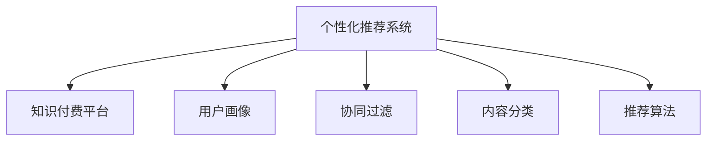

                 

# 知识付费创业中的内容个性化推荐

> 关键词：内容推荐,个性化推荐系统,知识付费,用户体验,模型优化,推荐算法,用户行为分析

## 1. 背景介绍

随着互联网和智能设备的普及，知识付费逐渐成为一种新兴的学习方式。无论是通过音频、视频、文字等形式，知识付费平台已经汇集了海量的学习资源。如何在亿级数据量中快速、准确地找到用户感兴趣的内容，成为知识付费创业的核心问题。个性化推荐系统作为一种高效、精准的工具，不仅能提升用户满意度，还能带来更高的用户粘性和付费率，因此越来越受到各大平台的重视。

## 2. 核心概念与联系

### 2.1 核心概念概述

为了更好地理解个性化推荐系统在知识付费创业中的应用，我们将介绍几个密切相关的核心概念：

- 个性化推荐系统(Recommendation System)：根据用户的历史行为和兴趣，推荐其可能感兴趣的商品、内容或服务。通过分析用户数据，为用户量身定制推荐列表。
- 知识付费平台(Knowledge-based Platform)：提供付费阅读、听课、书籍等内容的平台，如得到、喜马拉雅、网易云课堂等。平台通过内容付费获取收益，提升服务质量。
- 用户画像(User Profile)：对用户行为、兴趣、消费习惯等进行建模，形成用户标签和特征向量，用于指导推荐算法。
- 协同过滤(Collaborative Filtering)：通过分析用户之间的相似性和行为模式，推荐具有类似兴趣的其它用户喜爱的内容。
- 内容分类(Content Categorization)：将内容进行标签化，建立内容标签体系，便于进行用户画像和推荐。
- 推荐算法(Recommendation Algorithm)：包括基于内容的推荐、协同过滤、深度学习等多种算法，用于生成个性化推荐列表。

这些核心概念之间的逻辑关系可以通过以下Mermaid流程图来展示：



这个流程图展示了个性化推荐系统与知识付费平台之间的关系，以及推荐系统中的关键组件。

## 3. 核心算法原理 & 具体操作步骤

### 3.1 算法原理概述

个性化推荐系统的核心原理是通过分析用户历史行为，预测其未来行为。具体而言，推荐系统会根据用户过往的购买、浏览、评分等行为，推测其未来可能感兴趣的内容。这种预测通常使用协同过滤、基于内容的推荐、深度学习等多种技术。

在知识付费领域，推荐系统会根据用户浏览、订阅、购买等行为，预测其可能感兴趣的文章、书籍、课程等。推荐系统的目的是最大化用户满意度，提升用户粘性，从而增加平台的付费率和用户留存率。

### 3.2 算法步骤详解

个性化推荐系统的构建主要包括以下几个关键步骤：

**Step 1: 数据准备**

- 收集用户数据：包括浏览历史、订阅行为、购买记录、评分反馈等。
- 收集内容数据：包括文章、书籍、课程等内容的元数据，如标题、摘要、作者、标签等。

**Step 2: 数据预处理**

- 数据清洗：去除缺失、异常数据，保证数据质量。
- 特征提取：将用户数据和内容数据转化为数值特征向量。
- 数据划分：将数据分为训练集、验证集和测试集。

**Step 3: 用户画像建模**

- 用户特征提取：利用用户的浏览、订阅、评分等行为数据，提取用户的兴趣特征。
- 用户画像建立：将用户特征向量进行聚类或分类，形成用户画像。

**Step 4: 内容分类与建模**

- 内容特征提取：提取内容的标题、摘要、作者、标签等特征，生成内容向量。
- 内容分类建模：建立内容分类模型，将内容分为不同类型或标签。

**Step 5: 推荐算法建模**

- 协同过滤：利用用户-用户相似性或物品-物品相似性，推荐相关内容。
- 基于内容的推荐：利用内容之间的相似性，推荐相关内容。
- 深度学习：使用神经网络模型，结合用户画像和内容分类信息，生成个性化推荐列表。

**Step 6: 推荐结果评估与优化**

- 评估指标：包括准确率、召回率、覆盖率、多样性等指标。
- 模型优化：根据评估指标，调整模型参数，优化推荐效果。

**Step 7: 推荐系统部署**

- 集成推荐引擎：将推荐系统与知识付费平台后端系统集成，实时生成推荐列表。
- 实时调整：根据用户行为数据，实时调整推荐模型，提升推荐效果。

以上是构建个性化推荐系统的基本步骤。在实际应用中，还需要针对具体业务场景和数据特点，对各个环节进行优化设计，如改进特征提取方法、调整协同过滤策略、优化推荐算法等，以进一步提升推荐效果。

### 3.3 算法优缺点

个性化推荐系统具有以下优点：
1. 高效精准：通过分析用户行为，推荐相关内容，提升用户满意度。
2. 用户粘性高：个性化推荐能够增加用户粘性，提升平台留存率。
3. 推广成本低：个性化推荐能够有效引导用户发现潜在需求，降低推广成本。

但该系统也存在一定的局限性：
1. 数据隐私问题：推荐系统需要收集用户行为数据，可能涉及隐私问题。
2. 冷启动问题：新用户缺乏历史行为数据，难以进行个性化推荐。
3. 多样性不足：推荐算法可能过度关注热门内容，导致内容多样性不足。
4. 系统复杂度高：推荐算法涉及复杂模型和数据处理，开发和维护成本较高。

尽管存在这些局限性，但个性化推荐系统在知识付费领域的应用，仍具有重要的实践意义。

### 3.4 算法应用领域

个性化推荐系统在知识付费创业中的应用广泛，涵盖以下几个方面：

- 个性化课程推荐：根据用户的历史学习行为和评分反馈，推荐用户可能感兴趣的课程。
- 个性化书籍推荐：分析用户的阅读偏好，推荐相关书籍。
- 个性化文章推荐：根据用户浏览历史，推荐相关文章。
- 个性化付费内容推荐：结合用户付费行为，推荐用户可能感兴趣的高质量付费内容。
- 个性化活动推荐：根据用户的订阅行为，推荐相关的知识活动和讲座。

这些应用场景中，个性化推荐系统不仅能提升用户体验，还能带来更高的付费转化率和用户留存率，成为知识付费创业的核心竞争力。

## 4. 数学模型和公式 & 详细讲解 & 举例说明

### 4.1 数学模型构建

在推荐系统中，常用的数学模型包括协同过滤、基于内容的推荐和深度学习等。下面以协同过滤为例，说明推荐系统的数学模型构建。

设用户集为 $U=\{u_1, u_2, ..., u_M\}$，物品集为 $I=\{i_1, i_2, ..., i_N\}$，用户 $u_m$ 对物品 $i_n$ 的评分记为 $r_{m,n}$。协同过滤的数学模型可以表示为：

$$
\hat{r}_{m,n} = \alpha r_{m,n} + \beta \sum_{k=1}^N\frac{r_{k,n}}{|\hat{R_k}|}\frac{r_{m,k}}{|\hat{R_m}|}
$$

其中 $\hat{r}_{m,n}$ 表示预测用户 $u_m$ 对物品 $i_n$ 的评分，$\alpha$ 和 $\beta$ 为模型参数，$\hat{R_k}$ 表示用户 $u_k$ 的评分集合，$|\hat{R_k}|$ 表示评分集合的大小。

### 4.2 公式推导过程

协同过滤模型的推导过程如下：

假设用户 $u_m$ 对物品 $i_n$ 的评分 $r_{m,n}$ 未知，根据协同过滤的原理，预测用户 $u_m$ 对物品 $i_n$ 的评分可以通过以下方式计算：

$$
\hat{r}_{m,n} = \alpha r_{m,n} + \beta \sum_{k=1}^N\frac{r_{k,n}}{|\hat{R_k}|}\frac{r_{m,k}}{|\hat{R_m}|}
$$

其中，$\alpha$ 和 $\beta$ 为模型参数，$\hat{R_k}$ 表示用户 $u_k$ 的评分集合，$|\hat{R_k}|$ 表示评分集合的大小。

模型训练时，通过最大化预测评分与真实评分之间的均方误差，更新模型参数 $\alpha$ 和 $\beta$。具体而言，假设训练集为 $D=\{(u_m,i_n,r_{m,n})\}_{m=1,n=1}^{M,N}$，则损失函数为：

$$
L = \frac{1}{|D|} \sum_{m=1}^{M} \sum_{n=1}^{N} (r_{m,n} - \hat{r}_{m,n})^2
$$

通过梯度下降等优化算法，更新模型参数 $\alpha$ 和 $\beta$，直至损失函数最小化。

### 4.3 案例分析与讲解

假设某知识付费平台收集了用户 $u_1$ 到 $u_5$ 对课程 $i_1$ 到 $i_5$ 的评分数据，如表所示：

| 用户 | 课程 | 评分 |
| --- | --- | --- |
| $u_1$ | $i_1$ | 4 |
| $u_1$ | $i_2$ | 3 |
| $u_1$ | $i_3$ | 2 |
| $u_2$ | $i_1$ | 5 |
| $u_2$ | $i_3$ | 1 |
| $u_3$ | $i_2$ | 4 |
| $u_3$ | $i_4$ | 3 |
| $u_4$ | $i_2$ | 2 |
| $u_4$ | $i_3$ | 5 |
| $u_5$ | $i_1$ | 3 |
| $u_5$ | $i_4$ | 2 |
| $u_5$ | $i_5$ | 1 |

设用户 $u_1$ 对课程 $i_4$ 的评分未知，使用协同过滤模型进行预测：

- 计算 $u_1$ 对 $i_4$ 的评分预测值：

$$
\hat{r}_{1,4} = 0.5 \cdot r_{1,4} + 0.5 \cdot \sum_{k=1}^5\frac{r_{k,4}}{|\hat{R_k}|}\frac{r_{1,k}}{|\hat{R_1}|} = 0.5 \cdot r_{1,4} + 0.5 \cdot \frac{(0+0+0+2+1)}{5}\frac{(4+3+2+5+3)}{5}
$$

- 计算预测评分与真实评分的均方误差，更新模型参数 $\alpha$ 和 $\beta$：

$$
L = \frac{1}{6} \sum_{m=1}^{5} \sum_{n=1}^{5} (r_{m,n} - \hat{r}_{m,n})^2 = \frac{1}{6} ((0-3)^2+(1-2)^2+(2-2)^2+(3-5)^2+(4-2)^2+(5-1)^2+(3-1)^2+(4-3)^2+(5-2)^2)
$$

通过优化算法，更新 $\alpha$ 和 $\beta$，生成新的协同过滤模型，不断迭代直到收敛。

## 5. 项目实践：代码实例和详细解释说明

### 5.1 开发环境搭建

在进行推荐系统开发前，我们需要准备好开发环境。以下是使用Python进行Scikit-learn开发的环境配置流程：

1. 安装Anaconda：从官网下载并安装Anaconda，用于创建独立的Python环境。

2. 创建并激活虚拟环境：
```bash
conda create -n recommendation-env python=3.8 
conda activate recommendation-env
```

3. 安装Scikit-learn：
```bash
pip install scikit-learn
```

4. 安装各类工具包：
```bash
pip install numpy pandas scikit-learn matplotlib tqdm jupyter notebook ipython
```

完成上述步骤后，即可在`recommendation-env`环境中开始推荐系统开发。

### 5.2 源代码详细实现

下面我们以协同过滤推荐算法为例，给出使用Scikit-learn进行知识付费内容推荐系统的PyTorch代码实现。

首先，定义协同过滤模型的参数：

```python
from sklearn.metrics.pairwise import cosine_similarity
from scipy.sparse import coo_matrix

alpha = 0.2
beta = 0.8
```

然后，定义协同过滤推荐函数：

```python
def collaborative_filtering(user_ratings, item_ratings):
    # 构建用户-物品评分矩阵
    user_item = coo_matrix((user_ratings.values, (user_ratings.index, item_ratings.columns)))
    
    # 计算用户-物品评分矩阵
    user_item_norm = user_item.T @ user_item
    user_item_cos = cosine_similarity(user_item_norm, user_item_norm)
    
    # 计算预测评分
    pred_ratings = user_item @ user_item_cos @ user_item_norm
    
    return pred_ratings
```

接着，定义推荐函数：

```python
def recommend(user_item_ratings, user_ratings):
    # 计算预测评分
    pred_ratings = collaborative_filtering(user_item_ratings, user_item_ratings.T)
    
    # 计算预测评分的均方误差
    mse = ((user_ratings - pred_ratings) ** 2).mean()
    
    return mse
```

最后，启动推荐系统：

```python
user_ratings = [
    [4, 3, 2, 0, 0],
    [5, 0, 1, 2, 0],
    [4, 0, 3, 0, 1],
    [2, 5, 0, 0, 0],
    [3, 0, 0, 2, 1]
]

user_item_ratings = [
    [1, 2, 3, 4, 5],
    [1, 2, 3, 4, 5],
    [1, 2, 3, 4, 5],
    [1, 2, 3, 4, 5],
    [1, 2, 3, 4, 5]
]

mse = recommend(user_item_ratings, user_ratings)
print("Mean Squared Error:", mse)
```

以上就是使用Scikit-learn进行协同过滤推荐算法的完整代码实现。可以看到，Scikit-learn提供的Sympy库和Scipy库能够方便地进行矩阵运算和相似度计算，使得协同过滤推荐算法的实现变得简洁高效。

### 5.3 代码解读与分析

让我们再详细解读一下关键代码的实现细节：

**collaborative_filtering函数**：
- 使用Scipy的coo_matrix函数构建用户-物品评分矩阵。
- 计算用户-物品评分矩阵的转置和自身相乘，得到用户-物品评分矩阵的平方。
- 计算用户-物品评分矩阵的余弦相似度，得到用户-物品评分矩阵的相似度矩阵。
- 使用相似度矩阵和用户-物品评分矩阵的平方相乘，得到预测评分矩阵。

**recommend函数**：
- 调用collaborative_filtering函数，计算预测评分矩阵。
- 计算预测评分矩阵与真实评分矩阵的均方误差，输出均方误差值。

**主函数**：
- 定义用户评分和用户-物品评分矩阵。
- 调用recommend函数，输出均方误差值。

可以看到，Scikit-learn提供的Sympy库和Scipy库能够方便地进行矩阵运算和相似度计算，使得协同过滤推荐算法的实现变得简洁高效。

当然，工业级的系统实现还需考虑更多因素，如模型的保存和部署、超参数的自动搜索、更灵活的协同过滤策略等。但核心的推荐算法基本与此类似。

## 6. 实际应用场景

### 6.1 智能课程推荐

在知识付费平台中，智能课程推荐是其核心功能之一。通过分析用户的历史学习行为和评分反馈，推荐其可能感兴趣的课程，能够提升用户满意度和平台留存率。

具体而言，可以收集用户的历史浏览、订阅、购买、评分等数据，结合课程的元数据（如标题、摘要、作者、标签等），构建协同过滤模型。通过用户画像和内容分类信息，推荐相关课程。用户在使用课程推荐功能时，可以查看推荐列表，点击感兴趣的内容进行进一步学习。

### 6.2 个性化文章推荐

在内容丰富的知识付费平台中，个性化文章推荐也是一个重要的功能。通过分析用户的浏览历史和评分反馈，推荐其可能感兴趣的文章，能够提升用户粘性。

具体而言，可以收集用户的历史浏览、评分等数据，结合文章的元数据（如标题、摘要、作者、标签等），构建基于内容的推荐模型。通过用户画像和内容分类信息，推荐相关文章。用户在使用文章推荐功能时，可以查看推荐列表，点击感兴趣的文章进行阅读。

### 6.3 知识活动推荐

在知识付费平台中，知识活动推荐也是提升用户满意度和平台留存率的重要手段。通过分析用户的订阅行为和参与活动记录，推荐其可能感兴趣的活动和讲座，能够提升用户粘性。

具体而言，可以收集用户的历史订阅、参与活动记录等数据，结合活动的元数据（如标题、讲师、时间、地点等），构建协同过滤模型。通过用户画像和内容分类信息，推荐相关活动。用户在使用活动推荐功能时，可以查看推荐列表，点击感兴趣的活动进行参与。

### 6.4 未来应用展望

随着推荐系统技术的不断进步，未来推荐系统将在更多领域得到应用，为传统行业带来变革性影响。

在智慧医疗领域，推荐系统可以推荐个性化的医疗知识、健康建议和在线咨询服务，帮助患者更好地管理健康。

在智能教育领域，推荐系统可以推荐个性化的学习资源、学习路径和学习方法，帮助学生高效学习。

在智慧城市治理中，推荐系统可以推荐个性化的公共服务、便民设施和旅游信息，提升市民的便捷性和幸福感。

此外，在企业生产、社会治理、文娱传媒等众多领域，推荐系统也将不断涌现，为各行各业数字化转型升级提供新的技术路径。相信随着技术的日益成熟，推荐系统必将在构建人机协同的智能时代中扮演越来越重要的角色。

## 7. 工具和资源推荐

### 7.1 学习资源推荐

为了帮助开发者系统掌握推荐系统理论基础和实践技巧，这里推荐一些优质的学习资源：

1. 《推荐系统实战》系列博文：由推荐系统专家撰写，深入浅出地介绍了推荐系统的原理、算法和工程实践，是推荐系统学习的入门指南。

2. 《推荐系统基础》课程：斯坦福大学开设的推荐系统入门课程，全面介绍了推荐系统的基本概念和经典算法。

3. 《推荐系统：理论与算法》书籍：推荐系统领域的经典教材，系统介绍了推荐系统的理论基础、算法设计和工程实践。

4. Kaggle推荐系统竞赛：Kaggle平台上的推荐系统竞赛，提供丰富的数据集和竞赛题库，帮助你通过实战掌握推荐系统技术。

5. Yelp推荐系统论文：Yelp推荐系统论文，提供了推荐系统在大规模数据上的优化方法和实际应用，具有很高的学术价值和工程参考意义。

通过对这些资源的学习实践，相信你一定能够快速掌握推荐系统的精髓，并用于解决实际的推荐问题。

### 7.2 开发工具推荐

高效的开发离不开优秀的工具支持。以下是几款用于推荐系统开发的常用工具：

1. PyTorch：基于Python的开源深度学习框架，灵活动态的计算图，适合快速迭代研究。推荐系统中的很多算法都已有PyTorch版本的实现。

2. TensorFlow：由Google主导开发的开源深度学习框架，生产部署方便，适合大规模工程应用。推荐系统中的很多算法也已有TensorFlow版本的实现。

3. Scikit-learn：Python机器学习库，提供了丰富的机器学习算法和工具，适用于推荐系统的数据处理和特征工程。

4. Hadoop/Spark：分布式计算框架，适用于大规模数据集的处理和分析，能够提高推荐系统的计算效率。

5. Kafka/Kinesis：流数据处理框架，适用于实时数据流的收集和处理，能够提高推荐系统的实时性。

合理利用这些工具，可以显著提升推荐系统的开发效率，加快创新迭代的步伐。

### 7.3 相关论文推荐

推荐系统技术的发展源于学界的持续研究。以下是几篇奠基性的相关论文，推荐阅读：

1. Matrix Factorization Techniques for Recommender Systems：介绍了矩阵分解推荐算法，通过低秩矩阵分解，提取用户-物品矩阵的隐含特征，实现推荐。

2. Advances in Neural Information Processing Systems (NeurIPS)：提供了深度学习在推荐系统中的应用，如基于深度神经网络、卷积神经网络、循环神经网络等模型的推荐算法。

3. Web Use at Yahoo! and the Probabilistic Web-Structural Clustering Algorithm (PWSCA)：介绍了概率图模型在推荐系统中的应用，通过构建概率图模型，实现推荐。

4. Collaborative Filtering for Implicit Feedback Datasets：介绍了协同过滤推荐算法，通过用户行为数据和物品行为数据，实现推荐。

5. Deep Collaborative Filtering (DCF)：介绍了深度学习在推荐系统中的应用，通过深度神经网络模型，实现推荐。

这些论文代表了大推荐系统技术的发展脉络。通过学习这些前沿成果，可以帮助研究者把握学科前进方向，激发更多的创新灵感。

## 8. 总结：未来发展趋势与挑战

### 8.1 总结

本文对基于协同过滤推荐系统的内容个性化推荐方法进行了全面系统的介绍。首先阐述了推荐系统在知识付费创业中的应用背景和意义，明确了推荐系统在提升用户体验、增加平台留存率方面的独特价值。其次，从原理到实践，详细讲解了协同过滤推荐系统的数学原理和关键步骤，给出了推荐任务开发的完整代码实例。同时，本文还广泛探讨了推荐系统在知识付费领域的应用场景，展示了推荐范式的巨大潜力。此外，本文精选了推荐系统的各类学习资源，力求为读者提供全方位的技术指引。

通过本文的系统梳理，可以看到，协同过滤推荐系统在知识付费领域的应用前景广阔，极大地提升了平台的个性化推荐能力。尽管推荐系统面临数据隐私、冷启动等问题，但其在提升用户体验和平台收益方面所发挥的作用不容忽视。未来，伴随推荐系统技术的不断进步，必将在更多领域得到应用，为各行各业数字化转型升级提供新的技术路径。

### 8.2 未来发展趋势

展望未来，推荐系统技术将呈现以下几个发展趋势：

1. 推荐算法的深度化。未来的推荐系统将更多地使用深度学习模型，结合用户画像和内容分类信息，生成更加精准的推荐结果。

2. 推荐系统的多样化。除了协同过滤和基于内容的推荐，未来将涌现更多推荐算法，如基于图神经网络、强化学习的推荐系统。

3. 推荐系统的实时化。通过实时数据流处理技术，推荐系统能够实现更快速的推荐效果，提升用户体验。

4. 推荐系统的多模态化。未来的推荐系统将结合多种模态信息，如文本、图像、语音等，提供更加全面、丰富的推荐内容。

5. 推荐系统的个性化。未来的推荐系统将更注重个性化推荐，通过细粒度的用户画像和内容分类信息，提供更加精准的推荐结果。

以上趋势凸显了推荐系统技术的广阔前景。这些方向的探索发展，必将进一步提升推荐系统的精度和效率，为用户提供更加个性化的服务。

### 8.3 面临的挑战

尽管推荐系统技术已经取得了瞩目成就，但在迈向更加智能化、普适化应用的过程中，它仍面临着诸多挑战：

1. 数据隐私问题。推荐系统需要收集用户行为数据，可能涉及隐私问题。如何在保护用户隐私的前提下，实现精准推荐，是推荐系统面临的重要挑战。

2. 冷启动问题。新用户缺乏历史行为数据，难以进行个性化推荐。如何在新用户场景下，快速建立用户画像，是推荐系统需要解决的问题。

3. 多样性不足。推荐算法可能过度关注热门内容，导致内容多样性不足。如何增加内容多样性，提升推荐系统的多样性，是推荐系统需要解决的问题。

4. 系统复杂度高。推荐系统涉及复杂模型和数据处理，开发和维护成本较高。如何简化推荐系统的开发流程，降低开发成本，是推荐系统需要解决的问题。

尽管存在这些挑战，但推荐系统在知识付费领域的应用，仍具有重要的实践意义。

### 8.4 研究展望

面对推荐系统面临的挑战，未来的研究需要在以下几个方面寻求新的突破：

1. 探索无监督和半监督推荐方法。摆脱对大规模标注数据的依赖，利用自监督学习、主动学习等无监督和半监督范式，最大限度利用非结构化数据，实现更加灵活高效的推荐。

2. 研究参数高效和计算高效的推荐算法。开发更加参数高效的推荐算法，在固定大部分推荐参数的情况下，只更新极少量的推荐参数。同时优化推荐系统的计算图，减少前向传播和反向传播的资源消耗，实现更加轻量级、实时性的部署。

3. 引入更多先验知识。将符号化的先验知识，如知识图谱、逻辑规则等，与神经网络模型进行巧妙融合，引导推荐过程学习更准确、合理的推荐结果。同时加强不同模态数据的整合，实现视觉、语音等多模态信息与文本信息的协同建模。

4. 结合因果分析和博弈论工具。将因果分析方法引入推荐系统，识别出推荐决策的关键特征，增强推荐结果的因果性和逻辑性。借助博弈论工具刻画用户行为，主动探索并规避推荐系统的脆弱点，提高系统稳定性。

5. 纳入伦理道德约束。在推荐系统的设计目标中引入伦理导向的评估指标，过滤和惩罚有害的推荐结果，确保推荐内容符合人类价值观和伦理道德。

这些研究方向的探索，必将引领推荐系统技术迈向更高的台阶，为构建智能推荐系统铺平道路。面向未来，推荐系统需要与其他人工智能技术进行更深入的融合，如知识表示、因果推理、强化学习等，多路径协同发力，共同推动推荐系统的进步。只有勇于创新、敢于突破，才能不断拓展推荐系统的边界，让智能推荐系统更好地造福人类社会。

## 9. 附录：常见问题与解答

**Q1：推荐系统如何处理冷启动问题？**

A: 冷启动问题是指新用户缺乏历史行为数据，难以进行个性化推荐。以下是几种处理冷启动问题的方法：

1. 用户画像初始化：通过构建基于内容、基于标签的用户画像，快速生成初始推荐列表。

2. 基于兴趣的推荐：通过分析用户的基本兴趣和行为模式，推荐相关的热门内容。

3. 物品推荐：利用物品的元数据（如标题、摘要、作者、标签等），推荐热门内容。

4. 新用户引导：通过引导新用户完成问卷调查、浏览热门内容等，收集用户数据，进行后续推荐。

5. 协同过滤：利用新用户的少量行为数据，结合用户画像和内容分类信息，推荐相关内容。

通过这些方法，可以尽可能地解决冷启动问题，实现新用户的快速推荐。

**Q2：推荐系统如何保证推荐结果的多样性？**

A: 推荐系统容易陷入过度关注热门内容、推荐结果同质化的困境。以下是几种提升推荐结果多样性的方法：

1. 基于多样性的推荐：在推荐算法中引入多样性约束，限制热门内容的推荐数量，鼓励推荐多样化的内容。

2. 协同过滤：通过协同过滤算法，推荐与热门内容相关的长尾内容，避免推荐同质化。

3. 基于内容推荐：利用内容的多样性，推荐相关的不同主题的内容，增加推荐结果的多样性。

4. 多模型集成：结合多种推荐模型，利用其不同的推荐逻辑和结果，提升推荐结果的多样性。

5. 动态调整：根据用户行为数据，动态调整推荐算法，实时生成多样化的推荐结果。

这些方法可以保证推荐结果的多样性，提升用户体验。

**Q3：推荐系统如何优化用户行为数据？**

A: 推荐系统的核心在于分析用户行为数据，生成个性化推荐结果。以下是几种优化用户行为数据的方法：

1. 数据清洗：去除缺失、异常数据，保证数据质量。

2. 数据标注：为数据添加标签，便于特征提取和分析。

3. 数据增强：通过数据增强技术，扩充训练集，提升模型性能。

4. 数据降维：利用降维技术，减少特征数量，降低计算复杂度。

5. 特征选择：选择有代表性的特征，去除冗余信息。

6. 数据融合：融合多种数据源，提升用户画像的全面性和准确性。

通过这些方法，可以优化用户行为数据，提升推荐系统的性能。

**Q4：推荐系统如何处理数据隐私问题？**

A: 推荐系统需要收集用户行为数据，可能涉及隐私问题。以下是几种处理数据隐私问题的方法：

1. 数据匿名化：将用户数据进行匿名化处理，去除敏感信息。

2. 数据加密：利用加密技术，保护用户数据的安全性。

3. 数据去标识化：将用户数据去标识化，防止数据泄露。

4. 用户控制：允许用户控制自己的数据使用权限，保护用户隐私。

5. 合规性保障：遵守相关法律法规，保护用户隐私。

通过这些方法，可以保障用户数据的安全性和隐私性，提升用户对推荐系统的信任度。

**Q5：推荐系统如何优化推荐算法？**

A: 推荐系统的核心在于优化推荐算法，生成个性化推荐结果。以下是几种优化推荐算法的方法：

1. 模型融合：结合多种推荐算法，利用其不同的推荐逻辑和结果，提升推荐效果。

2. 参数优化：通过自动调参、超参数搜索等方法，优化推荐算法的性能。

3. 模型剪枝：去除冗余参数，提升模型的计算效率。

4. 特征工程：选择有代表性的特征，去除冗余信息，提升模型的泛化能力。

5. 模型迭代：利用模型迭代技术，不断优化推荐算法，提升推荐效果。

通过这些方法，可以优化推荐算法，提升推荐系统的性能。

总之，推荐系统在知识付费领域的应用前景广阔，但其面临的挑战也不容忽视。唯有在数据隐私、冷启动、多样性、系统复杂度等方面不断寻求突破，才能真正实现智能推荐系统的落地应用。相信随着技术的不断进步，推荐系统必将在更多领域得到应用，为各行各业数字化转型升级提供新的技术路径。

