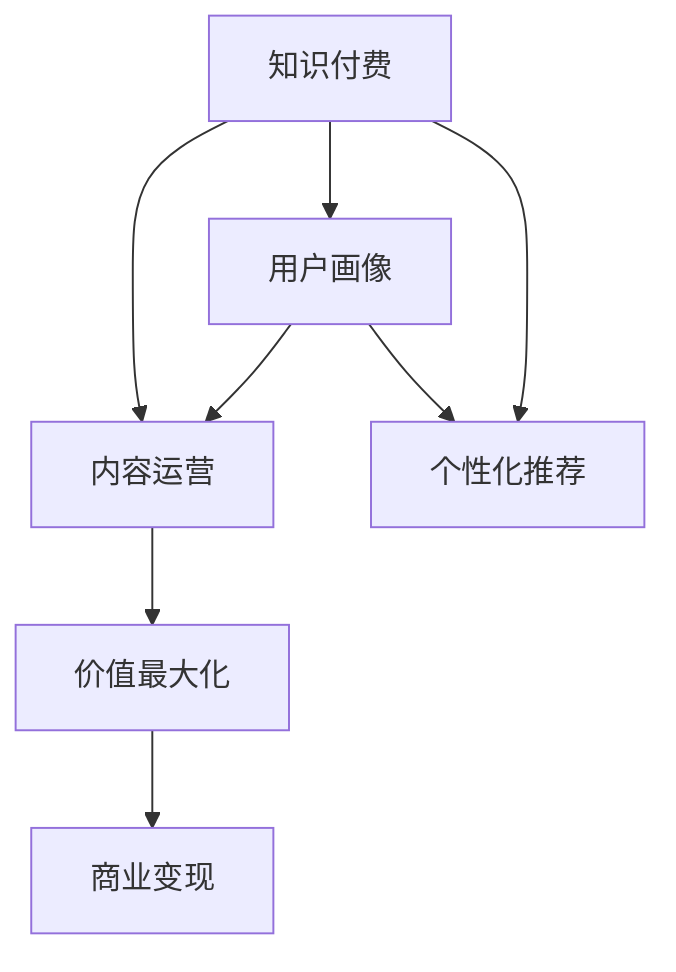

                 

# 知识付费创业中的内容价值最大化

> 关键词：知识付费,内容运营,用户画像,个性化推荐,价值最大化,数据驱动

## 1. 背景介绍

### 1.1 问题由来

随着知识经济时代的到来，知识的价值日益凸显，越来越多的人愿意为获取知识和智慧付出金钱。知识付费平台，如得到、喜马拉雅、罗辑思维等，应运而生，迅速崛起。这些平台为知识生产者提供了展示和变现的机会，也满足了用户求知、求乐、求爱的需求。

然而，面对激烈的市场竞争和有限的优质内容，知识付费平台如何最大化内容价值，提升用户黏性，实现商业可持续发展，成为一个关键问题。

### 1.2 问题核心关键点

如何最大化知识付费平台的内容价值，是平台运营的核心关键点。主要包括以下几个方面：

- 高质量内容的获取：吸引更多优质内容生产者入驻，提供丰富多样的高质量内容。
- 个性化推荐：根据用户画像和行为数据，精准推送个性化的内容，提升用户满意度和黏性。
- 内容变现：通过订阅、广告、付费课程等形式，实现内容的高价值变现。
- 社区运营：构建活跃的用户社区，增强用户互动和粘性。
- 商业变现：通过广告、数据、联盟等多元化商业变现策略，实现平台的经济自给自足。

本文将围绕这些关键点，深入探讨知识付费平台如何最大化内容价值，推动产业升级和用户增长。

## 2. 核心概念与联系

### 2.1 核心概念概述

为更好地理解内容价值最大化的实现路径，本节将介绍几个密切相关的核心概念：

- 知识付费：指用户为获取知识、技能、智慧等信息内容，向内容生产者付费的行为。包括订阅、购买、打赏等多种形式。
- 内容运营：指对平台上的内容进行策划、生产、组织和传播，提升内容质量和用户价值。
- 用户画像：指通过数据分析和挖掘，构建用户特征模型，描述用户行为和需求。
- 个性化推荐：指根据用户画像和行为数据，智能推荐个性化的内容，提升用户体验。
- 价值最大化：指通过合理的运营策略和业务模式，实现内容的高价值变现和平台商业可持续。

这些核心概念之间的逻辑关系可以通过以下Mermaid流程图来展示：



这个流程图展示了这个逻辑链条：

1. 用户通过知识付费平台获取知识。
2. 内容运营团队策划和生产优质内容。
3. 通过用户画像构建，了解用户需求和行为。
4. 利用个性化推荐算法，精准推送内容。
5. 通过多种变现手段，实现内容的价值最大化。
6. 平台通过商业变现，实现自给自足。

## 3. 核心算法原理 & 具体操作步骤
### 3.1 算法原理概述

知识付费平台的内容价值最大化，本质上是一个通过数据分析和算法优化，实现用户价值和平台商业利益最大化的过程。其核心思想是：通过内容运营、用户画像和个性化推荐等手段，将优质内容精准推送给用户，提升用户满意度和粘性，最终实现内容的高价值变现。

形式化地，假设平台的内容集为 $C$，用户集为 $U$，知识变现目标为 $V$。内容价值最大化的目标可以表述为：

$$
\max_{C, U, V} V
$$

其中，$V$ 为目标函数，包括订阅量、收入、用户增长等指标。$C$ 和 $U$ 为优化变量，分别代表平台上的内容集合和用户集合。平台需要不断优化 $C$ 和 $U$，以提升 $V$ 值。

### 3.2 算法步骤详解

基于以上目标，知识付费平台的内容价值最大化一般包括以下几个关键步骤：

**Step 1: 内容生产与策划**

平台需要策划和生产优质的内容，以满足用户需求和兴趣。内容生产者可以是平台的签约讲师、作家、媒体人等，也可以是普通用户。

**Step 2: 用户画像构建**

通过收集和分析用户行为数据，构建用户画像，包括兴趣偏好、学习习惯、消费能力等特征。常用的用户画像构建方法包括统计分析、机器学习等。

**Step 3: 个性化推荐算法**

利用用户画像和行为数据，设计个性化推荐算法，将内容精准推送给用户。推荐算法可以是基于协同过滤、内容推荐、混合推荐等方法，以提升用户满意度。

**Step 4: 内容变现策略**

根据不同用户的行为和偏好，制定多样化的内容变现策略，包括订阅费、广告收入、付费课程等。同时，设计合理的定价策略和促销手段，提升内容变现效果。

**Step 5: 社区运营与互动**

通过构建社区，增强用户之间的互动和粘性。平台可以设计社区活动、线上讨论、互动直播等形式，提升用户参与度和留存率。

**Step 6: 商业变现模式**

平台需要根据自身的定位和用户需求，选择多样化的商业变现模式，如广告联盟、会员增值、数据商业化等。同时，平台需要建立有效的商业变现体系，实现平台的经济自给自足。

### 3.3 算法优缺点

基于数据分析和算法优化的内容价值最大化方法具有以下优点：

- 提升用户满意度：通过个性化推荐，将优质内容精准推送给用户，提升用户黏性和满意度。
- 提升平台收益：通过合理的内容变现策略，实现内容的高价值变现，增加平台收入。
- 促进内容生产：激励更多优质内容生产者入驻，提升平台内容丰富度。

同时，该方法也存在一定的局限性：

- 依赖数据质量：需要高质量的用户行为数据，对数据的收集和处理提出较高要求。
- 算法复杂度：需要设计复杂的推荐算法和变现策略，对技术和运营团队要求较高。
- 用户隐私保护：需要妥善处理用户数据，避免侵犯用户隐私。

尽管存在这些局限性，但就目前而言，基于数据分析和算法优化的内容价值最大化方法仍是最主流和有效的路径。

### 3.4 算法应用领域

基于数据分析和算法优化的内容价值最大化方法，在知识付费平台和其他内容驱动的行业（如电商、新闻、教育等）都有广泛应用，以下是几个典型场景：

- 内容驱动的电商平台：如京东、淘宝等，通过个性化推荐和商品变现策略，提升用户体验和销售额。
- 新闻信息平台：如今日头条、腾讯新闻等，通过用户画像和内容推荐，提升用户留存率和点击率。
- 在线教育平台：如Coursera、Udacity等，通过个性化课程推荐和订阅变现，提升用户学习体验和平台收益。
- 社交媒体平台：如微信、微博等，通过内容推荐和广告变现，提升用户粘性和广告收入。

这些应用场景展示了数据分析和算法优化在提升内容价值方面的强大能力，体现了其在内容驱动行业的普适性。

## 4. 数学模型和公式 & 详细讲解 & 举例说明

### 4.1 数学模型构建

本节将使用数学语言对知识付费平台的内容价值最大化过程进行更加严格的刻画。

记知识付费平台的内容集为 $C$，用户集为 $U$，用户与内容的交互矩阵为 $I$，其中 $I_{i,j}=1$ 表示用户 $i$ 消费了内容 $j$。设内容价值最大化目标为 $V$，包括用户付费订阅量 $A$、内容点击量 $B$、广告收入 $C$ 等指标。则目标函数为：

$$
V(A,B,C) = w_AA + w_BB + w_CC
$$

其中 $w_A, w_B, w_C$ 为权重系数，表示不同指标的重要性。平台需要最小化用户与内容不匹配的误差，最大化内容价值。

### 4.2 公式推导过程

以下我们以用户订阅为例，推导内容价值最大化公式。

假设平台有 $N$ 个内容 $C_1, C_2, ..., C_N$，$M$ 个用户 $U_1, U_2, ..., U_M$，每个用户对内容的需求偏好已知，记为 $D_{i,j}$。则用户 $i$ 订阅内容 $j$ 的概率为：

$$
p_{i,j} = \frac{D_{i,j}}{\sum_k D_{i,k}}
$$

设内容 $j$ 的订阅量为目标 $A_j$，则最大化用户订阅量的目标函数为：

$$
\max_{p_{i,j}} \sum_i A_i \log p_{i,j}
$$

根据最大似然估计，将上述目标函数转化为最大化内容订阅量的概率和：

$$
\max_{A_j} \sum_i A_i \log \frac{A_j}{N}
$$

即最大化内容订阅量的期望值 $A_j$。

将上述目标函数带入拉格朗日乘子法，构建对偶问题：

$$
\max_{A_j} \sum_i A_i \log \frac{A_j}{N} + \lambda (\sum_i A_i - \sum_j A_j)
$$

其中 $\lambda$ 为拉格朗日乘子。通过求导数，得：

$$
A_j = \frac{N \exp(\frac{D_{i,j}}{N})}{\sum_k \exp(\frac{D_{i,k}}{N})}
$$

即内容订阅量的最大化公式。通过不断迭代优化 $A_j$，直至收敛，即可得到最优的内容订阅量。

### 4.3 案例分析与讲解

考虑一个知识付费平台，有 $100$ 个用户和 $50$ 个课程，用户对课程的需求偏好如下表所示：

| 用户 | 课程 | 需求偏好 |
| ---- | ---- | -------- |
| 1    | 1    | 0.8      |
| 1    | 2    | 0.1      |
| 2    | 1    | 0.5      |
| 2    | 3    | 0.3      |
| ...  | ...  | ...      |
| 100  | 50   | 0.2      |

通过上述公式计算，可得每个课程的最优订阅量 $A_1, A_2, ..., A_{50}$，最大化整个平台的订阅量 $A_1+A_2+...+A_{50}$。

## 5. 项目实践：代码实例和详细解释说明
### 5.1 开发环境搭建

在进行内容价值最大化实践前，我们需要准备好开发环境。以下是使用Python进行知识付费平台内容价值最大化算法开发的环境配置流程：

1. 安装Anaconda：从官网下载并安装Anaconda，用于创建独立的Python环境。

2. 创建并激活虚拟环境：
```bash
conda create -n knowledge-platform python=3.8 
conda activate knowledge-platform
```

3. 安装PyTorch：基于Python的开源深度学习框架，用于处理用户画像和推荐算法。

4. 安装TensorFlow：由Google主导开发的开源深度学习框架，用于实现商业变现的复杂模型。

5. 安装Pandas：用于数据处理和分析。

6. 安装NumPy：用于高效矩阵运算。

7. 安装Scikit-learn：用于数据预处理和特征工程。

8. 安装Jupyter Notebook：用于交互式数据科学和机器学习开发。

完成上述步骤后，即可在`knowledge-platform`环境中开始内容价值最大化的实践。

### 5.2 源代码详细实现

下面我们以用户订阅为例，给出使用Python和PyTorch实现知识付费平台内容价值最大化的代码实现。

首先，定义用户需求偏好的矩阵 $D$ 和内容价值目标 $V$：

```python
import numpy as np
import torch
from torch import nn
from torch import optim

# 定义用户和内容的数量
N = 100
M = 50

# 定义用户对内容的偏好
D = np.random.rand(M, N)

# 定义内容价值目标
V = torch.tensor([0.0] * M)

# 定义拉格朗日乘子
lambda_ = torch.tensor([0.0] * M)
```

然后，定义优化器和损失函数：

```python
# 定义拉格朗日目标函数
def lagrangian(D, V, lambda_):
    A = torch.exp(D / N) / (torch.exp(D / N).sum(dim=0))
    return (V * (A / N).log() + lambda_ * (torch.sum(V) - torch.sum(A)))

# 定义优化器
optimizer = optim.SGD([lambda_], lr=0.01)

# 定义损失函数
def loss(D, V, lambda_):
    return lagrangian(D, V, lambda_)
```

接着，定义训练和评估函数：

```python
# 定义训练函数
def train(D, V, lambda_):
    optimizer.zero_grad()
    loss_ = lagrangian(D, V, lambda_)
    loss_.backward()
    optimizer.step()
    return loss_

# 定义评估函数
def evaluate(D, V, lambda_):
    A = torch.exp(D / N) / (torch.exp(D / N).sum(dim=0))
    return A
```

最后，启动训练流程并在测试集上评估：

```python
epochs = 100
batch_size = 100

for epoch in range(epochs):
    loss = train(D, V, lambda_)
    print(f"Epoch {epoch+1}, train loss: {loss:.3f}")
    
    A = evaluate(D, V, lambda_)
    print(f"Epoch {epoch+1}, test A: {A[:20]}")
    
print("Final A:")
A = evaluate(D, V, lambda_)
print(A)
```

以上就是使用PyTorch对知识付费平台内容价值最大化进行代码实现的完整过程。可以看到，PyTorch提供了强大的计算图功能，使得优化算法和损失函数的计算变得非常高效。

### 5.3 代码解读与分析

让我们再详细解读一下关键代码的实现细节：

**Lagrangian函数**：
- 定义了拉格朗日目标函数，其中 $A$ 为内容订阅量的概率和。
- 通过最大化拉格朗日目标函数，即可得到内容订阅量的最大化解。

**优化器**：
- 使用随机梯度下降优化器，调整拉格朗日乘子的值。
- 设置学习率，控制优化过程的收敛速度。

**损失函数**：
- 将拉格朗日目标函数作为损失函数，通过反向传播更新参数。

**训练和评估函数**：
- 训练函数进行单批次梯度下降，更新拉格朗日乘子。
- 评估函数计算内容订阅量的概率和，输出优化结果。

**训练流程**：
- 定义总的迭代次数和批大小，开始循环迭代
- 每个epoch内，在训练集上训练，输出平均损失
- 在测试集上评估，输出优化结果
- 所有epoch结束后，输出最终的优化结果

可以看到，PyTorch提供了完整的深度学习开发环境，使得知识付费平台的内容价值最大化算法开发变得简洁高效。开发者可以将更多精力放在算法优化和业务逻辑上，而不必过多关注底层的实现细节。

当然，工业级的系统实现还需考虑更多因素，如模型的保存和部署、超参数的自动搜索、更灵活的推荐算法等。但核心的内容价值最大化算法基本与此类似。

## 6. 实际应用场景
### 6.1 内容推荐

知识付费平台的核心功能之一是内容推荐，通过个性化推荐，提升用户满意度和留存率。推荐算法设计得越精准，平台的收益和用户体验越高。

在实践中，可以构建用户画像，包括用户基本信息、浏览历史、学习进度等。利用协同过滤、内容推荐、混合推荐等方法，对用户进行个性化推荐。推荐算法可以是基于矩阵分解、深度学习等方法，提升推荐效果。

### 6.2 用户增长

用户增长是知识付费平台的另一大关键指标。通过精准的推荐和多样化的内容变现策略，平台可以吸引更多用户订阅和付费。

在实践中，可以通过A/B测试、用户调研等方式，不断优化推荐算法和变现策略，提升用户增长率。同时，设计多种引流手段，如折扣活动、免费试用等，吸引新用户。

### 6.3 商业变现

商业变现是知识付费平台的核心商业模式。通过订阅费、广告收入、付费课程等变现方式，平台可以实现盈利。

在实践中，平台需要设计合理的定价策略和促销手段，如折扣、组合订阅等。同时，与第三方广告平台合作，提高广告收入。设计合理的商业变现体系，实现平台的经济自给自足。

### 6.4 未来应用展望

随着知识付费平台的不断壮大，未来内容价值最大化的应用将更加多样化：

1. 社交网络分析：利用知识付费平台的用户数据，进行社交网络分析，提升用户粘性和平台影响力。
2. 个性化内容创作：利用用户画像和行为数据，指导内容生产者创作更多符合用户需求的内容。
3. 教育公平：利用知识付费平台，为偏远地区和贫困学生提供更多教育资源，推动教育公平。
4. 商业联盟：与更多内容和服务提供商合作，形成商业联盟，提供更多元化的内容和服务。

此外，随着技术的不断进步，知识付费平台的内容价值最大化技术也将不断创新，为平台带来更多的商业机会和用户价值。

## 7. 工具和资源推荐
### 7.1 学习资源推荐

为了帮助开发者系统掌握知识付费平台的内容价值最大化理论基础和实践技巧，这里推荐一些优质的学习资源：

1. 《推荐系统实践》系列博文：由大模型技术专家撰写，深入浅出地介绍了推荐系统的原理、算法和应用。

2. Coursera《推荐系统》课程：斯坦福大学开设的推荐系统课程，涵盖推荐系统基础、协同过滤、矩阵分解等核心概念。

3. KDD《推荐系统》论文集：收录了大量推荐系统的经典论文，可系统了解推荐算法的发展历程和前沿研究方向。

4. Kaggle推荐系统竞赛：参与实际推荐系统竞赛，深入理解推荐算法的应用和优化。

5. Weights & Biases：模型训练的实验跟踪工具，可以记录和可视化模型训练过程中的各项指标，方便对比和调优。

通过对这些资源的学习实践，相信你一定能够快速掌握知识付费平台内容价值最大化的精髓，并用于解决实际的运营问题。
###  7.2 开发工具推荐

高效的开发离不开优秀的工具支持。以下是几款用于知识付费平台内容价值最大化开发的常用工具：

1. Python：基于解释型的动态语言，开发效率高，易读易维护。是知识付费平台内容价值最大化算法开发的首选语言。

2. PyTorch：基于Python的开源深度学习框架，提供强大的计算图功能，支持高效的推荐算法开发。

3. TensorFlow：由Google主导开发的开源深度学习框架，生产部署方便，适合大规模工程应用。

4. Pandas：用于数据处理和分析，提供丰富的数据结构和操作函数。

5. NumPy：用于高效矩阵运算，提供高性能的数值计算能力。

6. Scikit-learn：用于数据预处理和特征工程，提供多种机器学习算法。

7. Jupyter Notebook：交互式数据科学和机器学习开发环境，支持代码块和文本混合编辑。

合理利用这些工具，可以显著提升知识付费平台内容价值最大化的开发效率，加快创新迭代的步伐。

### 7.3 相关论文推荐

知识付费平台内容价值最大化的研究源于学界的持续研究。以下是几篇奠基性的相关论文，推荐阅读：

1. ALS: The Alternating Least Squares Algorithm for Collaborative Filtering（ALS算法）：提出基于矩阵分解的协同过滤推荐算法，成为推荐系统的经典方法之一。

2. Deep Collaborative Filtering（Deep CF）：提出基于深度学习的推荐系统，使用多层神经网络进行协同过滤，提高推荐效果。

3. Netflix Prize：通过Kaggle竞赛，推动推荐系统领域的快速发展，提出了多种推荐算法和优化方法。

4. Multi-view Recommendation Model（多视角推荐模型）：提出多视角融合的推荐方法，提升推荐系统的泛化性和鲁棒性。

5. Fast Matrix Factorization（快速矩阵分解）：提出基于梯度下降的矩阵分解方法，提高推荐系统的训练效率。

这些论文代表了大语言模型微调技术的发展脉络。通过学习这些前沿成果，可以帮助研究者把握学科前进方向，激发更多的创新灵感。

## 8. 总结：未来发展趋势与挑战
### 8.1 总结

本文对知识付费平台的内容价值最大化进行了全面系统的介绍。首先阐述了内容价值最大化的重要性和实现路径，明确了推荐算法、用户画像、内容生产等关键环节的作用。其次，从原理到实践，详细讲解了内容价值最大化的数学模型和核心算法步骤，给出了知识付费平台内容价值最大化的完整代码实例。同时，本文还广泛探讨了内容价值最大化的应用场景，展示了其在知识付费平台和其他内容驱动行业中的广泛应用前景。最后，精选了相关学习资源、开发工具和前沿论文，力求为读者提供全方位的技术指引。

通过本文的系统梳理，可以看到，知识付费平台的内容价值最大化方法，通过数据驱动的个性化推荐和多样化内容变现策略，极大地提升了平台的经济效益和用户体验。这种基于数据分析和算法优化的内容运营模式，已经成为知识付费平台运营的核心手段，并将继续引领行业趋势。

### 8.2 未来发展趋势

展望未来，知识付费平台的内容价值最大化将呈现以下几个发展趋势：

1. 深度学习技术应用。随着深度学习技术的发展，推荐算法将更加智能化和精准化，通过神经网络学习用户行为和内容特征，提升推荐效果。

2. 用户画像和行为分析。通过更多维度的用户画像和行为数据，构建更全面、更精准的用户画像，提高个性化推荐的准确性。

3. 内容多样化和动态化。通过设计多样化的内容形式和动态更新的内容策略，满足不同用户的多样化需求。

4. 跨平台协同推荐。通过跨平台的协同推荐和数据共享，提高推荐系统的覆盖率和推荐效果。

5. 商业变现多元化。通过多元化商业变现策略，如数据商业化、知识付费、广告联盟等，实现平台的经济自给自足。

以上趋势凸显了知识付费平台内容价值最大化技术的广阔前景。这些方向的探索发展，将进一步提升平台的经济效益和用户体验，推动知识付费行业的持续发展。

### 8.3 面临的挑战

尽管知识付费平台的内容价值最大化技术已经取得了瞩目成就，但在迈向更加智能化、普适化应用的过程中，它仍面临着诸多挑战：

1. 数据质量和隐私保护。需要高质量的数据收集和处理，同时确保用户数据隐私，避免侵犯用户隐私。

2. 算法复杂度和模型优化。需要设计复杂的多模态推荐算法和优化方法，对技术和运营团队要求较高。

3. 用户粘性和留存率提升。需要在提升推荐精准性的同时，保持用户粘性和留存率，避免过度推荐。

4. 商业变现和平台盈利。需要设计合理的商业变现策略，平衡内容变现和平台收益，避免过度商业化。

5. 用户情感和价值观引导。需要在推荐算法中考虑用户情感和价值观，引导平台输出健康、有益的内容。

6. 内容生产者的激励和协调。需要设计合理的激励机制，协调内容生产者与平台之间的关系，提升内容质量。

这些挑战需要平台运营者不断创新和优化，才能实现内容价值最大化的可持续发展和用户价值的最大化提升。

### 8.4 研究展望

面对知识付费平台内容价值最大化所面临的种种挑战，未来的研究需要在以下几个方面寻求新的突破：

1. 多模态协同推荐。将视觉、听觉等多模态数据与文本数据结合，提升推荐系统的泛化性和鲁棒性。

2. 上下文感知推荐。考虑用户行为和内容特征的上下文信息，提高推荐系统的个性化和相关性。

3. 知识驱动推荐。将知识图谱、逻辑规则等先验知识融入推荐系统，提升推荐系统的内容质量和可信度。

4. 社交网络推荐。利用社交网络分析技术，构建用户关系和社区网络，提升推荐系统的社交效应和用户粘性。

5. 公平推荐。设计公平推荐算法，避免算法偏见和数据歧视，提升推荐系统的公平性和普适性。

这些研究方向和创新方向，将引领知识付费平台内容价值最大化的进一步发展，推动知识付费行业的持续创新和升级。相信随着技术的不断进步，知识付费平台的内容价值最大化方法将不断优化，为平台带来更多的经济效益和用户价值。

## 9. 附录：常见问题与解答

**Q1：知识付费平台如何平衡内容推荐和商业变现？**

A: 知识付费平台需要设计合理的商业变现策略，平衡内容推荐和商业变现。

1. 多样化的变现方式：除了广告收入，还可以考虑订阅费、付费课程、知识付费等多种变现方式，满足不同用户的需求。

2. 合理定价和促销：设计合理的定价策略和促销手段，如折扣、组合订阅等，提升用户支付意愿和粘性。

3. 内容质量和推荐精准性：通过提升内容质量和推荐精准性，吸引更多用户订阅和付费，提高变现效果。

4. 用户反馈和迭代：根据用户反馈不断优化推荐算法和商业策略，提升用户体验和平台收益。

5. 数据驱动和算法优化：通过数据驱动的个性化推荐和算法优化，提升内容价值和用户满意度。

总之，知识付费平台需要设计合理的商业模式和变现策略，同时不断优化推荐算法和内容质量，才能平衡内容推荐和商业变现，实现平台的经济自给自足。

**Q2：知识付费平台如何提升用户粘性和留存率？**

A: 知识付费平台需要通过多种手段提升用户粘性和留存率：

1. 个性化推荐：通过精准的个性化推荐，提升用户满意度和留存率。

2. 优质内容生产：提供丰富多样的优质内容，满足用户的多样化需求。

3. 社区运营和互动：构建活跃的用户社区，增强用户之间的互动和粘性。

4. 用户调研和反馈：通过用户调研和反馈，不断优化推荐算法和平台功能，提升用户体验。

5. 社交网络效应：利用社交网络分析技术，构建用户关系和社区网络，提高用户粘性。

6. 多样化的社区活动：设计多样化的社区活动，如线上讨论、互动直播等，增强用户参与度和留存率。

总之，知识付费平台需要通过个性化推荐、优质内容生产、社区运营和互动等多种手段，提升用户粘性和留存率，实现平台的长期发展。

**Q3：知识付费平台如何设计公平推荐算法？**

A: 知识付费平台需要设计公平推荐算法，避免算法偏见和数据歧视，提升推荐系统的公平性和普适性：

1. 数据预处理：在数据预处理阶段，进行数据清洗和特征工程，去除偏见数据和噪音。

2. 公平推荐算法：设计公平推荐算法，如消除算法偏见、平衡用户间公平性等。

3. 用户画像多样化：通过构建多样化的用户画像，避免基于特定用户群体的推荐偏见。

4. 用户反馈和迭代：通过用户反馈不断优化推荐算法，提升公平性和普适性。

5. 多元推荐策略：设计多元推荐策略，结合多种推荐方法，提升推荐系统的公平性和多样性。

总之，知识付费平台需要通过数据预处理、公平推荐算法、用户画像多样化等多种手段，设计公平推荐算法，避免算法偏见和数据歧视，提升推荐系统的公平性和普适性。

---

作者：禅与计算机程序设计艺术 / Zen and the Art of Computer Programming

