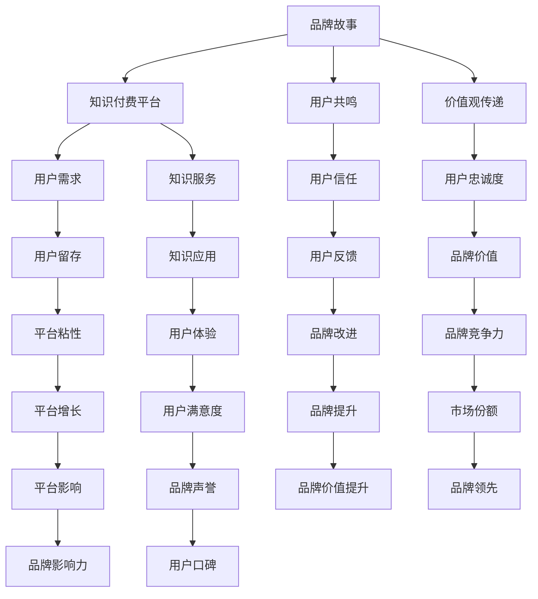

                 

# 知识付费创业中的品牌故事打造

## 1. 背景介绍

在当今知识爆炸的时代，信息洪流给人们带来了无尽的知识，但同时也带来了信息过载的困扰。越来越多的人开始寻求更加精准、高效、系统化的知识获取方式。知识付费平台应运而生，它通过专业的知识服务，将碎片化、泛泛化的知识转化为系统、可操作的智慧。然而，要在知识付费领域脱颖而出，光有优质的内容还不够，还需要打造响亮、可信赖的品牌，让用户在万千知识付费产品中，一眼看到你，选择你。

本文将从品牌故事打造的角度，结合技术手段，探讨如何在知识付费创业中构建具有竞争力的品牌。我们相信，一个吸引用户、赢得用户信任的品牌，能够为知识付费创业注入持续发展的动力。

## 2. 核心概念与联系

### 2.1 核心概念概述

品牌故事（Brand Story）：一个能够激发用户共鸣、传达品牌价值观和愿景的故事，它是品牌与用户之间的桥梁。在知识付费领域，品牌故事能够清晰地传达产品的核心价值，帮助用户理解品牌的使命与愿景，从而建立起用户对品牌的信任和忠诚度。

知识付费平台：基于互联网技术，为用户提供知识服务，帮助其提升自我、实现价值增值的平台。通过将专业知识转化为可操作的智慧，帮助用户解决实际问题。

核心概念之间的关系可以通过以下Mermaid流程图来展示：



这个流程图展示了品牌故事如何通过知识付费平台，与用户需求、知识服务、用户信任、品牌价值、用户留存等多个维度发生联系，最终形成品牌竞争力，带来市场份额和品牌影响力的提升。

## 3. 核心算法原理 & 具体操作步骤
### 3.1 算法原理概述

品牌故事打造的核心在于与用户建立情感连接，让品牌价值观在用户心中生根发芽。这种情感连接可以通过多种技术手段实现，如自然语言处理、推荐系统、个性化广告等。其中，自然语言处理（NLP）在品牌故事创建、传播和理解方面有着重要的应用。

### 3.2 算法步骤详解

品牌故事打造通常包括以下关键步骤：

**Step 1: 确定品牌定位**
- 明确品牌的使命、愿景、价值观，制定品牌故事大纲。
- 分析目标用户群体的需求、兴趣、痛点，确保品牌故事与用户群体产生共鸣。

**Step 2: 构建品牌故事**
- 使用NLP技术，从大量文本数据中挖掘出与品牌相关的关键词、情感倾向、话题热点等。
- 结合品牌定位，利用机器学习和深度学习模型，生成或修改品牌故事文本。

**Step 3: 传播品牌故事**
- 将品牌故事融入到产品介绍、营销文案、社交媒体、客户服务等多个环节。
- 使用推荐系统和个性化广告技术，精准推送品牌故事内容，提升用户接触率和品牌认知度。

**Step 4: 评估品牌影响**
- 收集用户反馈和行为数据，使用NLP技术对品牌故事的用户影响进行分析。
- 根据反馈，调整品牌故事的内容和传播策略，持续优化品牌效果。

**Step 5: 品牌迭代升级**
- 根据市场变化和用户需求，定期更新品牌故事，保持品牌与时俱进。
- 引入新兴技术和热点话题，使品牌故事更加新鲜和吸引人。

### 3.3 算法优缺点

品牌故事打造技术具有以下优点：
- 通过自动化生成品牌故事，提高内容创作效率。
- 利用数据分析和机器学习，精确理解用户需求，提升品牌共鸣。
- 与用户互动，收集反馈，持续优化品牌故事。

同时，该方法也存在以下局限性：
- 自动化生成品牌故事可能会缺乏创意和深度。
- 数据质量和数据量对算法效果影响较大。
- 品牌故事的效果需要持续优化和调整，对团队能力要求高。

### 3.4 算法应用领域

品牌故事打造技术在知识付费创业中的应用广泛，具体包括：

- 品牌内容创作：自动生成品牌宣传文案、用户故事、品牌标语等。
- 用户关系管理：通过分析用户反馈和行为数据，理解用户情感，提供个性化推荐和客户服务。
- 营销策略优化：精准推送品牌故事内容，提升用户认知度和转化率。
- 竞争分析：分析竞品的品牌故事，优化自身策略，提升市场竞争力。

## 4. 数学模型和公式 & 详细讲解 & 举例说明
### 4.1 数学模型构建

品牌故事打造通常使用以下数学模型：

- 情感分析模型：用于分析用户对品牌故事的情感倾向。
- 关键词提取模型：用于从大量文本数据中提取出与品牌相关的关键词。
- 话题建模模型：用于发现用户对品牌故事的热门话题和兴趣点。

这些模型的构建通常基于自然语言处理技术，使用深度学习模型如BERT、GPT等进行训练和优化。

### 4.2 公式推导过程

以情感分析模型为例，其核心公式如下：

$$
\text{情感得分} = \sum_{i=1}^{n} w_i \times (\text{情感标签}-\text{预测标签})
$$

其中，$w_i$为每个词语的权重，情感标签和预测标签分别为1和0，表示词语是否为正面情感。通过最小化情感得分，可以优化模型预测效果。

### 4.3 案例分析与讲解

一个典型的案例是某知识付费平台使用品牌故事打造技术，通过分析用户对品牌故事的热烈反响，提升了平台的用户留存率和品牌认知度。

具体来说，该平台使用NLP技术从用户评论、社交媒体和用户行为数据中提取关键词和情感倾向，然后使用情感分析模型分析用户对品牌故事的不同情感反应。通过优化品牌故事的内容和传播策略，该平台成功吸引了大量用户，显著提升了平台的品牌价值和市场竞争力。

## 5. 项目实践：代码实例和详细解释说明
### 5.1 开发环境搭建

在进行品牌故事打造技术开发前，我们需要准备好开发环境。以下是使用Python进行自然语言处理(NLP)开发的环境配置流程：

1. 安装Anaconda：从官网下载并安装Anaconda，用于创建独立的Python环境。

2. 创建并激活虚拟环境：
```bash
conda create -n nlp-env python=3.8 
conda activate nlp-env
```

3. 安装必要的库：
```bash
pip install pandas numpy scikit-learn transformers tensorflow
```

4. 安装PyTorch：
```bash
pip install torch torchvision torchaudio
```

5. 安装TensorFlow：
```bash
pip install tensorflow
```

完成上述步骤后，即可在`nlp-env`环境中开始品牌故事打造技术的开发实践。

### 5.2 源代码详细实现

下面以情感分析为例，展示如何使用自然语言处理技术对品牌故事进行情感分析。

首先，定义情感分析模型：

```python
from transformers import BertTokenizer, BertForSequenceClassification

tokenizer = BertTokenizer.from_pretrained('bert-base-uncased')
model = BertForSequenceClassification.from_pretrained('bert-base-uncased', num_labels=2)
```

然后，准备数据集：

```python
from datasets import load_dataset
dataset = load_dataset('imdb_reviews', split='train')
```

接着，进行情感分析：

```python
from torch.utils.data import DataLoader
import torch

device = torch.device('cuda') if torch.cuda.is_available() else torch.device('cpu')

def predict_sentiment(text):
    inputs = tokenizer(text, padding=True, truncation=True, return_tensors='pt').to(device)
    outputs = model(**inputs)
    probabilities = outputs.logits.sigmoid().tolist()[0]
    label = 1 if probabilities > 0.5 else 0
    return label

def analyze_sentiment(texts):
    labels = []
    for text in texts:
        labels.append(predict_sentiment(text))
    return labels
```

最后，使用情感分析模型对品牌故事进行情感分析：

```python
brand_story = "我们的平台旨在通过优质的知识服务，帮助用户实现个人和职业成长。我们将不断创新，提供更多实用的知识内容，助力用户实现梦想。"

sentiment_labels = analyze_sentiment([brand_story])
print(sentiment_labels)
```

以上就是品牌故事打造技术的代码实现。可以看到，借助自然语言处理技术，可以自动化地分析品牌故事的用户情感，为品牌优化提供数据支撑。

### 5.3 代码解读与分析

让我们再详细解读一下关键代码的实现细节：

- `BertTokenizer`和`BertForSequenceClassification`：用于加载预训练的BERT模型和分词器。
- `load_dataset`：用于加载IMDB电影评论数据集，该数据集已经包含了情感标签。
- `predict_sentiment`函数：使用模型对文本进行情感分类，并返回预测标签。
- `analyze_sentiment`函数：对文本列表进行情感分析，返回情感标签列表。
- `brand_story`：品牌故事的文本输入。
- `sentiment_labels`：情感分析结果，用于评估品牌故事的情感倾向。

## 6. 实际应用场景

### 6.1 营销活动推广

在知识付费平台中，品牌故事可以通过多种形式进行传播，如视频、图文、音频等。在营销活动推广阶段，品牌故事可以通过社交媒体、广告投放等方式，精准触达目标用户群体，提升用户对品牌的认知度和好感度。

具体来说，可以制作品牌故事相关的短视频或图文内容，使用推荐系统精准推送给感兴趣的用户。通过品牌故事的传播，用户可以更加直观地了解品牌的核心价值和使命，从而建立起对品牌的信任。

### 6.2 用户体验优化

品牌故事不仅可以通过外部的传播提升用户认知度，还可以在内部优化用户体验。在产品设计中融入品牌故事元素，能够帮助用户更好地理解产品功能和优势，提升用户的满意度和忠诚度。

例如，某知识付费平台在课程介绍中加入了品牌故事，通过讲述平台创始人的创业经历和对教育的热情，激发用户的共鸣，增强用户对平台的信任感。这种设计使得用户在使用课程时，能够更加深刻地感受到品牌的使命和价值观，从而提高用户粘性和转化率。

### 6.3 客户服务改进

品牌故事还可以通过改善客户服务，提升用户满意度。在客户服务过程中，客服人员可以引用品牌故事中的内容，向用户传递品牌的核心价值和使命，增强用户对品牌的认同感。

例如，某知识付费平台在客服解答中引入品牌故事元素，通过讲述品牌如何帮助用户实现梦想和成长，增强用户对品牌的信任和忠诚度。这种设计不仅提升了客服人员的服务水平，也加强了用户与品牌之间的情感连接。

### 6.4 未来应用展望

随着知识付费市场的不断扩展，品牌故事打造技术将在更多领域得到应用。未来，品牌故事不仅会出现在产品介绍和营销广告中，还会融入到用户的每一个触点中，成为品牌与用户之间不可分割的一部分。

例如，在智能家居、智慧医疗等新兴领域，品牌故事可以通过自然语言处理和推荐系统，提升用户的情感体验和品牌认知度。在教育、金融等垂直行业，品牌故事将成为用户选择和忠诚的重要因素，提升企业的市场竞争力。

## 7. 工具和资源推荐
### 7.1 学习资源推荐

为了帮助开发者系统掌握品牌故事打造的技术基础和实践技巧，这里推荐一些优质的学习资源：

1. 《深度学习理论与实践》系列博文：由深度学习专家撰写，涵盖了深度学习基础理论、模型训练、优化算法等核心内容。

2. 《NLP实战》课程：由NLP领域知名讲师开设，系统讲解了自然语言处理的基本概念和实践技巧，适合初、中级开发者学习。

3. 《知识图谱与推荐系统》书籍：系统介绍了知识图谱和推荐系统的基本原理和算法，适合进阶开发者学习。

4. Coursera《自然语言处理》课程：斯坦福大学开设的NLP入门课程，有Lecture视频和配套作业，带你深入理解NLP核心概念和经典模型。

5. TensorFlow官方文档：TensorFlow配套的深度学习框架文档，详细介绍了TensorFlow的使用方法和实践技巧。

通过对这些资源的学习实践，相信你一定能够快速掌握品牌故事打造的核心技能，并将其应用于知识付费创业的各个环节。

### 7.2 开发工具推荐

高效的开发离不开优秀的工具支持。以下是几款用于品牌故事打造开发的常用工具：

1. Jupyter Notebook：Python代码开发和实验的好帮手，支持富文本编辑和代码运行。

2. PyCharm：优秀的Python IDE，提供代码自动补全、代码调试、版本控制等功能，适合大型项目开发。

3. TensorFlow：由Google主导开发的深度学习框架，支持分布式计算和GPU加速，适合大规模模型训练。

4. Scikit-learn：Python数据处理和机器学习库，提供了丰富的算法和工具，适合数据预处理和模型训练。

5. HuggingFace Transformers库：NLP领域常用的预训练模型库，提供了多种预训练模型和模型微调工具。

6. Weights & Biases：模型训练的实验跟踪工具，可以记录和可视化模型训练过程中的各项指标，方便对比和调优。

7. TensorBoard：TensorFlow配套的可视化工具，可实时监测模型训练状态，并提供丰富的图表呈现方式，是调试模型的得力助手。

合理利用这些工具，可以显著提升品牌故事打造技术的开发效率，加快创新迭代的步伐。

### 7.3 相关论文推荐

品牌故事打造技术的发展源于学界的持续研究。以下是几篇奠基性的相关论文，推荐阅读：

1. Attention is All You Need：Transformer论文，提出了一种新的自注意力机制，显著提升了深度学习模型的性能。

2. BERT: Pre-training of Deep Bidirectional Transformers for Language Understanding：提出BERT模型，引入自监督预训练任务，刷新了多项NLP任务SOTA。

3. Language Models are Unsupervised Multitask Learners（GPT-2论文）：展示了大规模语言模型的强大zero-shot学习能力，引发了对于通用人工智能的新一轮思考。

4. Transformer-based sequence tagging with masking for robust label prediction：提出基于Transformer的序列标注方法，提高了模型对噪音数据的鲁棒性。

5. Transformer-XL: Attentive Language Models Beyond a Fixed-Length Context：提出Transformer-XL模型，解决了长序列预测问题。

这些论文代表了大语言模型微调技术的发展脉络。通过学习这些前沿成果，可以帮助研究者把握学科前进方向，激发更多的创新灵感。

## 8. 总结：未来发展趋势与挑战

### 8.1 总结

本文对品牌故事打造技术进行了全面系统的介绍。首先阐述了品牌故事打造在知识付费创业中的重要性，明确了品牌故事在用户情感连接、价值观传递方面的独特价值。其次，从原理到实践，详细讲解了品牌故事打造成熟的数学模型和具体操作步骤，给出了品牌故事打造的完整代码实现。同时，本文还广泛探讨了品牌故事打造技术在营销推广、用户体验优化、客户服务改进等多个领域的应用前景，展示了品牌故事打造的广阔潜力。

通过本文的系统梳理，可以看到，品牌故事打造技术在知识付费创业中具有重要的战略意义。它不仅能够提升用户的情感共鸣，还能够增强品牌的竞争力和市场影响力。未来，伴随技术的持续演进和应用场景的不断拓展，品牌故事打造将成为知识付费创业中的重要武器。

### 8.2 未来发展趋势

展望未来，品牌故事打造技术将呈现以下几个发展趋势：

1. 情感分析技术的提升：随着深度学习模型的不断发展，情感分析将变得更加精确和高效，能够更好地理解用户的情感倾向和需求。

2. 跨领域融合应用：品牌故事打造技术将更多地与其他技术领域（如知识图谱、推荐系统、智能客服等）进行融合，提升用户体验和品牌价值。

3. 个性化品牌策略：基于用户的兴趣和行为数据，品牌故事将变得更加个性化和精准，能够更好地满足用户的个性化需求。

4. 多模态品牌传播：结合图像、音频、视频等多模态数据，品牌故事将更加丰富和生动，提升用户情感体验。

5. 智能化品牌管理：利用AI技术，品牌故事将实现自动生成和优化，提高品牌管理的效率和效果。

以上趋势凸显了品牌故事打造技术的广阔前景。这些方向的探索发展，必将进一步提升品牌故事的传播力和影响力，为知识付费创业注入更强的动力。

### 8.3 面临的挑战

尽管品牌故事打造技术已经取得了一定的成果，但在迈向更加智能化、普适化应用的过程中，它仍面临着诸多挑战：

1. 数据质量问题：品牌故事的生成和分析依赖于大量的文本数据，但数据质量和数据量对模型效果影响较大，高质量数据的获取和处理仍是难题。

2. 情感理解的深度：情感分析模型的精度和鲁棒性仍需进一步提升，以应对复杂的情感变化和语义模糊。

3. 用户隐私保护：在分析用户情感和行为时，需要严格遵守隐私保护法规，防止用户隐私泄露。

4. 品牌故事的创意性：自动化生成品牌故事可能缺乏创意和深度，如何结合人类创意和机器智能，提高品牌故事的内容质量，是一个重要问题。

5. 跨领域融合的挑战：品牌故事打造技术与不同领域技术的融合，需要突破技术瓶颈，提升系统集成度。

6. 品牌故事的持续优化：品牌故事需要持续优化和更新，以适应市场变化和用户需求，对团队能力要求高。

正视品牌故事打造面临的这些挑战，积极应对并寻求突破，将是大语言模型微调走向成熟的必由之路。相信随着学界和产业界的共同努力，这些挑战终将一一被克服，品牌故事打造必将在知识付费创业中发挥更大的作用。

### 8.4 研究展望

面对品牌故事打造所面临的挑战，未来的研究需要在以下几个方面寻求新的突破：

1. 引入更多先验知识：在品牌故事生成过程中，引入更多的外部知识和规则，提高故事的可解释性和可信度。

2. 利用多模态数据：结合图像、视频、音频等多模态数据，提升品牌故事的丰富性和吸引力。

3. 引入因果推理：将因果推理思想引入品牌故事分析，识别出品牌故事中的关键因果关系，增强故事的可信度和逻辑性。

4. 跨领域知识整合：将符号化的知识图谱、逻辑规则等与品牌故事进行融合，提升故事的知识深度和实用性。

5. 强化品牌故事生成：利用强化学习等技术，提高品牌故事生成的个性化和智能化水平。

6. 跨文化品牌传播：开发跨文化品牌故事生成和传播技术，实现全球化的品牌推广。

这些研究方向的探索，必将引领品牌故事打造技术迈向更高的台阶，为知识付费创业注入新的活力。

## 9. 附录：常见问题与解答

**Q1：品牌故事打造技术是否适用于所有知识付费平台？**

A: 品牌故事打造技术在大多数知识付费平台中都能取得良好的效果，特别是那些以内容为核心竞争力的平台。然而，对于重技术、重数据驱动的平台，品牌故事打造技术需要结合平台特性进行定制化开发，以充分发挥其优势。

**Q2：品牌故事打造技术的核心是什么？**

A: 品牌故事打造技术的核心在于通过自然语言处理技术，自动化地生成和分析品牌故事，并通过推荐系统精准推送给用户。其核心要素包括情感分析、关键词提取、话题建模、推荐算法等。

**Q3：品牌故事打造技术如何保证用户隐私？**

A: 在品牌故事打造过程中，应严格遵守用户隐私保护法规，如GDPR等。采用匿名化处理、差分隐私等技术，保护用户隐私，防止数据泄露。

**Q4：品牌故事打造技术的效果如何评估？**

A: 品牌故事打造的效果可以通过多种指标进行评估，如用户留存率、转化率、情感得分、话题热度等。使用NLP技术对这些指标进行量化分析，可以评估品牌故事对用户的实际影响。

**Q5：品牌故事打造技术是否容易被抄袭？**

A: 品牌故事打造技术的核心在于其算法和数据模型，可以被抄袭和模仿。然而，品牌的核心价值和使命是独特的，品牌故事打造技术的成功应用需要结合品牌特性和用户需求，形成独特的品牌故事体系。因此，品牌故事打造技术本身并不会被轻易抄袭。

通过这些问题的解答，希望能够更加清晰地理解品牌故事打造技术在知识付费创业中的重要性、核心要素和应用场景。

---

作者：禅与计算机程序设计艺术 / Zen and the Art of Computer Programming

