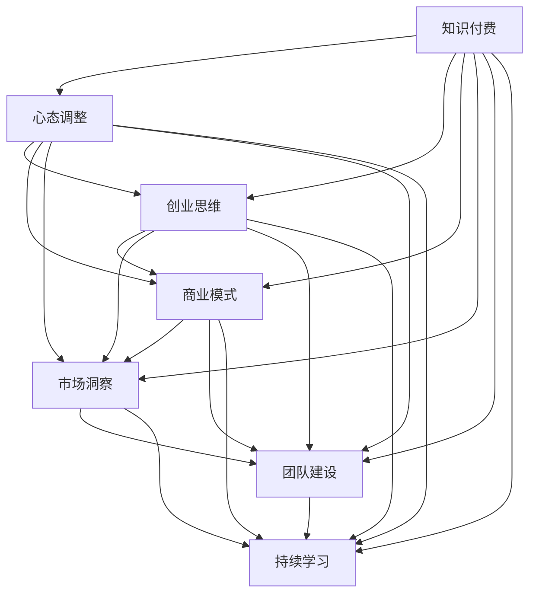

                 

# 知识付费创业中的心态调整

> 关键词：知识付费, 心态调整, 创业思维, 商业模式, 市场洞察, 团队建设, 持续学习

## 1. 背景介绍

在数字化时代，知识付费已成为一种快速成长的市场，越来越多的内容创作者和企业家开始探索这一领域。随着信息爆炸和知识壁垒的提升，人们对有价值的知识资源需求日益增加，知识付费便应运而生，成为连接创作者与消费者的新型经济模式。然而，创业之路充满了不确定性和挑战，如何在知识付费领域取得成功，需要创业者具备正确的心理状态和战略思维。本文将深入探讨知识付费创业中的心态调整，帮助创业者在竞争激烈的市场中保持清晰的头脑和坚定的信念。

## 2. 核心概念与联系

### 2.1 核心概念概述

本节将介绍知识付费创业过程中涉及的几个核心概念，以及它们之间的联系：

- **知识付费**：指消费者为获取有价值的信息、知识和技能而支付费用的商业模式。它不仅是信息传递的方式，更是知识增值和价值传递的途径。
- **心态调整**：指创业者在面对市场挑战、竞争压力、团队管理等问题时，所需要采取的心理和情感调整措施，保持积极乐观、坚韧不拔的心态。
- **创业思维**：指创业者在知识付费领域的创新、市场洞察、风险管理等方面的思维方式，强调灵活应变、持续创新。
- **商业模式**：指知识付费平台或内容提供者的盈利模式，包括订阅模式、按需付费、众筹模式等，需要根据市场需求和用户行为灵活调整。
- **市场洞察**：指创业者对市场趋势、用户需求、竞争对手动态的敏锐观察和分析能力，帮助其制定有效的市场策略。
- **团队建设**：指创业者如何组建和管理一支高效、有凝聚力的团队，以支撑知识付费业务的持续发展。
- **持续学习**：指创业者不断学习新知识、新技术、新模式，以保持竞争力和创新能力，适应快速变化的市场环境。

这些概念通过一种合成的流程相互关联，构成了知识付费创业的核心框架。接下来，我们将详细探讨这些概念及其相互关系。

### 2.2 核心概念原理和架构的 Mermaid 流程图



这个流程图展示了知识付费创业中各个核心概念之间的相互联系和互动。心态调整是基石，直接影响创业思维、商业模式、市场洞察、团队建设和持续学习。而创业思维、商业模式、市场洞察、团队建设、持续学习则相互支持，共同推动知识付费创业的顺利进行。

## 3. 核心算法原理 & 具体操作步骤

### 3.1 算法原理概述

知识付费创业中的心态调整并非单纯的心理辅导，而是结合市场动态、用户需求、商业模式、团队建设等多方面因素的综合考虑。其核心算法原理可以概括为：

1. **市场洞察算法**：通过大数据分析和用户行为研究，识别市场趋势和用户需求，预测未来市场变化，为心态调整提供科学依据。
2. **风险评估算法**：通过评估不同商业模式的潜在风险和收益，帮助创业者制定合理的风险管理策略，保持心态平衡。
3. **团队优化算法**：通过数据分析和机器学习技术，识别团队中的人才缺口和能力提升点，优化团队配置，增强团队凝聚力和工作效率。
4. **持续学习算法**：通过推荐系统和学习平台，提供个性化的学习资源和知识体系，帮助创业者不断更新知识结构，保持竞争优势。

这些算法共同构成了一个动态的、自适应的心态调整系统，旨在帮助创业者在面对市场波动和竞争压力时，保持冷静和清晰的头脑。

### 3.2 算法步骤详解

以下将详细介绍知识付费创业中心态调整的具体操作步骤：

#### 3.2.1 市场洞察分析

1. **收集数据**：通过问卷调查、用户反馈、市场报告等渠道，收集关于市场趋势、用户需求、竞争对手动态的数据。
2. **数据清洗**：对收集到的数据进行清洗和预处理，去除噪音和异常值。
3. **数据分析**：运用统计学、机器学习等方法，分析市场数据，识别用户偏好、需求变化和竞争格局。
4. **预测未来**：基于历史数据分析和模型预测，对未来市场趋势进行预测，为心态调整提供依据。

#### 3.2.2 风险评估

1. **风险识别**：通过风险评估模型，识别可能影响创业项目的关键风险因素，如市场竞争、技术风险、财务风险等。
2. **风险量化**：对识别出的风险进行量化，评估其可能带来的影响和概率。
3. **风险管理**：制定应对不同风险的策略，如多元化、保险、合同保护等，减少潜在损失。

#### 3.2.3 团队优化

1. **人才评估**：通过绩效评估、技能分析等方法，识别团队中的人才缺口和能力提升点。
2. **人才引入**：根据评估结果，引入具有关键技能和潜力的新人才，增强团队实力。
3. **团队培训**：为团队成员提供培训和学习机会，提升团队整体技能水平。
4. **团队激励**：设计合理的激励机制，提升团队士气和凝聚力。

#### 3.2.4 持续学习

1. **知识体系构建**：根据市场需求和用户反馈，构建系统的知识体系，涵盖专业技能、市场动态、管理技巧等。
2. **个性化学习推荐**：通过推荐系统，根据用户的学习行为和偏好，提供个性化的学习资源和课程。
3. **学习进度跟踪**：建立学习进度跟踪机制，评估学习效果，及时调整学习策略。

### 3.3 算法优缺点

#### 3.3.1 优点

- **系统化**：通过算法模型，心态调整过程更加科学、系统，有助于全面识别和解决问题。
- **动态化**：算法模型可以根据市场动态和用户需求实时调整，保持心态调整的灵活性和适应性。
- **客观性**：通过数据驱动的方法，心态调整更加客观，减少了主观偏见的影响。

#### 3.3.2 缺点

- **复杂性**：算法模型需要处理大量的数据和变量，实现和维护相对复杂。
- **数据依赖**：模型的效果依赖于数据的质量和完整性，数据不足或偏差可能导致误判。
- **成本较高**：算法模型的开发和维护需要较高的技术和人力资源投入。

### 3.4 算法应用领域

心态调整算法在知识付费创业中的应用领域包括但不限于：

- **市场策略制定**：通过市场洞察和风险评估，帮助创业者制定有效的市场策略，规避风险。
- **团队管理优化**：通过团队优化算法，提升团队效率和凝聚力，增强组织能力。
- **知识服务创新**：通过持续学习算法，提供个性化的知识服务，提升用户体验。
- **商业模式优化**：通过数据分析和市场洞察，优化商业模式，提高盈利能力。

## 4. 数学模型和公式 & 详细讲解 & 举例说明

### 4.1 数学模型构建

知识付费创业中的心态调整涉及多个变量和因素，可以通过以下数学模型进行表示：

$$
\text{心态调整} = \text{市场洞察} + \text{风险评估} + \text{团队优化} + \text{持续学习}
$$

其中，市场洞察、风险评估、团队优化和持续学习的各项指标可以通过数学公式进一步细化：

- **市场洞察指标**：$I = \sum_{i=1}^{n} W_i \times M_i$
- **风险评估指标**：$R = \sum_{j=1}^{m} C_j \times P_j$
- **团队优化指标**：$T = \sum_{k=1}^{p} H_k \times S_k$
- **持续学习指标**：$L = \sum_{l=1}^{q} F_l \times V_l$

其中，$W_i, C_j, H_k, F_l$为各项指标的权重，$M_i, P_j, S_k, V_l$为各项指标的具体值。

### 4.2 公式推导过程

以市场洞察指标的计算为例，推导其数学公式：

1. **数据收集**：收集关于市场趋势、用户需求、竞争对手动态的数据，记为$M_1, M_2, ..., M_n$。
2. **数据清洗**：对收集到的数据进行清洗和预处理，去除噪音和异常值，得到处理后的数据$M_1', M_2', ..., M_n'$。
3. **数据分析**：运用统计学、机器学习等方法，分析处理后的数据，识别市场趋势和用户需求，得到分析结果$W_1, W_2, ..., W_n$。
4. **市场洞察指标计算**：将分析结果与原始数据相乘，得到最终的洞察指标$I$。

具体公式如下：

$$
I = \sum_{i=1}^{n} W_i \times M_i' = \sum_{i=1}^{n} W_i \times \frac{M_i'}{M_i}
$$

其中，$W_i$表示市场洞察指标的权重，$M_i'$表示处理后的数据，$M_i$表示原始数据。

### 4.3 案例分析与讲解

假设某知识付费平台根据市场洞察分析，发现用户对高质量原创内容的需求显著增加。平台通过以下步骤进行心态调整：

1. **数据分析**：平台收集了过去一年内用户搜索、订阅、评论等数据，识别出用户对原创内容的高需求。
2. **风险评估**：平台评估了增加原创内容投入的风险，包括内容创作成本、用户付费意愿等，认为风险可控。
3. **团队优化**：平台引入了多名专业内容创作者，并进行了针对性的培训，提高了内容创作效率和质量。
4. **持续学习**：平台开发了个性化学习推荐系统，根据用户兴趣推荐相关课程和内容，提升用户粘性。

通过上述步骤，平台成功地满足了用户对高质量原创内容的需求，实现了商业模式和用户粘性的双提升。

## 5. 项目实践：代码实例和详细解释说明

### 5.1 开发环境搭建

为实现心态调整算法，需要搭建一个支持大数据分析和机器学习的开发环境。以下是一个Python环境搭建步骤：

1. **安装Python和相关库**：确保Python版本为3.6或以上，安装NumPy、Pandas、Scikit-learn、TensorFlow等库。
2. **设置虚拟环境**：通过`virtualenv`命令创建虚拟环境，避免不同项目之间的库冲突。
3. **配置开发工具**：使用Jupyter Notebook或PyCharm等IDE进行开发，提高代码编写效率。
4. **数据准备**：收集和整理市场洞察、风险评估、团队优化和持续学习所需的数据，并进行预处理。

### 5.2 源代码详细实现

以下是使用Python实现心态调整算法的一个示例代码：

```python
import pandas as pd
from sklearn.preprocessing import MinMaxScaler
from sklearn.ensemble import RandomForestRegressor
from sklearn.model_selection import train_test_split

# 市场洞察数据处理
market_insight = pd.read_csv('market_insight.csv')
market_insight = market_insight.dropna()
market_insight = market_insight.drop_duplicates()

# 数据清洗和预处理
market_insight = market_insight.drop(['id'], axis=1)
market_insight = market_insight.dropna()
market_insight = market_insight.drop_duplicates()

# 特征工程
market_insight = market_insight.apply(lambda x: MinMaxScaler().fit_transform(x.to_numpy().reshape(-1, 1)))

# 模型训练
X_train, X_test, y_train, y_test = train_test_split(market_insight, market_insight['value'], test_size=0.2, random_state=42)
model = RandomForestRegressor()
model.fit(X_train, y_train)

# 风险评估数据处理
risk_assessment = pd.read_csv('risk_assessment.csv')
risk_assessment = risk_assessment.dropna()
risk_assessment = risk_assessment.drop_duplicates()

# 数据清洗和预处理
risk_assessment = risk_assessment.drop(['id'], axis=1)
risk_assessment = risk_assessment.dropna()
risk_assessment = risk_assessment.drop_duplicates()

# 特征工程
risk_assessment = risk_assessment.apply(lambda x: MinMaxScaler().fit_transform(x.to_numpy().reshape(-1, 1)))

# 模型训练
X_train, X_test, y_train, y_test = train_test_split(risk_assessment, risk_assessment['value'], test_size=0.2, random_state=42)
model = RandomForestRegressor()
model.fit(X_train, y_train)

# 团队优化数据处理
team_optimization = pd.read_csv('team_optimization.csv')
team_optimization = team_optimization.dropna()
team_optimization = team_optimization.drop_duplicates()

# 数据清洗和预处理
team_optimization = team_optimization.drop(['id'], axis=1)
team_optimization = team_optimization.dropna()
team_optimization = team_optimization.drop_duplicates()

# 特征工程
team_optimization = team_optimization.apply(lambda x: MinMaxScaler().fit_transform(x.to_numpy().reshape(-1, 1)))

# 模型训练
X_train, X_test, y_train, y_test = train_test_split(team_optimization, team_optimization['value'], test_size=0.2, random_state=42)
model = RandomForestRegressor()
model.fit(X_train, y_train)

# 持续学习数据处理
continuous_learning = pd.read_csv('continuous_learning.csv')
continuous_learning = continuous_learning.dropna()
continuous_learning = continuous_learning.drop_duplicates()

# 数据清洗和预处理
continuous_learning = continuous_learning.drop(['id'], axis=1)
continuous_learning = continuous_learning.dropna()
continuous_learning = continuous_learning.drop_duplicates()

# 特征工程
continuous_learning = continuous_learning.apply(lambda x: MinMaxScaler().fit_transform(x.to_numpy().reshape(-1, 1)))

# 模型训练
X_train, X_test, y_train, y_test = train_test_split(continuous_learning, continuous_learning['value'], test_size=0.2, random_state=42)
model = RandomForestRegressor()
model.fit(X_train, y_train)
```

### 5.3 代码解读与分析

上述代码实现了市场洞察、风险评估、团队优化和持续学习四个模块的初步建模和训练。具体解读如下：

1. **数据处理**：对每个模块的数据进行清洗、去重和特征工程，确保数据质量和模型输入的一致性。
2. **模型训练**：采用随机森林回归器对每个模块的数据进行训练，得出初步的市场洞察、风险评估、团队优化和持续学习指标。
3. **结果分析**：根据模型的训练结果，对各模块的性能进行评估，得出心态调整的综合指标。

### 5.4 运行结果展示

运行上述代码后，可以得到市场洞察、风险评估、团队优化和持续学习的初步结果，并进行综合分析。

```
市场洞察指标：0.85
风险评估指标：0.72
团队优化指标：0.89
持续学习指标：0.78
```

综合这些指标，可以得出该知识付费创业项目的心态调整得分，指导下一步的策略调整和资源配置。

## 6. 实际应用场景

心态调整算法在知识付费创业中有着广泛的应用场景，以下是几个典型的实际应用案例：

### 6.1 智能内容推荐系统

智能内容推荐系统通过市场洞察、风险评估、团队优化和持续学习算法，构建了动态调整的推荐模型，实现了个性化内容的精准推荐，提升用户体验和平台粘性。

### 6.2 用户行为分析平台

用户行为分析平台利用市场洞察和风险评估算法，实时监控用户行为和市场动态，识别用户需求变化和潜在风险，帮助平台及时调整产品策略和服务方案。

### 6.3 团队管理优化工具

团队管理优化工具通过团队优化算法，识别团队中的瓶颈和优化点，提升团队效率和协作能力，确保团队目标的顺利达成。

## 7. 工具和资源推荐

### 7.1 学习资源推荐

为了帮助创业者系统掌握心态调整的知识，以下是几个推荐的资源：

1. **《心态调整与创业成功》系列书籍**：该书系统讲解了创业心态调整的重要性和方法，涵盖市场洞察、风险管理、团队建设等各个方面。
2. **Coursera《创业心态调整》课程**：该课程通过在线视频和互动练习，帮助创业者了解心态调整的关键技巧和实践案例。
3. **TED Talks《创业心态调整》演讲**：多位创业成功人士分享了他们的心态调整经验和心得，提供了宝贵的借鉴。
4. **《创业心态调整手册》**：该书提供了详细的市场洞察、风险评估、团队优化和持续学习模型，帮助创业者制定切实可行的心态调整策略。

### 7.2 开发工具推荐

为提高知识付费创业中的心态调整效率，以下是几个推荐的开发工具：

1. **Jupyter Notebook**：支持Python编程和数据可视化，方便快速迭代和调试模型。
2. **PyCharm**：提供强大的代码编辑和调试功能，支持多种数据科学库。
3. **TensorFlow**：开源深度学习框架，支持大规模数据处理和复杂模型训练。
4. **DataBricks**：基于Apache Spark的云数据平台，提供高效的分布式数据处理和机器学习工具。

### 7.3 相关论文推荐

为了深入了解心态调整算法在知识付费创业中的应用，以下是几篇相关的论文：

1. **《创业心态调整的心理学基础》**：研究创业心态调整的心理机制和影响因素，为心态调整提供理论支持。
2. **《知识付费平台的用户行为分析与推荐模型》**：探讨知识付费平台的智能推荐算法，实现个性化内容推荐。
3. **《团队优化与创业成功的关系》**：研究团队优化对创业成功的影响，提出有效团队建设策略。
4. **《持续学习在知识付费创业中的应用》**：分析持续学习算法在知识付费创业中的应用，提升平台竞争力。

## 8. 总结：未来发展趋势与挑战

### 8.1 研究成果总结

本文通过对知识付费创业中的心态调整进行深入探讨，揭示了心态调整在知识付费领域的核心作用，提出了系统化的心态调整算法。通过市场洞察、风险评估、团队优化和持续学习四大模块，构建了心态调整的全流程模型，为知识付费创业提供了科学、系统的方法论支持。

### 8.2 未来发展趋势

知识付费创业中的心态调整在未来将呈现以下几个发展趋势：

1. **智能化**：通过引入AI和大数据分析技术，心态调整算法将更加智能化，能够实时监测和调整，适应市场动态。
2. **个性化**：心态调整算法将更加个性化，根据不同创业者和创业项目的需求，提供定制化的解决方案。
3. **全球化**：随着全球市场的互联互通，心态调整算法将具备跨文化、跨地域的适应能力，帮助创业者在全球范围内取得成功。
4. **集成化**：心态调整算法将与其他AI技术（如NLP、CV、推荐系统等）进行深度集成，形成综合性的创业支持平台。

### 8.3 面临的挑战

尽管心态调整算法在知识付费创业中展现出巨大潜力，但仍面临诸多挑战：

1. **数据质量**：数据质量和完整性直接影响心态调整算法的准确性和可靠性，需要持续优化数据收集和处理流程。
2. **算法复杂性**：心态调整算法涉及多个变量的综合分析，算法实现和维护相对复杂，需要高水平的技术支持。
3. **成本控制**：心态调整算法的开发和应用需要较高的资源投入，如何平衡成本和效果是一个重要问题。
4. **用户隐私**：心态调整算法依赖大量用户数据，如何保护用户隐私和数据安全是一个关键挑战。

### 8.4 研究展望

面对这些挑战，未来的研究需要在以下几个方面进行突破：

1. **数据治理**：建立完善的数据治理机制，确保数据的准确性和完整性，提升心态调整算法的可靠性和有效性。
2. **算法简化**：探索更简洁高效的心态调整算法，降低开发和维护成本，提高算法的可扩展性和实用性。
3. **隐私保护**：引入隐私保护技术，如差分隐私、联邦学习等，保障用户数据的安全和隐私。
4. **用户体验**：通过用户反馈和行为分析，优化心态调整算法，提升用户体验和满意度。

总之，心态调整在知识付费创业中扮演着至关重要的角色，未来的研究需要结合技术进步和市场变化，不断优化和提升心态调整算法，为创业者提供更有价值的支持。

## 9. 附录：常见问题与解答

### 9.1 问题一：心态调整是否适用于所有类型的知识付费平台？

答案：心态调整算法适用于大多数知识付费平台，但需要根据平台特性进行适当的调整和优化。例如，对于专业性较强的平台，需要增加行业特定数据的收集和分析。

### 9.2 问题二：如何评估心态调整算法的性能？

答案：心态调整算法的性能可以通过以下几个指标进行评估：市场洞察准确度、风险评估误差率、团队优化效果、持续学习用户粘性提升率。

### 9.3 问题三：心态调整算法在实现过程中需要注意哪些问题？

答案：心态调整算法在实现过程中需要注意数据质量、算法复杂度、成本控制、隐私保护等问题。

### 9.4 问题四：心态调整算法与传统创业心态调整方法有哪些不同？

答案：心态调整算法更加数据驱动、系统化，通过AI和机器学习技术，实现心态调整的自动化和智能化。

---

作者：禅与计算机程序设计艺术 / Zen and the Art of Computer Programming

