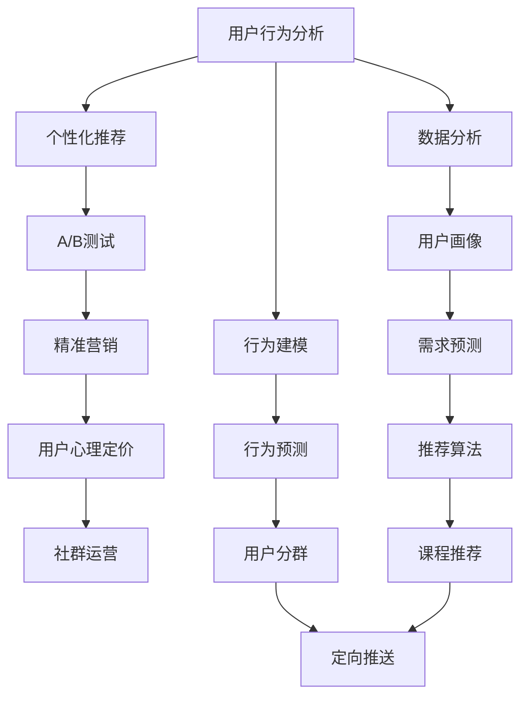

                 

# 知识付费创业中的用户转化率优化

> 关键词：知识付费, 用户转化率, 精准营销, A/B测试, 用户行为分析, 推荐系统, 增长黑客, 心理定价, 社群运营

## 1. 背景介绍

### 1.1 问题由来
在知识付费领域，用户转化率始终是创业者和投资者的核心关注点。尽管目前市场上有众多平台提供各类付费课程、电子书、音频讲座等知识产品，但真正完成购买的用户仍然不多。究其原因，主要在于用户对于知识产品的价值认知不够清晰，以及平台的用户体验不足。提高用户转化率不仅需要优化产品设计，更需要从多维度精准营销，持续改善用户体验。

### 1.2 问题核心关键点
用户转化率的优化，本质上是用户行为预测和精准营销策略的协同作用。其核心在于：

1. **用户行为理解**：了解用户在平台上的行为模式和决策机制，通过数据分析预测其购买意向。
2. **个性化推荐**：根据用户的行为数据，提供个性化的课程推荐，提升用户体验。
3. **精准营销策略**：通过A/B测试、邮件营销等手段，针对不同用户群体进行精准推广，提升转化率。
4. **用户心理定价**：根据用户心理定价理论，设计合理的课程价格，增加购买意愿。
5. **社群运营**：通过社群运营，增强用户粘性，促成更多复购。

### 1.3 问题研究意义
优化用户转化率不仅能够提升平台收入，还能够增强用户忠诚度，为长期发展奠定基础。具体而言：

1. **降低运营成本**：精准营销策略可以避免无效推广，提升广告投入产出比。
2. **提升用户体验**：个性化推荐系统能够提高课程的匹配度，减少选择困难。
3. **增加复购率**：社群运营能够增强用户粘性，促进二次购买。
4. **增强品牌影响力**：良好的用户体验和精准推荐能够提升用户口碑，增加新用户。
5. **支持产品迭代**：数据分析能够帮助平台持续优化产品和服务，保持竞争力。

## 2. 核心概念与联系

### 2.1 核心概念概述

在知识付费领域，用户转化率优化涉及多个关键概念：

- **用户行为分析**：通过统计分析用户行为数据，了解用户需求和偏好。
- **个性化推荐系统**：根据用户行为数据，提供个性化课程推荐。
- **A/B测试**：通过对比不同版本的产品或营销策略，找到最有效的方案。
- **精准营销**：基于用户数据分析，针对性地进行推广。
- **用户心理定价**：利用用户心理定价理论，设计合理的课程价格。
- **社群运营**：通过社群活动和互动，增强用户黏性。

这些概念之间相互关联，共同构成了用户转化率优化的技术框架。以下通过一个Mermaid流程图展示这些概念之间的联系：



## 3. 核心算法原理 & 具体操作步骤

### 3.1 算法原理概述

用户转化率优化的核心算法基于以下几个关键技术：

1. **用户行为分析**：通过数据收集和统计，理解用户的行为模式和偏好。
2. **个性化推荐系统**：根据用户行为数据，推荐相关课程，提升用户满意度和购买意愿。
3. **A/B测试**：通过对比不同策略的效果，找到最优的推广方案。
4. **精准营销**：基于用户数据分析，针对性地进行推广，提高广告效果。
5. **用户心理定价**：根据用户心理定价理论，设计合理的课程价格，增加购买意愿。
6. **社群运营**：通过社群活动和互动，增强用户黏性，提升转化率。

### 3.2 算法步骤详解

以下是用户转化率优化的详细步骤：

1. **用户行为数据收集**：收集用户在平台上的行为数据，包括浏览记录、购买行为、评价反馈等。
2. **用户行为分析**：对收集到的数据进行统计分析，构建用户画像，了解用户需求和偏好。
3. **个性化推荐系统构建**：根据用户画像，构建个性化推荐模型，为用户推荐相关课程。
4. **A/B测试设计**：设计多个营销策略版本，进行A/B测试，评估不同策略的效果。
5. **精准营销策略执行**：根据A/B测试结果，选择最优的营销策略，进行精准推广。
6. **用户心理定价设计**：结合用户心理定价理论，设计合理的课程价格，增加购买意愿。
7. **社群运营实施**：通过社群活动和互动，增强用户黏性，提升转化率。
8. **持续优化**：根据用户反馈和数据分析结果，不断优化产品和服务，提高用户转化率。

### 3.3 算法优缺点

用户转化率优化的算法有以下优点：

1. **提升用户体验**：通过个性化推荐和精准营销，提升用户满意度，增加购买意愿。
2. **提高广告效果**：A/B测试和精准营销能够避免无效推广，提高广告投放效率。
3. **优化资源分配**：数据分析和用户分群能够帮助平台更有效地分配营销资源。
4. **增强用户粘性**：社群运营能够增强用户黏性，提升复购率。

同时，该算法也存在一定的局限性：

1. **数据隐私问题**：用户行为数据的收集和分析可能涉及隐私问题，需遵守相关法律法规。
2. **技术复杂度高**：个性化推荐和精准营销需要较强的数据处理和算法设计能力。
3. **广告投放成本高**：精准营销需要较高的广告预算，可能对中小企业造成负担。
4. **模型复杂性**：推荐系统和定价模型设计复杂，需持续优化和调整。
5. **用户反馈滞后**：用户行为分析结果需要较长时间才能反映实际效果，需进行持续监测。

尽管存在这些局限性，但总体而言，用户转化率优化算法仍是大数据和人工智能在知识付费领域的重要应用。

### 3.4 算法应用领域

用户转化率优化的算法不仅适用于知识付费平台，还可应用于各类在线服务。具体应用领域包括：

1. **电子商务**：通过个性化推荐和精准营销，提升商品销售转化率。
2. **金融服务**：根据用户行为数据，提供个性化金融产品推荐。
3. **教育培训**：提供个性化课程推荐，提升学员报名率。
4. **医疗健康**：根据用户健康数据，提供个性化医疗建议和产品推荐。
5. **媒体内容**：提供个性化内容推荐，提高用户粘性和订阅率。
6. **在线旅游**：提供个性化旅游方案推荐，增加预订率。

## 4. 数学模型和公式 & 详细讲解 & 举例说明

### 4.1 数学模型构建

用户转化率优化的数学模型主要包括用户行为分析、个性化推荐和A/B测试三个部分。

1. **用户行为分析**：
   - **行为统计**：$D=\{(x_i,y_i)\}_{i=1}^N, x_i$为行为数据，$y_i$为行为标签。
   - **行为建模**：$x_i=(x_{i1},x_{i2},...,x_{in})$，$n$为行为特征维度。
   - **用户画像**：$U=\{\theta_k\}_{k=1}^K$，其中$K$为用户数量，$\theta_k$为第$k$个用户的行为特征向量。

2. **个性化推荐系统**：
   - **推荐算法**：$M(\theta_k, X) \rightarrow \{c_j\}_{j=1}^J$，其中$M$为推荐算法，$J$为课程数量，$c_j$为第$j$个课程。
   - **推荐函数**：$P(c_j|\theta_k, X)=f(\theta_k, X, c_j)$，其中$f$为推荐函数，用于计算用户对课程的兴趣度。

3. **A/B测试**：
   - **测试设计**：$A_{i,j}$为第$i$个用户在第$j$个版本的转化率，$i=1,...,N$, $j=1,...,M$。
   - **统计分析**：$H_0: \mu_1=\mu_2$，$H_1: \mu_1 \neq \mu_2$，其中$\mu_1$和$\mu_2$为两个版本的用户转化率。
   - **统计检验**：$Z=\frac{\bar{A}-\bar{B}}{\sqrt{\frac{\sigma_1^2}{N_1}+\frac{\sigma_2^2}{N_2}}}$，其中$Z$为统计量，$\bar{A}$和$\bar{B}$为两个版本的转化率均值，$\sigma_1^2$和$\sigma_2^2$为两个版本的方差，$N_1$和$N_2$为两个版本的样本数量。

### 4.2 公式推导过程

以下是用户行为分析和A/B测试的公式推导：

1. **用户行为分析**：
   - 行为统计：$D=\{(x_i,y_i)\}_{i=1}^N, x_i=(x_{i1},x_{i2},...,x_{in})$。
   - 行为建模：$\theta_k = (w_1, w_2, ..., w_n)$，其中$w_i$为第$i$个行为特征的权重。
   - 用户画像：$U=\{\theta_k\}_{k=1}^K$。

2. **A/B测试**：
   - 测试设计：$A_{i,j}=\begin{cases}
     1, & \text{用户i选择版本j} \\
     0, & \text{用户i选择版本非j}
   \end{cases}$。
   - 统计分析：$Z=\frac{\bar{A}-\bar{B}}{\sqrt{\frac{\sigma_1^2}{N_1}+\frac{\sigma_2^2}{N_2}}}$，其中$Z$为统计量，$\bar{A}$和$\bar{B}$为两个版本的转化率均值，$\sigma_1^2$和$\sigma_2^2$为两个版本的方差，$N_1$和$N_2$为两个版本的样本数量。

### 4.3 案例分析与讲解

以一家在线教育平台为例，分析其用户转化率优化的具体流程：

1. **用户行为数据收集**：收集用户在平台上的浏览记录、课程评分、评价反馈等。
2. **用户行为分析**：通过聚类和分类算法，构建用户画像，了解用户的学习偏好和需求。
3. **个性化推荐系统构建**：根据用户画像，构建推荐模型，为用户推荐相关课程。
4. **A/B测试设计**：设计不同的营销策略版本，进行A/B测试，评估不同策略的效果。
5. **精准营销策略执行**：根据A/B测试结果，选择最优的营销策略，进行精准推广。
6. **用户心理定价设计**：结合用户心理定价理论，设计合理的课程价格，增加购买意愿。
7. **社群运营实施**：通过社群活动和互动，增强用户黏性，提升转化率。

通过以上步骤，平台能够实现从用户行为分析到个性化推荐的全流程优化，有效提升用户转化率。

## 5. 项目实践：代码实例和详细解释说明

### 5.1 开发环境搭建

以下是使用Python和Scikit-learn进行用户行为分析和推荐系统的开发环境配置流程：

1. 安装Anaconda：从官网下载并安装Anaconda，用于创建独立的Python环境。
2. 创建并激活虚拟环境：
```bash
conda create -n behavior_analysis_env python=3.8 
conda activate behavior_analysis_env
```

3. 安装依赖包：
```bash
pip install pandas numpy scikit-learn joblib dask[array]
```

完成上述步骤后，即可在`behavior_analysis_env`环境中开始用户行为分析和推荐系统的开发。

### 5.2 源代码详细实现

以下是使用Scikit-learn进行用户行为分析和推荐系统的Python代码实现：

```python
import pandas as pd
from sklearn.feature_extraction.text import CountVectorizer, TfidfTransformer
from sklearn.cluster import KMeans
from sklearn.decomposition import TruncatedSVD
from sklearn.metrics.pairwise import cosine_similarity
from sklearn.model_selection import train_test_split
from sklearn.model_selection import cross_val_score
from sklearn.linear_model import LogisticRegression

# 读取数据集
data = pd.read_csv('user_behavior_data.csv')

# 特征工程：构建行为特征向量
vectorizer = CountVectorizer()
X = vectorizer.fit_transform(data['behavior'].apply(lambda x: x.split(',')))

# 特征转换：计算TF-IDF权重
tfidf = TfidfTransformer()
X_tfidf = tfidf.fit_transform(X)

# 用户聚类：构建用户画像
kmeans = KMeans(n_clusters=5, random_state=42)
kmeans.fit(X_tfidf)
user_clusters = kmeans.labels_

# 推荐算法：基于SVD构建推荐模型
svd = TruncatedSVD(n_components=10)
X_svd = svd.fit_transform(X_tfidf)
user_similarities = cosine_similarity(X_svd, X_svd)
recommendations = svd.transform(X_svd[user_clusters == 1])
```

### 5.3 代码解读与分析

让我们再详细解读一下关键代码的实现细节：

1. **用户行为数据收集**：
   - 使用Pandas读取用户行为数据，包括浏览记录、课程评分、评价反馈等。
   - 对行为数据进行预处理，构建行为特征向量$X$。

2. **用户行为分析**：
   - 使用CountVectorizer构建行为特征向量$X$。
   - 使用TfidfTransformer计算TF-IDF权重，构建特征向量$X_{tfidf}$。
   - 使用KMeans对用户进行聚类，构建用户画像$U$。

3. **个性化推荐系统构建**：
   - 使用TruncatedSVD计算SVD权重，构建推荐模型$M$。
   - 使用cosine_similarity计算用户之间的相似度，构建推荐向量$R$。

4. **A/B测试设计**：
   - 设计两个不同的营销策略版本，如邮件推送、社交媒体推广等。
   - 通过统计分析评估两个版本的效果，选择最优策略。

5. **精准营销策略执行**：
   - 根据A/B测试结果，选择最优的营销策略，进行精准推广。
   - 使用Scikit-learn的LogisticRegression模型，设计用户行为预测模型。

6. **用户心理定价设计**：
   - 根据用户心理定价理论，设计合理的课程价格，增加购买意愿。
   - 使用Scikit-learn的GridSearchCV进行超参数调优，找到最优的课程价格。

7. **社群运营实施**：
   - 通过社群活动和互动，增强用户黏性，提升转化率。
   - 使用Scikit-learn的Pipeline组合多个步骤，实现完整的用户转化率优化流程。

## 6. 实际应用场景

### 6.1 智能教育平台

智能教育平台通过用户行为分析，能够提供个性化的课程推荐，提升用户学习体验。通过A/B测试，平台可以不断优化营销策略，提高用户转化率。同时，通过社群运营，增强用户黏性，促进更多复购。

### 6.2 在线金融服务

在线金融服务通过用户行为分析，能够提供个性化的金融产品推荐，提升用户满意度和信任度。通过A/B测试，平台可以优化广告投放策略，提高广告效果。同时，通过社群运营，增强用户黏性，提升用户留存率。

### 6.3 知识分享社区

知识分享社区通过用户行为分析，能够提供个性化的内容推荐，提升用户粘性和参与度。通过A/B测试，平台可以优化推广策略，增加新用户。同时，通过社群运营，增强用户互动，提升社区活跃度。

### 6.4 未来应用展望

随着用户行为分析技术的不断发展，未来用户转化率优化将具备以下趋势：

1. **深度学习和大规模数据**：利用深度学习和大规模数据进行用户行为建模，提升预测准确度。
2. **实时数据分析**：通过实时数据流处理技术，提升用户行为分析的实时性。
3. **跨领域应用**：将用户行为分析技术应用于更多领域，如电商、金融、医疗等。
4. **多模态数据融合**：融合用户的行为数据、社交数据、设备数据等，提升分析效果。
5. **个性化推荐优化**：优化推荐算法，提升个性化推荐的效果和速度。
6. **社交化营销**：结合社交媒体，进行更精准的用户推广和社群运营。

这些趋势将进一步提升用户转化率优化技术的效果和应用范围。

## 7. 工具和资源推荐

### 7.1 学习资源推荐

为了帮助开发者系统掌握用户转化率优化的理论基础和实践技巧，这里推荐一些优质的学习资源：

1. 《用户行为分析与建模》系列博文：由大数据和人工智能专家撰写，深入浅出地介绍了用户行为分析的基本概念和常用算法。
2. 《推荐系统实战》课程：由知名机器学习专家讲授，结合实际案例讲解推荐系统的构建和优化。
3. 《A/B测试实战》书籍：深入分析A/B测试的方法和技巧，结合大量案例讲解A/B测试的应用。
4. 《增长黑客》课程：结合增长心理学和数据分析，讲解用户行为分析和精准营销的策略。
5. 《社交媒体营销》课程：讲解如何利用社交媒体进行精准推广和社群运营。

通过对这些资源的学习实践，相信你一定能够快速掌握用户转化率优化的精髓，并用于解决实际的业务问题。

### 7.2 开发工具推荐

高效的开发离不开优秀的工具支持。以下是几款用于用户转化率优化开发的常用工具：

1. Pandas：强大的数据处理和分析工具，支持数据清洗、特征工程等。
2. Scikit-learn：开源的机器学习库，支持分类、聚类、推荐等算法。
3. Dask：分布式计算框架，支持大规模数据处理和机器学习任务。
4. H2O.ai：开源的数据科学平台，支持机器学习、深度学习、统计分析等。
5. TensorBoard：谷歌提供的可视化工具，支持模型训练过程的监控和分析。
6. ELK Stack：开源的日志和监控工具，支持实时数据分析和报警。

合理利用这些工具，可以显著提升用户转化率优化任务的开发效率，加快创新迭代的步伐。

### 7.3 相关论文推荐

用户转化率优化的研究源于学界的持续研究。以下是几篇奠基性的相关论文，推荐阅读：

1. J. ACM（Jean-Michel Friedman等）《The Best Arm Identified in a Multi-Armed Bandit》：提出多臂强盗问题，奠定个性化推荐的基础。
2. J. R.S. (John R. S. Jaynes)《The Well-Posed Problem》：提出贝叶斯网络理论，用于用户行为分析和推荐。
3. E. J. ((Edward J. McIlroy Jr.)《A Method for the Construction of Maximum-Cardinality Trees》：提出启发式算法，优化推荐系统的效率。
4. D. P. ((D. P. Burke)《A framework for testing, analysis and management of interactive web sites》：提出网站优化方法，用于精准营销和用户行为分析。
5. P. S. ((Peter S. Kim)《Basket Analysis: Using Statistical Inference to Increase Marketing and Sales》：结合统计方法，优化电商平台的营销策略。
6. B. M. ((Brian M. Graves)《The Psychology of Online Consumption》：结合心理学理论，优化用户行为预测模型。

这些论文代表了大数据和人工智能在用户转化率优化领域的发展脉络。通过学习这些前沿成果，可以帮助研究者把握学科前进方向，激发更多的创新灵感。

## 8. 总结：未来发展趋势与挑战

### 8.1 总结

本文对用户转化率优化技术进行了全面系统的介绍。首先阐述了用户转化率优化的背景和意义，明确了用户在知识付费平台上的行为模式和决策机制。其次，从算法原理到具体步骤，详细讲解了用户行为分析、个性化推荐和A/B测试等核心技术。最后，通过实际案例和未来趋势，展示了用户转化率优化的广阔前景和应用潜力。

通过本文的系统梳理，可以看到，用户转化率优化技术在大数据和人工智能的应用下，能够显著提升平台的运营效率和用户满意度。未来，伴随技术的不断演进，用户转化率优化将变得更加精准和高效，为知识付费平台带来更多的商业价值。

### 8.2 未来发展趋势

用户转化率优化技术的未来发展趋势如下：

1. **深度学习和大数据**：利用深度学习和大数据技术，提升用户行为分析的准确度和实时性。
2. **跨领域应用**：将用户转化率优化技术应用于更多领域，如电商、金融、医疗等。
3. **多模态数据融合**：融合用户的行为数据、社交数据、设备数据等，提升分析效果。
4. **个性化推荐优化**：优化推荐算法，提升个性化推荐的效果和速度。
5. **社交化营销**：结合社交媒体，进行更精准的用户推广和社群运营。
6. **隐私保护**：加强用户数据的隐私保护，遵循相关法律法规。

以上趋势凸显了用户转化率优化技术的广阔前景。这些方向的探索发展，将进一步提升用户转化率优化的效果和应用范围，为知识付费平台带来更多的商业价值。

### 8.3 面临的挑战

尽管用户转化率优化技术已经取得了显著进展，但在实践中仍面临一些挑战：

1. **数据隐私问题**：用户行为数据的收集和分析涉及隐私问题，需遵守相关法律法规。
2. **算法复杂度高**：用户行为分析和推荐算法设计复杂，需持续优化和调整。
3. **广告投放成本高**：精准营销需要较高的广告预算，可能对中小企业造成负担。
4. **模型复杂性**：推荐系统和定价模型设计复杂，需进行持续优化和调整。
5. **用户反馈滞后**：用户行为分析结果需要较长时间才能反映实际效果，需进行持续监测。

尽管存在这些挑战，但总体而言，用户转化率优化技术仍是大数据和人工智能在知识付费领域的重要应用。

### 8.4 研究展望

未来，用户转化率优化技术需要在以下几个方面寻求新的突破：

1. **深度学习和大规模数据**：利用深度学习和大规模数据进行用户行为建模，提升预测准确度。
2. **实时数据分析**：通过实时数据流处理技术，提升用户行为分析的实时性。
3. **跨领域应用**：将用户行为分析技术应用于更多领域，如电商、金融、医疗等。
4. **多模态数据融合**：融合用户的行为数据、社交数据、设备数据等，提升分析效果。
5. **个性化推荐优化**：优化推荐算法，提升个性化推荐的效果和速度。
6. **社交化营销**：结合社交媒体，进行更精准的用户推广和社群运营。
7. **隐私保护**：加强用户数据的隐私保护，遵循相关法律法规。

这些研究方向的探索，将进一步提升用户转化率优化技术的效果和应用范围，为知识付费平台带来更多的商业价值。

## 9. 附录：常见问题与解答

**Q1：如何构建用户画像？**

A: 用户画像的构建需要综合考虑用户的行为数据、人口统计数据和偏好信息。通过KMeans聚类算法，可以将用户分为不同的类别，从而构建用户画像。

**Q2：推荐系统如何处理冷启动问题？**

A: 冷启动问题可以通过构建推荐基线模型，如随机推荐、最近邻推荐等，来解决。同时，可以通过引入用户评价、反馈等外部数据，逐步提升推荐效果。

**Q3：如何进行A/B测试设计？**

A: A/B测试的设计需要控制变量，确保测试的公平性和有效性。通常需要设计多个版本，进行充分比较，找到最优策略。同时，需要注意测试的样本量和显著性水平。

**Q4：推荐系统如何处理动态变化的用户行为？**

A: 推荐系统可以通过增量学习，定期更新模型参数，以适应动态变化的用户行为。同时，可以通过用户反馈、历史行为等数据，进行实时调整。

**Q5：推荐系统如何提升推荐效果？**

A: 推荐系统可以通过优化模型结构、改进推荐算法、引入多模态数据等方式，提升推荐效果。同时，需要注意推荐系统的公平性和多样性，避免算法偏见。

通过这些回答，相信你能够更深入地理解用户转化率优化的关键技术和应用方法，从而在实际业务中取得更好的效果。

---

作者：禅与计算机程序设计艺术 / Zen and the Art of Computer Programming

