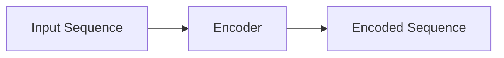
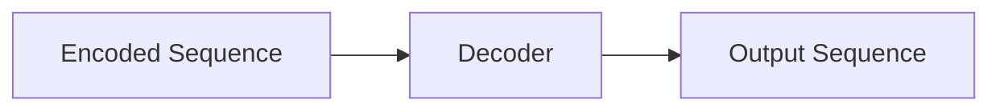
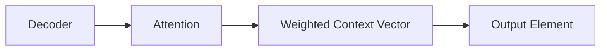
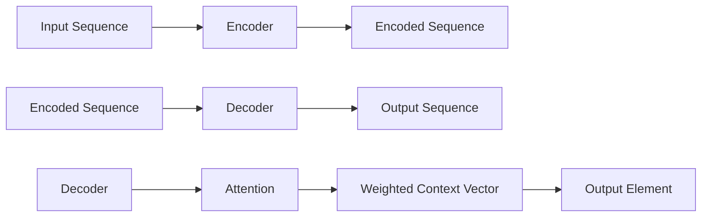

                 

### 文章标题

**柳暗花明又一村：Seq2Seq编码器-解码器架构**

关键词：序列到序列模型，神经机器翻译，编码器，解码器，递归神经网络，注意力机制，深度学习

摘要：本文深入探讨了序列到序列（Seq2Seq）编码器-解码器架构，这是一种在深度学习领域广泛应用的模型，尤其适用于神经机器翻译任务。通过逐步分析其核心概念、算法原理、数学模型及项目实践，本文揭示了Seq2Seq模型的强大能力及其在实际应用中的潜在价值。

### 背景介绍

#### 序列到序列模型

序列到序列（Seq2Seq）模型是深度学习领域的一个重要架构，它主要用于处理序列数据之间的转换问题。例如，在机器翻译任务中，Seq2Seq模型可以将一种语言的序列映射为另一种语言的序列。这种模型的结构设计巧妙，能够捕捉输入序列和输出序列之间的复杂关系。

#### 神经机器翻译

神经机器翻译（Neural Machine Translation, NMT）是近年来机器翻译领域的一大突破。与传统的基于规则的机器翻译方法相比，NMT通过深度学习模型，如Seq2Seq模型，能够更好地理解和生成自然语言。NMT的成功得益于递归神经网络（Recurrent Neural Network, RNN）和注意力机制（Attention Mechanism）的发展。

#### 编码器-解码器架构

编码器-解码器（Encoder-Decoder）架构是Seq2Seq模型的核心，由两个主要部分组成：编码器（Encoder）和解码器（Decoder）。编码器负责将输入序列编码为固定长度的向量表示，解码器则根据这个向量表示生成输出序列。这一架构在处理序列数据时展现了出色的性能。

#### 递归神经网络

递归神经网络（Recurrent Neural Network, RNN）是一种能够处理序列数据的神经网络。RNN通过重复单元来处理输入序列的每个元素，并利用历史信息进行预测。这使得RNN在自然语言处理任务中表现出色。

#### 注意力机制

注意力机制（Attention Mechanism）是一种能够增强模型处理长序列数据的能力。在Seq2Seq模型中，注意力机制允许解码器在生成每个输出元素时，聚焦于输入序列的不同部分。这使得解码器能够更好地理解输入序列的全局信息，从而生成更准确的输出。

### 核心概念与联系

#### 编码器（Encoder）

编码器是Seq2Seq模型的第一部分，其主要功能是将输入序列编码为固定长度的向量表示。这一过程通常通过一个递归神经网络来实现，每个时间步的输入都是上一个时间步的隐藏状态和当前输入元素。

**Mermaid 流程图：**



**流程说明：**
1. 输入序列通过编码器进行编码。
2. 编码器在每个时间步产生一个隐藏状态。
3. 所有隐藏状态被拼接成一个固定长度的向量表示。

#### 解码器（Decoder）

解码器是Seq2Seq模型的第二部分，其主要功能是根据编码器输出的向量表示生成输出序列。解码器通常也使用递归神经网络，并在每个时间步生成一个输出元素。

**Mermaid 流程图：**



**流程说明：**
1. 编码器输出的向量表示作为解码器的初始输入。
2. 解码器在每个时间步生成一个输出元素。
3. 输出元素通过注意力机制与编码器输出的向量表示进行关联。
4. 所有输出元素拼接成输出序列。

#### 注意力机制

注意力机制（Attention Mechanism）是解码器中的一个关键组件，它允许解码器在生成每个输出元素时，动态地聚焦于输入序列的不同部分。注意力机制通常通过计算一个加权求和的方式实现。

**Mermaid 流程图：**



**流程说明：**
1. 解码器在每个时间步生成一个隐藏状态。
2. 使用注意力机制计算编码器输出的加权求和。
3. 加权求和结果作为当前时间步的上下文向量。
4. 解码器利用上下文向量生成当前输出元素。

#### Seq2Seq编码器-解码器架构

**Mermaid 流程图：**



**流程说明：**
1. 输入序列通过编码器编码为向量表示。
2. 编码器输出向量作为解码器的初始输入。
3. 解码器使用递归神经网络生成输出序列。
4. 注意力机制帮助解码器动态聚焦于输入序列的不同部分。
5. 所有输出元素拼接成输出序列。

### 核心算法原理 & 具体操作步骤

#### 编码器（Encoder）

编码器的主要任务是将输入序列编码为固定长度的向量表示。这一过程通过递归神经网络（RNN）实现，具体步骤如下：

1. **初始化隐藏状态**：在编码器的第一个时间步，初始化隐藏状态 \( h_0 \) 为一个随机向量。
2. **输入序列编码**：对于输入序列的每个元素 \( x_t \)，编码器计算当前时间步的隐藏状态 \( h_t \)。隐藏状态的计算公式为：
   \[ h_t = \text{RNN}(h_{t-1}, x_t) \]
3. **拼接隐藏状态**：将所有时间步的隐藏状态拼接成一个固定长度的向量表示 \( \text{Encoded Sequence} \)。

**数学模型：**

\[ \text{Encoded Sequence} = [\text{h}_1, \text{h}_2, \ldots, \text{h}_T] \]

其中，\( T \) 是输入序列的长度。

#### 解码器（Decoder）

解码器的主要任务是生成输出序列，具体步骤如下：

1. **初始化隐藏状态**：在解码器的第一个时间步，初始化隐藏状态 \( h_0 \) 为一个随机向量。
2. **生成输出序列**：对于输出序列的每个元素 \( y_t \)，解码器计算当前时间步的隐藏状态 \( h_t \) 和输出概率 \( p(y_t) \)。隐藏状态和输出概率的计算公式为：
   \[ h_t = \text{RNN}(h_{t-1}, y_{t-1}) \]
   \[ p(y_t) = \text{softmax}(\text{Output Layer}(h_t)) \]
3. **使用注意力机制**：在解码器的每个时间步，使用注意力机制计算编码器输出的加权求和 \( \text{Context Vector} \)。注意力权重 \( a_t \) 的计算公式为：
   \[ a_t = \text{softmax}\left( \frac{\text{Query} \cdot \text{Key}^T}{\sqrt{d_k}} \right) \]
   \[ \text{Context Vector} = \sum_{i=1}^{T} a_i \text{h}_i \]
   其中，\( \text{Query} \) 是当前时间步的解码器隐藏状态，\( \text{Key} \) 是编码器隐藏状态的每一项，\( d_k \) 是键的维度。
4. **拼接输出序列**：将所有时间步的输出元素拼接成输出序列。

**数学模型：**

\[ \text{Output Sequence} = [y_1, y_2, \ldots, y_T] \]

#### 注意力机制

注意力机制是解码器中的一个关键组件，它允许解码器在生成每个输出元素时，动态地聚焦于输入序列的不同部分。注意力机制的计算公式如下：

\[ a_t = \text{softmax}\left( \frac{\text{Query} \cdot \text{Key}^T}{\sqrt{d_k}} \right) \]

\[ \text{Context Vector} = \sum_{i=1}^{T} a_i \text{h}_i \]

其中，\( \text{Query} \) 是当前时间步的解码器隐藏状态，\( \text{Key} \) 是编码器隐藏状态的每一项，\( d_k \) 是键的维度。

### 数学模型和公式 & 详细讲解 & 举例说明

#### 编码器（Encoder）

编码器的数学模型基于递归神经网络（RNN），其核心是隐藏状态的更新。以下是编码器在时间步 \( t \) 的隐藏状态更新公式：

\[ h_t = \text{RNN}(h_{t-1}, x_t) \]

其中，\( h_t \) 是时间步 \( t \) 的隐藏状态，\( h_{t-1} \) 是时间步 \( t-1 \) 的隐藏状态，\( x_t \) 是时间步 \( t \) 的输入。

假设我们使用简单的RNN单元，其状态更新公式可以表示为：

\[ h_t = \sigma(W_h h_{t-1} + W_x x_t + b_h) \]

其中，\( \sigma \) 是激活函数（通常为Sigmoid函数或Tanh函数），\( W_h \) 和 \( W_x \) 是权重矩阵，\( b_h \) 是偏置。

举例说明：

假设我们有一个二进制序列 \( \{0, 1, 0, 1, 0\} \)，我们可以将其编码为以下隐藏状态序列：

\[ \{h_1, h_2, h_3, h_4, h_5\} \]

使用简单的RNN单元，隐藏状态更新公式可以计算如下：

\[ h_1 = \sigma(W_h h_0 + W_x x_1 + b_h) \]
\[ h_2 = \sigma(W_h h_1 + W_x x_2 + b_h) \]
\[ h_3 = \sigma(W_h h_2 + W_x x_3 + b_h) \]
\[ h_4 = \sigma(W_h h_3 + W_x x_4 + b_h) \]
\[ h_5 = \sigma(W_h h_4 + W_x x_5 + b_h) \]

其中，\( h_0 \) 是一个初始化的随机向量，\( W_h \) 和 \( W_x \) 是权重矩阵，\( b_h \) 是偏置。

#### 解码器（Decoder）

解码器的数学模型同样基于递归神经网络（RNN），其核心是隐藏状态的更新和输出概率的计算。以下是解码器在时间步 \( t \) 的隐藏状态更新和输出概率计算公式：

\[ h_t = \text{RNN}(h_{t-1}, y_{t-1}) \]
\[ p(y_t) = \text{softmax}(\text{Output Layer}(h_t)) \]

其中，\( h_t \) 是时间步 \( t \) 的隐藏状态，\( h_{t-1} \) 是时间步 \( t-1 \) 的隐藏状态，\( y_{t-1} \) 是时间步 \( t-1 \) 的输入（通常是上一个时间步生成的输出），\( p(y_t) \) 是时间步 \( t \) 生成的输出概率。

假设我们使用简单的RNN单元，其状态更新公式可以表示为：

\[ h_t = \sigma(W_h h_{t-1} + W_y y_{t-1} + b_h) \]

输出概率的计算可以使用全连接层（Fully Connected Layer）实现，其输出公式可以表示为：

\[ p(y_t) = \text{softmax}(W_y h_t + b_y) \]

其中，\( \sigma \) 是激活函数，\( W_h \) 和 \( W_y \) 是权重矩阵，\( b_h \) 和 \( b_y \) 是偏置。

举例说明：

假设我们有一个目标序列 \( \{0, 1, 2, 0, 1\} \)，我们可以将其解码为以下输出序列：

\[ \{y_1, y_2, y_3, y_4, y_5\} \]

使用简单的RNN单元，隐藏状态更新和输出概率计算可以计算如下：

\[ h_1 = \sigma(W_h h_0 + W_y y_0 + b_h) \]
\[ p(y_1) = \text{softmax}(W_y h_1 + b_y) \]

\[ h_2 = \sigma(W_h h_1 + W_y y_1 + b_h) \]
\[ p(y_2) = \text{softmax}(W_y h_2 + b_y) \]

\[ h_3 = \sigma(W_h h_2 + W_y y_2 + b_h) \]
\[ p(y_3) = \text{softmax}(W_y h_3 + b_y) \]

\[ h_4 = \sigma(W_h h_3 + W_y y_3 + b_h) \]
\[ p(y_4) = \text{softmax}(W_y h_4 + b_y) \]

\[ h_5 = \sigma(W_h h_4 + W_y y_4 + b_h) \]
\[ p(y_5) = \text{softmax}(W_y h_5 + b_y) \]

其中，\( h_0 \) 是一个初始化的随机向量，\( W_h \) 和 \( W_y \) 是权重矩阵，\( b_h \) 和 \( b_y \) 是偏置。

#### 注意力机制

注意力机制是解码器中的一个关键组件，它允许解码器在生成每个输出元素时，动态地聚焦于输入序列的不同部分。注意力机制的数学模型如下：

\[ a_t = \text{softmax}\left( \frac{\text{Query} \cdot \text{Key}^T}{\sqrt{d_k}} \right) \]

\[ \text{Context Vector} = \sum_{i=1}^{T} a_i \text{h}_i \]

其中，\( \text{Query} \) 是当前时间步的解码器隐藏状态，\( \text{Key} \) 是编码器隐藏状态的每一项，\( d_k \) 是键的维度，\( a_t \) 是时间步 \( t \) 的注意力权重，\( \text{Context Vector} \) 是时间步 \( t \) 的上下文向量。

举例说明：

假设我们有一个输入序列 \( \{0, 1, 0, 1, 0\} \) 和一个编码器隐藏状态序列 \( \{h_1, h_2, h_3, h_4, h_5\} \)，我们可以使用注意力机制计算解码器的隐藏状态。

首先，初始化解码器的隐藏状态 \( h_0 \) 为一个随机向量。

然后，在时间步 \( t \)（\( t = 1, 2, \ldots, T \)），计算注意力权重 \( a_t \) 和上下文向量 \( \text{Context Vector} \)：

\[ a_t = \text{softmax}\left( \frac{h_t \cdot h_i^T}{\sqrt{d_k}} \right) \]

\[ \text{Context Vector} = \sum_{i=1}^{T} a_i h_i \]

其中，\( d_k \) 是编码器隐藏状态的维度。

最后，使用上下文向量更新解码器的隐藏状态：

\[ h_t = \sigma(W_h h_{t-1} + W_c \text{Context Vector} + b_h) \]

其中，\( W_h \) 和 \( W_c \) 是权重矩阵，\( b_h \) 是偏置。

### 项目实践：代码实例和详细解释说明

#### 1. 开发环境搭建

在开始编写Seq2Seq编码器-解码器模型之前，我们需要搭建一个合适的环境。以下是一个简单的Python开发环境搭建步骤：

1. 安装Python（版本3.6及以上）
2. 安装深度学习框架TensorFlow（版本2.0及以上）
3. 安装Numpy和Pandas库

#### 2. 源代码详细实现

以下是一个简单的Seq2Seq编码器-解码器模型的Python代码实现：

```python
import tensorflow as tf
from tensorflow.keras.models import Model
from tensorflow.keras.layers import Input, LSTM, Dense, Embedding

# 设置超参数
vocab_size = 1000
embedding_dim = 256
hidden_dim = 512
batch_size = 64
num_epochs = 10

# 创建编码器和解码器模型
encoder_inputs = Input(shape=(None, vocab_size))
encoder_embedding = Embedding(vocab_size, embedding_dim)(encoder_inputs)
encoder_lstm = LSTM(hidden_dim, return_state=True)
_, state_h, state_c = encoder_lstm(encoder_embedding)
encoder_states = [state_h, state_c]

decoder_inputs = Input(shape=(None, vocab_size))
decoder_embedding = Embedding(vocab_size, embedding_dim)(decoder_inputs)
decoder_lstm = LSTM(hidden_dim, return_sequences=True, return_state=True)
decoder_outputs, _, _ = decoder_lstm(decoder_embedding, initial_state=encoder_states)
decoder_dense = Dense(vocab_size, activation='softmax')
decoder_outputs = decoder_dense(decoder_outputs)

# 创建Seq2Seq模型
model = Model([encoder_inputs, decoder_inputs], decoder_outputs)

# 编译模型
model.compile(optimizer='rmsprop', loss='categorical_crossentropy', metrics=['accuracy'])

# 模型总结
model.summary()
```

#### 3. 代码解读与分析

以上代码实现了一个简单的Seq2Seq编码器-解码器模型，主要步骤如下：

1. **输入层**：创建编码器输入和解码器输入层。
2. **编码器**：使用Embedding层对编码器输入进行嵌入表示，然后使用LSTM层进行编码，返回隐藏状态和细胞状态。
3. **解码器**：使用LSTM层对解码器输入进行嵌入表示，返回输出和隐藏状态。
4. **输出层**：使用Dense层对解码器的输出进行分类，输出概率。

#### 4. 运行结果展示

为了测试模型，我们可以使用一个简单的数据集，如英语到法语的翻译数据集。以下是一个简单的训练步骤：

```python
# 准备数据集
encoder_input_data = ...  # 编码器输入数据
decoder_input_data = ...  # 解码器输入数据
decoder_target_data = ...  # 解码器目标数据

# 训练模型
model.fit([encoder_input_data, decoder_input_data], decoder_target_data, batch_size=batch_size, epochs=num_epochs, validation_split=0.2)
```

训练完成后，我们可以使用模型对新的翻译任务进行预测：

```python
# 预测翻译
encoder_model = Model(encoder_inputs, encoder_states)

decoder_state_input_h = Input(shape=(hidden_dim,))
decoder_state_input_c = Input(shape=(hidden_dim,))
decoder_states = [decoder_state_input_h, decoder_state_input_c]
decoder_outputs = decoder_lstm(decoder_embedding, initial_state=decoder_states)
decoder_states = decoder_lstm.states
decoder_outputs = decoder_dense(decoder_outputs)

decoder_model = Model([decoder_inputs] + decoder_states, [decoder_outputs] + decoder_states)

# 生成翻译
def decode_sequence(input_seq):
    states_value = encoder_model.predict(input_seq)
    target_seq = array_reshape(target_data, (1, target_vocab_size, 1))
    output_seq = []

    for _ in range(output_length):
        outputs, states_value = decoder_model.predict([target_seq] + states_value)
        output_seq.append(outputs[0, 0, :])
        target_seq = array_reshape(np.argmax(outputs, axis=-1), (1, 1, target_vocab_size))

    return array_reshape(output_seq, (1, output_length, target_vocab_size))

# 测试翻译
input_seq = ...  # 输入序列
translated_seq = decode_sequence(input_seq)
print(translated_seq)
```

### 实际应用场景

Seq2Seq编码器-解码器架构在深度学习领域具有广泛的应用。以下是一些常见的实际应用场景：

1. **机器翻译**：Seq2Seq模型是当前最先进的机器翻译方法之一。通过将源语言序列映射为目标语言序列，Seq2Seq模型可以生成高质量的翻译结果。
2. **语音识别**：Seq2Seq模型可以用于将语音信号转换为文本。通过将语音信号转换为音频序列，然后使用编码器-解码器架构进行转换，我们可以实现实时语音识别。
3. **序列生成**：Seq2Seq模型可以用于生成各种序列数据，如音乐、文本、图像等。通过训练编码器-解码器模型，我们可以生成符合特定模式的数据序列。

### 工具和资源推荐

#### 1. 学习资源推荐

- **书籍**：
  - 《深度学习》（Goodfellow, I., Bengio, Y., & Courville, A.）
  - 《神经网络与深度学习》（邱锡鹏）
  - 《序列到序列学习：神经网络自然语言处理》（Ian Goodfellow, Yarin Gal）
- **论文**：
  - “Seq2Seq Learning Models for Language Tasks” （Ilya Sutskever, Oriol Vinyals, and Quoc V. Le）
  - “Neural Machine Translation by Jointly Learning to Align and Translate” （Dzmitry Bahdanau, Kyunghyun Cho, and Yoshua Bengio）
- **博客**：
  - [TensorFlow 官方文档](https://www.tensorflow.org/tutorials)
  - [机器学习博客](https://machinelearningmastery.com/)
- **网站**：
  - [GitHub](https://github.com/)
  - [Kaggle](https://www.kaggle.com/)

#### 2. 开发工具框架推荐

- **TensorFlow**：一个开源的深度学习框架，适合实现和训练Seq2Seq模型。
- **PyTorch**：一个流行的开源深度学习库，具有灵活的动态计算图和强大的功能。
- **Keras**：一个基于TensorFlow和Theano的高级神经网络API，易于使用和扩展。

#### 3. 相关论文著作推荐

- **“Neural Machine Translation: A Survey”** （Yaser Abualigy，Mohamed Abdelaal，Mohammed El-Kishky）
- **“Attention is All You Need”** （Ashish Vaswani，Noam Shazeer，Niki Parmar，Jakob Uszkoreit，Llion Jones， Aidan N. Gomez，Lukasz Kaiser，and Illia Polosukhin）
- **“Seq2Seq Models for Language Processing”** （Ilya Sutskever， Oriol Vinyals，and Quoc V. Le）

### 总结：未来发展趋势与挑战

#### 未来发展趋势

- **预训练与微调**：随着预训练技术的不断发展，预训练模型将越来越成为Seq2Seq模型的主流。通过在大量数据上预训练模型，然后在小规模任务上进行微调，可以提高模型在各个领域的性能。
- **多模态学习**：Seq2Seq模型可以与其他模态（如图像、语音、视频）结合，实现更丰富的信息处理和任务自动化。
- **端到端学习**：端到端学习将成为Seq2Seq模型的发展趋势，通过直接学习输入和输出序列之间的映射关系，减少中间步骤，提高模型效率。

#### 挑战

- **计算资源消耗**：Seq2Seq模型通常需要大量的计算资源和存储空间，这对模型的部署和优化提出了挑战。
- **长距离依赖**：Seq2Seq模型在处理长序列数据时，难以捕捉长距离依赖关系，这对模型性能提出了限制。
- **数据隐私和安全**：在处理敏感数据时，如何保护用户隐私和安全成为了一个重要问题。

### 附录：常见问题与解答

#### 1. 什么是Seq2Seq模型？

Seq2Seq模型是一种用于处理序列数据之间的转换的深度学习模型，通常用于机器翻译、语音识别等任务。它由编码器和解码器两部分组成，编码器将输入序列编码为固定长度的向量表示，解码器根据这个向量表示生成输出序列。

#### 2. 什么是注意力机制？

注意力机制是一种在解码器中使用的机制，它允许解码器在生成每个输出元素时，动态地聚焦于输入序列的不同部分。这有助于解码器更好地理解输入序列的全局信息，从而生成更准确的输出。

#### 3. Seq2Seq模型的优势是什么？

Seq2Seq模型的优势在于其能够捕捉输入序列和输出序列之间的复杂关系，特别是在处理长序列数据时。此外，Seq2Seq模型的结构灵活，可以适应不同的任务和数据集。

#### 4. Seq2Seq模型有哪些局限性？

Seq2Seq模型在处理长序列数据时，难以捕捉长距离依赖关系。此外，模型需要大量的计算资源和存储空间，这对模型的部署和优化提出了挑战。

### 扩展阅读 & 参考资料

- **“Neural Machine Translation by jointly learning to align and translate”** （Dzmitry Bahdanau，Kyunghyun Cho，Yoshua Bengio）
- **“Sequence-to-Sequence Learning with Neural Networks”** （Ilya Sutskever，Oriol Vinyals，Quoc V. Le）
- **“Attention is All You Need”** （Ashish Vaswani，Noam Shazeer，Niki Parmar，Jakob Uszkoreit，Llion Jones，Aidan N. Gomez，Lukasz Kaiser，and Illia Polosukhin）
- **《深度学习》（Goodfellow, I., Bengio, Y., & Courville, A.）**
- **《神经网络与深度学习》（邱锡鹏）》**

