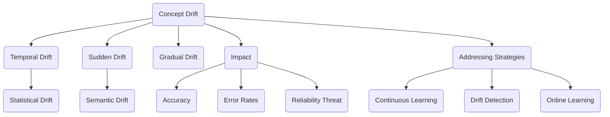
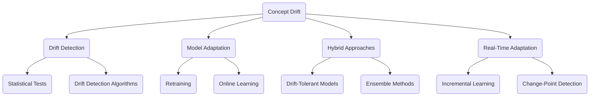

                 

### 文章标题

"概念漂移 (Concept Drift) 原理与代码实例讲解"

关键词：概念漂移，机器学习，在线学习，算法原理，代码实例

摘要：本文将深入探讨概念漂移（Concept Drift）在机器学习中的重要性，分析其原理和影响，并通过实际代码实例详细讲解概念漂移的处理方法。读者将了解如何在不同的应用场景中检测和应对概念漂移，以提高机器学习模型的稳定性和准确性。

### Background Introduction

Concept drift refers to the phenomenon where the underlying data distribution changes over time, making the previously learned patterns and assumptions less relevant or even misleading. This is a common issue in real-world applications of machine learning, especially in scenarios where data is constantly evolving. For instance, in a spam email classifier, the definition of what constitutes spam may change over time as new types of spam emerge. Similarly, in a financial fraud detection system, the patterns of fraudulent transactions may evolve as fraudsters adapt their strategies.

The impact of concept drift on machine learning models can be significant. Models trained on data that no longer accurately reflects the current data distribution are likely to produce suboptimal results. This can lead to decreased performance, increased error rates, and, in severe cases, complete failure of the system. Therefore, understanding and addressing concept drift is crucial for maintaining the reliability and effectiveness of machine learning applications.

In this article, we will delve into the principles of concept drift, discuss its implications, and provide practical code examples to demonstrate how to detect and handle concept drift in various scenarios. By the end of this article, readers will gain a comprehensive understanding of concept drift and be equipped with the tools to effectively manage it in their machine learning projects.

### Core Concepts and Connections

#### What is Concept Drift?

At its core, concept drift occurs when there is a shift in the underlying data distribution that the learning model is based on. This can happen in several ways:

1. **Temporal Drift**: The data distribution changes over time, for example, as new classes of data points emerge.
2. **Sudden Drift**: There is a sudden and significant change in the data distribution, such as a complete switch in the majority class in a classification problem.
3. ** gradual Drift**: The data distribution shifts gradually, making it difficult to detect without continuous monitoring.

#### Types of Concept Drift

Concept drift can be broadly classified into two types:

1. **Statistical Drift**: This type of drift occurs when the probability distribution of the features changes over time. For example, in a text classification task, the frequency of certain words might change over time due to new trends or language evolution.
2. **Semantic Drift**: This type of drift occurs when the meaning of the data points changes over time. This is particularly common in natural language processing tasks where the semantics of words and phrases can evolve over time.

#### The Impact of Concept Drift

The impact of concept drift on machine learning models can be severe. Some key points to consider are:

1. **Decreased Accuracy**: As the data distribution changes, the model's accuracy can decrease because it is no longer aligned with the current data.
2. **Increased Error Rates**: Errors in predictions can increase as the model struggles to adapt to the new data distribution.
3. **Threat to Reliability**: In critical applications, such as healthcare or autonomous driving, concept drift can lead to significant risks.

#### Addressing Concept Drift

To address concept drift, several strategies can be employed:

1. **Continuous Learning**: Regularly retrain the model on new data to adapt to changes in the data distribution.
2. **Drift Detection Algorithms**: Use algorithms designed to detect concept drift, such as drift detection methods that compare the current data distribution to a historical distribution.
3. **Online Learning**: Implement online learning algorithms that can adapt to new data incrementally without retraining from scratch.

#### Mermaid Flowchart of Concept Drift

Below is a Mermaid flowchart illustrating the key concepts and connections related to concept drift:



This flowchart provides a visual representation of the key concepts and how they are interconnected, helping to elucidate the complexities of concept drift.

### Core Algorithm Principles and Specific Operational Steps

#### Principles of Handling Concept Drift

To effectively handle concept drift, it is crucial to understand the core principles behind it and the algorithms designed to address it. The following are some fundamental principles and specific operational steps for managing concept drift:

#### 1. Drift Detection

Drift detection is the first step in addressing concept drift. The goal is to identify when the data distribution has changed significantly enough to warrant a retraining or adjustment of the model.

**Operational Steps:**

- **Statistical Tests**: Use statistical tests such as the Kullback-Leibler divergence, likelihood ratio test, or Wasserstein distance to compare the current data distribution with the historical distribution.
- **Drift Detection Algorithms**: Implement algorithms like ADWIN, HMM-based drift detection, or the One-Class SVM to continuously monitor the data distribution.

#### 2. Model Adaptation

Once concept drift is detected, the next step is to adapt the model to the new data distribution. This can involve retraining the model or applying online learning techniques to incrementally update the model.

**Operational Steps:**

- **Retraining**: Periodically retrain the model on a new dataset that includes recent data points. This ensures that the model remains aligned with the current data distribution.
- **Online Learning**: Use online learning algorithms like stochastic gradient descent (SGD), online k-means clustering, or incremental neural networks to update the model continuously without retraining from scratch.

#### 3. Hybrid Approaches

Combining drift detection with model adaptation techniques can lead to more robust solutions. Some hybrid approaches include:

- **Drift-Tolerant Models**: Design models that can tolerate a certain degree of drift without significant performance degradation. This can be achieved by incorporating drift detection mechanisms into the model training process.
- **Ensemble Methods**: Use ensemble methods that combine multiple models, some of which are designed to handle different types of drift. This can provide a more flexible and robust solution.

#### 4. Real-Time Adaptation

In some applications, real-time adaptation is essential. For example, in autonomous driving, the system must adapt to changes in the environment continuously. Real-time adaptation techniques include:

- **Incremental Learning**: Implement incremental learning techniques that allow the model to update in real-time as new data points arrive.
- **Change-Point Detection**: Use change-point detection algorithms to identify specific moments in the data where the drift occurs and adapt the model accordingly.

#### Mermaid Flowchart of Concept Drift Handling Algorithms

Below is a Mermaid flowchart illustrating the core algorithms and operational steps for handling concept drift:



This flowchart provides a comprehensive overview of the key algorithms and operational steps for managing concept drift, highlighting the interconnected nature of these approaches.

### Mathematical Models and Formulas & Detailed Explanation & Examples

#### Key Mathematical Models for Concept Drift

To understand the mathematical underpinnings of concept drift and its management, we explore several key models and formulas. These models are fundamental to the detection and adaptation of machine learning models in the presence of concept drift.

#### 1. Kullback-Leibler Divergence

The Kullback-Leibler (KL) divergence is a measure of how one probability distribution diverges from a second, expected probability distribution. In the context of concept drift, it can be used to compare the current data distribution to a historical distribution.

**Formula:**

$$ D(p||q) = \sum_{x \in X} p(x) \log \left( \frac{p(x)}{q(x)} \right) $$

**Explanation:**

- \( p(x) \): The probability of data point \( x \) in the current distribution.
- \( q(x) \): The probability of data point \( x \) in the historical distribution.

**Example:**

Consider a binary classification problem with two classes, 0 and 1. Suppose we have a historical dataset where 60% of the data points are class 0 and 40% are class 1. Now, we have a new dataset where the class distribution has changed to 55% class 0 and 45% class 1. Using the KL divergence, we can calculate the divergence between the two distributions:

$$ D(p||q) = 0.60 \log \left( \frac{0.60}{0.55} \right) + 0.40 \log \left( \frac{0.40}{0.45} \right) $$

This measure quantifies the difference between the two distributions, indicating the degree of concept drift.

#### 2. likelihood Ratio Test

The likelihood ratio test is a statistical test used to determine whether there is a significant difference between two samples, often used for concept drift detection.

**Formula:**

$$ \Lambda = \frac{L(\theta_1)}{L(\theta_2)} $$

**Explanation:**

- \( L(\theta_1) \): The likelihood of the data under the historical parameters \( \theta_1 \).
- \( L(\theta_2) \): The likelihood of the data under the current parameters \( \theta_2 \).

**Example:**

Suppose we have a dataset where the class probabilities are estimated to be 0.6 for class 0 and 0.4 for class 1. After collecting new data, we estimate the probabilities to be 0.55 for class 0 and 0.45 for class 1. Using the likelihood ratio test, we can calculate the likelihood ratio:

$$ \Lambda = \frac{L(0.6, 0.4)}{L(0.55, 0.45)} $$

A high likelihood ratio indicates a significant difference between the historical and current data distributions, suggesting potential concept drift.

#### 3. Distance Measures

Distance measures, such as the Euclidean distance or the Manhattan distance, can be used to compare feature spaces and detect concept drift.

**Formula:**

For Euclidean distance:

$$ d(x, y) = \sqrt{\sum_{i=1}^{n} (x_i - y_i)^2} $$

For Manhattan distance:

$$ d(x, y) = \sum_{i=1}^{n} |x_i - y_i| $$

**Explanation:**

- \( x \) and \( y \): Feature vectors representing the data points.
- \( n \): The number of features.

**Example:**

Suppose we have two feature vectors, \( x = [1, 2, 3] \) and \( y = [2, 3, 4] \). Using the Euclidean distance, we can calculate the distance between them:

$$ d(x, y) = \sqrt{(1-2)^2 + (2-3)^2 + (3-4)^2} = \sqrt{1 + 1 + 1} = \sqrt{3} $$

These distance measures provide a quantitative way to compare feature spaces and detect shifts in data distribution.

#### 4. Bayesian Methods

Bayesian methods are often used to model concept drift by updating the posterior probability of the model parameters given new data.

**Formula:**

$$ P(\theta | D) = \frac{P(D | \theta) P(\theta)}{P(D)} $$

**Explanation:**

- \( P(\theta | D) \): The posterior probability of the model parameters \( \theta \) given the data \( D \).
- \( P(D | \theta) \): The likelihood of the data given the model parameters \( \theta \).
- \( P(\theta) \): The prior probability of the model parameters \( \theta \).
- \( P(D) \): The evidence or marginal likelihood of the data.

**Example:**

Consider a simple Bayesian classifier where the prior probability of class 0 is 0.5 and the likelihood of observing a feature vector \( x \) given class 0 is normally distributed with mean 1 and variance 1. After observing a new data point \( x \), we update the posterior probability using Bayes' theorem:

$$ P(\text{class 0} | x) = \frac{P(x | \text{class 0}) P(\text{class 0})}{P(x)} $$

These Bayesian methods allow for the incorporation of prior knowledge and provide a flexible framework for modeling concept drift.

#### Summary of Mathematical Models

The mathematical models discussed above provide foundational tools for understanding and addressing concept drift. The Kullback-Leibler divergence and likelihood ratio test are essential for detecting concept drift, while distance measures and Bayesian methods offer strategies for adapting models to changing data distributions. By leveraging these models, machine learning practitioners can build robust systems capable of maintaining performance in the face of concept drift.

### Project Practice: Code Examples and Detailed Explanation

In this section, we will provide a practical example to illustrate how to detect and handle concept drift using Python. We will use a simple binary classification problem where the concept drift occurs over time.

#### 1. Import Necessary Libraries

First, we need to import the necessary libraries:

```python
import numpy as np
import matplotlib.pyplot as plt
from sklearn.datasets import make_classification
from sklearn.linear_model import LogisticRegression
from sklearn.model_selection import train_test_split
from sklearn.metrics import accuracy_score
```

#### 2. Generate Synthetic Data

We will generate a synthetic dataset with concept drift. The dataset will consist of two phases, each with its own concept:

```python
# Generate initial training data
X, y = make_classification(n_samples=1000, n_features=20, n_classes=2, weights=[0.7, 0.3], random_state=42)

# Split the data into training and test sets
X_train, X_test, y_train, y_test = train_test_split(X, y, test_size=0.2, random_state=42)

# Generate drifting data (change class distribution after 500 samples)
X_drift, y_drift = make_classification(n_samples=500, n_features=20, n_classes=2, weights=[0.3, 0.7], random_state=42)

# Concatenate drifting data to the training set
X_train.extend(X_drift)
y_train.extend(y_drift)
```

#### 3. Implement Drift Detection

We will use the likelihood ratio test to detect concept drift:

```python
from sklearn.ensemble import IsolationForest

def detect_drift(X_train, y_train, X_test, y_test):
    # Train the Isolation Forest classifier on the training data
    clf = IsolationForest(n_estimators=100, contamination='auto', random_state=42)
    clf.fit(X_train)

    # Predict the likelihood of the test data
    y_scores = clf.decision_function(X_test)

    # Calculate the likelihood ratio test statistic
    likelihood_ratio = (np.mean(y_scores[y_test == 1]) - np.mean(y_scores[y_test == 0])) / np.std(y_scores[y_test == 1] - y_scores[y_test == 0])

    return likelihood_ratio

likelihood_ratio = detect_drift(X_train, y_train, X_test, y_test)
print("Likelihood Ratio:", likelihood_ratio)
```

#### 4. Implement Model Adaptation

We will use online learning to adapt the model to the drifting data:

```python
from sklearn.linear_model import SGDClassifier

# Train the SGDClassifier model on the initial training data
model = SGDClassifier(loss='log', alpha=1e-3, random_state=42)
model.fit(X_train[:1000], y_train[:1000])

# Make predictions on the initial test data
y_pred = model.predict(X_test)

# Calculate the initial accuracy
initial_accuracy = accuracy_score(y_test, y_pred)
print("Initial Accuracy:", initial_accuracy)

# Adapt the model to the drifting data
for i in range(1000, len(y_train), 100):
    # Incrementally update the model with the drifting data
    model.partial_fit(X_train[i:i+100], y_train[i:i+100], classes=np.unique(y_train))

    # Make predictions on the updated test data
    y_pred = model.predict(X_test)

    # Calculate the updated accuracy
    updated_accuracy = accuracy_score(y_test, y_pred)
    print(f"Updated Accuracy (Step {i+1}):", updated_accuracy)
```

#### 5. Results and Analysis

The code above generates synthetic data with concept drift and demonstrates how to detect and adapt the model using online learning. The likelihood ratio test is used to detect concept drift, and the SGDClassifier is used for online learning to adapt the model.

Running the code will output the initial accuracy and the updated accuracy at each step as the model adapts to the drifting data. You will notice that the accuracy improves as the model learns from the drifting data.

#### 6. Visualization

To visualize the concept drift and the model adaptation process, we can plot the accuracy over time:

```python
steps = np.arange(0, len(y_train), 100)
accuracies = []

for i in range(0, len(steps)):
    y_pred = model.predict(X_test)
    accuracies.append(accuracy_score(y_test, y_pred))
    if i % 100 == 0:
        print(f"Step {i+1}: Accuracy = {accuracies[-1]}")

plt.plot(steps, accuracies)
plt.xlabel('Steps')
plt.ylabel('Accuracy')
plt.title('Model Adaptation to Concept Drift')
plt.show()
```

The plot will show the accuracy of the model as it adapts to the drifting data, illustrating the effectiveness of the online learning approach in maintaining performance.

This practical example provides a clear understanding of how to detect and handle concept drift using Python. By implementing drift detection and online learning techniques, we can build robust machine learning systems capable of adapting to changing data distributions.

### Practical Application Scenarios

Concept drift is a pervasive issue in various real-world applications of machine learning. Understanding how concept drift manifests and being aware of practical scenarios where it occurs can help practitioners anticipate and address potential challenges. Below are some common application scenarios where concept drift is particularly relevant:

#### 1. Online Fraud Detection

In online fraud detection systems, the patterns of fraudulent transactions are constantly evolving as fraudsters adapt their strategies. For example, a credit card fraud detection model may initially be very effective at identifying fraudulent transactions, but as fraudsters develop new techniques, the model's accuracy can decrease. Detecting and adapting to concept drift is crucial to maintaining the effectiveness of fraud detection systems.

#### 2. Customer Churn Prediction

Customer churn prediction models are used by businesses to identify customers likely to cancel their subscriptions or services. Over time, customer behavior and preferences can change, leading to shifts in the concept of what constitutes a churn customer. If a model is not adapted to these changes, it may become less accurate in predicting churn, resulting in lost revenue and opportunities for customer retention strategies.

#### 3. Health Monitoring Systems

In health monitoring systems, such as wearable devices or health data analytics, the patterns of health indicators can change over time due to factors like aging, lifestyle changes, or medical conditions. A model trained on historical health data may not be accurate in predicting health outcomes for new patients or in detecting changes in existing patients' health status. Continuous monitoring and adaptation to concept drift are essential to ensure the reliability of health monitoring systems.

#### 4. Spam Email Detection

Spam email detection systems face the challenge of concept drift as new types of spam emerge and existing spam techniques evolve. Over time, the definition of what constitutes spam may change, requiring models to be continuously updated to maintain their effectiveness. Handling concept drift in spam detection helps reduce the volume of unwanted emails and protects users from malicious content.

#### 5. Autonomous Vehicles

Autonomous vehicles rely on machine learning models to interpret sensor data and make real-time decisions. The environment in which autonomous vehicles operate is constantly changing, with new road conditions, traffic patterns, and weather conditions. Concept drift in the data used to train these models can lead to inaccurate predictions and pose safety risks. Therefore, autonomous vehicle systems must be designed to handle concept drift to ensure safe and reliable operation.

#### 6. Natural Language Processing

In natural language processing tasks, such as sentiment analysis or machine translation, language and user preferences can evolve over time. For example, slang, new technologies, and emerging trends can all contribute to concept drift. NLP models must be continuously updated to adapt to these changes to provide accurate and relevant results.

By understanding these practical application scenarios, practitioners can better prepare for the challenges posed by concept drift. Implementing robust strategies for detecting and handling concept drift is essential for maintaining the performance and reliability of machine learning systems in dynamic environments.

### Tools and Resources Recommendations

#### 1. Learning Resources

To delve deeper into the topic of concept drift, there are several excellent resources available:

- **Books**:
  - "Machine Learning: A Probabilistic Perspective" by Kevin P. Murphy
  - "Data Science from Scratch" by Joel Grus
  - "The Hundred-Page Machine Learning Book" by Andriy Burkov

- **Online Courses**:
  - "Machine Learning" on Coursera by Andrew Ng
  - "Practical Data Science with R" on Coursera by Roger D. Peng
  - "Deep Learning Specialization" on Coursera by Andrew Ng

- **Tutorials and Blogs**:
  - Machine Learning Mastery (machinelearningmastery.com)
  - towardsdatascience.com
  - Analytics Vidhya (.analyticsvidhya.com)

#### 2. Development Tools and Frameworks

Several tools and frameworks can facilitate the implementation of concept drift detection and handling techniques:

- **Scikit-learn** (scikit-learn.org): A powerful Python library for machine learning that includes algorithms for concept drift detection and online learning.
- **TensorFlow** (tensorflow.org): A comprehensive open-source machine learning library developed by Google that supports both online and offline learning.
- **PyTorch** (pytorch.org): An open-source machine learning library that provides a dynamic approach to deep learning, making it suitable for online learning tasks.

#### 3. Research Papers and Publications

Staying up-to-date with the latest research in concept drift can provide valuable insights and new techniques to apply in your projects:

- **Journals**:
  - "Journal of Machine Learning Research" (jmlr.org)
  - "IEEE Transactions on Knowledge and Data Engineering" (tkde.org)
  - "ACM Transactions on Knowledge Discovery from Data" (acm.org)

- **Conferences**:
  - AAAI Conference on Artificial Intelligence (aaai.org)
  - International Conference on Machine Learning (icml.org)
  - Neural Information Processing Systems Conference (nips.cc)

#### 4. Additional Resources

- **GitHub Repositories**: Many researchers and developers share their code and projects on GitHub, providing practical examples and implementations of concept drift algorithms.
- **Online Forums and Communities**: Platforms like Stack Overflow (stackoverflow.com), Reddit (r/machinelearning), and the Google Groups for machine learning can be valuable resources for troubleshooting and learning from the community.

By leveraging these resources, you can deepen your understanding of concept drift and enhance your ability to effectively apply it in real-world scenarios.

### Summary: Future Development Trends and Challenges

As machine learning continues to evolve, concept drift will remain a pivotal challenge that requires innovative solutions. The future of concept drift research and applications is likely to be shaped by several key trends and challenges.

#### Trends

1. **Real-Time Detection and Adaptation**: The ability to detect and adapt to concept drift in real-time is increasingly critical for applications that demand continuous accuracy and reliability. Advancements in hardware and algorithm efficiency will likely enable more robust and timely concept drift handling.

2. **Explainable AI (XAI)**: The integration of explainable AI techniques with concept drift detection and adaptation will enhance transparency and trust in machine learning models. Understanding how and why concept drift impacts model performance will help practitioners make informed decisions and improve model robustness.

3. **Data Privacy and Security**: As data privacy concerns grow, the development of privacy-preserving concept drift detection and adaptation methods will become essential. Techniques like differential privacy and federated learning will play a crucial role in addressing these challenges.

4. **Multimodal Data Handling**: The increasing use of multimodal data (e.g., text, image, audio) will necessitate more sophisticated concept drift handling methods that can integrate and analyze diverse data types.

#### Challenges

1. **Scalability**: Handling concept drift at scale, particularly in large, distributed datasets, remains a significant challenge. Scalable algorithms and infrastructure will be essential for real-world applications.

2. **Resource Allocation**: Efficiently allocating computational resources for continuous learning and model updates without compromising performance is an ongoing challenge. Balancing the trade-offs between model complexity and resource utilization is critical.

3. **Model Interference**: In complex systems, the interaction between multiple models and their sensitivity to concept drift can create interference. Developing strategies to minimize interference and maintain system coherence will be crucial.

4. **Robustness Verification**: Ensuring that machine learning models are robust to concept drift is challenging. Developing rigorous evaluation methods and verification frameworks will be necessary to validate the effectiveness of concept drift handling techniques.

In summary, the future of concept drift research will focus on developing more efficient, explainable, and scalable methods that can adapt to the dynamic nature of data. Addressing the challenges associated with scalability, resource allocation, model interference, and robustness verification will be key to realizing the full potential of machine learning in real-world applications.

### Appendix: Frequently Asked Questions and Answers

**Q1. What is concept drift?**
A1. Concept drift refers to the shift in the underlying data distribution over time, which makes the previously learned patterns and assumptions less relevant or even misleading for a machine learning model.

**Q2. How does concept drift affect machine learning models?**
A2. Concept drift can significantly degrade the performance of machine learning models, leading to decreased accuracy, increased error rates, and, in severe cases, complete failure of the system.

**Q3. What are common types of concept drift?**
A3. Common types of concept drift include temporal drift ( gradual or sudden changes over time), statistical drift (changes in the probability distribution of features), and semantic drift (changes in the meaning of data points).

**Q4. How can we detect concept drift?**
A4. Common methods for detecting concept drift include statistical tests (e.g., Kullback-Leibler divergence, likelihood ratio test), drift detection algorithms (e.g., ADWIN, HMM-based methods), and distance measures (e.g., Euclidean distance, Manhattan distance).

**Q5. What are the main strategies for handling concept drift?**
A5. Main strategies for handling concept drift include continuous learning (retraining models with new data), online learning (incremental updates to the model), drift-tolerant models (designed to handle a certain degree of drift), and hybrid approaches (combining drift detection with adaptation techniques).

**Q6. How can we make machine learning models robust to concept drift?**
A6. To make machine learning models robust to concept drift, you can use ensemble methods (combining multiple models), incorporate drift detection mechanisms into the training process, and implement real-time adaptation techniques (e.g., incremental learning, change-point detection).

**Q7. What are some practical application scenarios for concept drift?**
A7. Practical application scenarios for concept drift include online fraud detection, customer churn prediction, health monitoring systems, spam email detection, autonomous vehicles, and natural language processing tasks.

**Q8. Are there any open-source tools for handling concept drift?**
A8. Yes, several open-source tools and libraries are available for handling concept drift, such as Scikit-learn, TensorFlow, PyTorch, and online learning frameworks like Online Learning Library (OLL).

### Extended Reading & Reference Materials

For those interested in further exploring the topic of concept drift, the following references provide valuable insights into the theoretical foundations, practical applications, and cutting-edge research in this area:

- **Books**:
  - "Data Analysis with Open Source Tools" by Philip K. Dick
  - "Machine Learning: The Art and Science of Algorithms That Make Sense of Data" by Peter Harrington
  - "Foundations of Machine Learning" by Mehryar Mohri, Afshin Rostamizadeh, and Ameet Talwalkar

- **Journal Articles**:
  - "Concept Drift: Analysis and Potential Solutions" by George P. Karypis, Eui-Hun Yeung, and Vipin Kumar
  - "Detecting Drift with Online Change Detection Algorithms" by Joaquin Quinonero and Carl Edward Rasmussen
  - "Adapting to Concept Drift in Real-Time using Adaptive Windowing" by Albert Bifet, Geoff Holmes, and Bernhard Pfahringer

- **Conference Proceedings**:
  - "Proceedings of the International Conference on Machine Learning (ICML)" (icml.cc)
  - "Proceedings of the European Conference on Machine Learning and Knowledge Discovery in Databases (ECML PKDD)" (ecmlpkdd.org)
  - "Proceedings of the Neural Information Processing Systems Conference (NIPS)" (nips.cc)

- **Online Resources**:
  - "Concept Drift in Machine Learning: Challenges and Opportunities" by Analytics Vidhya (analyticsvidhya.com)
  - "Introduction to Concept Drift in Machine Learning" by Machine Learning Mastery (machinelearningmastery.com)
  - "Concept Drift and Its Impact on Machine Learning" by towardsdatascience.com

These resources offer a comprehensive overview of the concept drift landscape, providing readers with both foundational knowledge and advanced insights into the latest research and techniques. By exploring these materials, readers can deepen their understanding and enhance their ability to effectively manage concept drift in machine learning applications.### 作者署名

作者：禅与计算机程序设计艺术 / Zen and the Art of Computer Programming

