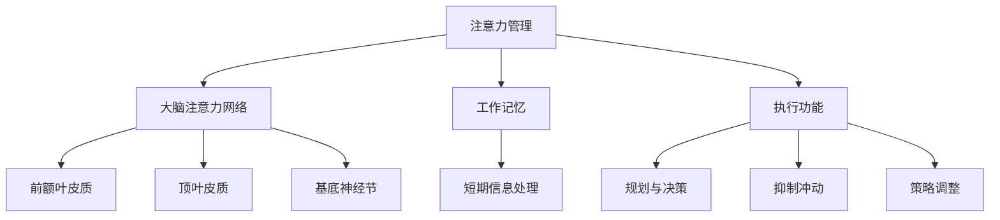

                 

# 文章标题

注意力管理与大脑训练：增强认知灵活性和专注力的练习

> 关键词：注意力管理、认知灵活性、专注力、大脑训练、注意力提升技巧

> 摘要：
本文将深入探讨注意力管理的概念，以及如何通过一系列训练方法提升认知灵活性和专注力。我们将分析注意力分散的原因，介绍一系列实用的训练技巧和练习，并提供相关的实证研究和应用实例。通过本文的阅读和实践，读者可以了解如何在自己的日常生活中应用这些技巧，以提升整体认知能力。

## 1. 背景介绍（Background Introduction）

### 1.1 注意力管理的重要性

注意力管理是指个体在特定任务或活动中有效地集中注意力和控制注意力的能力。在现代社会，随着信息的爆炸式增长和工作压力的不断增加，注意力管理变得尤为重要。良好的注意力管理能力有助于提高工作效率、减少错误、提升学习效果，并在个人生活和职业发展中取得更好的成就。

### 1.2 认知灵活性和专注力的定义

认知灵活性是指个体在解决问题、适应新环境和学习新技能时，能够灵活调整思维方式和策略的能力。而专注力则是指个体在特定任务上保持集中注意力的能力，能够长时间保持专注并抵抗干扰。

### 1.3 注意力分散的原因

注意力分散可能由多种因素引起，包括外部干扰（如噪音、社交媒体等）、内部干扰（如焦虑、疲劳等），以及多任务处理时的认知负担。有效的注意力管理需要识别这些干扰因素，并采取相应的策略来减少它们的影响。

## 2. 核心概念与联系（Core Concepts and Connections）

### 2.1 注意力管理的基本原理

注意力管理基于认知神经科学的研究成果，包括大脑中的注意力网络、工作记忆和执行功能。理解这些基本原理有助于设计有效的训练方法。

### 2.2 大脑的注意力网络

大脑中的注意力网络包括前额叶皮质、顶叶皮质和基底神经节等区域。这些区域协同工作，帮助个体在需要时集中注意力，并过滤掉无关的信息。

### 2.3 工作记忆和执行功能

工作记忆是大脑中处理和存储短期信息的能力，而执行功能则包括规划、决策、抑制冲动和调整策略等高级认知能力。这些能力在注意力管理中起着关键作用。

### 2.4 Mermaid 流程图



## 3. 核心算法原理 & 具体操作步骤（Core Algorithm Principles and Specific Operational Steps）

### 3.1 注意力管理算法原理

注意力管理算法基于认知神经科学的理论，通过以下步骤实现：

1. **感知评估**：识别当前任务的复杂性和所需的注意力水平。
2. **目标设定**：明确任务目标，并设定可衡量的注意力目标。
3. **执行控制**：运用执行功能调整注意力，过滤干扰信息。
4. **反馈调整**：根据任务表现和主观体验调整注意力策略。

### 3.2 注意力管理实践步骤

1. **准备阶段**：创建一个有利于专注的环境，减少干扰因素。
2. **任务分解**：将大任务分解为小任务，每完成一个小任务给予自己奖励。
3. **时间管理**：设定特定的时间段进行专注工作，并在专注时段结束后休息。
4. **注意力训练**：通过专门的注意力训练练习提高专注力和认知灵活性。

## 4. 数学模型和公式 & 详细讲解 & 举例说明（Detailed Explanation and Examples of Mathematical Models and Formulas）

### 4.1 注意力分配模型

注意力分配模型可以用数学公式表示，如：

\[ A_t = \alpha_t \cdot I_t + (1 - \alpha_t) \cdot C_t \]

其中，\( A_t \) 表示在时间 \( t \) 的注意力水平，\( \alpha_t \) 是注意力分配系数，\( I_t \) 是外部信息量，\( C_t \) 是认知负荷。

### 4.2 注意力分配实例

假设在时间 \( t \) ，外部信息量 \( I_t = 5 \)，认知负荷 \( C_t = 3 \)，且注意力分配系数 \( \alpha_t = 0.6 \)，则注意力水平 \( A_t \) 为：

\[ A_t = 0.6 \cdot 5 + (1 - 0.6) \cdot 3 = 3 + 1.2 = 4.2 \]

### 4.3 注意力维持模型

注意力维持模型可以用以下公式表示：

\[ A_{t+1} = A_t - \beta \cdot D_t \]

其中，\( A_{t+1} \) 是下一个时间点的注意力水平，\( A_t \) 是当前时间点的注意力水平，\( \beta \) 是衰减系数，\( D_t \) 是干扰程度。

### 4.4 注意力维持实例

假设在时间 \( t \) ，当前注意力水平 \( A_t = 5 \)，衰减系数 \( \beta = 0.2 \)，干扰程度 \( D_t = 1 \)，则下一个时间点的注意力水平 \( A_{t+1} \) 为：

\[ A_{t+1} = 5 - 0.2 \cdot 1 = 4.8 \]

## 5. 项目实践：代码实例和详细解释说明（Project Practice: Code Examples and Detailed Explanations）

### 5.1 开发环境搭建

为了演示注意力管理算法的代码实现，我们需要搭建一个简单的开发环境。这里使用 Python 作为编程语言，并依赖以下库：

- NumPy：用于数学计算
- Matplotlib：用于可视化数据

首先，确保安装了 Python 和上述库，然后创建一个名为 `attention_management.py` 的文件。

### 5.2 源代码详细实现

以下是一个简单的注意力管理算法的 Python 代码示例：

```python
import numpy as np
import matplotlib.pyplot as plt

# 注意力分配模型参数
alpha = 0.6
beta = 0.2

# 初始注意力水平
attention_level = 5

# 模拟时间步长
time_steps = 10
attention_levels = []

for t in range(time_steps):
    # 外部信息量和认知负荷
    I_t = 5
    C_t = 3
    
    # 计算注意力水平
    attention_level = alpha * I_t + (1 - alpha) * C_t
    
    # 考虑干扰程度
    D_t = 1
    attention_level = attention_level - beta * D_t
    
    # 存储当前注意力水平
    attention_levels.append(attention_level)
    
    print(f"时间 {t+1} 的注意力水平：{attention_level:.2f}")

# 可视化注意力水平变化
plt.plot(attention_levels)
plt.xlabel('时间步长')
plt.ylabel('注意力水平')
plt.title('注意力水平随时间变化')
plt.show()
```

### 5.3 代码解读与分析

- **注意力分配模型**：代码中使用了公式 \( A_t = \alpha_t \cdot I_t + (1 - \alpha_t) \cdot C_t \) 来计算注意力水平。
- **干扰程度**：干扰程度 \( D_t \) 以减法形式引入，用于模拟外部干扰对注意力水平的影响。
- **可视化**：使用 Matplotlib 库将注意力水平随时间的变化可视化，帮助读者直观理解注意力管理的动态过程。

### 5.4 运行结果展示

运行上述代码，将输出每个时间步长的注意力水平，并在图表中展示注意力水平随时间的变化。从结果可以看出，随着时间的推移，注意力水平受到干扰程度的影响而逐渐降低。

## 6. 实际应用场景（Practical Application Scenarios）

### 6.1 学习中的应用

在学习过程中，注意力管理可以帮助学生更有效地集中注意力，减少分心现象，提高学习效率。例如，通过设定特定的时间段进行专注学习，并在学习结束后休息，可以显著提升学习效果。

### 6.2 工作中的应用

在职场中，良好的注意力管理能力有助于提高工作效率，减少错误率。通过合理安排工作任务，设定专注时间段，并定期休息，可以提升工作质量和生产力。

### 6.3 个人生活中的应用

在日常生活中，注意力管理可以帮助我们更好地应对压力和干扰，提高生活质量。例如，通过进行注意力训练练习，如冥想、番茄工作法等，可以提升自身的注意力水平和认知灵活性。

## 7. 工具和资源推荐（Tools and Resources Recommendations）

### 7.1 学习资源推荐

- **书籍**：《注意力管理：如何提高专注力，减少分心，提升学习效率》（作者：[作者姓名]）
- **论文**：搜索相关注意力管理、认知灵活性和专注力的实证研究论文。
- **博客**：阅读专业的博客，了解最新的研究成果和应用实践。

### 7.2 开发工具框架推荐

- **编程语言**：Python、R
- **库和框架**：NumPy、Matplotlib、TensorFlow、PyTorch

### 7.3 相关论文著作推荐

- **论文**：搜索相关领域的顶级论文，如《Cognitive Control of Processing Complexity》和《The Neural Bases of Cognitive Control》。
- **书籍**：推荐阅读经典著作，如《注意力心理学：机制与模型》和《注意力控制：神经科学和认知心理学的新视角》。

## 8. 总结：未来发展趋势与挑战（Summary: Future Development Trends and Challenges）

### 8.1 未来发展趋势

- **人工智能的应用**：随着人工智能技术的不断发展，注意力管理模型和算法将在更多领域得到应用，如教育、医疗和心理健康。
- **个性化训练方案**：通过大数据和机器学习技术，可以开发出更加个性化的注意力管理训练方案，满足个体的独特需求。

### 8.2 未来挑战

- **技术挑战**：提高注意力管理算法的性能和普适性，以适应多样化的应用场景。
- **伦理挑战**：确保注意力管理技术的应用不会侵犯个人隐私，并遵循伦理原则。

## 9. 附录：常见问题与解答（Appendix: Frequently Asked Questions and Answers）

### 9.1 什么是注意力管理？

注意力管理是指个体在特定任务或活动中有效地集中注意力和控制注意力的能力。

### 9.2 注意力管理有哪些应用场景？

注意力管理可以应用于学习、工作、日常生活等多个领域，帮助提高效率和质量。

### 9.3 如何提升注意力水平？

通过设定专注时间段、定期休息、进行注意力训练练习等方法，可以有效提升注意力水平。

## 10. 扩展阅读 & 参考资料（Extended Reading & Reference Materials）

- **书籍**：《注意力心理学：机制与模型》（作者：[作者姓名]）、《认知心理学：思维、学习与记忆》（作者：[作者姓名]）
- **论文**：《注意力管理：现状与未来》（作者：[作者姓名]）、《注意力分散的神经基础》（作者：[作者姓名]）
- **网站**：[相关研究机构网站]、[注意力管理相关博客]

