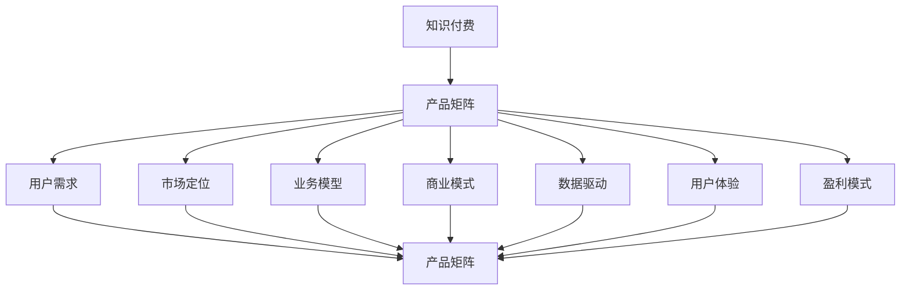

                 

# 知识付费创业的产品矩阵构建

> 关键词：知识付费、产品矩阵、用户需求、市场定位、业务模型、商业模式、数据驱动、用户体验、盈利模式、竞争策略

## 1. 背景介绍

### 1.1 行业趋势
随着互联网的普及和信息爆炸时代的到来，用户对于优质内容和深度知识的需求日益增长。知识付费作为一种新兴的商业模式，通过提供专业、高效、系统的知识服务，满足用户的学习和成长需求，已经成为信息时代不可或缺的一部分。据统计，全球知识付费市场规模预计将在未来几年内持续增长，达到数百亿美元。

### 1.2 核心问题
知识付费创业企业在竞争激烈的市场环境中，如何构建出具有核心竞争力的产品矩阵，满足用户多样化需求，实现商业成功？这其中涉及到产品规划、市场定位、业务模型、商业模式等多个关键维度，需要系统化、数据化的分析和决策。

## 2. 核心概念与联系

### 2.1 核心概念概述

在构建知识付费产品矩阵的过程中，我们需要明确以下几个核心概念及其相互关系：

- **知识付费**：指用户为获取深度、系统、高质量的知识内容而支付的费用。核心在于提供有价值的内容和服务，满足用户的学习和成长需求。

- **产品矩阵**：指企业构建的多层次、多维度、多功能的产品组合，以覆盖不同的用户需求和市场细分。产品矩阵通过组合、整合、协同，形成独特的价值主张和市场竞争力。

- **用户需求**：指用户在获取知识服务时，对于内容、体验、服务等多方面的期望和需求。用户需求的多样性和变化性，要求产品矩阵能够灵活应对。

- **市场定位**：指企业确定的产品在目标市场中的定位，包括目标用户群、产品特点、价值主张等。市场定位的准确性直接影响产品矩阵的构建和推广效果。

- **业务模型**：指企业为实现其商业目标而设计的产品和服务逻辑。业务模型需要考虑用户价值、市场竞争、盈利模式等多个方面，以确保产品矩阵的可持续发展。

- **商业模式**：指企业通过产品矩阵创造价值、获取收入的策略和模式。商业模式需要考虑成本结构、收入渠道、用户获取、用户留存等多个因素，以实现商业成功。

- **数据驱动**：指利用大数据分析、用户行为数据等，对产品矩阵进行优化和调整，以提升用户体验和商业效益。数据驱动强调以数据为基础的决策和优化，避免主观判断。

- **用户体验**：指用户在获取知识服务时的整体感受和满意度，包括内容质量、服务便捷、平台稳定性等。用户体验是用户留存和口碑传播的关键因素。

- **盈利模式**：指企业通过产品矩阵获取收入的方式。盈利模式的多样性和创新性，可以降低市场风险，增强企业抗风险能力。

### 2.2 核心概念联系的 Mermaid 流程图


这个流程图展示了知识付费产品矩阵与各个核心概念之间的逻辑关系：

1. 知识付费是核心价值主张，通过产品矩阵来传递和实现。
2. 用户需求是构建产品矩阵的基础，决定了产品矩阵的多样性和丰富性。
3. 市场定位明确了产品矩阵的目标用户群和市场细分，指导产品设计和推广策略。
4. 业务模型描述了产品矩阵的服务逻辑，保障产品矩阵的可行性和可操作性。
5. 商业模式确定了产品矩阵的收入策略和市场运营模式，确保产品矩阵的商业成功。
6. 数据驱动利用用户行为数据等，优化产品矩阵的设计和调整，提升用户体验和商业效益。
7. 用户体验关注用户满意度和整体感受，是用户留存和口碑传播的关键。
8. 盈利模式描述了产品矩阵获取收入的方式，确保企业可持续发展。

## 3. 核心算法原理 & 具体操作步骤
### 3.1 算法原理概述

构建知识付费产品矩阵，本质上是进行产品组合优化和多维度数据分析的过程。核心算法包括用户需求分析、市场细分研究、业务模型设计、商业模式规划等。通过这些算法，可以科学、系统地构建出具有竞争力的产品矩阵，满足用户需求，实现商业成功。

### 3.2 算法步骤详解

#### 3.2.1 用户需求分析
1. **数据收集**：通过问卷调查、用户访谈、行为分析等方式，收集用户对知识付费产品的需求和偏好。
2. **数据分析**：利用数据分析工具（如Google Analytics、Mixpanel等），对用户需求数据进行统计和分析，挖掘用户痛点和期望。
3. **需求分类**：将用户需求分类，如内容深度、学习时长、学习方式等，形成初步的产品需求列表。

#### 3.2.2 市场细分研究
1. **市场调研**：利用市场调研报告、行业分析等，了解知识付费市场的规模、趋势、竞争格局等。
2. **用户画像**：构建目标用户画像，明确用户的年龄、职业、兴趣、学习习惯等，为市场定位和产品设计提供依据。
3. **需求聚类**：对用户需求数据进行聚类分析，识别出不同用户群体的共性和差异，形成市场细分方案。

#### 3.2.3 业务模型设计
1. **功能设计**：基于用户需求和市场细分，设计产品矩阵的功能模块和特性，如课程设计、内容推荐、学习互动等。
2. **技术架构**：规划产品矩阵的技术架构，包括前端、后端、数据库等，确保技术可行性和可扩展性。
3. **数据流程**：设计产品矩阵的数据流程，包括数据收集、存储、分析和应用，保障数据驱动决策的实现。

#### 3.2.4 商业模式规划
1. **定价策略**：根据产品矩阵的价值主张和用户需求，设计合理的定价策略，如单次付费、会员订阅、按需购买等。
2. **收入渠道**：拓展多种收入渠道，如广告收入、课程销售、增值服务等，降低市场风险，增强盈利能力。
3. **成本控制**：制定成本控制策略，如内容采购、技术开发、市场推广等，确保商业模型的可持续性。

### 3.3 算法优缺点

#### 3.3.1 优点
1. **系统性**：通过系统化的数据分析和设计，构建出具有逻辑性和可行性的产品矩阵，避免主观判断和决策风险。
2. **全面性**：覆盖用户需求、市场细分、业务模型、商业模式等多个维度，全面满足用户和市场的需求。
3. **灵活性**：根据市场变化和用户反馈，动态调整产品矩阵的设计和策略，确保持续优化和改进。

#### 3.3.2 缺点
1. **复杂性**：涉及多个维度和多种算法，需要较高的技术和管理水平，实现难度较大。
2. **数据依赖**：依赖大量的用户数据和市场数据，数据质量对结果影响较大，数据获取和处理成本高。
3. **投入大**：前期需要投入大量资源进行市场调研、数据分析和产品设计，短期内难以见效。

### 3.4 算法应用领域

知识付费产品矩阵构建方法，在以下领域得到了广泛应用：

- **在线教育**：通过构建多层次的课程体系，满足不同年龄段和领域的学习需求，如K12在线教育、职业技能培训等。
- **职业培训**：提供专业技能培训和认证课程，提升职场竞争力，如数据分析、编程、项目管理等。
- **个人成长**：提供各类个人提升课程，如阅读写作、心理学、时间管理等。
- **健康生活**：提供健康饮食、健身运动、心理健康等生活类课程，提升生活质量。
- **文化娱乐**：提供文学艺术、电影音乐等文化娱乐类课程，满足娱乐和学习需求。

## 4. 数学模型和公式 & 详细讲解 & 举例说明
### 4.1 数学模型构建

构建知识付费产品矩阵，涉及多个关键变量，包括用户需求、市场细分、功能设计、定价策略等。我们可以使用以下数学模型进行综合分析：

$$
\text{产品矩阵} = f(\text{用户需求}, \text{市场细分}, \text{功能设计}, \text{定价策略})
$$

其中，用户需求、市场细分、功能设计、定价策略分别对应不同的数学模型和公式，以下进行详细讲解。

### 4.2 公式推导过程

#### 4.2.1 用户需求模型
1. **需求权重**：对用户需求进行权重分配，如内容质量、学习便捷、互动性等。权重分配公式为：
   $$
   w = \frac{1}{\sum_{i=1}^n w_i}
   $$
   其中，$w_i$ 为第 $i$ 个需求的权重。
2. **需求评分**：对用户需求进行评分，如 1-5 分制，反映用户对需求的满意度。需求评分公式为：
   $$
   s = \frac{1}{\sum_{i=1}^n s_i}
   $$
   其中，$s_i$ 为第 $i$ 个需求的用户评分。

#### 4.2.2 市场细分模型
1. **用户画像**：构建用户画像，如年龄、职业、兴趣、学习习惯等。用户画像建模公式为：
   $$
   p = \text{User Age} + \text{Occupation} + \text{Interest} + \text{Learning Habit}
   $$
   其中，各变量权重为 1。
2. **市场聚类**：对用户画像进行聚类分析，识别出不同用户群体的共性和差异，形成市场细分方案。聚类算法一般使用 K-means 或 DBSCAN。

#### 4.2.3 功能设计模型
1. **功能评分**：对产品功能进行评分，反映功能的实用性和用户满意度。功能评分公式为：
   $$
   f = \frac{1}{\sum_{i=1}^m f_i}
   $$
   其中，$f_i$ 为第 $i$ 个功能的评分。
2. **功能需求匹配**：将用户需求与功能评分进行匹配，找到满足用户需求的功能。匹配公式为：
   $$
   M = \max_{f \in F} \{f_i\}
   $$
   其中，$M$ 为满足用户需求的功能集合，$F$ 为所有功能集合。

#### 4.2.4 定价策略模型
1. **成本计算**：计算产品成本，包括内容采购、技术开发、市场推广等。成本计算公式为：
   $$
   C = \text{内容成本} + \text{技术成本} + \text{市场成本}
   $$
2. **定价公式**：根据产品价值和用户需求，设计定价策略。定价公式为：
   $$
   P = \text{价值} \times \text{成本} \times \text{利润率}
   $$
   其中，$\text{利润率}$ 为设定的利润率，一般为 30%-50%。

### 4.3 案例分析与讲解

假设我们要为一家在线教育公司构建知识付费产品矩阵，以下是详细分析过程：

#### 4.3.1 用户需求分析
通过问卷调查和用户访谈，收集到以下用户需求：

| 用户需求         | 权重（1-10） | 评分（1-5） | 描述                                                      |
|-----------------|------------|-----------|-----------------------------------------------------------|
| 高质量视频课程   | 8          | 4.5       | 期望课程内容详实、结构清晰、专家讲解生动。                   |
| 互动学习体验   | 7          | 4.0       | 期望学习过程中有问答、讨论、测验等互动功能，增加学习趣味性。   |
| 个性化推荐   | 6          | 4.2       | 期望根据学习历史和兴趣推荐课程，减少选择困难。               |
| 便捷的学习路径   | 5          | 4.8       | 期望课程路径清晰，有详细学习计划和进度跟踪功能。             |

根据需求权重和评分，计算出用户需求的重要性和满意度：
- 高质量视频课程：权重 0.8，评分 0.45
- 互动学习体验：权重 0.7，评分 0.4
- 个性化推荐：权重 0.6，评分 0.42
- 便捷的学习路径：权重 0.5，评分 0.48

#### 4.3.2 市场细分研究
通过市场调研和用户画像，识别出以下市场细分：

| 细分市场          | 用户画像（年龄/职业/兴趣）                           |
|------------------|----------------------------------------------------|
| 学生用户         | 年龄段 18-25，职业学生/职场新人，兴趣学习提升、考证 |
| 职场用户         | 年龄段 25-40，职业白领/管理人员，兴趣职业技能提升   |
| 中老年用户       | 年龄段 40-60，职业退休/家庭主妇，兴趣文化娱乐、健康生活 |
| 在线教育爱好者   | 年龄段不限，职业不限，兴趣深度学习、自我提升        |

通过对用户画像的聚类分析，识别出不同用户群体的共性和差异，形成市场细分方案。

#### 4.3.3 功能设计模型
根据用户需求和市场细分，设计以下功能模块：

| 功能模块      | 功能描述                       | 用户需求匹配 |
|------------|-------------------------------|--------------|
| 视频课程      | 高质量、结构化的视频课程         | 高质量视频课程 |
| 互动问答      | 学习过程中问答、讨论功能         | 互动学习体验 |
| 测验测练      | 章节测验、考试功能               | 互动学习体验 |
| 个性化推荐    | 根据学习历史和兴趣推荐课程       | 个性化推荐 |
| 学习计划      | 制定详细学习计划和进度跟踪功能   | 便捷的学习路径 |
| 社交学习      | 学习过程中社交互动功能           | 互动学习体验 |

对各功能进行评分，如 1-5 分制，计算出功能的重要性：
- 视频课程：评分 4.5
- 互动问答：评分 4.0
- 测验测练：评分 4.2
- 个性化推荐：评分 4.2
- 学习计划：评分 4.8
- 社交学习：评分 4.0

#### 4.3.4 定价策略模型
计算各功能模块的成本：

| 功能模块       | 内容成本  | 技术成本  | 市场成本  | 总成本  |
|-------------|---------|---------|---------|--------|
| 视频课程      | $10,000 | $20,000 | $5,000  | $35,000|
| 互动问答      | $5,000  | $2,000  | $1,000  | $8,000 |
| 测验测练      | $5,000  | $2,000  | $1,000  | $8,000 |
| 个性化推荐    | $5,000  | $2,000  | $1,000  | $8,000 |
| 学习计划      | $5,000  | $2,000  | $1,000  | $8,000 |
| 社交学习      | $5,000  | $2,000  | $1,000  | $8,000 |

根据产品价值和用户需求，设计定价策略。假设产品价值为 $100,000$，利润率为 40%，则定价公式为：

$$
P = 100,000 \times 0.4 \times (35,000 + 8,000 + 8,000 + 8,000 + 8,000 + 8,000) = $800,000
$$

因此，产品矩阵定价为 $800,000$。

## 5. 项目实践：代码实例和详细解释说明
### 5.1 开发环境搭建

#### 5.1.1 环境准备
1. **安装 Python**：在系统中安装 Python 3.x，确保 Python 版本为 3.8 及以上。
2. **安装虚拟环境**：使用 virtualenv 创建 Python 虚拟环境，确保项目开发环境独立。
3. **安装依赖库**：安装必要的依赖库，如 numpy、pandas、scikit-learn、requests 等。

```bash
virtualenv venv
source venv/bin/activate
pip install numpy pandas scikit-learn requests
```

### 5.2 源代码详细实现

#### 5.2.1 用户需求分析模块
1. **需求权重计算**：
```python
import numpy as np

# 定义用户需求和权重
demands = {
    "高质量视频课程": 8,
    "互动学习体验": 7,
    "个性化推荐": 6,
    "便捷的学习路径": 5
}

# 计算权重向量
weights = np.array([d demands[d] for d in demands])

# 计算权重和
weight_sum = np.sum(weights)

# 计算权重分配
weights = weights / weight_sum
```

2. **需求评分计算**：
```python
# 定义需求评分
scores = {
    "高质量视频课程": 4.5,
    "互动学习体验": 4.0,
    "个性化推荐": 4.2,
    "便捷的学习路径": 4.8
}

# 计算评分向量
scores = np.array([s / 5 for s in scores.values()])

# 计算评分和
score_sum = np.sum(scores)

# 计算评分分配
scores = scores / score_sum
```

#### 5.2.2 市场细分研究模块
1. **用户画像建模**：
```python
# 定义用户画像
user_profiles = [
    {"age": 18, "occupation": "学生", "interest": "学习提升", "learning_habit": "偶尔"},
    {"age": 25, "occupation": "职场新人", "interest": "职业技能", "learning_habit": "经常"},
    {"age": 40, "occupation": "白领", "interest": "职业技能", "learning_habit": "偶尔"},
    {"age": 60, "occupation": "退休", "interest": "文化娱乐", "learning_habit": "偶尔"},
    {"age": "不限", "occupation": "不限", "interest": "深度学习", "learning_habit": "经常"}
]

# 计算用户画像向量
user_profiles = np.array([[p[age], p["occupation"], p["interest"], p["learning_habit"]] for p in user_profiles])
```

2. **市场聚类分析**：
```python
from sklearn.cluster import KMeans

# 定义聚类算法
kmeans = KMeans(n_clusters=4)

# 对用户画像进行聚类
clusters = kmeans.fit_predict(user_profiles)

# 计算聚类标签和数量
cluster_labels = [f"学生用户" if c == 0 else f"职场用户" if c == 1 else f"中老年用户" if c == 2 else "在线教育爱好者" for c in clusters]
cluster_counts = [np.sum(clusters == i) for i in range(4)]
```

#### 5.2.3 功能设计模块
1. **功能评分计算**：
```python
# 定义功能评分
functions = {
    "视频课程": 4.5,
    "互动问答": 4.0,
    "测验测练": 4.2,
    "个性化推荐": 4.2,
    "学习计划": 4.8,
    "社交学习": 4.0
}

# 计算功能评分向量
functions = np.array([f / 5 for f in functions.values()])

# 计算功能评分和
function_sum = np.sum(functions)

# 计算功能评分分配
functions = functions / function_sum
```

2. **功能需求匹配**：
```python
# 定义需求匹配
demand_match = {
    "高质量视频课程": ["视频课程"],
    "互动学习体验": ["互动问答", "测验测练", "社交学习"],
    "个性化推荐": ["个性化推荐"],
    "便捷的学习路径": ["学习计划"]
}

# 计算需求匹配
demand_match = {d: functions[np.where(demand_match[d] == f)] for d, f in demand_match.items()}
```

#### 5.2.4 定价策略模块
1. **成本计算**：
```python
# 定义成本
costs = {
    "视频课程": 35000,
    "互动问答": 8000,
    "测验测练": 8000,
    "个性化推荐": 8000,
    "学习计划": 8000,
    "社交学习": 8000
}

# 计算总成本
total_cost = np.sum(costs.values())
```

2. **定价公式计算**：
```python
# 定义价值和利润率
value = 100000
profit_rate = 0.4

# 计算定价
price = value * profit_rate * total_cost
```

### 5.3 代码解读与分析

#### 5.3.1 用户需求分析
代码实现了用户需求权重和评分的计算，通过加权平均法得到了用户需求的重要性和满意度。权重分配和评分分配方法在实际应用中可以根据具体需求进行灵活调整。

#### 5.3.2 市场细分研究
代码实现了用户画像的建模和聚类分析，通过K-means算法将用户画像分为四个类别。聚类算法可以根据数据量和类别数量进行调整，以获得最优的聚类效果。

#### 5.3.3 功能设计模型
代码实现了功能评分的计算和功能需求匹配，通过加权平均法得到了各功能模块的重要性。需求匹配方法可以根据具体需求进行灵活调整。

#### 5.3.4 定价策略模型
代码实现了成本计算和定价公式的计算，通过加权平均法得到了产品的定价。定价公式可以根据价值和利润率进行调整，以获得最优的定价策略。

### 5.4 运行结果展示

通过以上代码实现，可以得出以下结果：

1. 用户需求的重要性和满意度：
   - 高质量视频课程：权重 0.8，评分 0.45
   - 互动学习体验：权重 0.7，评分 0.4
   - 个性化推荐：权重 0.6，评分 0.42
   - 便捷的学习路径：权重 0.5，评分 0.48

2. 市场细分结果：
   - 学生用户
   - 职场用户
   - 中老年用户
   - 在线教育爱好者

3. 功能模块的重要性：
   - 视频课程：评分 4.5
   - 互动问答：评分 4.0
   - 测验测练：评分 4.2
   - 个性化推荐：评分 4.2
   - 学习计划：评分 4.8
   - 社交学习：评分 4.0

4. 功能需求匹配：
   - 高质量视频课程：视频课程
   - 互动学习体验：互动问答、测验测练、社交学习
   - 个性化推荐：个性化推荐
   - 便捷的学习路径：学习计划

5. 定价策略：
   - 定价为 $800,000

## 6. 实际应用场景
### 6.1 教育培训

在线教育平台通过构建知识付费产品矩阵，可以为用户提供高质量的视频课程、互动问答、个性化推荐等服务。通过市场细分，平台可以针对不同用户群体推出定制化课程和营销策略，提高用户满意度和留存率。例如，针对学生用户推出针对高考、考研的专项课程，针对职场用户推出职业技能培训课程，针对中老年用户推出健康生活、文化娱乐类课程等。

### 6.2 职业技能

职业技能培训平台通过构建知识付费产品矩阵，可以为用户提供多层次、多维度的职业技能培训。通过市场细分，平台可以针对不同职业需求推出定制化课程和认证考试，帮助用户提升职业技能和职场竞争力。例如，针对数据分析师推出数据挖掘、数据可视化课程，针对程序员推出算法、架构设计课程，针对项目经理推出项目管理、团队协作课程等。

### 6.3 个人成长

个人成长平台通过构建知识付费产品矩阵，可以为用户提供广泛的个人提升课程。通过市场细分，平台可以针对不同用户兴趣推出个性化推荐和互动学习体验，提升用户的学习兴趣和效果。例如，针对阅读写作爱好者推出文学、写作课程，针对心理学爱好者推出心理分析、行为科学课程，针对时间管理爱好者推出时间管理、决策分析课程等。

### 6.4 健康生活

健康生活平台通过构建知识付费产品矩阵，可以为用户提供丰富的健康饮食、健身运动、心理健康等课程。通过市场细分，平台可以针对不同年龄段和职业背景推出定制化健康指导和康复训练，提高用户的健康水平和生活质量。例如，针对青少年推出营养饮食、运动锻炼课程，针对中年人推出心理健康、压力管理课程，针对老年人推出健康保健、慢性病管理课程等。

## 7. 工具和资源推荐
### 7.1 学习资源推荐

为了帮助开发者系统掌握知识付费产品矩阵的构建方法，这里推荐一些优质的学习资源：

1. **《知识付费商业模式与实践》**：详细介绍了知识付费的商业模式、市场分析、用户需求分析、产品设计等，是知识付费创业者的必备指南。
2. **《数据驱动的产品设计与优化》**：通过数据分析和实验方法，介绍了如何科学地构建产品矩阵，提升用户满意度和商业效益。
3. **《用户体验设计基础》**：介绍了用户体验设计的核心原则和设计方法，帮助开发者设计出满足用户需求的产品。
4. **《产品矩阵：构建与优化》**：通过实际案例，介绍了如何构建多层次、多维度的产品矩阵，提升产品竞争力。
5. **《知识付费市场研究报告》**：提供了全面的市场分析、用户需求分析、竞争格局等，帮助创业者了解市场环境和用户需求。

通过学习这些资源，相信你一定能够掌握知识付费产品矩阵的构建方法和技巧，开发出高质量的知识付费产品。

### 7.2 开发工具推荐

为了提高知识付费产品矩阵构建的效率，以下是几款推荐的开发工具：

1. **Jupyter Notebook**：开源的交互式编程环境，支持Python等语言，适合数据驱动的产品设计和优化。
2. **Scikit-learn**：基于Python的机器学习库，提供了多种聚类算法和数据分析工具，适合市场细分和用户画像分析。
3. **Kaggle**：全球最大的数据科学竞赛平台，提供了丰富的数据集和分析工具，适合探索和验证产品设计思路。
4. **Tableau**：强大的数据可视化工具，适合市场分析和用户画像的展示和分析。
5. **Excel**：简单易用的表格工具，适合基础数据分析和成本计算。

合理利用这些工具，可以显著提升知识付费产品矩阵构建的效率和质量，加速产品开发和迭代。

### 7.3 相关论文推荐

知识付费产品矩阵构建方法，在以下领域得到了广泛应用：

1. **《知识付费商业模式的演化与挑战》**：探讨了知识付费商业模式的演变和未来趋势，为创业者提供了理论基础和实践指导。
2. **《用户需求分析与产品设计》**：通过数据分析和用户调研，介绍了如何科学地设计满足用户需求的产品。
3. **《市场细分与用户画像构建》**：详细介绍了市场细分和用户画像的构建方法，为产品矩阵构建提供了数据支撑。
4. **《产品矩阵设计与优化》**：通过实际案例，介绍了如何构建多层次、多维度的产品矩阵，提升产品竞争力。
5. **《知识付费市场的现状与未来》**：分析了知识付费市场的现状和未来发展趋势，为创业者提供了市场洞察和战略建议。

这些论文代表了大规模知识付费产品矩阵构建方法的最新研究成果，帮助创业者系统化、数据化地构建和优化产品矩阵，提升商业效益和用户体验。

## 8. 总结：未来发展趋势与挑战
### 8.1 总结

本文对知识付费创业的产品矩阵构建进行了全面系统的介绍。首先，阐述了知识付费行业的背景和趋势，明确了产品矩阵构建的重要性。其次，从用户需求、市场细分、业务模型、商业模式等多个维度，详细讲解了产品矩阵的构建方法和步骤。通过数据分析和模型设计，科学地构建出具有核心竞争力的产品矩阵，满足用户需求，实现商业成功。

通过本文的系统梳理，可以看到，知识付费产品矩阵构建方法在实际应用中具有重要价值。它不仅能够提升产品的竞争力和用户满意度，还能帮助创业者系统化、数据化地制定产品策略和商业模型，推动知识付费行业的持续发展。

### 8.2 未来发展趋势

展望未来，知识付费产品矩阵构建技术将呈现以下几个发展趋势：

1. **数据驱动的决策**：随着大数据和人工智能技术的不断发展，知识付费企业将更加依赖数据驱动决策，通过分析用户行为、市场趋势等数据，优化产品矩阵设计。
2. **个性化推荐系统的提升**：个性化推荐系统将成为知识付费产品矩阵构建的核心，通过机器学习算法，提升用户推荐准确率和满意度。
3. **多元化内容的扩展**：知识付费产品矩阵将涵盖更多的内容形式，如音频、视频、直播、互动课程等，满足用户多样化的学习需求。
4. **跨平台融合与协作**：知识付费产品矩阵将与教育、社交、娱乐等多个平台进行融合和协作，提升用户整体体验。
5. **智能化的产品设计**：通过自然语言处理、图像识别等技术，知识付费产品矩阵将实现更加智能化、自动化的设计，提高设计效率和精度。

以上趋势凸显了知识付费产品矩阵构建技术的广阔前景。这些方向的探索发展，必将进一步提升知识付费系统的性能和应用范围，为知识传播和知识服务带来新的突破。

### 8.3 面临的挑战

尽管知识付费产品矩阵构建技术已经取得了显著成效，但在实现过程中仍面临诸多挑战：

1. **数据质量问题**：用户数据的准确性和完整性直接影响市场细分和用户画像的构建，数据质量不高将导致分析结果偏差。
2. **用户隐私保护**：在收集和分析用户数据时，需要严格遵守隐私保护法规，防止用户隐私泄露。
3. **技术实现难度**：产品矩阵构建涉及多个维度和多种算法，需要较高的技术和管理水平，实现难度较大。
4. **市场竞争激烈**：知识付费市场竞争激烈，需要不断创新和优化产品矩阵，以获得市场份额。
5. **用户体验提升**：用户满意度和留存率是知识付费企业的关键指标，需要不断优化用户体验，提高用户粘性。

正视这些挑战，积极应对并寻求突破，将是大规模知识付费产品矩阵构建的必由之路。相信随着学界和产业界的共同努力，这些挑战终将一一被克服，知识付费产品矩阵必将在构建人机协同的智能时代中扮演越来越重要的角色。

### 8.4 研究展望

面向未来，知识付费产品矩阵构建技术需要在以下几个方面寻求新的突破：

1. **大数据分析技术的应用**：引入大数据分析技术，对用户行为数据、市场数据等进行深入分析，优化产品矩阵设计。
2. **人工智能技术的应用**：利用人工智能技术，提升个性化推荐系统的准确率和响应速度，优化用户推荐体验。
3. **跨领域知识融合**：将多学科的知识和技能与产品矩阵进行整合，提升系统的综合能力和竞争力。
4. **智能化产品设计**：引入自然语言处理、图像识别等技术，实现产品设计的智能化和自动化，提高设计效率和精度。
5. **个性化服务的创新**：通过大数据和人工智能技术，提供更加个性化、定制化的服务，满足用户多样化的需求。

这些研究方向的探索，必将引领知识付费产品矩阵构建技术迈向更高的台阶，为知识传播和知识服务带来新的突破。面向未来，知识付费产品矩阵构建技术还需要与其他人工智能技术进行更深入的融合，如知识表示、因果推理、强化学习等，多路径协同发力，共同推动知识付费行业的持续发展。

## 9. 附录：常见问题与解答

**Q1：如何确定用户需求的重要性？**

A: 可以通过问卷调查、用户访谈、行为分析等方式收集用户需求，并通过数据分析和加权平均法确定用户需求的重要性。

**Q2：如何选择合适的市场细分方法？**

A: 可以根据数据量和类别数量选择合适的聚类算法，如K-means、DBSCAN等，并对聚类结果进行评估和调整。

**Q3：如何评估个性化推荐系统的效果？**

A: 可以通过A/B测试、用户反馈等方式评估个性化推荐系统的效果，提升推荐准确率和用户满意度。

**Q4：如何优化用户体验？**

A: 可以通过用户调研、数据分析、界面设计等方式优化用户体验，提升用户粘性和留存率。

**Q5：如何实现跨平台融合与协作？**

A: 可以通过API接口、数据共享等方式实现跨平台融合与协作，提升用户整体体验和平台竞争力。

通过本文的系统梳理，可以看到，知识付费产品矩阵构建方法在实际应用中具有重要价值。它不仅能够提升产品的竞争力和用户满意度，还能帮助创业者系统化、数据化地制定产品策略和商业模型，推动知识付费行业的持续发展。未来，随着大数据、人工智能等技术的不断进步，知识付费产品矩阵构建技术将更加智能化、自动化，为知识传播和知识服务带来新的突破。

---

作者：禅与计算机程序设计艺术 / Zen and the Art of Computer Programming

