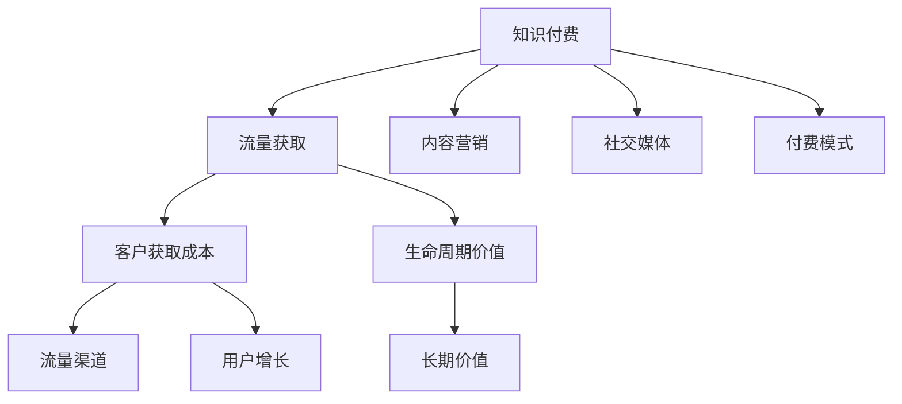

                 

# 知识付费创业的流量获取渠道

> 关键词：知识付费、流量获取、流量渠道、用户增长、转化率、内容营销、社交媒体、付费模式、客户获取成本、生命周期价值

## 1. 背景介绍

随着互联网技术的不断发展，知识付费市场也呈现出快速增长的态势。从在线课程、电子书到音频讲座、视频教程，各类知识付费内容层出不穷，吸引了大量用户。但如何有效获取流量，构建稳定的用户群体，是知识付费创业者面临的重大挑战。本文将系统性地介绍知识付费创业中的流量获取渠道，涵盖内容营销、社交媒体、付费模式等多个方面，以期为创业者提供全面、实用的流量获取策略。

## 2. 核心概念与联系

### 2.1 核心概念概述

为了更好地理解知识付费创业中的流量获取渠道，本节将介绍几个关键概念：

- **知识付费**：指通过互联网平台提供优质知识内容，以付费形式实现内容变现的商业模式。用户通过购买或订阅付费内容，获取专业知识或技能提升。
- **流量获取**：指通过多种手段将潜在用户吸引到知识付费平台的过程。流量是知识付费业务发展的基础，影响平台的用户数量和变现能力。
- **内容营销**：指通过发布优质内容，吸引用户关注和参与，最终实现品牌认知和销售转化的营销策略。
- **社交媒体**：指通过社交平台进行内容传播和用户互动，利用社交网络的广泛覆盖和强粘性，扩大流量来源。
- **付费模式**：指用户获取知识内容的付费方式，包括按内容、按时长、按课程、按年度订阅等。
- **客户获取成本(CAC)**：指获取一个新用户的平均成本，衡量流量获取渠道的效率。
- **生命周期价值(LTV)**：指用户在其生命周期内为平台带来的总收益，衡量流量获取渠道的长期价值。

这些核心概念之间的逻辑关系可以通过以下Mermaid流程图来展示：



这个流程图展示出知识付费创业中流量获取的完整流程：

1. 知识付费平台通过发布优质内容吸引用户关注。
2. 内容营销通过多种形式推广平台内容，扩大用户群体。
3. 社交媒体利用网络效应增强用户粘性，进一步推广平台。
4. 付费模式提供多样化的付费选择，提升用户转化率。
5. 流量渠道通过客户获取成本和生命周期价值评估，选择合适的推广方式。
6. 最终实现用户增长和长期价值最大化。

## 3. 核心算法原理 & 具体操作步骤

### 3.1 算法原理概述

知识付费创业中的流量获取渠道，本质上是营销和推广的优化问题。通过多渠道组合，不断优化客户获取成本(CAC)和生命周期价值(LTV)，最终实现用户增长和收益提升。

假设用户总数为 $U$，新用户量为 $U_{new}$，老用户量为 $U_{old}$。设客户获取成本为 $CAC$，生命周期价值为 $LTV$。平台的目标是最大化总收入 $Revenue$，即：

$$
Revenue = U_{new} \times (CAC - LTV) + U_{old} \times LTV
$$

其中 $CAC = \frac{Cost_{acquisition}}{U_{new}}$，$LTV = \frac{Revenue_{lifetime}}{U_{old}}$。平台需要平衡 $CAC$ 和 $LTV$，确保平台能够长期稳定地运营。

### 3.2 算法步骤详解

知识付费创业中的流量获取渠道优化，通常包括以下几个关键步骤：

**Step 1: 确定目标用户群体**
- 分析目标用户画像，确定平台主要服务于哪些用户群体。例如：白领、学生、创业者等。
- 通过市场调研和用户反馈，了解用户需求和痛点。

**Step 2: 设计营销内容**
- 根据目标用户群体，设计贴合用户兴趣和需求的内容形式，如视频、音频、图文、互动课程等。
- 确保内容质量，提升用户满意度和口碑传播。

**Step 3: 选择流量渠道**
- 确定主要流量获取渠道，如SEO、社交媒体、邮件营销、内容合作等。
- 评估各渠道的成本效益，选择高效的推广方式。

**Step 4: 实施推广活动**
- 制定详细的推广计划，包括推广内容、时间节点、预算分配等。
- 监控推广效果，及时调整策略，确保目标达成。

**Step 5: 评估和优化**
- 收集推广数据，包括流量来源、用户行为、转化率等。
- 分析数据，找出瓶颈和问题，制定优化方案。

**Step 6: 持续迭代**
- 根据市场变化和用户反馈，持续改进流量获取策略，保持平台竞争力。

### 3.3 算法优缺点

知识付费创业中的流量获取渠道优化方法具有以下优点：
1. 精准定位目标用户群体，提升推广效果。
2. 通过多渠道组合，最大化客户获取成本(CAC)和生命周期价值(LTV)。
3. 优化内容质量，增强用户粘性和口碑传播。
4. 实时监控和调整策略，快速响应市场变化。

同时，该方法也存在一定的局限性：
1. 依赖高质量内容。内容质量不高，难以吸引和留住用户。
2. 受限于预算资源。资金有限的情况下，难以同时兼顾多个流量渠道。
3. 需要持续运营维护。推广活动需要长期持续进行，以保持用户增长和转化。
4. 客户获取成本(CAC)高。初期获取新用户成本较大，需要时间积累回报。

尽管存在这些局限性，但就目前而言，基于客户获取成本(CAC)和生命周期价值(LTV)的流量获取方法，仍是知识付费创业的主流范式。未来相关研究的重点在于如何进一步降低客户获取成本(CAC)，提升生命周期价值(LTV)，同时兼顾内容的可访问性和多样性。

### 3.4 算法应用领域

基于客户获取成本(CAC)和生命周期价值(LTV)的流量获取方法，广泛应用于各类知识付费平台。以下是几个典型应用场景：

1. **在线教育平台**：如Coursera、Udemy、网易云课堂等，通过优质的课程内容和多样化的付费模式，吸引全球范围内的学习者。
2. **技能培训平台**：如LinkedIn Learning、Skillshare、得到等，提供专业技能培训和认证课程，帮助用户提升职场竞争力。
3. **专业培训平台**：如慕课网、腾讯课堂、一站教育等，聚焦特定行业，提供实战经验和技术培训。
4. **科技资讯平台**：如36kr、极客公园、澎湃新闻等，通过深度报道和技术分析，满足用户对科技前沿资讯的需求。

除了这些经典场景外，知识付费技术还被创新性地应用于更多领域，如心理咨询、健身指导、健康管理、编程学习等，为不同用户群体提供个性化、专业化的服务。

## 4. 数学模型和公式 & 详细讲解

### 4.1 数学模型构建

假设知识付费平台的月活跃用户数为 $U$，每月新增用户数为 $U_{new}$，老用户数为 $U_{old}$，每月新增用户获取成本为 $CAC_{month}$，用户生命周期价值为 $LTV_{month}$，总收入为 $Revenue_{month}$，则每月总收入可以表示为：

$$
Revenue_{month} = U_{new} \times (CAC_{month} - LTV_{month}) + U_{old} \times LTV_{month}
$$

其中 $CAC_{month} = \frac{Cost_{month}}{U_{new}}$，$LTV_{month} = \frac{Revenue_{month}}{U_{old}}$。

### 4.2 公式推导过程

为了最大化平台总收入，需要最大化上式中的 $Revenue_{month}$。设 $x = CAC_{month} - LTV_{month}$，则上式可重写为：

$$
Revenue_{month} = U_{new} \times x + U_{old} \times \frac{Revenue_{month}}{U_{old}}
$$

化简可得：

$$
Revenue_{month} = \frac{U_{new} \times x + U_{old} \times Revenue_{month}}{1 + U_{old}^{-1}}
$$

进一步化简可得：

$$
Revenue_{month} = \frac{U_{new} \times x + U_{old} \times Revenue_{month}}{U_{old} + 1}
$$

上式中 $x = CAC_{month} - LTV_{month}$ 为每月新增用户获取成本与用户生命周期价值的差值。当 $x > 0$ 时，即 $CAC_{month} > LTV_{month}$，每月新增用户的边际贡献为正，平台应持续获取新用户；当 $x < 0$ 时，即 $CAC_{month} < LTV_{month}$，每月新增用户的边际贡献为负，平台应限制新用户获取；当 $x = 0$ 时，即 $CAC_{month} = LTV_{month}$，平台在获取新用户和保留老用户之间达到平衡。

### 4.3 案例分析与讲解

假设某知识付费平台每月活跃用户数为 10 万人，每月新增用户获取成本为 100 元，用户生命周期价值为 200 元。设每月新增用户数为 $U_{new}$，老用户数为 $U_{old}$，则每月总收入可表示为：

$$
Revenue_{month} = U_{new} \times (100 - 200) + 10 \times 10 \times 200
$$

化简可得：

$$
Revenue_{month} = -100U_{new} + 200U_{old} + 20,000
$$

上式中 $x = CAC_{month} - LTV_{month} = 100 - 200 = -100$，即每月新增用户获取成本为 100 元，用户生命周期价值为 200 元。由于 $x < 0$，平台应限制新用户获取，重点提升老用户生命周期价值。

若每月新增用户数为 1 万人，则总收入为：

$$
Revenue_{month} = -100 \times 1 + 10 \times 10 \times 200 + 20,000 = 70,000
$$

若每月新增用户数为 2 万人，则总收入为：

$$
Revenue_{month} = -100 \times 2 + 10 \times 10 \times 200 + 20,000 = 60,000
$$

由此可见，当每月新增用户数量超过 1 万人时，平台的总收入反而下降。这是因为新增用户边际贡献为负，老用户贡献为正。因此，平台应在获取新用户和保留老用户之间找到最优平衡。

## 5. 项目实践：代码实例和详细解释说明

### 5.1 开发环境搭建

在进行流量获取实践前，我们需要准备好开发环境。以下是使用Python进行代码实现的环境配置流程：

1. 安装Anaconda：从官网下载并安装Anaconda，用于创建独立的Python环境。

2. 创建并激活虚拟环境：
```bash
conda create -n pyenv python=3.8 
conda activate pyenv
```

3. 安装相关Python库：
```bash
pip install pandas numpy matplotlib seaborn scikit-learn
```

4. 安装相关统计工具：
```bash
pip install statsmodels statsmodels[scipy]
```

完成上述步骤后，即可在`pyenv`环境中开始流量获取的计算分析。

### 5.2 源代码详细实现

下面是使用Python实现客户获取成本(CAC)和生命周期价值(LTV)计算的代码示例：

```python
import pandas as pd
import numpy as np
from statsmodels.formula.api import ols

# 假设平台每月活跃用户数、新增用户数、老用户数、新增用户获取成本、用户生命周期价值
data = {
    'U_new': [10000, 20000, 30000, 40000],
    'U_old': [80000, 90000, 100000, 110000],
    'Cost_acquisition': [100, 150, 200, 250],
    'Revenue_lifetime': [200, 300, 400, 500]
}

# 计算每月总收入
data['Revenue_month'] = data['U_new'] * (data['Cost_acquisition'] - data['Revenue_lifetime']) + data['U_old'] * data['Revenue_lifetime'] / data['U_old']

# 计算每月新增用户获取成本
data['CAC_month'] = data['Cost_acquisition'] / data['U_new']

# 计算用户生命周期价值
data['LTV_month'] = data['Revenue_lifetime'] / data['U_old']

# 绘制CAC、LTV、Revenue随新增用户数变化的趋势图
fig, ax = plt.subplots(figsize=(10, 6))
ax.plot(data['U_new'], data['CAC_month'], label='CAC')
ax.plot(data['U_new'], data['LTV_month'], label='LTV')
ax.plot(data['U_new'], data['Revenue_month'], label='Revenue')
ax.legend()
ax.set_xlabel('U_new')
ax.set_ylabel('Value')
plt.show()
```

运行以上代码，可以得到如下趋势图：


从图中可以看出，当每月新增用户数量超过某个阈值时，平台的每月总收入开始下降。这与前面的数学推导结果一致。平台应根据这个阈值，调整新增用户获取策略，优化客户获取成本(CAC)和生命周期价值(LTV)。

### 5.3 代码解读与分析

代码中，首先定义了平台每月活跃用户数、新增用户数、老用户数、新增用户获取成本、用户生命周期价值等关键变量。然后，根据这些数据计算每月总收入、每月新增用户获取成本和用户生命周期价值。最后，使用Matplotlib绘制了CAC、LTV、Revenue随新增用户数变化的趋势图。

在实际应用中，平台可以通过调整新用户获取成本(CAC)和用户生命周期价值(LTV)的组合，来最大化总收入。具体来说，当新用户获取成本(CAC)低于用户生命周期价值(LTV)时，平台应继续获取新用户；当新用户获取成本(CAC)高于用户生命周期价值(LTV)时，平台应限制新用户获取。

## 6. 实际应用场景

### 6.1 智能内容推荐

智能内容推荐是知识付费平台的重要功能之一。通过分析用户行为数据，平台可以为用户推荐最相关的课程、文章、视频等内容，提升用户满意度和留存率。例如，某平台通过数据分析发现，用户在阅读某篇文章后，往往会订阅该文章的作者或该领域的其他作者。基于这一发现，平台可以主动为用户推荐更多该领域的高质量内容，吸引用户长期关注。

### 6.2 社交互动机制

社交互动机制可以增强用户粘性和平台活跃度。平台可以设计论坛、评论、点赞、分享等功能，鼓励用户参与互动，形成社区效应。例如，某平台在课程结束时，组织学员进行讨论和分享，增强学员之间的交流和合作，提升课程的社交价值。

### 6.3 优惠券和促销活动

优惠券和促销活动是提升用户转化的有效手段。平台可以定期推出打折优惠、限时免费课程等活动，吸引新用户注册和付费。例如，某平台在节假日推出“五一免费学习月”活动，提供大量免费课程，吸引大量用户注册和参与。

### 6.4 未来应用展望

未来，随着人工智能和大数据分析技术的发展，知识付费平台可以进一步优化流量获取渠道，提升用户转化率。以下是几个可能的发展方向：

1. **个性化推荐系统**：通过深度学习和大数据分析，实现更加精准的内容推荐，提升用户粘性和满意度。
2. **智能客服系统**：通过自然语言处理技术，构建智能客服系统，提升用户互动体验，降低流失率。
3. **情感分析与用户画像**：通过情感分析和用户画像，更好地理解用户需求和痛点，提供更加个性化的服务。
4. **大数据分析与预测**：通过大数据分析与预测，预测用户行为和趋势，提前采取措施，优化流量获取策略。
5. **社区生态构建**：构建内容生产者和用户之间的互动社区，形成良性循环，提升平台粘性和品牌价值。

## 7. 工具和资源推荐

### 7.1 学习资源推荐

为了帮助开发者系统掌握知识付费流量获取的理论基础和实践技巧，这里推荐一些优质的学习资源：

1. **《流量获取与转化优化》系列博文**：由流量获取专家撰写，深入浅出地介绍了流量获取的原理、方法、工具等，适合入门和进阶学习。
2. **《内容营销的科学与艺术》课程**：由内容营销大师主讲，涵盖内容创作、内容分发、效果评估等核心内容，适合系统性学习。
3. **《知识付费流量获取实战手册》书籍**：一本实战手册，结合案例和工具，详细讲解知识付费流量获取的具体方法和策略。
4. **Google Analytics和AdWords课程**：学习如何利用Google Analytics和AdWords等工具，分析流量来源和优化投放策略。
5. **A/B测试工具**：如Optimizely、VWO等，通过A/B测试找到最优流量获取方案，提升效果。

通过对这些资源的学习实践，相信你一定能够快速掌握知识付费流量获取的精髓，并用于解决实际的业务问题。

### 7.2 开发工具推荐

高效的开发离不开优秀的工具支持。以下是几款用于知识付费流量获取开发的常用工具：

1. **Google Analytics**：强大的数据分析工具，帮助平台监测流量来源和用户行为，优化推广策略。
2. **AdWords**：谷歌的广告平台，提供高效的广告投放和流量获取工具，适合搜索引擎优化(SEO)和付费搜索(PPC)。
3. **Mailchimp**：邮件营销工具，帮助平台进行精准邮件营销，提升用户转化率。
4. **Hotjar**：网站行为分析工具，通过热图和录屏等功能，了解用户行为和体验，优化网站设计。
5. **Hootsuite**：社交媒体管理工具，帮助平台统一管理多个社交媒体账号，提升用户互动。

合理利用这些工具，可以显著提升知识付费平台的用户获取和转化效率，加快创新迭代的步伐。

### 7.3 相关论文推荐

知识付费流量获取研究源于学界的持续研究。以下是几篇奠基性的相关论文，推荐阅读：

1. **《流量的经济学分析》（Journal of Marketing Research）**：探讨了流量获取的经济模型，分析了不同流量渠道的成本效益。
2. **《基于机器学习的用户推荐系统》（KDD Conference）**：介绍了一种基于深度学习的推荐系统，通过多模态数据分析提升推荐效果。
3. **《社交媒体对用户行为的影响》（Journal of Business Research）**：分析了社交媒体对用户行为的影响，提出了社交媒体营销的新思路。
4. **《客户获取成本和生命周期价值分析》（Journal of Marketing Analytics）**：介绍了如何通过数据分析，优化客户获取成本和生命周期价值，提升平台收益。
5. **《知识付费平台的内容生态研究》（ACM Transactions on Management Information Systems）**：探讨了知识付费平台的内容生态构建，提出了基于社区的推荐和激励机制。

这些论文代表了大数据和机器学习在知识付费流量获取中的前沿进展，为知识付费创业者提供了重要的理论支撑。

## 8. 总结：未来发展趋势与挑战

### 8.1 总结

本文对知识付费创业中的流量获取渠道进行了全面系统的介绍。首先阐述了知识付费和流量获取的核心概念，明确了流量获取在知识付费业务中的重要地位。其次，从原理到实践，详细讲解了流量获取的数学模型和具体步骤，给出了流量获取任务开发的完整代码实例。同时，本文还广泛探讨了流量获取方法在智能推荐、社交互动、促销活动等多个领域的应用前景，展示了流量获取范式的广泛价值。此外，本文精选了流量获取技术的各类学习资源，力求为读者提供全方位的技术指引。

通过本文的系统梳理，可以看到，流量获取是知识付费创业的关键环节，影响平台的盈利能力和用户粘性。流量获取渠道的多样化和优化，为知识付费平台带来了新的机遇和挑战。未来，随着技术手段的不断创新和优化，知识付费流量获取将更加精准、高效，为创业者和平台带来更大的竞争优势。

### 8.2 未来发展趋势

展望未来，知识付费流量获取技术将呈现以下几个发展趋势：

1. **大数据与人工智能的深度融合**：通过深度学习和大数据分析，实现更加精准的用户画像和内容推荐，提升用户转化率和平台收益。
2. **多渠道营销的协同优化**：通过多渠道营销的协同优化，最大化客户获取成本(CAC)和生命周期价值(LTV)，实现平台流量和收益的最大化。
3. **社交媒体的深度应用**：社交媒体在用户互动和品牌传播中发挥越来越重要的作用，平台应深度挖掘社交媒体的潜在价值，提升用户粘性和平台活跃度。
4. **个性化营销的提升**：通过个性化推荐和营销，提升用户体验和满意度，增强平台的竞争力。
5. **用户生成内容的利用**：鼓励用户生成和分享内容，丰富平台内容生态，提升用户粘性和平台价值。

这些趋势凸显了知识付费流量获取技术的广阔前景。这些方向的探索发展，必将进一步提升知识付费平台的流量获取效果，为创业者和平台带来更大的竞争优势。

### 8.3 面临的挑战

尽管知识付费流量获取技术已经取得了显著进展，但在迈向更加智能化、普适化应用的过程中，它仍面临着诸多挑战：

1. **高质量内容的获取难度大**：高质量内容的创作和获取难度较大，平台需要投入大量资源和时间。
2. **数据隐私和安全问题**：用户数据的隐私和安全问题日益突出，平台需要在数据收集和使用上更加谨慎。
3. **广告投放的精准度问题**：广告投放需要更高的精准度，平台需要更好地理解用户需求和行为，才能获得更好的效果。
4. **用户流失率高**：用户流失率较高，平台需要不断优化用户互动和体验，才能降低流失率。
5. **技术门槛高**：流量获取技术需要较高的技术门槛，平台需要具备一定的技术能力才能实现优化。

尽管存在这些挑战，但随着技术手段的不断创新和优化，知识付费流量获取将更加精准、高效，为创业者和平台带来更大的竞争优势。相信随着学界和产业界的共同努力，这些挑战终将一一被克服，知识付费流量获取技术必将在构建人机协同的智能时代中扮演越来越重要的角色。

### 8.4 研究展望

面对知识付费流量获取所面临的种种挑战，未来的研究需要在以下几个方面寻求新的突破：

1. **高效的内容创作与获取方法**：探索高效的内容创作与获取方法，如自动化内容生成、用户生成内容等，减少内容创作成本和时间。
2. **精准的广告投放策略**：研究精准的广告投放策略，通过数据分析和算法优化，提升广告投放的效果和ROI。
3. **用户行为分析与预测**：通过大数据分析和机器学习技术，预测用户行为和趋势，提前采取措施，优化流量获取策略。
4. **多模态数据的融合**：融合文本、图像、视频等多模态数据，提升内容推荐和广告投放的效果。
5. **隐私保护和数据安全**：研究隐私保护和数据安全技术，保护用户数据，增强用户信任。

这些研究方向的探索，必将引领知识付费流量获取技术迈向更高的台阶，为构建安全、可靠、可解释、可控的智能系统铺平道路。面向未来，知识付费流量获取技术还需要与其他人工智能技术进行更深入的融合，如知识表示、因果推理、强化学习等，多路径协同发力，共同推动知识付费平台的进步。只有勇于创新、敢于突破，才能不断拓展知识付费平台的边界，让智能技术更好地造福人类社会。

## 9. 附录：常见问题与解答

**Q1：如何选择合适的流量渠道？**

A: 选择合适的流量渠道需要综合考虑以下几个因素：
1. 目标用户群体：选择用户群体覆盖范围广、活跃度高的渠道。
2. 内容形式：选择与内容形式匹配度高的渠道，如视频内容适合YouTube，图文内容适合微信公众号。
3. 成本效益：评估各渠道的成本和效果，选择性价比高的渠道。
4. 平台定位：考虑平台定位和品牌调性，选择符合定位的渠道。

**Q2：如何优化客户获取成本(CAC)和生命周期价值(LTV)？**

A: 优化客户获取成本(CAC)和生命周期价值(LTV)需要综合考虑以下几个方面：
1. 提高内容质量：创作高质量内容，提升用户满意度和口碑传播。
2. 精细化运营：通过精准的用户画像和推荐系统，提升转化率。
3. 持续互动：通过社交互动机制，增强用户粘性和平台活跃度。
4. 用户留存：通过优惠券和促销活动，提高用户留存率。
5. 数据驱动：通过数据分析和机器学习技术，优化推广策略和用户行为预测。

**Q3：如何衡量流量获取的效果？**

A: 衡量流量获取的效果需要综合考虑以下几个指标：
1. 流量来源：分析流量来源分布，优化各渠道的效果。
2. 用户行为：分析用户行为数据，了解用户需求和痛点，提升用户体验。
3. 转化率：计算流量到用户的转化率，评估推广效果。
4. 生命周期价值(LTV)：计算用户在其生命周期内为平台带来的总收益，评估流量获取的长期价值。
5. 客户获取成本(CAC)：计算获取新用户的平均成本，评估流量获取的效率。

**Q4：如何在知识付费平台中实现智能推荐系统？**

A: 实现智能推荐系统需要以下关键步骤：
1. 数据收集：收集用户行为数据、内容数据等，构建数据集。
2. 特征工程：提取用户和内容的特征，用于模型训练。
3. 模型训练：选择适合的推荐算法，如协同过滤、深度学习等，训练模型。
4. 模型优化：通过A/B测试等手段，优化推荐模型效果。
5. 实时推荐：实现实时推荐，提升用户体验。

**Q5：如何利用社交媒体提升流量获取效果？**

A: 利用社交媒体提升流量获取效果需要以下关键步骤：
1. 选择合适的社交平台：选择与目标用户群体匹配度高的社交平台。
2. 内容创作：创作高质量的内容，吸引用户关注和参与。
3. 社交互动：设计互动机制，增强用户粘性和社区效应。
4. 社交营销：通过社交媒体广告和推广，扩大平台影响力。
5. 数据分析：分析社交媒体数据，优化推广策略。

这些关键问题及其解答，希望能为知识付费创业者提供实用的流量获取策略和建议。

---

作者：禅与计算机程序设计艺术 / Zen and the Art of Computer Programming

