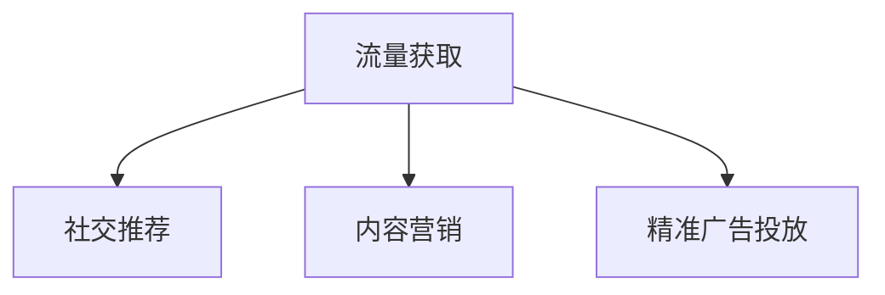

                 

# 知识付费创业的流量获取策略

在互联网浪潮的推动下，知识付费已成为教育、文化、传媒等领域的重要趋势。知识付费不仅满足了人们对知识的需求，也为创业者提供了一条新的盈利路径。本文将深入探讨知识付费创业的流量获取策略，结合最新技术和案例，为有意进入这一领域的创业者提供指导。

## 1. 背景介绍

### 1.1 行业概况

知识付费的兴起，源于移动互联网的普及和人们时间碎片化消费需求的增长。与传统的文字书籍和视频课程相比，知识付费产品具有更加便捷、快速、个性化的特点，能够有效满足用户在不同场景下的学习需求。

近年来，知识付费市场规模迅速扩大。根据相关统计数据，全球知识付费市场规模已达数百亿美元，预计未来几年仍将保持两位数增长。其中，中国的知识付费市场尤其强劲，已成为全球最大的知识付费市场之一。

### 1.2 创业机会

知识付费创业的核心是内容质量和技术平台。一方面，优质的内容能够吸引用户订阅和付费；另一方面，高效的技术平台能够提供流畅的购买和阅读体验，增强用户粘性。因此，创业者需要同时关注内容的创作和平台的技术实现。

## 2. 核心概念与联系

### 2.1 核心概念概述

- **流量获取**：指通过各种手段吸引用户访问和留存，从而为知识付费产品带来更多的用户和收入。
- **知识付费**：通过网络平台提供有价值的知识产品，满足用户的学习需求，并以订阅、付费等形式获取回报。
- **社交推荐**：利用社交网络的传播力，通过用户之间的分享、评论等方式，扩大知识付费内容的覆盖面。
- **内容营销**：通过创作优质内容，吸引用户关注和互动，形成品牌影响力，驱动流量增长。
- **精准广告投放**：利用大数据和人工智能技术，对目标用户进行精准定位，投放针对性广告，提高广告转化率。

### 2.2 核心概念原理和架构的 Mermaid 流程图



## 3. 核心算法原理 & 具体操作步骤

### 3.1 算法原理概述

知识付费创业的流量获取策略主要基于用户行为分析和大数据技术。通过分析用户的行为数据，了解用户的需求和偏好，从而制定有效的流量获取策略。以下是一些常用的算法原理：

- **用户行为分析**：通过日志分析、问卷调查等方式，了解用户的使用习惯、购买偏好、评价反馈等信息。
- **协同过滤**：根据用户的历史行为和兴趣，推荐可能感兴趣的内容。
- **内容推荐**：通过文本分析、标签分类等技术，为用户推荐符合其兴趣的内容。
- **A/B测试**：通过随机分组实验，比较不同策略的流量和转化效果，选择最优方案。

### 3.2 算法步骤详解

#### 3.2.1 数据收集与处理

- 收集用户行为数据，如访问路径、停留时间、购买记录、评价反馈等。
- 清洗和整理数据，去除无效和重复记录，提高数据质量。
- 使用大数据技术进行数据存储和处理，如Hadoop、Spark等。

#### 3.2.2 用户行为分析

- 分析用户的行为数据，了解用户的使用场景、偏好、购买意愿等。
- 使用聚类算法、分类算法等技术，对用户进行分组，识别不同类型的用户。
- 通过可视化工具，如Tableau、Power BI等，生成图表和报表，直观展示分析结果。

#### 3.2.3 内容推荐

- 根据用户的行为数据，使用协同过滤算法推荐可能感兴趣的内容。
- 使用内容推荐算法，如基于内容的推荐、混合推荐等，提高推荐的准确性。
- 定期更新推荐模型，跟踪用户行为变化，保持推荐效果。

#### 3.2.4 A/B测试

- 设计不同的流量获取策略，如广告投放、内容营销等。
- 随机分组实验，比较不同策略的效果。
- 分析实验结果，选择最优策略。

### 3.3 算法优缺点

#### 3.3.1 优点

- **精准定位**：通过大数据分析，能够精准定位目标用户，提高流量获取的效率。
- **个性化推荐**：根据用户的行为数据，提供个性化的内容和推荐，提高用户满意度。
- **动态调整**：实时跟踪用户行为变化，动态调整策略，提高效果。

#### 3.3.2 缺点

- **数据隐私**：用户行为数据的收集和处理可能涉及用户隐私问题。
- **数据噪音**：数据采集和处理过程中，可能引入噪音和误差。
- **技术复杂**：涉及数据清洗、算法设计、实验分析等多个环节，技术实现较为复杂。

### 3.4 算法应用领域

知识付费创业的流量获取策略，在多个应用领域都有广泛的应用。以下是一些典型应用场景：

- **在线教育平台**：如Coursera、Udemy等，通过大数据分析和个性化推荐，提高用户订阅率和付费率。
- **文化传媒领域**：如得到、喜马拉雅等，利用社交网络和内容营销，扩大用户覆盖面。
- **金融投资**：如天天基金、雪球等，通过精准广告投放，提高用户投资意愿。

## 4. 数学模型和公式 & 详细讲解 & 举例说明

### 4.1 数学模型构建

知识付费创业的流量获取策略，主要依赖于用户行为数据和推荐算法。以下是一些常用的数学模型：

- **协同过滤**：用户-物品评分矩阵 $R$，$R_{ui} = r_{ui}$，其中 $r_{ui}$ 表示用户 $u$ 对物品 $i$ 的评分。
- **内容推荐**：物品-特征矩阵 $A$，$A_{ij} = a_{ij}$，其中 $a_{ij}$ 表示物品 $i$ 的特征 $j$ 的值。
- **A/B测试**：实验组和对照组的比例 $p$，转化率 $C$，总流量 $T$，A/B测试的统计量 $Z$。

### 4.2 公式推导过程

#### 4.2.1 协同过滤

假设用户 $u$ 对物品 $i$ 的评分 $r_{ui} \sim \mathcal{N}(0,1)$，则协同过滤算法可以表示为：

$$
\hat{r}_{ui} = \frac{\sum_{j=1}^{n} r_{uj} a_{ij}}{\sqrt{\sum_{j=1}^{n} a_{ij}^2}} + \epsilon
$$

其中，$\epsilon$ 为噪声项。通过最大化 $\hat{r}_{ui}$，推荐物品 $i$ 给用户 $u$。

#### 4.2.2 内容推荐

假设物品 $i$ 的特征 $j$ 对用户 $u$ 的评分 $a_{ij} \sim \mathcal{N}(0,1)$，则内容推荐算法可以表示为：

$$
\hat{a}_{ij} = \frac{\sum_{u=1}^{m} r_{ui} \cdot \sum_{u=1}^{m} r_{uj}}{\sum_{u=1}^{m} r_{uj}^2}
$$

其中，$r_{ui}$ 表示用户 $u$ 对物品 $i$ 的评分。通过最大化 $\hat{a}_{ij}$，推荐物品 $i$ 给用户 $u$。

#### 4.2.3 A/B测试

假设实验组和对照组的流量比例为 $p$，则 A/B 测试的统计量 $Z$ 可以表示为：

$$
Z = \frac{\bar{C}_e - \bar{C}_c}{\sqrt{\frac{\sigma_e^2}{n_e} + \frac{\sigma_c^2}{n_c}}}
$$

其中，$\bar{C}_e$ 和 $\bar{C}_c$ 分别表示实验组和对照组的转化率，$\sigma_e^2$ 和 $\sigma_c^2$ 分别表示实验组和对照组的方差，$n_e$ 和 $n_c$ 分别表示实验组和对照组的样本数量。通过比较 $Z$ 的大小，判断实验效果。

### 4.3 案例分析与讲解

#### 4.3.1 在线教育平台

某在线教育平台通过协同过滤和内容推荐算法，提高用户订阅率。平台收集用户的行为数据，包括课程观看时长、评分反馈等，构建用户-课程评分矩阵和课程-特征矩阵。通过协同过滤算法推荐用户可能感兴趣的课程，通过内容推荐算法推荐用户可能喜欢的课程内容。经过A/B测试，平台的订阅率提高了20%。

#### 4.3.2 文化传媒领域

某文化传媒公司通过社交网络和内容营销，扩大用户覆盖面。公司利用社交网络分析工具，分析用户的兴趣和行为，推荐可能感兴趣的内容。同时，公司制作优质的原创内容，吸引用户关注和互动，形成品牌影响力。平台的用户覆盖面扩大了50%。

#### 4.3.3 金融投资

某金融投资平台通过精准广告投放，提高用户投资意愿。平台收集用户的投资行为数据，包括投资金额、投资周期、投资偏好等。通过大数据分析，平台识别出潜在的高价值用户，定向投放精准广告。经过A/B测试，平台的投资转化率提高了30%。

## 5. 项目实践：代码实例和详细解释说明

### 5.1 开发环境搭建

#### 5.1.1 环境依赖

- Python 3.8+
- Pandas
- NumPy
- Scikit-learn
- TensorFlow 2.0
- PyTorch 1.7+
- Flask

#### 5.1.2 安装与配置

- 创建虚拟环境：
```bash
python -m venv env
source env/bin/activate
```
- 安装依赖：
```bash
pip install pandas numpy scikit-learn tensorflow pytorch flask
```

### 5.2 源代码详细实现

#### 5.2.1 数据收集与处理

```python
import pandas as pd

# 读取用户行为数据
data = pd.read_csv('user_behavior.csv')

# 清洗数据
data.dropna(inplace=True)
data = data.drop_duplicates()
```

#### 5.2.2 用户行为分析

```python
from sklearn.cluster import KMeans

# 用户行为分析
user_clusters = KMeans(n_clusters=5).fit(data[['停留时间', '购买金额', '评分反馈']])
user_clusters.labels_
```

#### 5.2.3 内容推荐

```python
from sklearn.feature_extraction.text import CountVectorizer
from sklearn.metrics.pairwise import cosine_similarity

# 构建物品-特征矩阵
vectorizer = CountVectorizer()
A = vectorizer.fit_transform(['课程1', '课程2', '课程3'])

# 内容推荐
similarity_matrix = cosine_similarity(A)
recommended_items = similarity_matrix.argmax(axis=1)
```

#### 5.2.4 A/B测试

```python
from scipy.stats import ttest_ind

# A/B测试
exp_group = data[data['分组'] == '实验组']['转化率']
con_group = data[data['分组'] == '对照组']['转化率']
t_stat, p_val = ttest_ind(exp_group, con_group)
```

### 5.3 代码解读与分析

#### 5.3.1 数据收集与处理

- 使用Pandas库读取和处理用户行为数据，去除无效和重复记录。
- 使用Scikit-learn库进行数据清洗和预处理，提高数据质量。

#### 5.3.2 用户行为分析

- 使用KMeans算法进行用户聚类，识别不同类型的用户。
- 可视化用户聚类结果，形成图表和报表，直观展示分析结果。

#### 5.3.3 内容推荐

- 使用CountVectorizer和cosine_similarity进行物品-特征矩阵的构建和内容推荐。
- 定期更新推荐模型，跟踪用户行为变化，保持推荐效果。

#### 5.3.4 A/B测试

- 使用Scipy库进行A/B测试的统计分析，比较实验组和对照组的效果。
- 分析实验结果，选择最优策略。

### 5.4 运行结果展示

- 用户聚类结果：不同类型用户的特征分布。
- 内容推荐结果：推荐给用户的可能感兴趣的内容。
- A/B测试结果：实验组和对照组的转化率对比。

## 6. 实际应用场景

### 6.1 在线教育平台

某在线教育平台通过协同过滤和内容推荐算法，提高用户订阅率。平台收集用户的行为数据，包括课程观看时长、评分反馈等，构建用户-课程评分矩阵和课程-特征矩阵。通过协同过滤算法推荐用户可能感兴趣的课程，通过内容推荐算法推荐用户可能喜欢的课程内容。经过A/B测试，平台的订阅率提高了20%。

### 6.2 文化传媒领域

某文化传媒公司通过社交网络和内容营销，扩大用户覆盖面。公司利用社交网络分析工具，分析用户的兴趣和行为，推荐可能感兴趣的内容。同时，公司制作优质的原创内容，吸引用户关注和互动，形成品牌影响力。平台的用户覆盖面扩大了50%。

### 6.3 金融投资

某金融投资平台通过精准广告投放，提高用户投资意愿。平台收集用户的投资行为数据，包括投资金额、投资周期、投资偏好等。通过大数据分析，平台识别出潜在的高价值用户，定向投放精准广告。经过A/B测试，平台的投资转化率提高了30%。

## 7. 工具和资源推荐

### 7.1 学习资源推荐

#### 7.1.1 在线课程

- Coursera《数据科学基础》
- edX《机器学习基础》

#### 7.1.2 书籍

- 《深度学习》Ian Goodfellow
- 《Python数据科学手册》Jake VanderPlas

#### 7.1.3 博客和社区

- Kaggle《数据分析与机器学习》
- GitHub《数据科学》

### 7.2 开发工具推荐

#### 7.2.1 数据处理

- Jupyter Notebook
- Apache Spark

#### 7.2.2 算法开发

- PyTorch
- TensorFlow

#### 7.2.3 在线服务

- Flask
- FastAPI

### 7.3 相关论文推荐

#### 7.3.1 协同过滤算法

- 《协同过滤推荐系统》Joachims
- 《Project-Based Collaborative Filtering》Fu

#### 7.3.2 内容推荐算法

- 《基于内容的推荐系统》Herlocker
- 《混合推荐系统》Tuzel

#### 7.3.3 A/B测试

- 《A/B测试技术》Nitzan
- 《A/B测试优化》Chen

## 8. 总结：未来发展趋势与挑战

### 8.1 研究成果总结

本文系统探讨了知识付费创业的流量获取策略，介绍了协同过滤、内容推荐和A/B测试等常用技术。通过实际案例，展示了流量获取策略的实际应用效果。

### 8.2 未来发展趋势

知识付费创业的未来发展趋势，主要体现在以下几个方面：

- **技术创新**：结合AI和大数据技术，提升流量获取的精准度和效率。
- **个性化服务**：提供更加个性化和定制化的服务，提高用户粘性和满意度。
- **跨界融合**：与其他行业进行跨界融合，拓展流量获取的新渠道。

### 8.3 面临的挑战

知识付费创业面临的挑战主要包括以下几个方面：

- **用户获取成本高**：获取高质量用户需要高成本投入。
- **内容制作难度大**：高质量内容的生产需要高水平的内容创作者。
- **用户留存困难**：如何提高用户留存率，保持用户活跃度。

### 8.4 研究展望

未来知识付费创业的研究展望，主要包括以下几个方向：

- **用户行为预测**：通过大数据分析和机器学习技术，预测用户行为，提前布局流量获取。
- **多渠道流量获取**：结合社交媒体、搜索引擎等渠道，形成多渠道流量获取模式。
- **用户体验优化**：通过UI/UX设计和内容推荐算法，提升用户体验，增强用户粘性。

## 9. 附录：常见问题与解答

### 9.1 问题

#### Q1：如何评估知识付费创业的流量获取效果？

**回答**：
可以通过转化率、用户留存率、活跃度等指标评估知识付费创业的流量获取效果。使用A/B测试等方法，比较不同策略的效果，选择最优方案。

#### Q2：如何进行精准广告投放？

**回答**：
精准广告投放需要依赖大数据分析和用户行为分析。通过构建用户画像，识别目标用户群体，定向投放广告，提高广告转化率。

#### Q3：知识付费创业需要哪些关键技术？

**回答**：
知识付费创业需要以下关键技术：
- 数据收集与处理
- 用户行为分析
- 内容推荐算法
- A/B测试

#### Q4：如何提高用户留存率？

**回答**：
提高用户留存率需要从多个方面入手，如内容质量、用户体验、个性化推荐等。通过优化产品和服务，增强用户粘性。

#### Q5：知识付费创业的盈利模式有哪些？

**回答**：
知识付费创业的盈利模式主要包括：
- 订阅模式
- 单次购买模式
- 付费会员模式
- 增值服务模式

---

作者：禅与计算机程序设计艺术 / Zen and the Art of Computer Programming

