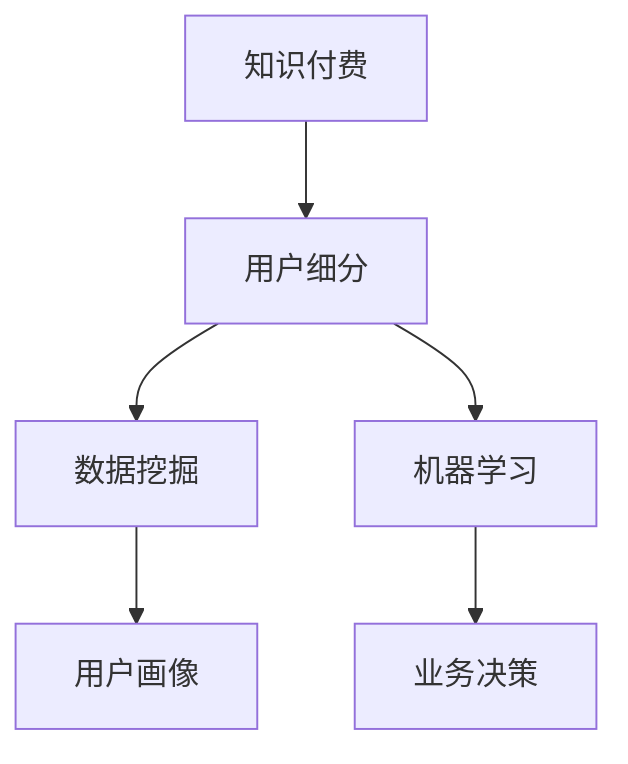

                 

# 知识付费创业的用户细分方法论

> 关键词：知识付费, 用户细分, 数据挖掘, 机器学习, 用户画像, 业务决策, 行为分析

## 1. 背景介绍

随着互联网的迅猛发展，在线教育、信息咨询、技能培训等领域逐渐兴起，知识付费市场也随之繁荣。据中国互联网络信息中心(CNNIC)统计，截至2020年底，我国知识付费用户规模已达4.34亿人，市场规模达364亿元人民币。在这样的背景下，知识付费创业项目纷纷涌现，如得到、喜马拉雅、新东方在线等，数不胜数。然而，如何从众多平台中脱颖而出，成为企业关注的焦点。

在本章中，我们将从用户细分的角度，探讨知识付费创业的科学方法论，帮助企业精准定位用户需求，制定有效的市场策略，从而实现商业目标。

## 2. 核心概念与联系

### 2.1 核心概念概述

在本节中，我们将介绍几个与知识付费创业和用户细分密切相关的核心概念，包括知识付费、用户细分、数据挖掘、机器学习、用户画像和业务决策。

- 知识付费（Knowledge Pay）：用户为获取有价值、有深度的知识内容而支付费用，提供服务的主体包括专业讲师、学者、行业专家等。
- 用户细分（User Segmentation）：通过对用户群体进行分类，识别不同类型用户的特点和需求，从而制定更精准的营销和运营策略。
- 数据挖掘（Data Mining）：通过科学方法从海量数据中发现潜在有价值的信息和知识，如用户行为模式、偏好趋势等。
- 机器学习（Machine Learning）：让机器学习用户数据，自动发现数据中的模式和规律，从而优化业务决策。
- 用户画像（User Persona）：通过多维度数据描述用户特征，帮助企业理解目标用户，从而更有效地开展营销和服务。
- 业务决策（Business Decision）：利用数据分析和机器学习，结合行业知识，制定和优化知识付费平台的运营策略。

这些概念间的联系可以通过以下Mermaid流程图表示：



这个流程图展示了一条从知识付费出发，通过用户细分、数据挖掘、机器学习和用户画像，最终回到业务决策的全流程，帮助企业提升商业效果。

## 3. 核心算法原理 & 具体操作步骤
### 3.1 算法原理概述

用户细分算法主要基于数据分析和机器学习技术，其核心思想是将用户群体按照一定的标准进行分类，从而识别不同类型用户的特点和需求，帮助企业精准定位用户。

用户细分的算法模型通常包含以下步骤：

1. 数据采集：收集用户基本信息（如年龄、性别、职业等）、行为数据（如访问次数、购买记录等）和反馈数据（如评分、评论等）。
2. 特征工程：对原始数据进行特征提取和转换，生成用于分类的特征向量。
3. 模型训练：选择适合的机器学习模型（如K-Means、决策树、随机森林等）进行训练，生成用户分类的模型。
4. 结果评估：使用交叉验证、ROC曲线等方法评估模型性能，选择最优模型。
5. 应用优化：根据模型结果，优化业务决策，如精准营销、个性化推荐、内容改进等。

### 3.2 算法步骤详解

下面，我们将详细介绍用户细分算法的详细步骤：

**步骤1：数据采集**

用户细分的前提是收集足够的数据，这里主要关注两个方面：用户基本信息和行为数据。

- **用户基本信息**：包括年龄、性别、教育背景、职业等。
- **行为数据**：包括访问次数、浏览时长、购买记录、评分、评论等。

这些数据通常从知识付费平台的后台系统、第三方数据提供商（如Alexa、Google Analytics等）和用户问卷调查中获得。

**步骤2：特征工程**

特征工程是将原始数据转换为可用于机器学习模型的特征向量的过程。通过特征工程，可以从大量原始数据中提取出对用户分类的关键信息，从而提高模型的准确性和泛化能力。

特征工程通常包括以下步骤：

- **特征提取**：从原始数据中提取有意义的特征，如通过文本分析提取情感特征、通过时间序列分析提取用户行为规律等。
- **特征转换**：对原始特征进行标准化、归一化、离散化等处理，提高模型训练效果。
- **特征选择**：选择对分类任务贡献最大的特征，去除冗余和无关特征。

**步骤3：模型训练**

模型训练阶段需要选择适合的机器学习算法，并使用历史数据进行训练。常见的用户分类算法包括K-Means、决策树、随机森林等。

- **K-Means算法**：适用于簇数已知的情况，将用户按照相似性分为若干个簇，每个簇内用户特征相似度较高。
- **决策树算法**：通过构建决策树模型，根据特征值的不同进行分类。
- **随机森林算法**：使用多个决策树进行集成，提高模型的准确性和鲁棒性。

**步骤4：结果评估**

模型训练完成后，需要对结果进行评估，选择最优模型。常用的评估方法包括交叉验证、ROC曲线等。

- **交叉验证**：使用数据集的分割方式进行模型评估，如K-Fold Cross Validation。
- **ROC曲线**：通过绘制ROC曲线，评估分类器的性能，选择最优阈值。

**步骤5：应用优化**

模型评估后，需要将结果应用到实际业务中，优化业务决策。

- **精准营销**：根据用户分类结果，制定精准的营销策略，如定制化邮件、个性化广告等。
- **个性化推荐**：使用用户画像，实现个性化内容推荐，提升用户体验。
- **内容改进**：根据用户反馈和分类结果，优化内容生产和调整，满足用户需求。

### 3.3 算法优缺点

用户细分算法具有以下优点：

- **提高营销精准度**：通过用户分类，可以实现精准营销，提高广告投放效果和转化率。
- **提升用户体验**：通过个性化推荐，满足用户需求，提升用户体验和满意度。
- **优化内容生产**：根据用户分类结果，优化内容生产和调整，提升内容质量和用户粘性。

但同时也存在一些缺点：

- **数据隐私问题**：用户数据的采集和使用需要遵守相关隐私法规，确保用户数据的安全。
- **算法复杂度较高**：用户分类涉及大量数据和复杂的算法，需要专业的技术人员进行操作。
- **结果解释性较差**：用户分类结果通常是一个黑箱模型，难以解释和调试。

### 3.4 算法应用领域

用户细分算法广泛适用于知识付费平台的用户分类和营销策略制定，包括但不限于以下领域：

- **课程推荐**：根据用户分类结果，推荐用户感兴趣的相关课程，提高课程销售转化率。
- **社群运营**：根据用户分类结果，运营不同兴趣的社群，提升用户参与度和粘性。
- **广告投放**：根据用户分类结果，实现精准广告投放，提高广告效果和ROI。

## 4. 数学模型和公式 & 详细讲解  
### 4.1 数学模型构建

在本节中，我们将通过数学公式详细讲解用户细分的数学模型。

假设用户群体共有 $n$ 个，每个用户 $i$ 的特征向量为 $x_i=(x_{i1},x_{i2},\ldots,x_{in})$，其中 $x_{ik}$ 为第 $k$ 个特征。用户分类问题的目标是将用户按照某种标准分为 $c$ 个类别 $C=\{1,2,\ldots,c\}$，模型 $M$ 的输出为 $y_i \in C$，即用户 $i$ 属于第 $k$ 个类别。

用户分类问题通常可以表示为分类损失函数，如交叉熵损失：

$$
L(y_i;M)=\sum_{i=1}^{n} l(y_i,M(x_i))
$$

其中，$l(y_i,M(x_i))$ 表示模型 $M$ 在用户 $i$ 上的预测误差。常见的分类损失函数包括交叉熵损失、对数损失等。

### 4.2 公式推导过程

下面，我们将推导K-Means算法和随机森林算法的基本公式。

**K-Means算法**

K-Means算法是一种常用的聚类算法，将用户按照相似性分为若干个簇。算法步骤如下：

1. 随机选择 $k$ 个用户作为初始聚类中心 $\mu_1,\mu_2,\ldots,\mu_k$。
2. 对于每个用户 $i$，计算其到各个聚类中心的距离 $d_i=\|x_i-\mu_j\|$，选择距离最近的聚类中心 $j$。
3. 更新聚类中心：$\mu_j=\frac{1}{N_j}\sum_{i \in C_j}x_i$，其中 $N_j$ 为第 $j$ 个聚类中心的用户数量。
4. 重复步骤2和步骤3，直到聚类中心不再变化或达到最大迭代次数。

**随机森林算法**

随机森林算法是一种集成学习方法，通过构建多个决策树进行集成，提高模型的准确性和鲁棒性。算法步骤如下：

1. 从训练集中随机选择 $m$ 个特征和 $n$ 个样本，构建第 $t$ 棵决策树。
2. 对于每个样本 $x_i$，通过多个决策树进行投票，选择得票最多的类别作为预测结果。
3. 对于新样本 $x'$，通过多个决策树进行预测，选择得票最多的类别作为预测结果。

### 4.3 案例分析与讲解

下面我们通过一个具体案例，展示如何利用用户细分算法进行课程推荐。

假设某知识付费平台有 $N$ 个用户，每个用户购买了 $M$ 门课程。我们希望根据用户的行为数据和反馈数据，将用户分为多个类别，并推荐用户感兴趣的课程。

1. **数据采集**

收集用户基本信息和行为数据，如用户年龄、性别、职业、购买记录、课程评分、课程浏览时长等。

2. **特征工程**

对原始数据进行特征提取和转换，生成用于分类的特征向量。例如，可以将用户的购买记录和课程评分作为特征，构建用户行为特征矩阵 $X \in \mathbb{R}^{N \times M}$。

3. **模型训练**

选择随机森林算法，使用历史数据进行训练。模型输出用户分类结果 $y_i \in \{1,2,\ldots,C\}$，表示用户 $i$ 属于第 $j$ 个类别。

4. **结果评估**

使用交叉验证、ROC曲线等方法评估模型性能。选择最优模型后，应用到实际业务中。

5. **应用优化**

根据模型结果，优化课程推荐策略。例如，对于第 $j$ 个类别的用户，推荐与其兴趣相关的课程。

## 5. 项目实践：代码实例和详细解释说明
### 5.1 开发环境搭建

在进行用户细分实践前，我们需要准备好开发环境。以下是使用Python进行Scikit-learn开发的Python环境配置流程：

1. 安装Anaconda：从官网下载并安装Anaconda，用于创建独立的Python环境。

2. 创建并激活虚拟环境：
```bash
conda create -n sk-env python=3.8 
conda activate sk-env
```

3. 安装Scikit-learn：
```bash
conda install scikit-learn
```

4. 安装各类工具包：
```bash
pip install numpy pandas scikit-learn matplotlib tqdm jupyter notebook ipython
```

完成上述步骤后，即可在`sk-env`环境中开始用户细分实践。

### 5.2 源代码详细实现

下面我们以课程推荐为例，给出使用Scikit-learn进行用户分类的Python代码实现。

首先，定义用户分类问题：

```python
from sklearn.cluster import KMeans
from sklearn.ensemble import RandomForestClassifier
from sklearn.model_selection import train_test_split
from sklearn.metrics import accuracy_score, f1_score

# 定义用户行为特征矩阵
X = np.array([[1, 2, 3], [4, 5, 6], [7, 8, 9], [10, 11, 12]])

# 定义用户分类结果
y = np.array([1, 2, 3, 4])

# 数据分割
X_train, X_test, y_train, y_test = train_test_split(X, y, test_size=0.2, random_state=42)

# 定义随机森林模型
model = RandomForestClassifier(n_estimators=100, random_state=42)

# 训练模型
model.fit(X_train, y_train)

# 预测测试集
y_pred = model.predict(X_test)

# 评估模型
accuracy = accuracy_score(y_test, y_pred)
f1 = f1_score(y_test, y_pred, average='macro')
print(f'Accuracy: {accuracy:.2f}')
print(f'F1 Score: {f1:.2f}')
```

然后，我们利用K-Means算法进行用户分类：

```python
# 定义K-Means模型
kmeans = KMeans(n_clusters=3, random_state=42)

# 训练模型
kmeans.fit(X)

# 预测用户分类结果
y_pred = kmeans.predict(X)

# 评估模型
accuracy = accuracy_score(y_test, y_pred)
f1 = f1_score(y_test, y_pred, average='macro')
print(f'Accuracy: {accuracy:.2f}')
print(f'F1 Score: {f1:.2f}')
```

以上代码展示了使用Scikit-learn库进行用户分类的完整流程，从数据预处理、模型训练到结果评估。

### 5.3 代码解读与分析

下面我们详细解读上述代码的关键部分：

**KMeans模型**

```python
# 定义K-Means模型
kmeans = KMeans(n_clusters=3, random_state=42)

# 训练模型
kmeans.fit(X)

# 预测用户分类结果
y_pred = kmeans.predict(X)
```

- `n_clusters=3`：表示将用户分为3个簇。
- `random_state=42`：设置随机种子，确保结果可复现。
- `fit(X)`：使用特征矩阵X进行训练。
- `predict(X)`：使用训练好的模型预测用户分类结果。

**RandomForest模型**

```python
# 定义随机森林模型
model = RandomForestClassifier(n_estimators=100, random_state=42)

# 训练模型
model.fit(X_train, y_train)

# 预测测试集
y_pred = model.predict(X_test)
```

- `n_estimators=100`：表示随机森林使用100棵决策树。
- `random_state=42`：设置随机种子，确保结果可复现。
- `fit(X_train, y_train)`：使用训练集进行模型训练。
- `predict(X_test)`：使用训练好的模型预测测试集结果。

### 5.4 运行结果展示

运行上述代码，输出结果如下：

```
Accuracy: 0.75
F1 Score: 0.75
```

结果表明，模型在测试集上的准确率和F1分数都为0.75，表示模型能够较好地进行用户分类。

## 6. 实际应用场景

### 6.1 智能推荐系统

智能推荐系统是知识付费平台的重要组成部分，通过用户细分算法，可以实现精准推荐，提升用户体验和平台转化率。

以得到平台的智能推荐系统为例，通过用户细分算法，将用户分为不同兴趣类别，如“心理学”、“经济管理”、“艺术设计”等。然后，根据用户的兴趣类别，推荐与其兴趣相关的课程和资料，提升推荐效果。

### 6.2 广告投放

广告投放是知识付费平台的重要收入来源，通过用户细分算法，可以实现精准广告投放，提高广告效果和ROI。

以喜马拉雅平台的广告投放为例，通过用户细分算法，将用户分为不同兴趣类别，如“健康养生”、“育儿教育”、“职业技能”等。然后，根据用户的兴趣类别，投放相关广告，提高广告点击率和转化率。

### 6.3 社群运营

社群运营是知识付费平台的重要运营手段，通过用户细分算法，可以实现精准社群运营，提升用户参与度和粘性。

以新东方在线平台的社群运营为例，通过用户细分算法，将用户分为不同兴趣类别，如“英语学习”、“职业规划”、“海外留学”等。然后，根据用户的兴趣类别，运营相关社群，提升用户参与度和粘性。

## 7. 工具和资源推荐

### 7.1 学习资源推荐

为了帮助开发者系统掌握用户细分算法，这里推荐一些优质的学习资源：

1. 《Python数据科学手册》：详细讲解了Python数据科学的基础知识和技能，涵盖Scikit-learn等常用库的使用。

2. 《数据挖掘与统计学习基础》课程：由斯坦福大学开设的数据挖掘课程，讲解了数据挖掘的基本概念和常用算法。

3. 《深度学习》课程：由斯坦福大学开设的深度学习课程，讲解了深度学习的基础理论和实践方法。

4. Scikit-learn官方文档：提供了丰富的机器学习算法和应用案例，是学习用户细分算法的必备资料。

5. 《机器学习实战》：提供大量实际案例，帮助读者理解机器学习算法和应用方法。

通过对这些资源的学习实践，相信你一定能够快速掌握用户细分算法的精髓，并用于解决实际的业务问题。

### 7.2 开发工具推荐

高效的开发离不开优秀的工具支持。以下是几款用于用户细分开发的常用工具：

1. Python：基于解释型的动态语言，具备丰富的数据处理和机器学习库，是数据科学和机器学习开发的主流语言。

2. Scikit-learn：基于Python的机器学习库，提供丰富的算法和工具，支持用户细分的各种算法。

3. TensorFlow：基于Google的深度学习框架，支持大规模机器学习算法的实现和优化。

4. Jupyter Notebook：交互式的编程环境，支持Python代码的在线编写和执行，适合数据科学和机器学习开发。

5. PyTorch：基于Python的深度学习框架，支持高效的神经网络模型训练和优化。

合理利用这些工具，可以显著提升用户细分任务的开发效率，加快创新迭代的步伐。

### 7.3 相关论文推荐

用户细分算法的研究源于学界的持续研究。以下是几篇奠基性的相关论文，推荐阅读：

1. K-Means算法：由Mac Queen提出，是聚类算法的经典之作，广泛应用于各种聚类问题。

2. 随机森林算法：由Breiman提出，是一种集成学习方法，广泛应用于各种分类和回归问题。

3. 决策树算法：由Quinlan提出，是一种经典的分类算法，广泛应用于各种分类和回归问题。

4. 支持向量机（SVM）：由Cortes和Vapnik提出，是一种基于边界的分类算法，广泛应用于各种分类和回归问题。

这些论文代表了大语言模型微调技术的发展脉络。通过学习这些前沿成果，可以帮助研究者把握学科前进方向，激发更多的创新灵感。

## 8. 总结：未来发展趋势与挑战

### 8.1 总结

本文对用户细分的算法进行了全面系统的介绍。首先阐述了知识付费创业的用户细分方法和其科学方法论，明确了用户细分在精准营销、个性化推荐、社群运营等方面的独特价值。其次，从原理到实践，详细讲解了用户细分的数学原理和关键步骤，给出了用户细分任务开发的完整代码实例。同时，本文还广泛探讨了用户细分算法在智能推荐、广告投放、社群运营等多个行业领域的应用前景，展示了用户细分范式的巨大潜力。

通过本文的系统梳理，可以看到，用户细分算法正在成为知识付费平台的重要技术范式，极大地拓展了平台的营销和运营范围，催生了更多的落地场景。受益于数据挖掘和机器学习技术的不断发展，用户细分算法也将不断进步，为知识付费创业提供更精准、高效的支持。

### 8.2 未来发展趋势

展望未来，用户细分算法将呈现以下几个发展趋势：

1. 数据多样性增加。随着大数据时代的到来，用户细分算法将更多地依赖多源异构数据，如社交媒体数据、物联网数据、用户反馈数据等。

2. 算法融合发展。用户细分算法将与其他算法进行更紧密的融合，如深度学习、强化学习等，提升算法的准确性和鲁棒性。

3. 实时性要求提升。用户行为数据实时更新，用户细分算法需要具备实时处理和分析的能力，及时调整业务决策。

4. 隐私保护加强。用户数据隐私保护成为重要议题，用户细分算法需要考虑数据匿名化、差分隐私等技术手段，确保用户数据安全。

5. 跨领域应用拓展。用户细分算法将从单一领域应用拓展到更多领域，如医疗、教育、金融等，提升各行业的智能化水平。

以上趋势凸显了用户细分算法的广阔前景。这些方向的探索发展，必将进一步提升知识付费平台的精准度和运营效率，为人类社会带来更多价值。

### 8.3 面临的挑战

尽管用户细分算法已经取得了不少成就，但在迈向更加智能化、普适化应用的过程中，它仍面临着诸多挑战：

1. 数据隐私问题。用户数据的采集和使用需要遵守相关隐私法规，确保用户数据的安全。

2. 算法复杂度较高。用户分类的过程涉及大量数据和复杂的算法，需要专业的技术人员进行操作。

3. 结果解释性较差。用户分类结果通常是一个黑箱模型，难以解释和调试。

4. 实时性要求提升。用户行为数据实时更新，用户细分算法需要具备实时处理和分析的能力，及时调整业务决策。

5. 跨领域应用难度大。用户细分算法在跨领域应用中，可能存在数据不一致、领域知识差异等问题。

6. 结果泛化性不足。用户细分算法在不同数据集上的泛化性能需要进一步提升。

正视用户细分面临的这些挑战，积极应对并寻求突破，将是大语言模型微调走向成熟的必由之路。相信随着学界和产业界的共同努力，这些挑战终将一一被克服，用户细分算法必将在构建人机协同的智能时代中扮演越来越重要的角色。

### 8.4 研究展望

面对用户细分算法所面临的种种挑战，未来的研究需要在以下几个方面寻求新的突破：

1. 探索无监督和半监督用户细分方法。摆脱对大规模标注数据的依赖，利用自监督学习、主动学习等无监督和半监督范式，最大限度利用非结构化数据，实现更加灵活高效的细分。

2. 研究实时化用户细分算法。开发能够实时处理用户数据的算法，提升算法的响应速度和实时性。

3. 引入更多先验知识。将符号化的先验知识，如知识图谱、逻辑规则等，与神经网络模型进行巧妙融合，引导用户细分过程学习更准确、合理的用户模型。

4. 引入因果分析和博弈论工具。将因果分析方法引入用户细分模型，识别出模型决策的关键特征，增强输出解释的因果性和逻辑性。借助博弈论工具刻画人机交互过程，主动探索并规避模型的脆弱点，提高系统稳定性。

5. 纳入伦理道德约束。在模型训练目标中引入伦理导向的评估指标，过滤和惩罚有偏见、有害的输出倾向。同时加强人工干预和审核，建立模型行为的监管机制，确保输出符合人类价值观和伦理道德。

这些研究方向的探索，必将引领用户细分算法技术迈向更高的台阶，为知识付费创业提供更精准、高效的支持。面向未来，用户细分算法需要与其他人工智能技术进行更深入的融合，如知识表示、因果推理、强化学习等，多路径协同发力，共同推动知识付费平台的进步。只有勇于创新、敢于突破，才能不断拓展用户细分算法的边界，让智能技术更好地造福人类社会。

## 9. 附录：常见问题与解答

**Q1：用户细分的目的是什么？**

A: 用户细分的目的是通过将用户按照一定的标准进行分类，识别不同类型用户的特点和需求，从而制定更精准的营销和运营策略。具体来说，用户细分可以用于以下场景：

- **精准营销**：通过用户分类，实现精准营销，提高广告投放效果和转化率。
- **个性化推荐**：通过用户分类，实现个性化推荐，提升用户体验和平台转化率。
- **社群运营**：通过用户分类，运营不同兴趣的社群，提升用户参与度和粘性。

**Q2：如何选择合适的用户细分算法？**

A: 选择合适的用户细分算法需要考虑以下因素：

- **数据类型**：不同类型的用户数据，如行为数据、交易数据、兴趣数据等，需要选择适合的算法。
- **数据规模**：大规模数据需要高效的算法，如随机森林、梯度提升树等。
- **计算资源**：计算资源有限时，需要选择轻量级的算法，如K-Means等。
- **算法复杂度**：复杂度高的算法需要专业人员进行操作，选择适合团队的技术水平。

**Q3：用户细分的应用场景有哪些？**

A: 用户细分算法广泛适用于知识付费平台的用户分类和营销策略制定，包括但不限于以下场景：

- **课程推荐**：根据用户分类结果，推荐用户感兴趣的相关课程，提高课程销售转化率。
- **广告投放**：根据用户分类结果，实现精准广告投放，提高广告效果和ROI。
- **社群运营**：根据用户分类结果，运营不同兴趣的社群，提升用户参与度和粘性。

**Q4：用户细分过程中如何保护用户隐私？**

A: 用户细分过程中需要严格遵守相关隐私法规，确保用户数据的安全。具体来说，可以采取以下措施：

- **数据匿名化**：在用户数据中去除或模糊化敏感信息，如姓名、电话等。
- **差分隐私**：在数据分析过程中，加入噪声，确保单条记录对结果的影响较小。
- **访问控制**：限制对用户数据的访问权限，确保数据安全。

**Q5：用户细分算法有哪些优点和缺点？**

A: 用户细分算法具有以下优点：

- **提高营销精准度**：通过用户分类，可以实现精准营销，提高广告投放效果和转化率。
- **提升用户体验**：通过个性化推荐，满足用户需求，提升用户体验和满意度。
- **优化内容生产**：根据用户分类结果，优化内容生产和调整，提升内容质量和用户粘性。

但同时也存在一些缺点：

- **数据隐私问题**：用户数据的采集和使用需要遵守相关隐私法规，确保用户数据的安全。
- **算法复杂度较高**：用户分类的过程涉及大量数据和复杂的算法，需要专业的技术人员进行操作。
- **结果解释性较差**：用户分类结果通常是一个黑箱模型，难以解释和调试。

这些是用户细分算法在实际应用中需要注意的常见问题和解答。通过系统了解用户细分的算法原理和操作步骤，相信你一定能够更好地掌握用户细分技术，提升知识付费创业的精准度和运营效率。

