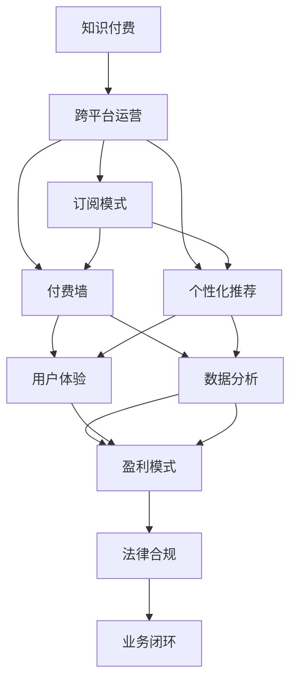

                 

# 知识付费创业的跨平台运营策略

> 关键词：知识付费, 跨平台, 订阅模式, 付费墙, 个性化推荐, 用户体验, 数据分析, 盈利模式, 法律合规

## 1. 背景介绍

### 1.1 问题由来
知识付费近年来成为风口，尤其是在移动互联网和在线教育的推动下，用户对于高质量内容的需求日益增加。无论是教育、健康、投资还是职业发展等领域，知识付费的浪潮都在席卷而来。然而，尽管市场热度高涨，但知识付费创业的成功率并不高。大部分创业者面临的首要问题是如何有效运营，特别是在跨平台运营中，如何整合资源、提升用户体验、增加收入等。

### 1.2 问题核心关键点
- **用户体验**：如何优化用户体验，提高用户黏性，是知识付费创业的核心关键点之一。
- **盈利模式**：如何构建可持续的盈利模式，确保商业模式的健康发展。
- **跨平台运营**：如何在不同的平台（如App、网站、社交媒体等）上进行高效运营。
- **法律合规**：如何确保业务的合规性，避免法律风险。

### 1.3 问题研究意义
对于知识付费创业来说，掌握跨平台运营策略至关重要。这不仅能提升用户体验，增加用户粘性，还能拓展收入渠道，提升整体竞争力。本文旨在从用户体验、盈利模式、跨平台运营和法律合规等方面，提供系统性的解决方案，帮助知识付费创业者顺利走上正轨。

## 2. 核心概念与联系

### 2.1 核心概念概述

- **知识付费**：用户为获取特定知识和信息而支付费用的商业模式。
- **跨平台运营**：在不同的平台（如App、网站、社交媒体等）上统一运营，提升整体用户覆盖面和运营效率。
- **订阅模式**：用户定期支付费用以获得持续访问权限。
- **付费墙**：用户在访问付费内容前需要支付一定费用，以此控制用户进入。
- **个性化推荐**：根据用户行为和偏好推荐相关内容，提升用户体验和粘性。
- **用户体验**：用户在使用产品时的主观感受和体验。
- **数据分析**：通过收集和分析用户数据，优化运营策略，提升效果。
- **盈利模式**：业务的收入来源和可持续发展的商业模式。
- **法律合规**：确保业务运营符合法律法规要求。

这些核心概念之间相互联系，共同构成了知识付费创业跨平台运营的基础框架。

### 2.2 核心概念原理和架构的 Mermaid 流程图



这个流程图展示了知识付费创业中各个核心概念之间的相互关系：

- **知识付费**是起点，提供具体的服务。
- **跨平台运营**涵盖了订阅模式、付费墙和个性化推荐。
- **用户体验**和**数据分析**是提升运营效果的关键。
- **盈利模式**是商业模式的基石。
- **法律合规**是业务发展的底线。
- 最终目标是通过**业务闭环**实现可持续运营。

## 3. 核心算法原理 & 具体操作步骤

### 3.1 算法原理概述

知识付费创业的跨平台运营，涉及多个环节的算法设计和流程管理。以下是主要算法原理概述：

- **订阅模式设计**：通过设计合理的订阅计划和价格策略，吸引用户订阅，并保证一定的用户留存率。
- **付费墙策略**：确定付费墙的层级和位置，提升付费转化率。
- **个性化推荐算法**：基于用户行为和偏好，推荐相关内容，提高用户满意度。
- **用户行为分析**：通过数据分析技术，识别用户行为模式，优化用户体验和运营策略。
- **数据安全与隐私保护**：确保用户数据的安全性和隐私保护，符合法律法规要求。

### 3.2 算法步骤详解

**订阅模式设计**：

1. **用户分群**：根据用户行为、付费记录等因素，将用户分为不同群体，如新用户、高价值用户、流失用户等。
2. **订阅计划设计**：根据用户群体的特点，设计不同的订阅计划，如月度订阅、季度订阅、年度订阅等。
3. **价格策略**：根据市场需求和竞争对手情况，制定合理的价格策略，如捆绑销售、优惠券、限时优惠等。

**付费墙策略**：

1. **层级设置**：根据内容的重要性和价值，设置多个付费层级，每个层级对应不同的内容访问权限。
2. **内容展示**：在网站或App的不同位置，如首页、分类页等，展示付费内容，吸引用户付费。
3. **提示与提醒**：在用户访问内容时，通过弹窗、提示等方式，提醒用户付费。

**个性化推荐算法**：

1. **数据收集**：收集用户浏览、点击、订阅等行为数据。
2. **特征工程**：提取用户行为特征，如兴趣标签、浏览历史、互动记录等。
3. **模型训练**：使用机器学习模型，如协同过滤、内容推荐算法等，训练个性化推荐模型。
4. **推荐策略**：根据用户行为特征，生成个性化推荐列表，提升用户满意度。

**用户行为分析**：

1. **数据采集**：通过日志、点击流、问卷调查等方式，收集用户行为数据。
2. **数据清洗**：处理缺失、异常数据，保证数据的准确性和完整性。
3. **数据分析**：使用统计学方法、数据挖掘技术等，分析用户行为模式，识别用户需求和偏好。
4. **策略优化**：根据分析结果，优化产品设计、内容推荐、用户体验等，提升运营效果。

**数据安全与隐私保护**：

1. **加密传输**：使用SSL/TLS协议加密用户数据传输，确保数据在传输过程中的安全。
2. **数据存储**：采用安全的数据存储方案，如数据加密、访问控制等，保护用户数据。
3. **隐私保护**：遵循相关法律法规，如GDPR、CCPA等，保护用户隐私，避免数据滥用。

### 3.3 算法优缺点

**订阅模式设计**的优点在于：

- **提升用户粘性**：通过定期订阅，保证用户持续访问，增加用户留存率。
- **稳定收入来源**：订阅模式提供稳定的收入流，减少对单一事件的依赖。

**订阅模式设计**的缺点在于：

- **高用户流失率**：用户可能会因为价格、内容质量等因素流失。
- **需要持续优化**：订阅模式需要不断优化，以满足市场需求和用户期望。

**付费墙策略**的优点在于：

- **提高付费转化率**：通过层级设置，引导用户逐渐付费，提升转化率。
- **控制内容访问**：控制用户访问付费内容，保护知识产权。

**付费墙策略**的缺点在于：

- **用户体验下降**：付费墙设置不当，可能影响用户体验，导致用户流失。
- **操作复杂**：需要精心设计付费墙的位置和内容，保持用户体验。

**个性化推荐算法**的优点在于：

- **提升用户体验**：根据用户偏好推荐内容，提升用户满意度。
- **增加用户粘性**：个性化推荐提高用户粘性，减少流失率。

**个性化推荐算法**的缺点在于：

- **数据依赖**：推荐算法依赖于用户行为数据，数据量不足可能影响推荐效果。
- **冷启动问题**：新用户缺乏足够行为数据，可能导致初期推荐效果不佳。

**用户行为分析**的优点在于：

- **优化运营策略**：通过数据分析，优化产品设计、推荐算法等，提升整体效果。
- **用户洞察**：深入了解用户需求和行为模式，提升用户体验。

**用户行为分析**的缺点在于：

- **数据隐私**：用户行为数据可能涉及隐私问题，需要严格保护。
- **技术复杂**：数据采集、处理、分析等环节技术复杂，需要专业团队支持。

**数据安全与隐私保护**的优点在于：

- **保障用户信任**：保护用户数据隐私，提升用户信任度。
- **合规要求**：遵循法律法规，避免法律风险。

**数据安全与隐私保护**的缺点在于：

- **技术要求高**：数据安全和隐私保护技术要求高，需要持续投入。
- **合规难度大**：不同地区的法律法规要求不同，合规难度较大。

### 3.4 算法应用领域

基于上述算法原理和具体操作步骤，知识付费创业的跨平台运营策略在多个领域有广泛应用，例如：

- **教育平台**：通过订阅模式和个性化推荐，提升用户学习效果和体验。
- **健康平台**：提供健康课程、营养计划等服务，通过付费墙和数据分析，提升用户粘性和付费转化率。
- **职业发展平台**：提供职业技能培训、职业咨询等服务，通过个性化推荐和用户行为分析，提升平台竞争力。
- **投资平台**：提供投资课程、市场分析等服务，通过订阅模式和数据分析，提升用户参与度和满意度。

## 4. 数学模型和公式 & 详细讲解

### 4.1 数学模型构建

**订阅模式设计**的数学模型为：

- **用户分群模型**：通过聚类算法，将用户分为不同的群体。
- **订阅计划设计模型**：通过收益管理算法，设计不同的订阅计划。
- **价格策略模型**：通过动态定价模型，制定合理的价格策略。

**付费墙策略**的数学模型为：

- **付费层级模型**：通过A/B测试，确定最优的付费层级和内容访问权限。
- **提示与提醒模型**：通过行为分析，设计最优的弹窗和提示策略。

**个性化推荐算法**的数学模型为：

- **协同过滤模型**：通过协同过滤算法，推荐相似用户喜欢的内容。
- **内容推荐模型**：通过内容推荐算法，推荐相关性高的内容。

**用户行为分析**的数学模型为：

- **用户行为模式分析模型**：通过统计学方法，分析用户行为模式。
- **用户偏好预测模型**：通过机器学习模型，预测用户偏好。

**数据安全与隐私保护的数学模型为**：

- **数据加密模型**：通过加密算法，确保数据传输安全。
- **数据存储模型**：通过访问控制模型，保护数据存储安全。
- **隐私保护模型**：通过隐私保护算法，保护用户隐私。

### 4.2 公式推导过程

**订阅模式设计**的公式推导：

1. **用户分群公式**：
   $$
   C = K-means(X)
   $$
   其中 $C$ 为用户群体，$K-means$ 为聚类算法，$X$ 为用户行为数据。

2. **订阅计划设计公式**：
   $$
   P = RM(X, C)
   $$
   其中 $P$ 为订阅计划，$RM$ 为收益管理算法，$X$ 为用户行为数据，$C$ 为聚类结果。

3. **价格策略公式**：
   $$
   P_{price} = CD(C, P)
   $$
   其中 $P_{price}$ 为价格策略，$CD$ 为动态定价算法，$C$ 为用户群体，$P$ 为订阅计划。

**付费墙策略**的公式推导：

1. **付费层级公式**：
   $$
   L = A/B(C)
   $$
   其中 $L$ 为付费层级，$A/B$ 为A/B测试算法，$C$ 为用户群体。

2. **内容展示公式**：
   $$
   V = CF(X, L)
   $$
   其中 $V$ 为内容展示策略，$CF$ 为内容推荐算法，$X$ 为用户行为数据，$L$ 为付费层级。

3. **提示与提醒公式**：
   $$
   PW = PS(X, V)
   $$
   其中 $PW$ 为提示与提醒策略，$PS$ 为提示算法，$X$ 为用户行为数据，$V$ 为内容展示策略。

**个性化推荐算法**的公式推导：

1. **协同过滤公式**：
   $$
   R = CF(X, Y)
   $$
   其中 $R$ 为用户推荐列表，$CF$ 为协同过滤算法，$X$ 为用户行为数据，$Y$ 为用户群体。

2. **内容推荐公式**：
   $$
   R = CR(X, Y)
   $$
   其中 $R$ 为用户推荐列表，$CR$ 为内容推荐算法，$X$ 为用户行为数据，$Y$ 为用户群体。

**用户行为分析**的公式推导：

1. **用户行为模式分析公式**：
   $$
   M = SA(X)
   $$
   其中 $M$ 为用户行为模式，$SA$ 为统计分析算法，$X$ 为用户行为数据。

2. **用户偏好预测公式**：
   $$
   P = ML(M)
   $$
   其中 $P$ 为用户偏好，$ML$ 为机器学习模型，$M$ 为用户行为模式。

**数据安全与隐私保护的公式推导**：

1. **数据加密公式**：
   $$
   E = KE(X)
   $$
   其中 $E$ 为加密数据，$KE$ 为加密算法，$X$ 为原始数据。

2. **数据存储公式**：
   $$
   S = AC(X, P)
   $$
   其中 $S$ 为存储策略，$AC$ 为访问控制算法，$X$ 为原始数据，$P$ 为隐私保护策略。

3. **隐私保护公式**：
   $$
   PR = DP(X, P)
   $$
   其中 $PR$ 为隐私保护结果，$DP$ 为隐私保护算法，$X$ 为原始数据，$P$ 为隐私保护策略。

## 5. 项目实践：代码实例和详细解释说明

### 5.1 开发环境搭建

为了快速搭建跨平台运营环境，我们推荐使用Docker容器化和Kubernetes容器编排工具。以下是在Linux系统上搭建Docker环境的示例：

1. 安装Docker：
   ```bash
   sudo apt-get update
   sudo apt-get install docker-ce
   ```

2. 启动Docker服务：
   ```bash
   sudo systemctl start docker
   ```

3. 拉取最新镜像：
   ```bash
   docker pull ubuntu
   ```

4. 运行Docker容器：
   ```bash
   docker run -it --name my_container -p 80:80 ubuntu
   ```

### 5.2 源代码详细实现

以下是基于Python和Flask框架实现的跨平台运营示例：

```python
from flask import Flask, request, jsonify

app = Flask(__name__)

# 订阅模式设计
@app.route('/subscribe', methods=['POST'])
def subscribe():
    # 用户分群
    user_clusters = clustering(request.json['user_data'])
    # 订阅计划设计
    subscription_plans = design_plans(user_clusters)
    # 价格策略设计
    price_strategies = price_models(subscription_plans)
    return jsonify({'clusters': user_clusters, 'plans': subscription_plans, 'prices': price_strategies})

# 付费墙策略
@app.route('/payment_wall', methods=['POST'])
def payment_wall():
    # 付费层级设置
    payment_levels = A_B_test(user_data)
    # 内容展示策略
    content_display = content_recommendations(user_data, payment_levels)
    # 提示与提醒策略
    popups_reminders = popups_reminders(user_data, content_display)
    return jsonify({'levels': payment_levels, 'display': content_display, 'prompts': popups_reminders})

# 个性化推荐算法
@app.route('/recommendations', methods=['POST'])
def recommendations():
    # 协同过滤推荐
    collaborative_filtering = collaborative_filtering(user_data)
    # 内容推荐
    content_recommendations = content_recommendations(user_data)
    return jsonify({'recommendations': collaborative_filtering + content_recommendations})

# 用户行为分析
@app.route('/user_analysis', methods=['POST'])
def user_analysis():
    # 用户行为模式分析
    user_motives = analyze_user_motives(user_data)
    # 用户偏好预测
    user_preferences = predict_user_preferences(user_motives)
    return jsonify({'motives': user_motives, 'preferences': user_preferences})

# 数据安全与隐私保护
@app.route('/data_security', methods=['POST'])
def data_security():
    # 数据加密
    encrypted_data = encrypt_data(user_data)
    # 数据存储
    secure_storage = secure_storage(encrypted_data)
    # 隐私保护
    privacy_protection = privacy_protection(secure_storage)
    return jsonify({'encrypted': encrypted_data, 'storage': secure_storage, 'protected': privacy_protection})
```

### 5.3 代码解读与分析

以上代码实现了一个简单的跨平台运营平台，包括以下关键功能：

- **订阅模式设计**：通过用户分群、订阅计划设计、价格策略设计等模块，实现订阅模式的个性化设置。
- **付费墙策略**：通过付费层级设置、内容展示策略、提示与提醒策略等模块，实现付费墙的灵活管理。
- **个性化推荐算法**：通过协同过滤推荐、内容推荐等模块，实现个性化内容的精准推荐。
- **用户行为分析**：通过用户行为模式分析和用户偏好预测等模块，提升用户体验和运营效果。
- **数据安全与隐私保护**：通过数据加密、数据存储、隐私保护等模块，确保用户数据的安全性和隐私保护。

## 6. 实际应用场景

### 6.1 智能学习平台

智能学习平台通过订阅模式和个性化推荐，为用户提供定制化的学习内容和资源。平台可以根据用户的学习进度和兴趣，推荐适合的课程和资料，提高学习效率和效果。通过付费墙策略，控制用户访问付费内容，确保平台收益。同时，通过用户行为分析，优化推荐算法，提升用户粘性和满意度。

### 6.2 健康管理平台

健康管理平台通过订阅模式和个性化推荐，提供定制化的健康管理服务。平台可以根据用户的生活方式和健康状况，推荐适合的饮食、运动、体检等服务，提升用户健康水平。通过付费墙策略，控制用户访问付费内容，确保平台收益。同时，通过用户行为分析，优化推荐算法，提升用户粘性和满意度。

### 6.3 职业技能培训平台

职业技能培训平台通过订阅模式和个性化推荐，提供定制化的职业技能培训服务。平台可以根据用户的职业背景和需求，推荐适合的培训课程和资料，提升用户职业技能。通过付费墙策略，控制用户访问付费内容，确保平台收益。同时，通过用户行为分析，优化推荐算法，提升用户粘性和满意度。

### 6.4 金融投资平台

金融投资平台通过订阅模式和个性化推荐，提供定制化的金融投资服务。平台可以根据用户的投资偏好和风险承受能力，推荐适合的投资产品和策略，提升用户投资回报。通过付费墙策略，控制用户访问付费内容，确保平台收益。同时，通过用户行为分析，优化推荐算法，提升用户粘性和满意度。

## 7. 工具和资源推荐

### 7.1 学习资源推荐

- **《知识付费业务开发实战》**：系统介绍知识付费业务的开发和运营，提供实用案例和技术指导。
- **《订阅模式设计》**：讲解订阅模式的设计和优化，提升用户粘性和收益。
- **《个性化推荐算法》**：介绍个性化推荐算法的基本原理和实现方法，提升用户体验。
- **《用户行为分析》**：讲解用户行为分析和数据驱动运营的策略和方法，优化运营效果。
- **《数据安全与隐私保护》**：讲解数据安全与隐私保护的基本原则和技术手段，确保用户数据安全。

### 7.2 开发工具推荐

- **Docker**：容器化环境搭建，提高开发和部署效率。
- **Kubernetes**：容器编排工具，支持跨平台部署和扩展。
- **Flask**：轻量级Web框架，提供简单易用的API接口。
- **Apache Kafka**：消息队列，支持实时数据处理和存储。
- **Elasticsearch**：搜索引擎，支持海量数据存储和检索。

### 7.3 相关论文推荐

- **《基于订阅模式的个性化推荐系统设计》**：研究订阅模式下的个性化推荐系统设计，提供实证分析。
- **《数据安全与隐私保护在知识付费平台中的应用》**：探讨知识付费平台中数据安全和隐私保护的技术实现，提供实用策略。
- **《智能学习平台的跨平台运营策略》**：研究智能学习平台的跨平台运营策略，提升用户体验和平台收益。
- **《跨平台运营中的用户行为分析和个性化推荐》**：探讨跨平台运营中用户行为分析和个性化推荐的方法和技术。

## 8. 总结：未来发展趋势与挑战

### 8.1 总结

本文系统介绍了知识付费创业的跨平台运营策略，涵盖了订阅模式设计、付费墙策略、个性化推荐、用户行为分析、数据安全与隐私保护等多个方面。通过实际案例和代码实现，展示了跨平台运营的具体应用和方法。

### 8.2 未来发展趋势

知识付费创业的跨平台运营将呈现以下发展趋势：

1. **个性化定制**：随着用户需求的个性化增强，订阅模式和个性化推荐将更加精准，满足用户差异化需求。
2. **数据驱动运营**：通过数据驱动运营，提升用户体验和运营效果，实现更加智能化和自动化的运营。
3. **多平台整合**：跨平台运营将更加高效，不同平台之间的数据互通和协同，提升整体用户覆盖面和运营效率。
4. **用户行为分析**：用户行为分析技术将更加成熟，通过数据挖掘和机器学习，提升运营效果和用户体验。
5. **数据安全和隐私保护**：随着用户隐私意识的增强，数据安全和隐私保护将更加严格，确保用户数据的安全性和隐私保护。

### 8.3 面临的挑战

尽管知识付费创业的跨平台运营前景广阔，但仍面临诸多挑战：

1. **数据隐私保护**：用户数据隐私保护问题严峻，需要严格遵守法律法规要求，确保用户数据安全。
2. **用户体验优化**：用户行为复杂多变，需要不断优化用户体验，提升用户粘性。
3. **成本控制**：跨平台运营涉及多平台部署和数据整合，需要合理控制成本，提升运营效率。
4. **法律合规**：不同地区的法律法规要求不同，需要严格遵守法律合规要求，避免法律风险。
5. **技术实现**：跨平台运营涉及多种技术和工具，需要不断提升技术实现能力，确保系统稳定运行。

### 8.4 研究展望

未来，知识付费创业的跨平台运营将继续在以下几个方面进行深入研究：

1. **跨平台协同**：探索跨平台协同机制，实现不同平台之间的数据互通和业务协同，提升整体运营效率。
2. **用户行为分析**：深入研究用户行为分析技术，提升用户行为预测和推荐效果，优化用户体验。
3. **个性化推荐**：开发更加高效的个性化推荐算法，提升推荐精度和覆盖面，提高用户满意度。
4. **数据安全与隐私保护**：研究和探索数据安全和隐私保护的新技术和新方法，确保用户数据的安全性和隐私保护。
5. **用户激励机制**：研究用户激励机制，提升用户活跃度和粘性，实现更高效的运营和商业变现。

通过持续的创新和优化，知识付费创业的跨平台运营将迎来新的发展机遇，为社会提供更优质的知识付费服务。

## 9. 附录：常见问题与解答

**Q1：知识付费平台应该如何选择合适的订阅模式？**

A: 知识付费平台在选择订阅模式时，应综合考虑用户需求、市场竞争、收益预期等因素。常见的订阅模式包括月度订阅、季度订阅、年度订阅等。建议根据目标用户群体和市场需求，设计合理的订阅计划和价格策略，同时考虑引入试用期、优惠券等激励措施，提升用户转化率和留存率。

**Q2：在跨平台运营中，如何提升用户体验？**

A: 在跨平台运营中，提升用户体验的关键在于个性化推荐和数据驱动运营。通过收集用户行为数据，进行数据分析和用户行为模式分析，推荐符合用户兴趣和需求的内容。同时，优化产品设计和交互方式，提升用户体验和粘性。

**Q3：数据安全和隐私保护在知识付费平台中应如何实现？**

A: 在知识付费平台中，数据安全和隐私保护应遵循相关法律法规要求，如GDPR、CCPA等。具体措施包括：数据加密传输、访问控制、隐私保护算法等。同时，应建立数据安全管理体系，定期进行安全审计和风险评估，确保用户数据安全。

**Q4：如何构建可持续的知识付费商业模式？**

A: 构建可持续的知识付费商业模式，关键在于选择合适的订阅模式、个性化推荐和用户行为分析。通过设计合理的订阅计划、个性化推荐算法和用户行为分析模型，提升用户粘性和满意度，同时优化价格策略和运营策略，实现可持续的盈利和运营。

**Q5：在跨平台运营中，如何实现用户行为数据的多平台整合？**

A: 在跨平台运营中，实现用户行为数据的多平台整合需要建立统一的数据标准和数据共享机制。可以通过API接口、数据同步工具等方式，实现不同平台之间的数据互通和共享，同时确保数据安全性和隐私保护。

---

作者：禅与计算机程序设计艺术 / Zen and the Art of Computer Programming

