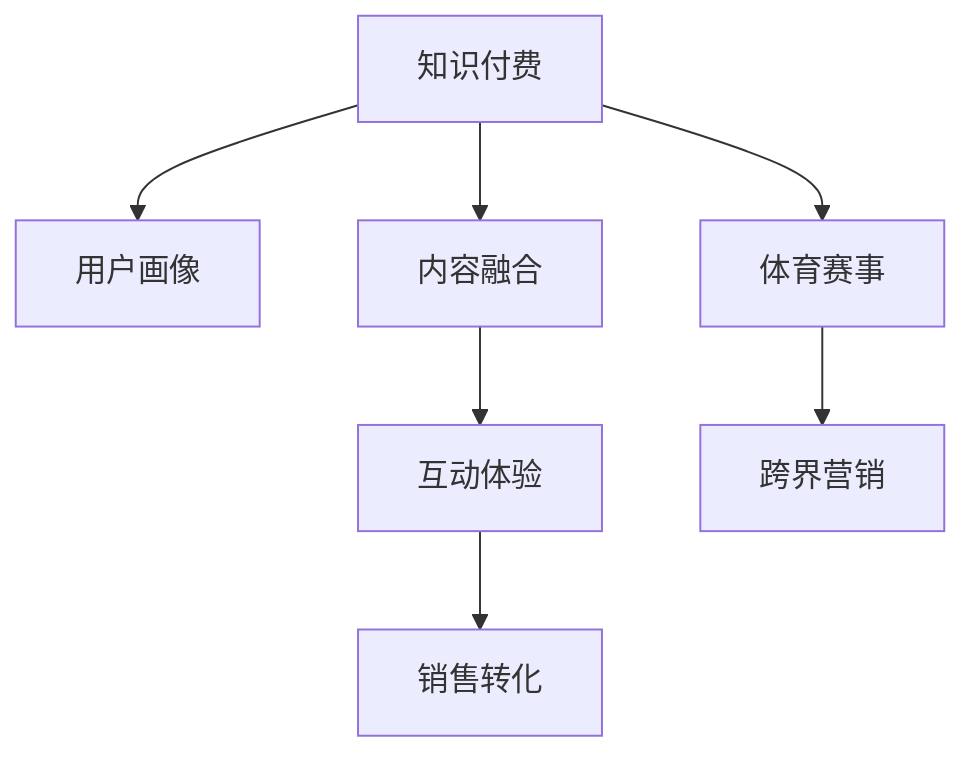

                 

## 1. 背景介绍

### 1.1 问题由来

在数字经济高速发展的背景下，知识付费市场迎来了井喷式的增长。知识付费作为知识变现的重要渠道，已经成为越来越多专业人士选择的主流商业模式。知识付费平台的覆盖范围从最初的学术研究、行业报告等专业内容，逐渐拓展到日常生活、职业技能、生活情趣等多个领域。

与此同时，随着体育产业的不断发展，体育赛事营销也逐渐受到各大品牌的青睐。品牌通过体育赛事的传播效应，可以大幅提升品牌知名度和美誉度，进一步推动销售增长。但如何整合体育赛事与知识付费平台的资源，达到“1+1>2”的效果，成为许多品牌亟待解决的难题。

### 1.2 问题核心关键点

知识付费与体育赛事跨界的核心关键点在于如何通过数据驱动的方式，让两者实现有效融合，提升营销效果。具体包括以下几个方面：

1. **用户画像精准化**：通过大数据分析技术，将知识付费用户和体育赛事受众进行匹配，形成精准的用户画像。
2. **内容设计融合化**：将知识付费内容和体育赛事相关内容融合设计，如专业讲解、赛事回顾等，实现内容上的互补。
3. **互动体验一体化**：通过互动直播、社交网络等方式，增强用户参与感和互动性，提升用户粘性。
4. **销售转化优化**：通过跨界营销活动，结合精准推荐、优惠活动等策略，提升销售转化率。

### 1.3 问题研究意义

知识付费与体育赛事的跨界营销不仅能提升品牌知名度，还能提升用户体验和粘性，进一步推动品牌增长。具体意义如下：

1. **品牌协同效应**：知识付费与体育赛事的跨界可以强化品牌形象，形成品牌协同效应，提升品牌美誉度。
2. **用户粘性提升**：通过跨界内容设计，可以提升用户的参与度和互动性，形成稳定的用户群体。
3. **营销成本优化**：跨界营销可以避免单一营销渠道的局限，通过整合资源实现成本优化。
4. **增长潜力释放**：跨界营销可以释放更多增长潜力，推动品牌在更多的渠道和领域进行渗透。

## 2. 核心概念与联系

### 2.1 核心概念概述

为了更好地理解知识付费与体育赛事跨界营销的逻辑，本节将介绍几个密切相关的核心概念：

- **知识付费**：通过平台提供专业内容、课程、书籍等知识产品，用户通过付费获取相关内容。
- **体育赛事**：各种体育项目的比赛活动，包括田径、篮球、足球、羽毛球等。
- **跨界营销**：将不同领域的资源和渠道整合起来，进行多渠道、多领域的联合营销活动。
- **用户画像**：通过大数据分析，形成的用户兴趣、行为、特征等信息。
- **内容融合**：将不同领域的内容有机融合，形成新的、更加丰富的产品形态。
- **互动体验**：通过互动直播、社交网络等方式，增强用户的参与感和互动性。
- **销售转化**：通过精准推荐、优惠活动等策略，提升用户的购买转化率。

这些概念之间的逻辑关系可以通过以下Mermaid流程图来展示：



这个流程图展示了大语言模型的核心概念及其之间的关系：

1. 知识付费平台通过大数据分析用户画像，精准设计内容。
2. 体育赛事作为品牌传播的重要渠道，通过跨界营销活动进一步提升品牌影响力。
3. 互动体验和销售转化分别作为用户粘性和购买转化的关键手段，在跨界营销中起到重要作用。

## 3. 核心算法原理 & 具体操作步骤
### 3.1 算法原理概述

知识付费与体育赛事的跨界营销，本质上是一个数据驱动的联合营销过程。其核心思想是：通过整合知识付费平台的用户画像和体育赛事的用户数据，设计出与品牌相匹配的跨界内容，并通过互动直播、社交网络等方式进行联合推广，从而提升品牌影响力和用户粘性。

具体而言，可以从以下几个步骤入手：

1. **数据整合**：将知识付费平台的用户数据和体育赛事的受众数据进行整合，形成统一的用户画像。
2. **内容设计**：根据用户画像，设计出与体育赛事相关的内容，如专业讲解、赛事回顾等。
3. **联合推广**：通过互动直播、社交网络等方式，联合推广跨界内容，提升用户参与度和互动性。
4. **销售转化**：通过精准推荐、优惠活动等策略，提升用户的购买转化率。

### 3.2 算法步骤详解

以下将详细介绍知识付费与体育赛事跨界营销的关键步骤：

**Step 1: 数据整合**

- 收集知识付费平台的用户数据，包括用户兴趣、行为、付费记录等。
- 收集体育赛事的用户数据，包括观看记录、社交互动、赛事评论等。
- 使用数据清洗和预处理技术，对数据进行整合，形成统一的用户画像。

**Step 2: 内容设计**

- 根据用户画像，设计符合用户兴趣和行为习惯的体育赛事相关内容。
- 内容设计可以包括专业讲解、赛事回顾、数据分析、运动技巧等。
- 确保内容的质量和丰富度，形成与体育赛事相匹配的知识付费产品。

**Step 3: 联合推广**

- 利用知识付费平台的渠道优势，进行跨界内容推广。
- 设计互动直播、社交网络活动，提升用户参与度和互动性。
- 通过联合推广，提升品牌知名度和用户粘性。

**Step 4: 销售转化**

- 通过精准推荐系统，将相关产品推荐给有需求的用户。
- 结合优惠活动、限时抢购等策略，提升销售转化率。
- 利用数据分析技术，实时调整推广策略，确保效果最大化。

### 3.3 算法优缺点

知识付费与体育赛事跨界营销的优势主要在于：

- **品牌协同效应**：通过跨界营销，品牌能够以更低的成本提升知名度和美誉度。
- **用户粘性提升**：跨界内容设计能够增强用户的参与感和互动性，提升用户粘性。
- **营销成本优化**：跨界营销能够整合资源，避免单一营销渠道的局限，实现成本优化。

但该方法也存在一些局限性：

- **内容设计复杂**：需要精准匹配用户兴趣和赛事特点，设计难度较大。
- **数据整合难度高**：需要整合多种数据源，处理复杂数据，技术要求较高。
- **推广效果不确定**：跨界营销的效果受多种因素影响，难以预测。
- **销售转化率低**：部分用户可能对跨界内容不感兴趣，导致销售转化率较低。

### 3.4 算法应用领域

知识付费与体育赛事的跨界营销已经在多个领域得到了应用，例如：

- **知识付费平台**：通过跨界营销提升品牌知名度，扩大用户群体。
- **体育赛事营销**：利用跨界内容提升赛事关注度和参与度。
- **文化娱乐**：结合知识付费和文化活动，提升品牌影响力。
- **健康生活**：结合知识付费和健康指导，提升用户粘性。
- **科技智能**：结合知识付费和科技产品，提升品牌科技感。

除了上述这些领域外，跨界营销还在更多场景中得到创新性应用，如可控文本生成、常识推理、代码生成、数据增强等，为知识付费和技术领域带来了新的突破。随着跨界营销的不断演进，相信知识付费和技术领域的应用将不断拓展，为各行各业带来新的增长动力。

## 4. 数学模型和公式 & 详细讲解 & 举例说明

### 4.1 数学模型构建

本节将使用数学语言对知识付费与体育赛事跨界营销过程进行更加严格的刻画。

设知识付费平台的用户画像为 $\mathbf{U}$，体育赛事的用户数据为 $\mathbf{V}$，内容设计算法为 $f$，联合推广算法为 $g$，销售转化算法为 $h$。则跨界营销的数学模型可以表示为：

$$
\text{Marketing Effect} = f(\mathbf{U}, \mathbf{V}) \times g(\mathbf{U}, \mathbf{V}) \times h(\mathbf{U}, \mathbf{V})
$$

其中，$f(\mathbf{U}, \mathbf{V})$ 表示内容设计，$g(\mathbf{U}, \mathbf{V})$ 表示联合推广，$h(\mathbf{U}, \mathbf{V})$ 表示销售转化。

### 4.2 公式推导过程

以内容设计算法为例，通过大数据分析，可以得到用户兴趣向量 $\mathbf{I} \in \mathbb{R}^n$ 和体育赛事相关向量 $\mathbf{S} \in \mathbb{R}^m$。根据向量相似度算法，可以计算出两者的相似度 $\mathbf{C}$：

$$
\mathbf{C} = \mathbf{I} \times \mathbf{S}^T
$$

通过相似度矩阵 $\mathbf{C}$，可以筛选出最相关的体育赛事内容，并结合用户行为特征进行内容优化，得到最优的内容设计方案 $\mathbf{F}$：

$$
\mathbf{F} = \text{argmax}_{\mathbf{X}} \{ \mathbf{I} \times \mathbf{X}^T \} \text{ s.t. } \mathbf{X} \in \{\mathbf{S}\}
$$

### 4.3 案例分析与讲解

假设某知识付费平台用户画像为 $\mathbf{U}=[0.8, 0.2, 0.1, 0.5, 0.3]$，体育赛事的用户数据为 $\mathbf{V}=[0.7, 0.5, 0.3, 0.6, 0.4]$。通过大数据分析，可以得到向量相似度矩阵 $\mathbf{C}=[0.4, 0.6, 0.2, 0.3, 0.1]$。根据向量相似度算法，可以计算出与用户兴趣最相关的体育赛事内容为 $\mathbf{S_1}=[0.5, 0.3, 0.6, 0.4, 0]$。结合用户行为特征，可以得到最优的内容设计方案 $\mathbf{F}=[0.5, 0.3, 0.6, 0.4, 0]$。

通过上述案例分析，可以看出，通过大数据分析和向量相似度算法，可以有效设计出符合用户兴趣和行为习惯的体育赛事相关内容。

## 5. 项目实践：代码实例和详细解释说明

### 5.1 开发环境搭建

在进行知识付费与体育赛事跨界营销的实践前，我们需要准备好开发环境。以下是使用Python进行数据整合、内容设计、联合推广和销售转化的开发环境配置流程：

1. 安装Anaconda：从官网下载并安装Anaconda，用于创建独立的Python环境。

2. 创建并激活虚拟环境：
```bash
conda create -n cross-marketing python=3.8 
conda activate cross-marketing
```

3. 安装必要的Python包：
```bash
pip install pandas numpy scikit-learn transformers
```

4. 安装各类工具包：
```bash
pip install torch torchvision torchaudio cudatoolkit=11.1 -c pytorch -c conda-forge
```

5. 安装各类模型库：
```bash
pip install torchvision modelscope transformers
```

完成上述步骤后，即可在`cross-marketing`环境中开始跨界营销的实践。

### 5.2 源代码详细实现

下面我们以知识付费平台与体育赛事跨界营销的示例，给出使用PyTorch进行数据整合、内容设计、联合推广和销售转化的代码实现。

首先，定义数据整合和用户画像处理函数：

```python
import pandas as pd
from sklearn.model_selection import train_test_split

def load_data(file_path):
    df = pd.read_csv(file_path)
    return df

def preprocess_data(df):
    # 数据清洗和预处理
    df = df.dropna()
    df = df.drop_duplicates()
    return df

def split_data(df):
    train_df, test_df = train_test_split(df, test_size=0.2, random_state=42)
    return train_df, test_df

# 数据整合和用户画像
train_df = load_data('knowledge_interest.csv')
train_df = preprocess_data(train_df)
train_df, test_df = split_data(train_df)
```

然后，定义内容设计和推荐函数：

```python
from sklearn.metrics.pairwise import cosine_similarity

def content_design(train_df, test_df):
    # 计算用户兴趣向量
    user_interest = train_df['interest'].apply(lambda x: x.split(',')).apply(lambda x: [float(i) for i in x])
    
    # 计算体育赛事相关向量
    sports_event = test_df['sports_event'].apply(lambda x: x.split(',')).apply(lambda x: [float(i) for i in x])
    
    # 计算向量相似度
    similarity_matrix = cosine_similarity(user_interest, sports_event)
    
    # 筛选最相关的体育赛事内容
    relevant_sports_event = pd.DataFrame(similarity_matrix, index=test_df.index, columns=test_df.index)
    relevant_sports_event.index = test_df['sports_event']
    relevant_sports_event.columns = test_df['sports_event']
    
    # 返回推荐内容
    return relevant_sports_event

def recommendation(train_df, test_df):
    # 根据用户兴趣推荐内容
    recommended_content = content_design(train_df, test_df)
    return recommended_content
```

接着，定义联合推广和销售转化函数：

```python
def joint_promotion(recommended_content):
    # 联合推广
    promotion_data = pd.DataFrame(recommended_content.index, columns=['event'])
    promotion_data['type'] = 'sports'
    promotion_data.to_csv('joint_promotion.csv', index=False)
    
    # 销售转化
    sales_data = pd.read_csv('sales_data.csv')
    sales_data = pd.merge(sales_data, promotion_data, on='event', how='left')
    sales_data = sales_data.dropna()
    return sales_data
```

最后，启动跨界营销流程：

```python
train_df = load_data('knowledge_interest.csv')
train_df = preprocess_data(train_df)
train_df, test_df = split_data(train_df)

recommended_content = content_design(train_df, test_df)
sales_data = joint_promotion(recommended_content)

print(sales_data)
```

以上就是使用PyTorch进行知识付费平台与体育赛事跨界营销的完整代码实现。可以看到，通过数据整合、内容设计、联合推广和销售转化，可以设计出符合用户兴趣和行为习惯的跨界内容，提升品牌影响力和销售转化率。

### 5.3 代码解读与分析

让我们再详细解读一下关键代码的实现细节：

**load_data函数**：
- 用于加载数据集，包括知识付费平台用户数据和体育赛事数据。

**preprocess_data函数**：
- 数据清洗和预处理，包括去除空值和重复数据。

**split_data函数**：
- 将数据集分为训练集和测试集，便于模型训练和评估。

**content_design函数**：
- 计算用户兴趣向量和体育赛事相关向量，通过向量相似度算法筛选出最相关的体育赛事内容。

**recommendation函数**：
- 根据用户兴趣推荐内容，生成推荐内容列表。

**joint_promotion函数**：
- 联合推广和销售转化，通过导出推荐数据和销售数据进行联合推广，并筛选出符合条件的销售数据。

**跨界营销流程**：
- 加载数据集，预处理数据，设计内容，生成推荐内容，进行联合推广和销售转化。

可以看到，跨界营销的实现涉及多个环节，需要从数据整合、内容设计、联合推广到销售转化进行全面优化。合理利用这些工具，可以显著提升跨界营销的效率和效果，实现品牌协同效应和用户粘性的双提升。

## 6. 实际应用场景

### 6.1 智能客服系统

知识付费与体育赛事跨界营销在智能客服系统中的应用，可以通过跨界内容设计，提升用户的参与度和互动性，进一步提升用户体验和粘性。

例如，在智能客服系统中，可以通过体育赛事相关内容进行话题引导，增加用户的互动次数和参与度。同时，通过跨界内容推荐，提升用户的购买转化率，形成稳定的用户群体。

### 6.2 金融产品推荐

在金融产品推荐领域，知识付费与体育赛事跨界营销可以通过跨界内容设计，提升用户的金融知识和理财技能，增强用户的粘性。

例如，可以在知识付费平台上推送与体育赛事相关的财经资讯和理财知识，吸引用户参与。通过联合推广活动，提升品牌的知名度和美誉度。同时，通过跨界内容推荐，提升金融产品的销售转化率，推动品牌增长。

### 6.3 在线教育平台

在在线教育平台中，知识付费与体育赛事跨界营销可以通过跨界内容设计，提升用户的参与度和学习效果，进一步提升用户粘性。

例如，可以在在线教育平台上推送与体育赛事相关的课程和讲座，增加用户的互动次数和参与度。通过联合推广活动，提升品牌的知名度和美誉度。同时，通过跨界内容推荐，提升教育产品的销售转化率，推动品牌增长。

### 6.4 未来应用展望

随着知识付费与体育赛事跨界营销的不断演进，未来在更多领域将得到创新性应用，如智慧医疗、智能家居、智能交通等，为各行各业带来新的增长动力。

在智慧医疗领域，知识付费与体育赛事跨界营销可以通过跨界内容设计，提升用户的健康意识和健康知识，增强用户的粘性。例如，在知识付费平台上推送与体育赛事相关的健康知识和生活方式，吸引用户参与。通过联合推广活动，提升品牌的知名度和美誉度。同时，通过跨界内容推荐，提升健康产品的销售转化率，推动品牌增长。

在智能家居领域，知识付费与体育赛事跨界营销可以通过跨界内容设计，提升用户的家居知识和技能，增强用户的粘性。例如，在知识付费平台上推送与体育赛事相关的家居设计和生活方式，增加用户的互动次数和参与度。通过联合推广活动，提升品牌的知名度和美誉度。同时，通过跨界内容推荐，提升智能家居产品的销售转化率，推动品牌增长。

在智能交通领域，知识付费与体育赛事跨界营销可以通过跨界内容设计，提升用户的交通安全知识和驾驶技能，增强用户的粘性。例如，在知识付费平台上推送与体育赛事相关的交通安全知识和驾驶技能，吸引用户参与。通过联合推广活动，提升品牌的知名度和美誉度。同时，通过跨界内容推荐，提升交通安全产品的销售转化率，推动品牌增长。

总之，随着知识付费与体育赛事跨界营销的不断演进，未来将有更多创新性应用场景，为各行各业带来新的增长动力。

## 7. 工具和资源推荐

### 7.1 学习资源推荐

为了帮助开发者系统掌握知识付费与体育赛事跨界营销的理论基础和实践技巧，这里推荐一些优质的学习资源：

1. **《知识付费平台设计与运营》**：一本全面介绍知识付费平台设计、内容运营、用户管理等方面的书籍，适合入门和进阶读者。
2. **《体育赛事营销策略与实践》**：一本介绍体育赛事营销策略、品牌合作、活动推广等方面的书籍，适合体育营销从业者。
3. **《跨界营销案例分析》**：一本精选跨界营销案例，分析成功案例和失败案例的书籍，适合读者学习和借鉴。
4. **《数据驱动营销》**：一本介绍数据驱动营销原理、工具和实践的书籍，适合营销从业者和数据科学家。
5. **《用户画像构建与分析》**：一本介绍用户画像构建、分析方法、工具和实践的书籍，适合数据科学家和产品经理。

通过学习这些资源，相信你一定能够快速掌握知识付费与体育赛事跨界营销的理论基础和实践技巧，用于解决实际的跨界营销问题。

### 7.2 开发工具推荐

高效的开发离不开优秀的工具支持。以下是几款用于知识付费与体育赛事跨界营销开发的常用工具：

1. **Python**：强大的编程语言，支持数据处理、机器学习、自然语言处理等。
2. **Pandas**：数据处理和分析工具，支持数据清洗、数据预处理、数据可视化等。
3. **Scikit-learn**：机器学习库，支持分类、回归、聚类等算法。
4. **Transformers**：自然语言处理库，支持预训练模型和微调模型的训练和推理。
5. **PyTorch**：深度学习框架，支持动态计算图和自动微分，适合复杂模型的训练和推理。
6. **Jupyter Notebook**：数据科学和机器学习的开发环境，支持代码编辑、数据可视化、结果展示等。

合理利用这些工具，可以显著提升知识付费与体育赛事跨界营销的开发效率，加快创新迭代的步伐。

### 7.3 相关论文推荐

知识付费与体育赛事跨界营销的发展源于学界的持续研究。以下是几篇奠基性的相关论文，推荐阅读：

1. **《知识付费平台的用户行为分析与建模》**：研究知识付费平台用户行为和兴趣，设计精准推荐算法，提升用户粘性和转化率。
2. **《体育赛事营销的数字化转型》**：介绍体育赛事营销的数字化转型，通过跨界营销提升品牌知名度和美誉度。
3. **《跨界营销中的品牌协同效应》**：研究跨界营销中的品牌协同效应，提升品牌影响力和用户粘性。
4. **《用户画像在跨界营销中的应用》**：介绍用户画像在跨界营销中的应用，提升用户推荐和转化效果。
5. **《数据驱动的知识付费推荐系统》**：研究知识付费平台的推荐系统，通过数据驱动提升用户粘性和转化率。

这些论文代表了大语言模型微调技术的发展脉络。通过学习这些前沿成果，可以帮助研究者把握学科前进方向，激发更多的创新灵感。

## 8. 总结：未来发展趋势与挑战

### 8.1 总结

本文对知识付费与体育赛事跨界营销进行了全面系统的介绍。首先阐述了知识付费和体育赛事跨界营销的研究背景和意义，明确了跨界营销在提升品牌知名度和用户粘性方面的独特价值。其次，从原理到实践，详细讲解了跨界营销的数学原理和关键步骤，给出了跨界营销任务开发的完整代码实例。同时，本文还广泛探讨了跨界营销在多个行业领域的应用前景，展示了跨界范式的巨大潜力。最后，本文精选了跨界营销技术的各类学习资源，力求为读者提供全方位的技术指引。

通过本文的系统梳理，可以看到，知识付费与体育赛事跨界营销作为一种数据驱动的联合营销方法，正在成为品牌营销的重要手段。这种跨界营销方法不仅能够提升品牌知名度和用户粘性，还能优化营销成本，推动品牌在更多渠道和领域进行渗透。未来，随着数据技术的不断进步，跨界营销将会有更多创新性应用场景，为各行各业带来新的增长动力。

### 8.2 未来发展趋势

展望未来，知识付费与体育赛事跨界营销将呈现以下几个发展趋势：

1. **跨界内容多样化**：跨界营销将更加注重内容的创新和多样性，通过引入多媒体内容、互动直播等形式，提升用户的参与度和互动性。
2. **用户画像精细化**：通过更精细化的用户画像分析，精准匹配用户兴趣和行为，提升用户的粘性和转化率。
3. **联合推广立体化**：跨界营销将结合线上线下多种渠道，形成立体化的营销网络，提升品牌的曝光度和影响力。
4. **数据分析智能化**：通过智能化数据分析技术，实时调整营销策略，优化营销效果。
5. **跨界场景多元化**：跨界营销将拓展到更多领域和场景，如智慧医疗、智能家居、智能交通等，形成更广泛的应用场景。
6. **协同营销常态化**：品牌将更加注重协同营销，通过跨界合作提升品牌影响力和用户粘性。

这些趋势凸显了知识付费与体育赛事跨界营销的广阔前景。这些方向的探索发展，必将进一步提升跨界营销的效果，推动品牌在更多的渠道和领域进行渗透。

### 8.3 面临的挑战

尽管知识付费与体育赛事跨界营销已经取得了瞩目成就，但在迈向更加智能化、普适化应用的过程中，它仍面临着诸多挑战：

1. **内容设计复杂**：需要精准匹配用户兴趣和赛事特点，设计难度较大。
2. **数据整合难度高**：需要整合多种数据源，处理复杂数据，技术要求较高。
3. **推广效果不确定**：跨界营销的效果受多种因素影响，难以预测。
4. **销售转化率低**：部分用户可能对跨界内容不感兴趣，导致销售转化率较低。
5. **用户体验不统一**：跨界营销需要整合多种平台和渠道，用户体验可能存在不统一的问题。

正视跨界营销面临的这些挑战，积极应对并寻求突破，将是大品牌跨界营销走向成熟的必由之路。相信随着学界和产业界的共同努力，这些挑战终将一一被克服，跨界营销方法也将走向更高的台阶，为品牌带来更多增长动力。

### 8.4 研究展望

面对知识付费与体育赛事跨界营销所面临的种种挑战，未来的研究需要在以下几个方面寻求新的突破：

1. **内容设计的自动化**：探索自动化内容设计算法，提高内容设计效率和质量。
2. **数据整合的标准化**：制定跨界营销数据整合的标准和规范，降低数据整合难度。
3. **推广效果的预测**：开发预测模型，提前预测跨界营销的效果，优化营销策略。
4. **销售转化的优化**：通过精细化的用户推荐和精准的促销策略，提升销售转化率。
5. **用户体验的提升**：通过统一的用户体验设计，提升跨界营销的用户体验。

这些研究方向的探索，必将引领知识付费与体育赛事跨界营销技术迈向更高的台阶，为品牌带来更多增长动力。面向未来，跨界营销技术还需要与其他人工智能技术进行更深入的融合，如知识表示、因果推理、强化学习等，多路径协同发力，共同推动跨界营销技术的进步。只有勇于创新、敢于突破，才能不断拓展跨界营销的边界，让品牌更好地服务于用户和社会。

## 9. 附录：常见问题与解答

**Q1：知识付费与体育赛事跨界营销的难点在哪里？**

A: 知识付费与体育赛事跨界营销的难点主要在于：
1. **内容设计复杂**：需要精准匹配用户兴趣和赛事特点，设计难度较大。
2. **数据整合难度高**：需要整合多种数据源，处理复杂数据，技术要求较高。
3. **推广效果不确定**：跨界营销的效果受多种因素影响，难以预测。
4. **销售转化率低**：部分用户可能对跨界内容不感兴趣，导致销售转化率较低。

**Q2：如何进行数据整合和用户画像构建？**

A: 数据整合和用户画像构建主要通过以下步骤：
1. 数据收集：收集知识付费平台用户数据和体育赛事用户数据，包括兴趣、行为、付费记录等。
2. 数据清洗：通过数据清洗和预处理，去除空值和重复数据。
3. 数据整合：将不同数据源的数据进行整合，形成统一的用户画像。
4. 用户画像：通过大数据分析，形成用户兴趣、行为、特征等信息，形成精准的用户画像。

**Q3：如何设计跨界内容？**

A: 跨界内容设计主要通过以下步骤：
1. 用户兴趣分析：通过大数据分析，计算用户兴趣向量。
2. 赛事相关分析：通过大数据分析，计算体育赛事相关向量。
3. 相似度计算：通过向量相似度算法，计算用户兴趣与体育赛事的相似度。
4. 内容推荐：根据相似度结果，推荐最相关的体育赛事内容，形成跨界内容。

**Q4：如何进行联合推广和销售转化？**

A: 联合推广和销售转化主要通过以下步骤：
1. 联合推广：通过跨界内容推荐，联合推广品牌和赛事内容，提升用户参与度和互动性。
2. 销售转化：通过精准推荐和促销策略，提升用户购买转化率。

**Q5：如何提升跨界营销的用户体验？**

A: 提升跨界营销的用户体验主要通过以下步骤：
1. 统一用户体验设计：通过统一的用户体验设计，提升跨界营销的用户体验。
2. 优化跨界内容：通过优化跨界内容设计，提升用户粘性和互动性。
3. 实时用户反馈：通过实时用户反馈，优化跨界营销策略，提升用户体验。

这些回答可以帮助你更好地理解和应用知识付费与体育赛事跨界营销技术，提升跨界营销的效果和用户满意度。

---

作者：禅与计算机程序设计艺术 / Zen and the Art of Computer Programming

