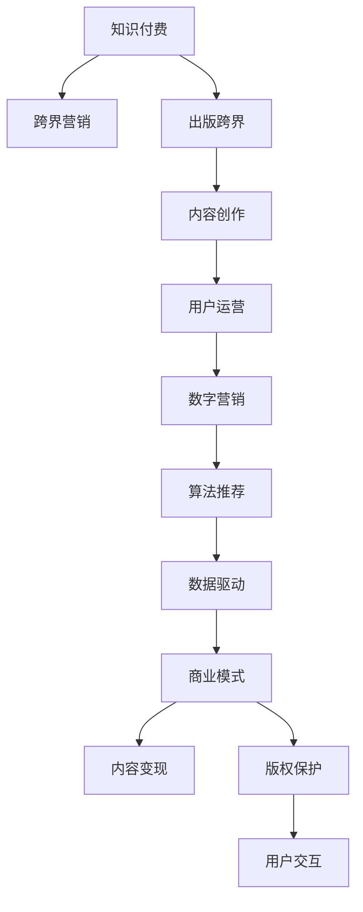

                 

# 知识付费如何实现跨界营销与出版跨界？

> 关键词：知识付费, 跨界营销, 出版跨界, 内容创作, 用户运营, 数字营销, 算法推荐, 数据驱动, 商业模式, 内容变现, 版权保护, 用户交互

## 1. 背景介绍

随着互联网的普及和科技的快速发展，知识付费逐渐成为人们获取知识和信息的主要途径之一。从在线教育到电子书、付费文章，再到知识问答、在线课程，各种形式的知识付费产品层出不穷。同时，知识付费也面临着传统出版行业、广告和广告科技等多个领域的竞争和融合，如何在激烈的市场竞争中实现跨界发展，成为知识付费平台和内容创作者需要关注的重要问题。

## 2. 核心概念与联系

### 2.1 核心概念概述

知识付费的跨界营销与出版跨界，涉及多个关键概念和相关领域，下面进行详细解析：

- **知识付费**：基于知识的获取和使用，用户需要支付一定费用以获取知识或信息。这种付费方式突破了传统的免费获取模式，强调知识的价值和用户对知识的需求。

- **跨界营销**：跨界营销是指将不同领域的资源和手段进行整合，实现资源互补和价值最大化。在知识付费领域，跨界营销可以拓展渠道、增加用户覆盖，提高品牌知名度。

- **出版跨界**：传统的出版行业主要依赖纸质书籍，而知识付费平台的跨界出版则可涵盖电子书、在线课程、音频书籍等多种形式。这种方式不仅可以提升内容的可获取性，也可以探索更多元化的变现模式。

- **内容创作**：内容创作是知识付费的核心，高质量、原创性内容是吸引和保留用户的关键。

- **用户运营**：用户运营涉及到对用户行为和需求的研究，通过数据驱动的方式提升用户满意度和粘性。

- **数字营销**：利用互联网技术和新媒体手段，进行用户获取、品牌推广、客户服务等，提升平台的市场竞争力和用户价值。

- **算法推荐**：通过数据挖掘和机器学习算法，对用户行为进行分析和预测，提供个性化的内容推荐，提升用户体验。

- **数据驱动**：以数据为依据进行业务决策和运营调整，通过大数据分析提升平台的运营效率和竞争力。

- **商业模式**：知识付费平台通过订阅费、广告分成、内容授权等多种方式实现盈利。

- **内容变现**：通过内容付费、广告、商业合作等方式，将内容转化为实际的收益。

- **版权保护**：确保内容创作者的知识产权，防止内容被非法复制和传播，保护创作者的经济利益。

- **用户交互**：通过评论、提问、分享等方式，实现用户与内容的互动，提升用户参与度和平台粘性。

这些概念和领域之间的联系通过以下Mermaid流程图展示：



## 3. 核心算法原理 & 具体操作步骤

### 3.1 算法原理概述

知识付费平台的跨界营销与出版跨界，需要结合多个领域的算法和技术。核心算法原理包括：

- **用户行为分析**：通过分析用户的行为数据，了解用户的需求和偏好，为用户提供个性化的内容和推荐。

- **内容推荐算法**：利用协同过滤、内容基推荐等算法，向用户推荐其可能感兴趣的内容。

- **内容管理系统**：使用文本分类、关键词提取等技术对内容进行分类和标签化，提升内容管理和检索效率。

- **流量获取与转化**：利用SEO优化、内容营销、社交媒体推广等手段，提高平台的流量和用户转化率。

- **用户留存与忠诚度提升**：通过个性化推送、用户反馈收集等方式，提升用户粘性和忠诚度。

### 3.2 算法步骤详解

以下详细介绍知识付费跨界营销与出版跨界的具体操作步骤：

**Step 1: 数据收集与预处理**

- 收集用户行为数据，包括浏览记录、点击次数、支付记录等。
- 收集内容数据，包括文章、课程、电子书等。
- 清洗和预处理数据，去除噪声和无效信息，确保数据的准确性和完整性。

**Step 2: 用户行为分析**

- 使用K-means、DBSCAN等聚类算法，将用户分为不同的用户群体。
- 利用回归分析、时间序列分析等方法，预测用户行为趋势。

**Step 3: 内容推荐算法**

- 构建用户-内容评分矩阵，计算用户对内容的评分。
- 使用协同过滤算法（如ALS），找到与用户兴趣相近的其他用户。
- 利用内容基推荐算法，推荐相似内容。

**Step 4: 内容管理系统**

- 使用TF-IDF、word2vec等文本处理技术，对内容进行分词和特征提取。
- 使用分类算法（如朴素贝叶斯、SVM），对内容进行分类和标签化。

**Step 5: 流量获取与转化**

- 优化搜索引擎优化（SEO）策略，提高平台在搜索引擎中的排名。
- 利用社交媒体推广，提高平台的曝光度和用户访问量。
- 设计精准的广告投放策略，吸引潜在用户访问平台。

**Step 6: 用户留存与忠诚度提升**

- 通过个性化推送和内容推荐，提升用户粘性。
- 建立用户反馈系统，及时收集用户意见和建议，改进平台体验。
- 设计奖励机制，如积分、优惠券等，激励用户积极参与。

### 3.3 算法优缺点

知识付费平台跨界营销与出版跨界的算法优点包括：

- **个性化推荐**：通过算法推荐，提升用户体验和满意度，增加用户粘性。
- **数据驱动决策**：基于数据进行决策，提升运营效率和效果。
- **多渠道流量获取**：利用多种流量获取手段，拓展用户覆盖面。

缺点包括：

- **数据隐私问题**：用户行为数据的收集和分析可能会涉及隐私问题，需要严格遵守相关法律法规。
- **算法复杂度**：复杂的算法需要较高的计算资源和数据质量要求，成本较高。
- **内容同质化**：过度依赖算法推荐，可能导致内容同质化，影响用户体验。

### 3.4 算法应用领域

知识付费平台跨界营销与出版跨界的算法和工具可以广泛应用于多个领域：

- **在线教育**：通过推荐算法，为用户推荐适合其学习阶段的课程，提升学习效果。
- **在线出版**：对图书内容进行分类和标签化，提升内容的检索和发现效率。
- **数字广告**：通过数据分析和算法优化，提高广告投放的精准性和转化率。
- **内容分发**：利用推荐算法，对内容进行有效分发，提高内容访问量。
- **版权管理**：利用区块链和加密技术，保护内容创作者的知识产权。
- **用户行为分析**：通过数据挖掘和机器学习，提升用户行为预测和分析能力。

## 4. 数学模型和公式 & 详细讲解 & 举例说明

### 4.1 数学模型构建

以下构建知识付费平台跨界营销与出版跨界的基本数学模型：

**用户行为预测模型**

假设用户行为数据为 $D=\{(x_i,y_i)\}_{i=1}^N$，其中 $x_i$ 为历史行为数据， $y_i$ 为实际行为（如购买、点击等）。

使用线性回归模型，预测用户行为：

$$
y = \beta_0 + \beta_1 x_1 + \beta_2 x_2 + ... + \beta_n x_n
$$

其中 $\beta$ 为模型参数， $x_i$ 为特征向量， $y$ 为预测结果。

**内容推荐算法**

内容推荐模型为协同过滤模型，利用用户-物品评分矩阵 $P$，计算用户 $u$ 对物品 $i$ 的评分：

$$
\hat{r}_{ui} = \sum_{j=1}^{m}p_{u'j} \cdot \frac{1}{\sqrt{n_{u'} + k} \sqrt{n_j + k}} a_{ij}
$$

其中 $P$ 为用户-物品评分矩阵， $p_{u'j}$ 为第 $u'$ 个用户对第 $j$ 个物品的评分， $a_{ij}$ 为第 $i$ 个物品对第 $j$ 个用户的评分。

### 4.2 公式推导过程

以用户行为预测模型为例，推导其公式过程：

1. **线性回归模型**：

   假设用户行为数据 $D$ 为 $N$ 个样本，每个样本包含 $n$ 个特征 $x_i$，对应的行为结果为 $y$。

   构建线性回归模型：

   $$
   y_i = \beta_0 + \beta_1 x_{i1} + \beta_2 x_{i2} + ... + \beta_n x_{in}
   $$

   通过最小二乘法，求解 $\beta$：

   $$
   \beta = (X^TX)^{-1}X^Ty
   $$

   其中 $X$ 为特征矩阵， $y$ 为行为结果向量。

2. **协同过滤模型**：

   协同过滤算法基于用户和物品的评分矩阵 $P$，计算用户 $u$ 对物品 $i$ 的评分预测：

   $$
   \hat{r}_{ui} = \sum_{j=1}^{m}p_{u'j} \cdot \frac{1}{\sqrt{n_{u'} + k} \sqrt{n_j + k}} a_{ij}
   $$

   其中 $P$ 为用户-物品评分矩阵， $p_{u'j}$ 为第 $u'$ 个用户对第 $j$ 个物品的评分， $a_{ij}$ 为第 $i$ 个物品对第 $j$ 个用户的评分， $k$ 为平滑因子。

### 4.3 案例分析与讲解

以某知识付费平台为例，分析其跨界营销与出版跨界策略：

**用户行为预测模型应用**

- 平台收集用户历史行为数据，包括浏览记录、购买记录等。
- 使用线性回归模型，分析用户行为趋势，预测其可能采取的购买行为。
- 根据预测结果，向用户推荐相关课程或电子书，提高购买转化率。

**内容推荐算法应用**

- 平台收集用户对课程的评分数据，构建用户-课程评分矩阵 $P$。
- 利用协同过滤算法，计算用户对课程的评分预测 $\hat{r}_{ui}$。
- 根据预测评分，对用户推荐相似课程，提升用户满意度。

## 5. 项目实践：代码实例和详细解释说明

### 5.1 开发环境搭建

项目实践需要搭建Python开发环境，具体步骤如下：

1. 安装Python：下载并安装最新版本的Python，如 Python 3.8。

2. 安装虚拟环境：使用虚拟环境工具（如virtualenv）创建项目虚拟环境。

3. 安装相关库：安装Python的科学计算库（如NumPy、Pandas）和机器学习库（如Scikit-Learn）。

4. 安装Web框架：安装Django、Flask等Web框架，用于开发后端系统。

5. 安装前端库：安装React、Vue等前端库，用于开发Web界面。

6. 搭建数据库：安装MySQL、PostgreSQL等数据库，用于存储用户数据和内容数据。

### 5.2 源代码详细实现

以下是使用Python和Django框架实现知识付费平台跨界营销与出版跨界的代码示例：

**用户行为预测模型**

```python
from sklearn.linear_model import LinearRegression

class UserBehaviorPredictor:
    def __init__(self, data):
        self.model = LinearRegression()
        self.data = data

    def train(self):
        X = self.data.drop(['label'], axis=1)
        y = self.data['label']
        self.model.fit(X, y)

    def predict(self, new_data):
        new_X = new_data.drop(['label'], axis=1)
        return self.model.predict(new_X)

# 训练数据集
train_data = pd.read_csv('train_data.csv')

# 创建预测模型
predictor = UserBehaviorPredictor(train_data)
predictor.train()

# 预测新数据
new_data = pd.read_csv('new_data.csv')
predictions = predictor.predict(new_data)
```

**内容推荐算法**

```python
from surprise import SVD

class ContentRecommender:
    def __init__(self, data):
        self.model = SVD()
        self.data = data

    def train(self):
        self.model.fit(self.data)

    def predict(self, user_id, item_id):
        return self.model.predict(user_id, item_id)

# 训练数据集
train_data = pd.read_csv('train_data.csv')

# 创建推荐模型
recommender = ContentRecommender(train_data)
recommender.train()

# 推荐内容
user_id = 123
item_id = 456
recommendations = recommender.predict(user_id, item_id)
```

### 5.3 代码解读与分析

以下对关键代码进行解读与分析：

**用户行为预测模型**

1. 使用 `LinearRegression` 类构建线性回归模型，并训练数据集。
2. 使用训练好的模型，对新数据进行预测。
3. 代码中使用了Pandas库进行数据处理，可以方便地读取和操作CSV格式的数据。

**内容推荐算法**

1. 使用 `SVD` 类构建协同过滤模型，并训练数据集。
2. 使用训练好的模型，对用户和物品进行评分预测。
3. 代码中使用了Surprise库，这是一个基于Python的推荐系统框架，提供了多种推荐算法和数据处理工具。

## 6. 实际应用场景

### 6.1 在线教育平台

在线教育平台可以通过跨界营销和出版跨界策略，提高平台的用户覆盖率和收入。具体应用场景包括：

- **多渠道营销**：在社交媒体、搜索引擎、视频网站等多渠道推广课程和活动，吸引用户注册和使用。
- **内容分发优化**：利用推荐算法，向用户推荐适合的课程和资料，提高学习效果。
- **跨界合作**：与出版社、教育机构合作，推出专属课程和电子书，拓展用户资源。

### 6.2 在线出版平台

在线出版平台可以通过跨界营销和出版跨界策略，增加平台的流量和内容变现渠道。具体应用场景包括：

- **跨界内容合作**：与知名作家和出版社合作，推出联名课程和电子书，提升平台内容质量。
- **内容广告变现**：利用用户的阅读行为数据，定向投放广告，提高平台广告收入。
- **电子书出版**：推出专属电子书，实现内容增值和多样化变现。

### 6.3 数字广告平台

数字广告平台可以通过跨界营销和出版跨界策略，提升平台的用户吸引力和品牌影响力。具体应用场景包括：

- **精准广告投放**：利用用户行为数据，实现精准广告投放，提高广告效果和转化率。
- **跨界品牌合作**：与品牌和产品合作，推出专属广告内容，提升品牌曝光度。
- **内容变现模式**：通过内容订阅、广告分成等模式，实现内容变现和收入多样化。

## 7. 工具和资源推荐

### 7.1 学习资源推荐

1. **《Python数据科学手册》**：介绍了Python在数据科学中的应用，包括NumPy、Pandas、Scikit-Learn等库的使用。
2. **《机器学习实战》**：提供了丰富的实例和案例，帮助读者理解机器学习算法的实际应用。
3. **《Python网络爬虫开发实战》**：讲解了如何使用Python进行网络爬虫开发，获取所需数据。
4. **《Django Web开发实战》**：介绍了Django框架的使用，包括Web开发和数据库管理等技术。
5. **《Python机器学习实战》**：讲解了机器学习在实际项目中的应用，包括数据处理、模型训练和模型评估等。

### 7.2 开发工具推荐

1. **Jupyter Notebook**：一个交互式笔记本环境，用于数据探索和机器学习模型的开发。
2. **Google Colab**：谷歌提供的免费云计算环境，支持Python和Django框架，便于实验和开发。
3. **PyCharm**：一个功能强大的IDE，支持Python和多种数据科学库的使用，提供高效的开发和调试功能。
4. **Github**：一个代码托管平台，用于版本控制和代码共享，便于协作开发和项目管理。

### 7.3 相关论文推荐

1. **《知识付费平台的用户行为分析与预测》**：详细介绍了用户行为分析的方法和模型，提供了实际案例。
2. **《推荐系统协同过滤算法研究》**：探讨了协同过滤算法的原理和应用，包括ALS算法等。
3. **《内容推荐系统的发展与应用》**：综述了推荐系统的历史和发展趋势，提供了前沿技术应用。

## 8. 总结：未来发展趋势与挑战

### 8.1 研究成果总结

本文系统介绍了知识付费平台跨界营销与出版跨界的理论基础和技术方法，通过多个核心算法和案例分析，帮助读者理解实际应用场景和实现步骤。

### 8.2 未来发展趋势

未来知识付费平台跨界营销与出版跨界将呈现以下几个趋势：

1. **数据驱动决策**：利用大数据分析和机器学习算法，提升平台运营和决策的科学性。
2. **个性化推荐**：通过算法推荐，提升用户体验和满意度，增加用户粘性。
3. **多渠道流量获取**：结合多种流量获取手段，提升平台的市场竞争力和用户覆盖面。
4. **跨界合作与创新**：与其他领域合作，推出更多元化、高质量的内容，增加用户价值和平台粘性。

### 8.3 面临的挑战

在知识付费平台跨界营销与出版跨界过程中，还面临以下挑战：

1. **数据隐私问题**：用户行为数据的收集和分析可能会涉及隐私问题，需要严格遵守相关法律法规。
2. **算法复杂度**：复杂的算法需要较高的计算资源和数据质量要求，成本较高。
3. **内容同质化**：过度依赖算法推荐，可能导致内容同质化，影响用户体验。
4. **用户流失**：用户行为变化和市场竞争的加剧，可能导致用户流失和流失率增加。

### 8.4 研究展望

未来在知识付费平台跨界营销与出版跨界领域，需要进行更多的研究和探索：

1. **数据隐私保护**：探索更高效、安全的用户数据处理和分析方法，保护用户隐私和数据安全。
2. **算法优化**：优化推荐算法，提升推荐的精准性和多样性，避免内容同质化。
3. **内容创新**：推出更多元化、高质量的内容，提升用户价值和平台吸引力。
4. **用户体验提升**：优化平台设计和用户界面，提高用户粘性和满意度。

## 9. 附录：常见问题与解答

**Q1：如何进行用户行为预测？**

A: 使用线性回归模型，将用户历史行为数据作为输入，预测用户未来的行为。

**Q2：推荐算法中的协同过滤算法是什么？**

A: 协同过滤算法基于用户和物品的评分矩阵，通过相似用户或相似物品的评分来预测目标用户对物品的评分。

**Q3：如何提高推荐算法的精准性？**

A: 增加用户行为数据量，提高数据质量和多样性。优化推荐模型，调整算法参数。

**Q4：知识付费平台如何实现跨界营销？**

A: 利用社交媒体、搜索引擎、视频网站等多渠道推广课程和活动，吸引用户注册和使用。

**Q5：知识付费平台如何进行出版跨界？**

A: 与出版社、教育机构合作，推出专属课程和电子书，拓展用户资源。

---

作者：禅与计算机程序设计艺术 / Zen and the Art of Computer Programming

