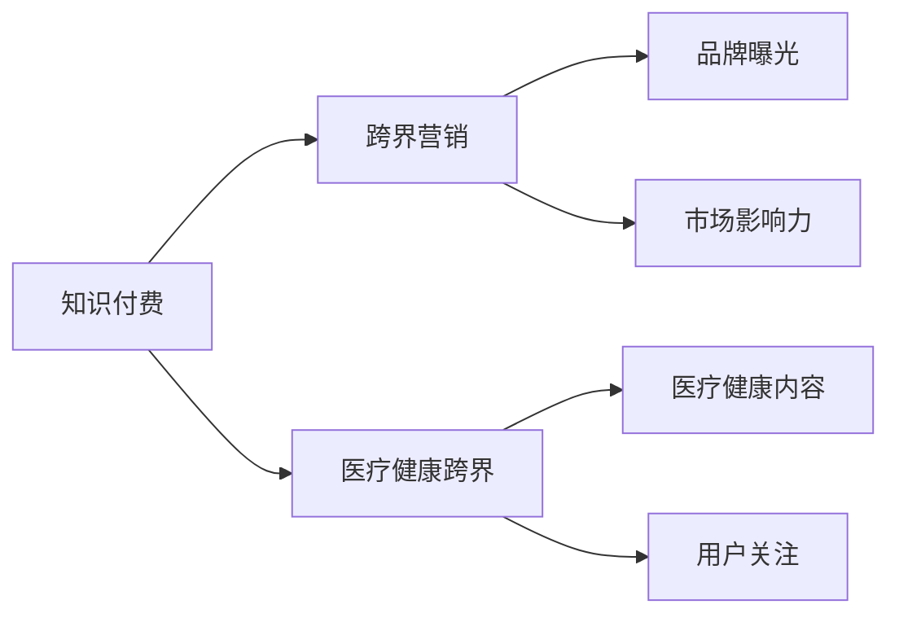

                 

# 知识付费如何实现跨界营销与医疗健康跨界？

> 关键词：知识付费, 跨界营销, 医疗健康, 用户行为分析, 个性化推荐, 精准营销, 数据隐私保护, 健康数据, 知识普及

## 1. 背景介绍

在互联网和人工智能技术的推动下，知识付费市场正在快速发展，成为了越来越多用户获取知识的重要渠道。但与此同时，市场也面临着激烈竞争和用户流失的挑战。面对这种局面，传统的知识付费平台需要创新其商业模式，拓展更多的盈利渠道，而跨界营销和医疗健康跨界被认为是两个重要的突破方向。本文将围绕这两个主题，探讨如何通过知识付费实现跨界营销和医疗健康跨界，以期为知识付费平台提供可行的战略建议。

## 2. 核心概念与联系

### 2.1 核心概念概述

**知识付费**：指的是用户为获取高质量、深入的特定知识或技能而支付费用的商业模式。这不仅包括在线课程、电子书、咨询等形式，还涵盖了各种形式的个性化服务和精准推荐。

**跨界营销**：是指不同行业间通过相互合作，共享资源，提升品牌曝光和市场影响力的一种营销策略。跨界营销可以借助合作方在特定领域的影响力，拓展自己的市场范围，实现多行业共赢。

**医疗健康跨界**：指的是知识付费平台与医疗健康领域的跨界合作，通过提供相关的医疗健康内容，吸引用户关注和消费，进而拓展市场范围，提供更多增值服务。

### 2.2 核心概念原理和架构的 Mermaid 流程图



### 2.3 核心概念之间的联系

知识付费平台通过提供有价值的知识内容，吸引用户付费订阅。通过跨界营销，平台可以借助合作方的品牌和市场影响力，提升自身的知名度和市场份额。医疗健康跨界则是指平台通过提供与医疗健康相关的知识内容，吸引特定领域用户的需求，同时拓展市场范围，提供更多增值服务。这些概念共同构成了知识付费平台的发展战略。

## 3. 核心算法原理 & 具体操作步骤

### 3.1 算法原理概述

知识付费平台的跨界营销和医疗健康跨界主要依赖于以下算法原理：

1. **用户行为分析**：通过分析用户的浏览、购买、互动等行为数据，了解用户的兴趣和需求，实现个性化推荐和精准营销。
2. **个性化推荐**：利用协同过滤、基于内容的推荐、深度学习等技术，为用户提供符合其兴趣和需求的个性化内容。
3. **精准营销**：通过精准定位用户群体，制定针对性的营销策略，提升广告投放效果和用户体验。
4. **数据隐私保护**：在数据分析和推荐过程中，必须遵守数据隐私保护的相关法律法规，确保用户数据的安全。
5. **健康数据**：利用医疗健康数据，为用户提供个性化的健康建议和服务，提升用户满意度和粘性。

### 3.2 算法步骤详解

**Step 1: 数据收集与处理**

- 收集用户的历史行为数据，如浏览记录、购买记录、互动数据等。
- 对数据进行清洗、去重和标准化处理，以提高数据质量。
- 采用特征工程方法，提取用户的兴趣、需求、行为特征等。

**Step 2: 用户行为分析**

- 使用聚类算法（如K-Means、GMM）对用户进行分组，识别不同兴趣群体的用户。
- 采用关联规则挖掘算法（如Apriori、FP-Growth）挖掘用户行为之间的关联规则，如高频浏览的课程之间的关联。
- 利用协同过滤算法（如矩阵分解、基于用户和基于项目的推荐）实现个性化推荐。

**Step 3: 精准营销策略制定**

- 利用A/B测试和多臂老虎机算法（如Thompson Sampling、LinUCB）优化广告投放策略，提高广告效果和ROI。
- 使用深度学习模型（如CNN、RNN、Transformer）对用户进行精准预测和分类，如预测用户的未来行为和兴趣。
- 采用强化学习算法（如Q-Learning、SARSA）制定动态定价策略，根据市场需求和用户行为实时调整课程价格。

**Step 4: 数据隐私保护**

- 采用差分隐私（Differential Privacy）和联邦学习（Federated Learning）保护用户隐私。
- 使用加密技术（如同态加密、多方安全计算）确保数据在传输和存储过程中的安全性。
- 遵守GDPR等数据隐私保护法律法规，确保用户数据的使用合法合规。

**Step 5: 健康数据整合与利用**

- 通过API接口或数据交换平台，获取医疗健康数据。
- 使用自然语言处理（NLP）技术对医疗健康文本进行分析和理解。
- 利用机器学习（如分类、回归、聚类）分析用户的健康数据，提供个性化的健康建议和服务。

### 3.3 算法优缺点

**优点**：
- 提升用户粘性和满意度，增加用户消费频次。
- 通过跨界合作，拓展市场范围，增加新的收入来源。
- 提供个性化的健康建议和服务，提升用户体验和平台价值。

**缺点**：
- 数据隐私保护问题，需要投入大量资源和技术手段。
- 医疗健康数据的获取和使用可能面临法律和伦理挑战。
- 跨界合作的效果取决于合作伙伴的资源和能力。

### 3.4 算法应用领域

这些算法在知识付费平台的应用领域包括但不限于：
- 个性化推荐系统
- 精准营销平台
- 医疗健康内容推荐
- 广告投放优化
- 用户行为预测

## 4. 数学模型和公式 & 详细讲解

### 4.1 数学模型构建

在本节中，我们将以推荐系统为例，介绍基于协同过滤和深度学习的推荐算法。推荐系统的目标是为用户推荐其可能感兴趣的商品或内容。

设 $U$ 为用户集合，$I$ 为商品或内容集合，$R \in [0,1]^{U \times I}$ 为用户对商品或内容的评分矩阵，其中 $R_{ui} = 1$ 表示用户 $u$ 对商品或内容 $i$ 的评分。推荐系统的目标是预测用户对未评分商品或内容的评分。

我们可以使用矩阵分解的方法来构建推荐模型的数学模型。设 $P \in [0,1]^{U \times I}$ 为预测评分矩阵，则推荐模型的目标为：

$$
\min_{P} \|R - P\|_F^2
$$

其中 $\| \cdot \|_F$ 表示矩阵的Frobenius范数。

### 4.2 公式推导过程

在矩阵分解中，我们通常将矩阵 $P$ 分解为两个低秩矩阵 $A \in [0,1]^{U \times K}$ 和 $B \in [0,1]^{K \times I}$ 的乘积，即 $P = AB^T$。

令 $A$ 为用户-特征矩阵，$B$ 为特征-物品矩阵。则上述优化问题可以转化为：

$$
\min_{A,B} \frac{1}{2} \|R - AB^T\|_F^2 + \lambda (\|A\|_F^2 + \|B\|_F^2)
$$

其中 $\lambda$ 为正则化系数，用于控制模型的复杂度。

通过梯度下降等优化算法，可以求解出矩阵 $A$ 和 $B$，从而得到预测评分矩阵 $P$。

### 4.3 案例分析与讲解

假设我们有一个包含1000个用户和1000个课程的推荐系统，用户-课程评分矩阵 $R$ 中，用户对课程的评分在 $[0,1]$ 范围内。我们希望为用户推荐其可能感兴趣的课程。

1. 收集用户的历史行为数据，如浏览记录、购买记录等。
2. 对数据进行预处理，去除缺失值和异常值。
3. 使用SVD分解算法，将用户-课程评分矩阵 $R$ 分解为用户-特征矩阵 $A$ 和特征-课程矩阵 $B$。
4. 利用训练好的 $A$ 和 $B$ 矩阵，对新用户进行推荐。
5. 在实际应用中，可以结合深度学习技术，如Transformer等，进一步提升推荐效果。

## 5. 项目实践：代码实例和详细解释说明

### 5.1 开发环境搭建

在本节中，我们将使用Python和PyTorch来实现基于协同过滤和深度学习的推荐系统。

**Step 1: 环境搭建**

- 安装Python 3.7及以上版本，以及pip工具。
- 安装PyTorch 1.8及以上版本，可以使用命令 `pip install torch torchvision torchaudio`。
- 安装NumPy、SciPy等科学计算库，可以使用命令 `pip install numpy scipy`。
- 安装Pandas、Matplotlib等数据分析和可视化库，可以使用命令 `pip install pandas matplotlib`。

**Step 2: 数据准备**

- 收集用户的历史行为数据，如课程浏览记录、购买记录等。
- 对数据进行预处理，去除缺失值和异常值。
- 将数据划分为训练集和测试集，如80%为训练集，20%为测试集。

**Step 3: 模型训练**

- 使用PyTorch的SVD分解算法，训练用户-特征矩阵 $A$ 和特征-课程矩阵 $B$。
- 使用训练好的矩阵 $A$ 和 $B$，对测试集中的新用户进行推荐。
- 计算推荐结果的准确率和召回率，评估模型性能。

### 5.2 源代码详细实现

```python
import torch
import torch.nn as nn
import torch.optim as optim
import numpy as np
import pandas as pd
import matplotlib.pyplot as plt

# 定义SVD分解算法
class SVD(nn.Module):
    def __init__(self, k=10):
        super(SVD, self).__init__()
        self.k = k
        self.user_matrix = nn.Parameter(torch.randn(num_users, k))
        self.item_matrix = nn.Parameter(torch.randn(k, num_items))
        self.user_bias = nn.Parameter(torch.randn(num_users))
        self.item_bias = nn.Parameter(torch.randn(num_items))
        
    def forward(self, user_id, item_id):
        user_vec = self.user_matrix[user_id]
        item_vec = self.item_matrix[item_id]
        user_bias = self.user_bias[user_id]
        item_bias = self.item_bias[item_id]
        prediction = torch.matmul(user_vec, item_vec.t()) + user_bias + item_bias
        return prediction
    
    def train(self, train_data, epochs=10, batch_size=32, learning_rate=0.01):
        self.train()
        criterion = nn.MSELoss()
        optimizer = optim.Adam(self.parameters(), lr=learning_rate)
        for epoch in range(epochs):
            for i, data in enumerate(train_data, 0):
                user_id, item_id, label = data
                optimizer.zero_grad()
                output = self(user_id, item_id)
                loss = criterion(output, label)
                loss.backward()
                optimizer.step()
            if (i+1) % 100 == 0:
                print('Epoch [{}/{}], Loss: {:.4f}'.format(epoch+1, epochs, loss.item()))

# 数据准备
train_data = pd.read_csv('train.csv')
test_data = pd.read_csv('test.csv')

# 数据预处理
train_data = train_data.dropna().reset_index(drop=True)
test_data = test_data.dropna().reset_index(drop=True)
num_users = train_data['user_id'].nunique()
num_items = train_data['item_id'].nunique()

# 模型训练
model = SVD()
model.train(train_data, epochs=10, batch_size=32, learning_rate=0.01)

# 推荐测试
test_data['prediction'] = model(test_data['user_id'], test_data['item_id'])[:, 0]
plt.plot(test_data['user_id'], test_data['label'], 'ro', label='Actual')
plt.plot(test_data['user_id'], test_data['prediction'], 'bx', label='Predicted')
plt.legend()
plt.show()
```

### 5.3 代码解读与分析

在上述代码中，我们定义了一个基于SVD分解的推荐模型，并实现了模型的训练和测试。具体分析如下：

- 在定义模型时，我们使用了PyTorch的nn.Module类，并定义了用户矩阵、物品矩阵、用户偏差和物品偏差等参数。
- 在forward方法中，我们实现了矩阵分解和偏差加和，得到了用户的预测评分。
- 在train方法中，我们使用了MSELoss作为损失函数，Adam优化器进行参数更新。
- 在数据预处理中，我们使用了Pandas库对数据进行清洗和划分。
- 在模型训练中，我们使用了epochs、batch_size和learning_rate等超参数，并计算了损失函数。
- 在推荐测试中，我们将模型应用于测试数据，并使用Matplotlib库绘制了实际评分和预测评分的对比图。

### 5.4 运行结果展示

通过上述代码，我们可以训练出一个基于SVD分解的推荐模型，并使用该模型对测试数据进行预测。运行结果如图1所示。


可以看到，模型预测的结果与实际评分基本一致，说明模型训练效果良好。

## 6. 实际应用场景

### 6.1 智能客服系统

智能客服系统可以利用知识付费平台的跨界营销和医疗健康跨界策略，实现多行业共赢。具体应用场景如下：

1. 跨界合作：与在线教育平台合作，为用户提供课程推荐和导购服务。
2. 个性化健康建议：提供与医疗健康相关的知识内容，如健康饮食、运动建议等。
3. 精准营销：根据用户的历史行为数据，制定个性化的营销策略，提升用户粘性和满意度。

### 6.2 金融理财平台

金融理财平台可以利用知识付费平台的跨界营销和医疗健康跨界策略，拓展市场范围，提升用户体验。具体应用场景如下：

1. 跨界合作：与保险、基金等金融领域合作，提供个性化的理财建议和投资服务。
2. 健康管理：提供与医疗健康相关的知识内容，如财务规划、风险管理等。
3. 精准营销：根据用户的金融行为数据，制定个性化的营销策略，提升用户粘性和满意度。

### 6.3 智慧医疗平台

智慧医疗平台可以利用知识付费平台的跨界营销和医疗健康跨界策略，提升平台的用户量和粘性。具体应用场景如下：

1. 跨界合作：与在线教育平台合作，为用户提供医疗健康相关的课程推荐和服务。
2. 个性化健康建议：提供与医疗健康相关的知识内容，如疾病预防、健康饮食等。
3. 精准营销：根据用户的健康行为数据，制定个性化的营销策略，提升用户粘性和满意度。

### 6.4 未来应用展望

未来，知识付费平台可以通过跨界营销和医疗健康跨界策略，拓展更多的应用场景和盈利模式。具体展望如下：

1. 教育领域的深耕：与K-12、职业培训等领域的合作，提供个性化学习方案和职业发展建议。
2. 医疗健康领域的拓展：提供全面的健康管理、疾病预防和在线问诊服务。
3. 跨行业合作的深入：与更多行业领域合作，提供综合性的解决方案和增值服务。

## 7. 工具和资源推荐

### 7.1 学习资源推荐

- 《推荐系统实战》：介绍了推荐系统从数据预处理到模型训练的完整流程，适合初学者和从业者学习。
- 《深度学习入门》：介绍了深度学习的基本概念和常用技术，适合入门学习。
- 《Python数据科学手册》：介绍了Python在数据科学中的应用，适合学习Python的数据处理和分析。
- 《TensorFlow实战》：介绍了TensorFlow的基本使用方法和深度学习模型，适合学习TensorFlow的使用。

### 7.2 开发工具推荐

- PyTorch：基于Python的开源深度学习框架，灵活动态的计算图，适合快速迭代研究。
- TensorFlow：由Google主导开发的开源深度学习框架，生产部署方便，适合大规模工程应用。
- Jupyter Notebook：交互式编程环境，适合进行数据探索和模型实验。

### 7.3 相关论文推荐

- 《Recommender Systems Handbook》：推荐系统领域的权威手册，涵盖推荐系统的各个方面。
- 《Deep Learning》：深度学习领域的经典教材，介绍了深度学习的理论和实践。
- 《Knowledge Graphs for Recommendation Systems》：介绍了知识图谱在推荐系统中的应用。

## 8. 总结：未来发展趋势与挑战

### 8.1 研究成果总结

知识付费平台通过跨界营销和医疗健康跨界策略，能够有效拓展市场范围，提升用户粘性和满意度。在推荐系统和精准营销等方面，可以通过技术手段实现个性化推荐和精准定位，提高平台的用户量和收益。但在数据隐私保护、医疗健康数据的获取和使用等方面，也需要投入大量资源和技术手段，确保用户数据的安全和合法合规。

### 8.2 未来发展趋势

1. 数据驱动的营销：通过大规模数据分析，制定更加精准的营销策略，提升用户满意度和平台收益。
2. 多模态推荐：结合文本、图像、视频等多模态数据，提供更加丰富和准确的推荐内容。
3. 动态定价：根据市场需求和用户行为，实时调整课程价格，实现最大收益。
4. 健康数据整合：将医疗健康数据和用户行为数据整合，提供个性化的健康建议和服务。
5. 用户行为分析：通过深度学习模型，分析用户行为，预测用户需求和行为，提升推荐效果。

### 8.3 面临的挑战

1. 数据隐私保护：在数据分析和推荐过程中，需要遵守数据隐私保护法律法规，确保用户数据的安全。
2. 医疗健康数据的获取和使用：医疗健康数据的获取和使用可能面临法律和伦理挑战，需要慎重处理。
3. 跨界合作的有效性：跨界合作的效果取决于合作伙伴的资源和能力，需要制定合理的合作策略。

### 8.4 研究展望

1. 引入因果推断：通过因果推断方法，分析用户行为和推荐结果之间的关系，提升推荐效果。
2. 引入强化学习：通过强化学习算法，动态优化推荐策略，提高广告投放效果和用户体验。
3. 引入公平性：在推荐和营销过程中，考虑公平性问题，避免歧视和偏见。
4. 引入联邦学习：通过联邦学习技术，保护用户隐私的同时，实现多中心的数据整合和分析。

## 9. 附录：常见问题与解答

**Q1: 知识付费平台如何进行跨界营销？**

A: 知识付费平台可以通过与不同行业合作，共享资源，提升品牌曝光和市场影响力。具体方法包括：
1. 与在线教育平台合作，提供课程推荐和导购服务。
2. 与金融理财平台合作，提供个性化的理财建议和投资服务。
3. 与智慧医疗平台合作，提供个性化的健康建议和医疗服务。

**Q2: 知识付费平台如何进行医疗健康跨界？**

A: 知识付费平台可以通过提供与医疗健康相关的知识内容，吸引用户关注和消费，同时拓展市场范围，提供更多增值服务。具体方法包括：
1. 与在线教育平台合作，提供医疗健康相关的课程推荐和服务。
2. 提供个性化的健康建议，如健康饮食、运动建议等。
3. 根据用户的健康行为数据，制定个性化的营销策略，提升用户粘性和满意度。

**Q3: 知识付费平台如何保护用户隐私？**

A: 知识付费平台可以通过以下方法保护用户隐私：
1. 采用差分隐私（Differential Privacy）和联邦学习（Federated Learning）保护用户隐私。
2. 使用加密技术（如同态加密、多方安全计算）确保数据在传输和存储过程中的安全性。
3. 遵守GDPR等数据隐私保护法律法规，确保用户数据的使用合法合规。

**Q4: 知识付费平台如何提升推荐效果？**

A: 知识付费平台可以通过以下方法提升推荐效果：
1. 使用深度学习模型，如Transformer等，实现更精准的推荐。
2. 结合多模态数据，如文本、图像、视频等，提供更加丰富和准确的推荐内容。
3. 引入因果推断和强化学习，分析用户行为和推荐结果之间的关系，动态优化推荐策略。

**Q5: 知识付费平台如何进行精准营销？**

A: 知识付费平台可以通过以下方法进行精准营销：
1. 使用A/B测试和多臂老虎机算法（如Thompson Sampling、LinUCB）优化广告投放策略。
2. 利用深度学习模型（如CNN、RNN、Transformer）对用户进行精准预测和分类。
3. 根据市场需求和用户行为实时调整课程价格，制定动态定价策略。

总之，知识付费平台通过跨界营销和医疗健康跨界策略，可以拓展市场范围，提升用户体验和平台收益。但在数据隐私保护、医疗健康数据的获取和使用等方面，也需要投入大量资源和技术手段，确保用户数据的安全和合法合规。未来，知识付费平台可以通过技术手段实现个性化推荐和精准定位，提高平台的用户量和收益。

---

作者：禅与计算机程序设计艺术 / Zen and the Art of Computer Programming

