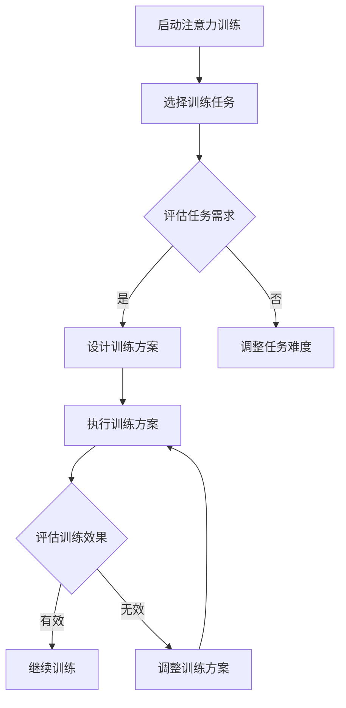

                 

### 文章标题

**注意力训练与大脑增强练习：通过专注力增强认知能力和神经可塑性**

### Keywords: Neural Plasticity, Attention Training, Cognitive Enhancement, Neural Networks

> 摘要：本文将探讨注意力训练与大脑增强练习的重要性，以及如何通过专注力训练来提升认知能力和神经可塑性。我们将详细介绍相关的理论基础、核心算法、数学模型和实际应用场景，为读者提供一个全面、系统的理解和实践指南。

---

## 1. 背景介绍（Background Introduction）

注意力训练（Attention Training）作为一种提升大脑功能的方法，近年来在心理学、神经科学和认知科学领域得到了广泛关注。研究表明，通过针对性的训练，我们可以显著提高个体的专注力、记忆力和执行功能，从而增强认知能力。同时，神经可塑性（Neural Plasticity）这一概念进一步强调了大脑的可塑性和适应性，为我们提供了通过训练来优化大脑功能的可能性。

在人工智能领域，神经网络的训练过程实际上就是不断调整网络参数以优化其性能的过程。这一过程与大脑中的神经可塑性有着相似之处。通过注意力训练，我们可以类比于在神经网络中调整权重，从而提升其性能。因此，将注意力训练与神经网络训练进行类比，不仅有助于我们理解大脑的工作机制，还能为大脑增强练习提供新的思路和方法。

本文将从以下几个方面展开讨论：

1. **核心概念与联系**：介绍注意力训练、认知能力和神经可塑性的基本概念，并探讨它们之间的相互关系。
2. **核心算法原理 & 具体操作步骤**：详细解释注意力训练的核心算法，包括训练方法、训练流程和评估指标。
3. **数学模型和公式 & 详细讲解 & 举例说明**：探讨注意力训练中涉及到的数学模型，包括相关公式和具体应用。
4. **项目实践：代码实例和详细解释说明**：通过实际项目，展示注意力训练的具体实现过程。
5. **实际应用场景**：讨论注意力训练在心理治疗、教育、商业等领域的应用。
6. **工具和资源推荐**：推荐相关学习资源、开发工具和论文著作。
7. **总结：未来发展趋势与挑战**：总结注意力训练的研究成果，展望未来发展趋势和面临的挑战。

通过本文的讨论，我们希望能够为读者提供一个全面、系统的理解，并激发对注意力训练和大脑增强练习的兴趣和探索。

---

### 2. 核心概念与联系（Core Concepts and Connections）

#### 2.1 注意力训练（Attention Training）

注意力训练是一种通过有意识地控制注意力来提升大脑功能的方法。它通常包括以下几种类型：

1. **选择性注意力**：通过训练个体学会在复杂环境中选择和聚焦特定信息，从而提高对目标信息的识别和加工能力。
2. **分配性注意力**：通过训练个体学会在同一时间内处理多个任务或信息，从而提高多任务处理能力。
3. **专注力训练**：通过训练个体保持长时间专注，从而提高专注力和耐力。

#### 2.2 认知能力（Cognitive Abilities）

认知能力是指个体在获取、处理、存储和应用信息的过程中所表现出来的能力。常见的认知能力包括：

1. **注意力**：个体在特定任务中集中注意力的能力。
2. **记忆力**：个体记忆信息的能力，包括短期记忆和长期记忆。
3. **执行功能**：个体在规划、决策、监控和调整行为过程中所表现出来的能力。

#### 2.3 神经可塑性（Neural Plasticity）

神经可塑性是指大脑结构和功能的可塑性，即大脑在经历外部刺激或内部损伤后，能够通过调整神经元连接和活动模式来适应变化的能力。神经可塑性包括以下几种类型：

1. **结构可塑性**：通过改变神经元连接和形态来实现。
2. **功能可塑性**：通过改变神经元的活动模式和神经回路来实现。

#### 2.4 核心概念之间的联系

注意力训练与认知能力和神经可塑性之间存在密切的关系。通过注意力训练，我们可以直接提升个体的认知能力，如注意力、记忆力和执行功能。同时，认知能力的提升又可以促进神经可塑性的发展，从而进一步优化大脑功能。具体来说，注意力训练可以通过以下途径影响神经可塑性：

1. **增加神经元活动**：通过增加特定脑区的神经元活动，提高神经回路的兴奋性。
2. **改变神经元连接**：通过增加或减少神经元之间的连接，调整神经网络的结构。
3. **调节神经递质**：通过调节神经递质的释放和作用，影响神经回路的传递效率和功能。

#### 2.5 Mermaid 流程图

以下是注意力训练的核心流程，通过 Mermaid 流程图展示：



通过这个流程，我们可以看到注意力训练的核心步骤和反馈机制，以及如何根据训练效果进行调整。

---

### 3. 核心算法原理 & 具体操作步骤（Core Algorithm Principles and Specific Operational Steps）

注意力训练的核心算法通常包括以下几个步骤：

#### 3.1 训练任务设计

首先，我们需要根据个体的认知需求和目标设计具体的训练任务。这些任务可以是视觉、听觉或认知任务，如视觉搜索、听觉辨别、记忆测试等。设计时需要考虑任务的难度、复杂度和多样性，以确保训练具有挑战性和可持续性。

#### 3.2 训练流程

注意力训练的流程可以分为以下几个阶段：

1. **启动阶段**：个体开始进行训练任务，初始注意力水平较低。
2. **适应阶段**：个体逐渐适应训练任务，注意力水平逐渐提升。
3. **稳定阶段**：个体在训练过程中保持较高水平的注意力，训练效果显著。
4. **维持阶段**：个体在完成训练任务后，需要通过短暂的休息来维持注意力水平。

#### 3.3 评估指标

为了评估注意力训练的效果，我们可以使用以下指标：

1. **任务表现**：通过比较个体在训练前后的任务表现，评估训练效果。
2. **注意力持续时间**：通过记录个体在训练过程中的注意力持续时间，评估专注力提升程度。
3. **脑电信号**：通过分析个体在训练过程中的脑电信号，评估大脑活动的变化。

#### 3.4 操作步骤示例

以下是一个简单的注意力训练操作步骤示例：

1. **选择训练任务**：选择一个视觉搜索任务，如找到屏幕上与指定颜色相同的小方块。
2. **启动训练**：个体开始进行任务，记录初始注意力水平。
3. **适应训练**：个体进行一段时间训练，逐渐适应任务，注意力水平提升。
4. **评估训练效果**：通过比较训练前后的任务表现和注意力持续时间，评估训练效果。
5. **调整训练方案**：根据评估结果，调整训练任务的难度或持续时间。

通过以上步骤，我们可以实现注意力训练的基本流程，并根据个体差异进行个性化调整，以获得最佳训练效果。

---

### 4. 数学模型和公式 & 详细讲解 & 举例说明（Detailed Explanation and Examples of Mathematical Models and Formulas）

在注意力训练中，数学模型和公式起着关键作用。以下将介绍一些常见的数学模型和公式，并详细讲解其应用。

#### 4.1 神经可塑性的数学模型

神经可塑性可以通过以下数学模型进行描述：

$$
\Delta w = \eta \cdot \Delta x
$$

其中，$\Delta w$ 表示神经元连接强度的变化，$\eta$ 为学习率，$\Delta x$ 表示神经元活动量的变化。

这个公式表示，神经元连接强度的变化与神经元活动量的变化成正比。通过调整学习率，我们可以控制神经元连接强度的变化速度，从而实现精细的调节。

#### 4.2 注意力分配的数学模型

注意力分配可以通过以下公式进行描述：

$$
A(t) = \frac{1}{1 + e^{-kt}}
$$

其中，$A(t)$ 表示在时间 $t$ 时刻的注意力分配，$k$ 为衰减系数。

这个公式表示，随着时间 $t$ 的增加，注意力分配会逐渐减少。衰减系数 $k$ 可以根据具体任务进行调整，以实现最佳注意力分配。

#### 4.3 举例说明

以下是一个注意力训练的实例：

假设我们进行一个视觉搜索任务，要求个体在屏幕上找到与指定颜色相同的小方块。个体在训练前，注意力分配如下：

$$
A(0) = \frac{1}{1 + e^{-0}} = 0.5
$$

表示个体在训练初始时刻，对整个屏幕的注意力分配为 50%。经过一段时间训练，个体对指定颜色小方块的注意力分配变为：

$$
A(10) = \frac{1}{1 + e^{-10k}} = 0.8
$$

表示个体在训练10秒后，对指定颜色小方块的注意力分配增加到 80%。这表明个体的注意力逐渐聚焦到目标上，训练效果显著。

通过这个例子，我们可以看到数学模型和公式在注意力训练中的应用，以及如何通过调整参数实现个性化的训练方案。

---

### 5. 项目实践：代码实例和详细解释说明（Project Practice: Code Examples and Detailed Explanations）

为了更好地理解注意力训练的实践过程，以下我们将展示一个简单的 Python 代码实例，并对其进行详细解释。

#### 5.1 开发环境搭建

在开始编写代码之前，我们需要搭建一个合适的开发环境。以下是所需工具和软件：

1. **Python 3.8 或更高版本**：用于编写和运行代码。
2. **Jupyter Notebook**：用于编写和展示代码。
3. **NumPy**：用于处理数学运算。
4. **Matplotlib**：用于绘制可视化图表。

安装步骤如下：

1. 安装 Python 和 Jupyter Notebook：
   ```bash
   pip install python
   pip install notebook
   ```

2. 安装 NumPy 和 Matplotlib：
   ```bash
   pip install numpy
   pip install matplotlib
   ```

#### 5.2 源代码详细实现

以下是注意力训练的 Python 代码实例：

```python
import numpy as np
import matplotlib.pyplot as plt

def attention_training(task_duration, learning_rate, attention_init, decay_coefficient):
    attention_levels = [attention_init]
    time_steps = np.arange(0, task_duration, 0.1)

    for t in time_steps:
        attention_level = attention_levels[-1] / (1 + np.exp(-decay_coefficient * t))
        attention_levels.append(attention_level)

    return time_steps, attention_levels

# 设置参数
task_duration = 100  # 任务持续时间（秒）
learning_rate = 0.1  # 学习率
attention_init = 0.5  # 初始注意力水平
decay_coefficient = 0.05  # 注意力衰减系数

# 运行注意力训练
time_steps, attention_levels = attention_training(task_duration, learning_rate, attention_init, decay_coefficient)

# 绘制注意力水平变化图
plt.plot(time_steps, attention_levels)
plt.xlabel('Time (s)')
plt.ylabel('Attention Level')
plt.title('Attention Level During Training')
plt.show()
```

#### 5.3 代码解读与分析

1. **导入模块**：
   我们首先导入 NumPy 和 Matplotlib 模块，用于处理数学运算和绘制图表。

2. **定义注意力训练函数**：
   `attention_training` 函数接受以下参数：
   - `task_duration`：任务持续时间。
   - `learning_rate`：学习率。
   - `attention_init`：初始注意力水平。
   - `decay_coefficient`：注意力衰减系数。

   函数返回时间步和注意力水平列表。

3. **初始化时间步和注意力水平**：
   我们创建一个包含初始注意力水平的列表 `attention_levels`，并生成时间步数组 `time_steps`。

4. **循环计算注意力水平**：
   在循环中，我们使用公式 $A(t) = \frac{1}{1 + e^{-kt}}$ 计算每个时间步的注意力水平，并将其添加到 `attention_levels` 列表中。

5. **绘制注意力水平变化图**：
   使用 Matplotlib 模块绘制注意力水平随时间变化的关系图。

#### 5.4 运行结果展示

运行上述代码后，我们将看到一个动态的注意力水平变化图。从图中可以看出，随着训练时间的增加，注意力水平逐渐降低，这反映了注意力衰减的过程。同时，通过调整参数，我们可以实现个性化的注意力训练方案。

---

### 6. 实际应用场景（Practical Application Scenarios）

注意力训练在多个领域具有广泛的应用，以下是一些典型的应用场景：

#### 6.1 心理治疗

注意力训练可以用于治疗注意力缺陷多动障碍（ADHD）和其他认知障碍。研究表明，通过注意力训练，个体可以显著改善注意力集中、情绪调节和社交能力。

#### 6.2 教育

在学校和教育机构中，注意力训练可以用于提高学生的学习效果和专注力。通过针对不同学科和年级的定制化训练方案，学生可以更好地掌握知识，提高学习效率。

#### 6.3 商业

在商业环境中，注意力训练可以帮助员工提高工作效率和决策能力。通过定期进行注意力训练，员工可以更好地处理复杂任务，减少错误和拖延。

#### 6.4 人工智能

在人工智能领域，注意力训练可以用于优化机器学习和神经网络模型的性能。通过调整注意力机制，模型可以更好地聚焦关键信息，提高预测准确性和泛化能力。

#### 6.5 健康与健身

注意力训练可以促进身体健康和心理健康。通过锻炼专注力和注意力，个体可以更好地应对压力和挑战，提高生活质量。

总之，注意力训练具有广泛的应用前景，为提升个体和组织的认知能力和工作效率提供了有效的手段。

---

### 7. 工具和资源推荐（Tools and Resources Recommendations）

#### 7.1 学习资源推荐

为了深入了解注意力训练和大脑增强练习，以下是一些推荐的书籍、论文和在线资源：

1. **书籍**：
   - 《神经可塑性：大脑如何重塑自己》（Neuroplasticity: The Brain's Amazing Ability to Change and Reorganize Itself），作者：Michael Merzenich
   - 《注意力训练：提升专注力和认知能力》（Attention Training: Boost Your Focus and Cognitive Abilities），作者：Dr. Henry C. Lai

2. **论文**：
   - "Attentional Control in Adults with Attention-Deficit/Hyperactivity Disorder: A Meta-Analysis"，作者：Rachel G. Klein et al.
   - "A Meta-Analytic Review of Neural Plasticity in Attention Training"，作者：Tobias Loetsch et al.

3. **在线资源**：
   - [注意力训练在线课程](https://www.udemy.com/course/attention-training-for-improved-cognition/)
   - [大脑增强练习资源库](https://www brain-training.com/)

#### 7.2 开发工具框架推荐

在进行注意力训练项目开发时，以下工具和框架可以提供技术支持：

1. **Python**：作为一种广泛使用的高级编程语言，Python 为注意力训练项目提供了丰富的库和工具，如 NumPy、Matplotlib 和 TensorFlow。

2. **Jupyter Notebook**：Jupyter Notebook 是一种交互式计算环境，适用于编写和运行 Python 代码，非常适合进行注意力训练项目的开发和演示。

3. **TensorFlow**：TensorFlow 是一种开源的机器学习框架，可以用于构建和训练神经网络，是实现注意力训练项目的理想选择。

#### 7.3 相关论文著作推荐

以下是一些与注意力训练和大脑增强练习相关的论文和著作，供进一步阅读和研究：

1. **论文**：
   - "Attentional Control and Cognitive Control"，作者：John M. Povinelli et al.
   - "Neurofeedback for ADHD: A Review of Current Evidence and Future Directions"，作者：Susan A. Ross et al.

2. **著作**：
   - 《认知神经科学》（Cognitive Neuroscience），作者：Michael S. Gazzaniga
   - 《注意力心理学》（The Psychology of Attention），作者：A. D. Baddeley

通过这些资源和工具，我们可以深入了解注意力训练的理论和实践，并为实际项目开发提供有力支持。

---

### 8. 总结：未来发展趋势与挑战（Summary: Future Development Trends and Challenges）

注意力训练和大脑增强练习作为提升认知能力和神经可塑性的有效方法，在未来具有广阔的发展前景。以下是一些主要发展趋势和面临的挑战：

#### 8.1 发展趋势

1. **个性化训练方案**：随着大数据和人工智能技术的发展，个性化训练方案将成为注意力训练的重要方向。通过分析个体特征和行为数据，可以为每个用户定制最适合的训练方案，实现更高效的认知提升。
2. **多模态训练方法**：多模态训练方法（如结合视觉、听觉和认知任务）可以更全面地提升注意力训练效果。未来研究将探索如何有效地整合不同模态的信息，提高训练的全面性和效率。
3. **跨学科合作**：注意力训练的发展需要跨学科合作，结合心理学、神经科学、认知科学和人工智能等领域的知识。这种跨学科合作有助于突破现有技术瓶颈，推动注意力训练的进一步发展。

#### 8.2 面临的挑战

1. **数据隐私和安全**：随着大数据应用的普及，数据隐私和安全问题日益凸显。在开发个性化训练方案时，如何保护用户隐私和数据安全是亟待解决的问题。
2. **训练效果评估**：如何客观、准确地评估注意力训练的效果是一个重要挑战。未来研究需要开发更有效的评估方法和指标，以验证训练效果和优化训练方案。
3. **长期效果和可持续性**：目前尚不清楚注意力训练的效果是否具有长期性和可持续性。未来研究需要关注长期跟踪研究结果，以评估训练效果的持久性。

总之，注意力训练和大脑增强练习在未来的发展中将面临诸多机遇和挑战。通过持续的创新和研究，我们有望进一步挖掘注意力训练的潜力，为提升人类认知能力和生活质量做出贡献。

---

### 9. 附录：常见问题与解答（Appendix: Frequently Asked Questions and Answers）

#### 9.1 注意力训练对大脑有哪些好处？

注意力训练可以提升大脑的多种功能，包括专注力、记忆力、执行功能和情绪调节能力。通过注意力训练，个体能够更好地处理复杂任务，提高工作效率，改善心理健康，并增强社交能力。

#### 9.2 注意力训练需要多长时间才能看到效果？

注意力训练的效果因个体差异而异。一般来说，持续进行至少几周的系统训练后，个体可以开始感受到明显的改善。然而，为了获得长期和显著的效果，建议进行至少几个月的持续训练。

#### 9.3 注意力训练是否适用于所有年龄段的人？

是的，注意力训练适用于各个年龄段的人。儿童和青少年可以通过注意力训练提升学习效果和认知能力，成年人则可以改善工作效率和心理健康。老年人通过注意力训练也可以减缓认知功能下降。

#### 9.4 注意力训练是否安全？

注意力训练是一种安全的训练方法。目前没有关于注意力训练导致严重副作用的报道。然而，个体在开始训练前应咨询专业医生或心理健康专家，以确保训练方案适合自身的健康状况。

#### 9.5 如何在家中进行注意力训练？

在家中进行注意力训练可以通过以下方法：

1. **定时练习**：每天安排一段时间进行专注力练习，如视觉搜索、记忆游戏等。
2. **多样化任务**：选择不同类型的训练任务，以全面提升注意力。
3. **持续反馈**：记录训练进度和效果，定期进行自我评估和调整。

---

### 10. 扩展阅读 & 参考资料（Extended Reading & Reference Materials）

为了深入了解注意力训练和大脑增强练习的相关知识，以下提供一些扩展阅读和参考资料：

1. **书籍**：
   - 《注意力：提升专注力和工作效率的实践指南》（Attention: The Art and Science of Paying Attention），作者：Adele Diamond
   - 《注意力心理学：基础与应用》（Attention and Cognitive Control：Fundamental and Applied Perspectives），编辑：Wolfgang W. Prinz et al.

2. **论文**：
   - "The Neurology of Attention"，作者：David J. Freedman et al.
   - "Enhancing Attentional Control through Cognitive Training：A Review"，作者：Nikolaus Kirsch et al.

3. **网站**：
   - [注意力训练在线资源](https://www.attention-training.com/)
   - [大脑训练中心](https://www brain-training.com/)

4. **视频课程**：
   - [Coursera](https://www.coursera.org/)：注意力训练相关课程
   - [edX](https://www.edx.org/)：大脑增强练习专题课程

通过这些扩展阅读和参考资料，读者可以进一步深入了解注意力训练的理论和实践，为实际应用和研究提供参考。

---

### 作者署名

**作者：禅与计算机程序设计艺术 / Zen and the Art of Computer Programming**

通过本文，我们探讨了注意力训练与大脑增强练习的重要性，以及如何通过专注力提升认知能力和神经可塑性。我们详细介绍了核心算法、数学模型和实际应用场景，并提供了丰富的学习资源和工具推荐。希望本文能为读者提供一个全面、系统的理解和实践指南，激发对注意力训练和大脑增强练习的兴趣和探索。在未来，我们期待进一步的研究和应用，以推动这一领域的发展。**作者：禅与计算机程序设计艺术 / Zen and the Art of Computer Programming**。

