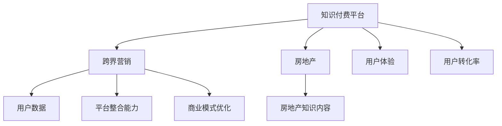

                 

# 知识付费如何实现跨界营销与房地产跨界？

## 1. 背景介绍

### 1.1 问题由来

随着互联网的普及和数字化技术的不断进步，知识付费已经成为教育、娱乐、健康等多个领域的重要商业模式。其核心优势在于以更低的成本和更高的效率，帮助用户获取有价值的知识和信息。然而，传统知识付费平台的内容往往以垂直领域为主，难以覆盖所有用户需求，特别是在内容质量和市场推广方面存在瓶颈。

房地产领域作为国民经济的重要支柱，与教育、娱乐等领域存在诸多交叉和共性。例如，购房、装修、家居生活等方面的知识和信息，也是知识付费用户所关注的重点内容之一。因此，知识付费平台通过跨界营销，将自身业务与房地产领域结合，不仅可以提升品牌影响力和用户粘性，还能在房地产销售等业务上开拓新的市场空间。

### 1.2 问题核心关键点

知识付费平台实现跨界营销与房地产跨界的关键在于：

1. **用户群体交集**：识别知识付费用户和房地产用户的共性需求，探索两者之间的交集。
2. **内容形式创新**：将房地产领域的知识内容，以用户更喜闻乐见的知识付费形式呈现，提高内容吸引力和传播力。
3. **平台整合能力**：利用知识付费平台的用户数据和营销渠道，为房地产业务推广提供支持。
4. **商业模式优化**：通过多元化收入来源，优化知识付费平台和房地产业务的商业模式，实现共赢。

### 1.3 问题研究意义

知识付费跨界房地产的商业模式，旨在通过整合多领域的资源和优势，实现互利共赢。具体意义包括：

1. **提升平台竞争力**：利用房地产领域的高价值用户，提升知识付费平台的品牌影响力和市场份额。
2. **拓宽市场空间**：通过房地产领域的业务拓展，为知识付费平台开辟新的收入来源和增长点。
3. **用户粘性增强**：通过多领域内容的融合，增强用户粘性，提高用户转化率和平台长期价值。
4. **市场教育推动**：通过知识付费内容对房地产市场进行教育，引导和提升消费者对房地产产品的认识和需求。

## 2. 核心概念与联系

### 2.1 核心概念概述

为更好地理解知识付费跨界房地产的商业模式，本节将介绍几个密切相关的核心概念：

- **知识付费平台(Knowledge Pricing Platform)**：以收费方式提供有价值的知识内容和信息，包括在线课程、电子书、音频、视频等形式。
- **跨界营销(Cross-industry Marketing)**：不同领域之间的商业合作和资源整合，通过共同推广、用户数据共享等方式，扩大品牌影响力，实现双赢。
- **房地产(Real Estate)**：包括土地、房产、设施等资源的所有权、使用权和经营权。与知识付费平台的融合，主要体现在房地产知识内容的教育和传播上。
- **用户体验(User Experience, UX)**：用户在使用知识付费平台和房地产服务时的主观感受和满意度，包括内容质量、使用便捷性、交互体验等方面。
- **用户转化率(User Conversion Rate)**：用户从知识付费平台向房地产业务转化的比例，反映平台跨界营销的效果。

这些核心概念之间的逻辑关系可以通过以下Mermaid流程图来展示：



这个流程图展示的知识付费平台的几个核心概念及其之间的关系：

1. 知识付费平台通过跨界营销将自身业务与房地产领域结合。
2. 房地产领域提供高价值的知识内容，作为跨界营销的重要资源。
3. 用户数据和平台整合能力是实现跨界营销的基础。
4. 用户体验和用户转化率是跨界营销效果的直接体现。

## 3. 核心算法原理 & 具体操作步骤

### 3.1 算法原理概述

知识付费平台跨界房地产的商业模式，本质上是一个多领域资源整合与用户价值提升的过程。其核心思想是：通过分析知识付费用户和房地产用户的需求交集，设计创新的内容形式和推广策略，借助平台的用户数据和整合能力，提升用户体验和转化率，实现双赢。

形式化地，假设知识付费平台为 $P$，房地产业务为 $R$，知识付费用户为 $U$，房地产用户为 $C$。跨界营销的目标是最大化用户总价值 $V$，即：

$$
V = V_{P} + V_{R} - V_{P\cap R}
$$

其中 $V_{P}$ 为知识付费平台的用户价值，$V_{R}$ 为房地产业务的用户价值，$V_{P\cap R}$ 为两者交集的用户价值损耗，需要最小化。

通过梯度下降等优化算法，跨界营销过程不断更新推广策略和内容形式，最小化价值损耗，最大化用户总价值 $V$。

### 3.2 算法步骤详解

基于多领域资源整合与用户价值提升的算法思想，跨界营销的具体操作流程如下：

**Step 1: 需求分析与用户细分**
- 收集知识付费平台和房地产平台的用户数据，分析用户需求和行为特征。
- 利用聚类、关联规则等算法对用户进行细分，识别知识付费用户和房地产用户的交集。

**Step 2: 内容设计**
- 根据用户细分结果，设计符合交集用户需求的房地产知识内容。
- 将房地产知识内容，以用户更喜闻乐见的知识付费形式呈现，如在线课程、电子书、音频、视频等。

**Step 3: 推广策略制定**
- 利用知识付费平台的用户数据和社交网络，设计针对性的推广策略，引导用户关注房地产内容。
- 通过平台整合能力，借助房地产业务的营销渠道，扩大房地产内容的覆盖范围和传播效果。

**Step 4: 用户体验优化**
- 利用用户体验分析工具，收集用户对知识付费内容和房地产服务的反馈，进行迭代优化。
- 在知识付费平台和房地产平台，提供无缝衔接的交互体验，提高用户满意度和转化率。

**Step 5: 效果评估与反馈**
- 定期评估跨界营销的效果，收集用户转化率、留存率等关键指标。
- 根据评估结果，及时调整推广策略和内容设计，优化用户转化路径。

### 3.3 算法优缺点

知识付费跨界房地产的商业模式具有以下优点：

1. **用户粘性增强**：通过多领域内容的融合，提升用户粘性，提高用户长期价值。
2. **市场拓展**：通过房地产领域的业务拓展，为知识付费平台开辟新的收入来源和增长点。
3. **品牌提升**：借助房地产领域的高价值用户，提升知识付费平台的品牌影响力和市场份额。
4. **资源整合**：利用多领域的资源和优势，实现互补共赢。

同时，该方法也存在一定的局限性：

1. **跨界风险**：不同领域之间的融合存在风险，可能会对用户产生混淆或不适感。
2. **推广成本**：跨界营销需要同时投入知识付费和房地产两个平台的资源，推广成本较高。
3. **用户体验**：跨界内容设计不当，可能会影响用户体验，降低转化率。

尽管存在这些局限性，但就目前而言，跨界营销方法仍是大规模知识付费平台实现多元化发展的有效手段。未来相关研究的重点在于如何进一步降低跨界风险，提高推广效果，同时兼顾用户体验和转化率等因素。

### 3.4 算法应用领域

知识付费跨界房地产的商业模式，已经在多个平台和项目中得到了广泛应用，例如：

- **知识付费平台与房产中介的合作**：平台提供房产知识课程，帮助用户了解购房装修知识，房产中介则通过平台引流进行业务推广。
- **知识付费平台与房产开发商的合作**：平台提供房地产项目解析和户型设计课程，吸引用户关注，开发商则利用课程内容进行项目推广和销售。
- **知识付费平台与房产装修公司的合作**：平台提供装修知识课程，帮助用户提升装修水平，装修公司则通过课程引流获取装修业务。
- **知识付费平台与房产租赁公司的合作**：平台提供租房指南和房东培训课程，吸引用户关注，租赁公司则利用课程内容进行业务推广和品牌宣传。

除了上述这些经典应用外，知识付费跨界房地产的方法还在继续创新和探索，为知识付费平台带来了新的发展方向和机遇。

## 4. 数学模型和公式 & 详细讲解 & 举例说明

### 4.1 数学模型构建

本节将使用数学语言对知识付费跨界房地产的商业模式进行更加严格的刻画。

假设知识付费平台用户为 $U$，房地产业务用户为 $C$，两者交集用户为 $P$。知识付费平台的内容价值为 $V_{P}$，房地产业务的内容价值为 $V_{C}$，用户对知识付费和房地产的需求交集为 $V_{P\cap C}$。则跨界营销的总用户价值为：

$$
V = V_{P} + V_{C} - V_{P\cap C}
$$

其中 $V_{P}$ 和 $V_{C}$ 为单领域用户价值，$V_{P\cap C}$ 为交叉用户价值损耗。

### 4.2 公式推导过程

以下我们以房产中介的案例为例，推导跨界营销的效果评估公式。

假设知识付费平台用户 $U$ 中，有 $k\%$ 的用户对房地产感兴趣。平台提供房地产知识课程，内容价值为 $V_{P}$。房产中介提供房产服务，内容价值为 $V_{C}$。跨界营销后，平台吸引了 $x\%$ 的房地产用户 $C$ 注册，产生了 $y\%$ 的房产交易。

根据二项分布，平台吸引房地产用户注册的概率为：

$$
P(C_{\text{mid}}) = k\% \times \frac{x}{100}
$$

房产中介通过平台引流，实际产生的房产交易概率为：

$$
P(\text{sales}) = P(C_{\text{mid}}) \times y\%
$$

因此，跨界营销的实际房产交易价值为：

$$
V_{\text{sales}} = V_{C} \times P(\text{sales}) = V_{C} \times P(C_{\text{mid}}) \times y\%
$$

将上述概率公式代入总用户价值公式，得：

$$
V = V_{P} + V_{C} \times P(C_{\text{mid}}) \times y\% - V_{P\cap C}
$$

### 4.3 案例分析与讲解

在实际应用中，知识付费平台可以利用A/B测试等方法，评估不同推广策略和内容设计的效果。例如，通过A/B测试，比较推广房地产知识课程前后，用户注册率、转化率等指标的变化，从而优化推广策略和内容设计。

此外，平台还可以利用机器学习模型，预测用户对跨界内容的偏好，设计个性化的推广方案。例如，通过用户行为数据和偏好模型，识别对房地产知识感兴趣的潜在用户，进行定向推广。

## 5. 项目实践：代码实例和详细解释说明

### 5.1 开发环境搭建

在进行跨界营销项目开发前，我们需要准备好开发环境。以下是使用Python进行Web开发的环境配置流程：

1. 安装Anaconda：从官网下载并安装Anaconda，用于创建独立的Python环境。

2. 创建并激活虚拟环境：
```bash
conda create -n web-env python=3.8 
conda activate web-env
```

3. 安装Web开发框架：
```bash
pip install flask
```

4. 安装相关依赖包：
```bash
pip install requests json
```

完成上述步骤后，即可在`web-env`环境中开始跨界营销项目开发。

### 5.2 源代码详细实现

下面我们以知识付费平台与房产中介的合作为例，给出使用Flask框架进行Web开发的Python代码实现。

首先，定义路由和视图函数：

```python
from flask import Flask, render_template, request, redirect, url_for
import requests

app = Flask(__name__)

@app.route('/')
def index():
    return render_template('index.html')

@app.route('/subscribe', methods=['POST'])
def subscribe():
    name = request.form.get('name')
    email = request.form.get('email')
    
    # 发送订阅邮件
    response = requests.post('http://mid-rental.com/subscribe', data={'name': name, 'email': email})
    if response.status_code == 200:
        return redirect(url_for('success'))
    else:
        return redirect(url_for('error'))

@app.route('/success')
def success():
    return render_template('success.html')

@app.route('/error')
def error():
    return render_template('error.html')
```

然后，定义模板文件：

```html
<!-- index.html -->
<!DOCTYPE html>
<html>
<head>
    <title>知识付费平台-房产中介合作</title>
</head>
<body>
    <h1>知识付费平台-房产中介合作</h1>
    <form method="post" action="/subscribe">
        <label>Name: <input type="text" name="name" required></label>
        <label>Email: <input type="email" name="email" required></label>
        <input type="submit" value="订阅">
    </form>
</body>
</html>

<!-- success.html -->
<!DOCTYPE html>
<html>
<head>
    <title>订阅成功</title>
</head>
<body>
    <h1>订阅成功</h1>
    <p>感谢您的订阅，我们将在您的订阅周期内提供更多房地产知识课程，期待您的参与。</p>
</body>
</html>

<!-- error.html -->
<!DOCTYPE html>
<html>
<head>
    <title>订阅失败</title>
</head>
<body>
    <h1>订阅失败</h1>
    <p>对不起，您的订阅请求未能成功，请稍后再试。</p>
</body>
</html>
```

最后，启动Web应用：

```python
if __name__ == '__main__':
    app.run(debug=True)
```

以上代码实现了一个简单的知识付费平台与房产中介的订阅功能。用户通过填写姓名和邮箱，向房产中介订阅房地产知识课程，同时在知识付费平台上获得更多的推广机会。

### 5.3 代码解读与分析

让我们再详细解读一下关键代码的实现细节：

**Flask框架**：
- `Flask`：基于Python的轻量级Web框架，提供路由、视图函数、模板渲染等功能。
- `render_template`：将HTML模板渲染成Web页面。
- `request`：处理HTTP请求，获取表单数据。
- `redirect`：重定向到指定的URL。

**模板文件**：
- `index.html`：用户输入框单页，用于输入姓名和邮箱。
- `success.html`：订阅成功的页面，展示感谢信息。
- `error.html`：订阅失败的页面，展示提示信息。

**路由和视图函数**：
- `index`：首页路由，渲染单页表单。
- `subscribe`：订阅路由，接收表单数据，并发送订阅请求。
- `success`：订阅成功路由，展示感谢信息。
- `error`：订阅失败路由，展示提示信息。

此代码仅为示例，实际项目中需要根据具体需求，进一步完善数据验证、异常处理、用户管理等细节。

## 6. 实际应用场景

### 6.1 智能客服系统

知识付费平台与智能客服系统的结合，可以通过跨界营销提升平台的品牌影响力和用户体验。例如，智能客服系统可以利用知识付费平台的高质量用户数据，进行用户行为分析和推荐，提升用户满意度。同时，知识付费平台可以通过智能客服系统，及时解答用户问题，增强用户粘性。

在技术实现上，知识付费平台和智能客服系统可以通过API接口进行数据交换，利用机器学习模型进行用户画像分析和个性化推荐。具体来说，知识付费平台可以将用户购买、浏览等行为数据传入智能客服系统，智能客服系统则通过数据分析，生成用户画像，并进行推荐。推荐内容可以是知识付费平台的课程，也可以是智能客服系统的常见问题解答。

### 6.2 金融理财平台

知识付费平台与金融理财平台的跨界合作，可以通过提供专业的理财知识，提升用户的金融素养和理财水平。例如，金融理财平台可以提供理财课程，帮助用户掌握理财技能，制定合理的财务规划。同时，知识付费平台可以通过理财课程的推广，扩大用户群体，提升平台收入。

在技术实现上，金融理财平台可以利用知识付费平台的用户数据，进行用户画像分析和推荐。例如，平台可以分析用户购买理财课程的行为，识别对理财感兴趣的用户，进行定向推广。同时，知识付费平台可以通过金融理财平台的理财服务，进行跨界营销。例如，在知识付费课程中嵌入理财服务，提供理财咨询、理财产品推荐等，提升用户体验。

### 6.3 健康医疗平台

知识付费平台与健康医疗平台的跨界合作，可以通过提供专业的健康知识，提升用户的健康素养和预防意识。例如，健康医疗平台可以提供健康课程，帮助用户掌握健康知识，提升健康水平。同时，知识付费平台可以通过健康课程的推广，扩大用户群体，提升平台收入。

在技术实现上，健康医疗平台可以利用知识付费平台的用户数据，进行用户画像分析和推荐。例如，平台可以分析用户购买健康课程的行为，识别对健康感兴趣的用户，进行定向推广。同时，知识付费平台可以通过健康医疗平台的健康服务，进行跨界营销。例如，在健康课程中嵌入健康服务，提供健康咨询、健康产品推荐等，提升用户体验。

### 6.4 未来应用展望

随着知识付费平台的不断发展，跨界营销将呈现出更多创新应用场景。未来，知识付费平台可能与更多行业进行合作，实现跨界融合，提升品牌影响力和用户粘性。例如：

- **教育培训平台**：通过知识付费平台和教育培训平台的合作，提供更为全面的学习资源，帮助用户提升学习效果。例如，教育培训平台可以提供知识付费课程，知识付费平台可以提供教育资源和技术支持。
- **时尚美妆平台**：通过知识付费平台和时尚美妆平台的合作，提供更为丰富的美容护肤知识，帮助用户提升生活品质。例如，时尚美妆平台可以提供美容护肤课程，知识付费平台可以提供时尚资讯和品牌推荐。
- **旅游平台**：通过知识付费平台和旅游平台的合作，提供更为全面的旅游知识，帮助用户规划行程。例如，旅游平台可以提供旅游攻略课程，知识付费平台可以提供旅游资讯和目的地推荐。

总之，知识付费平台的跨界营销将为更多的行业带来新的发展机遇，成为推动数字化转型和行业升级的重要手段。

## 7. 工具和资源推荐

### 7.1 学习资源推荐

为了帮助开发者系统掌握跨界营销的理论基础和实践技巧，这里推荐一些优质的学习资源：

1. **《跨界营销实战手册》**：系统讲解跨界营销的理论基础和实战方法，涵盖多领域的商业合作和资源整合。
2. **《知识付费平台运营手册》**：介绍知识付费平台的运营策略和用户管理方法，提供丰富的运营案例和成功经验。
3. **《房地产市场分析》**：讲解房地产市场的趋势、政策和数据，帮助理解房地产业务的基本面和投资机会。
4. **《用户行为分析》**：介绍用户行为分析的理论和方法，提供丰富的用户数据处理和分析工具。
5. **《人工智能与商业应用》**：讲解人工智能技术在商业领域的应用，提供丰富的技术框架和实战案例。

通过对这些资源的学习实践，相信你一定能够快速掌握跨界营销的理论基础和实践技巧，为知识付费平台和房地产业务的合作提供有力支持。

### 7.2 开发工具推荐

高效的开发离不开优秀的工具支持。以下是几款用于跨界营销开发的常用工具：

1. **Python**：基于Python的Web开发框架，提供路由、视图函数、模板渲染等功能，灵活高效。
2. **Flask**：基于Python的轻量级Web框架，提供简单易用的API接口和数据库支持，适合中小规模项目。
3. **Django**：基于Python的全功能Web框架，提供强大的ORM和模板系统，适合大规模复杂项目。
4. **MySQL**：高性能的关系型数据库，支持数据存储和管理，适合存储结构化数据。
5. **Redis**：高性能的内存数据库，支持快速数据读写和缓存，适合实时数据处理和用户行为分析。
6. **JIRA**：项目管理工具，提供敏捷开发的支持，适合团队协作和项目进度跟踪。

合理利用这些工具，可以显著提升跨界营销项目的开发效率，加快创新迭代的步伐。

### 7.3 相关论文推荐

跨界营销的研究源于学界的持续研究。以下是几篇奠基性的相关论文，推荐阅读：

1. **《跨界营销：理论与实践》**：系统讲解跨界营销的理论基础和实践方法，涵盖多领域的商业合作和资源整合。
2. **《知识付费平台的运营策略》**：介绍知识付费平台的运营策略和用户管理方法，提供丰富的运营案例和成功经验。
3. **《房地产市场分析的数学模型》**：讲解房地产市场的趋势、政策和数据，帮助理解房地产业务的基本面和投资机会。
4. **《用户行为分析的理论和方法》**：介绍用户行为分析的理论和方法，提供丰富的用户数据处理和分析工具。
5. **《人工智能与商业应用》**：讲解人工智能技术在商业领域的应用，提供丰富的技术框架和实战案例。

这些论文代表了大规模知识付费平台跨界营销的研究脉络。通过学习这些前沿成果，可以帮助研究者把握学科前进方向，激发更多的创新灵感。

## 8. 总结：未来发展趋势与挑战

### 8.1 总结

本文对知识付费跨界房地产的商业模式进行了全面系统的介绍。首先阐述了跨界营销的背景和意义，明确了跨界营销在知识付费平台和房地产业务融合中的重要价值。其次，从原理到实践，详细讲解了跨界营销的数学原理和关键步骤，给出了跨界营销任务开发的完整代码实例。同时，本文还广泛探讨了跨界营销在智能客服、金融理财、健康医疗等多个行业领域的应用前景，展示了跨界营销范式的巨大潜力。

通过本文的系统梳理，可以看到，跨界营销的商业模式在大规模知识付费平台的推动下，正在逐步落地应用，成为平台多元化发展的重要手段。受益于跨界营销范式的演进，知识付费平台可以在新领域开拓新的市场空间，提升品牌影响力和用户粘性，实现双赢。

### 8.2 未来发展趋势

展望未来，知识付费跨界营销技术将呈现以下几个发展趋势：

1. **多领域融合**：跨界营销将进一步拓展到更多领域，如教育、娱乐、健康等，通过多领域资源的整合，提升平台的综合竞争力。
2. **技术创新**：利用人工智能、大数据、区块链等技术，提升跨界营销的效果和效率，实现智能化、自动化运营。
3. **数据驱动**：利用用户数据和行为分析，进行精准化的用户画像和推荐，提升用户体验和转化率。
4. **协同效应**：通过不同领域之间的深度合作，实现业务流程和资源共享，提升整体运营效率和市场竞争力。
5. **持续优化**：利用A/B测试、机器学习等方法，不断优化跨界营销的策略和内容，提升市场效果和品牌影响力。

以上趋势凸显了知识付费跨界营销技术的广阔前景。这些方向的探索发展，必将进一步提升知识付费平台的多元化水平，为各行各业带来新的发展机遇。

### 8.3 面临的挑战

尽管知识付费跨界营销技术已经取得了瞩目成就，但在迈向更加智能化、普适化应用的过程中，它仍面临着诸多挑战：

1. **跨界风险**：不同领域之间的融合存在风险，可能会对用户产生混淆或不适感。如何平衡不同领域的特点，增强用户体验，降低风险，还需要进一步研究。
2. **推广成本**：跨界营销需要同时投入知识付费和房地产两个平台的资源，推广成本较高。如何降低推广成本，提高资源利用效率，还需要更多优化方法。
3. **用户转化率**：跨界内容设计不当，可能会影响用户体验，降低转化率。如何设计更符合用户需求的内容形式，增强用户粘性，还需要进一步探索。
4. **数据隐私**：跨界营销涉及用户数据的共享和处理，如何保障用户隐私和数据安全，还需要建立完善的隐私保护机制。
5. **用户体验**：跨界内容设计不当，可能会影响用户体验，降低转化率。如何设计更符合用户需求的内容形式，增强用户粘性，还需要进一步探索。

正视跨界营销面临的这些挑战，积极应对并寻求突破，将是大规模知识付费平台跨界营销走向成熟的必由之路。相信随着学界和产业界的共同努力，这些挑战终将一一被克服，知识付费跨界营销必将在构建人机协同的智能时代中扮演越来越重要的角色。

### 8.4 研究展望

面对知识付费跨界营销所面临的种种挑战，未来的研究需要在以下几个方面寻求新的突破：

1. **用户体验优化**：通过用户数据和行为分析，进行精准化的用户画像和推荐，提升用户体验和转化率。
2. **推广策略优化**：利用机器学习、A/B测试等方法，不断优化跨界营销的策略和内容，提升市场效果和品牌影响力。
3. **数据隐私保护**：建立完善的隐私保护机制，保障用户数据和隐私安全。
4. **跨界风险控制**：通过用户调研和反馈，平衡不同领域的特点，增强用户体验，降低风险。
5. **多元化盈利模式**：探索多元化盈利模式，如付费会员、内容增值服务、联合营销等，提升平台的整体盈利能力。

这些研究方向和探索，必将引领知识付费平台跨界营销技术迈向更高的台阶，为平台多元化发展和市场拓展提供有力支持。面向未来，知识付费跨界营销技术还需要与其他人工智能技术进行更深入的融合，如知识表示、因果推理、强化学习等，多路径协同发力，共同推动知识付费平台的创新和升级。

## 9. 附录：常见问题与解答

**Q1：知识付费跨界房地产的商业模式是否适用于其他领域？**

A: 知识付费跨界房地产的商业模式，可以推广到其他领域，但需要根据不同领域的特性进行调整。例如，金融、娱乐、教育等行业，可以通过提供知识课程和相关服务，吸引用户关注和参与。不同领域之间的合作方式和推广策略可能会有所不同，需要根据具体情况进行设计和优化。

**Q2：如何选择合适的跨界合作对象？**

A: 选择合适的跨界合作对象，需要考虑以下几个因素：
1. **用户重叠**：选择与知识付费平台用户重叠度高的合作对象，提升跨界营销的效果。
2. **业务关联**：选择与知识付费平台业务关联度高的合作对象，增强跨界营销的协同效应。
3. **市场潜力**：选择市场潜力大、增长空间充足的合作对象，提升跨界营销的回报。
4. **资源互补**：选择资源互补的合作对象，实现资源共享和互利共赢。
5. **品牌契合**：选择与知识付费平台品牌契合度高的合作对象，提升品牌影响力和用户信任度。

**Q3：跨界营销需要投入多少资源？**

A: 跨界营销需要投入的资源量，取决于具体合作对象和营销策略。通常包括：
1. **推广预算**：用于广告投放、用户引导等营销活动，提升品牌曝光度和用户参与度。
2. **内容制作**：用于制作跨界内容，如知识课程、图文视频等，提升用户粘性和转化率。
3. **数据分析**：用于用户行为分析、推荐系统等技术支持，提升营销效果和用户体验。
4. **技术支持**：用于数据整合、API接口开发等技术实现，保障合作顺利进行。

跨界营销需要根据具体情况进行资源分配和预算控制，避免资源浪费和过度投入。

**Q4：如何评估跨界营销的效果？**

A: 评估跨界营销的效果，需要综合考虑以下几个指标：
1. **用户增长**：跨界营销后，新用户数量的增长情况。
2. **用户留存**：跨界营销后，用户留存率的变化情况。
3. **转化率**：跨界营销后，用户向合作对象转化的比例。
4. **收益增长**：跨界营销后，平台收入和利润的增长情况。
5. **用户满意度**：跨界营销后，用户对合作对象和平台服务满意度的变化情况。

通过这些指标的评估，可以全面了解跨界营销的效果，并进行持续优化。

**Q5：跨界营销的风险如何控制？**

A: 控制跨界营销的风险，需要从以下几个方面入手：
1. **用户调研**：通过用户调研和反馈，了解用户对跨界内容的需求和意见，平衡不同领域的特点，增强用户体验。
2. **内容设计**：设计符合用户需求和兴趣的跨界内容，避免内容设计不当带来的负面影响。
3. **数据安全**：建立完善的隐私保护机制，保障用户数据和隐私安全，避免数据泄露和滥用。
4. **风险评估**：进行风险评估和预警，及时发现和处理跨界营销中的潜在风险。
5. **用户体验优化**：通过用户数据和行为分析，进行精准化的用户画像和推荐，提升用户体验和转化率，降低用户流失风险。

这些措施可以有效控制跨界营销的风险，提升营销效果和平台品牌影响力。

---

作者：禅与计算机程序设计艺术 / Zen and the Art of Computer Programming

