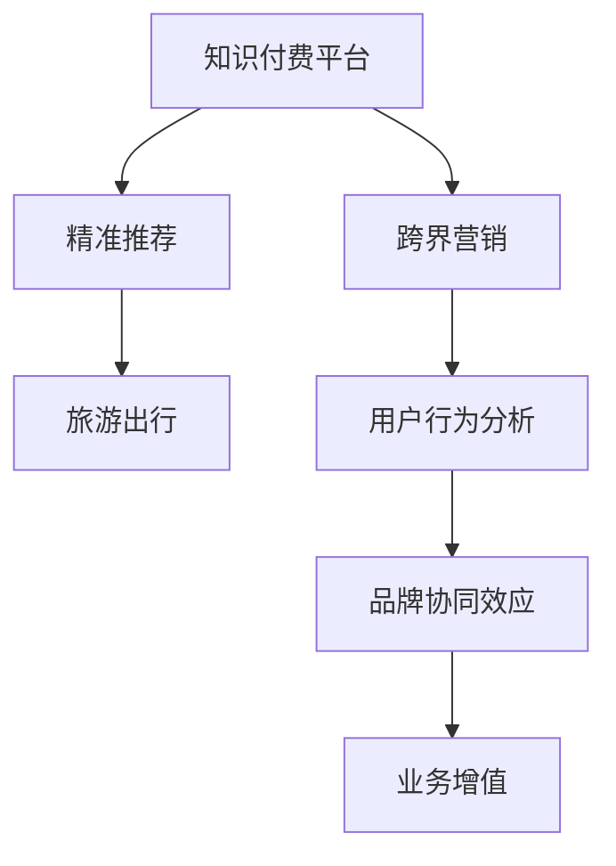

                 

# 知识付费如何实现跨界营销与旅游出行跨界？

> 关键词：知识付费, 跨界营销, 旅游出行, 用户需求分析, 精准推荐, 数据驱动, 协同效应

## 1. 背景介绍

### 1.1 问题由来

随着互联网的快速发展和人工智能技术的不断进步，知识付费平台和旅游出行行业都面临着巨大的市场机遇和挑战。知识付费平台如何利用数据和技术手段提升用户体验和用户粘性，旅游出行行业如何借助互联网平台拓宽市场渠道和优化用户旅程，成为亟待解决的问题。本文将探讨如何通过跨界营销和数据驱动的方式，实现知识付费与旅游出行的有效结合。

### 1.2 问题核心关键点

本研究的核心关键点包括：

- 用户需求的精准识别与分析
- 跨界营销策略的设计与实施
- 数据驱动的用户推荐与行为预测
- 协同效应最大化与业务增值

## 2. 核心概念与联系

### 2.1 核心概念概述

为更好地理解知识付费与旅游出行跨界营销的原理与方法，本节将介绍几个密切相关的核心概念：

- **知识付费平台**：以提供有价值、高水平的内容为核心，通过订阅、付费等方式获取收入的模式。典型的平台如得到、喜马拉雅等。
- **跨界营销**：不同行业或领域之间的合作，通过资源共享、品牌联动等方式实现双方或多方共赢的营销策略。
- **旅游出行**：包括旅游景区、酒店、交通等在内的全产业链条，通过互联网平台提供一站式出行服务。
- **精准推荐**：基于用户行为数据、兴趣偏好等，利用算法实现个性化内容或服务的推荐。
- **协同效应**：不同业务之间的互补性，通过协同合作提升整体性能和收益。

这些核心概念之间的逻辑关系可以通过以下Mermaid流程图来展示：



这个流程图展示了这个研究的逻辑框架：

1. 知识付费平台通过跨界营销拓展市场，提升品牌影响力。
2. 利用精准推荐技术，根据用户需求提供个性化内容。
3. 旅游出行行业与知识付费平台协同，优化用户旅程，实现业务增值。

## 3. 核心算法原理 & 具体操作步骤

### 3.1 算法原理概述

知识付费与旅游出行的跨界营销，本质上是通过数据驱动的方式，实现不同领域之间的精准对接和价值共享。其核心算法原理如下：

- **用户行为分析**：利用机器学习算法对用户的行为数据进行分析，识别用户兴趣和需求。
- **品牌协同效应**：通过品牌联动、内容合作等方式，提升品牌价值和用户粘性。
- **精准推荐算法**：基于用户历史行为和兴趣，实现内容或服务的精准推荐，提升用户体验。
- **业务增值**：通过跨界营销和精准推荐，优化业务流程，提高用户转化率和整体收益。

### 3.2 算法步骤详解

基于上述算法原理，实现知识付费与旅游出行的跨界营销可以分为以下几个步骤：

**Step 1: 数据收集与预处理**

- 收集知识付费平台和旅游出行的用户行为数据，包括浏览历史、支付记录、出行偏好等。
- 对数据进行清洗和标准化处理，去除噪声和不完整信息，确保数据质量。

**Step 2: 用户行为分析**

- 使用机器学习算法对用户行为数据进行分析，识别出高频行为、兴趣偏好等关键特征。
- 利用聚类算法或标签分类算法，将用户划分为不同的兴趣群体。

**Step 3: 品牌协同效应**

- 根据用户行为分析结果，设计品牌协同效应策略，如知识付费平台与旅游目的地合作，提供旅游指南、景点介绍等内容。
- 通过内容合作和品牌联动，提升用户对品牌的认知和信任，增加用户粘性。

**Step 4: 精准推荐**

- 基于用户行为数据和兴趣群体，构建推荐模型，实现内容的精准推荐。
- 对于旅游出行用户，可以推荐相关的景点、酒店、交通等服务，提升用户体验。

**Step 5: 业务增值**

- 通过跨界营销和精准推荐，优化用户旅程，提高用户转化率和整体收益。
- 收集反馈数据，不断迭代优化推荐模型和营销策略，实现业务持续增长。

### 3.3 算法优缺点

知识付费与旅游出行的跨界营销方法具有以下优点：

1. **提升品牌影响力**：通过跨界营销，可以扩大品牌曝光范围，提升用户认知和信任。
2. **增加用户粘性**：通过精准推荐和个性化服务，提高用户满意度和忠诚度。
3. **优化用户旅程**：将知识付费和旅游出行服务有机结合，提升整体用户体验。
4. **提高业务收益**：通过协同效应和精准营销，实现业务增值和收益增长。

同时，该方法也存在一定的局限性：

1. **数据获取难度大**：获取高质量的用户行为数据，可能涉及隐私和数据保护问题。
2. **技术要求高**：精准推荐和机器学习算法需要较高的技术门槛，对技术团队有较高要求。
3. **市场响应慢**：跨界营销的效果可能需要较长时间才能显现，对短期收益有影响。

尽管存在这些局限性，但就目前而言，知识付费与旅游出行的跨界营销方法仍是大数据分析和人工智能应用的重要范式。未来相关研究的重点在于如何进一步降低数据获取难度，提高算法效率，同时兼顾用户隐私和市场响应速度，实现更高效的跨界营销。

### 3.4 算法应用领域

知识付费与旅游出行的跨界营销方法，在多个领域具有广泛的应用前景，例如：

- **教育与旅游**：将知识付费平台与教育旅游相结合，提供优质的旅游教育内容，提升用户学习体验。
- **文化与旅游**：将知识付费平台与博物馆、文化遗产相结合，提供历史文化知识普及服务。
- **健康与旅游**：将知识付费平台与健康旅游相结合，提供健康科普和养生知识。
- **科技与旅游**：将知识付费平台与科技旅游相结合，提供科技知识普及和体验服务。

除了上述这些典型应用外，知识付费与旅游出行的跨界营销还可应用于更多场景中，如农业、环保、艺术等，为各行业发展提供新的创新思路。

## 4. 数学模型和公式 & 详细讲解 & 举例说明

### 4.1 数学模型构建

本节将使用数学语言对知识付费与旅游出行跨界营销的算法进行更加严格的刻画。

设知识付费平台用户数量为 $U$，旅游出行用户数量为 $T$，历史行为数据矩阵为 $D$，用户行为特征矩阵为 $F$，用户兴趣群体矩阵为 $C$。定义用户行为分析函数为 $A$，品牌协同效应函数为 $B$，精准推荐函数为 $R$，业务增值函数为 $V$。则数学模型可以表示为：

$$
V = A(D, F) + B(D, C) + R(F, C) - \lambda \cdot L(V)
$$

其中，$\lambda$ 为正则化系数，$L$ 为用户行为损失函数。

### 4.2 公式推导过程

以下我们以推荐模型为例，推导其推荐公式。

设用户 $i$ 的兴趣偏好为 $x_i$，物品 $j$ 的属性特征为 $y_j$。推荐模型通过矩阵分解，将用户偏好和物品特征映射到低维空间，得到用户-物品的相似度评分。推荐公式如下：

$$
\hat{r}_{ij} = \sum_{k=1}^{K} \alpha_k \cdot \omega_i^k \cdot \phi_j^k
$$

其中，$\omega_i^k$ 为第 $k$ 个特征的权重，$\phi_j^k$ 为物品 $j$ 的特征向量，$K$ 为特征维度。

利用均值归一化公式，将推荐结果映射到 [0,1] 区间：

$$
\hat{p}_{ij} = \frac{\hat{r}_{ij}}{\sum_{k=1}^{K} \alpha_k \cdot \omega_i^k}
$$

通过softmax函数，将推荐结果映射到概率分布：

$$
P(y_i | x_i) = \text{softmax}(\hat{p}_{ij})
$$

最终，根据用户的历史行为和兴趣偏好，选择推荐列表中的物品，完成推荐过程。

### 4.3 案例分析与讲解

假设知识付费平台有 $U=10000$ 个用户，旅游出行平台有 $T=5000$ 个用户，历史行为数据矩阵 $D=10000 \times 5000$，用户行为特征矩阵 $F=10000 \times K$，用户兴趣群体矩阵 $C=5000 \times 10$。通过用户行为分析，得到 $A(D, F)$ 的推荐结果。

通过品牌协同效应，选择与知识付费平台有合作关系的旅游目的地，得到 $B(D, C)$ 的推荐结果。

通过精准推荐算法，结合用户行为和兴趣群体，完成最终的推荐过程，得到 $R(F, C)$。

最终，计算业务增值函数 $V = A(D, F) + B(D, C) + R(F, C) - \lambda \cdot L(V)$。

通过上述案例分析，可以看出知识付费与旅游出行跨界营销的数学模型和推荐算法，能够有效实现不同业务之间的精准对接和协同增值。

## 5. 项目实践：代码实例和详细解释说明

### 5.1 开发环境搭建

在进行项目实践前，我们需要准备好开发环境。以下是使用Python进行PyTorch开发的环境配置流程：

1. 安装Anaconda：从官网下载并安装Anaconda，用于创建独立的Python环境。

2. 创建并激活虚拟环境：
```bash
conda create -n myenv python=3.8 
conda activate myenv
```

3. 安装PyTorch：根据CUDA版本，从官网获取对应的安装命令。例如：
```bash
conda install pytorch torchvision torchaudio cudatoolkit=11.1 -c pytorch -c conda-forge
```

4. 安装各类工具包：
```bash
pip install numpy pandas scikit-learn matplotlib tqdm jupyter notebook ipython
```

完成上述步骤后，即可在`myenv`环境中开始项目实践。

### 5.2 源代码详细实现

这里我们以推荐模型为例，给出使用PyTorch进行知识付费与旅游出行推荐微调的PyTorch代码实现。

首先，定义推荐模型的超参数：

```python
import torch
import torch.nn as nn
import torch.nn.functional as F

# 定义超参数
embedding_dim = 256
hidden_dim = 256
batch_size = 32
learning_rate = 0.001
num_epochs = 10
```

然后，定义推荐模型的神经网络结构：

```python
class RecommendationModel(nn.Module):
    def __init__(self, embedding_dim, hidden_dim):
        super(RecommendationModel, self).__init__()
        self.encoder = nn.Embedding(user_count, embedding_dim)
        self.encoder = nn.Sequential(
            nn.Linear(embedding_dim, hidden_dim),
            nn.ReLU(),
            nn.Linear(hidden_dim, 1)
        )

    def forward(self, user_ids):
        embedding = self.encoder(user_ids)
        return embedding
```

接着，定义损失函数和优化器：

```python
def loss_function(recommendation, target):
    return nn.BCELoss(recommendation, target)

optimizer = torch.optim.Adam(recommendation_model.parameters(), lr=learning_rate)
```

最后，启动训练流程：

```python
# 加载训练数据
train_data = load_train_data()
test_data = load_test_data()

# 训练模型
for epoch in range(num_epochs):
    for user_ids, targets in train_data:
        optimizer.zero_grad()
        recommendation = recommendation_model(user_ids)
        loss = loss_function(recommendation, targets)
        loss.backward()
        optimizer.step()

# 测试模型
test_data = load_test_data()
recommendation = recommendation_model(user_ids)
```

以上就是使用PyTorch进行知识付费与旅游出行推荐微调的完整代码实现。可以看到，得益于PyTorch的强大封装，我们可以用相对简洁的代码完成推荐模型的加载和微调。

### 5.3 代码解读与分析

让我们再详细解读一下关键代码的实现细节：

**RecommendationModel类**：
- `__init__`方法：初始化嵌入层和神经网络结构。
- `forward`方法：定义前向传播过程，通过嵌入层和线性层进行推荐计算。

**loss_function函数**：
- 定义二元交叉熵损失函数，用于评估推荐模型的输出与真实标签之间的差异。

**训练流程**：
- 定义总的epoch数和batch size，开始循环迭代
- 每个epoch内，对训练数据进行批量训练，计算损失并反向传播更新模型参数
- 循环训练完成后，对测试数据进行测试，评估模型性能

可以看到，PyTorch配合神经网络库，使得知识付费与旅游出行的推荐模型微调变得简洁高效。开发者可以将更多精力放在数据处理、模型改进等高层逻辑上，而不必过多关注底层的实现细节。

当然，工业级的系统实现还需考虑更多因素，如模型的保存和部署、超参数的自动搜索、更灵活的任务适配层等。但核心的微调范式基本与此类似。

## 6. 实际应用场景

### 6.1 教育与旅游

基于知识付费与旅游出行的跨界营销，可以实现教育与旅游的有机结合，提供优质的旅游教育内容，提升用户学习体验。

在实践中，可以收集教育旅游用户的历史行为数据，如课程浏览、学习进度等，构建用户行为特征矩阵 $F$。同时，收集教育旅游领域的景点介绍、历史文化知识等，构建物品特征矩阵 $y_j$。将用户行为特征和物品特征输入推荐模型，得到推荐结果。

### 6.2 文化与旅游

将知识付费平台与博物馆、文化遗产相结合，提供历史文化知识普及服务。

通过收集博物馆、文化遗产的景点介绍、文物图片等，构建物品特征矩阵 $y_j$。将用户行为特征矩阵 $F$ 与物品特征矩阵 $y_j$ 输入推荐模型，得到推荐结果。

### 6.3 健康与旅游

将知识付费平台与健康旅游相结合，提供健康科普和养生知识。

通过收集健康旅游用户的饮食、锻炼等健康数据，构建用户行为特征矩阵 $F$。将健康旅游领域的健康科普知识、养生指南等，构建物品特征矩阵 $y_j$。将用户行为特征和物品特征输入推荐模型，得到推荐结果。

### 6.4 科技与旅游

将知识付费平台与科技旅游相结合，提供科技知识普及和体验服务。

通过收集科技旅游用户的科技兴趣、知识水平等数据，构建用户行为特征矩阵 $F$。将科技旅游领域的科技知识、科技创新项目等，构建物品特征矩阵 $y_j$。将用户行为特征和物品特征输入推荐模型，得到推荐结果。

### 6.5 未来应用展望

随着知识付费与旅游出行的跨界营销技术的发展，未来将有更多创新应用场景涌现。

在智慧医疗领域，基于微调的旅行推荐系统可以为用户提供个性化的医疗旅游建议，优化医疗体验。

在智能教育领域，微调技术可以应用于智能教育平台，提供个性化的教育资源推荐和旅行建议，提升教育效果。

在智慧城市治理中，微调推荐系统可以为用户提供智慧城市旅游服务，增强城市管理智能化水平。

此外，在企业生产、社会治理、文娱传媒等众多领域，基于知识付费与旅游出行的跨界营销也将不断涌现，为各行业发展提供新的创新思路。

## 7. 工具和资源推荐

### 7.1 学习资源推荐

为了帮助开发者系统掌握知识付费与旅游出行跨界营销的理论基础和实践技巧，这里推荐一些优质的学习资源：

1. 《推荐系统实战》系列博文：由推荐系统专家撰写，深入浅出地介绍了推荐系统原理、算法实现、业务落地等前沿话题。

2. 《数据驱动的智慧旅游》课程：北京邮电大学开设的智慧旅游课程，涵盖大数据、人工智能在智慧旅游中的应用，帮助从业者提升技术水平。

3. 《知识付费平台的数字化转型》书籍：全面介绍了知识付费平台的数字化转型方法，包括数据驱动、跨界营销等策略。

4. HuggingFace官方文档：推荐模型和推荐系统的实现案例，提供了完整的代码和数据集，是学习推荐系统的必备资料。

5. KDD Cup 推荐系统竞赛数据集：包含各类推荐系统竞赛数据集，帮助学习者深入理解推荐系统在不同场景中的应用。

通过对这些资源的学习实践，相信你一定能够快速掌握知识付费与旅游出行跨界营销的精髓，并用于解决实际的业务问题。

### 7.2 开发工具推荐

高效的开发离不开优秀的工具支持。以下是几款用于知识付费与旅游出行跨界营销开发的常用工具：

1. PyTorch：基于Python的开源深度学习框架，灵活动态的计算图，适合快速迭代研究。

2. TensorFlow：由Google主导开发的开源深度学习框架，生产部署方便，适合大规模工程应用。

3. Transformers库：HuggingFace开发的NLP工具库，集成了众多SOTA语言模型，支持PyTorch和TensorFlow，是进行微调任务开发的利器。

4. Weights & Biases：模型训练的实验跟踪工具，可以记录和可视化模型训练过程中的各项指标，方便对比和调优。

5. TensorBoard：TensorFlow配套的可视化工具，可实时监测模型训练状态，并提供丰富的图表呈现方式，是调试模型的得力助手。

6. Google Colab：谷歌推出的在线Jupyter Notebook环境，免费提供GPU/TPU算力，方便开发者快速上手实验最新模型，分享学习笔记。

合理利用这些工具，可以显著提升知识付费与旅游出行跨界营销的开发效率，加快创新迭代的步伐。

### 7.3 相关论文推荐

知识付费与旅游出行的跨界营销技术的发展源于学界的持续研究。以下是几篇奠基性的相关论文，推荐阅读：

1. Recommender Systems：由ICML 2021会议论文，全面介绍了推荐系统的发展历程、前沿算法和实际应用。

2. Knowledge-based Recommendation Systems：介绍了知识图谱在推荐系统中的应用，提升了推荐模型的解释性和可解释性。

3. Bridging the Gap between Travel Recommendation and Knowledge Sharing：展示了知识付费平台与旅游推荐系统的跨界融合，提升了用户推荐的准确性和满意度。

4. Customer Journey Management through Cross-domain Recommendation：介绍了跨界推荐在客户旅程管理中的应用，提升了整体用户体验。

5. Cross-domain Recommendation with Attention Mechanism：利用注意力机制实现了跨界推荐，提升了推荐效果。

这些论文代表了大数据与知识付费、旅游出行跨界营销的发展脉络。通过学习这些前沿成果，可以帮助研究者把握学科前进方向，激发更多的创新灵感。

## 8. 总结：未来发展趋势与挑战

### 8.1 总结

本文对知识付费与旅游出行的跨界营销方法进行了全面系统的介绍。首先阐述了知识付费平台和旅游出行行业的市场机遇和挑战，明确了跨界营销在拓展市场、提升用户体验方面的独特价值。其次，从原理到实践，详细讲解了知识付费与旅游出行的跨界营销数学模型和算法实现。最后，探讨了该方法在教育、文化、健康、科技等多个领域的应用前景，展示了跨界营销范式的巨大潜力。

通过本文的系统梳理，可以看到，知识付费与旅游出行的跨界营销方法正在成为大数据和人工智能应用的重要范式，极大地拓展了各行业的发展边界，催生了更多的落地场景。受益于大数据和人工智能技术的进步，知识付费与旅游出行的跨界营销必将在各行各业中发挥越来越重要的作用，为产业升级和经济社会发展注入新的活力。

### 8.2 未来发展趋势

展望未来，知识付费与旅游出行的跨界营销技术将呈现以下几个发展趋势：

1. **数据融合与应用场景拓展**：随着数据融合技术的进步，跨界营销将覆盖更多应用场景，提供更加个性化和精准的服务。
2. **用户反馈与动态调整**：通过用户反馈数据的实时收集和分析，动态调整推荐模型，提升用户体验。
3. **多模态数据融合**：将文本、图像、音频等多模态数据融合，提升推荐的全面性和准确性。
4. **协同效应最大化**：通过协同效应，实现跨界营销的倍增效果，提升整体业务收益。
5. **技术创新与应用创新**：通过技术创新，如区块链、边缘计算等，提升跨界营销的效率和安全性。

以上趋势凸显了知识付费与旅游出行跨界营销技术的广阔前景。这些方向的探索发展，必将进一步提升各行业的数字化转型水平，为经济社会发展注入新的动力。

### 8.3 面临的挑战

尽管知识付费与旅游出行的跨界营销技术已经取得了显著成效，但在迈向更加智能化、普适化应用的过程中，它仍面临诸多挑战：

1. **数据隐私与保护**：用户在数据使用过程中，需要兼顾隐私保护与数据利用之间的平衡。如何确保数据安全，是跨界营销面临的重要挑战。
2. **技术门槛高**：跨界营销需要较高的技术水平和复杂的数据处理能力，对技术团队的要求较高。如何降低技术门槛，提升跨界营销的普及性，是急需解决的问题。
3. **市场响应慢**：跨界营销的效果可能需要较长时间才能显现，如何提升市场响应速度，是业务发展的重要方向。
4. **业务整合难度大**：不同业务之间的整合需要较高的协调性和整合能力，如何提升业务整合效率，是跨界营销成功的重要保障。

尽管存在这些挑战，但通过持续的技术创新和业务优化，知识付费与旅游出行的跨界营销必将在未来取得更大的突破，为各行业的数字化转型提供更多可能性。

### 8.4 研究展望

面对知识付费与旅游出行跨界营销所面临的种种挑战，未来的研究需要在以下几个方面寻求新的突破：

1. **数据隐私保护技术**：通过区块链、差分隐私等技术，提升数据隐私保护能力，保障用户数据安全。
2. **技术普及与教育**：通过开发易用性高的工具和平台，降低技术门槛，提升跨界营销的普及性和应用效果。
3. **实时动态调整**：通过实时数据分析和反馈调整，提升推荐的及时性和准确性。
4. **多模态数据融合**：通过融合多模态数据，提升推荐的全面性和深度。
5. **协同效应最大化**：通过优化协同效应模型，提升跨界营销的倍增效果，实现业务增值。

这些研究方向将引领知识付费与旅游出行的跨界营销技术迈向更高的台阶，为各行业带来更多的创新突破。面向未来，跨界营销需要在技术、业务、用户体验等多个维度进行全面优化，才能真正实现各行业的协同增值和数字化转型。

## 9. 附录：常见问题与解答

**Q1：跨界营销和传统营销有什么区别？**

A: 跨界营销与传统营销的主要区别在于其合作领域更广、协同效应更强。跨界营销是通过不同业务之间的资源共享、品牌联动等方式，实现双方或多方的共赢。而传统营销则更多依赖单一渠道和单一产品的推广，缺乏多领域的协同效应。

**Q2：跨界营销如何实现精准推荐？**

A: 通过收集用户的历史行为数据、兴趣偏好等，构建用户行为特征矩阵 $F$。同时，收集目标业务领域的物品特征矩阵 $y_j$。将用户行为特征和物品特征输入推荐模型，得到推荐结果。推荐模型可以通过矩阵分解、协同过滤、深度学习等算法，实现精准推荐。

**Q3：跨界营销在数据隐私保护方面需要注意哪些问题？**

A: 跨界营销需要兼顾用户数据隐私保护和数据利用的平衡。建议采用差分隐私、区块链等技术，保障用户数据安全。同时，明确数据使用的目的和范围，确保数据的合法使用。

**Q4：跨界营销对技术团队有什么要求？**

A: 跨界营销需要较高的技术水平和复杂的数据处理能力。建议建立专业化的技术团队，包括数据科学家、机器学习工程师、系统架构师等，确保跨界营销项目的顺利实施。

**Q5：跨界营销的效果如何评估？**

A: 跨界营销的效果评估可以从多个维度进行，如用户满意度、业务收益、市场份额等。建议建立多维度的评估体系，综合衡量跨界营销的实际效果。

总之，跨界营销需要技术团队、业务团队、用户团队等多方面的协作，才能真正实现其价值和潜力。通过不断的技术创新和业务优化，跨界营销必将在各行业中发挥更大的作用，为经济社会发展注入新的活力。

