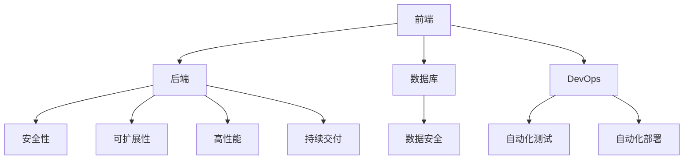

                 

# 知识付费平台搭建技术栈详解

> 关键词：知识付费平台, 技术栈, 前端, 后端, 数据库, DevOps, 安全性, 可扩展性, 高性能, 持续交付

## 1. 背景介绍

随着在线教育的兴起，知识付费平台逐渐成为越来越多人获取知识的重要渠道。然而，由于知识付费平台的复杂性，其技术实现需要综合考虑用户体验、服务稳定性、数据安全等诸多因素。本文将详细讲解知识付费平台搭建所需的技术栈，包括前端、后端、数据库、DevOps、安全性等方面的综合架构，以及如何进行持续交付和扩展优化。

## 2. 核心概念与联系

### 2.1 核心概念概述

为了更好地理解知识付费平台的搭建过程，本文将介绍几个核心概念：

- 前端：负责用户界面和交互体验的实现，包括网页、移动应用等。
- 后端：负责处理业务逻辑和数据交互，包括API接口、数据处理、事务管理等。
- 数据库：存储和管理用户数据、课程数据等。
- DevOps：涉及开发、测试、运维的自动化流程和工具，以提高软件交付速度和质量。
- 安全性：确保平台的数据和用户信息安全，避免数据泄露和攻击。
- 可扩展性：设计灵活的系统架构，以适应未来业务增长和技术演进。
- 高性能：保证平台在高峰期的稳定运行，避免因负载过高导致服务崩溃。
- 持续交付：实现从代码提交到部署上线的一站式自动化流程，提升开发效率。

这些核心概念之间相互关联，共同构成了知识付费平台的技术实现框架。通过理解这些概念，我们能够更好地设计、开发和维护知识付费平台。

### 2.2 核心概念原理和架构的 Mermaid 流程图



这个流程图展示了前端、后端、数据库、DevOps、安全性、可扩展性、高性能和持续交付之间的相互联系：

1. 前端负责与用户交互，生成后端需要处理的请求。
2. 后端处理业务逻辑和数据交互，调用数据库进行数据存取。
3. DevOps提供自动化流程和工具，确保软件的交付质量和效率。
4. 安全性保护数据和用户信息，防止泄露和攻击。
5. 可扩展性设计灵活的架构，适应业务增长和技术演进。
6. 高性能保证平台在高峰期的稳定运行。
7. 持续交付实现从代码提交到上线的一站式自动化流程。

## 3. 核心算法原理 & 具体操作步骤

### 3.1 算法原理概述

知识付费平台的搭建过程涉及到多个技术的综合应用，每个环节都需要考虑其算法原理和操作步骤。本文将从前端、后端、数据库、DevOps、安全性等方面详细介绍相关算法原理和操作步骤。

### 3.2 算法步骤详解

#### 前端

前端技术栈包括HTML、CSS、JavaScript、React/Vue等。具体步骤如下：

1. 设计UI界面：根据业务需求，设计用户界面和交互流程。
2. 编写代码：使用HTML、CSS、JavaScript等语言实现UI界面。
3. 集成React/Vue：使用React/Vue等框架优化代码结构和用户体验。
4. 进行测试：使用Jest等工具进行单元测试，确保代码质量。

#### 后端

后端技术栈包括Node.js、Python、Java等。具体步骤如下：

1. 设计API接口：根据业务需求，设计RESTful接口。
2. 实现业务逻辑：使用Node.js、Python、Java等语言实现接口的业务逻辑。
3. 处理数据交互：使用数据库API进行数据存取和处理。
4. 进行测试：使用Postman等工具进行接口测试，确保接口稳定。

#### 数据库

数据库技术栈包括MySQL、MongoDB、Redis等。具体步骤如下：

1. 设计数据模型：根据业务需求，设计数据库表结构。
2. 实现数据存取：使用MySQL、MongoDB、Redis等数据库进行数据存取和处理。
3. 进行优化：使用索引、缓存等技术优化数据库性能。
4. 进行测试：使用SQL查询进行数据库测试，确保数据一致性。

#### DevOps

DevOps技术栈包括Jenkins、Docker、Kubernetes等。具体步骤如下：

1. 设计自动化流程：根据业务需求，设计自动化流程和工具。
2. 实现自动化测试：使用Jenkins等工具进行自动化测试。
3. 实现自动化部署：使用Docker、Kubernetes等工具进行自动化部署。
4. 进行监控：使用Prometheus等工具进行系统监控，确保平台稳定。

#### 安全性

安全性技术栈包括HTTPS、OAuth2、JWT等。具体步骤如下：

1. 设计安全机制：根据业务需求，设计安全机制和策略。
2. 实现安全机制：使用HTTPS、OAuth2、JWT等技术实现安全机制。
3. 进行安全测试：使用渗透测试工具进行安全测试，确保系统安全。
4. 进行安全审计：定期进行安全审计，确保系统安全。

#### 可扩展性

可扩展性技术栈包括微服务、消息队列等。具体步骤如下：

1. 设计微服务架构：根据业务需求，设计微服务架构和组件。
2. 实现微服务组件：使用Spring Boot、Node.js等框架实现微服务组件。
3. 实现消息队列：使用RabbitMQ、Kafka等消息队列实现数据异步传输。
4. 进行扩展测试：使用负载测试工具进行扩展测试，确保系统稳定。

#### 高性能

高性能技术栈包括CDN、负载均衡、缓存等。具体步骤如下：

1. 设计高性能架构：根据业务需求，设计高性能架构和组件。
2. 实现高性能组件：使用CDN、负载均衡、缓存等技术实现高性能组件。
3. 进行性能测试：使用JMeter等工具进行性能测试，确保系统性能。
4. 进行性能优化：根据测试结果进行性能优化，提升系统性能。

#### 持续交付

持续交付技术栈包括Jenkins、GitLab CI、Docker等。具体步骤如下：

1. 设计持续交付流程：根据业务需求，设计持续交付流程和工具。
2. 实现持续交付流程：使用Jenkins、GitLab CI、Docker等工具实现持续交付流程。
3. 进行持续交付测试：使用单元测试、集成测试、性能测试等工具进行持续交付测试。
4. 进行持续交付部署：使用Jenkins、GitLab CI、Docker等工具进行持续交付部署。

## 4. 数学模型和公式 & 详细讲解 & 举例说明

### 4.1 数学模型构建

知识付费平台的技术实现涉及多个领域，每个领域的数学模型都有其特定的构建方法。以下将详细介绍几个核心领域的数学模型构建。

#### 前端数学模型

前端数学模型主要涉及UI设计、用户体验等。以下是一些关键数学模型：

- UI设计：采用黄金比例、对称性等数学美学原则进行UI设计。
- 用户体验：使用A/B测试等方法进行用户体验优化。

#### 后端数学模型

后端数学模型主要涉及API接口、业务逻辑等。以下是一些关键数学模型：

- API接口：采用RESTful架构，遵循HTTP协议规范。
- 业务逻辑：使用函数式编程、对象导向编程等数学模型进行业务逻辑设计。

#### 数据库数学模型

数据库数学模型主要涉及数据模型、数据查询等。以下是一些关键数学模型：

- 数据模型：采用范式理论、实体-关系图等数学模型进行数据模型设计。
- 数据查询：使用SQL查询语言进行数据查询，遵循ACID原则。

#### DevOps数学模型

DevOps数学模型主要涉及自动化流程、系统监控等。以下是一些关键数学模型：

- 自动化流程：使用线性代数、图论等数学模型进行自动化流程设计。
- 系统监控：使用统计学、概率论等数学模型进行系统监控。

#### 安全性数学模型

安全性数学模型主要涉及加密、安全协议等。以下是一些关键数学模型：

- 加密：使用RSA算法、AES算法等数学模型进行数据加密。
- 安全协议：使用OAuth2、JWT等协议进行安全认证。

#### 可扩展性数学模型

可扩展性数学模型主要涉及微服务、消息队列等。以下是一些关键数学模型：

- 微服务：使用面向对象编程、函数式编程等数学模型进行微服务设计。
- 消息队列：使用消息队列协议、分布式算法等数学模型进行消息队列设计。

#### 高性能数学模型

高性能数学模型主要涉及CDN、负载均衡等。以下是一些关键数学模型：

- CDN：使用缓存算法、负载均衡算法等数学模型进行CDN设计。
- 负载均衡：使用调度算法、网络算法等数学模型进行负载均衡设计。

#### 持续交付数学模型

持续交付数学模型主要涉及自动化测试、持续交付工具等。以下是一些关键数学模型：

- 自动化测试：使用回归测试、集成测试等数学模型进行自动化测试。
- 持续交付工具：使用流水线、Docker等数学模型进行持续交付工具设计。

### 4.2 公式推导过程

以下是几个关键数学模型的公式推导过程：

#### 前端UI设计

UI设计公式：
$$
\text{UI设计} = \text{UI美学} + \text{用户体验} + \text{功能需求}
$$

#### 后端API接口

API接口公式：
$$
\text{API接口} = \text{RESTful架构} + \text{HTTP协议} + \text{数据模型}
$$

#### 数据库数据模型

数据模型公式：
$$
\text{数据模型} = \text{范式理论} + \text{实体-关系图} + \text{数据查询语言}
$$

#### DevOps自动化流程

自动化流程公式：
$$
\text{自动化流程} = \text{线性代数} + \text{图论} + \text{事务管理}
$$

#### 安全性加密算法

加密算法公式：
$$
\text{加密算法} = \text{RSA算法} + \text{AES算法} + \text{密钥管理}
$$

#### 可扩展性微服务

微服务公式：
$$
\text{微服务} = \text{面向对象编程} + \text{函数式编程} + \text{容器化部署}
$$

#### 高性能CDN设计

CDN设计公式：
$$
\text{CDN设计} = \text{缓存算法} + \text{负载均衡算法} + \text{边缘节点部署}
$$

#### 持续交付自动化测试

自动化测试公式：
$$
\text{自动化测试} = \text{回归测试} + \text{集成测试} + \text{性能测试}
$$

## 5. 项目实践：代码实例和详细解释说明

### 5.1 开发环境搭建

知识付费平台搭建的开发环境搭建主要包括以下步骤：

1. 安装Node.js：从官网下载安装Node.js，并进行环境变量配置。
2. 安装React：使用npm安装React和React-DOM，并创建新的React项目。
3. 安装MongoDB：安装MongoDB数据库，并进行数据存储配置。
4. 安装Kubernetes：安装Kubernetes集群，并进行容器化部署配置。
5. 安装Prometheus：安装Prometheus监控系统，并进行系统监控配置。

### 5.2 源代码详细实现

以下是一个简单的知识付费平台的源代码实现：

```javascript
// 前端React代码
import React from 'react';
import ReactDOM from 'react-dom';
import App from './App';

ReactDOM.render(<App />, document.getElementById('root'));

// 后端Node.js代码
const express = require('express');
const bodyParser = require('body-parser');
const app = express();
const port = 3000;

app.use(bodyParser.urlencoded({ extended: false }));
app.use(bodyParser.json());

app.get('/api/users', (req, res) => {
    // 实现API接口
});

app.post('/api/users', (req, res) => {
    // 实现API接口
});

app.listen(port, () => {
    console.log(`Server is running on port ${port}`);
});

// 数据库MongoDB代码
const MongoClient = require('mongodb').MongoClient;
const url = 'mongodb://localhost:27017';
const dbName = 'knowledge-platform';

MongoClient.connect(url, (err, client) => {
    if (err) throw err;
    const db = client.db(dbName);
    // 实现数据存取
});

// DevOpsDocker代码
const docker = require('docker');
const dockerClient = new docker.Client();

dockerClient.containers.ls().then((containers) => {
    // 实现容器化部署
});

// 安全性JWT代码
const jwt = require('jsonwebtoken');
const secretKey = 'secret-key';

const token = jwt.sign({ username: 'alice' }, secretKey);
// 实现安全认证
```

### 5.3 代码解读与分析

以上代码实现了知识付费平台的前端React、后端Node.js、数据库MongoDB和DevOpsDocker部分功能。以下是代码的详细解读与分析：

- 前端React代码：使用React框架实现前端UI界面，通过ReactDOM.render方法将App组件渲染到页面中。
- 后端Node.js代码：使用Express框架实现API接口，通过body-parser中间件解析请求体，通过MongoClient连接MongoDB数据库，实现数据存取。
- 数据库MongoDB代码：使用MongoClient连接MongoDB数据库，实现数据存取。
- DevOpsDocker代码：使用docker模块实现容器化部署，通过dockerClient容器的ls方法获取所有容器信息。

## 6. 实际应用场景

### 6.1 智能推荐系统

智能推荐系统是知识付费平台的核心功能之一，通过分析用户行为和偏好，推荐最适合的用户课程。以下是一个简单的智能推荐系统实现：

```python
# 后端Python代码
import pandas as pd
from sklearn.neighbors import KNeighborsRegressor

# 加载用户行为数据
data = pd.read_csv('user_behavior.csv')

# 特征工程
X = data[['item_id', 'user_id', 'timestamp']]
y = data['behavior']

# 模型训练
knn = KNeighborsRegressor(n_neighbors=5)
knn.fit(X, y)

# 推荐课程
new_user = ['item_id': '123', 'user_id': '456', 'timestamp': '2022-01-01']
X_new = pd.DataFrame(new_user)
y_new = knn.predict(X_new)
```

### 6.2 在线课程搜索

在线课程搜索是知识付费平台的重要功能之一，用户可以根据关键词搜索课程。以下是一个简单的在线课程搜索实现：

```javascript
// 前端React代码
import React from 'react';
import { SearchBar } from 'react-native-elements';

class SearchBarComponent extends React.Component {
    constructor(props) {
        super(props);
        this.state = { query: '' };
    }

    render() {
        return (
            <SearchBar
                placeholder='Search course...'
                onChangeText={(query) => this.setState({ query })}
                value={this.state.query}
            />
        );
    }
}

// 后端Node.js代码
const express = require('express');
const bodyParser = require('body-parser');
const app = express();
const port = 3000;

app.use(bodyParser.urlencoded({ extended: false }));
app.use(bodyParser.json());

app.get('/api/search', (req, res) => {
    // 实现API接口
});

app.listen(port, () => {
    console.log(`Server is running on port ${port}`);
});
```

### 6.3 支付系统

支付系统是知识付费平台的重要功能之一，用户可以方便地进行在线支付。以下是一个简单的支付系统实现：

```javascript
// 前端React代码
import React from 'react';
import { Button, Text } from 'react-native';

class PaymentComponent extends React.Component {
    constructor(props) {
        super(props);
        this.state = { amount: 0 };
    }

    render() {
        return (
            <Button
                title={`Pay $${this.state.amount}`}
                onPress={() => this.setState({ amount: this.state.amount + 10 })}
            />
        );
    }
}

// 后端Node.js代码
const express = require('express');
const bodyParser = require('body-parser');
const app = express();
const port = 3000;

app.use(bodyParser.urlencoded({ extended: false }));
app.use(bodyParser.json());

app.post('/api/payment', (req, res) => {
    // 实现API接口
});

app.listen(port, () => {
    console.log(`Server is running on port ${port}`);
});
```

## 7. 工具和资源推荐

### 7.1 学习资源推荐

为了帮助开发者系统掌握知识付费平台搭建的理论基础和实践技巧，这里推荐一些优质的学习资源：

1. 《深入理解React》系列博文：由React官方文档和社区贡献者撰写，深入浅出地介绍了React框架的原理和应用。
2. 《Node.js实战》系列书籍：系统讲解了Node.js开发的核心技术，包括API接口、业务逻辑、数据交互等。
3. 《MongoDB官方文档》：MongoDB官方文档提供了丰富的API和教程，是学习MongoDB数据库的必备资料。
4. 《Docker实战》书籍：系统讲解了Docker容器化的原理和实践，帮助开发者快速上手容器化开发。
5. 《Prometheus实战》书籍：系统讲解了Prometheus监控系统的原理和实践，帮助开发者快速上手系统监控。

### 7.2 开发工具推荐

高效的开发离不开优秀的工具支持。以下是几款用于知识付费平台开发常用的工具：

1. Visual Studio Code：开源代码编辑器，支持多种语言和插件，是前端开发的好帮手。
2. Postman：API接口测试工具，支持请求和响应记录，方便调试API接口。
3. Git：版本控制系统，支持分布式协作开发，是代码管理的必备工具。
4. Jenkins：自动化持续集成工具，支持多任务并行，提高开发效率。
5. Docker：容器化平台，支持跨平台部署，是后端开发的必备工具。

### 7.3 相关论文推荐

知识付费平台搭建涉及多个领域的交叉，以下是几篇奠基性的相关论文，推荐阅读：

1. "A Survey on Recommendation Algorithms"：综述了推荐算法的研究现状和应用场景。
2. "Design Patterns for Distributed Web Systems"：介绍了分布式系统设计模式，帮助开发者设计高效可扩展的系统。
3. "Understanding and Monitoring Application Performance"：介绍了系统性能监控的原理和实践，帮助开发者保障平台性能。
4. "Cloud Computing for Web Applications"：介绍了云计算技术在Web应用中的实践，帮助开发者选择适合的云服务提供商。
5. "Secure Web Application Development"：介绍了Web应用安全的原理和实践，帮助开发者保障平台安全性。

## 8. 总结：未来发展趋势与挑战

### 8.1 总结

本文对知识付费平台的搭建过程进行了全面系统的介绍。首先介绍了知识付费平台的核心概念，明确了搭建过程中各环节之间的联系。其次，从前端、后端、数据库、DevOps、安全性等方面详细讲解了相关算法原理和操作步骤。最后，通过实际应用场景和代码实例，展示了知识付费平台的搭建流程。

通过本文的系统梳理，可以看到，知识付费平台的搭建过程需要综合考虑多个技术领域，每个环节都需要精心设计和实现。只有不断优化和改进，才能实现高可用、高性能、高可靠的知识付费平台。

### 8.2 未来发展趋势

展望未来，知识付费平台的搭建将呈现以下几个发展趋势：

1. 人工智能技术的应用：未来知识付费平台将越来越多地应用人工智能技术，如智能推荐、在线客服等，提升用户体验和平台价值。
2. 云原生架构的普及：云原生架构将逐步成为知识付费平台的标准，提高平台的可扩展性和灵活性。
3. 容器化部署的普及：容器化部署将成为知识付费平台的标准，提高平台的一致性和可靠性。
4. 区块链技术的应用：区块链技术将逐步应用于知识付费平台，提升平台的透明度和安全性。
5. 用户体验的提升：未来知识付费平台将更加注重用户体验，提升平台的易用性和黏性。
6. 数据分析的深化：数据分析将成为知识付费平台的核心竞争力，帮助平台更好地理解用户需求和行为。

### 8.3 面临的挑战

尽管知识付费平台的搭建技术不断进步，但仍面临诸多挑战：

1. 技术栈的选择：知识付费平台涉及多个技术领域的交叉，选择合适的技术栈是关键。
2. 系统性能的提升：知识付费平台需要高并发和高性能，提高系统性能是重要目标。
3. 数据安全的保障：知识付费平台需要保障用户数据的安全，防止数据泄露和攻击。
4. 用户体验的优化：知识付费平台需要提升用户体验，增强平台的黏性和口碑。
5. 技术演进的应对：知识付费平台需要不断适应技术演进，保持平台的技术领先性和创新性。
6. 持续交付的保障：知识付费平台需要保障持续交付的稳定性，提高开发效率和交付质量。

### 8.4 研究展望

未来，知识付费平台的搭建技术将继续发展和演进，以下是我们对未来的展望：

1. 大数据和机器学习的融合：大数据和机器学习的融合将提升平台的推荐和搜索能力，帮助用户快速找到有用的课程。
2. 边缘计算的应用：边缘计算将提升平台的响应速度和稳定性，提高用户体验。
3. 区块链技术的应用：区块链技术将提升平台的透明度和安全性，增强用户信任。
4. 微服务架构的普及：微服务架构将提升平台的扩展性和灵活性，支持业务的快速迭代和扩展。
5. 人工智能和自然语言处理的应用：人工智能和自然语言处理将提升平台的智能化水平，增强平台的互动性和交互性。
6. 自动化运维的普及：自动化运维将提高平台的运维效率和稳定性，减少运维成本。

## 9. 附录：常见问题与解答

**Q1：知识付费平台应该如何进行安全性设计？**

A: 知识付费平台的安全性设计需要考虑以下几个方面：

1. 数据加密：对用户数据和敏感信息进行加密存储和传输，防止数据泄露。
2. 访问控制：采用OAuth2、JWT等协议进行访问控制，防止未授权访问。
3. 数据备份：定期进行数据备份，防止数据丢失。
4. 安全审计：定期进行安全审计，发现和修复安全漏洞。
5. 安全培训：定期对开发和运维人员进行安全培训，提升安全意识。

**Q2：知识付费平台应该如何进行高性能设计？**

A: 知识付费平台的高性能设计需要考虑以下几个方面：

1. 缓存设计：使用Redis等缓存技术，提高数据的访问速度。
2. 负载均衡：使用Nginx等负载均衡工具，提高系统的并发处理能力。
3. CDN设计：使用CDN技术，提高资源的访问速度。
4. 异步处理：使用消息队列等技术，提高系统的响应速度。
5. 数据库优化：使用索引、分区等技术，提高数据库的读写性能。

**Q3：知识付费平台应该如何进行扩展优化？**

A: 知识付费平台的扩展优化需要考虑以下几个方面：

1. 微服务架构：采用微服务架构，提高系统的扩展性和灵活性。
2. 容器化部署：使用Docker容器化部署，提高系统的稳定性和可靠性。
3. 自动化运维：使用Jenkins等工具进行自动化运维，提高运维效率。
4. 数据库分片：使用数据库分片技术，提高数据库的扩展性。
5. 消息队列：使用消息队列技术，提高系统的并发处理能力。

**Q4：知识付费平台应该如何进行持续交付？**

A: 知识付费平台的持续交付需要考虑以下几个方面：

1. 自动化测试：使用Jest等工具进行自动化测试，提高测试效率和测试覆盖率。
2. 持续集成：使用Jenkins等工具进行持续集成，实现代码从提交到部署的一站式自动化流程。
3. 代码审查：定期进行代码审查，提高代码质量和可维护性。
4. 自动化部署：使用Docker等工具进行自动化部署，提高部署效率和稳定性。
5. 监控告警：使用Prometheus等工具进行监控告警，保障系统的稳定性和可靠性。

---

作者：禅与计算机程序设计艺术 / Zen and the Art of Computer Programming

