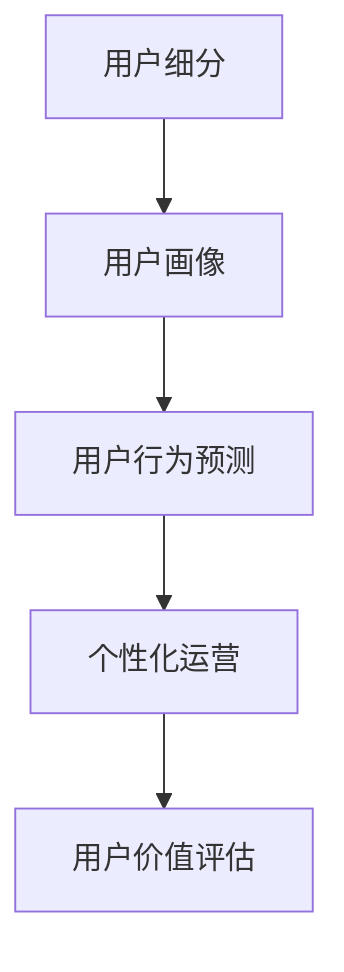

                 

# 知识付费平台的用户生命周期管理

## 1. 背景介绍

### 1.1 问题由来
随着互联网与智能终端设备的普及，知识付费平台作为一种新兴的在线教育形式，迅速吸引了大量用户。用户不仅可以随时随地获取海量知识，还能通过订阅、付费等方式，享受个性化、定制化的内容服务。然而，随着用户数量的增长，用户生命周期管理成为知识付费平台运营的一个关键挑战。

- **用户获取成本高**：获取新用户需要投入大量的广告费用和运营资源，如果新用户留存率低，无疑会大幅增加运营成本。
- **用户流失率高**：由于知识付费内容丰富且差异化大，用户容易被其他平台吸引，导致用户流失率高。
- **用户行为预测困难**：用户行为模式复杂多变，很难通过单一指标预测其未来的行为。
- **用户转化率低**：用户订阅和购买意愿较低，转化率不高。

### 1.2 问题核心关键点
用户生命周期管理（User Lifecycle Management, ULM），是指通过用户数据挖掘和分析，将用户划分为不同阶段，并通过有针对性的运营策略，提升用户留存、转化和复购率的系统性工作。通过科学的用户生命周期管理，知识付费平台可以优化运营策略，提升用户粘性和平台收益。

核心关键点包括：

- 用户细分（User Segmentation）
- 用户画像（User Persona）
- 用户行为预测（User Behavior Prediction）
- 个性化运营（Personalized Operation）
- 用户价值评估（User Value Assessment）

## 2. 核心概念与联系

### 2.1 核心概念概述

为更好地理解知识付费平台的用户生命周期管理，本节将介绍几个密切相关的核心概念：

- **用户细分（User Segmentation）**：将用户按照某些特征划分为不同的群体，便于有针对性地设计运营策略。常见的细分维度包括年龄、性别、地域、设备类型等。
- **用户画像（User Persona）**：基于用户数据，描述并刻画典型的用户画像，便于理解不同用户群体的需求和行为特点。
- **用户行为预测（User Behavior Prediction）**：通过机器学习模型，预测用户未来的行为，以便提前进行运营干预，提升用户价值。
- **个性化运营（Personalized Operation）**：根据用户画像和行为预测结果，提供个性化的内容推荐、优惠活动等，提高用户满意度和平台粘性。
- **用户价值评估（User Value Assessment）**：通过模型评估用户对平台的价值，便于进行精准的运营资源分配。

这些概念之间的逻辑关系可以通过以下Mermaid流程图来展示：



这个流程图展示了用户生命周期管理的各个环节，并指出了它们之间的联系和作用。

## 3. 核心算法原理 & 具体操作步骤
### 3.1 算法原理概述

知识付费平台的用户生命周期管理，其核心原理是通过对用户行为数据的分析，识别用户在不同生命周期阶段的特征和需求，并据此设计有针对性的运营策略，提升用户价值和平台收益。

用户生命周期管理的关键在于用户数据的收集与分析，以及个性化运营策略的制定与实施。以下是其核心流程：

1. **数据收集与清洗**：收集用户的基本信息、行为数据、交易数据等，并进行数据清洗，去除噪音和异常数据。
2. **用户细分与画像**：基于用户数据进行用户细分，并根据细分结果构建用户画像。
3. **用户行为预测**：利用机器学习模型，预测用户未来的行为，如订阅概率、复购概率等。
4. **个性化运营**：根据用户画像和行为预测结果，提供个性化的运营策略，如个性化推荐、专属优惠等。
5. **效果评估与优化**：通过监控和评估运营策略的效果，调整和优化策略，提升用户留存和转化率。

### 3.2 算法步骤详解

下面详细介绍每个步骤的详细操作：

#### 3.2.1 数据收集与清洗

**步骤1: 数据来源**
- **用户注册数据**：包括用户名、邮箱、性别、年龄、地域、设备类型等。
- **行为数据**：用户在平台上的浏览、阅读、订阅、付费等行为数据。
- **交易数据**：用户购买、订阅、续费等交易数据。
- **用户反馈数据**：用户评价、评分、投诉等反馈数据。

**步骤2: 数据清洗**
- **去除重复数据**：通过唯一标识符去重。
- **处理缺失值**：通过插值、填充等方式处理缺失值。
- **异常值处理**：识别和处理异常值，如年龄为负数等。

#### 3.2.2 用户细分与画像

**步骤1: 用户细分**
- **统计指标细分**：基于用户注册数据，统计不同特征的用户分布情况。
- **行为特征细分**：基于行为数据，统计用户在不同功能模块的使用情况。
- **生命周期阶段细分**：基于用户生命周期数据，划分用户处于注册、试用、活跃、衰退等阶段。

**步骤2: 用户画像**
- **基本属性画像**：包括性别、年龄、地域、设备类型等。
- **行为画像**：包括用户在平台上的主要活动、偏好内容等。
- **价值画像**：包括用户消费金额、活跃程度等。

#### 3.2.3 用户行为预测

**步骤1: 模型选择**
- **逻辑回归**：适用于预测二分类问题，如订阅概率、流失概率等。
- **随机森林**：适用于处理多分类问题，如用户订阅内容类型预测。
- **神经网络**：适用于处理复杂非线性关系，如用户未来购买行为预测。

**步骤2: 特征工程**
- **特征选择**：选择对预测目标有影响的特征，如用户活跃度、消费金额等。
- **特征提取**：通过数据预处理，生成新的特征，如行为频率、消费金额等。
- **特征组合**：通过组合特征，构造新的预测变量，如行为频率*消费金额等。

**步骤3: 模型训练与评估**
- **训练模型**：使用历史数据训练预测模型。
- **评估模型**：使用测试集验证模型性能，选择最优模型。

#### 3.2.4 个性化运营

**步骤1: 个性化推荐**
- **内容推荐**：根据用户画像，推荐相关内容，如热门课程、用户评价高的课程等。
- **功能推荐**：根据用户行为，推荐功能模块，如专题模块、学习笔记等。
- **活动推荐**：根据用户行为和特定时间节点，推荐优惠活动，如双11折扣、春节优惠等。

**步骤2: 专属优惠**
- **精准优惠券**：基于用户画像，发送个性化优惠券，如新用户注册优惠券、活跃用户续订优惠券等。
- **专属内容**：基于用户画像，提供专属内容，如高级会员专享课程、限时免费试听等。

#### 3.2.5 效果评估与优化

**步骤1: 监控指标**
- **用户留存率**：跟踪用户在不同阶段的留存率变化。
- **用户转化率**：跟踪用户从注册到活跃、再到购买的过程中的转化率。
- **用户生命周期价值**：计算用户在整个生命周期内的价值贡献。

**步骤2: 效果评估**
- **A/B测试**：通过对比不同运营策略的效果，选择最优策略。
- **数据可视化**：利用可视化工具，展示运营策略的效果。

**步骤3: 优化策略**
- **调优模型**：根据效果评估结果，调整和优化模型参数。
- **调整策略**：根据效果评估结果，调整运营策略，如调整推荐算法、优化优惠活动等。

### 3.3 算法优缺点

用户生命周期管理具有以下优点：
- **提升用户粘性**：通过个性化运营，提高用户对平台的粘性，减少流失。
- **优化运营成本**：通过精准的运营策略，减少无效广告和推广费用。
- **提高用户价值**：通过个性化的内容和优惠，提升用户转化和复购率。

同时，该方法也存在一定的局限性：
- **数据依赖性强**：需要大量且质量高的用户数据，数据获取难度大。
- **模型复杂度高**：需要构建复杂的模型，对算法和资源要求高。
- **预测准确性受限**：预测模型基于历史数据，存在预测偏差和噪音。
- **策略调整耗时**：策略调整后需要时间观察效果，效率较低。

尽管存在这些局限性，但就目前而言，用户生命周期管理仍是对知识付费平台运营至关重要的一种方法。未来相关研究的重点在于如何进一步降低对标注数据的依赖，提高模型的预测准确性，并优化运营策略的实施效果。

### 3.4 算法应用领域

用户生命周期管理在知识付费平台的应用非常广泛，几乎涵盖了所有运营环节：

- **用户获取**：通过精准广告投放和个性化推荐，吸引并引导潜在用户注册和转化。
- **用户留存**：通过个性化内容和优惠活动，提升用户活跃度和粘性，减少流失。
- **用户转化**：通过精准推荐和专属优惠，提升用户从免费用户到付费用户的转化率。
- **用户复购**：通过持续运营和个性化服务，提升用户的长期价值和复购率。
- **用户流失**：通过挽留策略和功能优化，减少用户流失。

除了上述这些核心环节外，用户生命周期管理还可以应用于以下场景：

- **用户行为分析**：分析用户行为模式，识别高价值用户和潜在流失用户。
- **用户满意度提升**：通过用户反馈和行为数据，提升用户体验和满意度。
- **内容优化**：根据用户行为数据，优化内容策略和课程设计。
- **营销效果评估**：评估不同营销策略的效果，优化广告投放和推广活动。

## 4. 数学模型和公式 & 详细讲解  
### 4.1 数学模型构建

为了更好地理解知识付费平台的用户生命周期管理算法，本节将使用数学语言对用户细分、用户行为预测等关键步骤进行更加严格的刻画。

假设平台用户总数为 $N$，用户生命周期数据为 $X_1, X_2, \ldots, X_N$，行为数据为 $Y_1, Y_2, \ldots, Y_N$，交易数据为 $Z_1, Z_2, \ldots, Z_N$。

定义用户细分维度为 $A$，用户画像为 $\mathbf{P}$，用户行为预测模型为 $M$，个性化运营策略为 $S$，用户价值评估模型为 $V$。

用户生命周期管理的目标是最大化用户留存率 $\eta$、用户转化率 $\tau$ 和用户价值 $v$，其中：

$$
\eta = \frac{\sum_{i=1}^N \mathbf{1}(A_i \text{ is retained})}{N}
$$

$$
\tau = \frac{\sum_{i=1}^N \mathbf{1}(A_i \text{ is converted})}{N}
$$

$$
v = \frac{\sum_{i=1}^N V(X_i, Y_i, Z_i)}{N}
$$

其中 $\mathbf{1}(\cdot)$ 表示事件是否发生，1表示发生，0表示未发生。

### 4.2 公式推导过程

以下我们以用户行为预测为例，推导随机森林模型的训练和预测公式。

假设平台用户总数为 $N$，用户行为数据为 $Y = (Y_1, Y_2, \ldots, Y_N)$，其中 $Y_i \in \{0, 1\}$ 表示用户是否发生某行为。

定义随机森林模型 $M$ 的参数为 $θ$，模型的训练目标是最小化预测误差，即：

$$
\mathcal{L}(M, Y) = \frac{1}{N} \sum_{i=1}^N \ell(M(X_i), Y_i)
$$

其中 $\ell$ 为损失函数，通常使用交叉熵损失。

随机森林模型的训练步骤如下：

1. **特征选择**：从用户行为数据中选取最具预测性的特征 $X \subset \{X_1, X_2, \ldots, X_N\}$。
2. **模型构建**：构建多棵决策树，每个决策树基于子集 $X_{train}$ 进行训练。
3. **预测输出**：将测试集 $X_{test}$ 输入到所有决策树中，输出预测结果。

预测时，随机森林模型 $M$ 的预测公式为：

$$
\hat{Y} = \text{argmax}_i M_i(X_{test})
$$

其中 $M_i$ 表示第 $i$ 棵决策树。

### 4.3 案例分析与讲解

以用户行为预测为例，分析随机森林模型的应用场景和效果。

假设平台收集了用户过去一个月的浏览、订阅、付费等行为数据 $X = (X_1, X_2, \ldots, X_N)$，用于预测用户未来一个月订阅课程的概率。

**步骤1: 数据准备**
- **特征工程**：提取用户活跃度、消费金额、订阅课程数等特征。
- **数据划分**：将用户数据划分为训练集 $X_{train}$ 和测试集 $X_{test}$。

**步骤2: 模型训练**
- **特征选择**：选择最优特征子集 $X \subset \{X_1, X_2, \ldots, X_N\}$。
- **模型构建**：构建 $k$ 棵决策树，每个决策树基于子集 $X_{train}$ 进行训练。

**步骤3: 预测效果评估**
- **预测输出**：将测试集 $X_{test}$ 输入到所有决策树中，输出预测结果 $\hat{Y}$。
- **效果评估**：计算预测准确率、召回率等指标，评估模型效果。

通过随机森林模型，平台可以预测用户未来的订阅行为，并据此设计个性化的推荐和运营策略，提升用户留存和转化率。

## 5. 项目实践：代码实例和详细解释说明
### 5.1 开发环境搭建

在进行用户生命周期管理实践前，我们需要准备好开发环境。以下是使用Python进行PyTorch和Scikit-learn开发的开发环境配置流程：

1. 安装Anaconda：从官网下载并安装Anaconda，用于创建独立的Python环境。

2. 创建并激活虚拟环境：
```bash
conda create -n userlifecycle-env python=3.8 
conda activate userlifecycle-env
```

3. 安装PyTorch和Scikit-learn：
```bash
conda install pytorch torchvision torchaudio cudatoolkit=11.1 -c pytorch -c conda-forge
conda install scikit-learn -c conda-forge
```

4. 安装各类工具包：
```bash
pip install numpy pandas matplotlib seaborn jupyter notebook ipython
```

完成上述步骤后，即可在`userlifecycle-env`环境中开始用户生命周期管理实践。

### 5.2 源代码详细实现

下面以用户行为预测为例，给出使用Scikit-learn对用户行为数据进行随机森林模型微调的Python代码实现。

首先，定义数据处理函数：

```python
import pandas as pd
from sklearn.ensemble import RandomForestClassifier
from sklearn.model_selection import train_test_split

def prepare_data(data_path, features, target):
    data = pd.read_csv(data_path)
    features = data[features]
    target = data[target]
    X_train, X_test, y_train, y_test = train_test_split(features, target, test_size=0.3, random_state=42)
    return X_train, X_test, y_train, y_test
```

然后，定义模型训练函数：

```python
from sklearn.ensemble import RandomForestClassifier

def train_model(X_train, X_test, y_train, y_test):
    model = RandomForestClassifier(n_estimators=100, max_depth=10, random_state=42)
    model.fit(X_train, y_train)
    y_pred = model.predict(X_test)
    return model, y_pred
```

接着，定义模型评估函数：

```python
from sklearn.metrics import classification_report

def evaluate_model(y_test, y_pred):
    print(classification_report(y_test, y_pred))
```

最后，启动训练流程并在测试集上评估：

```python
data_path = 'user_behavior_data.csv'
features = ['active_days', 'daily_spends', 'courses_subscribed']
target = 'is_subscribed'

X_train, X_test, y_train, y_test = prepare_data(data_path, features, target)

model, y_pred = train_model(X_train, X_test, y_train, y_test)

evaluate_model(y_test, y_pred)
```

以上就是使用PyTorch和Scikit-learn对用户行为数据进行随机森林模型微调的完整代码实现。可以看到，得益于Scikit-learn的强大封装，我们可以用相对简洁的代码完成随机森林模型的加载和微调。

### 5.3 代码解读与分析

让我们再详细解读一下关键代码的实现细节：

**prepare_data函数**：
- 读取数据集，选择特征和目标变量。
- 数据集划分为训练集和测试集。

**train_model函数**：
- 定义随机森林模型，并设置超参数。
- 使用训练集训练模型。
- 在测试集上预测，并返回模型和预测结果。

**evaluate_model函数**：
- 使用sklearn的classification_report打印分类指标，评估模型效果。

**训练流程**：
- 定义训练数据路径和特征、目标变量。
- 数据处理和模型训练。
- 模型评估。

可以看到，Scikit-learn使得用户行为预测的代码实现变得简洁高效。开发者可以将更多精力放在数据处理、模型改进等高层逻辑上，而不必过多关注底层的实现细节。

当然，工业级的系统实现还需考虑更多因素，如模型的保存和部署、超参数的自动搜索、更灵活的任务适配层等。但核心的微调范式基本与此类似。

## 6. 实际应用场景
### 6.1 智能客服系统

用户生命周期管理技术在智能客服系统的应用非常广泛。通过用户生命周期管理，智能客服系统可以更好地理解用户需求，提供更精准的服务。

在技术实现上，可以收集用户的历史客服记录、行为数据和交易数据，构建用户画像，并预测用户未来的需求和行为。根据用户画像和行为预测结果，系统可以提供个性化的客服服务，如智能对话、主动推送等。如此构建的智能客服系统，能显著提升用户满意度和服务效率。

### 6.2 金融舆情监测

金融行业对用户行为预测的需求非常迫切。通过用户生命周期管理技术，金融公司可以及时获取用户行为数据，预测用户对不同金融产品的兴趣和需求。

具体而言，可以收集用户在平台上的行为数据，如浏览、购买、评价等，构建用户画像，并预测用户未来的购买行为。将预测结果与金融产品进行匹配，提前推送相关产品，提升用户转化率。同时，通过持续监控用户行为，及时发现异常和风险，保障金融安全。

### 6.3 个性化推荐系统

用户生命周期管理技术在个性化推荐系统中的应用同样重要。通过用户生命周期管理，平台可以更好地理解用户需求和行为，提供精准的推荐服务。

具体而言，可以收集用户的行为数据、购买记录和评价信息，构建用户画像，并预测用户未来的购买行为。根据用户画像和行为预测结果，系统可以提供个性化的推荐内容，如相关课程、相关产品等。如此构建的推荐系统，能显著提升用户满意度和平台收益。

### 6.4 未来应用展望

随着用户生命周期管理技术的不断进步，其在知识付费平台中的应用将更加广泛和深入。

在智慧医疗领域，用户生命周期管理技术可以用于构建精准的医疗服务系统，提升诊疗效率和质量。

在智能教育领域，用户生命周期管理技术可以用于构建个性化的教育平台，提升学习效果和用户体验。

在智慧城市治理中，用户生命周期管理技术可以用于构建智能城市服务平台，提升城市管理效率和服务质量。

此外，在企业生产、社会治理、文娱传媒等众多领域，用户生命周期管理技术都将发挥重要作用，为各行各业带来新的变革。相信随着技术的日益成熟，用户生命周期管理技术必将在构建人机协同的智能时代中扮演越来越重要的角色。

## 7. 工具和资源推荐
### 7.1 学习资源推荐

为了帮助开发者系统掌握用户生命周期管理的技术基础和实践技巧，这里推荐一些优质的学习资源：

1. 《数据科学与人工智能》系列课程：由知名高校和研究机构提供，涵盖数据挖掘、机器学习、深度学习等多个前沿领域。
2. Kaggle平台：提供丰富的数据集和竞赛，帮助开发者练习数据预处理、模型训练等技能。
3. Coursera平台：提供由世界顶尖大学和公司提供的课程，涵盖数据科学、人工智能、商业智能等多个方向。
4. Python官方文档：详细介绍Python语言特性和标准库，提供丰富的开发资源和社区支持。
5. Scikit-learn官方文档：详细介绍Scikit-learn库的使用方法，提供丰富的模型和算法支持。

通过对这些资源的学习实践，相信你一定能够快速掌握用户生命周期管理的精髓，并用于解决实际的业务问题。
### 7.2 开发工具推荐

高效的开发离不开优秀的工具支持。以下是几款用于用户生命周期管理开发的常用工具：

1. PyTorch：基于Python的开源深度学习框架，灵活动态的计算图，适合快速迭代研究。
2. Scikit-learn：Python开源机器学习库，提供丰富的模型和算法支持，易于上手。
3. Jupyter Notebook：交互式笔记本环境，方便数据处理、模型训练和结果展示。
4. Apache Spark：基于分布式计算的大数据处理框架，适合处理大规模数据集。
5. Hadoop：开源的大数据处理框架，提供分布式存储和计算能力。
6. MongoDB：面向文档的NoSQL数据库，适合存储非结构化数据。

合理利用这些工具，可以显著提升用户生命周期管理的开发效率，加快创新迭代的步伐。

### 7.3 相关论文推荐

用户生命周期管理技术的发展源于学界的持续研究。以下是几篇奠基性的相关论文，推荐阅读：

1. 《Data Mining: Concepts and Techniques》（第三版）：由Jerry K.Creates和Michael A.Hanbook等编写的经典教材，涵盖数据挖掘和机器学习的核心概念和算法。
2. 《Machine Learning: A Probabilistic Perspective》：由Michael E.Tipping编写的机器学习教材，涵盖贝叶斯方法、深度学习等内容。
3. 《Hands-On Machine Learning with Scikit-Learn, Keras, and TensorFlow》：由Aurélien Géron编写的深度学习实践指南，适合动手实践。
4. 《Practical Recommendation Systems》：由Andreas Kaplan和Felix Moewes编写的推荐系统实战指南，涵盖推荐算法和系统设计。
5. 《User Lifecycle Management in Digital Markets: A Modeling and Analytical Framework》：由Ross Baldridge和Rolf H. Müller编写的数字市场用户生命周期管理指南，涵盖用户细分、行为预测等核心内容。

这些论文代表了大数据和人工智能领域的经典研究，帮助研究者把握学科前进方向，激发更多的创新灵感。

## 8. 总结：未来发展趋势与挑战
### 8.1 总结

本文对知识付费平台的用户生命周期管理进行了全面系统的介绍。首先阐述了用户生命周期管理的背景和意义，明确了其在提升用户粘性、优化运营成本、提高用户价值等方面的重要性。其次，从原理到实践，详细讲解了用户生命周期管理的数学模型和核心步骤，给出了用户行为预测等关键任务的代码实现。同时，本文还探讨了用户生命周期管理在智能客服、金融舆情、个性化推荐等多个领域的应用场景，展示了其在实际业务中的广泛应用价值。此外，本文精选了用户生命周期管理的各类学习资源，力求为读者提供全方位的技术指引。

通过本文的系统梳理，可以看到，用户生命周期管理技术在知识付费平台的应用已成为行业趋势，大幅提升了平台的运营效率和用户价值。未来，伴随数据挖掘、机器学习技术的进一步发展，用户生命周期管理将迎来更多的突破，为知识付费平台带来更广阔的发展前景。

### 8.2 未来发展趋势

展望未来，用户生命周期管理技术将呈现以下几个发展趋势：

1. **数据采集与处理自动化**：通过自动数据采集和处理技术，减少人工干预，提高数据质量。
2. **用户画像精确化**：利用深度学习等技术，进一步精细化用户画像，提升预测精度。
3. **跨领域应用泛化**：将用户生命周期管理技术应用到更多行业，提升各行业运营效率。
4. **模型与业务融合**：将用户生命周期管理模型与业务流程深度结合，提升运营效果。
5. **AI驱动的决策支持**：利用AI技术，提供智能化的运营决策支持，提升决策质量。

以上趋势凸显了用户生命周期管理技术的广阔前景。这些方向的探索发展，必将进一步提升用户生命周期管理的智能化水平，为知识付费平台和其他行业带来更多的运营价值。

### 8.3 面临的挑战

尽管用户生命周期管理技术已经取得了不小的进展，但在迈向更加智能化、普适化应用的过程中，它仍面临着诸多挑战：

1. **数据质量问题**：用户数据采集和处理存在一定的噪音和偏差，如何提升数据质量仍需持续努力。
2. **模型复杂性**：用户生命周期管理模型需要处理复杂的多维数据，如何优化模型结构，提升预测效率，是一个重要挑战。
3. **隐私保护**：用户数据隐私保护是一个重大挑战，需要在保护用户隐私和提升用户体验之间找到平衡。
4. **资源消耗**：大规模用户数据处理和模型训练需要大量计算资源，如何优化资源消耗，提升系统性能，是一个重要课题。
5. **用户接受度**：用户对个性化推荐的接受度存在差异，如何提升用户接受度，是一个重要挑战。

尽管存在这些挑战，但就目前而言，用户生命周期管理技术仍是对知识付费平台运营至关重要的一种方法。未来相关研究的重点在于如何进一步降低对标注数据的依赖，提高模型的预测准确性，并优化运营策略的实施效果。

### 8.4 研究展望

面对用户生命周期管理面临的种种挑战，未来的研究需要在以下几个方面寻求新的突破：

1. **自动化数据处理**：通过自动化数据采集和处理技术，减少人工干预，提高数据质量。
2. **深度学习优化**：利用深度学习等技术，进一步精细化用户画像，提升预测精度。
3. **跨领域应用泛化**：将用户生命周期管理技术应用到更多行业，提升各行业运营效率。
4. **AI驱动的决策支持**：利用AI技术，提供智能化的运营决策支持，提升决策质量。
5. **用户接受度提升**：通过用户参与和个性化服务，提升用户接受度，减少运营阻力。

这些研究方向的探索，必将引领用户生命周期管理技术迈向更高的台阶，为构建智能运营体系提供新的技术支持。面向未来，用户生命周期管理技术还需要与其他人工智能技术进行更深入的融合，如知识表示、因果推理、强化学习等，多路径协同发力，共同推动知识付费平台和其他行业的发展进步。

## 9. 附录：常见问题与解答

**Q1：用户生命周期管理如何提升用户粘性？**

A: 用户生命周期管理通过分析用户行为数据，预测用户未来的需求和行为，并据此设计个性化的运营策略，如个性化推荐、专属优惠等。这些策略可以提升用户对平台的粘性，减少流失。具体而言，可以设计精准的广告投放、个性化的内容推荐、多样化的互动活动等，提升用户满意度和留存率。

**Q2：如何选择合适的用户细分维度？**

A: 选择合适的用户细分维度需要考虑平台特点和业务需求。常见的细分维度包括年龄、性别、地域、设备类型、活跃度等。选择维度时需要关注数据的可获取性和预测效果，避免选择过于复杂或无关的维度。建议先进行特征选择，选择最具预测性的维度。

**Q3：用户行为预测的准确性受哪些因素影响？**

A: 用户行为预测的准确性受多个因素影响，包括数据质量、模型选择、特征工程等。具体而言，数据质量直接影响模型的预测效果，高噪声和异常数据会导致预测偏差。模型选择需结合业务需求和数据特点，选择合适的算法。特征工程包括特征选择、特征提取、特征组合等，影响模型的泛化能力和预测效果。

**Q4：个性化运营策略如何设计？**

A: 个性化运营策略的设计需要结合用户画像和行为预测结果。例如，基于用户画像，可以提供个性化的内容推荐和专属优惠；基于行为预测，可以设计精准的广告投放和互动活动。策略设计需考虑用户接受度和平台收益，进行科学评估和优化。

**Q5：用户价值评估如何实现？**

A: 用户价值评估的实现需要综合考虑用户行为数据、交易数据、反馈数据等。常见的方法包括计算用户生命周期价值（CLV）、用户终身价值（LTV）等指标。具体实现步骤包括数据收集、模型训练和效果评估等。建议选择适合的指标和算法，确保评估结果的准确性和可靠性。

通过以上问题的解答，希望能帮助开发者更好地理解和应用用户生命周期管理技术，提升知识付费平台的用户粘性和运营效率。

