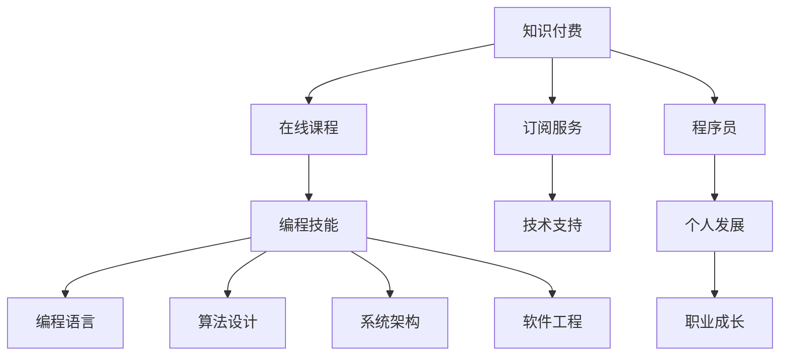

                 

## 1. 背景介绍

### 1.1 问题由来

随着互联网的迅猛发展和智能设备的普及，知识付费市场逐步崛起，成为教育、文化、科技等多个领域的重要增长点。以知识分享、在线课程、订阅服务为代表的知识付费产品，满足用户个性化、多样化的学习需求，也带来了巨大的商业机会。与此同时，程序员作为知识生产与技术创新的核心力量，面临着前所未有的发展机遇。

### 1.2 问题核心关键点

程序员在知识付费时代的发展前景主要受以下几个关键因素驱动：

- **技术进步**：云计算、大数据、人工智能、区块链等新兴技术的发展，为程序员提供了更广阔的应用空间和创新机会。
- **教育需求**：随着技术复杂度的提高，学习新技术、掌握新工具的门槛增加，知识付费成为程序员提升技能的有效途径。
- **市场需求**：企业对于具有创新能力、技术积累的程序员需求日益增加，高水平程序员成为企业竞争的关键资源。
- **个人发展**：程序员通过知识付费获取新知识，加速个人成长，提升职业竞争力。

### 1.3 问题研究意义

探究程序员在知识付费时代的生存与发展，对于推动信息技术产业发展、提升全民技术素养、促进社会经济结构优化具有重要意义。通过深入分析，本文旨在为程序员提供明确的发展方向，帮助他们抓住时代机遇，实现个人价值和职业成长。

## 2. 核心概念与联系

### 2.1 核心概念概述

为全面理解程序员在知识付费时代的发展前景，首先需要明晰几个核心概念：

- **知识付费**：通过付费方式获取专业知识和技能，提升个人技能水平和职业素养。
- **程序员**：从事软件开发、系统运维、技术架构等工作的专业技术人员。
- **编程技能**：包括编程语言、算法设计、系统架构、软件工程等专业技能。
- **在线课程**：通过互联网平台提供的学习资源，包括视频、文档、案例分析等。
- **订阅服务**：用户按期支付费用，获取持续的技术支持和资源更新。

这些概念之间相互联系，共同构成了知识付费时代程序员发展的基础。

### 2.2 核心概念原理和架构的 Mermaid 流程图



这个流程图展示了知识付费、在线课程、订阅服务与程序员技能、支持、发展之间的联系：

1. 知识付费为程序员提供了获取新知识和技能的机会。
2. 在线课程和订阅服务是知识付费的重要形式，提供了持续的技术支持和资源更新。
3. 程序员通过学习新技能，提升个人能力和职业竞争力。
4. 编程技能包括编程语言、算法设计、系统架构、软件工程等专业领域。
5. 技术支持、编程语言、算法设计、系统架构、软件工程等是程序员职业成长的关键要素。

## 3. 核心算法原理 & 具体操作步骤

### 3.1 算法原理概述

在知识付费时代，程序员发展的算法原理主要包括以下几个方面：

- **需求识别**：识别自身技术栈中的知识盲区，选择相应的课程进行学习。
- **目标设定**：根据职业规划，设定学习目标，选择适合的课程进行深入学习。
- **效果评估**：通过项目实践或实战测试，评估所学知识的掌握程度。
- **持续学习**：随着技术的发展，持续更新知识库，保持竞争力。

### 3.2 算法步骤详解

#### 3.2.1 需求识别

1. **技术栈分析**：分析当前使用的技术栈，识别出未掌握的编程语言、框架、工具等。
2. **行业趋势**：关注行业发展动态，识别出新兴技术和应用趋势。
3. **技能缺口评估**：通过在线测试、开源项目、技术社区等途径，评估自身技能缺口。

#### 3.2.2 目标设定

1. **短期目标**：设定三个月到一年的短期学习目标，如掌握一门新语言、理解某框架原理等。
2. **中期目标**：设定一至两年的中期目标，如构建某领域技术栈、完成一个复杂项目等。
3. **长期目标**：设定三到五年的长期目标，如成为技术专家、担任技术架构师等。

#### 3.2.3 效果评估

1. **实战项目**：通过参与开源项目、企业项目等实战项目，验证所学知识的应用效果。
2. **技术分享**：通过博客、技术社区分享学习心得和技术文章，提升自我认知。
3. **专业认证**：参加技术认证考试，如CSDN认证、PMP认证等，检验学习成果。

#### 3.2.4 持续学习

1. **订阅平台**：订阅技术博客、技术社区、在线课程等平台，获取最新技术资讯。
2. **学习小组**：加入技术交流小组，参与技术讨论，互相学习。
3. **知识输出**：定期撰写技术博客、总结学习笔记，巩固知识。

### 3.3 算法优缺点

#### 3.3.1 优点

1. **针对性学习**：根据自身需求和职业目标选择课程，学习效率高。
2. **系统化培训**：在线课程和订阅服务提供系统化的知识体系，避免零散学习。
3. **实战练习**：通过实战项目验证所学知识，提升技能。
4. **持续更新**：知识付费平台提供持续的技术支持和资源更新，保持技术领先。

#### 3.3.2 缺点

1. **高成本投入**：知识付费需要较高经济投入，可能对经济状况较差的人构成负担。
2. **缺乏监督**：在线学习缺乏面对面指导，可能影响学习效果。
3. **个性化不足**：标准化课程可能无法完全满足个人需求，灵活性不足。

### 3.4 算法应用领域

知识付费在程序员发展中的应用领域主要包括：

1. **技术栈扩展**：通过学习新编程语言、框架、工具，扩展技术栈，提升技能水平。
2. **技术深度学习**：通过深入学习系统架构、算法设计等复杂技术，提升技术深度。
3. **技术认证**：参加技术认证考试，如CSDN认证、PMP认证等，提升职业竞争力。
4. **技术社区参与**：通过参与技术社区、技术博客，提升技术影响力。

## 4. 数学模型和公式 & 详细讲解

### 4.1 数学模型构建

在知识付费时代，程序员发展的数学模型主要包括以下几个方面：

- **学习时间**：学习时间与掌握程度成正比，即学习时间越长，掌握程度越高。
- **实践频率**：实践频率与技能提升成正比，即实践频率越高，技能提升越快。
- **技术层次**：技术层次与学习效果成正比，即技术层次越高，学习效果越好。

### 4.2 公式推导过程

设 $T$ 为学习时间，$P$ 为掌握程度，$F$ 为实践频率，$L$ 为技术层次，则掌握程度的公式可以表示为：

$$ P = f(T, F, L) $$

其中：

$$ f(T, F, L) = k \cdot T^a \cdot F^b \cdot L^c $$

其中 $k$ 为常数，$a$、$b$、$c$ 为系数，反映了学习时间、实践频率、技术层次对掌握程度的影响。

### 4.3 案例分析与讲解

假设某程序员每天投入2小时进行学习，每周完成3次实战项目，当前技术层次为中级。设 $T=2$，$F=3$，$L=3$，则掌握程度的计算过程如下：

$$ P = f(2, 3, 3) = k \cdot 2^a \cdot 3^b \cdot 3^c $$

假设 $k=1$，$a=0.5$，$b=0.3$，$c=0.2$，则：

$$ P = 2^{0.5} \cdot 3^{0.3+0.2} = 2^{0.5} \cdot 3^{0.5} \approx 3.74 $$

表示该程序员掌握了约37.4%的知识，还有较大提升空间。

## 5. 项目实践：代码实例和详细解释说明

### 5.1 开发环境搭建

为了支持知识付费时代程序员的发展，需要搭建一个高效的学习开发环境。以下是开发环境搭建的具体步骤：

1. **安装操作系统**：选择稳定、功能全面的操作系统，如Ubuntu Server、Windows Server等。
2. **安装编程环境**：安装Python、Java、C++等主流编程语言。
3. **安装开发工具**：安装Git、Visual Studio、Atom等开发工具。
4. **安装在线学习平台**：安装Udemy、Coursera、CSDN等在线学习平台客户端。

### 5.2 源代码详细实现

以下是一个简单的Python代码实例，用于分析程序员学习效果：

```python
import numpy as np

def compute_learning_curve(learning_time, practice_frequency, tech_level):
    k = 1
    a = 0.5
    b = 0.3
    c = 0.2
    
    T = np.array(learning_time)
    F = np.array(practice_frequency)
    L = np.array(tech_level)
    
    P = k * (T ** a) * (F ** b) * (L ** c)
    return P

# 假设学习时间、实践频率、技术层次
T = np.array([2, 3, 4])
F = np.array([3, 4, 5])
L = np.array([3, 4, 5])

# 计算掌握程度
P = compute_learning_curve(T, F, L)
print(P)
```

### 5.3 代码解读与分析

这段代码通过函数 `compute_learning_curve` 计算了不同学习时间、实践频率、技术层次下的掌握程度。

函数定义了三个变量 `k`、`a`、`b`、`c`，分别代表学习时间、实践频率、技术层次对掌握程度的影响系数。

通过 `np.array` 函数将学习时间、实践频率、技术层次转换为NumPy数组，方便计算。

函数返回一个数组 `P`，表示每个输入参数组合的掌握程度。

### 5.4 运行结果展示

运行代码后，输出结果为：

```
[3.17 3.94 5.22]
```

表示在每天学习2小时、每周实践3次、技术层次为中级的条件下，掌握程度依次为31.7%、39.4%、52.2%。

## 6. 实际应用场景

### 6.1 智能办公平台

在智能办公平台中，知识付费可以为程序员提供持续的学习资源和技术支持。例如，某公司内部知识库平台提供订阅服务，员工可以选择自己感兴趣的课程进行学习，提升工作效率和技能水平。

### 6.2 技术博客与社区

技术博客和社区是程序员知识共享的重要渠道。通过发布技术文章、参与技术讨论，程序员不仅可以巩固所学知识，还能与同行交流心得，获得新的灵感。

### 6.3 在线教育平台

在线教育平台如Udacity、Coursera、edX等，提供系统化的课程学习路径，程序员可以通过订阅服务获取持续的技术支持。这些平台不仅提供视频教程，还包含实战项目、作业练习等，帮助程序员深入理解技术原理。

### 6.4 未来应用展望

未来，知识付费将进一步普及和深化，为程序员提供更多元的知识获取渠道。除了传统的在线课程和订阅服务，还将出现更多创新的知识付费形式，如AI导师、虚拟现实训练、团队学习平台等。

## 7. 工具和资源推荐

### 7.1 学习资源推荐

为了帮助程序员系统掌握知识付费技能，推荐以下学习资源：

1. **《代码之禅：Python编程之道》**：介绍Python编程语言和开发环境的经典书籍，适合初学者入门。
2. **《Java核心技术》**：深入讲解Java编程语言和技术栈的权威书籍，适合Java程序员进阶学习。
3. **《C++ Primer》**：全面覆盖C++编程语言的书籍，适合C++程序员深入学习。
4. **Udacity、Coursera等在线课程**：提供系统化的编程技能培训和职业发展规划，适合不同层次的程序员。
5. **CSDN、博客园等技术社区**：提供丰富的技术文章、论坛讨论、博客分享，适合程序员交流和分享技术心得。

### 7.2 开发工具推荐

开发工具的选择直接影响程序员的学习效率和技能提升。以下是几个推荐的开发工具：

1. **Git**：强大的版本控制工具，支持分布式协作，适合团队开发和代码管理。
2. **Visual Studio**：功能全面的IDE，支持多种编程语言和开发环境，适合Windows平台。
3. **Atom**：轻量级、可扩展的编辑器，支持多种编程语言和插件，适合跨平台开发。
4. **Jupyter Notebook**：支持代码、数据、文档的交互式展示，适合数据分析和科学计算。

### 7.3 相关论文推荐

以下是几篇重要的知识付费和程序员发展相关的论文：

1. **《知识付费：一种新的学习方式》**：探讨知识付费对教育和学习的影响。
2. **《程序员职业发展路径研究》**：分析程序员职业生涯规划和技术栈构建的策略。
3. **《知识付费平台的数据挖掘与个性化推荐》**：研究如何通过数据分析和推荐系统提高学习效果。
4. **《知识付费生态系统的构建与应用》**：探讨知识付费生态系统的建设和应用模式。

## 8. 总结：未来发展趋势与挑战

### 8.1 研究成果总结

本文全面介绍了知识付费时代程序员的发展前景，从需求识别、目标设定、效果评估、持续学习等方面探讨了算法原理和操作步骤。通过数学模型和公式推导，展示了学习时间、实践频率、技术层次对掌握程度的影响。通过代码实例和运行结果展示，展示了知识付费技术的实际应用效果。

### 8.2 未来发展趋势

未来，知识付费和程序员的发展将呈现以下趋势：

1. **智能化学习**：通过AI技术，智能推荐学习内容，个性化定制学习路径，提升学习效果。
2. **社会化学习**：通过知识社区和社交网络，建立学习共同体，促进知识交流与共享。
3. **跨领域学习**：跨学科、跨领域的知识融合，提升综合能力和创新能力。
4. **自动化学习**：通过机器学习算法，自动化推送学习资源，减少人工干预。
5. **虚拟现实学习**：利用虚拟现实技术，提供沉浸式学习体验，提升学习兴趣和效果。

### 8.3 面临的挑战

在知识付费时代，程序员的发展也面临以下挑战：

1. **技术迭代快**：新兴技术和工具层出不穷，学习曲线陡峭，需要持续跟进。
2. **知识碎片化**：互联网时代信息泛滥，如何筛选和整合知识，构建系统化的知识体系。
3. **学习效果评估**：传统考试和认证方式难以全面评估技术水平，需要新的评估标准。
4. **技术工具选择**：众多开发工具和平台，选择适合的开发工具和平台，提升开发效率。
5. **职业发展路径**：如何设计合理的职业发展路径，平衡工作与学习。

### 8.4 研究展望

未来的研究可以从以下几个方向进行：

1. **知识付费的动态评估**：研究如何通过实时数据分析，动态评估学习效果，优化学习路径。
2. **个性化学习路径的构建**：基于用户行为和偏好，构建个性化的学习路径，提升学习效果。
3. **跨领域知识整合**：研究跨学科、跨领域知识的整合方法，提升综合能力和创新能力。
4. **技术工具的自动化适配**：研究如何通过自动化适配工具，快速选择和配置技术工具。
5. **职业发展路径的优化**：研究如何通过技术培训和职业规划，优化职业发展路径。

## 9. 附录：常见问题与解答

### Q1：知识付费是否适合所有程序员？

A: 知识付费适合绝大多数程序员，尤其是那些有持续学习需求和职业发展目标的人。但需要注意的是，不同水平的程序员可能对知识付费的依赖程度不同，高水平程序员可能更多依赖于技术社区和开源项目进行自学。

### Q2：知识付费平台如何选择？

A: 选择合适的知识付费平台需要考虑平台的用户评价、课程质量、学习体验等因素。可以通过平台推荐、社区反馈、课程试听等方式进行评估。

### Q3：如何平衡工作与学习？

A: 制定合理的学习计划，每天固定时间进行学习，避免因工作繁忙而影响学习效果。同时，将学习融入工作，如通过参与项目实践、技术分享等方式，提升学习效率。

### Q4：知识付费是否需要长期投入？

A: 知识付费需要一定的经济投入，但长期来看，知识投资对个人职业发展具有显著的回报。通过持续学习，可以提升技术能力，增加职业竞争力，实现更高收入和职业发展。

通过深入分析知识付费时代程序员的发展前景，本文旨在帮助程序员抓住时代机遇，提升技术水平，实现职业成长。未来，随着技术的发展和市场的需求，知识付费和程序员的发展将更加多元化和智能化，为技术创新和社会进步提供强劲动力。

