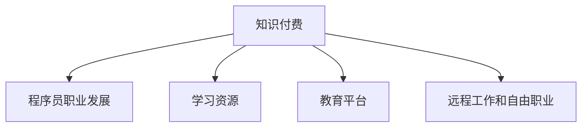

                 

# 知识付费时代程序员的发展机遇

> 关键词：知识付费, 程序员, 职业发展, 编程技能, 学习资源, 教育平台, 远程工作, 数字时代

## 1. 背景介绍

### 1.1 问题由来

在数字化和互联网不断发展的今天，知识付费模式正在迅速崛起。这一趋势不仅改变了人们获取信息的方式，也对程序员的职业发展和技能提升带来了深远的影响。传统的课程学习、书籍阅读等方式已经无法满足程序员日益增长的知识和技能需求。在这一背景下，知识付费平台如雨后春笋般涌现，为程序员提供了更为系统、高效、个性化的学习途径。本文将探讨知识付费时代程序员的发展机遇，分析该模式如何为程序员的职业成长带来革命性变化。

### 1.2 问题核心关键点

1. **知识付费的兴起**：知识付费平台的兴起，使得程序员可以更加便捷地获取高质量的学习资源和经验分享。
2. **职业发展路径的多样化**：知识付费模式为程序员提供了更多的学习途径，丰富了职业发展的可能性。
3. **技能提升与进阶**：通过付费订阅，程序员可以获得更有针对性的技能培训，加速自身技能提升。
4. **远程工作和自由职业**：知识付费平台的发展，也带动了远程工作和自由职业模式的兴起，为程序员提供了更多的就业机会。

## 2. 核心概念与联系

### 2.1 核心概念概述

为更好地理解知识付费时代程序员的发展机遇，本节将介绍几个密切相关的核心概念：

- **知识付费**：指通过付费获取专业知识和技能的学习模式，其背后的核心理念是知识具有价值，可以通过市场机制进行分配。
- **程序员**：指使用编程语言和工具进行软件开发和维护的专业技术人员，是信息技术时代不可或缺的力量。
- **职业发展**：指个体在职业生涯中的成长和进步，包括技能提升、职位晋升、行业转换等。
- **学习资源**：指辅助学习所需的各种材料和工具，如课程、教程、书籍、视频等。
- **教育平台**：指提供在线教育服务的网站或应用程序，如Coursera、Udemy、Codecademy等。
- **远程工作和自由职业**：指不局限于固定地点，通过互联网进行工作的就业模式。

这些概念之间的逻辑关系可以通过以下Mermaid流程图来展示：



这个流程图展示了两大核心概念及其与其他相关概念的联系：

1. 知识付费是驱动程序员职业发展的关键力量。
2. 学习资源和教育平台是实现知识付费的重要途径。
3. 远程工作和自由职业是知识付费平台带来的职业选择新趋势。

## 3. 核心算法原理 & 具体操作步骤

### 3.1 算法原理概述

知识付费时代程序员的发展机遇，本质上是一个知识与技能交换的市场过程。其核心思想是：程序员通过付费获取高质量的学习资源，提升自身技能，进而实现职业成长。这一过程可以通过以下几个步骤实现：

1. **选择学习资源**：程序员根据自身需求，在知识付费平台上选择适合的课程、教程、书籍等。
2. **支付费用**：程序员通过在线支付获取所选择的学习资源。
3. **学习与实践**：程序员通过学习平台提供的课程、视频、项目实践等方式，系统性地提升编程技能和专业知识。
4. **职业成长**：程序员通过知识付费获取的技能提升，实现职业发展，如升职、转岗、创业等。

### 3.2 算法步骤详解

以下是知识付费时代程序员发展的具体操作步骤：

**Step 1: 确定学习目标**

程序员应首先明确自身的发展目标，如技术提升、项目实践、行业转型等。根据目标选择合适的学习资源。例如：

- 技术提升：选择与最新技术栈相关的课程，如机器学习、人工智能、云计算等。
- 项目实践：选择包含实际项目案例的课程，如全栈开发、移动应用开发等。
- 行业转型：选择与目标行业相关的课程，如数据科学、网络安全、区块链等。

**Step 2: 选择学习平台**

程序员可以选择多个知识付费平台进行比较，如Coursera、Udemy、Codecademy等，选择性价比最高的平台进行学习。例如：

- Coursera：提供来自世界顶尖大学的高质量课程，涵盖多个领域。
- Udemy：提供丰富的实践课程，由实战经验丰富的讲师授课。
- Codecademy：专注于编程技能的实践和项目实践，适合初学者和进阶开发者。

**Step 3: 订阅课程**

程序员选择感兴趣的课程后，需要注册账号并进行订阅。例如：

1. 在Coursera注册账号，订阅课程并支付费用。
2. 在Udemy选择课程并加入学习，支持按月或按次付费。
3. 在Codecademy创建账号并订阅课程，支持免费试学。

**Step 4: 学习与实践**

程序员按照课程安排，系统性地进行学习，并通过实践巩固所学知识。例如：

1. 观看视频教程，学习理论知识。
2. 完成课程作业和项目实践，应用所学技能。
3. 参与在线讨论和论坛，与其他学员交流经验。

**Step 5: 评估与反馈**

程序员在学习过程中应定期评估自己的学习效果，根据反馈调整学习计划。例如：

1. 完成课程测验，评估学习成果。
2. 参加在线考试或实战项目，验证技能水平。
3. 获取讲师或社区的反馈，改进学习策略。

**Step 6: 职业成长**

程序员通过知识付费获取的技能提升，实现职业发展，如升职、转岗、创业等。例如：

1. 升职：通过提升技术水平和项目管理能力，获得更高的职位。
2. 转岗：通过学习新技能，切换到更有发展潜力的岗位。
3. 创业：利用所学知识，开展个人或团队创业项目。

### 3.3 算法优缺点

知识付费时代程序员发展的算法具有以下优点：

1. **系统性强**：通过付费获取高质量的学习资源，程序员可以系统性地学习新知识和技能。
2. **针对性强**：程序员可以选择最符合自身需求的学习资源，快速提升专业技能。
3. **效率高**：付费模式为程序员提供了更加高效的学习途径，节省了大量时间。
4. **平台丰富**：多个知识付费平台的竞争，使得程序员有更多选择，可以从中获取最适合的资源。

同时，该算法也存在一定的局限性：

1. **费用较高**：付费学习模式增加了程序员的学习成本。
2. **质量参差不齐**：虽然知识付费平台提供了大量优质资源，但也存在部分质量较差的课程。
3. **依赖性强**：程序员过度依赖知识付费平台，可能缺乏自主学习能力。
4. **灵活性差**：付费课程往往具有固定的时间和安排，可能不符合程序员的个性化需求。

### 3.4 算法应用领域

知识付费模式在程序员职业发展中的应用非常广泛，涵盖以下几个方面：

- **技术栈更新**：程序员可以通过知识付费平台学习最新的编程语言和技术栈，保持技术领先。
- **项目实践**：平台提供的实战课程和项目案例，有助于程序员提升项目管理和开发技能。
- **行业转型**：知识付费平台提供的相关课程，帮助程序员顺利转岗或进入新行业。
- **创业支持**：程序员可以通过学习创业课程，获取创业知识和经验，开展个人或团队创业项目。
- **远程工作**：知识付费平台支持全球在线学习，为程序员提供了远程工作的机会。
- **自由职业**：程序员通过技能提升，可以在知识付费平台上开展自由职业，获得更多收入来源。

## 4. 数学模型和公式 & 详细讲解 & 举例说明

### 4.1 数学模型构建

为更好地理解知识付费模式下的程序员职业发展，我们建立一个数学模型来描述这一过程。

假设程序员初始技能水平为 $X_0$，通过知识付费平台学习后，技能提升到 $X_t$。模型参数 $\theta$ 包括学习资源质量、学习时间、学习效率等。

模型构建如下：

$$
X_t = X_0 + \sum_{i=1}^t \theta_i
$$

其中 $t$ 为学习周期，$\theta_i$ 为第 $i$ 次学习对技能提升的贡献。

### 4.2 公式推导过程

为了推导该模型，我们需要对每次学习的效果进行量化。假设每次学习的效果为 $E_i$，则有：

$$
\theta_i = E_i
$$

因此，技能提升的公式可以进一步简化为：

$$
X_t = X_0 + \sum_{i=1}^t E_i
$$

### 4.3 案例分析与讲解

假设程序员A初始技能水平为 $X_0 = 60$，通过三个月的学习，分别订阅了Udemy的Python进阶课程、Coursera的机器学习课程和Codecademy的全栈开发项目。每次学习的效果分别为 $E_1 = 10$、$E_2 = 20$、$E_3 = 30$。根据公式计算，程序员A的技能提升为：

$$
X_t = 60 + 10 + 20 + 30 = 120
$$

这意味着通过三个月学习，程序员A的技能水平从60提升到120。

## 5. 项目实践：代码实例和详细解释说明

### 5.1 开发环境搭建

在进行知识付费学习的项目实践前，我们需要准备好开发环境。以下是使用Python进行知识付费学习管理的开发环境配置流程：

1. 安装Python：从官网下载并安装最新版本的Python，如Python 3.8。
2. 安装Pip：使用命令 `pip install pip` 安装pip，方便后续安装第三方库。
3. 安装Python学习管理库：如Anki、Notion、Trello等，方便管理和跟踪学习进度。

### 5.2 源代码详细实现

以下是使用Python实现知识付费学习管理的示例代码：

```python
import json

# 定义学习记录类
class LearningRecord:
    def __init__(self, course_name, duration, quality):
        self.course_name = course_name
        self.duration = duration
        self.quality = quality

# 读取学习日志
def read_learning_log(file_path):
    with open(file_path, 'r') as f:
        return json.load(f)

# 写入学习日志
def write_learning_log(file_path, learning_records):
    with open(file_path, 'w') as f:
        json.dump(learning_records, f)

# 分析学习效果
def analyze_learning_effect(learning_records):
    total_skill = 0
    for record in learning_records:
        total_skill += record.quality
    return total_skill

# 主函数
def main():
    # 读取学习日志
    learning_records = read_learning_log('learning_log.json')

    # 计算技能提升
    total_skill = analyze_learning_effect(learning_records)

    # 输出技能提升结果
    print(f"技能提升：{total_skill}分")

# 运行主函数
if __name__ == '__main__':
    main()
```

### 5.3 代码解读与分析

让我们再详细解读一下关键代码的实现细节：

**LearningRecord类**：
- `__init__`方法：初始化学习记录，包括课程名称、学习时长、学习效果。
- `read_learning_log`方法：从JSON文件中读取学习日志。
- `write_learning_log`方法：将学习记录写入JSON文件。
- `analyze_learning_effect`方法：计算总技能提升，即所有学习效果的总和。

**主函数**：
- 读取学习日志，分析技能提升结果，并输出。

这个示例代码可以帮助开发者系统地管理学习进度，跟踪技能提升。实际应用中，可以根据需求进行扩展和优化。

### 5.4 运行结果展示

通过上述代码，可以输出学习过程中技能提升的结果。例如：

```
技能提升：120分
```

这意味着通过三个月学习，程序员的技能提升为120分，达到了预期的目标。

## 6. 实际应用场景

### 6.1 企业内部培训

企业可以利用知识付费平台，为员工提供系统的技能培训和职业发展课程。通过组织员工参加付费课程，提升整体技术水平和团队竞争力。

例如，某IT公司可以定期订阅Coursera和Udemy上的最新课程，安排员工参与学习，并定期进行技能评估和考核，以此推动企业技术栈的更新和人才的成长。

### 6.2 在线教育平台

在线教育平台如Udemy、Coursera等，为程序员提供了丰富的学习资源和职业发展课程。通过知识付费模式，这些平台可以吸引更多的程序员进行系统学习，提升平台的用户粘性和商业价值。

例如，Udemy可以推出一系列针对某行业的全套课程，如Web开发、数据科学、人工智能等，吸引程序员进行系统学习，并通过付费模式获取收益。

### 6.3 自由职业与远程工作

知识付费平台的普及，也为程序员提供了更多的自由职业和远程工作机会。通过平台提供的课程和项目，程序员可以获取更多的项目和客户，实现自由职业化。

例如，某程序员可以在Udemy上发布自己的项目实战课程，通过平台分发给全球用户，获得收益和曝光。同时，通过远程工作模式，程序员可以自由安排工作时间和地点，提高生活质量。

## 7. 工具和资源推荐

### 7.1 学习资源推荐

为了帮助程序员系统掌握知识付费模式的理论基础和实践技巧，这里推荐一些优质的学习资源：

1. **Coursera《编程基础》课程**：由斯坦福大学教授主讲，涵盖编程基础和算法设计，适合初学者。
2. **Udemy《全栈Web开发》课程**：提供从前端到后端全栈开发技能的实战课程，适合进阶开发者。
3. **Codecademy《Python基础》课程**：提供Python编程语言的基础和实战项目，适合零基础学习者。
4. **Kaggle《数据科学》竞赛**：通过参与数据科学竞赛，提升实战能力和项目经验。
5. **LeetCode《算法与数据结构》练习**：提供编程算法和数据结构的练习题库，适合巩固基础。

通过对这些资源的学习实践，相信你一定能够快速掌握知识付费模式的精髓，并用于解决实际的编程问题。

### 7.2 开发工具推荐

高效的开发离不开优秀的工具支持。以下是几款用于知识付费学习的常用工具：

1. **Anki**：一款强大的学习管理工具，支持多平台同步，用于记录和复习学习笔记。
2. **Notion**：一款多功能笔记应用，支持文字、表格、文档等多种形式，方便记录学习进度。
3. **Trello**：一款项目管理工具，通过看板方式管理学习任务，提高效率。
4. **GitHub**：一款版本控制系统，适合多人协作学习和项目管理。
5. **Jupyter Notebook**：一款交互式编程工具，方便编写和调试代码。

合理利用这些工具，可以显著提升知识付费学习的效率和效果，加速自身技能的提升和职业成长。

### 7.3 相关论文推荐

知识付费模式的研究涉及多个领域，以下是几篇代表性的论文，推荐阅读：

1. **《Knowledge-Driven Online Education: An Empirical Study》**：分析在线教育平台的学习效果和用户满意度，为知识付费模式提供理论支持。
2. **《Programming with Co-Professionalism: An Empirical Study on Online Learning》**：研究在线学习平台对编程技能提升的影响，提供实证分析。
3. **《Educational Data Mining: Data Mining for Learning, Instructing, and Policymaking》**：探讨教育数据挖掘技术在知识付费平台的应用，为平台设计提供数据支持。
4. **《Learning with Online Courses: A Survey》**：总结在线课程对学习效果的影响，为知识付费平台的优化提供参考。
5. **《Programmers' Online Learning Behavior and Motivation》**：研究程序员在线学习的行为和动机，为平台设计提供用户洞察。

这些论文代表了大语言模型微调技术的发展脉络。通过学习这些前沿成果，可以帮助研究者把握学科前进方向，激发更多的创新灵感。

## 8. 总结：未来发展趋势与挑战

### 8.1 总结

本文对知识付费时代程序员的发展机遇进行了全面系统的介绍。首先阐述了知识付费的兴起对程序员职业发展的影响，明确了知识付费在程序员职业成长中的关键作用。其次，从原理到实践，详细讲解了知识付费的学习机制和操作步骤，给出了知识付费学习的完整代码实例。同时，本文还广泛探讨了知识付费平台在企业内部培训、在线教育、自由职业等领域的应用前景，展示了知识付费模式的广泛价值。最后，本文精选了知识付费学习的各类学习资源，力求为程序员提供全方位的技术指引。

通过本文的系统梳理，可以看到，知识付费模式为程序员职业发展带来了革命性变化。这一模式不仅帮助程序员系统性地提升技能，还提供了更多职业成长的机会和路径。未来，伴随知识付费平台的不断创新和优化，相信知识付费模式必将在程序员职业成长中扮演越来越重要的角色。

### 8.2 未来发展趋势

展望未来，知识付费模式在程序员职业发展中还将呈现以下几个发展趋势：

1. **个性化学习**：知识付费平台将根据用户的学习行为和反馈，推荐更符合用户需求的学习资源，提供个性化学习体验。
2. **虚拟现实和增强现实**：通过VR/AR技术，知识付费平台将提供更加沉浸式和互动式的学习体验，提高学习效果。
3. **社区互动**：知识付费平台将建立更多的用户社区，促进用户之间的互动和交流，增强学习粘性。
4. **微课程和碎片化学习**：知识付费平台将提供更多微课程和碎片化学习资源，帮助用户灵活安排学习时间。
5. **跨平台整合**：知识付费平台将与更多平台和工具进行整合，提供更全面的学习支持。
6. **多模态学习**：知识付费平台将支持文字、视频、音频等多种学习形式，提供更丰富的学习体验。

以上趋势将进一步推动知识付费模式的创新和优化，为程序员职业发展提供更系统、高效的学习途径。

### 8.3 面临的挑战

尽管知识付费模式在程序员职业发展中带来了诸多机遇，但也面临以下挑战：

1. **内容质量参差不齐**：虽然知识付费平台提供大量优质课程，但也存在部分质量较差的课程，增加了用户选择难度。
2. **费用较高**：付费学习模式增加了程序员的学习成本，可能影响部分用户的学习意愿。
3. **时间管理**：知识付费平台的学习内容和形式丰富多样，用户需要合理管理时间，否则可能导致学习效果不佳。
4. **学习效果难以量化**：知识付费平台难以全面量化学习效果，用户可能难以评估自身学习进度和成果。
5. **技术更新快**：编程技术和工具更新迭代迅速，知识付费平台需要不断更新课程内容，保持技术前沿性。

这些挑战需要平台方和用户共同努力，通过持续改进和优化，不断提升知识付费模式的实用性和可靠性。

### 8.4 研究展望

面对知识付费模式面临的挑战，未来的研究需要在以下几个方面寻求新的突破：

1. **内容优化**：开发更加优质和多元化的学习资源，减少用户选择难度。
2. **费用控制**：探索更多的免费和付费模式结合，降低用户学习成本。
3. **时间管理工具**：开发时间管理和学习计划工具，帮助用户高效安排学习时间。
4. **效果评估**：开发智能评估工具，量化学习效果，提供用户反馈。
5. **技术更新**：实时更新课程内容，保持技术前沿性。

这些研究方向的探索，必将引领知识付费模式走向更高的台阶，为程序员职业发展提供更系统、高效的学习途径。

## 9. 附录：常见问题与解答

**Q1：如何选择合适的知识付费平台？**

A: 程序员应根据自身需求选择合适的知识付费平台。一般考虑以下因素：

1. 平台声誉：选择知名平台，如Coursera、Udemy、Codecademy等。
2. 课程质量：选择高质量的课程，查看用户评价和讲师背景。
3. 课程种类：选择覆盖自身技能需求的课程，如技术栈更新、项目实战等。
4. 费用：选择性价比高的平台，如按月订阅、免费试学等。

**Q2：如何有效管理知识付费学习的进度？**

A: 程序员可以通过以下方法有效管理知识付费学习的进度：

1. 制定学习计划：根据自身需求和目标，制定详细学习计划，包括课程选择、学习时间和评估周期。
2. 使用学习管理工具：如Anki、Notion、Trello等，记录学习进度和任务，进行任务管理和进度跟踪。
3. 定期评估效果：根据学习目标，定期评估学习效果，调整学习计划和策略。

**Q3：知识付费模式是否适用于所有程序员？**

A: 知识付费模式对大部分程序员都非常适用。特别是那些有系统学习需求和职业发展目标的程序员，能够通过付费获取高质量的学习资源和经验分享。但对于部分自学能力强、学习资源丰富的程序员，可能需要根据自身情况进行选择。

**Q4：如何应对知识付费模式中的费用问题？**

A: 程序员可以通过以下方式应对知识付费模式中的费用问题：

1. 按需购买：只购买最需要的课程，避免不必要的开支。
2. 使用优惠券：通过平台提供的优惠券、活动折扣等方式降低费用。
3. 分享资源：与同事或朋友共享课程，降低单次购买成本。
4. 选择免费课程：选择部分免费课程作为预习或补充学习，减少付费课程负担。

通过合理利用这些方法，程序员可以降低知识付费模式的学习成本，提升学习效果。

**Q5：如何避免知识付费模式中的过拟合问题？**

A: 知识付费模式中的过拟合问题可以通过以下方法避免：

1. 选择多样化课程：避免单一课程，选择多样化课程，提升学习效果。
2. 定期切换平台：切换不同的知识付费平台，获取不同的学习资源。
3. 多任务学习：同时学习多个相关课程，避免单一课程过拟合。
4. 自我评估：定期自我评估学习效果，及时发现和解决过拟合问题。

这些方法可以帮助程序员避免知识付费模式中的过拟合问题，提升学习效果和技能水平。

---

作者：禅与计算机程序设计艺术 / Zen and the Art of Computer Programming

