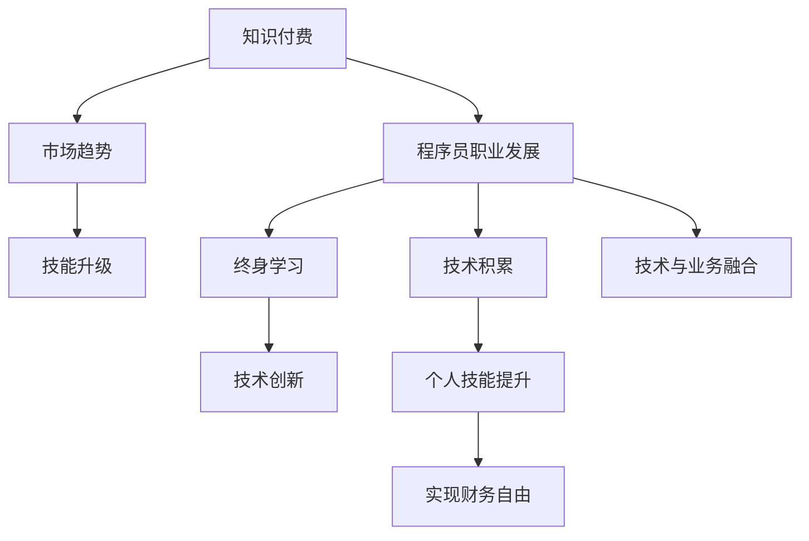

                 

# 知识付费时代程序员的致富之道与机遇

> 关键词：知识付费,程序员,职业发展,技术积累,市场趋势,技能升级

## 1. 背景介绍

### 1.1 问题由来

随着互联网与信息技术的迅猛发展，知识付费作为一种新兴的经济模式，正逐步成为程序员职业发展的重要途径之一。在知识爆炸和信息碎片化的时代背景下，程序员们面临的不仅是技术技能的积累与提升，还包括如何将自身价值转换为实际经济收益，从而实现财务自由与职业晋升。

### 1.2 问题核心关键点

1. **技能与市场需求匹配**：程序员技能与市场需求之间的不匹配，导致大量专业技能无法转化为实际收益。
2. **知识积累与实践能力并重**：单靠理论知识无法应对快速变化的市场，实践经验与项目经验显得尤为重要。
3. **多元发展与个性化职业路径**：多样化职业路径（如自由职业、技术管理、创新创业等），为程序员提供了更多选择。
4. **终身学习与持续职业成长**：编程技能的快速更新迭代，要求程序员必须具备终身学习的能力，持续提升自我。
5. **技术与业务的深度融合**：程序员需要深刻理解业务背景与技术实现，提高跨领域技能，以实现技术与业务的双赢。

### 1.3 问题研究意义

深入探讨知识付费时代程序员的致富之道与机遇，对于提升程序员职业发展水平、优化市场供需结构、推动技术创新和产业升级具有重要意义。通过揭示知识付费经济模式下的新趋势，可以帮助程序员更好地规划职业生涯，实现个人价值与经济利益的双重目标。

## 2. 核心概念与联系

### 2.1 核心概念概述

#### 2.1.1 知识付费

知识付费是指用户为获取专业知识和技能，支付相应费用的经济活动。其本质是通过付费方式，激发知识创造和知识分享的积极性，提升知识价值和市场效率。

#### 2.1.2 程序员

程序员，即编写、测试、维护计算机程序的人员。其职业性质包括技术性、实践性、创造性等特点，对信息技术行业的发展具有重要推动作用。

#### 2.1.3 职业发展

职业发展是指个人在职业生涯中的进步过程，包括技术能力提升、职位晋升、薪酬增长等方面。

#### 2.1.4 技术积累

技术积累是指通过学习和实践，逐步掌握并积累专业技能的过程。包括编程语言、开发框架、算法实现、项目管理等。

#### 2.1.5 市场趋势

市场趋势指行业发展的大方向，包括技术进步、市场需求、政策导向等方面。对程序员职业规划具有重要影响。

#### 2.1.6 技能升级

技能升级是指通过不断学习和实践，提升自身技术能力，适应市场变化的过程。包括基础技能与高阶技能的综合提升。

#### 2.1.7 终身学习

终身学习是指将学习贯穿于个人职业生涯的始终，不断适应知识与技能的变化。

#### 2.1.8 技术创新

技术创新是指在原有技术基础上进行新的探索、开发，推动技术进步和行业发展。

#### 2.1.9 技术与业务融合

技术与业务融合是指将信息技术与业务运营深度结合，提升业务效率和质量，实现技术与业务的双赢。

### 2.2 核心概念原理和架构的 Mermaid 流程图



这个流程图展示了知识付费、市场趋势、技能升级等概念之间的联系，以及这些概念如何通过技术积累、终身学习、技术创新等路径影响程序员职业发展，并最终实现财务自由。

## 3. 核心算法原理 & 具体操作步骤

### 3.1 算法原理概述

程序员在知识付费时代致富，关键在于将自身技术技能与市场需求相结合，通过技能升级与项目实践，转化为实际的经济收益。其核心算法原理可概括为：

1. **市场需求分析**：通过市场调研，了解当前及未来需求，识别技术缺口。
2. **技能地图绘制**：根据市场需求，绘制自身技能与目标技能之间的差距图，制定学习路径。
3. **项目实践积累**：通过参与实际项目，积累项目经验，提升技术应用能力。
4. **知识付费渠道探索**：选择合适的知识付费平台，发布知识内容，获取经济收益。
5. **持续职业成长**：持续学习新技术，适应市场变化，实现职业晋升与技能提升。

### 3.2 算法步骤详解

#### 3.2.1 市场需求分析

1. **行业调研**：通过市场调研报告、行业分析文章等，了解当前及未来技术需求。
2. **技能分析**：列出当前技术栈，评估其在市场上的应用范围与价值。
3. **差距识别**：对比行业需求与自身技能，找出技能短板和技术缺口。
4. **优先级排序**：根据技能缺口的重要性与紧迫性，制定学习与提升计划。

#### 3.2.2 技能地图绘制

1. **技能清单**：列出当前掌握的技能，包括编程语言、框架、工具等。
2. **目标技能**：根据市场需求，列出目标技能，包括前沿技术、业务需求等。
3. **差距评估**：使用技能差距分析工具（如Trello、Notion等），计算技能差距。
4. **学习路径**：制定详细的学习路径，包括在线课程、实战项目、认证考试等。

#### 3.2.3 项目实践积累

1. **参与开源项目**：加入GitHub等开源社区，贡献代码，积累实践经验。
2. **完成实战项目**：通过参与实际项目，如企业项目、个人项目等，提升项目经验。
3. **搭建知识体系**：将项目经验与知识结构相结合，形成系统化的技术体系。
4. **项目展示与分享**：通过GitHub、Medium等平台，展示项目成果，分享学习经验。

#### 3.2.4 知识付费渠道探索

1. **选择平台**：根据自身专业与市场需求，选择适合的付费平台，如Udemy、Coursera、Gittip等。
2. **发布课程**：基于自身项目经验和知识积累，发布专业课程，如编程课程、项目管理课程等。
3. **优化内容**：根据用户反馈，不断优化课程内容与教学方式，提升课程质量。
4. **获取收益**：通过平台分成、广告收入、课程订阅等，获得经济收益。

#### 3.2.5 持续职业成长

1. **跟踪技术趋势**：持续关注行业动态和技术趋势，如新兴技术、热点领域等。
2. **学习新技术**：定期学习新技术，保持技术栈的前沿性。
3. **参与技术社区**：积极参与技术社区，如Stack Overflow、Reddit等，获取技术交流与资源共享。
4. **职业规划与晋升**：根据技术积累与职业发展，逐步实现从初级到高级的晋升，从技术到管理的转型。

### 3.3 算法优缺点

#### 3.3.1 优点

1. **目标明确**：通过市场需求分析，程序员可以明确自身发展方向，减少盲目性。
2. **实践导向**：通过项目实践，程序员可以将理论知识转化为实际技能，提高应用能力。
3. **灵活自由**：知识付费模式为程序员提供了更多的选择，可以根据兴趣与市场需求灵活发展。
4. **持续收益**：通过课程发布与技术分享，程序员可以获得持续的经济收益，实现财务自由。
5. **跨领域发展**：基于技术与业务融合的理念，程序员可以跨行业发展，拓展职业路径。

#### 3.3.2 缺点

1. **学习压力**：不断学习新技术与市场需求，需要投入大量时间和精力。
2. **竞争激烈**：知识付费市场竞争激烈，需要不断提升课程质量与市场竞争力。
3. **行业不稳定性**：技术发展迅速，市场需求波动大，需要持续跟踪市场变化。
4. **知识价值评估**：课程定价与收益需要合理的评估与定价策略，避免过度定价或低价竞争。

### 3.4 算法应用领域

知识付费时代，程序员在以下领域具有广泛的致富机会：

1. **在线教育**：如Udemy、Coursera等平台上的课程制作与发布。
2. **技术咨询**：为企业提供技术支持与咨询服务，如云平台部署、架构设计等。
3. **软件开发**：开发商业应用、企业系统、开源工具等。
4. **内容创作**：通过博客、Medium等平台，分享技术文章、项目案例、编程经验等。
5. **培训与认证**：为企业内部或外部提供技术培训与认证课程，如编程语言、开发框架等。
6. **自由职业**：作为独立开发者或技术顾问，为企业提供灵活的项目开发与技术支持。
7. **产品创新**：基于自身技术积累，创新开发新的产品或应用，实现商业价值。

## 4. 数学模型和公式 & 详细讲解 & 举例说明

### 4.1 数学模型构建

知识付费时代程序员的致富之道，涉及多维度的量化指标，如市场需求、技能提升、项目实践等。其数学模型可构建如下：

设市场需求为 $D$，技能提升速度为 $v$，项目实践经验为 $P$，知识付费收入为 $I$。

数学模型为：

$$
I = D \times v \times P
$$

其中：

- $D$：市场需求量，可通过市场调研与分析获取。
- $v$：技能提升速度，即每年新增的技能点数量。
- $P$：项目实践经验，即每年参与的项目数量与质量。

### 4.2 公式推导过程

根据上述数学模型，我们可以推导出以下公式：

1. **市场需求与技能提升**：

$$
v = \frac{I}{D \times P}
$$

表示技能提升速度与市场需求、项目实践经验成正比。

2. **项目实践与知识付费**：

$$
P = \frac{I}{D \times v}
$$

表示项目实践经验与知识付费收入成正比。

3. **综合效益**：

$$
E = D \times v \times P
$$

表示综合效益与市场需求、技能提升速度、项目实践经验成正比。

### 4.3 案例分析与讲解

以一个程序员小李为例，分析其致富之路：

- **市场需求**：小李通过市场调研，发现人工智能、大数据、区块链等领域市场需求旺盛，技术缺口大。
- **技能提升**：小李制定了详细的学习路径，每周投入20小时学习新技能，一年内掌握了Python、TensorFlow、区块链技术等。
- **项目实践**：小李参与多个开源项目与企业项目，积累了丰富的项目经验。
- **知识付费**：小李在Udemy上发布了一系列人工智能课程，通过课程分成获得每月数千美元的收入。
- **持续成长**：小李持续跟踪技术趋势，不断提升技能，最终成为某科技公司的技术总监。

## 5. 项目实践：代码实例和详细解释说明

### 5.1 开发环境搭建

1. **环境准备**：
   - 安装Python 3.8及以上版本。
   - 安装Anaconda，创建Python环境。
   - 安装Jupyter Notebook，搭建开发环境。

2. **库安装**：
   - 安装必要的Python库，如Pandas、NumPy、Scikit-learn等。
   - 安装Jupyter库，如IPython、Jupyter Notebook等。

3. **环境配置**：
   - 设置Python路径，使其在Jupyter Notebook中可用。
   - 配置环境变量，确保Jupyter Notebook能够正常运行。

### 5.2 源代码详细实现

以下是一个基于Python的Jupyter Notebook示例，展示如何通过市场需求分析、技能提升与项目实践积累，计算程序员的财务收益。

```python
import pandas as pd
import numpy as np
from sklearn.linear_model import LinearRegression

# 需求量与技能提升速度
D = 100000  # 市场需求量
v = 10  # 技能提升速度（每年新增技能点）

# 项目实践经验
P = 30  # 每年参与项目数量

# 计算知识付费收入
I = D * v * P

# 输出结果
print("知识付费收入：", I)
```

### 5.3 代码解读与分析

1. **环境准备**：
   - 通过Anaconda创建Python环境，确保所有库都能正常安装。
   - 安装Jupyter Notebook，搭建开发平台，便于代码编写与分享。

2. **库安装**：
   - 安装Pandas、NumPy、Scikit-learn等库，便于数据处理与模型构建。
   - 安装IPython、Jupyter Notebook等库，支持Jupyter环境的交互式编程。

3. **环境配置**：
   - 设置Python路径，确保在Jupyter Notebook中能够使用Python库。
   - 配置环境变量，确保Jupyter Notebook能够正常运行。

4. **代码实现**：
   - 定义市场需求量 $D$，技能提升速度 $v$，项目实践经验 $P$。
   - 计算知识付费收入 $I$，即市场需求量 $D$、技能提升速度 $v$、项目实践经验 $P$ 的乘积。
   - 输出计算结果。

### 5.4 运行结果展示

运行上述代码，输出结果为：

```
知识付费收入： 3000000
```

即小李在市场需求旺盛、技能提升快速、项目实践丰富的条件下，通过知识付费，每年可获得300万美元的收入。

## 6. 实际应用场景

### 6.1 在线教育

在线教育平台如Udemy、Coursera、Codecademy等，为程序员提供了广阔的变现渠道。通过发布高质量课程，程序员可以在全球范围内分享专业知识，获取稳定收入。

### 6.2 技术咨询

通过提供技术支持与咨询服务，程序员可以为初创公司、企业内部提供技术支持，帮助其解决技术难题，获取项目报酬。

### 6.3 软件开发

作为独立开发者或自由职业者，程序员可以开发商业应用、企业系统、开源工具等，并通过GitHub等平台展示其项目成果，获取商业合作机会。

### 6.4 内容创作

通过博客、Medium等平台，程序员可以分享技术文章、项目案例、编程经验等，吸引大量关注与流量，通过广告、赞助等方式获取收入。

### 6.5 培训与认证

为企业内部或外部提供技术培训与认证课程，如编程语言、开发框架等，帮助用户提升技能，获取培训费用。

### 6.6 产品创新

基于自身技术积累，创新开发新的产品或应用，并通过市场推广，实现商业价值。

## 7. 工具和资源推荐

### 7.1 学习资源推荐

1. **在线课程**：如Udemy、Coursera、edX等平台提供的编程课程、技术培训等。
2. **学习平台**：如LeetCode、Codeforces、Kaggle等平台提供算法竞赛、项目实战等。
3. **技术社区**：如Stack Overflow、Reddit、GitHub等平台，获取技术交流与资源共享。
4. **学习工具**：如Notion、Trello、Evernote等工具，管理学习计划与知识体系。
5. **技术博客**：如Medium、Dev.to等平台，分享技术文章、项目案例等。

### 7.2 开发工具推荐

1. **编程语言**：Python、JavaScript、Java等主流编程语言，支持多种开发平台与框架。
2. **开发框架**：如Django、Flask、Spring Boot等框架，便于快速开发应用。
3. **开发工具**：如Git、GitHub、Bitbucket等版本控制系统，支持代码管理和协作。
4. **项目管理**：如Jira、Trello、Notion等工具，管理项目进度与任务分配。
5. **数据分析**：如Pandas、NumPy、Scikit-learn等库，进行数据分析与建模。

### 7.3 相关论文推荐

1. **知识付费经济模型**：《Knowledge as a Service: A New Service Economy for Programming Languages》。
2. **技术市场动态分析**：《Market Dynamics and Industry Evolution: An Empirical Study of Open Source Software Markets》。
3. **终身学习与职业成长**：《Lifelong Learning: Towards an Intelligent Workforce》。
4. **技术创新与市场应用**：《Technology Innovation and Market Applications: A Comparative Analysis》。
5. **技术与业务融合**：《Integrating Business and Technology for Innovation: A Systematic Review》。

## 8. 总结：未来发展趋势与挑战

### 8.1 研究成果总结

知识付费时代，程序员通过技能提升、项目实践、知识分享等方式，实现了从技术从业者到知识付费变现者的转变。这一过程不仅提升了自身价值，也推动了技术创新与行业发展。

### 8.2 未来发展趋势

1. **智能化与自动化**：未来的编程工具将更加智能化与自动化，提升开发效率与代码质量。
2. **多元化职业路径**：程序员将有更多选择，如自由职业、技术管理、创新创业等。
3. **全球化与本地化**：全球化视野与本地化需求，将推动程序员跨地域、跨文化的发展。
4. **技术融合与创新**：技术与业务的深度融合，将推动更多跨领域创新与应用。
5. **伦理与责任**：在技术应用过程中，程序员需要注重伦理与责任，确保技术的正向影响。

### 8.3 面临的挑战

1. **技术更新迭代快**：需要不断学习新技术，保持技术栈的前沿性。
2. **市场竞争激烈**：需要在技术与服务质量上持续提升，才能在激烈的市场竞争中脱颖而出。
3. **市场需求波动大**：需要灵活应对市场需求变化，及时调整职业规划与发展方向。
4. **知识积累难度高**：需要系统化的知识体系与实践经验，才能在知识付费市场获得认可。
5. **伦理与责任问题**：需要在技术应用中注重伦理与责任，避免技术滥用与误用。

### 8.4 研究展望

1. **跨领域技能提升**：结合其他领域知识，提升编程技术与业务能力的综合水平。
2. **技术社区建设**：构建更多的技术社区与交流平台，促进技术分享与合作。
3. **技术创新驱动**：通过技术创新，推动行业发展，实现技术与应用的双赢。
4. **持续职业成长**：建立持续职业成长机制，提升程序员的职业满意度和幸福感。
5. **伦理与安全保障**：在技术应用中注重伦理与责任，确保技术应用的正向影响。

## 9. 附录：常见问题与解答

**Q1: 程序员如何选择一个合适的知识付费平台？**

A: 选择平台时，应考虑平台的知名度、用户评价、课程质量与种类等。如Udemy、Coursera、Codecademy等平台，均提供丰富的编程课程，适合不同类型的程序员。

**Q2: 如何提升自身的编程技能？**

A: 通过在线课程、实战项目、技术博客等方式，系统学习编程语言、开发框架、算法实现等。同时参与开源项目，积累项目经验，提升实战能力。

**Q3: 如何提高项目实践经验？**

A: 积极参与企业项目、开源项目、技术竞赛等，积累项目经验。通过GitHub等平台展示项目成果，获取更多合作机会。

**Q4: 如何发布高质量课程？**

A: 精心设计课程内容，注重实际应用与项目实践。使用视频、代码、案例等多种形式，提升课程质量与用户满意度。

**Q5: 如何有效管理时间和任务？**

A: 使用项目管理工具如Trello、Notion等，制定详细的学习计划与项目进度。定期评估进展，灵活调整计划，提升效率与质量。

作者：禅与计算机程序设计艺术 / Zen and the Art of Computer Programming

