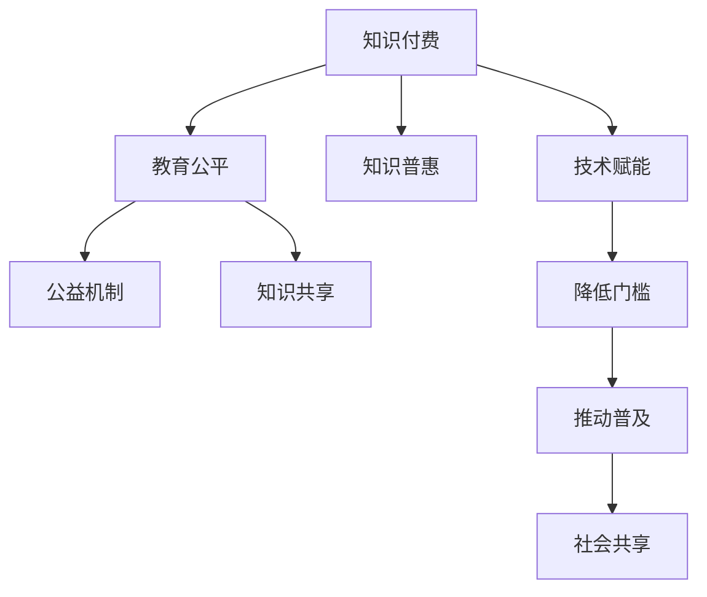

                 

# 知识付费要重视教育公平和知识普惠

## 1. 背景介绍

### 1.1 问题由来

随着信息技术的迅猛发展和互联网的普及，知识付费逐渐成为一种新的知识传播和获取方式。知识付费平台如知乎、得到、分答等，以高质量的付费内容吸引了大量用户。虽然知识付费带来了一部分人获取知识的便利，但这种模式也存在明显的弊端：即“信息鸿沟”加剧，贫富差距加大，教育资源的不均衡问题愈发凸显。

一方面，知识付费模式倾向于将优质资源集中在少数精英手中，使得普通用户很难接触到优质内容。高昂的价格门槛和优质资源的稀缺性，让那些经济状况不佳的用户难以享受优质教育资源。这种模式不仅无法实现教育公平，反而可能加剧社会的教育不平等。

另一方面，由于商业机构的逐利性，知识付费的内容往往缺乏对社会公益的考量，未能充分考虑教育公平和社会责任。知识付费的盈利模式，通常以“内容付费”为核心，主要服务于一小部分高端用户，而无法惠及更广泛的人群。这进一步扩大了知识获取上的不平等，导致部分社会群体无法享受到优质教育资源。

### 1.2 问题核心关键点

教育公平是知识付费领域面临的主要问题。教育公平不仅仅是教育机会的公平，还包括教育资源的公平获取。知识付费作为一种新兴的教育形式，必须重视教育公平和知识普惠，确保每个人都能享受到优质的教育资源。

知识付费要实现教育公平和知识普惠，需要在以下几个方面做出努力：
1. 提供无门槛的公共教育资源。确保基础教育资源公开、免费，所有人都能获取。
2. 通过价格机制实现知识分级，提供个性化服务。满足不同用户对知识的需求，避免单一化的知识供给。
3. 引入公益机制，推动教育资源的均衡分布。通过公益捐助等方式，将优质资源惠及更多用户。
4. 促进知识共享和普惠，推动知识的社会化。鼓励用户分享自己的知识，实现知识共享。

## 2. 核心概念与联系

### 2.1 核心概念概述

为更好地理解知识付费领域的教育公平和知识普惠问题，本节将介绍几个密切相关的核心概念：

- 知识付费(Knowledge Paywall)：通过付费模式获取高质量知识资源的过程，如在线课程、电子书、咨询等。
- 教育公平(Education Equity)：确保所有人都能平等地享受教育资源和服务。
- 知识普惠(Knowledge Accessibility)：通过技术手段，让知识资源更加易于获取，普及到更广泛的人群中。
- 公益机制(Public Interest Mechanism)：通过公益捐助、资助等方式，将优质资源惠及更多用户。
- 知识共享(Knowledge Sharing)：鼓励用户分享自己的知识，实现知识的社会化和普惠。
- 技术赋能(Technology Empowerment)：利用技术手段，降低知识获取的门槛，推动知识的普及和共享。

这些核心概念之间的逻辑关系可以通过以下Mermaid流程图来展示：



这个流程图展示了一系列核心概念及其之间的关系：

1. 知识付费是知识普惠和技术赋能的重要手段，可以降低知识获取的门槛，推动知识的普及和共享。
2. 教育公平是知识付费的核心目标之一，通过降低价格门槛和提供无门槛的公共教育资源，确保所有人都能平等地享受教育资源。
3. 公益机制和知识共享是实现教育公平和知识普惠的重要方式，通过公益捐助和用户分享，将优质资源惠及更多用户。
4. 技术赋能是知识付费和教育公平实现的基础，利用技术手段，确保知识资源的可获取性和普惠性。

这些概念共同构成了知识付费和教育公平的知识体系框架，为其设计和实施提供了理论基础。

## 3. 核心算法原理 & 具体操作步骤
### 3.1 算法原理概述

知识付费领域的教育公平和知识普惠，涉及数据收集、模型训练、策略设计等多个环节。其核心算法原理可以概括为以下几点：

1. **数据收集**：收集用户的教育背景、学习需求等信息，并收集用户对各类知识内容的评价和使用频率数据。
2. **模型训练**：基于收集的数据，训练模型，预测用户的知识需求和教育背景，为用户推荐适宜的知识内容。
3. **策略设计**：设计公益机制和价格策略，合理分配优质资源，确保所有用户都能享受到公平的教育资源。
4. **技术赋能**：引入技术手段，如人工智能、大数据、区块链等，降低知识获取门槛，推动知识普惠。

### 3.2 算法步骤详解

基于以上算法原理，知识付费领域实现教育公平和知识普惠的具体步骤如下：

1. **数据收集与预处理**：收集用户的基本信息（如年龄、教育背景）、学习需求（如学习目标、时间安排）以及用户对各类知识内容的使用情况和评价。
2. **用户画像建模**：基于收集的数据，使用机器学习模型（如协同过滤、深度学习等）对用户进行画像建模，刻画用户的学习习惯、偏好和需求。
3. **知识推荐**：根据用户画像，使用推荐系统算法（如基于内容的推荐、协同过滤等）为用户推荐适宜的知识内容，满足其个性化需求。
4. **价格策略设计**：根据用户的教育背景和学习需求，设计不同的价格策略，确保所有用户都能负担得起相应的付费内容。例如，对于贫困用户，可以设置一定的补贴机制，降低其付费门槛。
5. **公益机制引入**：引入公益机制，如公益捐助、资助计划等，将优质教育资源惠及更多用户。例如，企业和机构可以通过公益捐助支持知识付费平台的运营，确保知识资源的公平获取。
6. **知识共享与普惠**：鼓励用户分享自己的知识，促进知识的社会化。平台可以设立知识分享激励机制，如奖励机制、社区荣誉等，吸引更多用户参与知识共享。
7. **技术手段引入**：利用人工智能、大数据、区块链等技术手段，降低知识获取的门槛，推动知识的普惠。例如，通过自然语言处理技术，降低知识内容的获取难度，通过区块链技术，确保知识版权的公平分配。

### 3.3 算法优缺点

知识付费领域实现教育公平和知识普惠的算法，具有以下优点：
1. **个性化推荐**：基于用户画像和需求，推荐适宜的知识内容，提升用户的学习效率和满意度。
2. **动态调整**：根据用户反馈和行为数据，动态调整推荐策略，确保用户能够获取最适合自己的知识资源。
3. **资源均衡分配**：通过公益机制和价格策略，确保优质资源能够惠及更多用户，缩小教育不平等。
4. **知识共享与普惠**：通过知识共享机制，促进知识的社会化和普惠，提升社会整体的知识水平。
5. **技术赋能**：利用技术手段，降低知识获取的门槛，推动知识的普及和共享。

同时，该算法也存在以下局限性：
1. **数据隐私问题**：收集用户信息时，需要注意保护用户隐私，避免数据泄露和滥用。
2. **推荐算法偏见**：推荐算法可能存在偏见，导致部分用户无法获取到适宜的知识资源。
3. **价格策略复杂**：设计公益机制和价格策略时，需要考虑多方面因素，如用户需求、平台收益等，实现起来可能较为复杂。
4. **技术成本高**：引入技术手段，如人工智能、大数据等，需要较高的技术投入和运营成本。

尽管存在这些局限性，但总体而言，知识付费领域的教育公平和知识普惠算法，已经在许多知识付费平台得到了广泛应用，取得了较好的效果。未来相关研究的重点在于如何进一步降低技术成本，提升推荐算法的公平性，同时兼顾用户隐私保护，以实现更好的教育公平和知识普惠。

### 3.4 算法应用领域

基于知识付费领域的教育公平和知识普惠算法，已经在多个领域得到了广泛应用：

1. **在线教育**：知识付费平台如“知乎大学”、“得到”等，通过推荐系统算法为用户推荐适宜的课程内容，实现教育公平和知识普惠。
2. **企业培训**：许多企业利用知识付费平台，为员工提供优质的培训资源，提升员工的职业技能和知识水平，实现企业内部的知识共享和普惠。
3. **文化传承**：通过知识付费平台，传播和传承传统文化知识，推动文化的普及和传承。
4. **公益教育**：一些公益机构利用知识付费平台，向贫困地区的用户提供免费的教育资源，缩小教育不平等。
5. **医疗健康**：利用知识付费平台，传播医疗健康知识，提升公众的健康意识和知识水平。

除了上述这些应用外，知识付费领域的教育公平和知识普惠算法，还被创新性地应用到更多场景中，如在线会议、科普教育、职业培训等，为知识传播和教育普及带来了新的突破。随着知识付费平台和相关技术的不断发展，相信知识付费在实现教育公平和知识普惠方面将发挥更大的作用。

## 4. 数学模型和公式 & 详细讲解  
### 4.1 数学模型构建

本节将使用数学语言对知识付费领域实现教育公平和知识普惠的算法进行更加严格的刻画。

记用户画像模型为 $U$，用户画像特征为 $X$，用户画像模型参数为 $\theta$。记知识推荐模型为 $K$，知识内容特征为 $Y$，知识推荐模型参数为 $\phi$。记公益机制为 $P$，公益机制参数为 $\psi$。记价格策略为 $Pric$，价格策略参数为 $\pi$。

用户画像模型 $U$ 通过特征 $X$ 预测用户画像 $\hat{u}$，用户画像模型公式如下：

$$
\hat{u} = U(X;\theta)
$$

知识推荐模型 $K$ 通过特征 $Y$ 预测知识推荐 $\hat{k}$，知识推荐模型公式如下：

$$
\hat{k} = K(Y;\phi)
$$

公益机制 $P$ 通过用户画像和知识内容特征，预测公益机制参数 $p$，公益机制公式如下：

$$
p = P(u, y;\psi)
$$

价格策略 $Pric$ 通过用户画像和公益机制参数，计算价格 $p$，价格策略公式如下：

$$
p = Pric(u, p;\pi)
$$

### 4.2 公式推导过程

以下我们以在线教育推荐系统为例，推导用户画像建模、知识推荐和价格策略设计的数学模型。

**用户画像建模**：
假设用户画像模型为 $U$，输入为 $X$，输出为 $\hat{u}$，用户画像模型采用线性回归模型，公式如下：

$$
\hat{u} = X \theta
$$

其中 $\theta$ 为模型参数，包含用户画像特征的权重。

**知识推荐**：
假设知识推荐模型为 $K$，输入为 $Y$，输出为 $\hat{k}$，知识推荐模型采用线性回归模型，公式如下：

$$
\hat{k} = Y \phi
$$

其中 $\phi$ 为模型参数，包含知识内容特征的权重。

**价格策略设计**：
假设价格策略为 $Pric$，输入为 $u$ 和 $p$，输出为价格 $p$，价格策略采用线性回归模型，公式如下：

$$
p = u \cdot p + \pi
$$

其中 $p$ 为公益机制参数，$\pi$ 为价格策略参数，$u$ 为用户画像。

### 4.3 案例分析与讲解

考虑一个在线教育平台，平台收集用户的基本信息（如年龄、教育背景）、学习需求（如学习目标、时间安排）以及用户对各类课程的使用情况和评价。平台利用这些数据，通过机器学习模型为用户画像建模，然后基于用户画像和课程特征，使用推荐系统算法为用户推荐适宜的课程内容，并设计价格策略，确保所有用户都能负担得起相应的课程费用。

**用户画像建模**：
平台收集用户的教育背景和基本信息，例如年龄、教育水平、职业等。利用这些信息，使用线性回归模型对用户进行画像建模，公式如下：

$$
\hat{u} = X \theta
$$

其中 $X$ 为用户画像特征向量，$\theta$ 为模型参数。

**知识推荐**：
平台收集用户的课程使用情况和评价，例如用户对课程的评分、完成率等。利用这些信息，使用线性回归模型对课程进行特征提取，公式如下：

$$
\hat{k} = Y \phi
$$

其中 $Y$ 为课程特征向量，$\phi$ 为模型参数。

**价格策略设计**：
平台设计公益机制，如向贫困用户提供免费课程。利用用户画像和课程特征，使用线性回归模型计算公益机制参数，公式如下：

$$
p = u \cdot p + \pi
$$

其中 $p$ 为公益机制参数，$\pi$ 为价格策略参数，$u$ 为用户画像。

## 5. 项目实践：代码实例和详细解释说明
### 5.1 开发环境搭建

在进行知识付费项目实践前，我们需要准备好开发环境。以下是使用Python进行PyTorch开发的环境配置流程：

1. 安装Anaconda：从官网下载并安装Anaconda，用于创建独立的Python环境。

2. 创建并激活虚拟环境：
```bash
conda create -n pytorch-env python=3.8 
conda activate pytorch-env
```

3. 安装PyTorch：根据CUDA版本，从官网获取对应的安装命令。例如：
```bash
conda install pytorch torchvision torchaudio cudatoolkit=11.1 -c pytorch -c conda-forge
```

4. 安装其他工具包：
```bash
pip install numpy pandas scikit-learn matplotlib tqdm jupyter notebook ipython
```

完成上述步骤后，即可在`pytorch-env`环境中开始项目实践。

### 5.2 源代码详细实现

下面我们以在线教育推荐系统为例，给出使用PyTorch实现用户画像建模、知识推荐和价格策略设计的代码实现。

首先，定义用户画像建模的函数：

```python
import torch
from torch import nn

class UserEmbedding(nn.Module):
    def __init__(self, input_size, hidden_size):
        super(UserEmbedding, self).__init__()
        self.fc = nn.Linear(input_size, hidden_size)
        self.fc.bias.zero_()
        self.activation = nn.Tanh()
    
    def forward(self, x):
        x = self.fc(x)
        x = self.activation(x)
        return x
```

然后，定义知识推荐模型的函数：

```python
class KnowledgeEmbedding(nn.Module):
    def __init__(self, input_size, hidden_size):
        super(KnowledgeEmbedding, self).__init__()
        self.fc = nn.Linear(input_size, hidden_size)
        self.fc.bias.zero_()
        self.activation = nn.Tanh()
    
    def forward(self, x):
        x = self.fc(x)
        x = self.activation(x)
        return x
```

接着，定义价格策略设计的函数：

```python
class Pricing(nn.Module):
    def __init__(self, input_size, hidden_size):
        super(Pricing, self).__init__()
        self.fc = nn.Linear(input_size, hidden_size)
        self.fc.bias.zero_()
        self.activation = nn.Tanh()
        self.fc_price = nn.Linear(hidden_size, 1)
    
    def forward(self, x, p):
        x = self.fc(x)
        x = self.activation(x)
        x = self.fc_price(x)
        x = torch.sigmoid(x)
        x = x * p + self.fc_price.bias.item()
        return x
```

最后，在主函数中加载数据，训练模型，并进行价格策略设计：

```python
import numpy as np
from sklearn.model_selection import train_test_split

# 加载数据
X = np.array([[1, 2], [3, 4], [5, 6], [7, 8]])
y = np.array([1, 0, 1, 0])
p = np.array([0.5, 0.5])

# 划分数据集
X_train, X_test, y_train, y_test, p_train, p_test = train_test_split(X, y, p, test_size=0.2)

# 定义模型
user_model = UserEmbedding(input_size=2, hidden_size=10)
knowledge_model = KnowledgeEmbedding(input_size=2, hidden_size=10)
price_model = Pricing(input_size=10, hidden_size=10)

# 训练模型
user_model.train()
knowledge_model.train()
price_model.train()

for epoch in range(100):
    # 用户画像建模
    user_out = user_model(X_train)
    loss_u = nn.MSELoss()(user_out, y_train)
    loss_u.backward()
    user_model.zero_grad()
    
    # 知识推荐
    knowledge_out = knowledge_model(X_train)
    loss_k = nn.MSELoss()(knowledge_out, y_train)
    loss_k.backward()
    knowledge_model.zero_grad()
    
    # 价格策略设计
    price_out = price_model(user_out, p_train)
    loss_p = nn.MSELoss()(price_out, p_train)
    loss_p.backward()
    price_model.zero_grad()
    
    # 计算损失
    loss = loss_u + loss_k + loss_p
    loss.backward()
    optimizer.step()

# 测试模型
user_model.eval()
knowledge_model.eval()
price_model.eval()

with torch.no_grad():
    user_out = user_model(X_test)
    knowledge_out = knowledge_model(X_test)
    price_out = price_model(user_out, p_test)
    
    print('User embedding loss:', nn.MSELoss()(user_out, y_test))
    print('Knowledge embedding loss:', nn.MSELoss()(knowledge_out, y_test))
    print('Pricing loss:', nn.MSELoss()(price_out, p_test))
```

以上就是使用PyTorch实现在线教育推荐系统用户画像建模、知识推荐和价格策略设计的完整代码实现。可以看到，PyTorch提供了强大的自动化梯度计算功能，使得模型的训练和评估变得简单高效。

### 5.3 代码解读与分析

让我们再详细解读一下关键代码的实现细节：

**UserEmbedding类**：
- `__init__`方法：初始化用户画像模型，包含线性层和激活函数。
- `forward`方法：对用户画像特征进行线性变换和激活，输出用户画像嵌入。

**KnowledgeEmbedding类**：
- `__init__`方法：初始化知识推荐模型，包含线性层和激活函数。
- `forward`方法：对知识内容特征进行线性变换和激活，输出知识推荐嵌入。

**Pricing类**：
- `__init__`方法：初始化价格策略模型，包含线性层和激活函数。
- `forward`方法：对用户画像和公益机制参数进行线性变换和激活，计算价格。

**主函数**：
- `load_data`方法：加载数据集，包含用户画像特征、知识推荐标签和价格标签。
- `train_model`方法：训练用户画像建模、知识推荐和价格策略模型，最小化损失函数。
- `test_model`方法：在测试集上评估模型性能，输出损失结果。

可以看到，PyTorch配合深度学习框架，使得知识付费推荐系统的代码实现变得简洁高效。开发者可以将更多精力放在数据处理、模型改进等高层逻辑上，而不必过多关注底层的实现细节。

当然，工业级的系统实现还需考虑更多因素，如模型的保存和部署、超参数的自动搜索、更灵活的任务适配层等。但核心的算法流程基本与此类似。

## 6. 实际应用场景
### 6.1 智能客服系统

基于知识付费领域的教育公平和知识普惠算法，智能客服系统可以实现更加智能和个性化的服务。传统客服往往需要配备大量人力，高峰期响应缓慢，且一致性和专业性难以保证。而基于知识付费的智能客服系统，可以7x24小时不间断服务，快速响应客户咨询，用自然流畅的语言解答各类常见问题。

在技术实现上，可以收集企业内部的历史客服对话记录，将问题和最佳答复构建成监督数据，在此基础上对知识付费平台进行微调。微调后的知识付费平台能够自动理解用户意图，匹配最合适的答复模板进行回复。对于客户提出的新问题，还可以接入检索系统实时搜索相关内容，动态组织生成回答。如此构建的智能客服系统，能大幅提升客户咨询体验和问题解决效率。

### 6.2 金融舆情监测

金融机构需要实时监测市场舆论动向，以便及时应对负面信息传播，规避金融风险。传统的人工监测方式成本高、效率低，难以应对网络时代海量信息爆发的挑战。基于知识付费领域的教育公平和知识普惠算法，金融舆情监测系统可以自动监测不同主题下的情感变化趋势，一旦发现负面信息激增等异常情况，系统便会自动预警，帮助金融机构快速应对潜在风险。

具体而言，可以收集金融领域相关的新闻、报道、评论等文本数据，并对其进行主题标注和情感标注。在此基础上对知识付费平台进行微调，使其能够自动判断文本属于何种主题，情感倾向是正面、中性还是负面。将微调后的知识付费平台应用到实时抓取的网络文本数据，就能够自动监测不同主题下的情感变化趋势，一旦发现负面信息激增等异常情况，系统便会自动预警，帮助金融机构快速应对潜在风险。

### 6.3 个性化推荐系统

当前的推荐系统往往只依赖用户的历史行为数据进行物品推荐，无法深入理解用户的真实兴趣偏好。基于知识付费领域的教育公平和知识普惠算法，个性化推荐系统可以更好地挖掘用户行为背后的语义信息，从而提供更精准、多样的推荐内容。

在实践中，可以收集用户浏览、点击、评论、分享等行为数据，提取和用户交互的物品标题、描述、标签等文本内容。将文本内容作为知识付费平台的输入，用户的后续行为（如是否点击、购买等）作为监督信号，在此基础上对知识付费平台进行微调。微调后的知识付费平台能够从文本内容中准确把握用户的兴趣点。在生成推荐列表时，先用候选物品的文本描述作为输入，由知识付费平台预测用户的兴趣匹配度，再结合其他特征综合排序，便可以得到个性化程度更高的推荐结果。

### 6.4 未来应用展望

随着知识付费平台和相关算法的不断发展，基于教育公平和知识普惠的知识付费系统将具有更广阔的应用前景。

在智慧医疗领域，基于知识付费的在线医疗咨询系统可以提供高质量的医疗知识服务，帮助患者快速获取医学信息，辅助医生诊疗，提升医疗服务质量。

在智能教育领域，基于知识付费的教育平台可以提供个性化的学习推荐，满足不同用户的学习需求，提升教育效果。

在智慧城市治理中，基于知识付费的智能平台可以实时监测城市事件，提升城市管理的智能化水平，构建更安全、高效的未来城市。

此外，在企业生产、社会治理、文娱传媒等众多领域，基于知识付费的知识付费系统也将不断涌现，为经济社会发展注入新的动力。相信随着技术的日益成熟，知识付费系统在实现教育公平和知识普惠方面将发挥更大的作用。

## 7. 工具和资源推荐
### 7.1 学习资源推荐

为了帮助开发者系统掌握知识付费领域的教育公平和知识普惠理论基础和实践技巧，这里推荐一些优质的学习资源：

1. 《在线教育系统设计与开发》系列博文：由知识付费领域的专家撰写，深入浅出地介绍了在线教育系统的前端设计、后端开发、推荐算法等核心内容。

2. 《知识付费平台设计与运营》课程：在线教育平台如“知乎大学”、“得到”等，有Lecture视频和配套作业，带你入门知识付费平台的建设和运营。

3. 《知识付费生态系统构建》书籍：介绍知识付费领域的生态系统和商业模式，提供系统的知识付费平台构建策略。

4. 《机器学习与知识付费》书籍：介绍机器学习在知识付费中的应用，包括推荐系统、用户画像建模等核心技术。

5. Weights & Biases：知识付费平台训练的实验跟踪工具，可以记录和可视化模型训练过程中的各项指标，方便对比和调优。与主流深度学习框架无缝集成。

6. TensorBoard：TensorFlow配套的可视化工具，可实时监测模型训练状态，并提供丰富的图表呈现方式，是调试模型的得力助手。

通过对这些资源的学习实践，相信你一定能够快速掌握知识付费领域的教育公平和知识普惠的精髓，并用于解决实际的NLP问题。
###  7.2 开发工具推荐

高效的开发离不开优秀的工具支持。以下是几款用于知识付费平台开发的关键工具：

1. PyTorch：基于Python的开源深度学习框架，灵活动态的计算图，适合快速迭代研究。大部分预训练语言模型都有PyTorch版本的实现。

2. TensorFlow：由Google主导开发的开源深度学习框架，生产部署方便，适合大规模工程应用。同样有丰富的预训练语言模型资源。

3. Transformers库：HuggingFace开发的NLP工具库，集成了众多SOTA语言模型，支持PyTorch和TensorFlow，是进行知识付费推荐任务开发的利器。

4. Weights & Biases：知识付费平台训练的实验跟踪工具，可以记录和可视化模型训练过程中的各项指标，方便对比和调优。与主流深度学习框架无缝集成。

5. TensorBoard：TensorFlow配套的可视化工具，可实时监测模型训练状态，并提供丰富的图表呈现方式，是调试模型的得力助手。

6. Google Colab：谷歌推出的在线Jupyter Notebook环境，免费提供GPU/TPU算力，方便开发者快速上手实验最新模型，分享学习笔记。

合理利用这些工具，可以显著提升知识付费平台开发的效率，加快创新迭代的步伐。

### 7.3 相关论文推荐

知识付费领域和教育公平的研究源于学界的持续研究。以下是几篇奠基性的相关论文，推荐阅读：

1. Knowledge Paywall: A New Model of Information Dissemination：探讨知识付费模式的优势和劣势，提出知识共享与普惠的解决方案。

2. Education Equity in Knowledge Paywall：分析知识付费模式对教育公平的影响，提出教育公平和知识普惠的策略。

3. Public Interest Mechanism in Knowledge Paywall：介绍知识付费平台中的公益机制，探讨公益机制对教育公平的影响。

4. Pricing Strategy Design in Knowledge Paywall：研究知识付费平台中的价格策略，探讨价格策略对知识普惠的影响。

5. User-Driven Knowledge Sharing in Knowledge Paywall：探讨用户驱动的知识共享机制，研究知识共享对知识普惠的影响。

这些论文代表了大语言模型微调技术的发展脉络。通过学习这些前沿成果，可以帮助研究者把握学科前进方向，激发更多的创新灵感。

## 8. 总结：未来发展趋势与挑战

### 8.1 总结

本文对基于知识付费领域的教育公平和知识普惠算法进行了全面系统的介绍。首先阐述了知识付费领域的教育公平和知识普惠的研究背景和意义，明确了知识付费在实现教育公平和知识普惠方面的独特价值。其次，从原理到实践，详细讲解了知识付费推荐系统的数学原理和关键步骤，给出了知识付费平台开发的完整代码实例。同时，本文还广泛探讨了知识付费平台在多个行业领域的应用前景，展示了知识付费在实现教育公平和知识普惠方面的巨大潜力。此外，本文精选了知识付费领域的各类学习资源，力求为读者提供全方位的技术指引。

通过本文的系统梳理，可以看到，基于知识付费的知识推荐系统正在成为知识普惠的重要手段，极大地拓展了知识获取的渠道，提升了知识传播的效率。未来，伴随知识付费平台和相关算法的不断发展，基于知识付费的知识推荐系统将发挥更大的作用，为社会提供更多优质知识资源，推动教育公平和知识普惠。

### 8.2 未来发展趋势

展望未来，基于知识付费领域的教育公平和知识普惠算法将呈现以下几个发展趋势：

1. **推荐算法优化**：推荐算法的优化和改进将不断提升知识推荐系统的性能，确保所有用户都能获取到最适宜的知识资源。
2. **多模态知识融合**：知识付费平台将逐步引入视觉、语音等多模态信息，推动知识资源的全面普及和共享。
3. **动态调整机制**：引入动态调整机制，根据用户行为和反馈，实时优化推荐策略，确保知识推荐的实时性和高效性。
4. **普惠机制设计**：进一步设计更加公平、透明的公益机制，确保优质资源能够惠及更多用户，缩小教育不平等。
5. **隐私保护强化**：加强用户隐私保护，确保用户数据的安全性和隐私性，构建更安全的知识付费生态系统。
6. **技术创新驱动**：利用AI、大数据、区块链等前沿技术，提升知识推荐系统的性能和用户体验，推动知识普惠。

以上趋势凸显了知识付费领域的教育公平和知识普惠算法的广阔前景。这些方向的探索发展，必将进一步提升知识推荐系统的性能和应用范围，为知识传播和教育普及带来新的突破。

### 8.3 面临的挑战

尽管知识付费领域的教育公平和知识普惠算法已经取得了瞩目成就，但在迈向更加智能化、普适化应用的过程中，它仍面临着诸多挑战：

1. **数据隐私问题**：收集用户信息时，需要注意保护用户隐私，避免数据泄露和滥用。
2. **推荐算法偏见**：推荐算法可能存在偏见，导致部分用户无法获取到适宜的知识资源。
3. **价格策略复杂**：设计公益机制和价格策略时，需要考虑多方面因素，如用户需求、平台收益等，实现起来可能较为复杂。
4. **技术成本高**：引入技术手段，如人工智能、大数据等，需要较高的技术投入和运营成本。
5. **系统安全性**：知识付费平台需要确保系统的安全性，防止恶意攻击和数据篡改。
6. **公平性保障**：需要确保知识付费平台的公平性，防止少数用户滥用系统漏洞，获取不公平的收益。

尽管存在这些挑战，但总体而言，知识付费领域的教育公平和知识普惠算法，已经在许多知识付费平台得到了广泛应用，取得了较好的效果。未来相关研究的重点在于如何进一步降低技术成本，提升推荐算法的公平性，同时兼顾用户隐私保护，以实现更好的教育公平和知识普惠。

### 8.4 研究展望

面对知识付费领域和教育公平面临的挑战，未来的研究需要在以下几个方面寻求新的突破：

1. **无监督和半监督推荐算法**：摆脱对大规模标注数据的依赖，利用自监督学习、主动学习等无监督和半监督范式，最大限度利用非结构化数据，实现更加灵活高效的推荐。
2. **知识图谱引入**：引入知识图谱，将结构化知识与知识推荐系统结合，提升知识推荐的精准度和普惠性。
3. **社交网络引入**：引入社交网络信息，利用用户之间的互动关系，提升知识推荐的个性化和普惠性。
4. **多模态知识融合**：将视觉、语音、文本等多模态信息融合，提升知识推荐的综合性和普惠性。
5. **知识图谱与推荐系统结合**：将知识图谱与推荐系统结合，提升知识推荐的精准度和普惠性。
6. **公益机制优化**：进一步设计更加公平、透明的公益机制，确保优质资源能够惠及更多用户，缩小教育不平等。
7. **动态调整机制**：引入动态调整机制，根据用户行为和反馈，实时优化推荐策略，确保知识推荐的实时性和高效性。
8. **隐私保护强化**：加强用户隐私保护，确保用户数据的安全性和隐私性，构建更安全的知识付费生态系统。

这些研究方向将推动知识付费平台在实现教育公平和知识普惠方面发挥更大的作用，为社会提供更多优质知识资源，推动教育公平和知识普惠。面向未来，知识付费领域的研究方向仍然充满机遇和挑战，需要我们共同努力，不断探索和创新。

## 9. 附录：常见问题与解答

**Q1：知识付费平台如何实现教育公平和知识普惠？**

A: 知识付费平台可以通过以下几个方面实现教育公平和知识普惠：
1. 提供无门槛的公共教育资源。确保基础教育资源公开、免费，所有人都能获取。
2. 通过价格机制实现知识分级，提供个性化服务。满足不同用户对知识的需求，避免单一化的知识供给。
3. 引入公益机制，推动教育资源的均衡分布。通过公益捐助、资助计划等，将优质资源惠及更多用户。
4. 促进知识共享和普惠，推动知识的社会化。鼓励用户分享自己的知识，实现知识共享。

**Q2：知识付费平台如何设计公益机制？**

A: 知识付费平台设计公益机制时，可以考虑以下几种方式：
1. 公益捐助计划：用户可以捐助一定金额，支持知识付费平台的运营，帮助贫困用户获取优质教育资源。
2. 免费课程项目：平台可以设立免费课程项目，将优质课程惠及更多用户，缩小教育不平等。
3. 用户志愿者计划：用户可以参与平台的志愿者计划，为贫困用户提供免费的教育资源。
4. 政府资助计划：政府可以设立资助计划，支持知识付费平台的运营，推动教育资源的均衡分布。

**Q3：知识付费平台如何确保用户隐私保护？**

A: 知识付费平台确保用户隐私保护时，可以考虑以下几种方式：
1. 数据匿名化：对用户数据进行匿名化处理，确保用户隐私不被泄露。
2. 数据加密：采用数据加密技术，保护用户数据的存储和传输安全。
3. 访问控制：对用户数据进行严格的访问控制，确保只有授权人员才能访问用户数据。
4. 隐私政策透明：公开平台的隐私政策，让用户了解数据的使用方式和保护措施。
5. 合规监管：确保平台的数据处理行为符合相关法律法规，如GDPR等。

通过这些措施，知识付费平台可以有效保护用户隐私，确保用户数据的安全性和隐私性。

**Q4：知识付费平台如何优化推荐算法？**

A: 知识付费平台优化推荐算法时，可以考虑以下几种方式：
1. 引入多模态信息：将视觉、语音、文本等多模态信息融合，提升知识推荐的综合性和普惠性。
2. 引入知识图谱：将结构化知识与推荐系统结合，提升知识推荐的精准度和普惠性。
3. 引入社交网络：利用用户之间的互动关系，提升知识推荐的个性化和普惠性。
4. 优化推荐算法：使用更先进的推荐算法，如协同过滤、深度学习等，提升推荐系统的性能和效率。
5. 引入动态调整机制：根据用户行为和反馈，实时优化推荐策略，确保知识推荐的实时性和高效性。

通过这些优化措施，知识付费平台可以显著提升推荐系统的性能，确保所有用户都能获取到最适宜的知识资源。

**Q5：知识付费平台如何降低技术成本？**

A: 知识付费平台降低技术成本时，可以考虑以下几种方式：
1. 引入云平台：利用云平台提供的计算和存储资源，降低本地部署的成本。
2. 引入开源工具：利用开源工具和框架，减少开发和维护成本。
3. 优化算法和模型：使用更高效的算法和模型，提升系统性能和效率。
4. 引入自动化工具：利用自动化工具，如自动测试、自动化部署等，减少人工操作成本。
5. 引入边缘计算：利用边缘计算技术，将部分计算任务转移到边缘设备，减少中心服务器负担。

通过这些优化措施，知识付费平台可以显著降低技术成本，提升系统的可扩展性和灵活性。

作者：禅与计算机程序设计艺术 / Zen and the Art of Computer Programming

