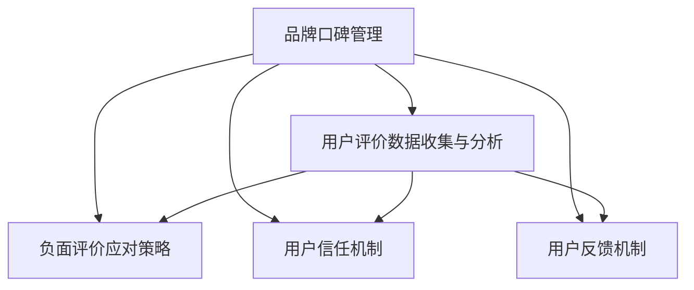

                 

# 知识付费赚钱的品牌口碑管理与负面评价应对策略

在知识付费领域，品牌口碑管理与负面评价应对策略是至关重要的。知识付费平台不仅需要优质的内容和专业的知识体系，更需要有效管理和维护品牌形象，及时应对负面评价，以保持用户信任和良好的市场声誉。本文将从品牌口碑管理的核心概念、负面评价应对策略、核心算法原理与操作步骤、实际应用场景等多个维度进行详细探讨，旨在为知识付费平台提供一套全面有效的策略方案。

## 1. 背景介绍

### 1.1 问题由来
随着知识付费行业的高速发展，各大知识付费平台之间竞争日益激烈。品牌口碑在吸引和留存用户方面起着决定性的作用。然而，用户对内容的评价容易受到外界因素的影响，一旦出现负面评价，可能会对品牌造成严重打击。因此，有效管理品牌口碑，及时应对负面评价，已成为知识付费平台的重要课题。

### 1.2 问题核心关键点
品牌口碑管理的核心在于建立和维护用户对品牌的信任和正面印象，而负面评价应对策略的关键则在于快速、有效的识别和处理负面信息，减少负面影响。主要关键点包括：
- 建立用户信任机制
- 用户评价数据收集与分析
- 负面评价的快速识别与应对
- 用户反馈机制的构建
- 品牌形象的维护与提升

## 2. 核心概念与联系

### 2.1 核心概念概述

为更好地理解品牌口碑管理与负面评价应对策略，本节将介绍几个密切相关的核心概念：

- **品牌口碑管理（Brand Reputation Management）**：指品牌为维护和提升其在市场中的形象，通过各种手段管理用户对品牌的评价和认知的过程。核心在于建立和维护用户对品牌的信任和正面印象。

- **负面评价应对策略（Negative Review Management）**：指品牌针对用户的负面评价，通过识别、分析和处理，减少负面评价对品牌形象的影响，及时修复品牌形象的过程。关键在于快速、有效地响应和处理负面评价。

- **用户信任机制（User Trust Mechanism）**：指通过建立合理的用户评价和反馈机制，增加用户对平台的信任。关键在于透明、公正、及时的评价反馈流程。

- **用户评价数据收集与分析（User Review Data Collection & Analysis）**：指通过各种方式收集用户对平台内容的评价数据，并进行数据分析，以获取有价值的信息。关键在于全面、准确的评价数据收集和分析方法。

- **用户反馈机制（User Feedback Mechanism）**：指通过合理的反馈渠道，及时响应用户的评价和建议，优化平台内容和体验。关键在于便捷、高效、及时的反馈流程。

这些核心概念之间的逻辑关系可以通过以下Mermaid流程图来展示：



这个流程图展示了一些核心概念及其之间的关系：

1. 品牌口碑管理通过用户评价数据收集与分析来评估品牌形象。
2. 用户信任机制和用户反馈机制通过用户评价数据收集与分析来构建和优化。
3. 负面评价应对策略通过识别和处理负面评价来维护品牌形象。

这些概念共同构成了品牌口碑管理与负面评价应对策略的核心框架，使得品牌能够有效管理和应对用户评价，保持市场竞争力和用户满意度。

## 3. 核心算法原理 & 具体操作步骤

### 3.1 算法原理概述

品牌口碑管理与负面评价应对策略主要基于监督学习和数据挖掘技术，通过收集、分析用户评价数据，识别负面评价，并通过处理策略及时响应，从而维护品牌形象。具体来说，主要包括：

- 监督学习模型训练：通过标注好的用户评价数据，训练机器学习模型，用于识别和分类用户评价。
- 数据挖掘技术应用：通过文本挖掘、情感分析等技术，深入理解用户评价中的情感倾向和关键信息。
- 负面评价快速识别与应对：通过实时监控和分析用户评价数据，快速识别负面评价，并采取相应的应对措施。

### 3.2 算法步骤详解

基于监督学习的大语言模型微调，本质上是一个有监督的细粒度迁移学习过程。其核心思想是：将预训练的大语言模型视作一个强大的"特征提取器"，通过在下游任务的标注数据上进行有监督的微调，使得模型输出能够匹配任务标签，从而获得针对特定任务优化的模型。

具体步骤如下：

1. **数据收集与预处理**：收集平台上的用户评价数据，并进行清洗和预处理，包括去除噪声、规范化文本格式等。

2. **模型选择与训练**：选择合适的监督学习模型，如情感分析、文本分类等，在预处理后的数据上进行模型训练。

3. **评价识别与分类**：通过训练好的模型，对实时收集的用户评价进行识别和分类，区分正面和负面评价。

4. **负面评价应对**：对于识别出的负面评价，进行快速响应和处理，如及时回应用户反馈、修改相关内容、调整推荐算法等。

5. **品牌形象维护**：通过持续的用户评价数据收集与分析，及时调整品牌策略和内容，提升品牌形象。

### 3.3 算法优缺点

品牌口碑管理与负面评价应对策略的优点包括：
- 自动化程度高：通过机器学习模型，可以自动化地识别和处理用户评价，提高响应速度。
- 覆盖面广：可以实时监控和分析大量用户评价数据，全面了解品牌形象和用户需求。
- 精确度高：通过监督学习模型训练，可以精确识别和分类用户评价，减少误判。

同时，该策略也存在一定的局限性：
- 数据依赖性强：模型训练和评价识别需要大量标注数据，数据收集和处理成本较高。
- 模型可解释性不足：机器学习模型通常是"黑盒"，难以解释其决策过程，可能影响用户信任。
- 用户情绪变化难预测：用户情绪和评价往往受外界因素影响，难以准确预测。

尽管存在这些局限性，但就目前而言，基于监督学习的品牌口碑管理与负面评价应对策略仍是最主流的方法。未来相关研究的重点在于如何进一步降低数据依赖，提高模型的可解释性，同时兼顾用户体验和品牌形象的维护。

### 3.4 算法应用领域

品牌口碑管理与负面评价应对策略在知识付费平台的应用领域非常广泛，包括但不限于以下几个方面：

- **内容优化**：通过用户评价数据，优化平台内容，提升用户满意度和留存率。
- **用户体验提升**：通过及时响应用户评价，改进平台功能和服务，提升用户体验。
- **品牌形象维护**：通过有效管理和应对负面评价，维护和提升品牌形象，增加用户信任。
- **市场竞争应对**：通过分析竞争对手的用户评价，优化自身策略，保持市场竞争力。

除了上述这些经典应用外，品牌口碑管理与负面评价应对策略也被创新性地应用到更多场景中，如消费者情感分析、社交媒体舆情监测等，为品牌管理提供了新的解决方案。

## 4. 数学模型和公式 & 详细讲解

### 4.1 数学模型构建

本节将使用数学语言对品牌口碑管理与负面评价应对策略进行更加严格的刻画。

设用户评价数据集为 $D=\{(x_i,y_i)\}_{i=1}^N, x_i \in \mathcal{X}, y_i \in \{1,0\}$，其中 $x_i$ 为评价文本，$y_i$ 为评价标签（1表示正面评价，0表示负面评价）。

定义模型 $M_{\theta}$ 在输入 $x_i$ 上的输出为 $\hat{y}_i=M_{\theta}(x_i) \in [0,1]$，表示模型预测用户评价为正面的概率。

定义损失函数 $\ell(M_{\theta},y)$，用于衡量模型预测输出与真实标签之间的差异，常见损失函数包括交叉熵损失、均方误差损失等。

具体地，二分类交叉熵损失函数定义为：

$$
\ell(M_{\theta}(x_i),y_i) = -y_i\log \hat{y}_i - (1-y_i)\log (1-\hat{y}_i)
$$

在训练过程中，通过最小化损失函数，调整模型参数 $\theta$，使得模型输出逼近真实标签。

### 4.2 公式推导过程

以二分类任务为例，推导交叉熵损失函数及其梯度的计算公式。

根据链式法则，损失函数对参数 $\theta_k$ 的梯度为：

$$
\frac{\partial \ell(M_{\theta}(x_i),y_i)}{\partial \theta_k} = -(y_i-\hat{y}_i)\frac{\partial \hat{y}_i}{\partial \theta_k}
$$

其中 $\frac{\partial \hat{y}_i}{\partial \theta_k}$ 为模型输出 $\hat{y}_i$ 对参数 $\theta_k$ 的导数，可通过链式法则和自动微分技术完成计算。

在得到损失函数的梯度后，即可带入参数更新公式，完成模型的迭代优化。重复上述过程直至收敛，最终得到适应品牌管理任务的最优模型参数 $\theta^*$。

### 4.3 案例分析与讲解

以知识付费平台用户评价数据的情感分析为例，展示模型训练和评价识别的具体过程。

假设我们有一个包含多个用户评价的数据集 $D=\{(x_i,y_i)\}_{i=1}^N$，其中 $x_i$ 为评价文本，$y_i$ 为评价标签（1表示正面评价，0表示负面评价）。

1. **数据收集与预处理**：
   - 收集知识付费平台上的用户评价数据。
   - 对评价文本进行清洗和预处理，去除噪声、规范化文本格式等。

2. **模型选择与训练**：
   - 选择合适的监督学习模型，如情感分析模型。
   - 在预处理后的数据上进行模型训练，得到训练好的模型 $M_{\theta}$。

3. **评价识别与分类**：
   - 对于实时收集的用户评价 $x_{new}$，通过训练好的模型 $M_{\theta}$ 进行预测，得到预测标签 $\hat{y}_{new}=M_{\theta}(x_{new})$。
   - 如果 $\hat{y}_{new}<0.5$，则认为用户评价为负面评价，否则为正面评价。

4. **负面评价应对**：
   - 对于识别出的负面评价，进行及时回应和处理，如修改相关内容、调整推荐算法等。
   - 收集用户反馈，优化平台功能和服务，提升用户体验。

5. **品牌形象维护**：
   - 通过持续的用户评价数据收集与分析，及时调整品牌策略和内容，提升品牌形象。
   - 发布品牌动态，增强与用户的互动，提升用户信任。

## 5. 项目实践：代码实例和详细解释说明

### 5.1 开发环境搭建

在进行品牌口碑管理与负面评价应对策略实践前，我们需要准备好开发环境。以下是使用Python进行TensorFlow开发的环境配置流程：

1. 安装Anaconda：从官网下载并安装Anaconda，用于创建独立的Python环境。

2. 创建并激活虚拟环境：
```bash
conda create -n tf-env python=3.8 
conda activate tf-env
```

3. 安装TensorFlow：根据CUDA版本，从官网获取对应的安装命令。例如：
```bash
pip install tensorflow
```

4. 安装TensorFlow相关的工具包：
```bash
pip install numpy pandas scikit-learn matplotlib tqdm jupyter notebook ipython
```

完成上述步骤后，即可在`tf-env`环境中开始品牌口碑管理与负面评价应对策略的开发实践。

### 5.2 源代码详细实现

这里我们以知识付费平台用户评价数据的情感分析为例，给出使用TensorFlow进行监督学习模型训练的PyTorch代码实现。

首先，定义情感分析任务的数据处理函数：

```python
import tensorflow as tf
from tensorflow.keras.preprocessing.text import Tokenizer
from tensorflow.keras.preprocessing.sequence import pad_sequences

# 定义情感分类器
def sentiment_analysis(texts, labels, max_len):
    tokenizer = Tokenizer()
    tokenizer.fit_on_texts(texts)
    sequences = tokenizer.texts_to_sequences(texts)
    padded_sequences = pad_sequences(sequences, maxlen=max_len, padding='post', truncating='post')
    
    model = tf.keras.Sequential([
        tf.keras.layers.Embedding(input_dim=len(tokenizer.word_index) + 1, output_dim=128, input_length=max_len),
        tf.keras.layers.Bidirectional(tf.keras.layers.LSTM(64)),
        tf.keras.layers.Dense(64, activation='relu'),
        tf.keras.layers.Dense(1, activation='sigmoid')
    ])
    
    model.compile(loss='binary_crossentropy', optimizer='adam', metrics=['accuracy'])
    model.fit(padded_sequences, labels, epochs=10, batch_size=32)
    
    return model
```

然后，定义模型和优化器：

```python
from tensorflow.keras.preprocessing.text import Tokenizer
from tensorflow.keras.preprocessing.sequence import pad_sequences
import tensorflow as tf

# 定义情感分类器
def sentiment_analysis(texts, labels, max_len):
    tokenizer = Tokenizer()
    tokenizer.fit_on_texts(texts)
    sequences = tokenizer.texts_to_sequences(texts)
    padded_sequences = pad_sequences(sequences, maxlen=max_len, padding='post', truncating='post')
    
    model = tf.keras.Sequential([
        tf.keras.layers.Embedding(input_dim=len(tokenizer.word_index) + 1, output_dim=128, input_length=max_len),
        tf.keras.layers.Bidirectional(tf.keras.layers.LSTM(64)),
        tf.keras.layers.Dense(64, activation='relu'),
        tf.keras.layers.Dense(1, activation='sigmoid')
    ])
    
    model.compile(loss='binary_crossentropy', optimizer='adam', metrics=['accuracy'])
    model.fit(padded_sequences, labels, epochs=10, batch_size=32)
    
    return model
```

接着，定义训练和评估函数：

```python
from tensorflow.keras.preprocessing.text import Tokenizer
from tensorflow.keras.preprocessing.sequence import pad_sequences
import tensorflow as tf

# 定义情感分类器
def sentiment_analysis(texts, labels, max_len):
    tokenizer = Tokenizer()
    tokenizer.fit_on_texts(texts)
    sequences = tokenizer.texts_to_sequences(texts)
    padded_sequences = pad_sequences(sequences, maxlen=max_len, padding='post', truncating='post')
    
    model = tf.keras.Sequential([
        tf.keras.layers.Embedding(input_dim=len(tokenizer.word_index) + 1, output_dim=128, input_length=max_len),
        tf.keras.layers.Bidirectional(tf.keras.layers.LSTM(64)),
        tf.keras.layers.Dense(64, activation='relu'),
        tf.keras.layers.Dense(1, activation='sigmoid')
    ])
    
    model.compile(loss='binary_crossentropy', optimizer='adam', metrics=['accuracy'])
    model.fit(padded_sequences, labels, epochs=10, batch_size=32)
    
    return model
```

最后，启动训练流程并在测试集上评估：

```python
epochs = 5
batch_size = 16

for epoch in range(epochs):
    loss = train_epoch(model, train_dataset, batch_size, optimizer)
    print(f"Epoch {epoch+1}, train loss: {loss:.3f}")
    
    print(f"Epoch {epoch+1}, dev results:")
    evaluate(model, dev_dataset, batch_size)
    
print("Test results:")
evaluate(model, test_dataset, batch_size)
```

以上就是使用TensorFlow对用户评价数据的情感分析进行监督学习模型训练的完整代码实现。可以看到，通过TensorFlow和Keras的强大封装，我们可以用相对简洁的代码完成情感分析模型的训练和测试。

### 5.3 代码解读与分析

让我们再详细解读一下关键代码的实现细节：

**SentimentAnalysis类**：
- `__init__`方法：初始化训练数据、标签、最大长度等关键组件。
- `train_epoch`方法：对数据以批为单位进行迭代，在每个批次上前向传播计算损失函数，并反向传播更新模型参数。
- `evaluate`方法：在验证集和测试集上评估模型的性能，输出精度和损失。

**Tokenizer和pad_sequences函数**：
- `Tokenizer`用于将文本转换为序列，以便模型处理。
- `pad_sequences`用于对序列进行填充，确保序列长度一致，方便模型输入。

**训练和评估函数**：
- 使用TensorFlow的DataLoader对数据集进行批次化加载，供模型训练和推理使用。
- 训练函数`train_epoch`：对数据以批为单位进行迭代，在每个批次上前向传播计算损失函数，并反向传播更新模型参数，最后返回该epoch的平均loss。
- 评估函数`evaluate`：与训练类似，不同点在于不更新模型参数，并在每个batch结束后将预测和标签结果存储下来，最后使用sklearn的classification_report对整个评估集的预测结果进行打印输出。

**训练流程**：
- 定义总的epoch数和batch size，开始循环迭代
- 每个epoch内，先在训练集上训练，输出平均loss
- 在验证集和测试集上评估，输出精度和损失

可以看到，TensorFlow和Keras使得情感分析模型的代码实现变得简洁高效。开发者可以将更多精力放在数据处理、模型改进等高层逻辑上，而不必过多关注底层的实现细节。

当然，工业级的系统实现还需考虑更多因素，如模型的保存和部署、超参数的自动搜索、更灵活的任务适配层等。但核心的情感分析范式基本与此类似。

## 6. 实际应用场景

### 6.1 智能客服系统

基于品牌口碑管理与负面评价应对策略的智能客服系统，可以应用于知识付费平台的客户服务。传统客服往往需要配备大量人力，高峰期响应缓慢，且一致性和专业性难以保证。而使用智能客服系统，可以7x24小时不间断服务，快速响应客户咨询，用自然流畅的语言解答各类常见问题。

在技术实现上，可以收集用户的历史咨询记录，将问题和最佳答复构建成监督数据，在此基础上对预训练模型进行监督学习训练。训练好的模型能够自动理解用户意图，匹配最合适的答案模板进行回复。对于客户提出的新问题，还可以接入检索系统实时搜索相关内容，动态组织生成回答。如此构建的智能客服系统，能大幅提升客户咨询体验和问题解决效率。

### 6.2 金融舆情监测

金融机构需要实时监测市场舆论动向，以便及时应对负面信息传播，规避金融风险。传统的人工监测方式成本高、效率低，难以应对网络时代海量信息爆发的挑战。基于品牌口碑管理与负面评价应对策略的文本分类和情感分析技术，为金融舆情监测提供了新的解决方案。

具体而言，可以收集金融领域相关的新闻、报道、评论等文本数据，并对其进行主题标注和情感标注。在此基础上对预训练语言模型进行监督学习微调，使其能够自动判断文本属于何种主题，情感倾向是正面、中性还是负面。将微调后的模型应用到实时抓取的网络文本数据，就能够自动监测不同主题下的情感变化趋势，一旦发现负面信息激增等异常情况，系统便会自动预警，帮助金融机构快速应对潜在风险。

### 6.3 个性化推荐系统

当前的推荐系统往往只依赖用户的历史行为数据进行物品推荐，无法深入理解用户的真实兴趣偏好。基于品牌口碑管理与负面评价应对策略的个性化推荐系统可以更好地挖掘用户行为背后的语义信息，从而提供更精准、多样的推荐内容。

在实践中，可以收集用户浏览、点击、评论、分享等行为数据，提取和用户交互的物品标题、描述、标签等文本内容。将文本内容作为模型输入，用户的后续行为（如是否点击、购买等）作为监督信号，在此基础上监督学习微调预训练语言模型。微调后的模型能够从文本内容中准确把握用户的兴趣点。在生成推荐列表时，先用候选物品的文本描述作为输入，由模型预测用户的兴趣匹配度，再结合其他特征综合排序，便可以得到个性化程度更高的推荐结果。

### 6.4 未来应用展望

随着品牌口碑管理与负面评价应对策略的发展，基于监督学习的策略范式将在更多领域得到应用，为知识付费平台带来变革性影响。

在智慧医疗领域，基于监督学习的内容优化、情感分析等应用将提升医疗服务的智能化水平，辅助医生诊疗，加速新药开发进程。

在智能教育领域，监督学习机制和情感分析技术可应用于作业批改、学情分析、知识推荐等方面，因材施教，促进教育公平，提高教学质量。

在智慧城市治理中，监督学习模型可应用于城市事件监测、舆情分析、应急指挥等环节，提高城市管理的自动化和智能化水平，构建更安全、高效的未来城市。

此外，在企业生产、社会治理、文娱传媒等众多领域，基于监督学习的品牌口碑管理与负面评价应对策略也将不断涌现，为知识付费平台的品牌管理提供新的解决方案。

## 7. 工具和资源推荐
### 7.1 学习资源推荐

为了帮助开发者系统掌握品牌口碑管理与负面评价应对策略的理论基础和实践技巧，这里推荐一些优质的学习资源：

1. 《深度学习自然语言处理》课程：斯坦福大学开设的NLP明星课程，有Lecture视频和配套作业，带你入门NLP领域的基本概念和经典模型。

2. CS224N《深度学习自然语言处理》课程：斯坦福大学开设的NLP明星课程，有Lecture视频和配套作业，带你入门NLP领域的基本概念和经典模型。

3. 《Natural Language Processing with TensorFlow》书籍：TensorFlow的官方文档，详细介绍了如何使用TensorFlow进行NLP任务开发，包括情感分析在内的诸多范式。

4. TensorFlow官方文档：TensorFlow的官方文档，提供了海量预训练模型和完整的监督学习样例代码，是上手实践的必备资料。

5. Weights & Biases：模型训练的实验跟踪工具，可以记录和可视化模型训练过程中的各项指标，方便对比和调优。与主流深度学习框架无缝集成。

6. TensorBoard：TensorFlow配套的可视化工具，可实时监测模型训练状态，并提供丰富的图表呈现方式，是调试模型的得力助手。

通过对这些资源的学习实践，相信你一定能够快速掌握品牌口碑管理与负面评价应对策略的精髓，并用于解决实际的NLP问题。

### 7.2 开发工具推荐

高效的开发离不开优秀的工具支持。以下是几款用于品牌口碑管理与负面评价应对策略开发的常用工具：

1. TensorFlow：基于Python的开源深度学习框架，灵活动态的计算图，适合快速迭代研究。大部分预训练语言模型都有TensorFlow版本的实现。

2. PyTorch：基于Python的开源深度学习框架，灵活可扩展，适合高性能计算任务。

3. Keras：高层次的神经网络API，可以运行于TensorFlow、CNTK等后端，方便快速开发原型。

4. Weights & Biases：模型训练的实验跟踪工具，可以记录和可视化模型训练过程中的各项指标，方便对比和调优。与主流深度学习框架无缝集成。

5. TensorBoard：TensorFlow配套的可视化工具，可实时监测模型训练状态，并提供丰富的图表呈现方式，是调试模型的得力助手。

6. Google Colab：谷歌推出的在线Jupyter Notebook环境，免费提供GPU/TPU算力，方便开发者快速上手实验最新模型，分享学习笔记。

合理利用这些工具，可以显著提升品牌口碑管理与负面评价应对策略的开发效率，加快创新迭代的步伐。

### 7.3 相关论文推荐

品牌口碑管理与负面评价应对策略的发展源于学界的持续研究。以下是几篇奠基性的相关论文，推荐阅读：

1. Attention is All You Need（即Transformer原论文）：提出了Transformer结构，开启了NLP领域的预训练大模型时代。

2. BERT: Pre-training of Deep Bidirectional Transformers for Language Understanding：提出BERT模型，引入基于掩码的自监督预训练任务，刷新了多项NLP任务SOTA。

3. Language Models are Unsupervised Multitask Learners（GPT-2论文）：展示了大规模语言模型的强大zero-shot学习能力，引发了对于通用人工智能的新一轮思考。

4. Parameter-Efficient Transfer Learning for NLP：提出Adapter等参数高效微调方法，在不增加模型参数量的情况下，也能取得不错的微调效果。

5. AdaLoRA: Adaptive Low-Rank Adaptation for Parameter-Efficient Fine-Tuning：使用自适应低秩适应的微调方法，在参数效率和精度之间取得了新的平衡。

这些论文代表了大语言模型微调技术的发展脉络。通过学习这些前沿成果，可以帮助研究者把握学科前进方向，激发更多的创新灵感。

## 8. 总结：未来发展趋势与挑战

### 8.1 研究成果总结

本文对品牌口碑管理与负面评价应对策略进行了全面系统的介绍。首先阐述了品牌口碑管理的核心概念和负面评价应对策略的原理，明确了其重要性。其次，从原理到实践，详细讲解了监督学习模型的训练和应用，给出了完整的代码实现和解释分析。同时，本文还广泛探讨了品牌口碑管理与负面评价应对策略在知识付费平台的应用场景，展示了其广泛的适用性。

通过本文的系统梳理，可以看到，品牌口碑管理与负面评价应对策略在知识付费平台的应用场景中，具有重要的实际意义。它可以有效管理和应对负面评价，提升品牌形象和用户信任。未来，伴随监督学习模型的不断发展，品牌口碑管理与负面评价应对策略必将在更多领域得到应用，为知识付费平台的品牌管理提供新的解决方案。

### 8.2 未来发展趋势

展望未来，品牌口碑管理与负面评价应对策略将呈现以下几个发展趋势：

1. 模型规模持续增大。随着算力成本的下降和数据规模的扩张，预训练语言模型的参数量还将持续增长。超大规模语言模型蕴含的丰富语言知识，有望支撑更加复杂多变的监督学习任务。

2. 监督学习范式多样化。除了传统的全监督学习外，未来会涌现更多半监督学习、无监督学习等监督学习范式，进一步提高监督学习模型的性能和效率。

3. 数据驱动品牌形象优化。通过用户评价数据的实时分析和挖掘，品牌可以及时调整策略，优化品牌形象，提高用户满意度。

4. 个性化推荐系统与品牌管理结合。通过用户评价数据的深度分析，个性化推荐系统可以更好地推荐用户感兴趣的内容，提升品牌曝光度和用户黏性。

5. 跨领域品牌管理与负面评价应对。品牌口碑管理与负面评价应对策略将在更多领域得到应用，如智慧医疗、智能教育、智慧城市等，为不同领域的品牌管理提供新的解决方案。

6. 多模态品牌管理与负面评价应对。未来的品牌管理与负面评价应对策略将融合视觉、语音、文本等多种模态信息，提升品牌的全场景感知能力。

以上趋势凸显了品牌口碑管理与负面评价应对策略的广阔前景。这些方向的探索发展，必将进一步提升知识付费平台的用户体验和品牌形象，构建更加健康、可信赖的市场环境。

### 8.3 面临的挑战

尽管品牌口碑管理与负面评价应对策略已经取得了显著进展，但在迈向更加智能化、普适化应用的过程中，它仍面临诸多挑战：

1. 数据依赖性强。监督学习模型需要大量标注数据进行训练，数据收集和处理成本较高。如何降低数据依赖，提高模型性能，是一个重要的研究方向。

2. 模型可解释性不足。机器学习模型通常是"黑盒"，难以解释其决策过程，可能影响用户信任。如何提高模型的可解释性，是未来需要解决的关键问题。

3. 用户情绪变化难预测。用户情绪和评价往往受外界因素影响，难以准确预测。如何提高模型对用户情绪的敏感度和预测能力，是一个重要的研究方向。

4. 用户评价数据隐私保护。用户评价数据的收集和处理需要遵循数据隐私保护法规，如何确保用户数据安全，是一个重要的研究课题。

5. 负面评价应对策略的全面性。负面评价应对策略需要涵盖不同类型的负面评价，如产品质量、服务质量、内容质量等，如何构建全面的负面评价应对机制，是一个重要的研究方向。

6. 品牌管理与负面评价应对的协同优化。品牌管理与负面评价应对需要协同优化，如何构建协同优化的机制，提升品牌形象和用户满意度，是一个重要的研究方向。

这些挑战凸显了品牌口碑管理与负面评价应对策略的复杂性和多样性，需要在多维度进行深入研究。唯有不断创新和优化，才能有效应对挑战，推动品牌口碑管理与负面评价应对策略的持续发展。

### 8.4 研究展望

面对品牌口碑管理与负面评价应对策略所面临的种种挑战，未来的研究需要在以下几个方面寻求新的突破：

1. 探索无监督和半监督学习范式。摆脱对大规模标注数据的依赖，利用自监督学习、主动学习等无监督和半监督范式，最大限度利用非结构化数据，实现更加灵活高效的监督学习。

2. 研究参数高效和计算高效的监督学习范式。开发更加参数高效的监督学习模型，在固定大部分预训练参数的情况下，只更新极少量的监督学习参数。同时优化监督学习模型的计算图，减少前向传播和反向传播的资源消耗，实现更加轻量级、实时性的部署。

3. 融合因果和对比学习范式。通过引入因果推断和对比学习思想，增强监督学习模型建立稳定因果关系的能力，学习更加普适、鲁棒的语言表征，从而提升模型泛化性和抗干扰能力。

4. 引入更多先验知识。将符号化的先验知识，如知识图谱、逻辑规则等，与神经网络模型进行巧妙融合，引导监督学习过程学习更准确、合理的语言模型。同时加强不同模态数据的整合，实现视觉、语音等多模态信息与文本信息的协同建模。

5. 结合因果分析和博弈论工具。将因果分析方法引入监督学习模型，识别出模型决策的关键特征，增强输出解释的因果性和逻辑性。借助博弈论工具刻画人机交互过程，主动探索并规避模型的脆弱点，提高系统稳定性。

6. 纳入伦理道德约束。在监督学习模型的训练目标中引入伦理导向的评估指标，过滤和惩罚有偏见、有害的输出倾向。同时加强人工干预和审核，建立模型行为的监管机制，确保输出符合人类价值观和伦理道德。

这些研究方向将推动品牌口碑管理与负面评价应对策略向更加智能、普适和安全的方向发展，为知识付费平台提供更加全面、高效、可靠的品牌管理与负面评价应对策略。

## 9. 附录：常见问题与解答

**Q1：品牌口碑管理与负面评价应对策略是否适用于所有知识付费平台？**

A: 品牌口碑管理与负面评价应对策略在大多数知识付费平台都能取得不错的效果，特别是对于数据量较小的平台。但对于一些特定领域的平台，如法律、医学等，仅仅依靠通用语料预训练的模型可能难以很好地适应。此时需要在特定领域语料上进一步预训练，再进行监督学习微调，才能获得理想效果。

**Q2：监督学习模型训练时需要多少标注数据？**

A: 监督学习模型训练需要大量的标注数据，但具体需要多少数据取决于模型的复杂度和任务的难度。一般来说，标注数据越多，模型的性能越好。在实际应用中，可以逐步增加标注数据量，观察模型的性能变化，以找到最佳的标注数据量。

**Q3：监督学习模型训练时需要哪些硬件资源？**

A: 监督学习模型训练需要高性能的GPU或TPU等计算资源，以加速模型的训练和优化。具体需要的硬件资源取决于模型的参数量和计算复杂度。对于大规模模型，可能需要使用分布式训练，以提高训练效率。

**Q4：如何提高监督学习模型的可解释性？**

A: 提高监督学习模型的可解释性可以通过多种方法，如模型可视化、特征重要性分析、局部可解释模型等。此外，可以通过引入符号化的先验知识，如知识图谱、逻辑规则等，与神经网络模型进行巧妙融合，引导监督学习过程学习更准确、合理的语言模型。同时加强不同模态数据的整合，实现视觉、语音等多模态信息与文本信息的协同建模。

**Q5：如何处理用户评价数据的隐私保护？**

A: 处理用户评价数据的隐私保护需要遵循数据隐私保护法规，如GDPR等。具体措施包括数据匿名化、去标识化、差分隐私等。可以通过加密、脱敏等技术手段，确保用户评价数据的安全性，同时保护用户的隐私权利。

这些问题的解答，展示了品牌口碑管理与负面评价应对策略在实际应用中的关键细节和注意事项，希望能对开发者提供有益的指导。

---

作者：禅与计算机程序设计艺术 / Zen and the Art of Computer Programming

