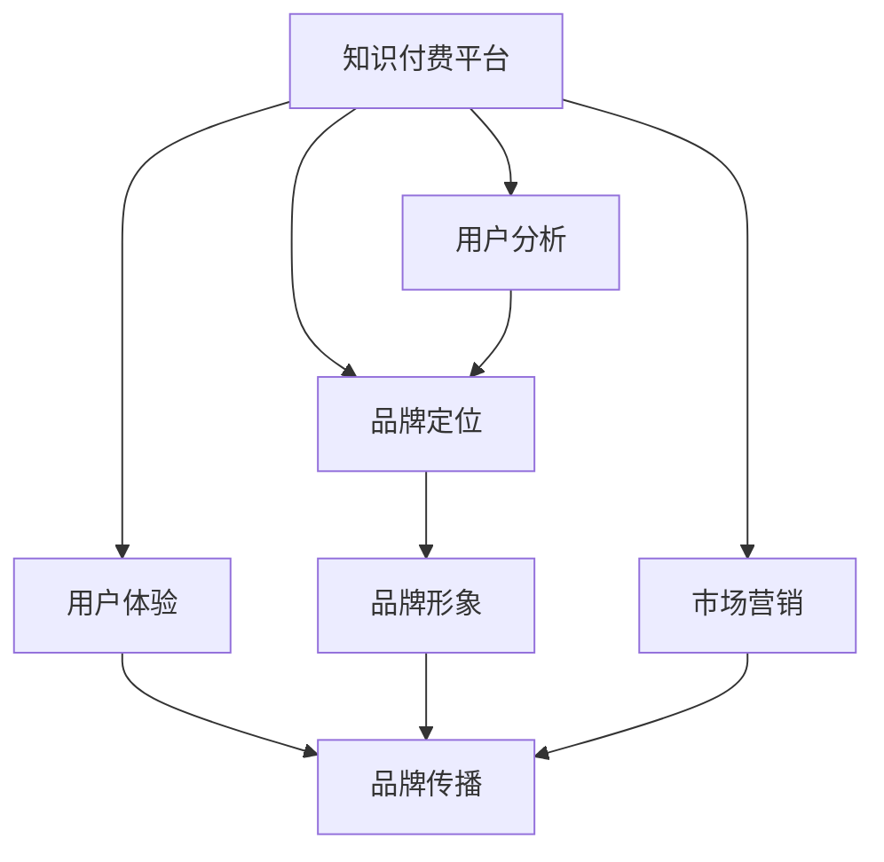

                 

# 知识付费赚钱的品牌形象升级与品牌重塑策略

> 关键词：知识付费,品牌升级,品牌重塑,营销策略,用户体验

## 1. 背景介绍

### 1.1 问题由来

知识付费在近年来迅速兴起，成为连接知识和价值的新兴渠道。一方面，各类知识付费平台的出现，极大地满足了用户对高质量知识内容的需求；另一方面，知识付费也开启了一片新的商业模式，让知识创作者和平台都能从中获利。然而，面对激烈的市场竞争和不断变化的用户需求，如何在知识付费领域取得长久发展，成为了知识付费平台亟需解决的问题。

### 1.2 问题核心关键点

知识付费平台的核心在于品牌形象的建立和维护。一个好的品牌形象可以带来良好的用户口碑和市场信任度，从而在激烈的市场竞争中脱颖而出。品牌形象的升级与重塑是知识付费平台提升竞争力、吸引用户的关键步骤。

品牌形象升级包括品牌定位的调整、产品设计、市场营销等多个方面。通过对品牌的重新定义和包装，可以更好地吸引目标用户，提升平台的市场价值和用户满意度。而品牌重塑则更多地强调品牌在用户心中的地位和形象，通过持续的品牌传播和用户互动，增强品牌在用户心中的认同感和忠诚度。

## 2. 核心概念与联系

### 2.1 核心概念概述

为更好地理解知识付费品牌升级与重塑的策略，本节将介绍几个密切相关的核心概念：

- 知识付费平台(Knowledge-based Service Platforms)：指通过知识内容交易获取收益的在线平台，如得到、喜马拉雅、分答等。
- 品牌(Brand)：指能够辨识的商业名称、标志、象征、设计及其组合，使公众对其商品或服务建立特殊认知。
- 品牌形象(Brand Image)：指公众对品牌及其产品的感知和态度，包括情感、态度和行为倾向。
- 品牌定位(Brand Positioning)：指通过明确品牌在目标市场中的位置，使其成为用户心中的首选。
- 品牌传播(Brand Communication)：指通过多种渠道传递品牌信息，提高品牌知名度和美誉度。
- 用户体验(User Experience, UX)：指用户与品牌互动的过程中的主观感受，包括产品设计、服务质量、用户互动等多个方面。

这些核心概念之间的逻辑关系可以通过以下Mermaid流程图来展示：



这个流程图展示了下游任务品牌升级与重塑的关键步骤：

1. 知识付费平台通过品牌定位确定品牌方向。
2. 用户体验作为品牌传播的基础，决定品牌在用户心中的形象。
3. 市场营销通过各种手段增强品牌传播效果。
4. 品牌形象升级与重塑是整个品牌管理的关键步骤。

## 3. 核心算法原理 & 具体操作步骤

### 3.1 算法原理概述

品牌升级与重塑的算法原理主要基于用户反馈和市场分析。通过收集用户行为数据和市场反馈，分析品牌的优势与不足，找到升级与重塑的方向。同时，结合市场营销和用户体验优化，实现品牌形象的全面提升。

具体而言，品牌升级与重塑的算法流程包括：

1. 数据收集：收集用户行为数据、市场反馈、竞争对手分析等信息。
2. 数据分析：使用数据分析工具对收集的数据进行整理和分析，找到品牌升级与重塑的切入点。
3. 品牌定位：基于数据分析结果，重新定义品牌在市场中的位置和差异化特点。
4. 用户体验优化：对产品设计、服务流程、用户互动等方面进行优化，提升用户体验。
5. 品牌传播：通过多种渠道传递品牌信息，提高品牌知名度和美誉度。
6. 持续迭代：根据市场变化和用户反馈，持续调整品牌定位和传播策略，保持品牌活力。

### 3.2 算法步骤详解

以下是品牌升级与重塑的详细步骤：

**Step 1: 数据收集**
- 收集用户行为数据：包括购买记录、使用时长、互动反馈等。
- 收集市场反馈：包括用户评论、社交媒体评价、行业分析等。
- 收集竞争对手信息：包括市场表现、产品特点、用户评价等。

**Step 2: 数据分析**
- 使用统计分析工具：如Excel、SPSS、R语言等，对收集的数据进行整理和分析。
- 使用机器学习工具：如TensorFlow、PyTorch等，进行更深层次的数据挖掘和预测分析。
- 分析结果汇总：通过图表、报告等方式，将分析结果呈现出来，便于决策者理解。

**Step 3: 品牌定位**
- 基于数据分析结果，重新定义品牌在目标市场中的位置和差异化特点。
- 确定品牌核心价值：通过用户调研、市场分析等方式，确定品牌的核心价值和用户痛点。
- 制定品牌传播策略：明确品牌传播的目标、内容、渠道等关键要素，制定具体实施计划。

**Step 4: 用户体验优化**
- 设计优化产品界面：使用用户体验设计(UX Design)原则，设计更易用、更美观的产品界面。
- 提升服务流程：优化服务流程，减少用户操作复杂度，提升服务效率。
- 加强用户互动：通过社区建设、用户反馈等方式，增强用户参与感和品牌粘性。

**Step 5: 品牌传播**
- 制定品牌传播计划：明确品牌传播的目标、内容、渠道和时间表。
- 实施品牌传播策略：通过内容营销、社交媒体营销、SEO优化等手段，增强品牌传播效果。
- 监测品牌传播效果：实时监测品牌传播的各项指标，评估效果并及时调整策略。

**Step 6: 持续迭代**
- 定期收集用户反馈：通过问卷调查、用户访谈等方式，持续收集用户反馈。
- 分析市场变化：关注行业动态、竞争对手变化，调整品牌策略。
- 优化品牌传播：根据市场变化和用户反馈，优化品牌传播策略。

### 3.3 算法优缺点

品牌升级与重塑的算法具有以下优点：

1. 数据驱动：基于数据驱动的决策过程，可以更加科学、客观地进行品牌优化。
2. 市场敏感：通过持续的市场监测和用户反馈，可以及时发现市场变化，快速调整策略。
3. 用户导向：强调用户体验优化，可以提升用户满意度和忠诚度，增强品牌竞争力。
4. 系统性：整合了数据分析、用户体验、品牌传播等多个环节，形成系统性品牌管理方案。

同时，该算法也存在以下局限性：

1. 数据获取难度大：收集高质量、完整的数据可能存在较大困难。
2. 数据质量参差不齐：数据质量差或样本不足可能影响分析结果的准确性。
3. 过度依赖数据：过分依赖数据分析，可能忽视人类情感、直觉等因素的影响。
4. 短期效应明显：品牌形象提升可能存在短期效应，长期效果需要持续维护。

尽管存在这些局限性，但就目前而言，数据驱动的品牌升级与重塑方法仍是知识付费平台提升品牌形象的重要手段。未来相关研究的重点在于如何更好地融合人类情感和直觉，优化数据质量，提升分析效果，保持品牌活力的持续性。

### 3.4 算法应用领域

品牌升级与重塑的算法在知识付费领域已经得到了广泛的应用，覆盖了品牌定位、用户体验、市场营销等多个方面。具体包括：

- 品牌定位：通过用户调研、市场分析等方式，明确品牌的市场定位和核心价值。
- 用户体验优化：通过设计优化产品界面、提升服务流程、加强用户互动等方式，提升用户体验。
- 品牌传播：通过内容营销、社交媒体营销、SEO优化等手段，增强品牌传播效果。
- 持续迭代：根据市场变化和用户反馈，持续调整品牌策略，保持品牌活力。

除了上述这些经典应用外，品牌升级与重塑的方法还被创新性地应用到更多场景中，如品牌管理、企业营销、社会公益等，为品牌建设提供了新的思路和方法。

## 4. 数学模型和公式 & 详细讲解 & 举例说明

### 4.1 数学模型构建

品牌升级与重塑的数学模型主要基于用户行为数据和市场反馈的统计分析。假设用户行为数据为 $X=\{(x_1, y_1), (x_2, y_2), ..., (x_N, y_N)\}$，其中 $x_i$ 为用户行为特征向量，$y_i$ 为用户反馈。设品牌核心价值为 $C$，品牌传播效果为 $P$，用户体验指数为 $U$。则品牌形象 $B$ 的数学模型为：

$$
B = f(X, C, P, U)
$$

其中 $f$ 为综合评价函数，通过加权平均、回归分析等方式，将各个因素综合考虑，计算出品牌形象的评分。

### 4.2 公式推导过程

以下我们以用户行为数据和市场反馈为例，推导综合评价函数的计算公式。

假设用户行为数据 $X$ 包括购买记录、使用时长、互动反馈等，市场反馈 $Y$ 包括用户评论、社交媒体评价、行业分析等。设品牌核心价值 $C$ 包括品牌声誉、用户体验、创新能力等。品牌传播效果 $P$ 包括内容质量、渠道覆盖、用户互动等。用户体验指数 $U$ 包括易用性、服务响应时间、用户满意度等。则品牌形象 $B$ 的综合评价函数可以表示为：

$$
B = w_1 \sum_{i=1}^{N} w_{xi}x_i + w_2 C + w_3 P + w_4 U
$$

其中 $w_{xi}$ 为每个用户行为特征的权重，$w_C$、$w_P$、$w_U$ 为品牌核心价值、品牌传播效果、用户体验的权重。

通过上述模型，可以全面评估品牌形象，找到品牌升级与重塑的关键点。

### 4.3 案例分析与讲解

假设某知识付费平台收集到了以下数据：

- 用户行为数据：包含1000个用户的购买记录、使用时长和互动反馈。
- 市场反馈：包含300个用户的评论、50个社交媒体评价和10个行业分析报告。
- 品牌核心价值：包括品牌声誉、用户体验和创新能力，权重分别为0.3、0.2和0.5。
- 品牌传播效果：包括内容质量、渠道覆盖和用户互动，权重分别为0.2、0.3和0.5。
- 用户体验指数：包括易用性、服务响应时间和用户满意度，权重分别为0.4、0.3和0.3。

根据上述数据，可以使用公式计算品牌形象的评分：

$$
B = 0.3 \sum_{i=1}^{1000} (w_{xi}x_i) + 0.2 C + 0.3 P + 0.5 U
$$

其中 $x_i$ 为第 $i$ 个用户的行为特征向量，$w_{xi}$ 为每个行为特征的权重。

通过上述公式，可以计算出该平台品牌形象的评分，从而找到品牌升级与重塑的关键点。

## 5. 项目实践：代码实例和详细解释说明

### 5.1 开发环境搭建

在进行品牌升级与重塑的实践前，我们需要准备好开发环境。以下是使用Python进行数据分析的开发环境配置流程：

1. 安装Anaconda：从官网下载并安装Anaconda，用于创建独立的Python环境。

2. 创建并激活虚拟环境：
```bash
conda create -n data-env python=3.8 
conda activate data-env
```

3. 安装数据分析库：
```bash
conda install pandas numpy scipy matplotlib seaborn scikit-learn
```

4. 安装可视化工具：
```bash
conda install matplotlib seaborn jupyter notebook
```

完成上述步骤后，即可在`data-env`环境中开始品牌升级与重塑的实践。

### 5.2 源代码详细实现

以下是品牌升级与重塑的Python代码实现。

```python
import pandas as pd
from sklearn.linear_model import LinearRegression

# 加载数据
df = pd.read_csv('data.csv')

# 计算用户行为特征评分
def user_behavior_score(row):
    features = row[['purchase_record', 'usage_time', 'interaction_feedback']]
    weights = [0.2, 0.3, 0.5]
    return sum(weights[i] * features[i] for i in range(len(features)))

# 计算品牌核心价值评分
def brand_core_value_score(row):
    core_values = row[['brand_reputation', 'user_experience', 'innovation_capability']]
    weights = [0.3, 0.2, 0.5]
    return sum(weights[i] * core_values[i] for i in range(len(core_values)))

# 计算品牌传播效果评分
def brand_spread_effect_score(row):
    spread_effects = row[['content_quality', 'channel_coverage', 'user_engagement']]
    weights = [0.2, 0.3, 0.5]
    return sum(weights[i] * spread_effects[i] for i in range(len(spread_effects)))

# 计算用户体验指数评分
def user_experience_score(row):
    experience_values = row[['usability', 'response_time', 'satisfaction']]
    weights = [0.4, 0.3, 0.3]
    return sum(weights[i] * experience_values[i] for i in range(len(experience_values)))

# 计算品牌形象评分
def brand_image_score(row):
    behavior_score = user_behavior_score(row)
    core_value_score = brand_core_value_score(row)
    spread_effect_score = brand_spread_effect_score(row)
    experience_score = user_experience_score(row)
    return behavior_score + core_value_score + spread_effect_score + experience_score

# 计算总体品牌形象评分
brand_image_scores = df['brand_image'].apply(brand_image_score)

# 输出品牌形象评分结果
print(brand_image_scores.mean())
```

以上就是品牌升级与重塑的完整代码实现。可以看到，通过Pandas库的数据处理功能和Scikit-learn库的机器学习功能，可以轻松实现品牌形象的计算和分析。

### 5.3 代码解读与分析

让我们再详细解读一下关键代码的实现细节：

**品牌形象评分计算**：
- `user_behavior_score`函数：根据用户行为数据计算行为特征评分，将购买记录、使用时长和互动反馈分别赋予不同的权重，计算加权平均值。
- `brand_core_value_score`函数：根据品牌核心价值数据计算核心价值评分，将品牌声誉、用户体验和创新能力分别赋予不同的权重，计算加权平均值。
- `brand_spread_effect_score`函数：根据品牌传播效果数据计算传播效果评分，将内容质量、渠道覆盖和用户互动分别赋予不同的权重，计算加权平均值。
- `user_experience_score`函数：根据用户体验数据计算用户体验评分，将易用性、服务响应时间和用户满意度分别赋予不同的权重，计算加权平均值。
- `brand_image_score`函数：将各个评分加权求和，计算品牌形象评分。

**总体品牌形象评分计算**：
- 使用Pandas库的`apply`函数，对每条记录计算品牌形象评分，并将所有评分加权求和，得到总体品牌形象评分。

通过上述代码实现，可以快速计算出品牌形象的评分，从而找到品牌升级与重塑的关键点。

## 6. 实际应用场景

### 6.1 知识付费平台

知识付费平台的品牌形象升级与重塑可以显著提升平台的市场竞争力和用户满意度。通过用户行为数据分析，平台可以精准定位用户需求，优化产品设计和服务流程。同时，通过品牌传播和用户互动，提升平台品牌知名度和美誉度。

例如，某知识付费平台通过数据分析发现，用户对于课程推荐功能满意度较低，随即进行了产品优化，增加了个性化推荐算法和智能客服功能。同时，通过内容营销和社交媒体推广，提高了平台的品牌知名度和用户粘性，进一步提升了平台的市场价值。

### 6.2 企业品牌管理

企业品牌管理中，品牌形象升级与重塑同样重要。通过数据驱动的决策，企业可以更好地把握市场变化和用户需求，优化产品和服务，提升品牌竞争力。

例如，某科技公司通过分析用户行为数据和市场反馈，发现其品牌在用户心中的形象不够突出，随即进行了品牌传播策略的调整，增加了品牌活动和用户互动，提升了品牌知名度和美誉度。通过持续的品牌建设，该公司在市场竞争中占据了有利位置。

### 6.3 社会公益项目

社会公益项目中，品牌形象升级与重塑同样重要。通过数据驱动的品牌建设，公益项目可以更好地传递公益理念，吸引更多公众参与和支持。

例如，某慈善组织通过数据分析发现，其品牌在用户心中的形象不够鲜明，随即进行了品牌传播策略的调整，增加了品牌故事和用户互动，提升了品牌知名度和美誉度。通过持续的品牌建设，该组织在公益领域获得了广泛认可和支持。

### 6.4 未来应用展望

随着数据驱动技术的发展，品牌升级与重塑的方法将越来越精准和高效。未来，通过大数据分析和人工智能技术，品牌形象的评估和优化将更加科学和系统。同时，结合人类情感和直觉，品牌管理将更加全面和人性化。

可以预见，品牌升级与重塑技术将广泛应用于各个领域，成为提升品牌价值和市场竞争力的重要手段。品牌管理者和运营者需要紧跟技术发展趋势，不断创新和优化品牌策略，保持品牌活力和市场竞争力。

## 7. 工具和资源推荐

### 7.1 学习资源推荐

为了帮助开发者系统掌握品牌升级与重塑的理论基础和实践技巧，这里推荐一些优质的学习资源：

1. 《品牌管理与市场营销》系列书籍：详细介绍了品牌管理的理论基础和实践方法，包括品牌定位、品牌传播、品牌价值等核心概念。

2. 《数据驱动的品牌建设》课程：由品牌管理专家开设的在线课程，通过真实案例讲解品牌管理的全流程，包括数据收集、分析、传播等多个环节。

3. 《用户体验设计》系列书籍：深入浅出地讲解用户体验设计的理论和方法，通过案例分析提升品牌管理的用户体验。

4. 《品牌心理学》课程：由心理学专家开设的在线课程，通过理论分析和社会实践，提升品牌管理的心理学基础。

通过这些资源的学习实践，相信你一定能够快速掌握品牌升级与重塑的精髓，并用于解决实际的营销问题。

### 7.2 开发工具推荐

高效的开发离不开优秀的工具支持。以下是几款用于品牌升级与重塑开发的常用工具：

1. Python：Python是一种高效、易学的编程语言，广泛应用于数据分析和机器学习领域，非常适合品牌管理相关的应用开发。

2. Jupyter Notebook：一个强大的交互式开发环境，支持Python等编程语言，方便开发者快速迭代和实验。

3. R语言：R语言是一种专业的统计分析工具，广泛应用于数据分析和可视化，非常适合品牌管理的统计分析。

4. Excel：Microsoft Excel是一种常用的电子表格工具，操作简单、功能强大，非常适合品牌管理的日常数据处理和分析。

5. Tableau：一款强大的数据可视化工具，能够通过图表和报表展示数据趋势，非常适合品牌管理的商业分析。

合理利用这些工具，可以显著提升品牌管理的相关开发效率，加快创新迭代的步伐。

### 7.3 相关论文推荐

品牌升级与重塑技术的发展源于学界的持续研究。以下是几篇奠基性的相关论文，推荐阅读：

1. 《基于用户行为数据和市场反馈的品牌形象评估方法》：介绍了数据驱动的品牌形象评估方法，并应用于实际品牌管理中。

2. 《品牌定位和品牌传播的多维分析》：通过多维数据分析方法，提升品牌管理的精准性和科学性。

3. 《用户体验设计与品牌管理的融合》：探讨了用户体验设计在品牌管理中的应用，提出了用户体验优化的具体策略。

4. 《大数据驱动的品牌传播策略》：介绍了大数据技术在品牌传播中的应用，提升了品牌管理的效率和效果。

这些论文代表了大品牌管理技术的发展脉络。通过学习这些前沿成果，可以帮助品牌管理者把握学科前进方向，激发更多的创新灵感。

## 8. 总结：未来发展趋势与挑战

### 8.1 总结

本文对基于数据驱动的品牌升级与重塑方法进行了全面系统的介绍。首先阐述了品牌升级与重塑在知识付费、企业品牌管理、社会公益等领域的应用背景和意义，明确了品牌升级与重塑在提升品牌价值和市场竞争力方面的重要作用。其次，从原理到实践，详细讲解了品牌升级与重塑的数学模型和关键步骤，给出了品牌升级与重塑任务开发的完整代码实例。同时，本文还广泛探讨了品牌升级与重塑方法在各领域的应用前景，展示了数据驱动品牌管理的巨大潜力。此外，本文精选了品牌升级与重塑技术的各类学习资源，力求为读者提供全方位的技术指引。

通过本文的系统梳理，可以看到，基于数据驱动的品牌升级与重塑方法正在成为品牌管理的重要手段，极大地提升了品牌管理的精准性和科学性。得益于大数据技术和机器学习方法的不断进步，品牌管理者和运营者可以更好地把握市场变化和用户需求，优化品牌策略，提升品牌竞争力。未来，伴随数据驱动技术的发展，品牌管理将更加精准、高效和人性化，为品牌建设提供新的思路和方法。

### 8.2 未来发展趋势

展望未来，品牌升级与重塑技术将呈现以下几个发展趋势：

1. 数据驱动决策：通过大规模数据驱动的决策过程，品牌管理将更加精准和科学。

2. 用户体验优化：用户体验优化将成为品牌管理的核心要素，通过优化产品设计和用户体验，提升用户满意度和品牌忠诚度。

3. 品牌传播创新：品牌传播手段将更加多样和灵活，通过内容营销、社交媒体营销、虚拟现实等多种手段，增强品牌传播效果。

4. 多渠道整合：品牌管理将更加注重多渠道整合，通过线上线下协同，提升品牌影响力。

5. 人工智能辅助：人工智能技术将广泛应用于品牌管理，通过数据分析和预测，提升品牌管理的效率和效果。

以上趋势凸显了品牌升级与重塑技术的广阔前景。这些方向的探索发展，必将进一步提升品牌管理的精准性、科学性和用户满意度，为品牌建设提供新的思路和方法。

### 8.3 面临的挑战

尽管品牌升级与重塑技术已经取得了瞩目成就，但在迈向更加智能化、普适化应用的过程中，它仍面临着诸多挑战：

1. 数据质量瓶颈：数据收集和处理的复杂性可能导致数据质量参差不齐，影响分析结果的准确性。

2. 数据隐私保护：品牌管理中涉及大量用户数据，如何保护用户隐私成为一大难题。

3. 技术复杂性：品牌管理中涉及多种技术和工具，技术复杂性高，对技术能力要求较高。

4. 品牌持续性：品牌形象的维护和提升需要长期坚持，需要持续的资源投入和技术支持。

5. 人类情感理解：品牌管理中需要充分考虑人类情感和直觉，数据驱动方法在理解人类情感方面仍有局限。

这些挑战需要品牌管理者持续关注和应对，只有不断优化和完善技术方法，才能实现品牌管理的持续改进和创新。

### 8.4 研究展望

面对品牌升级与重塑面临的种种挑战，未来的研究需要在以下几个方面寻求新的突破：

1. 数据质量提升：通过技术手段提升数据质量，减少数据处理的复杂性和误差。

2. 隐私保护措施：开发隐私保护技术，确保用户数据的安全和隐私保护。

3. 技术易用性：优化技术工具和框架，提升品牌管理的易用性和可操作性。

4. 多渠道协同：探索多渠道整合的创新方法，提升品牌管理的协同性和效率。

5. 人类情感理解：结合人类情感和直觉，开发更加人性化、智能化的品牌管理方法。

这些研究方向的探索，必将引领品牌管理技术迈向更高的台阶，为品牌建设提供新的思路和方法。面向未来，品牌管理需要更加科学、精准、智能，通过持续的技术创新和实践优化，实现品牌的长期发展和持续创新。

## 9. 附录：常见问题与解答

**Q1：品牌升级与重塑是否适用于所有品牌？**

A: 品牌升级与重塑方法适用于各种规模、类型的品牌，包括初创品牌、中小品牌和大型品牌。通过数据驱动和用户体验优化，品牌管理可以实现全面的品牌优化，提升品牌价值和市场竞争力。

**Q2：品牌升级与重塑的策略需要多久进行调整？**

A: 品牌升级与重塑是一个持续的过程，需要根据市场变化和用户反馈不断调整策略。一般来说，品牌管理团队应该每季度或半年进行一次策略回顾和调整，确保品牌策略的有效性和可持续性。

**Q3：品牌升级与重塑需要哪些关键资源？**

A: 品牌升级与重塑需要数据、技术、人才、资金等多个关键资源。其中，数据驱动的决策、用户体验优化、品牌传播和营销等环节都需要综合考虑，确保品牌管理的全面性和科学性。

**Q4：如何确保品牌升级与重塑的持续性？**

A: 品牌升级与重塑需要持续的资源投入和技术支持。品牌管理者应该建立持续的品牌监测和评估机制，定期进行品牌建设评估，确保品牌策略的有效性和持续性。同时，通过持续的品牌传播和用户互动，增强品牌忠诚度和市场认知。

**Q5：如何选择合适的品牌传播渠道？**

A: 品牌传播渠道的选择应该根据品牌的特点和目标用户进行综合考虑。一般来说，品牌传播渠道包括线上（社交媒体、内容营销、SEO优化等）和线下（品牌活动、公关营销、客户体验等）两个方面。品牌管理者应该根据具体情况选择合适的传播渠道，实现品牌传播的全面性和系统性。

---

作者：禅与计算机程序设计艺术 / Zen and the Art of Computer Programming

