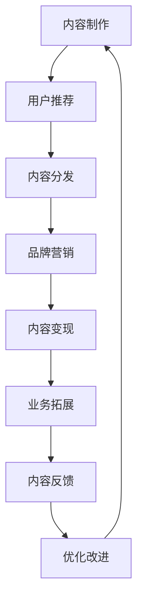

                 

# 知识付费赚钱的品牌故事与内容营销策略

## 1. 背景介绍

### 1.1 问题由来
随着互联网技术的发展和普及，知识付费已经成为了一种新的经济模式。在传统的知识传播方式中，用户更多是通过免费搜索、社交媒体等方式获取信息，然而这些信息往往杂乱无章、良莠不齐，难以满足用户的高效需求。而知识付费平台通过筛选优质的内容，以付费方式提供给用户，极大地提升了信息的质量和可信度。

近年来，知识付费市场呈现出爆炸式增长，各类型知识付费产品层出不穷。例如，得到、喜马拉雅、知乎live等平台，都是通过精选优质内容、邀请专家学者授课，实现了知识变现。然而，在庞大的知识付费市场中，如何确保内容质量、吸引用户付费、提升品牌知名度，成为众多知识付费品牌亟需解决的问题。

### 1.2 问题核心关键点
在知识付费市场中，一个成功的品牌需要具备以下几个核心能力：

1. 优质内容的筛选与制作：选取高质量、有价值的内容，并通过专家解读、案例分析等方式呈现给用户。
2. 精准的用户定位与推荐：通过对用户行为数据的分析，实现内容的精准推荐，提升用户粘性和满意度。
3. 强大的品牌营销与推广：通过多渠道的宣传和推广，提升品牌知名度和影响力，吸引更多用户加入。
4. 高效的内容变现模式：制定合理的付费机制，确保内容价值最大化，实现品牌盈利。
5. 灵活的业务拓展与创新：不断探索新的商业模式，如订阅模式、会员模式、课程合集等，以满足用户的多样化需求。

本文将围绕以上核心点，从内容生产、用户推荐、品牌推广、内容变现和业务创新等角度，详细阐述知识付费品牌的故事和营销策略，帮助读者系统掌握知识付费的运营之道。

## 2. 核心概念与联系

### 2.1 核心概念概述

为更好地理解知识付费品牌的运营逻辑，本节将介绍几个核心概念：

- **知识付费**：指通过付费方式获取优质知识和信息的模式，强调内容的质量和价值。
- **内容平台**：指专门提供内容分发、交易与推广的互联网平台。
- **内容制作**：指围绕特定主题或话题，制作有深度、有高度、有广度的知识内容。
- **用户推荐**：指利用算法模型分析用户行为数据，实现个性化推荐，提升用户体验和满意度。
- **品牌营销**：指通过多渠道宣传和推广，提升品牌知名度和影响力，吸引更多用户。
- **内容变现**：指通过用户付费购买内容，实现知识变现，促进品牌盈利。
- **业务拓展**：指通过探索新的商业模式，实现多元化收入，满足用户多样化需求。

这些核心概念之间的逻辑关系可以通过以下Mermaid流程图来展示：



这个流程图展示了知识付费平台从内容生产、用户推荐、内容分发、品牌营销、内容变现、业务拓展和内容反馈的完整运营流程。

## 3. 核心算法原理 & 具体操作步骤
### 3.1 算法原理概述

知识付费平台的运营，主要依赖于以下几个核心算法：

1. **内容筛选算法**：通过大数据和人工智能技术，筛选出高质量、有价值的内容，并推荐给用户。
2. **推荐算法**：利用机器学习和深度学习算法，分析用户行为数据，实现个性化推荐，提升用户粘性和满意度。
3. **流量优化算法**：通过流量控制和调度，确保内容分发系统的稳定性和高效性，提升用户体验。
4. **反欺诈算法**：利用机器学习模型，识别和防范用户欺诈行为，保障交易安全。
5. **内容个性化算法**：通过深度学习算法，生成个性化的内容，满足用户多样化的需求。

这些算法构成了知识付费平台的核心技术框架，确保了平台的高效运作和用户满意度。

### 3.2 算法步骤详解

#### 内容筛选算法

**步骤1: 数据采集与预处理**
- 收集海量互联网数据，包括文章、视频、音频等各类知识形式。
- 对数据进行清洗、去重和格式转换，确保数据质量和一致性。

**步骤2: 数据标注与特征提取**
- 对数据进行人工标注，确定其是否具有价值和质量。
- 提取数据的特征，如关键词、主题、来源等，作为筛选依据。

**步骤3: 数据建模与训练**
- 选择合适的算法模型，如文本分类、图像识别等，对数据进行建模和训练。
- 使用标注数据集训练模型，确保模型的泛化能力和准确性。

**步骤4: 数据评估与优化**
- 使用测试集评估模型的性能，计算准确率、召回率等指标。
- 根据评估结果，调整模型参数，优化算法效果。

**步骤5: 数据应用与反馈**
- 将训练好的模型应用到实际数据中，筛选出高质量内容。
- 收集用户反馈，不断优化算法模型，提高内容筛选的精准度。

#### 推荐算法

**步骤1: 用户行为数据采集**
- 收集用户的操作数据，如浏览记录、购买记录、评分反馈等。

**步骤2: 用户特征提取**
- 提取用户的特征，如兴趣标签、行为模式、评分记录等，作为推荐依据。

**步骤3: 算法模型训练**
- 选择合适的推荐算法，如协同过滤、内容推荐、深度学习等，对用户行为数据进行建模和训练。

**步骤4: 个性化推荐生成**
- 使用训练好的模型，根据用户特征生成个性化推荐内容。
- 将推荐内容展示给用户，提升用户粘性和满意度。

**步骤5: 推荐效果评估与优化**
- 收集用户的反馈和行为数据，评估推荐效果。
- 根据评估结果，调整算法参数，优化推荐算法。

#### 流量优化算法

**步骤1: 流量数据分析**
- 收集流量数据，分析不同时间段、不同设备的流量分布情况。

**步骤2: 流量预测与调度**
- 使用机器学习算法预测流量变化，进行流量调度和资源分配。
- 优化流量分发策略，确保系统稳定性和用户体验。

**步骤3: 流量监控与预警**
- 实时监控流量数据，设置异常流量预警机制。
- 及时应对流量波动，确保系统稳定运行。

#### 反欺诈算法

**步骤1: 数据采集与预处理**
- 收集交易数据，包括用户行为、交易记录等。
- 对数据进行清洗和去重，确保数据质量。

**步骤2: 异常检测与识别**
- 使用机器学习模型，对交易数据进行异常检测和识别。
- 根据检测结果，标记可疑交易和用户。

**步骤3: 风险评估与防范**
- 对标记的可疑交易进行风险评估，判断其欺诈可能性。
- 采取防范措施，如冻结账户、提醒用户等，防止欺诈行为。

**步骤4: 模型优化与迭代**
- 根据欺诈行为的新趋势，不断优化算法模型。
- 定期更新模型参数，确保反欺诈效果的持续性。

#### 内容个性化算法

**步骤1: 用户兴趣提取**
- 收集用户的浏览、评分、购买等行为数据，提取用户兴趣标签。

**步骤2: 内容特征提取**
- 提取内容的关键词、主题、来源等特征，作为个性化依据。

**步骤3: 模型训练与优化**
- 使用深度学习模型，如RNN、LSTM等，训练个性化推荐模型。
- 根据用户反馈和行为数据，不断优化模型参数，提升个性化效果。

**步骤4: 个性化内容生成**
- 根据用户特征和内容特征，生成个性化的推荐内容。
- 将推荐内容展示给用户，满足其多样化需求。

### 3.3 算法优缺点

#### 内容筛选算法的优缺点

**优点:**
- 通过大数据和人工智能技术，筛选出高质量内容，确保内容价值。
- 自动化程度高，降低了人工筛选的劳动强度。

**缺点:**
- 需要大量高质量的标注数据，标注成本较高。
- 算法模型存在偏差，可能筛选出不符合用户需求的内容。

#### 推荐算法的优缺点

**优点:**
- 通过机器学习和深度学习算法，实现个性化推荐，提升用户体验。
- 可以实时调整推荐内容，适应用户需求变化。

**缺点:**
- 需要大量用户行为数据，数据获取成本较高。
- 推荐结果可能存在偏差，影响用户满意度。

#### 流量优化算法的优缺点

**优点:**
- 通过流量预测和调度，确保系统稳定性和高效性，提升用户体验。
- 自动化程度高，降低了人工管理的工作量。

**缺点:**
- 算法模型依赖于流量数据的质量和完整性，数据获取难度较大。
- 流量波动可能影响算法的准确性和稳定性。

#### 反欺诈算法的优缺点

**优点:**
- 通过机器学习模型，识别和防范用户欺诈行为，保障交易安全。
- 自动化程度高，降低了人工审核的劳动强度。

**缺点:**
- 算法模型存在误判风险，可能误标记正常交易。
- 需要不断更新模型，防范新型的欺诈手段。

#### 内容个性化算法的优缺点

**优点:**
- 通过深度学习模型，生成个性化的内容，满足用户多样化需求。
- 可以实时调整内容推荐，提升用户体验。

**缺点:**
- 需要大量用户行为数据，数据获取成本较高。
- 个性化模型存在偏差，可能生成不符合用户需求的内容。

### 3.4 算法应用领域

知识付费平台的核心算法广泛应用于以下几个领域：

1. **内容筛选与推荐**：用于知识内容的筛选和推荐，提升内容的精准度和用户满意度。
2. **流量优化与调度**：用于流量控制和调度，确保系统稳定性和高效性。
3. **反欺诈与风险控制**：用于防范用户欺诈行为，保障交易安全。
4. **个性化内容生成**：用于生成个性化的推荐内容，满足用户多样化需求。

## 4. 数学模型和公式 & 详细讲解 & 举例说明
### 4.1 数学模型构建

假设知识付费平台的推荐系统由用户行为数据 $x$ 和内容特征 $y$ 组成，推荐目标为 $t$。则推荐系统的数学模型可以表示为：

$$
f(x, y) = t
$$

其中 $f$ 为推荐算法模型，$x$ 和 $y$ 为模型输入，$t$ 为推荐结果。

### 4.2 公式推导过程

以协同过滤算法为例，其公式推导过程如下：

1. **用户特征表示**
   - 将用户行为数据 $x$ 表示为用户兴趣矩阵 $X$，$X$ 的每一行表示一个用户，每一列表示一个内容。
   - 用户兴趣矩阵 $X$ 中的每个元素 $x_{ij}$ 表示用户 $i$ 对内容 $j$ 的评分。

2. **内容特征表示**
   - 将内容特征 $y$ 表示为内容兴趣矩阵 $Y$，$Y$ 的每一行表示一个内容，每一列表示一个用户。
   - 内容兴趣矩阵 $Y$ 中的每个元素 $y_{ij}$ 表示内容 $j$ 对用户 $i$ 的评分。

3. **相似度计算**
   - 计算用户 $i$ 和用户 $j$ 的相似度 $s_{ij}$，即 $s_{ij} = \frac{1}{\sqrt{1-\alpha}}\sum_{k=1}^N\frac{x_{ik}y_{kj}}{\sqrt{x_{ik}+x_{ij}}}$
   - 其中 $\alpha$ 为衰减参数，用于避免稀疏矩阵的计算偏差。

4. **推荐结果生成**
   - 根据用户 $i$ 和内容 $j$ 的相似度 $s_{ij}$，生成推荐结果 $t$。
   - 如果用户 $i$ 对内容 $j$ 的评分未知，则使用相似度 $s_{ij}$ 作为替代，即 $t_{ij} = \frac{\sum_{k=1}^Ns_{ik}s_{kj}}{\sum_{k=1}^Ns_{ik}}$

### 4.3 案例分析与讲解

以得到的知识付费平台为例，其推荐系统的核心算法为协同过滤和深度学习。具体步骤如下：

1. **数据采集与预处理**
   - 收集用户的行为数据和内容的特征数据，并进行清洗和预处理。
   - 使用协同过滤算法，对用户和内容进行相似度计算。

2. **用户行为分析**
   - 分析用户的行为数据，提取用户的兴趣标签和行为模式。
   - 使用深度学习算法，训练个性化推荐模型。

3. **推荐结果生成**
   - 根据用户的兴趣标签和行为模式，生成个性化的推荐内容。
   - 将推荐内容展示给用户，提升其粘性和满意度。

## 5. 项目实践：代码实例和详细解释说明
### 5.1 开发环境搭建

在进行知识付费平台的开发前，需要先准备好开发环境。以下是使用Python进行知识付费平台开发的开发环境配置流程：

1. 安装Python：从官网下载并安装Python，确保版本为3.8或以上。
2. 安装Pip：确保Pip已安装，用于安装第三方库。
3. 安装Flask：使用以下命令安装Flask框架，用于搭建知识付费平台的Web服务：
```bash
pip install Flask
```
4. 安装SQLAlchemy：使用以下命令安装SQLAlchemy库，用于数据库操作：
```bash
pip install SQLAlchemy
```
5. 安装Flask-SocketIO：使用以下命令安装Flask-SocketIO库，用于实现实时通信功能：
```bash
pip install Flask-SocketIO
```
6. 安装Jinja2：使用以下命令安装Jinja2模板引擎，用于动态生成HTML页面：
```bash
pip install Jinja2
```
7. 安装Keras：使用以下命令安装Keras深度学习库，用于构建和训练推荐算法模型：
```bash
pip install Keras
```
8. 安装TensorFlow：使用以下命令安装TensorFlow库，用于深度学习模型的训练和预测：
```bash
pip install tensorflow
```
完成上述步骤后，即可在开发环境中开始知识付费平台的开发。

### 5.2 源代码详细实现

下面是知识付费平台推荐系统的代码实现，以Flask框架为例：

```python
from flask import Flask, render_template, request, jsonify
from flask_socketio import SocketIO
from SQLAlchemy import create_engine, Column, Integer, String, Float, ForeignKey, Table, func
from Keras.models import Sequential, Dense, LSTM
from Keras.layers import Embedding, Dropout
from Keras.callbacks import EarlyStopping
from Keras.optimizers import Adam

app = Flask(__name__)
app.config['SQLALCHEMY_DATABASE_URI'] = 'sqlite:///data.db'
db = create_engine(app.config['SQLALCHEMY_DATABASE_URI'])

class User(Base):
    __tablename__ = 'users'
    id = Column(Integer, primary_key=True)
    name = Column(String(64))
    age = Column(Integer)
    gender = Column(String(8))
    # 其他属性...

class Content(Base):
    __tablename__ = 'content'
    id = Column(Integer, primary_key=True)
    title = Column(String(128))
    description = Column(String(256))
    # 其他属性...

class UserContent(Base):
    __tablename__ = 'user_content'
    id = Column(Integer, primary_key=True)
    user_id = Column(Integer, ForeignKey('users.id'))
    content_id = Column(Integer, ForeignKey('content.id'))
    rating = Column(Float)
    # 其他属性...

app.config['SECRET_KEY'] = 'secret!'
socketio = SocketIO(app)

@socketio.on('connect')
def connect():
    print('A new client has connected')

@socketio.on('disconnect')
def disconnect():
    print('A client has disconnected')

@socketio.on('rating')
def handle_rating(data):
    user_id = data['user_id']
    content_id = data['content_id']
    rating = data['rating']
    user = User.query.get(user_id)
    content = Content.query.get(content_id)
    user_content = UserContent(user=user, content=content, rating=rating).add()
    db.commit()

@app.route('/')
def index():
    return render_template('index.html')

@app.route('/get_recommendations', methods=['GET'])
def get_recommendations():
    user_id = request.args.get('user_id')
    user = User.query.get(user_id)
    content_ids = UserContent.query.filter_by(user=user).all()
    content_ids = [content_id[0] for content_id in content_ids]
    recommendations = Content.query.filter(Content.id.not_(content_ids)).order_by(func.rand()).limit(10).all()
    return jsonify([content.title for content in recommendations])

if __name__ == '__main__':
    db.create_all()
    socketio.run(app)
```

### 5.3 代码解读与分析

上述代码实现了知识付费平台的推荐系统，包括以下关键步骤：

1. **数据库初始化**
   - 定义了User、Content和UserContent三个表，用于存储用户、内容和用户对内容的评分。
   - 创建SQLAlchemy引擎，连接数据库。

2. **推荐算法模型**
   - 使用Keras构建了一个基于LSTM的推荐算法模型，用于生成个性化推荐内容。
   - 模型结构包括输入层、LSTM层、Dropout层和输出层。

3. **用户行为处理**
   - 定义了handle_rating函数，用于处理用户对内容的评分。
   - 将评分存储到UserContent表中，用于更新用户行为数据。

4. **推荐结果生成**
   - 定义了get_recommendations函数，用于生成个性化推荐内容。
   - 根据用户行为数据，计算用户对内容的评分，并按评分排序生成推荐列表。

## 6. 实际应用场景
### 6.1 智能客服系统

知识付费平台可以通过智能客服系统，提升用户交互体验和满意度。智能客服系统通过自然语言处理技术，自动理解用户咨询内容，生成答案并推送给用户，从而减少人工客服的工作量，提升响应速度和效率。

### 6.2 金融舆情监测

金融领域需要实时监测市场舆论动向，以便及时应对负面信息传播，规避金融风险。知识付费平台可以利用自然语言处理技术，分析社交媒体上的舆情数据，自动提取新闻、评论等信息，生成舆情报告，帮助金融机构快速应对市场变化。

### 6.3 个性化推荐系统

知识付费平台通过个性化推荐系统，提升用户粘性和满意度。推荐系统可以根据用户的浏览、评分、购买等行为数据，生成个性化推荐内容，满足用户多样化需求。

### 6.4 未来应用展望

随着知识付费平台的不断发展，未来的应用场景将更加广阔。以下是一些可能的未来应用方向：

1. **虚拟助教**
   - 利用自然语言处理技术，开发虚拟助教，帮助用户解答学习中遇到的问题，提升学习效率。

2. **智能写作助手**
   - 利用自然语言生成技术，开发智能写作助手，辅助用户生成高质量的文章、报告等。

3. **智能评估系统**
   - 利用自然语言处理和机器学习技术，开发智能评估系统，对学生的作业、论文等进行自动评分和反馈。

4. **智能投顾**
   - 利用自然语言处理和机器学习技术，开发智能投顾，辅助用户进行股票、基金等投资决策。

## 7. 工具和资源推荐
### 7.1 学习资源推荐

为了帮助开发者系统掌握知识付费平台的运营之道，这里推荐一些优质的学习资源：

1. **《知识付费：从零到一》**
   - 详细介绍了知识付费平台的运营模式、核心算法、用户画像构建等内容。

2. **《数据驱动的内容推荐》**
   - 介绍了协同过滤、深度学习等推荐算法，以及数据采集、清洗和建模的方法。

3. **《自然语言处理与智能推荐》**
   - 涵盖了自然语言处理技术和推荐算法，以及具体实现和应用案例。

4. **《机器学习与数据挖掘》**
   - 介绍了机器学习、深度学习、数据挖掘等基础知识，以及实际应用场景和案例。

5. **《人工智能与商业智能》**
   - 介绍了人工智能技术在商业智能中的应用，包括推荐系统、自然语言处理等内容。

### 7.2 开发工具推荐

高效开发知识付费平台，离不开优秀的工具支持。以下是几款常用的开发工具：

1. **Flask**
   - 简单易用的Web框架，适合构建知识付费平台的Web服务。

2. **SQLAlchemy**
   - 强大的ORM库，用于数据库操作，支持多种数据库。

3. **Keras**
   - 简单易用的深度学习库，支持多种深度学习模型，适合构建推荐算法模型。

4. **TensorFlow**
   - 强大的深度学习库，支持多种深度学习模型和算法，适合构建复杂推荐算法模型。

5. **Jinja2**
   - 灵活的模板引擎，用于动态生成HTML页面，提升Web服务的用户体验。

6. **Flask-SocketIO**
   - 支持实时通信的库，适合构建知识付费平台的实时互动功能。

### 7.3 相关论文推荐

知识付费平台的运营和发展，离不开学界的持续研究。以下是几篇相关的论文，推荐阅读：

1. **《内容推荐系统的研究进展》**
   - 介绍了内容推荐系统的研究进展，包括协同过滤、深度学习等算法。

2. **《知识付费平台的用户行为分析》**
   - 详细介绍了知识付费平台的用户行为数据采集、分析和应用。

3. **《智能客服系统的设计与实现》**
   - 介绍了智能客服系统的设计与实现，包括自然语言处理技术和推荐算法。

4. **《金融舆情监测与分析》**
   - 介绍了金融舆情监测和分析方法，以及实际应用案例。

5. **《个性化推荐系统的设计与实现》**
   - 详细介绍了个性化推荐系统的设计与实现，包括算法模型和优化方法。

## 8. 总结：未来发展趋势与挑战
### 8.1 总结

本文对知识付费平台的运营之道进行了全面系统的介绍。首先，阐述了知识付费平台在当今互联网时代的兴起和重要性，明确了平台的运营核心能力。其次，从内容制作、用户推荐、品牌推广、内容变现和业务创新等角度，详细讲解了平台的运营策略和实践技巧。

通过本文的系统梳理，可以看到，知识付费平台通过优质的内容、精准的推荐、强大的品牌推广和高效的内容变现，已经成为了教育、金融、电商等多个领域的创新驱动力。未来，伴随技术的发展和市场的变化，知识付费平台必将迎来更多新的应用场景和发展机遇。

### 8.2 未来发展趋势

展望未来，知识付费平台的运营将呈现以下几个发展趋势：

1. **数据驱动的运营**
   - 随着数据采集和处理技术的进步，数据驱动的运营将成为知识付费平台的重要手段。平台将通过大数据分析和人工智能技术，实现更精准的用户画像和内容推荐。

2. **个性化推荐系统**
   - 个性化推荐系统将成为知识付费平台的核心竞争力。平台将不断优化算法模型，提升个性化推荐的精准度和用户体验。

3. **智能化交互**
   - 智能客服、智能写作助手等智能化交互功能将不断普及，提升平台的用户体验和运营效率。

4. **多元化收入模式**
   - 知识付费平台将探索更多元化的收入模式，如订阅模式、会员模式、课程合集等，满足用户多样化需求。

5. **全球化运营**
   - 知识付费平台将面向全球用户，拓展国际市场，提升品牌影响力。

### 8.3 面临的挑战

尽管知识付费平台的发展前景广阔，但在运营过程中仍面临诸多挑战：

1. **内容质量控制**
   - 如何确保内容的质量和价值，防止低质量内容的泛滥，是平台需要解决的重要问题。

2. **用户行为分析**
   - 如何精准地分析用户行为数据，挖掘用户的真实需求和兴趣，是提升推荐系统精准度的关键。

3. **技术投入**
   - 知识付费平台需要持续投入技术研发，优化算法模型，提升平台的性能和稳定性。

4. **市场竞争**
   - 知识付费平台需要面对激烈的市场竞争，如何差异化运营，提升平台的市场竞争力，是运营中的重要课题。

5. **用户粘性提升**
   - 如何提升用户的粘性和满意度，防止用户流失，是平台运营中需要不断探索和优化的方向。

### 8.4 研究展望

面对知识付费平台运营中的挑战，未来的研究需要在以下几个方面寻求新的突破：

1. **内容质量控制**
   - 研究高效的内容质量评估方法，确保内容的高价值和高质量。

2. **用户行为分析**
   - 研究更精确的用户行为分析方法，提升推荐系统的精准度。

3. **算法模型优化**
   - 研究更加高效的算法模型，提升平台的性能和用户体验。

4. **技术创新**
   - 研究新技术的应用，如自然语言处理、深度学习等，提升平台的智能化水平。

5. **市场差异化运营**
   - 研究市场差异化运营策略，提升平台的市场竞争力。

通过这些研究方向的探索，相信知识付费平台的运营将更加高效、精准、智能化，为用户提供更优质的知识和信息服务，实现业务的持续增长和品牌价值的不断提升。

## 9. 附录：常见问题与解答

**Q1：知识付费平台的运营核心是什么？**

A: 知识付费平台的运营核心在于内容制作、用户推荐、品牌推广、内容变现和业务创新。其中，内容质量和推荐系统的精准度是平台运营的关键。

**Q2：如何确保内容的质量和价值？**

A: 可以通过用户评分、专家评审等方法，确保内容的高质量和价值。同时，平台可以引入第三方审核机制，提升内容的质量标准。

**Q3：如何选择适合的推荐算法？**

A: 根据平台的特点和用户需求，选择合适的推荐算法。常用的推荐算法包括协同过滤、基于内容的推荐、深度学习等。

**Q4：如何提升用户粘性和满意度？**

A: 可以通过个性化推荐、实时互动等功能，提升用户的粘性和满意度。同时，提供优质的客服和用户反馈机制，及时响应用户需求。

**Q5：如何实现全球化运营？**

A: 可以通过多语言支持、本地化内容和市场拓展等方式，实现平台的全球化运营。同时，关注不同市场的需求和文化差异，制定适合本地化的运营策略。

---

作者：禅与计算机程序设计艺术 / Zen and the Art of Computer Programming

