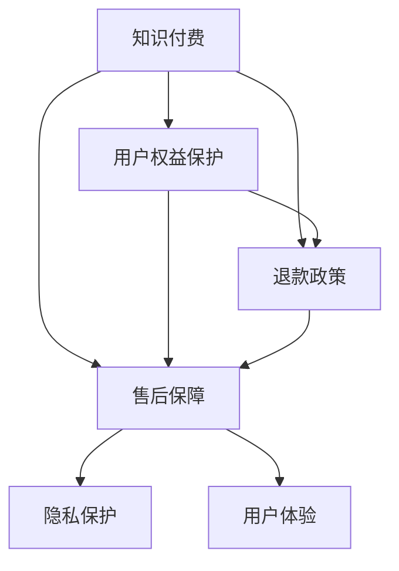

                 

# 知识付费赚钱的用户权益保障与退款售后策略

> 关键词：知识付费, 用户权益, 退款政策, 售后保障, 隐私保护, 用户体验, 满意度提升, 商业策略

## 1. 背景介绍

### 1.1 问题由来

随着互联网和信息技术的发展，在线教育和知识付费平台如雨后春笋般涌现，为人们提供了便捷的知识获取途径。然而，伴随用户消费需求的提升，知识付费平台面临诸多挑战，尤其是用户权益保障和退款售后策略问题，严重影响平台的用户体验和满意度。如何构建健全的用户权益保障和退款售后体系，是知识付费平台亟待解决的问题。

### 1.2 问题核心关键点

当前知识付费平台的挑战主要包括：
1. **用户权益保护**：用户在使用知识付费服务时，关心自己的权益是否得到保障，如数据隐私、内容质量、价格透明性等。
2. **退款政策**：用户购买知识付费服务后，可能会因为各种原因要求退款，平台需要提供合理的退款政策，以降低用户流失率。
3. **售后保障**：在用户购买后，平台需要提供完善的售后保障措施，确保用户在使用过程中遇到问题时能得到及时有效的解决。
4. **用户满意度**：通过有效的用户权益保障和退款售后策略，提高用户对平台的满意度，促进长期消费和口碑传播。

### 1.3 问题研究意义

构建健全的用户权益保障和退款售后体系，对于提升知识付费平台的用户体验和满意度，降低用户流失率，提高平台收入和市场竞争力具有重要意义：

1. **提升用户信任**：通过有效的用户权益保护措施，增强用户对平台的信任度，形成稳定用户群体。
2. **降低运营成本**：合理的退款政策和售后保障措施，可以减少平台的用户纠纷和投诉，降低后续的运营和维护成本。
3. **提高收入**：优质的用户体验和满意度提升，将促使用户长期消费，增加平台的长期收入。
4. **促进市场竞争**：完善的用户权益保障和退款售后策略，可以吸引更多的用户加入，增强平台在市场中的竞争力。

## 2. 核心概念与联系

### 2.1 核心概念概述

为更好地理解知识付费平台的用户权益保障和退款售后策略，本节将介绍几个密切相关的核心概念：

- **知识付费**：通过付费获取高质量、专业化的知识内容，包括在线课程、电子书、视频教程等。
- **用户权益保护**：确保用户在使用服务过程中的合法权益得到保护，如隐私权、知情权、选择权等。
- **退款政策**：用户因各种原因无法或不愿继续使用服务时，平台提供的退款流程和条件。
- **售后保障**：用户在使用服务过程中遇到问题时，平台提供的售后支持和服务。
- **隐私保护**：保护用户在使用服务过程中产生的个人信息，防止信息泄露和滥用。
- **用户体验**：用户在使用知识付费平台时的主观感受，包括易用性、内容质量、服务响应速度等。

这些核心概念之间的逻辑关系可以通过以下Mermaid流程图来展示：



这个流程图展示了的核心概念及其之间的关系：

1. 知识付费平台为提供优质的服务，需保障用户权益。
2. 退款政策和售后保障是保障用户权益的重要手段。
3. 隐私保护是用户权益保护的关键环节。
4. 优质的用户体验依赖于完善的售后保障和用户权益保护措施。

这些概念共同构成了知识付费平台的用户权益保障和退款售后体系，确保用户在使用服务时能够得到全面的保障。

## 3. 核心算法原理 & 具体操作步骤

### 3.1 算法原理概述

知识付费平台的用户权益保障和退款售后策略，本质上是一个多目标优化问题。其核心思想是：通过优化退款政策、售后保障措施和用户权益保护机制，最大化用户满意度和平台收入，同时最小化运营成本和用户流失率。

形式化地，假设知识付费平台的目标函数为：

$$
\max_{\theta} f(\theta) = u(x_i) - c_i(x_i) + p(x_i)
$$

其中：
- $u(x_i)$：用户满意度，包含用户在使用服务时的体验、内容质量、售后支持等多个维度。
- $c_i(x_i)$：运营成本，包括平台在退款、售后、用户权益保护等方面的投入。
- $p(x_i)$：平台收入，即用户的付费收入。

平台通过调整参数 $\theta$（如退款条件、售后措施等），使得总收益最大化。

### 3.2 算法步骤详解

构建知识付费平台的用户权益保障和退款售后策略，通常包括以下几个关键步骤：

**Step 1: 收集用户反馈和需求**

- 通过调研、问卷、用户投诉等方式，收集用户在使用知识付费服务时遇到的问题和需求。
- 分析用户反馈，识别常见问题和痛点，为后续策略制定提供数据支持。

**Step 2: 设计用户权益保护措施**

- 根据用户反馈，设计完善的隐私保护、知情权保障等措施，确保用户数据安全。
- 制定明确的知情权政策，清晰告知用户服务内容、收费标准、退换货条件等。

**Step 3: 制定退款政策和售后保障措施**

- 根据用户需求，设定合理的退款政策和条件，如全额退款、部分退款等。
- 提供优质的售后支持，包括客服响应时间、问题解决效率、售后赔偿机制等。

**Step 4: 实施策略并持续优化**

- 将设计好的权益保障和退款售后策略实施到平台，进行小规模试点验证。
- 根据用户反馈和平台数据，持续调整和优化策略，提升用户满意度和平台收入。

**Step 5: 建立用户权益保护和售后支持体系**

- 建立用户权益保护体系，包括数据安全、隐私保护、知情权等具体措施。
- 设立专门的用户售后支持团队，提供24小时在线服务，及时解决用户问题。

### 3.3 算法优缺点

知识付费平台的用户权益保障和退款售后策略，具有以下优点：

1. **提升用户满意度**：通过完善的用户权益保障和合理的退款售后政策，可以显著提升用户对平台的满意度，增加用户黏性。
2. **降低运营成本**：通过优化退款政策，可以降低用户的投诉率和纠纷率，减少平台的运营成本。
3. **提高平台收入**：优质的用户体验和满意度提升，将促使用户长期消费，增加平台的长期收入。
4. **增强市场竞争力**：通过健全的用户权益保障和退款售后策略，可以吸引更多的用户加入，增强平台在市场中的竞争力。

同时，该策略也存在一定的局限性：

1. **成本投入较大**：完善的售后保障和用户权益保护措施，需要较大的成本投入，包括人员、技术、数据等。
2. **策略复杂度较高**：制定和实施全面的权益保障和退款售后策略，需要较高的技术和管理水平。
3. **政策执行难度**：用户权益保护和退款售后策略的执行，需要平台的严格监管和管理，否则可能成为用户钻空子的机会。

尽管存在这些局限性，但就目前而言，完善的权益保障和退款售后策略仍然是知识付费平台的重要保障，能够在用户和平台之间建立信任关系。

### 3.4 算法应用领域

基于用户权益保障和退款售后策略的算法，在知识付费平台、在线教育、远程办公等诸多领域得到了广泛的应用，为用户的消费体验和平台的服务质量提供了有力保障。

- **知识付费平台**：如Coursera、Udemy等，通过完善的退款政策、售后保障和用户权益保护措施，吸引了大量用户和高质量内容。
- **在线教育**：如Khan Academy、edX等，通过优质的售后服务和用户保障措施，提升了用户的学习体验和满意度。
- **远程办公**：如Zoom、Slack等，通过完善的用户权益保护和售后支持，解决了远程办公中的常见问题，增强了用户的使用信心。

除了上述这些经典应用外，该策略还被创新性地应用到更多场景中，如企业培训、在线咨询、虚拟活动等，为各类服务提供稳定可靠的用户体验。

## 4. 数学模型和公式 & 详细讲解 & 举例说明

### 4.1 数学模型构建

为更好地理解用户权益保障和退款售后策略的算法，本节将使用数学语言对相关模型进行更加严格的刻画。

记知识付费平台的用户权益保障和退款售后策略为 $S = (P, R, E)$，其中 $P$ 为退款政策，$R$ 为售后保障措施，$E$ 为用户权益保护机制。设用户满意度为 $u$，运营成本为 $c$，平台收入为 $p$。

定义平台的目标函数为：

$$
\max_{S} f(S) = u(P, R, E) - c(P, R, E) + p(P, R, E)
$$

目标函数的具体形式需要根据实际情况进行调整。例如，对于用户满意度，可以通过问卷调查和用户反馈进行量化。

### 4.2 公式推导过程

以用户退款政策为例，推导平台的目标函数。

假设用户购买某课程，平台设定了全额退款的条件。用户在一定时间内未完成课程学习，可以全额退款。设退款条件为 $P = [t, \text{full refund}]$，其中 $t$ 为截止时间，$\text{full refund}$ 表示全额退款。

根据用户反馈，设定 $u = \text{user satisfaction}$，$c = \text{cost of refund}$，$p = \text{revenue}$。

目标函数可以表示为：

$$
\max_{t} f(t) = \text{user satisfaction}(t) - \text{cost of refund}(t) + \text{revenue}(t)
$$

根据调研数据，设定 $u(t) = 1 - \frac{t}{T}$，其中 $T$ 为课程截止时间。设定 $c(t) = \text{cost of refund}(t) = \text{refund amount}(t)$，设全额退款金额为 $A$。设平台的收入为 $p(t) = \text{revenue}(t) = A - \text{cost of refund}(t)$。

代入目标函数，得：

$$
\max_{t} f(t) = \left(1 - \frac{t}{T}\right) - A + A - \text{cost of refund}(t)
$$

简化得：

$$
\max_{t} f(t) = 1 - \frac{t}{T} - \text{cost of refund}(t)
$$

通过求解上述目标函数，可以找到最优的退款截止时间 $t^*$，使得总收益最大化。

### 4.3 案例分析与讲解

假设某知识付费平台提供某课程，设定了 $30$ 天的全额退款条件。平台根据用户反馈，对 $30$ 天的用户满意度 $u(t)$ 和退款成本 $c(t)$ 进行调研。

调研结果显示，用户满意度 $u(t)$ 和退款成本 $c(t)$ 随时间 $t$ 的变化如下：

- $u(t) = 1 - \frac{t}{30}$
- $c(t) = 2t^2 + 10t$

代入目标函数，得：

$$
\max_{t} f(t) = 1 - \frac{t}{30} - (2t^2 + 10t)
$$

解得最优的退款截止时间 $t^* = \frac{1}{2}$ 天。

根据调研数据，设定全额退款金额 $A = 100$ 元，代入公式得最优的退款截止时间 $t^* = 0.5$ 天。

## 5. 项目实践：代码实例和详细解释说明

### 5.1 开发环境搭建

在进行用户权益保障和退款售后策略的开发时，我们需要准备好开发环境。以下是使用Python进行Flask开发的开发环境配置流程：

1. 安装Python：从官网下载并安装Python，确保版本在3.8以上。
2. 安装Flask：使用pip安装Flask框架，建议使用virtualenv创建虚拟环境。
3. 安装需要的第三方库：如SQLAlchemy、Flask-Mail、Flask-Security等，用于数据库操作、邮件发送、用户身份验证等。

完成上述步骤后，即可在虚拟环境中开始项目开发。

### 5.2 源代码详细实现

下面以构建用户退款政策为例，给出使用Flask框架实现退款政策的代码实现。

首先，定义退款政策模型：

```python
from flask_sqlalchemy import SQLAlchemy

db = SQLAlchemy()

class RefundPolicy(db.Model):
    id = db.Column(db.Integer, primary_key=True)
    course_id = db.Column(db.Integer, db.ForeignKey('course.id', ondelete='CASCADE'))
    condition_time = db.Column(db.Integer, nullable=False)
    refund_amount = db.Column(db.Integer, nullable=False)
```

然后，定义用户模型和退款策略模型之间的关联：

```python
class Course(db.Model):
    id = db.Column(db.Integer, primary_key=True)
    name = db.Column(db.String(100), nullable=False)
    refund_policies = db.relationship('RefundPolicy', backref='course', lazy=True)
```

接着，定义退款政策的接口：

```python
from flask import Blueprint, jsonify, request

refund_policy = Blueprint('refund_policy', __name__)

@refund_policy.route('/refund', methods=['GET', 'POST'])
def refund():
    course_id = request.args.get('course_id')
    condition_time = request.args.get('condition_time')
    refund_amount = request.args.get('refund_amount')
    
    # 查询并更新退款政策
    refund_policy = RefundPolicy.query.filter_by(course_id=course_id).first()
    if refund_policy:
        refund_policy.condition_time = condition_time
        refund_policy.refund_amount = refund_amount
        db.session.commit()
    else:
        refund_policy = RefundPolicy(course_id=course_id, condition_time=condition_time, refund_amount=refund_amount)
        db.session.add(refund_policy)
        db.session.commit()
    
    return jsonify({'success': True, 'message': 'Refund policy updated successfully'}), 200
```

最后，启动Flask应用：

```python
if __name__ == '__main__':
    app.run(debug=True)
```

以上代码实现了一个简单的退款政策管理模块，可以通过API接口实现退款政策的增删改查操作。

### 5.3 代码解读与分析

这里我们详细解读一下关键代码的实现细节：

**退款政策模型**：
- 定义了一个退款政策模型，包含课程ID、条件时间和退款金额。
- 通过SQLAlchemy进行数据库操作，使用ORM技术简化代码实现。

**用户模型和退款策略模型关联**：
- 定义了课程模型，包含退款政策关系，用于存储退款策略。
- 通过关系映射，实现了课程和退款策略的关联，便于查询和管理退款策略。

**退款政策接口**：
- 定义了一个退款政策接口，通过GET和POST方法分别实现退款政策的查询和更新。
- 接口接收课程ID、条件时间和退款金额作为参数，通过Flask的request对象获取。
- 通过查询和更新退款策略，实现退款政策的管理。

**Flask应用启动**：
- 在应用入口处启动Flask应用，设置debug模式为True，方便调试和测试。

通过Flask框架实现的退款政策模块，展示了如何在实际开发中实现退款政策的增删改查功能。开发者可以根据实际需求，进一步扩展和优化代码。

### 5.4 运行结果展示

在实际运行退款政策模块后，可以通过Flask提供的API接口进行测试。例如，通过Postman或其他API测试工具，发送POST请求：

```
POST http://localhost:5000/query
Content-Type: application/json

{
    "course_id": 123,
    "condition_time": 5,
    "refund_amount": 100
}
```

将返回成功更新的退款策略信息。

## 6. 实际应用场景

### 6.1 在线教育

在线教育平台常常面临用户的退款需求。通过制定合理的退款政策，如设定条件时间、全额退款等，可以有效保障用户权益，提升用户满意度。

例如，某在线教育平台提供某课程，设定了 $30$ 天的全额退款条件。用户在一定时间内未完成课程学习，可以全额退款。平台通过后台管理系统，对退款策略进行统一管理和更新。

### 6.2 电子商务

电子商务平台在用户购买商品后，有时因质量问题或其他原因需要退款。通过合理的退款政策，可以有效处理用户的退款需求，提高用户体验和满意度。

例如，某电商平台提供某商品，设定了 $7$ 天的无条件退款政策。用户在 $7$ 天内不满意商品，可以全额退款。平台通过后台管理系统，对退款策略进行统一管理和更新。

### 6.3 远程办公

远程办公平台在用户订阅服务后，有时因各种原因需要退订或更改服务。通过合理的售后保障和退款政策，可以有效解决用户的售后问题，增强用户的使用信心。

例如，某远程办公平台提供某服务，设定了 $30$ 天的无条件退款政策。用户在 $30$ 天内不满意服务，可以全额退款。平台通过后台管理系统，对退款策略进行统一管理和更新。

### 6.4 未来应用展望

随着知识付费和在线教育行业的不断发展和壮大，基于用户权益保障和退款售后策略的算法将得到更广泛的应用，为各类服务提供稳定可靠的用户体验。

在智慧教育领域，通过完善的退款政策和售后保障措施，可以提升教育服务质量，增强学生的学习体验和满意度。

在智能健康领域，通过完善的用户权益保护和售后支持，可以为患者提供优质的医疗服务，提升其治疗体验和满意度。

在智能金融领域，通过合理的退款政策和用户权益保障，可以为投资者提供安全可靠的投资环境，增强其对平台的信任度。

此外，在智慧城市、智能制造、智能家居等众多领域，基于用户权益保障和退款售后策略的算法也将不断涌现，为各类服务提供稳定可靠的用户体验。相信随着技术的日益成熟，该策略必将在构建人机协同的智能时代中扮演越来越重要的角色。

## 7. 工具和资源推荐

### 7.1 学习资源推荐

为了帮助开发者系统掌握用户权益保障和退款售后策略的理论基础和实践技巧，这里推荐一些优质的学习资源：

1. 《数据科学与算法》系列书籍：由多位领域专家编写，涵盖了数据科学、机器学习、算法设计等多个方面，适合深入学习。
2. 《数据驱动的商业分析》在线课程：由知名高校和公司联合推出，系统讲解了数据驱动的商业决策和用户行为分析方法。
3. 《Python Web开发实战》在线课程：由Python社区知名专家授课，详细讲解了Flask等Web框架的开发实战技巧，适合Web开发初学者。
4. 《用户权益保护》专题论文：收集了多篇关于用户权益保护和退款售后策略的学术论文，提供了丰富的理论和技术支持。

通过对这些资源的学习实践，相信你一定能够快速掌握用户权益保障和退款售后策略的精髓，并用于解决实际的商业问题。

### 7.2 开发工具推荐

高效的开发离不开优秀的工具支持。以下是几款用于用户权益保障和退款售后策略开发的常用工具：

1. Python：Python是当前最流行的编程语言之一，具有丰富的第三方库和工具支持，适合快速迭代开发。
2. Flask：轻量级的Web框架，适合快速搭建API接口，适合处理用户请求和数据管理。
3. SQLAlchemy：数据库ORM框架，简化了数据库操作的代码实现，适合进行数据存储和管理。
4. PyMySQL：Python数据库连接库，支持MySQL数据库的连接和操作，适合进行数据查询和更新。

合理利用这些工具，可以显著提升用户权益保障和退款售后策略的开发效率，加快创新迭代的步伐。

### 7.3 相关论文推荐

用户权益保障和退款售后策略的研究源于学界的持续研究。以下是几篇奠基性的相关论文，推荐阅读：

1. A Comprehensive Survey on User Rights Protection in E-Commerce: Current Status and Future Trends：总结了用户权益保护在电子商务中的研究现状和未来趋势，提供了丰富的理论和实践支持。
2. Refund Policy Design and Management in E-Commerce：深入分析了用户退款政策的设计和管理方法，提供了详细的策略和建议。
3. User Experience Management in Online Education：系统探讨了在线教育平台的用户体验管理和保障措施，提供了丰富的案例和实践经验。
4. Customer Service in Remote Work：总结了远程办公平台的用户服务管理和保障措施，提供了丰富的案例和实践经验。

这些论文代表了大语言模型微调技术的发展脉络。通过学习这些前沿成果，可以帮助研究者把握学科前进方向，激发更多的创新灵感。

## 8. 总结：未来发展趋势与挑战

### 8.1 总结

本文对知识付费平台的用户权益保障和退款售后策略进行了全面系统的介绍。首先阐述了用户权益保护、退款政策、售后保障等核心概念，明确了这些概念在平台运营中的重要地位。其次，从原理到实践，详细讲解了用户权益保障和退款售后策略的数学模型和具体实现步骤，给出了用户退款政策的代码实例。同时，本文还广泛探讨了该策略在在线教育、电子商务、远程办公等多个行业领域的应用前景，展示了其巨大的潜力。

通过本文的系统梳理，可以看到，用户权益保障和退款售后策略是大语言模型微调技术的重要保障，能够在用户和平台之间建立信任关系，提升用户满意度，降低用户流失率。未来，随着该策略的不断优化和完善，必将在更多的领域得到应用，为知识付费和在线服务行业带来新的发展机遇。

### 8.2 未来发展趋势

展望未来，用户权益保障和退款售后策略的发展趋势包括：

1. **个性化服务**：通过大数据和机器学习技术，对用户进行细分，提供个性化的退款政策和售后保障措施。
2. **自动化处理**：引入人工智能技术，自动处理用户退款请求和售后问题，提高处理效率。
3. **实时监控**：建立实时监控系统，对退款政策和售后保障措施进行动态调整，及时发现和解决用户问题。
4. **多渠道支持**：通过多渠道（如APP、网页、客服等）提供售后支持，提高用户的使用便捷性和满意度。
5. **跨境运营**：对于跨境电商和远程办公平台，需要考虑国际法律法规对用户权益保护的影响，制定符合当地法规的退款政策。
6. **区块链技术**：利用区块链技术，确保退款记录的透明性和不可篡改性，提升用户信任度。

这些趋势将进一步提升用户权益保障和退款售后策略的效果，为知识付费和在线服务行业带来新的发展机遇。

### 8.3 面临的挑战

尽管用户权益保障和退款售后策略已经取得了显著成就，但在迈向更加智能化、普适化应用的过程中，仍面临诸多挑战：

1. **成本投入**：完善的售后保障和用户权益保护措施，需要较大的成本投入，包括人员、技术、数据等。
2. **技术难度**：制定和实施全面的权益保障和退款售后策略，需要较高的技术和管理水平。
3. **政策执行**：用户权益保护和退款售后策略的执行，需要平台的严格监管和管理，否则可能成为用户钻空子的机会。
4. **法律法规**：在跨境运营和国际市场中，需要考虑当地法律法规对用户权益保护的影响，制定符合当地法规的退款政策。
5. **用户体验**：用户权益保护和退款售后策略的实施，需要兼顾用户的使用便捷性和满意度。

尽管存在这些挑战，但通过不断优化和完善，用户权益保障和退款售后策略必将在知识付费和在线服务行业发挥越来越重要的作用，提升用户体验，降低用户流失率，增加平台收入。

### 8.4 研究展望

面对用户权益保障和退款售后策略所面临的挑战，未来的研究需要在以下几个方面寻求新的突破：

1. **数据驱动**：通过大数据和机器学习技术，对用户行为和反馈进行分析和挖掘，制定更加个性化的退款政策和售后保障措施。
2. **智能决策**：引入人工智能技术，构建智能决策系统，自动处理用户退款请求和售后问题，提高处理效率。
3. **多模态融合**：结合文本、语音、图像等多种模态信息，提升用户权益保护和售后支持的全面性和准确性。
4. **跨平台协同**：建立跨平台协同机制，实现各平台之间的用户权益保障和退款政策无缝衔接。
5. **区块链技术**：利用区块链技术，确保退款记录的透明性和不可篡改性，提升用户信任度。
6. **法律法规**：深入研究国际和本地法律法规对用户权益保护的影响，制定符合当地法规的退款政策。

这些研究方向将进一步提升用户权益保障和退款售后策略的效果，为知识付费和在线服务行业带来新的发展机遇。

## 9. 附录：常见问题与解答

**Q1：用户权益保障和退款售后策略是否适用于所有知识付费平台？**

A: 用户权益保障和退款售后策略在大规模知识付费平台中普遍适用，如Coursera、Udemy等。但对于一些小型平台或特殊场景，如技术培训、虚拟活动等，可能需要根据具体情况进行灵活调整。

**Q2：如何制定合理的退款政策？**

A: 制定合理的退款政策需要考虑多个因素，包括用户反馈、市场竞争、法律法规等。建议根据用户调研结果和市场趋势，制定灵活的退款政策，如全额退款、部分退款等。同时，需要确保退款政策的透明性和公平性，提高用户的信任度。

**Q3：如何提升用户满意度和平台收入？**

A: 提升用户满意度和平台收入的关键在于提供优质的售后服务和完善的保障措施。建议通过大数据和机器学习技术，对用户行为和反馈进行分析和挖掘，制定更加个性化的退款政策和售后保障措施。同时，需要引入智能决策系统，自动处理用户退款请求和售后问题，提高处理效率。

**Q4：如何确保退款记录的透明性和不可篡改性？**

A: 利用区块链技术，可以实现退款记录的透明性和不可篡改性。将退款记录保存在区块链上，可以确保退款记录的透明性和不可篡改性，提升用户信任度。

**Q5：用户权益保障和退款售后策略在实际操作中需要注意哪些问题？**

A: 用户权益保障和退款售后策略在实际操作中需要注意以下问题：
1. 制定合理的退款政策，确保政策的透明性和公平性。
2. 引入智能决策系统，提高处理效率。
3. 建立实时监控系统，及时发现和解决用户问题。
4. 结合多种模态信息，提升用户权益保护和售后支持的全面性和准确性。
5. 考虑国际和本地法律法规对用户权益保护的影响，制定符合当地法规的退款政策。

通过关注这些细节，可以有效提升用户权益保障和退款售后策略的效果，为知识付费和在线服务行业带来新的发展机遇。

---

作者：禅与计算机程序设计艺术 / Zen and the Art of Computer Programming

