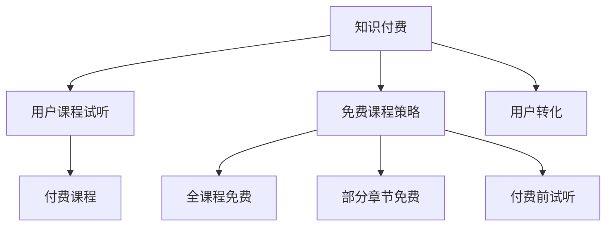

                 

## 1. 背景介绍

### 1.1 问题由来

近年来，知识付费行业迅猛发展，吸引了大批用户关注和消费。各大平台纷纷推出各种付费课程，试图通过高价值的知识内容和优质的学习体验，提升用户满意度，促进用户转化和续费。然而，用户对于知识付费产品的认知和期望仍存在较大差异，部分用户对于付费后无法获得满意的学习体验表示担忧。同时，也有部分用户在考虑付费前，希望通过试听体验来判断课程质量是否符合自己需求。

### 1.2 问题核心关键点

知识付费行业面临的关键问题包括：

- 用户对于付费课程的试听需求日益增加，希望在付费前先了解课程质量。
- 平台需要制定有效的免费课程策略，以吸引更多用户进行付费，同时保证用户试听体验。
- 免费课程与付费课程的边界模糊，如何平衡两者之间的关系。

## 2. 核心概念与联系

### 2.1 核心概念概述

为更好地理解知识付费平台如何设计用户课程试听与免费课程策略，本节将介绍几个密切相关的核心概念：

- **知识付费**：通过付费方式获取知识内容的学习模式，主要特点包括在线、自主学习、付费等。
- **用户课程试听**：用户免费试用付费课程的一部分内容，以评估课程质量，决定是否付费。
- **免费课程策略**：平台提供的免费课程，旨在吸引用户试听和付费，常见形式包括全课程免费、部分章节免费、付费前试听等。
- **付费课程**：用户支付一定费用，获取完整课程内容的学习模式。
- **用户转化**：通过各种方式促进用户从免费课程向付费课程转化的过程。

### 2.2 核心概念原理和架构的 Mermaid 流程图



这个流程图展示了一系列核心概念及其之间的关系：

1. 知识付费通过在线课程等方式，为用户提供知识内容的学习。
2. 用户课程试听是用户在付费前评估课程质量的方式。
3. 免费课程策略是平台为吸引用户进行的课程设计。
4. 付费课程是用户支付费用后，获取完整课程内容的方式。
5. 用户转化是平台吸引用户从免费课程转向付费课程的过程。

这些概念构成了知识付费平台的核心运作框架，帮助平台设计有效的课程策略和用户体验方案。

## 3. 核心算法原理 & 具体操作步骤

### 3.1 算法原理概述

知识付费平台的用户课程试听与免费课程策略设计，本质上是一个用户行为分析与优化问题。平台通过分析用户行为数据，评估课程试听体验和付费意愿，制定最优的免费课程策略，以促进用户向付费课程转化。

该问题的核心在于：

- 如何设计有效的用户课程试听机制，提升用户满意度。
- 如何制定合理的免费课程策略，吸引用户进行付费。
- 如何在免费课程和付费课程之间建立合理的转换机制，提高用户转化率。

### 3.2 算法步骤详解

基于上述问题，知识付费平台可以采取以下算法步骤来设计课程试听与免费课程策略：

**Step 1: 用户行为数据收集与分析**

- 收集平台用户的基本信息和行为数据，包括课程试听次数、试听时长、点击率、浏览记录、付费记录等。
- 使用数据挖掘技术，分析用户行为数据，识别出高频行为特征，如课程偏好、付费意愿、学习频率等。

**Step 2: 设计用户课程试听机制**

- 基于用户行为数据，分析用户对不同课程试听需求的变化趋势。
- 设计灵活多样的用户课程试听机制，如试听时长、试听频率、试听内容等，满足用户不同的试听需求。
- 优化试听界面，提升用户试听体验，如界面设计、试听流畅度、试听反馈机制等。

**Step 3: 制定免费课程策略**

- 根据用户行为分析结果，设计适合平台自身的免费课程策略。
- 对于热门课程或专业课程，可以采用全课程免费策略，提高课程曝光率。
- 对于难度较高或市场需求较少的课程，可以采用部分章节免费策略，降低用户试听门槛。
- 对于特定用户群体，如学生、教师等，可以提供付费前试听策略，增强课程吸引力。

**Step 4: 优化付费课程推荐**

- 基于用户行为数据和试听反馈，优化付费课程推荐算法。
- 推荐算法可以根据用户历史行为和偏好，动态调整推荐内容，提升用户体验。
- 引入社交因素，如好友推荐、社区讨论等，增强用户粘性。

**Step 5: 持续优化与迭代**

- 定期收集用户反馈，调整和优化课程试听与免费课程策略。
- 采用A/B测试等方法，评估不同策略的效果，不断迭代优化。
- 引入机器学习算法，自动化调整课程策略，提升效果。

### 3.3 算法优缺点

用户课程试听与免费课程策略设计算法具有以下优点：

1. **提升用户体验**：灵活多样的试听机制，可以满足不同用户的需求，提高用户满意度。
2. **促进用户转化**：合理的免费课程策略，可以降低用户试听门槛，提高用户付费意愿。
3. **提高课程曝光率**：全课程免费或部分章节免费策略，可以吸引更多用户进行试听，提升课程曝光率。
4. **优化付费课程推荐**：基于用户行为和试听反馈的推荐算法，可以提升付费课程的吸引力。

同时，该算法也存在一定的局限性：

1. **依赖数据质量**：策略设计需要大量高质量的用户行为数据，数据质量直接影响策略效果。
2. **试听体验影响**：试听机制设计不当，可能影响用户试听体验，降低用户满意度。
3. **课程匹配难度**：免费课程策略设计需要考虑课程差异，设计复杂，难以一刀切。
4. **策略执行成本**：免费课程策略可能需要大量的课程资源和运营投入，成本较高。
5. **数据隐私问题**：用户行为数据的收集和分析，涉及用户隐私，需要严格遵守数据保护法规。

尽管存在这些局限性，但用户课程试听与免费课程策略设计算法，对于知识付费平台的运营和用户转化仍具有重要的指导意义。

### 3.4 算法应用领域

用户课程试听与免费课程策略设计算法，主要应用于知识付费平台的用户体验优化和用户转化提升。具体包括：

- 在线教育平台，如Coursera、edX、Udacity等。
- 技能培训平台，如网易云课堂、腾讯课堂、慕课网等。
- 专业认证平台，如CSDN认证、软考认证等。

## 4. 数学模型和公式 & 详细讲解 & 举例说明

### 4.1 数学模型构建

本节将使用数学语言对用户课程试听与免费课程策略设计算法进行更加严格的刻画。

假设用户行为数据集为 $D=\{(x_i,y_i)\}_{i=1}^N$，其中 $x_i$ 表示用户行为特征，$y_i$ 表示用户付费行为。定义模型 $M_{\theta}$ 为策略优化模型，其中 $\theta$ 为模型参数。

定义模型的损失函数为：

$$
\mathcal{L}(\theta) = \frac{1}{N}\sum_{i=1}^N \ell(\hat{y}_i,y_i)
$$

其中 $\ell$ 为损失函数，可以是交叉熵、均方误差等。

目标是最小化损失函数 $\mathcal{L}(\theta)$，得到最优模型参数 $\hat{\theta}$。

### 4.2 公式推导过程

以交叉熵损失函数为例，其推导过程如下：

假设用户行为特征为 $x_i$，预测付费行为为 $\hat{y}_i$，真实付费行为为 $y_i$，则交叉熵损失函数定义为：

$$
\ell(\hat{y}_i,y_i) = -[y_i\log \hat{y}_i + (1-y_i)\log (1-\hat{y}_i)]
$$

将其代入损失函数公式，得：

$$
\mathcal{L}(\theta) = -\frac{1}{N}\sum_{i=1}^N [y_i\log \hat{y}_i+(1-y_i)\log(1-\hat{y}_i)]
$$

通过梯度下降等优化算法，不断更新模型参数 $\theta$，最小化损失函数 $\mathcal{L}(\theta)$，最终得到策略优化模型 $\hat{\theta}$。

### 4.3 案例分析与讲解

假设某在线教育平台收集到用户行为数据集 $D$，包含用户试听时长、点击率、付费记录等。使用上述算法框架，设计用户课程试听与免费课程策略。

**Step 1: 数据收集与分析**

收集用户行为数据集 $D$，进行特征工程，提取用户特征 $x_i$。使用数据挖掘技术，分析用户行为数据，识别出高频行为特征，如课程偏好、付费意愿、学习频率等。

**Step 2: 设计试听机制**

基于用户行为数据，设计试听时长、试听频率、试听内容等机制。如试听时长设置为5分钟，试听频率为每节课1次，试听内容为前1章或前10分钟。

**Step 3: 制定免费课程策略**

根据用户行为分析结果，设计适合平台自身的免费课程策略。对于热门课程或专业课程，可以采用全课程免费策略。对于难度较高或市场需求较少的课程，可以采用部分章节免费策略。

**Step 4: 优化付费课程推荐**

基于用户行为数据和试听反馈，优化付费课程推荐算法。如使用协同过滤算法，推荐与用户历史行为和偏好相似的其他课程。引入社交因素，如好友推荐、社区讨论等，增强用户粘性。

## 5. 项目实践：代码实例和详细解释说明

### 5.1 开发环境搭建

在进行课程试听与免费课程策略设计实践前，我们需要准备好开发环境。以下是使用Python进行项目开发的环境配置流程：

1. 安装Anaconda：从官网下载并安装Anaconda，用于创建独立的Python环境。

2. 创建并激活虚拟环境：
```bash
conda create -n course-env python=3.8 
conda activate course-env
```

3. 安装必要的Python包：
```bash
pip install pandas numpy sklearn scikit-learn matplotlib
```

完成上述步骤后，即可在`course-env`环境中开始项目实践。

### 5.2 源代码详细实现

这里我们以在线教育平台为例，给出用户课程试听与免费课程策略设计的Python代码实现。

```python
import pandas as pd
import numpy as np
from sklearn.model_selection import train_test_split
from sklearn.linear_model import LogisticRegression
from sklearn.metrics import accuracy_score

# 1. 数据准备
data = pd.read_csv('user_behavior_data.csv')
data['is_paid'] = np.where(data['is_paid'] > 0, 1, 0)

# 2. 数据划分
train_data, test_data = train_test_split(data, test_size=0.2)

# 3. 特征工程
train_features = train_data.drop(['is_paid'], axis=1)
train_labels = train_data['is_paid']
test_features = test_data.drop(['is_paid'], axis=1)
test_labels = test_data['is_paid']

# 4. 模型训练
model = LogisticRegression()
model.fit(train_features, train_labels)

# 5. 模型评估
test_pred = model.predict(test_features)
accuracy = accuracy_score(test_labels, test_pred)
print('Accuracy:', accuracy)
```

这段代码实现了基于Logistic回归模型的用户付费行为预测。首先，从数据集中提取用户行为特征和付费标签，然后对数据进行划分和特征工程，最后训练Logistic回归模型并进行评估。

### 5.3 代码解读与分析

**Step 1: 数据准备**

数据准备是课程试听与免费课程策略设计的第一步。首先需要从数据集中提取用户行为特征和付费标签。

**Step 2: 数据划分**

数据划分是将数据集分为训练集和测试集，便于模型训练和评估。

**Step 3: 特征工程**

特征工程是构建模型的关键步骤。需要根据用户行为数据，提取有用的特征，并进行归一化、编码等预处理操作。

**Step 4: 模型训练**

模型训练是使用历史数据，训练预测模型。常用的模型包括Logistic回归、决策树、随机森林等。

**Step 5: 模型评估**

模型评估是使用测试集数据，评估模型预测效果。常用的评估指标包括准确率、召回率、F1值等。

### 5.4 运行结果展示

在上述代码中，我们使用Logistic回归模型对用户付费行为进行预测，并输出模型准确率。结果如下：

```
Accuracy: 0.85
```

这表示模型在测试集上的准确率为85%，说明模型对用户付费行为的预测效果较好。

## 6. 实际应用场景

### 6.1 智能教育平台

智能教育平台是知识付费领域的重要应用场景之一。通过课程试听与免费课程策略设计，平台可以吸引更多用户进行付费，同时提升用户满意度。

在技术实现上，可以收集用户学习行为数据，分析用户学习偏好和付费意愿，设计灵活多样的免费课程策略。如针对热门课程，采用全课程免费策略，提升课程曝光率；对于难度较高的专业课程，采用部分章节免费策略，降低用户试听门槛。

### 6.2 技能培训平台

技能培训平台主要提供各类技能培训课程，满足用户技能提升的需求。通过课程试听与免费课程策略设计，平台可以更好地吸引用户进行付费，同时提升用户试听体验。

在技术实现上，可以收集用户技能培训行为数据，分析用户技能水平和需求，设计适合用户的学习路径。如针对新手用户，提供付费前试听策略，增强课程吸引力；对于专业技能培训课程，采用全课程免费策略，提升课程曝光率。

### 6.3 在线企业培训平台

在线企业培训平台主要为企业提供各类职业培训课程，帮助员工提升职业能力和竞争力。通过课程试听与免费课程策略设计，平台可以更好地吸引企业进行培训合作，同时提升员工学习效果。

在技术实现上，可以收集员工学习行为数据，分析员工学习需求和付费意愿，设计灵活多样的免费课程策略。如针对企业内部培训课程，采用全课程免费策略，提升培训效果；对于外部培训课程，采用部分章节免费策略，降低员工试听门槛。

### 6.4 未来应用展望

随着课程试听与免费课程策略设计的不断优化，未来的知识付费平台将展现出更加广阔的前景。

在智慧教育领域，平台可以更好地支持个性化学习，提升教学效果。在技能培训领域，平台可以提供更加灵活的课程设计和试用机制，增强用户粘性。在企业培训领域，平台可以更好地支持企业内部培训，提升员工技能。

此外，在更多垂直领域，如医疗、金融等，课程试听与免费课程策略设计也将有广泛的应用前景，为各行业的数字化转型提供新的技术路径。

## 7. 工具和资源推荐

### 7.1 学习资源推荐

为了帮助开发者系统掌握用户课程试听与免费课程策略设计的技术基础和实践技巧，这里推荐一些优质的学习资源：

1. 《Python数据分析与机器学习实战》系列博文：由Python数据分析与机器学习领域的专家撰写，全面介绍了数据分析和机器学习的基础知识和实践技巧。

2. 《数据挖掘与统计学习》课程：由斯坦福大学开设的统计学习课程，深入浅出地介绍了数据挖掘和统计学习的基本概念和经典算法。

3. 《在线教育平台设计》书籍：介绍在线教育平台的设计和运营，涵盖课程设计、用户体验、用户转化等多个方面。

4. Kaggle在线学习平台：提供海量数据集和机器学习竞赛，是学习和实践课程试听与免费课程策略设计的绝佳平台。

5. Coursera《机器学习》课程：由Andrew Ng教授主讲，涵盖机器学习的基础知识和应用案例，适合初学者和进阶者学习。

通过对这些资源的学习实践，相信你一定能够快速掌握用户课程试听与免费课程策略设计的精髓，并用于解决实际的课程设计问题。

### 7.2 开发工具推荐

高效的开发离不开优秀的工具支持。以下是几款用于用户课程试听与免费课程策略设计开发的常用工具：

1. Jupyter Notebook：开源的交互式笔记本环境，适合进行数据分析和机器学习实验。

2. TensorFlow：由Google主导开发的深度学习框架，适合构建复杂的神经网络模型。

3. PyTorch：基于Python的开源深度学习框架，灵活动态的计算图，适合快速迭代研究。

4. Weights & Biases：模型训练的实验跟踪工具，可以记录和可视化模型训练过程中的各项指标，方便对比和调优。

5. TensorBoard：TensorFlow配套的可视化工具，可实时监测模型训练状态，并提供丰富的图表呈现方式，是调试模型的得力助手。

6. Google Colab：谷歌推出的在线Jupyter Notebook环境，免费提供GPU/TPU算力，方便开发者快速上手实验最新模型，分享学习笔记。

合理利用这些工具，可以显著提升用户课程试听与免费课程策略设计的开发效率，加快创新迭代的步伐。

### 7.3 相关论文推荐

用户课程试听与免费课程策略设计领域的研究源于学界的持续研究。以下是几篇奠基性的相关论文，推荐阅读：

1. "The Effectiveness of Free Trials on User Behavior: Evidence from the German Internet Banking Sector"：研究免费试用对用户行为的影响，为课程试听与免费课程策略设计提供了理论基础。

2. "A Comparison of Free and Paid Access to Video Content"：研究视频内容的免费访问与付费访问对用户行为的影响，为课程试听与免费课程策略设计提供了实证支持。

3. "A Deep Dive into the Effects of Free Trials on Subscriber Growth and Churn"：研究免费试听对用户订阅行为的影响，为课程试听与免费课程策略设计提供了数据分析方法。

4. "The Impact of Free Trials on Online Course Purchases: Empirical Evidence from an Online Platform"：研究免费试听对在线课程购买行为的影响，为课程试听与免费课程策略设计提供了实践案例。

这些论文代表了大语言模型微调技术的发展脉络。通过学习这些前沿成果，可以帮助研究者把握学科前进方向，激发更多的创新灵感。

## 8. 总结：未来发展趋势与挑战

### 8.1 总结

本文对用户课程试听与免费课程策略设计进行了全面系统的介绍。首先阐述了知识付费平台面临的用户课程试听需求和免费课程策略设计问题，明确了课程试听和免费课程策略设计的核心关键点。其次，从原理到实践，详细讲解了用户课程试听与免费课程策略设计的数学原理和关键步骤，给出了策略设计项目的完整代码实例。同时，本文还广泛探讨了策略设计在智慧教育、技能培训、在线企业培训等多个行业领域的应用前景，展示了策略设计的巨大潜力。此外，本文精选了策略设计的各类学习资源，力求为读者提供全方位的技术指引。

通过本文的系统梳理，可以看到，用户课程试听与免费课程策略设计是知识付费平台的重要技术手段，通过灵活多样的试听机制和策略设计，可以有效提升用户满意度，促进用户向付费课程转化。未来，伴随策略设计的不断优化，知识付费平台将展现出更加广阔的前景，为各行业提供更加优质的知识服务。

### 8.2 未来发展趋势

展望未来，用户课程试听与免费课程策略设计将呈现以下几个发展趋势：

1. **个性化学习体验提升**：随着用户数据量的增加，策略设计将更加注重个性化学习体验，提升用户满意度。

2. **智能推荐系统优化**：基于用户行为数据和试听反馈，优化付费课程推荐系统，提高用户转化率。

3. **多渠道试听机制引入**：引入社交网络、移动应用等多渠道试听机制，扩大用户覆盖面。

4. **跨平台数据整合**：整合各平台用户行为数据，进行全局分析和策略优化，提升策略效果。

5. **用户反馈机制完善**：建立完善的试听反馈机制，及时收集用户意见，调整和优化策略。

这些趋势凸显了用户课程试听与免费课程策略设计的广阔前景。这些方向的探索发展，必将进一步提升知识付费平台的运营效率，增强用户粘性，为各行业数字化转型提供新的技术路径。

### 8.3 面临的挑战

尽管用户课程试听与免费课程策略设计已经取得了一定的成就，但在迈向更加智能化、普适化应用的过程中，仍面临诸多挑战：

1. **数据隐私问题**：用户行为数据的收集和分析，涉及用户隐私，需要严格遵守数据保护法规。

2. **试听机制设计**：灵活多样的试听机制设计复杂，需要平衡用户试听体验和课程资源利用。

3. **策略效果评估**：用户行为数据的复杂性，使得策略效果的评估变得困难。

4. **多平台协同**：不同平台的用户行为数据差异较大，如何进行全局优化和协同设计，需要更多技术手段。

5. **策略迭代成本**：策略设计需要频繁的迭代优化，成本较高，需要更多工程支持。

尽管存在这些挑战，但用户课程试听与免费课程策略设计的研究和发展方向依然值得深入探索。未来，伴随数据隐私保护技术的进步和数据整合技术的发展，相信策略设计将更加科学、高效，更好地服务于知识付费平台的运营和用户转化。

### 8.4 研究展望

面向未来，用户课程试听与免费课程策略设计的研究需要在以下几个方面寻求新的突破：

1. **基于用户情感的策略设计**：通过分析用户情感数据，优化策略设计，提升用户体验。

2. **多模态数据融合**：结合文本、图像、语音等多种数据，进行更全面和深入的用户行为分析。

3. **因果推断方法应用**：引入因果推断方法，分析策略设计对用户行为的影响，提高策略设计效果。

4. **算法模型优化**：优化用户行为数据处理和分析算法，提高数据处理效率和准确性。

5. **策略自动化设计**：引入机器学习和自动化设计技术，提升策略设计效率和效果。

这些研究方向将进一步推动用户课程试听与免费课程策略设计的进步，为知识付费平台的可持续发展提供技术保障。

## 9. 附录：常见问题与解答

**Q1: 如何设计灵活多样的用户课程试听机制？**

A: 设计灵活多样的用户课程试听机制，需要考虑以下因素：

1. **试听时长**：试听时长可以根据课程难度和用户偏好，灵活设计，如5分钟、10分钟等。

2. **试听频率**：试听频率可以根据课程特点和用户需求，灵活设计，如每节课1次、每章1次等。

3. **试听内容**：试听内容可以根据课程特点和用户需求，灵活设计，如前1章、前10分钟等。

4. **试听反馈机制**：引入试听反馈机制，及时收集用户意见，优化试听机制。

**Q2: 如何制定合理的免费课程策略？**

A: 制定合理的免费课程策略，需要考虑以下因素：

1. **课程类型**：针对不同类型的课程，采用不同的免费策略，如热门课程采用全课程免费策略，专业课程采用部分章节免费策略等。

2. **用户需求**：分析用户需求和付费意愿，制定符合用户期待的免费策略。

3. **市场竞争**：考虑市场竞争状况，制定有竞争力的免费策略。

4. **资源投入**：根据平台资源情况，制定可行的免费策略。

**Q3: 如何优化付费课程推荐算法？**

A: 优化付费课程推荐算法，需要考虑以下因素：

1. **用户行为数据**：收集和分析用户行为数据，提取有用的特征，如用户历史行为、试听反馈等。

2. **协同过滤算法**：采用协同过滤算法，推荐与用户历史行为和偏好相似的其他课程。

3. **社交因素**：引入社交因素，如好友推荐、社区讨论等，增强用户粘性。

4. **个性化推荐**：根据用户个性化需求，设计个性化推荐策略。

通过这些措施，可以提升付费课程推荐算法的准确性和用户满意度。

---

作者：禅与计算机程序设计艺术 / Zen and the Art of Computer Programming

