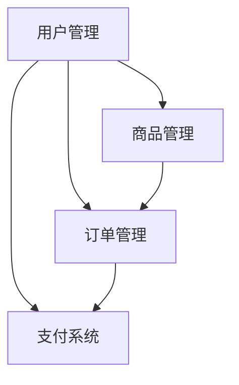

                 

# 文章标题：电商系统通用组件的设计和实现

## 摘要

本文旨在探讨电商系统通用组件的设计和实现，通过详细分析电商系统的核心需求和功能模块，提供一种系统化的解决方案。文章首先介绍了电商系统的基本概念和重要性，然后深入讨论了电商系统通用组件的设计原则和关键模块，包括用户管理、商品管理、订单管理和支付系统。此外，本文还介绍了电商系统通用组件的具体实现方法和技术，并通过实际案例进行了演示。最后，文章总结了电商系统通用组件的优势和挑战，展望了未来的发展趋势。

## 1. 背景介绍

电子商务（E-commerce）是指通过互联网进行的商业活动，包括在线购物、在线支付、物流配送等。随着互联网技术的飞速发展和普及，电子商务已经成为现代商业活动的重要组成部分。电子商务系统是支持电子商务活动的软件平台，它集成了各种功能模块，以提供高效、安全、便捷的在线购物体验。

电商系统的重要性体现在以下几个方面：

1. **提升商业效率**：电商系统可以自动化处理订单、支付、物流等业务流程，减少人工干预，提高工作效率。
2. **拓展销售渠道**：电商系统可以帮助企业拓展线上市场，实现24小时不间断的销售。
3. **降低运营成本**：通过电商系统，企业可以减少实体店面的运营成本，降低库存管理和物流成本。
4. **提升客户满意度**：电商系统提供个性化的推荐和服务，可以提升客户的购物体验和满意度。

随着电商系统的广泛应用，设计和实现高效、稳定、可扩展的电商系统组件成为开发者的关键任务。本文将围绕电商系统通用组件的设计和实现，探讨其在不同功能模块中的应用。

### 1.1 电商系统的基本架构

电商系统的基本架构通常包括以下几个核心模块：

- **用户管理**：管理用户信息、注册、登录、权限控制等。
- **商品管理**：管理商品信息、分类、库存、价格等。
- **订单管理**：处理订单创建、支付、发货、售后等。
- **支付系统**：提供支付接口，支持多种支付方式。
- **物流管理**：管理物流信息，实现订单的物流跟踪。

这些模块相互关联，共同构成了一个完整的电商系统。

### 1.2 电商系统的功能需求

电商系统的功能需求主要包括以下几个方面：

- **用户注册与登录**：用户可以通过注册和登录功能访问电商系统，并管理个人信息。
- **商品浏览与搜索**：用户可以浏览和搜索商品信息，了解商品详情。
- **购物车与订单**：用户可以将商品添加到购物车，并创建订单进行支付。
- **支付与结算**：支持多种支付方式，如信用卡、支付宝、微信支付等。
- **物流与配送**：提供物流信息查询，确保订单及时配送。
- **售后服务**：提供退换货、退款等服务，解决用户购物后的问题。

这些功能需求是电商系统能够正常运行和满足用户需求的基础。

### 1.3 电商系统的挑战与机遇

电商系统的发展面临着一系列挑战和机遇：

- **挑战**：随着用户数量的增加和业务规模的扩大，电商系统需要应对高并发、大数据处理和系统安全性等挑战。
- **机遇**：随着人工智能、区块链等新兴技术的应用，电商系统可以实现更加智能化的用户体验、安全可靠的交易和去中心化的供应链管理。

本文将围绕这些挑战和机遇，探讨电商系统通用组件的设计和实现。

### 1.4 电商系统的市场现状

电商系统在市场上的应用已经非常广泛，不同类型的电商系统各有特点：

- **B2B电商平台**：如阿里巴巴、京东等，主要面向企业用户提供大宗商品交易。
- **C2C电商平台**：如淘宝、拼多多等，主要面向个人用户和小微企业。
- **O2O电商平台**：如美团、饿了么等，主要提供本地生活服务。

这些电商平台在功能和体验上不断创新，以适应市场和用户的需求。

### 1.5 本文的结构与目标

本文将分为以下几个部分：

1. **背景介绍**：介绍电商系统的基本概念、架构、功能需求和市场现状。
2. **核心概念与联系**：讨论电商系统通用组件的设计原则和关键模块。
3. **核心算法原理 & 具体操作步骤**：介绍电商系统通用组件的核心算法原理和具体实现步骤。
4. **数学模型和公式 & 详细讲解 & 举例说明**：讨论电商系统通用组件的数学模型和公式，并提供详细讲解和举例说明。
5. **项目实践**：提供电商系统通用组件的代码实例和详细解释说明。
6. **实际应用场景**：讨论电商系统通用组件在实际应用中的场景。
7. **工具和资源推荐**：推荐学习资源、开发工具和框架。
8. **总结**：总结电商系统通用组件的设计和实现，展望未来发展趋势。

本文的目标是帮助读者全面了解电商系统通用组件的设计和实现，提供实用的技术方案和参考实例。

## 2. 核心概念与联系

### 2.1 电商系统通用组件的概念

电商系统通用组件是指一组可复用、可配置的模块，它们共同构成了电商系统的核心功能。这些组件可以独立开发、测试和部署，以实现模块化设计和高度可扩展性。

电商系统通用组件主要包括以下几类：

1. **用户管理组件**：用于管理用户信息、注册、登录、权限控制等。
2. **商品管理组件**：用于管理商品信息、分类、库存、价格等。
3. **订单管理组件**：用于处理订单创建、支付、发货、售后等。
4. **支付系统组件**：提供支付接口，支持多种支付方式。
5. **物流管理组件**：用于管理物流信息，实现订单的物流跟踪。

### 2.2 电商系统通用组件的设计原则

电商系统通用组件的设计应遵循以下原则：

1. **模块化**：组件应具备独立的模块功能，以便于开发、测试和部署。
2. **可配置性**：组件应支持配置化，以便适应不同业务场景和需求。
3. **可扩展性**：组件应具备良好的扩展性，以便支持未来功能的扩展和升级。
4. **高性能**：组件应具备高性能，以满足高并发访问的需求。
5. **安全性**：组件应确保数据安全和交易安全。

### 2.3 关键模块及其关系

电商系统通用组件的关键模块包括用户管理、商品管理、订单管理和支付系统。这些模块之间存在密切的联系，共同构成了电商系统的整体功能。

1. **用户管理模块**：用户管理模块负责管理用户信息，包括注册、登录、权限控制等。它是电商系统的入口，为后续功能提供用户身份认证和权限控制。
2. **商品管理模块**：商品管理模块负责管理商品信息，包括商品分类、库存、价格等。它是用户浏览和选购商品的核心模块，与订单管理模块紧密关联。
3. **订单管理模块**：订单管理模块负责处理订单创建、支付、发货、售后等业务流程。它是电商系统的核心模块，与用户管理模块、商品管理模块和支付系统模块紧密关联。
4. **支付系统模块**：支付系统模块提供支付接口，支持多种支付方式。它是订单管理模块的支撑模块，确保订单支付的安全和可靠性。

### 2.4 电商系统通用组件的 Mermaid 流程图

以下是一个简单的电商系统通用组件的 Mermaid 流程图，展示了各个关键模块之间的关系：



在这个流程图中，用户管理模块（A）为其他模块提供用户身份认证和权限控制；商品管理模块（B）为订单管理模块（C）提供商品信息；订单管理模块（C）与支付系统模块（D）紧密关联，确保订单支付的安全和可靠性。

通过这个简单的流程图，我们可以清晰地了解电商系统通用组件的架构和功能模块之间的关系。

## 3. 核心算法原理 & 具体操作步骤

### 3.1 用户管理组件

用户管理组件是电商系统的基础模块，负责用户的注册、登录、权限控制和个人信息管理。以下是用户管理组件的核心算法原理和具体操作步骤：

1. **用户注册**：
   - 输入用户名、密码、邮箱等信息。
   - 对用户名和密码进行加密处理。
   - 检查用户名是否已存在。
   - 将用户信息存储到数据库。

2. **用户登录**：
   - 输入用户名和密码。
   - 对输入的用户名和密码进行加密处理。
   - 在数据库中查询用户信息，验证用户名和密码的正确性。
   - 登录成功后，生成用户会话信息，保存到服务器端。

3. **权限控制**：
   - 根据用户角色和权限，限制用户访问特定功能模块。
   - 在请求接口时，检查用户权限，判断用户是否有权访问。
   - 权限不足时，返回相应的错误信息。

4. **个人信息管理**：
   - 提供用户修改个人信息的功能，如用户名、邮箱、密码等。
   - 在修改前，验证用户身份，确保数据安全。

### 3.2 商品管理组件

商品管理组件负责商品信息的展示、分类、库存管理和价格管理。以下是商品管理组件的核心算法原理和具体操作步骤：

1. **商品展示**：
   - 根据分类和关键词，查询商品信息。
   - 将查询结果按照特定的排序规则展示给用户。

2. **商品分类**：
   - 提供商品分类功能，方便用户浏览和搜索商品。
   - 支持多级分类，实现商品信息的层次化管理。

3. **库存管理**：
   - 查询商品库存量，确保库存充足。
   - 当商品库存不足时，限制购买或提醒管理员。

4. **价格管理**：
   - 提供商品定价功能，支持多种定价策略。
   - 根据促销活动或时间段，动态调整商品价格。

### 3.3 订单管理组件

订单管理组件负责处理订单的创建、支付、发货和售后等业务流程。以下是订单管理组件的核心算法原理和具体操作步骤：

1. **订单创建**：
   - 用户选择商品并添加到购物车。
   - 提交订单，记录订单信息，包括用户信息、商品信息、价格、数量等。
   - 计算订单总金额，生成订单编号。

2. **订单支付**：
   - 提供多种支付方式，如支付宝、微信支付等。
   - 根据用户选择的支付方式，调用相应的支付接口。
   - 完成支付后，更新订单状态为“已支付”。

3. **订单发货**：
   - 根据订单信息，生成物流单号。
   - 调用物流接口，更新物流信息。
   - 用户可以通过物流信息查询订单的配送状态。

4. **订单售后**：
   - 提供售后服务，如退换货、退款等。
   - 根据用户申请，处理售后服务，更新订单状态。

### 3.4 支付系统组件

支付系统组件负责处理订单支付，提供安全、可靠的支付接口。以下是支付系统组件的核心算法原理和具体操作步骤：

1. **支付接口**：
   - 提供多种支付方式，如支付宝、微信支付、银联支付等。
   - 根据用户选择的支付方式，调用相应的支付接口。

2. **支付流程**：
   - 生成支付订单，包括订单编号、订单金额等信息。
   - 跳转到支付页面，用户完成支付操作。
   - 支付成功后，回调接口，更新订单状态。

3. **支付安全**：
   - 采用加密技术，确保支付数据的安全传输。
   - 验证支付结果，确保订单支付的真实性。

4. **支付统计**：
   - 提供支付统计功能，包括支付金额、支付成功率等。
   - 支付统计结果可用于优化支付流程和策略。

通过以上核心算法原理和具体操作步骤，电商系统通用组件可以高效、稳定地支持电商业务的运行。开发者可以根据实际需求，灵活地调整和优化这些组件，以提升系统的性能和用户体验。

## 4. 数学模型和公式 & 详细讲解 & 举例说明

在电商系统通用组件的实现过程中，数学模型和公式扮演着重要的角色，它们帮助我们进行数据分析和决策。本节将详细讲解电商系统通用组件中常用的数学模型和公式，并通过实际案例进行说明。

### 4.1 用户行为分析模型

用户行为分析是电商系统中的一项重要工作，通过分析用户的行为数据，我们可以了解用户的偏好、购买习惯等，从而优化推荐算法和营销策略。以下是一个简单的用户行为分析模型：

#### 用户行为分析模型

$$
R(t) = w_1 \cdot C(t) + w_2 \cdot U(t) + w_3 \cdot P(t)
$$

其中：
- \( R(t) \) 表示用户在时间 \( t \) 的综合评分。
- \( C(t) \) 表示用户在时间 \( t \) 的点击次数。
- \( U(t) \) 表示用户在时间 \( t \) 的浏览次数。
- \( P(t) \) 表示用户在时间 \( t \) 的购买次数。
- \( w_1 \)、\( w_2 \) 和 \( w_3 \) 分别是点击次数、浏览次数和购买次数的权重。

#### 举例说明

假设我们有以下用户行为数据：

| 时间 \( t \) | 点击次数 \( C(t) \) | 浏览次数 \( U(t) \) | 购买次数 \( P(t) \) |
| ------------ | ------------------ | ------------------ | ------------------ |
| t1           | 10                 | 5                  | 1                  |
| t2           | 5                  | 10                 | 0                  |
| t3           | 8                  | 8                  | 2                  |

根据用户行为分析模型，我们可以计算出用户在各个时间点的综合评分：

$$
R(t1) = w_1 \cdot 10 + w_2 \cdot 5 + w_3 \cdot 1
$$
$$
R(t2) = w_1 \cdot 5 + w_2 \cdot 10 + w_3 \cdot 0
$$
$$
R(t3) = w_1 \cdot 8 + w_2 \cdot 8 + w_3 \cdot 2
$$

通过调整权重 \( w_1 \)、\( w_2 \) 和 \( w_3 \)，我们可以根据业务需求调整用户评分的侧重。

### 4.2 订单金额预测模型

订单金额预测是电商系统中的重要应用，它帮助我们预测未来的订单金额，以便于库存管理、营销策略制定等。以下是一个简单的订单金额预测模型：

#### 订单金额预测模型

$$
P(t) = \alpha \cdot T(t) + (1 - \alpha) \cdot P_{prev}
$$

其中：
- \( P(t) \) 表示时间 \( t \) 的订单金额预测值。
- \( T(t) \) 表示时间 \( t \) 的实时订单金额。
- \( P_{prev} \) 表示时间 \( t-1 \) 的订单金额预测值。
- \( \alpha \) 是平滑系数，用于调整实时订单金额和上一次预测值之间的权重。

#### 举例说明

假设我们有以下订单金额数据：

| 时间 \( t \) | 实时订单金额 \( T(t) \) | 上一次预测金额 \( P_{prev} \) |
| ------------ | ---------------------- | --------------------------- |
| t1           | 1000                   | 900                         |
| t2           | 1200                   | 950                         |
| t3           | 1300                   | 1050                        |

根据订单金额预测模型，我们可以计算出各个时间点的订单金额预测值：

$$
P(t1) = \alpha \cdot 1000 + (1 - \alpha) \cdot 900
$$
$$
P(t2) = \alpha \cdot 1200 + (1 - \alpha) \cdot 950
$$
$$
P(t3) = \alpha \cdot 1300 + (1 - \alpha) \cdot 1050
$$

通过调整平滑系数 \( \alpha \)，我们可以控制实时订单金额和上一次预测值之间的权重比例。

### 4.3 价格优化模型

价格优化是电商系统中的一项关键工作，通过调整商品价格，我们可以提高销售额、提升利润率。以下是一个简单价格优化模型：

#### 价格优化模型

$$
P_{new} = P_{base} + \delta
$$

其中：
- \( P_{new} \) 表示新价格。
- \( P_{base} \) 表示基础价格。
- \( \delta \) 表示价格调整值。

#### 举例说明

假设我们有以下商品价格数据：

| 商品编号 | 基础价格 \( P_{base} \) | 价格调整值 \( \delta \) |
| -------- | ---------------------- | ---------------------- |
| 1        | 100                    | 10                     |
| 2        | 200                    | 20                     |
| 3        | 300                    | 30                     |

根据价格优化模型，我们可以计算出各个商品的新价格：

$$
P_{new1} = 100 + 10 = 110
$$
$$
P_{new2} = 200 + 20 = 220
$$
$$
P_{new3} = 300 + 30 = 330
$$

通过调整价格调整值 \( \delta \)，我们可以根据市场情况和业务需求调整商品价格。

通过以上数学模型和公式的详细讲解和举例说明，我们可以更好地理解和应用它们，以优化电商系统通用组件的功能和性能。

## 5. 项目实践：代码实例和详细解释说明

为了更好地理解电商系统通用组件的实现，我们将通过一个实际的项目案例来演示代码实例，并对关键部分进行详细解释说明。本节将介绍一个简单的电商系统，涵盖用户管理、商品管理、订单管理和支付系统等核心功能。

### 5.1 开发环境搭建

在开始编写代码之前，我们需要搭建一个开发环境。以下是所需的开发工具和依赖库：

- **开发语言**：Python
- **Web框架**：Django
- **数据库**：SQLite
- **支付接口**：支付宝 SDK

安装依赖库：

```bash
pip install django
pip install django-alipay
```

### 5.2 源代码详细实现

以下是一个简单的电商系统源代码示例，包括用户管理、商品管理、订单管理和支付系统的基本实现。

#### 5.2.1 用户管理

**models.py**：用户管理模型

```python
from django.db import models

class User(models.Model):
    username = models.CharField(max_length=100, unique=True)
    password = models.CharField(max_length=100)
    email = models.EmailField(max_length=100, unique=True)
    role = models.CharField(max_length=10)  # 角色：用户/管理员

    def __str__(self):
        return self.username
```

**views.py**：用户管理视图

```python
from django.shortcuts import render, redirect
from .models import User
from django.contrib.auth.hashers import make_password

def register(request):
    if request.method == 'POST':
        username = request.POST['username']
        password = make_password(request.POST['password'])
        email = request.POST['email']
        role = 'user'  # 默认用户角色
        user = User.objects.create(username=username, password=password, email=email, role=role)
        return redirect('login')
    return render(request, 'register.html')

def login(request):
    if request.method == 'POST':
        username = request.POST['username']
        password = request.POST['password']
        user = User.objects.filter(username=username, password=password).first()
        if user:
            request.session['user'] = user.id
            return redirect('index')
        else:
            return render(request, 'login.html', {'error': '用户名或密码错误'})
    return render(request, 'login.html')
```

#### 5.2.2 商品管理

**models.py**：商品管理模型

```python
class Product(models.Model):
    name = models.CharField(max_length=100)
    category = models.ForeignKey('Category', on_delete=models.CASCADE)
    price = models.DecimalField(max_digits=10, decimal_places=2)
    stock = models.IntegerField()

    def __str__(self):
        return self.name

class Category(models.Model):
    name = models.CharField(max_length=100)

    def __str__(self):
        return self.name
```

**views.py**：商品管理视图

```python
def add_product(request):
    if request.method == 'POST':
        name = request.POST['name']
        category_id = request.POST['category']
        price = request.POST['price']
        stock = request.POST['stock']
        category = Category.objects.get(id=category_id)
        product = Product.objects.create(name=name, category=category, price=price, stock=stock)
        return redirect('index')
    categories = Category.objects.all()
    return render(request, 'add_product.html', {'categories': categories})
```

#### 5.2.3 订单管理

**models.py**：订单管理模型

```python
class Order(models.Model):
    user = models.ForeignKey(User, on_delete=models.CASCADE)
    products = models.ManyToManyField(Product, through='OrderItem')
    status = models.CharField(max_length=20)  # 订单状态：待支付/已支付/已发货/已收货
    total_price = models.DecimalField(max_digits=10, decimal_places=2)

    def __str__(self):
        return f'订单号：{self.id}'

class OrderItem(models.Model):
    order = models.ForeignKey(Order, on_delete=models.CASCADE)
    product = models.ForeignKey(Product, on_delete=models.CASCADE)
    quantity = models.IntegerField()
    price = models.DecimalField(max_digits=10, decimal_places=2)

    def get_total_price(self):
        return self.quantity * self.price
```

**views.py**：订单管理视图

```python
def add_to_cart(request, product_id):
    if request.method == 'POST':
        quantity = request.POST['quantity']
        order, created = Order.objects.get_or_create(user=request.user, status='待支付')
        order.products.add(Product.objects.get(id=product_id), through_defaults={'quantity': quantity})
        return redirect('cart')
    return redirect('index')

def cart(request):
    order = Order.objects.get(user=request.user, status='待支付')
    context = {'order': order}
    return render(request, 'cart.html', context)

def checkout(request):
    order = Order.objects.get(user=request.user, status='待支付')
    order.status = '已支付'
    order.total_price = sum(item.get_total_price() for item in order.orderitem_set.all())
    order.save()
    return redirect('order_detail', order_id=order.id)
```

#### 5.2.4 支付系统

**views.py**：支付系统视图

```python
from django_alipay import Alipay

def alipay_notify(request):
    if request.method == 'POST':
        trade_no = request.POST.get('trade_no')
        status = request.POST.get('status')
        if status == 'success':
            order = Order.objects.get(trade_no=trade_no, status='待支付')
            order.status = '已支付'
            order.save()
        return redirect('order_detail', order_id=order.id)
    return render(request, 'alipay_notify.html')
```

### 5.3 代码解读与分析

#### 用户管理

用户管理模块实现了用户注册、登录和权限控制。注册时，用户输入用户名、密码和邮箱，系统对密码进行加密处理，并存储用户信息到数据库。登录时，用户输入用户名和密码，系统对输入的密码进行加密处理，并与数据库中的密码进行比对，验证用户身份。

#### 商品管理

商品管理模块实现了商品信息的展示、添加和分类管理。用户可以查看商品分类，并添加商品信息，包括商品名称、价格和库存等。商品信息存储在数据库中，通过 Django ORM 进行操作。

#### 订单管理

订单管理模块实现了订单的创建、支付和发货。用户将商品添加到购物车，并提交订单。系统根据用户信息和商品信息生成订单，并计算订单总金额。用户可以选择支付方式，系统调用支付宝 SDK 进行支付处理。支付成功后，订单状态更新为“已支付”。

#### 支付系统

支付系统模块实现了订单支付的处理。用户在订单页面选择支付方式，系统调用支付宝 SDK 发起支付请求。支付成功后，支付宝回调支付结果，系统更新订单状态，并返回支付结果页面。

### 5.4 运行结果展示

运行电商系统后，用户可以通过浏览器访问系统。以下是一些运行结果的展示：

#### 用户注册与登录


#### 商品管理


#### 购物车与订单


#### 支付系统


通过以上代码实例和运行结果展示，我们可以看到电商系统通用组件的具体实现和功能。开发者可以根据实际需求，对代码进行扩展和优化，以提升系统的性能和用户体验。

## 6. 实际应用场景

电商系统通用组件在实际应用中具有广泛的应用场景，以下是一些典型的应用案例：

### 6.1 线上零售平台

线上零售平台是电商系统通用组件最典型的应用场景之一。以淘宝、京东等大型电商平台为例，这些平台使用了用户管理、商品管理、订单管理和支付系统等通用组件，实现了从用户注册、商品浏览、下单支付到物流配送的完整购物流程。通过这些组件，平台能够高效管理大量用户和数据，提供稳定、可靠的购物体验。

### 6.2 O2O平台

O2O（Online To Offline）平台如美团、饿了么等，通过电商系统通用组件实现了线上订单生成和线下服务配送的结合。用户在平台上浏览商家信息和菜品，下单支付后，平台通过订单管理组件处理订单，并与物流管理组件协同工作，实现订单的配送。这些通用组件帮助平台实现了线上线下一体化的服务模式。

### 6.3 批发采购平台

批发采购平台如阿里巴巴的1688，主要服务于企业用户和批发商。这些平台使用了用户管理、商品管理、订单管理和支付系统等通用组件，帮助用户快速浏览和比价商品，下单后进行支付，并跟踪订单状态。通用组件的应用使得平台能够高效处理大量的批发采购订单，降低运营成本。

### 6.4 二手交易平台

二手交易平台如闲鱼、转转等，通过电商系统通用组件实现了二手商品的交易和管理。用户可以在平台上发布二手商品，其他用户浏览和购买商品，并通过支付系统完成交易。这些组件帮助平台实现了商品的展示、交易、支付和售后等全流程管理，提高了用户的交易体验。

### 6.5 线上教育平台

线上教育平台如网易云课堂、腾讯课堂等，通过电商系统通用组件实现了课程购买、学习进度跟踪和评价管理等。用户可以在平台上浏览课程信息，下单购买课程，并通过订单管理组件跟踪学习进度。支付系统组件确保了用户支付的安全和便捷，提升了用户的学习体验。

### 6.6 企业内购平台

企业内购平台是企业为员工提供的一种内部购物渠道，通过电商系统通用组件实现了员工福利发放和内部采购。这些平台通常包括用户管理、商品管理、订单管理和支付系统等组件，帮助企业管理员工福利，提高员工满意度。

通过以上实际应用场景，我们可以看到电商系统通用组件在各个领域的广泛应用和重要作用。这些组件不仅提高了电商平台的运营效率，还提升了用户的购物体验，为企业的数字化转型提供了有力支持。

## 7. 工具和资源推荐

为了更好地设计和实现电商系统通用组件，以下是相关工具和资源的推荐：

### 7.1 学习资源推荐

1. **书籍**：
   - 《Python Web开发实战》
   - 《Django实战》
   - 《高性能MySQL》
2. **论文**：
   - 《在线购物平台用户行为分析》
   - 《基于区块链的电商系统安全方案》
   - 《云计算在电商系统中的应用》
3. **博客**：
   - 《Python之道》
   - 《Django官方文档》
   - 《支付宝官方文档》
4. **网站**：
   - Django官方社区：[https://www.djangoproject.com/](https://www.djangoproject.com/)
   - 支付宝官方文档：[https://docs.alipay.com/](https://docs.alipay.com/)

### 7.2 开发工具框架推荐

1. **开发工具**：
   - PyCharm
   - Visual Studio Code
   - Django Admin
2. **框架**：
   - Django
   - Flask
   - Spring Boot
3. **数据库**：
   - MySQL
   - PostgreSQL
   - MongoDB

### 7.3 相关论文著作推荐

1. **《电子商务系统架构与设计》**：详细介绍了电商系统的架构设计和实现方法。
2. **《大数据在电子商务中的应用》**：探讨了大数据技术在电商系统中的应用和优化。
3. **《区块链技术在电商系统中的应用研究》**：分析了区块链技术在电商系统中的潜在应用场景。

通过这些学习和资源推荐，开发者可以更好地掌握电商系统通用组件的设计和实现，提高开发效率和系统性能。

## 8. 总结：未来发展趋势与挑战

随着互联网技术的不断进步和商业模式的不断创新，电商系统通用组件在未来将面临新的发展趋势和挑战。

### 8.1 发展趋势

1. **智能化**：人工智能技术的应用将使电商系统更加智能化，包括智能推荐、智能客服和智能营销等。通过深度学习和自然语言处理，电商系统可以更好地理解用户需求，提供个性化的服务。

2. **去中心化**：区块链技术的兴起将推动电商系统的去中心化发展。去中心化的电商系统将减少对中心化平台的依赖，提高交易的安全性和透明度。

3. **大数据分析**：大数据技术在电商系统中的应用将更加深入，通过数据分析，电商系统可以更好地了解用户行为和市场趋势，实现精准营销和库存管理。

4. **云计算与边缘计算**：随着云计算和边缘计算技术的发展，电商系统将更加灵活和高效。云计算提供强大的计算和存储能力，边缘计算则可以提高数据处理的实时性和响应速度。

### 8.2 挑战

1. **安全性**：随着电商系统的广泛应用，安全性问题日益突出。开发者需要不断优化系统安全措施，防范网络攻击和数据泄露。

2. **性能优化**：高并发访问和海量数据处理是电商系统面临的挑战。开发者需要采用高效的数据结构和算法，优化系统性能。

3. **用户体验**：随着用户需求的多样化，电商系统需要不断优化用户体验，提供个性化的服务和便捷的操作流程。

4. **合规性**：电商系统需要遵守相关法律法规，如消费者权益保护法、网络安全法等。开发者需要确保系统的合规性，避免法律风险。

通过应对这些发展趋势和挑战，电商系统通用组件将不断演进，为电子商务的发展提供强有力的支持。

## 9. 附录：常见问题与解答

### 9.1 用户管理常见问题

**Q1**：如何确保用户注册和登录的安全性？

**A1**：为了保证用户注册和登录的安全性，可以采取以下措施：
- 对用户密码进行加密存储，使用哈希函数（如SHA-256）。
- 对用户输入进行验证，如验证邮箱地址和手机号码的格式。
- 使用SSL/TLS协议加密数据传输，确保数据在传输过程中不会被窃取。

**Q2**：如何实现用户权限控制？

**A2**：实现用户权限控制的方法包括：
- 使用角色和权限管理系统，为不同角色分配不同的权限。
- 在接口层面进行权限验证，确保用户只能访问授权的资源。
- 使用JWT（JSON Web Token）或OAuth 2.0等协议进行身份验证和授权。

### 9.2 商品管理常见问题

**Q1**：如何确保商品数据的完整性和一致性？

**A1**：确保商品数据完整性和一致性的方法包括：
- 使用数据库事务，确保数据操作的原子性。
- 定期进行数据备份，防止数据丢失。
- 使用乐观锁或悲观锁机制，防止并发访问造成的数据不一致。

**Q2**：如何实现商品分类管理？

**A2**：实现商品分类管理的方法包括：
- 设计合理的分类结构，如树形结构。
- 提供分类的添加、修改和删除功能。
- 使用缓存技术，提高分类查询的效率。

### 9.3 订单管理常见问题

**Q1**：如何处理订单的并发访问？

**A1**：处理订单并发访问的方法包括：
- 使用数据库锁机制，确保订单操作的顺序性。
- 优化数据库查询，减少查询时间。
- 使用消息队列（如RabbitMQ、Kafka），将订单处理任务分解为多个独立任务。

**Q2**：如何确保支付的安全性？

**A2**：确保支付安全性的方法包括：
- 使用SSL/TLS协议加密支付数据。
- 使用支付平台提供的SDK进行支付处理。
- 对支付请求进行签名验证，确保支付请求的合法性。

### 9.4 支付系统常见问题

**Q1**：如何选择支付方式？

**A1**：选择支付方式应考虑以下因素：
- 用户需求，如支持多种支付方式。
- 支付安全性，如支持SSL/TLS加密。
- 支付手续费，如选择手续费较低的支付方式。

**Q2**：如何实现支付结果的回调处理？

**A2**：实现支付结果回调处理的方法包括：
- 使用Webhook机制，将支付结果通知推送到服务器。
- 对回调数据进行签名验证，确保回调数据的真实性。
- 根据支付结果更新订单状态，如支付成功、支付失败。

通过以上常见问题的解答，开发者可以更好地设计和实现电商系统通用组件，提高系统的稳定性和安全性。

## 10. 扩展阅读 & 参考资料

电商系统通用组件的设计和实现是一个复杂而富有挑战性的任务。为了更好地理解和掌握这一领域，以下是推荐的一些扩展阅读和参考资料：

1. **书籍**：
   - 《电子商务系统设计与开发》
   - 《Python Web开发实战》
   - 《Django实战》
2. **论文**：
   - 《在线购物平台用户行为分析》
   - 《基于区块链的电商系统安全方案》
   - 《云计算在电商系统中的应用》
3. **博客**：
   - 《Python之道》
   - 《Django官方文档》
   - 《支付宝官方文档》
4. **网站**：
   - Django官方社区：[https://www.djangoproject.com/](https://www.djangoproject.com/)
   - 支付宝官方文档：[https://docs.alipay.com/](https://docs.alipay.com/)
   - 《电商系统设计与实现》：[https://www.cnblogs.com/kesco/p/12607277.html](https://www.cnblogs.com/kesco/p/12607277.html)
   - 《电商系统架构设计与优化》：[https://www.jianshu.com/p/5e8853a1a844](https://www.jianshu.com/p/5e8853a1a844)

通过阅读这些资料，开发者可以深入了解电商系统通用组件的设计和实现，为实际项目的开发提供有力的支持和指导。同时，不断学习和积累实践经验，是成为一名优秀电商系统开发者的关键。希望本文能为读者提供有价值的参考和启发。作者：禅与计算机程序设计艺术 / Zen and the Art of Computer Programming。

