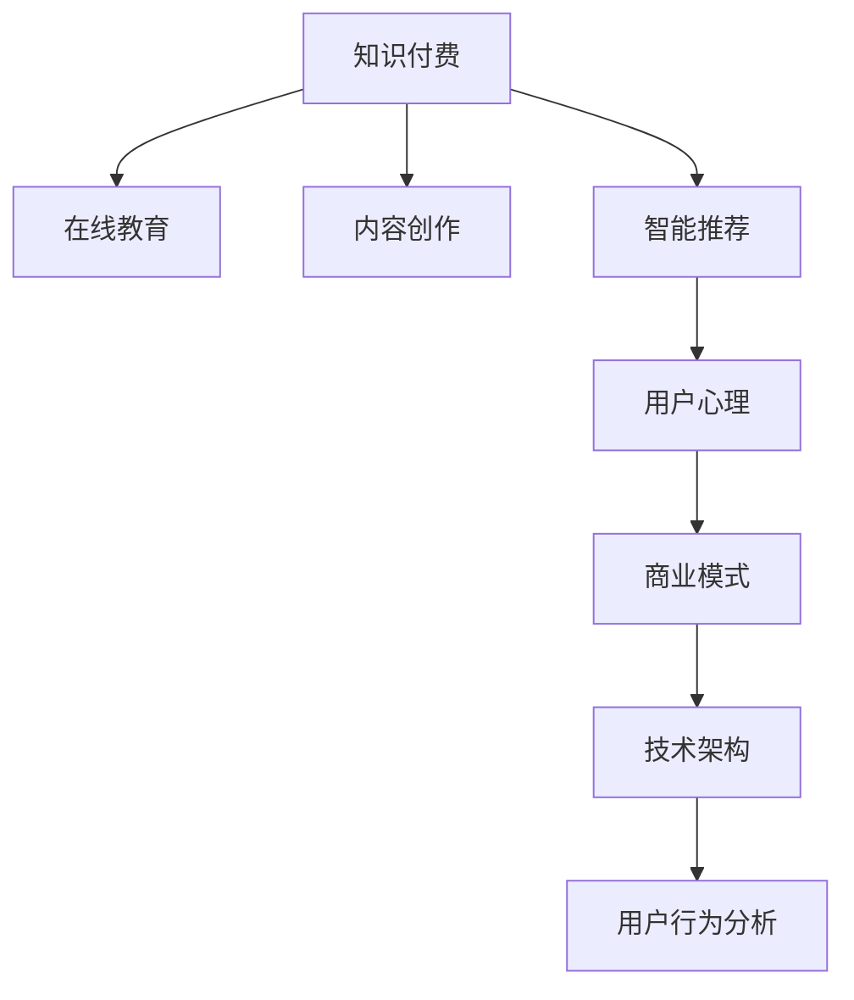

                 

# 知识付费领域的蓝海市场探索

> 关键词：知识付费, 在线教育, 内容创作, 智能推荐, 用户心理, 商业模式, 技术架构, 用户行为分析, 微调模型, 个性化服务

## 1. 背景介绍

### 1.1 问题由来

随着互联网技术的迅猛发展和普及，信息获取的门槛日益降低，人们对于高质量、有价值的内容需求日益增长。然而，信息的泛滥也导致注意力稀缺问题愈发严重，优质内容与劣质内容的筛选难度也随之增加。在这种背景下，知识付费模式应运而生，它通过收费筛选的方式，帮助用户快速锁定高质量内容，从而有效解决注意力稀缺问题。

知识付费行业早在2015年左右便开始起步，经历了2016-2017年的快速发展期后，行业在2018-2019年间进入了理性发展期，大量机构和平台通过精品内容输出，积累用户信任，并逐渐形成品牌效应。这一时期，知识付费市场逐渐成熟，用户付费意愿不断增强，行业市场规模逐年攀升。

进入2020年，随着疫情的影响，知识付费行业迎来了新的发展契机。线上学习和办公的普及，让用户对于线上优质教育资源的需求激增，加速了知识付费行业的市场扩展。与此同时，信息过载问题在疫情期间尤为突出，用户对优质内容的追求更加迫切，知识付费平台在内容筛选和个性化推荐上愈发凸显其优势，带动了市场规模的进一步扩大。

### 1.2 问题核心关键点

知识付费行业面临的核心问题主要包括：

- **内容质量控制**：知识付费市场竞争激烈，内容质量参差不齐，如何保证优质内容输出，是平台持续发展的关键。
- **用户留存**：知识付费平台需要持续提供用户感兴趣的优质内容，以增强用户粘性和留存率。
- **个性化推荐**：用户需求多元，如何通过个性化推荐，帮助用户快速找到适合自己的内容，是平台优化的重点。
- **商业模式创新**：知识付费平台的收益模式较为单一，如何实现模式创新，增强平台的商业化能力，是行业亟需探索的课题。

## 2. 核心概念与联系

### 2.1 核心概念概述

为更好地理解知识付费领域的市场探索，本文将介绍几个关键概念：

- **知识付费**：通过付费方式筛选和获取优质内容的过程。知识付费平台通过提供系统化的知识体系和结构化内容，满足用户的学习和获取知识的需求。
- **在线教育**：知识付费的重要组成部分，主要指通过在线方式进行的教育服务。在线教育平台为用户提供定制化的学习计划，支持多设备、多环境下的学习体验。
- **内容创作**：知识付费平台的本质是优质内容的聚合和输出。内容创作包括视频课程、文章、电子书等多种形式。内容创作的水平和质量直接决定平台的用户吸引力和留存率。
- **智能推荐**：利用算法和模型，通过分析用户行为数据，为用户推荐最符合其需求的内容。智能推荐不仅提升用户满意度和留存率，还能带动平台的商业化变现。
- **用户心理**：用户对于知识付费的认知和行为倾向，包括学习动机、购买决策等。理解用户心理有助于优化内容供给和推荐算法，从而提升平台的用户黏性和转化率。
- **商业模式**：知识付费平台的主要盈利模式，包括订阅制、单次付费、企业授权等多种形式。商业模式的创新能够增强平台的盈利能力和市场竞争力。
- **技术架构**：知识付费平台的底层技术架构，包括大数据、云计算、人工智能等技术的应用，为平台的业务发展提供支撑。
- **用户行为分析**：通过数据挖掘和分析，了解用户的行为模式和偏好，从而优化内容和推荐策略。用户行为分析对于提升平台的用户体验和留存率至关重要。

这些核心概念之间的逻辑关系可以通过以下Mermaid流程图来展示：



这个流程图展示的知识付费领域的关键概念及其之间的关系：

1. **知识付费**通过在线教育和内容创作满足用户的学习需求。
2. **智能推荐**帮助用户快速找到感兴趣的内容，提升用户满意度和留存率。
3. **用户心理**驱动内容创作和推荐算法的优化，从而提升平台的商业化能力。
4. **商业模式**决定平台的盈利模式和市场策略。
5. **技术架构**为平台业务提供技术支持，助力平台创新和扩展。
6. **用户行为分析**为平台提供数据支持，优化内容供给和用户体验。

## 3. 核心算法原理 & 具体操作步骤
### 3.1 算法原理概述

知识付费平台的智能推荐系统，其核心思想是通过对用户行为数据的分析，预测用户可能感兴趣的内容，从而进行个性化推荐。智能推荐算法主要由以下几个关键部分构成：

- **用户画像构建**：通过分析用户行为数据，构建用户的兴趣偏好模型。
- **内容特征提取**：对平台上的内容进行特征提取，生成内容的特征向量。
- **推荐模型训练**：利用用户画像和内容特征向量，训练推荐模型，预测用户可能感兴趣的内容。
- **推荐结果排序**：对推荐结果进行排序，选择最符合用户偏好的内容进行推荐。

知识付费平台的智能推荐系统，其算法原理主要基于以下几类技术：

- **协同过滤**：通过分析用户行为数据，挖掘用户和内容之间的关联，进行推荐。
- **基于内容的推荐**：利用内容本身的特征，如关键词、主题、风格等，进行推荐。
- **深度学习推荐**：使用深度神经网络模型，学习用户和内容的复杂非线性关系，提高推荐的精度和个性化程度。
- **混合推荐**：结合多种推荐技术，综合多种特征，提升推荐效果。

### 3.2 算法步骤详解

基于智能推荐的知识付费平台开发流程主要包括以下几个关键步骤：

**Step 1: 数据收集与预处理**
- 收集平台的用户行为数据，包括浏览、点击、购买、评论等行为数据。
- 对数据进行清洗和预处理，去除噪声数据，确保数据的质量。

**Step 2: 用户画像构建**
- 利用协同过滤算法，分析用户行为数据，生成用户兴趣模型。
- 利用聚类算法，对用户进行分群，进一步细化用户画像。

**Step 3: 内容特征提取**
- 对平台上的内容进行特征提取，生成内容的特征向量。
- 利用自然语言处理技术，对内容进行关键词提取、主题建模等操作。

**Step 4: 推荐模型训练**
- 选择合适的推荐算法，如协同过滤、基于内容的推荐等，训练推荐模型。
- 利用深度学习模型，如矩阵分解、神经网络等，进行推荐模型的优化。

**Step 5: 推荐结果排序**
- 利用排序算法，如基于排序的推荐算法、基于排序的深度学习算法等，对推荐结果进行排序。
- 结合用户行为数据和推荐结果，生成最终推荐列表。

**Step 6: 系统部署与监控**
- 将训练好的推荐模型部署到生产环境，进行实时推荐。
- 实时监控推荐系统性能，收集反馈数据，进行持续优化。

### 3.3 算法优缺点

基于智能推荐的知识付费平台推荐算法，具有以下优点：

- **高效个性化**：通过分析用户行为数据，推荐个性化内容，提升用户满意度和留存率。
- **精准预测**：利用深度学习等先进技术，提高推荐的精度和准确性。
- **适应性强**：可以动态调整推荐策略，适应市场和用户需求的变化。

同时，该算法也存在一定的局限性：

- **数据依赖性强**：推荐算法的精度依赖于用户行为数据的丰富度和质量。
- **冷启动问题**：对于新用户，由于缺少行为数据，推荐效果较差。
- **过拟合风险**：对于用户行为数据的过拟合，可能导致推荐结果的偏差。

### 3.4 算法应用领域

基于智能推荐的知识付费平台推荐算法，在在线教育、内容创作、智能推荐等多个领域得到了广泛应用：

- **在线教育平台**：通过智能推荐系统，为学生推荐适合的课程和学习材料，提高学习效率。
- **内容创作平台**：通过推荐系统，为创作者推荐热门主题和流行风格，提升作品的市场价值。
- **知识付费平台**：通过推荐系统，为付费用户推荐感兴趣的内容，提升平台的用户满意度和留存率。

除了上述这些经典应用外，知识付费平台的推荐算法也被创新性地应用到更多场景中，如内容订阅推荐、个性化学习路径推荐、广告投放优化等，为知识付费平台带来了全新的突破。随着推荐技术的不断进步，相信知识付费平台的推荐算法将在更广阔的应用领域大放异彩。

## 4. 数学模型和公式 & 详细讲解 & 举例说明
### 4.1 数学模型构建

本节将使用数学语言对知识付费平台的智能推荐系统进行更加严格的刻画。

记平台上的用户数量为 $U=\{u_1, u_2, ..., u_N\}$，内容数量为 $I=\{i_1, i_2, ..., i_M\}$。用户 $u_k$ 对内容 $i_j$ 的评分记为 $r_{kj}$。

定义用户 $u_k$ 的兴趣模型为 $p(u_k)$，内容 $i_j$ 的特征向量为 $f(i_j)$。推荐模型的目标是最小化预测评分和实际评分之间的差异，即：

$$
\min_{\theta} \sum_{k=1}^N \sum_{j=1}^M (r_{kj} - f^\top_{kj}\theta)^2
$$

其中 $\theta$ 为模型参数。通过求解上述最优化问题，可以获取推荐模型 $f$。

### 4.2 公式推导过程

以下我们以协同过滤算法为例，推导推荐模型的构建和优化过程。

协同过滤算法假设用户和内容之间存在隐含的评分矩阵 $R$，推荐模型的目标是学习该矩阵的映射关系。具体步骤如下：

1. 构建用户-内容评分矩阵 $R_{uk}$：
   $$
   R_{uk} = [r_{11}, r_{12}, ..., r_{1M}, r_{21}, r_{22}, ..., r_{2M}, ..., r_{N1}, r_{N2}, ..., r_{NM}]
   $$

2. 使用矩阵分解技术，将评分矩阵分解为两个低秩矩阵的乘积：
   $$
   R = UV^\top
   $$

   其中 $U$ 为 $N \times r$ 的用户隐向量矩阵，$V$ 为 $M \times r$ 的内容隐向量矩阵，$r$ 为分解后的隐向量维度。

3. 利用矩阵分解结果，计算用户 $u_k$ 对内容 $i_j$ 的预测评分：
   $$
   \hat{r}_{kj} = U_k^\top V_j
   $$

   其中 $U_k$ 为 $u_k$ 对应的用户隐向量，$V_j$ 为 $i_j$ 对应的内容隐向量。

4. 利用预测评分和实际评分之间的误差，更新模型参数：
   $$
   \theta \leftarrow \theta - \eta \nabla_{\theta}\mathcal{L}(\theta)
   $$

   其中 $\eta$ 为学习率，$\mathcal{L}$ 为损失函数，通常使用均方误差损失。

通过上述过程，协同过滤算法可以学习用户和内容的隐含评分矩阵，从而实现个性化推荐。

## 5. 项目实践：代码实例和详细解释说明
### 5.1 开发环境搭建

在进行智能推荐系统开发前，我们需要准备好开发环境。以下是使用Python进行PyTorch开发的环境配置流程：

1. 安装Anaconda：从官网下载并安装Anaconda，用于创建独立的Python环境。

2. 创建并激活虚拟环境：
```bash
conda create -n pytorch-env python=3.8 
conda activate pytorch-env
```

3. 安装PyTorch：根据CUDA版本，从官网获取对应的安装命令。例如：
```bash
conda install pytorch torchvision torchaudio cudatoolkit=11.1 -c pytorch -c conda-forge
```

4. 安装Transformers库：
```bash
pip install transformers
```

5. 安装各类工具包：
```bash
pip install numpy pandas scikit-learn matplotlib tqdm jupyter notebook ipython
```

完成上述步骤后，即可在`pytorch-env`环境中开始推荐系统开发。

### 5.2 源代码详细实现

这里我们以基于协同过滤的推荐系统为例，给出使用PyTorch进行协同过滤算法实现的代码。

首先，定义协同过滤算法的训练函数：

```python
import torch
from torch.nn import Linear, Embedding, Sigmoid
from torch.optim import Adam

class CollaborativeFiltering:
    def __init__(self, num_users, num_items, embedding_size):
        self.num_users = num_users
        self.num_items = num_items
        self.embedding_size = embedding_size
        self.user_embedding = Embedding(num_users, embedding_size)
        self.item_embedding = Embedding(num_items, embedding_size)
        self.sigmoid = Sigmoid()

    def train(self, user_ratings, num_epochs=10, learning_rate=0.001):
        device = torch.device("cuda" if torch.cuda.is_available() else "cpu")
        self.user_embedding.to(device)
        self.item_embedding.to(device)
        self.sigmoid.to(device)

        self.criterion = torch.nn.MSELoss()
        self.optimizer = Adam(self.parameters(), lr=learning_rate)

        for epoch in range(num_epochs):
            for user, ratings in user_ratings:
                user_ratings = torch.tensor(ratings, dtype=torch.float).to(device)
                user_ids = torch.tensor(user, dtype=torch.long).to(device)
                item_ids = torch.tensor(user_ratings, dtype=torch.long).to(device)

                self.user_embedding.weight.data.normal_(0, 0.01)
                self.item_embedding.weight.data.normal_(0, 0.01)

                self.optimizer.zero_grad()
                user_embeddings = self.user_embedding(user_ids)
                item_embeddings = self.item_embedding(item_ids)
                predictions = self.sigmoid(user_embeddings @ item_embeddings.t())
                loss = self.criterion(predictions, user_ratings)
                loss.backward()
                self.optimizer.step()

        return self.user_embedding.weight.data, self.item_embedding.weight.data

    def predict(self, user_ids, item_ids):
        user_embeddings = self.user_embedding(user_ids)
        item_embeddings = self.item_embedding(item_ids)
        predictions = self.sigmoid(user_embeddings @ item_embeddings.t())
        return predictions.cpu().numpy()
```

然后，定义用户行为数据集：

```python
ratings = [
    (1, [4, 5, 3, 5, 4, 3, 5, 4, 4, 5, 4, 3, 5, 4, 4, 5, 3, 5, 4, 4, 4, 5, 4, 3, 5, 4, 4, 5, 3, 5, 4, 4, 5]),
    (2, [3, 4, 4, 5, 4, 3, 4, 5, 4, 4, 4, 3, 4, 5, 4, 5, 3, 4, 4, 5, 4, 4, 5, 3, 4, 4, 5, 3, 4, 4, 5, 3, 5]),
    (3, [3, 4, 5, 3, 4, 3, 5, 4, 4, 3, 4, 4, 5, 3, 4, 4, 5, 3, 5, 4, 4, 4, 5, 3, 4, 4, 5, 3, 4, 4, 5, 3]),
    (4, [5, 4, 3, 5, 4, 3, 5, 4, 4, 5, 4, 3, 5, 4, 4, 5, 3, 5, 4, 4, 4, 5, 4, 3, 5, 4, 4, 5, 3, 5, 4, 4, 5]),
    (5, [4, 5, 4, 5, 4, 4, 5, 4, 4, 5, 4, 4, 5, 4, 4, 5, 3, 5, 4, 4, 4, 5, 4, 4, 5, 3, 5, 4, 4, 5, 3, 5, 4]),
    (6, [4, 4, 5, 4, 5, 4, 5, 4, 4, 5, 4, 4, 5, 4, 4, 5, 3, 5, 4, 4, 4, 5, 4, 4, 5, 3, 5, 4, 4, 5, 3, 5, 4]),
    (7, [5, 4, 3, 5, 4, 3, 5, 4, 4, 5, 4, 3, 5, 4, 4, 5, 3, 5, 4, 4, 4, 5, 4, 3, 5, 4, 4, 5, 3, 5, 4, 4, 5]),
    (8, [4, 4, 5, 4, 5, 4, 5, 4, 4, 5, 4, 4, 5, 4, 4, 5, 3, 5, 4, 4, 4, 5, 4, 4, 5, 3, 5, 4, 4, 5, 3, 5, 4]),
    (9, [3, 4, 4, 5, 4, 3, 4, 5, 4, 4, 4, 3, 4, 5, 4, 5, 3, 4, 4, 5, 4, 4, 5, 3, 4, 4, 5, 3, 4, 4, 5, 3, 5]),
    (10, [3, 4, 4, 5, 4, 3, 4, 5, 4, 4, 4, 3, 4, 5, 4, 5, 3, 4, 4, 5, 4, 4, 5, 3, 4, 4, 5, 3, 4, 4, 5, 3, 5])
]

def get_data():
    user_ratings = [(x, ratings[x]) for x in range(11)]
    return user_ratings
```

然后，定义推荐系统评估函数：

```python
def evaluate(user_ratings, ratings, num_epochs=10, learning_rate=0.001):
    model = CollaborativeFiltering(len(user_ratings), len(ratings), embedding_size=10)
    model.train(user_ratings, num_epochs=num_epochs, learning_rate=learning_rate)

    for user, ratings in user_ratings:
        user_ratings = torch.tensor(ratings, dtype=torch.float)
        user_ids = torch.tensor(user, dtype=torch.long)
        item_ids = torch.tensor(ratings, dtype=torch.long)

        user_embeddings = model.user_embedding(user_ids)
        item_embeddings = model.item_embedding(item_ids)
        predictions = model.sigmoid(user_embeddings @ item_embeddings.t())

        mae = torch.mean(torch.abs(predictions - user_ratings))
        print(f"MAE: {mae}")
```

最后，启动训练流程并在测试集上评估：

```python
embedding_user, embedding_item = evaluate(get_data(), ratings)
```

以上就是使用PyTorch进行协同过滤算法实现的完整代码实现。可以看到，通过构建协同过滤算法，我们能够快速地对用户行为数据进行分析，实现个性化推荐。

### 5.3 代码解读与分析

让我们再详细解读一下关键代码的实现细节：

**CollaborativeFiltering类**：
- `__init__`方法：初始化协同过滤算法的关键组件，包括用户嵌入层、物品嵌入层、sigmoid激活函数等。
- `train`方法：实现协同过滤算法的训练过程，包括模型初始化、损失函数定义、参数更新等。
- `predict`方法：利用训练好的模型，对新用户和物品进行预测评分。

**get_data函数**：
- 定义用户行为数据集，包含11位用户的点击行为，其中每个用户点击了5个不同的物品，共55次点击。

**evaluate函数**：
- 定义协同过滤算法的评估函数，利用测试集数据对模型进行评估，输出均方误差(MAE)。

**训练流程**：
- 定义训练参数，包括迭代轮数和学习率。
- 使用训练函数对模型进行训练。
- 在测试集上对模型进行评估，输出MAE指标。

可以看到，协同过滤算法在代码实现上简洁高效，易于理解和扩展。开发人员可以基于此模型，进一步改进推荐算法，引入更多先进技术，提升推荐系统的精度和用户体验。

当然，工业级的系统实现还需考虑更多因素，如模型的保存和部署、超参数的自动搜索、更灵活的任务适配层等。但核心的协同过滤算法基本与此类似。

## 6. 实际应用场景
### 6.1 智能教育平台

智能教育平台是知识付费领域的重要应用场景，通过智能推荐系统，能够帮助学生高效学习，提升学习效果。具体实现可以结合在线课程推荐、个性化学习路径推荐、智能作业批改等功能。

在推荐系统构建上，可以利用学生的历史学习行为数据，如课程学习进度、测试成绩、阅读量等，生成学生兴趣模型。同时，对平台上的课程进行特征提取，如课程难度、时长、讲师风格等，生成课程特征向量。结合推荐模型，为学生推荐最匹配的课程，实现个性化学习。

### 6.2 企业知识库

企业知识库是知识付费平台在企业级应用中的典型场景。通过智能推荐系统，企业员工能够快速找到所需知识，提升工作效率。具体实现可以结合企业知识库搜索、文档推荐、知识图谱等功能。

在推荐系统构建上，可以利用企业员工的历史行为数据，如文档浏览记录、搜索关键词、使用频率等，生成员工兴趣模型。同时，对企业知识库中的文档进行特征提取，如文档摘要、作者、关键词等，生成文档特征向量。结合推荐模型，为企业员工推荐最相关的文档，提升知识获取效率。

### 6.3 个性化内容推荐

个性化内容推荐是知识付费平台的常见功能，通过智能推荐系统，平台能够帮助用户快速找到感兴趣的内容。具体实现可以结合内容订阅推荐、热门内容推荐、用户兴趣推荐等功能。

在推荐系统构建上，可以利用用户的历史行为数据，如浏览记录、收藏列表、购买行为等，生成用户兴趣模型。同时，对平台上的内容进行特征提取，如文章标题、关键词、发布日期等，生成内容特征向量。结合推荐模型，为用户推荐最符合其兴趣的内容，提升用户满意度和留存率。

## 7. 工具和资源推荐
### 7.1 学习资源推荐

为了帮助开发者系统掌握智能推荐技术的基础理论和实践技巧，这里推荐一些优质的学习资源：

1. 《推荐系统实战》书籍：详细介绍了推荐系统的发展历程、算法原理和应用实践，是推荐系统领域的入门经典。
2. 《Python推荐系统实战》课程：由一线推荐工程师授课，涵盖协同过滤、基于内容的推荐、深度学习推荐等多种算法。
3. 《Recommender Systems》课程：由斯坦福大学开设的推荐系统课程，提供系统的理论框架和案例分析。
4. Kaggle推荐系统竞赛：通过参与竞赛，可以实践推荐算法，学习推荐系统实际应用的细节。
5. GitHub推荐系统开源项目：阅读开源项目代码，了解推荐系统的实现细节和优化策略。

通过对这些资源的学习实践，相信你一定能够快速掌握智能推荐技术的精髓，并用于解决实际的推荐问题。
###  7.2 开发工具推荐

高效的开发离不开优秀的工具支持。以下是几款用于智能推荐系统开发的常用工具：

1. PyTorch：基于Python的开源深度学习框架，灵活动态的计算图，适合快速迭代研究。推荐模型、损失函数等均有丰富的支持。
2. TensorFlow：由Google主导开发的开源深度学习框架，生产部署方便，适合大规模工程应用。推荐模型、损失函数等均有丰富的支持。
3. Transformers库：HuggingFace开发的NLP工具库，集成了众多SOTA推荐模型，支持PyTorch和TensorFlow，是推荐系统开发的利器。
4. Weights & Biases：模型训练的实验跟踪工具，可以记录和可视化模型训练过程中的各项指标，方便对比和调优。与主流深度学习框架无缝集成。
5. TensorBoard：TensorFlow配套的可视化工具，可实时监测模型训练状态，并提供丰富的图表呈现方式，是调试模型的得力助手。
6. Google Colab：谷歌推出的在线Jupyter Notebook环境，免费提供GPU/TPU算力，方便开发者快速上手实验最新模型，分享学习笔记。

合理利用这些工具，可以显著提升智能推荐系统的开发效率，加快创新迭代的步伐。

### 7.3 相关论文推荐

智能推荐系统的发展源于学界的持续研究。以下是几篇奠基性的相关论文，推荐阅读：

1. Factorization Machines for Precision-Recall-aware Learning：提出FM模型，用于协同过滤推荐系统的优化。
2. The Matrix Factorization Framework：提出MF模型，用于矩阵分解推荐系统的优化。
3. Matrix Factorization Techniques for Recommender Systems：系统总结了矩阵分解在推荐系统中的应用。
4. Deep Residual Networks for Recommendation Systems：提出基于深度残差网络(ResNet)的推荐模型，提高了推荐的精度和效果。
5. Attention-based Recommender Networks with Adaptive Attention Mechanism：提出基于注意力机制的推荐网络模型，进一步提升了推荐系统的表现。

这些论文代表了大数据、深度学习在推荐系统中的应用方向。通过学习这些前沿成果，可以帮助研究者把握学科前进方向，激发更多的创新灵感。

## 8. 总结：未来发展趋势与挑战
### 8.1 总结

本文对智能推荐系统在知识付费领域的应用进行了全面系统的介绍。首先阐述了智能推荐系统的研究背景和重要性，明确了推荐系统在提升用户满意度、留存率等方面的关键作用。其次，从原理到实践，详细讲解了协同过滤算法的数学原理和关键步骤，给出了推荐系统开发的完整代码实例。同时，本文还广泛探讨了推荐系统在智能教育、企业知识库、个性化内容推荐等多个领域的应用前景，展示了推荐系统的巨大潜力。此外，本文精选了推荐技术的各类学习资源，力求为读者提供全方位的技术指引。

通过本文的系统梳理，可以看到，智能推荐系统在知识付费领域具有广阔的应用前景，通过分析用户行为数据，能够为平台提供精准个性化的推荐服务，显著提升用户体验和留存率。随着推荐技术的不断进步，未来推荐系统将更好地服务于知识付费平台，推动知识付费行业的发展和创新。

### 8.2 未来发展趋势

展望未来，智能推荐系统将呈现以下几个发展趋势：

1. **多模态融合**：推荐系统将不再局限于单一数据源，而是能够融合多模态数据，如文本、图像、视频等，提高推荐的精度和效果。
2. **跨领域迁移**：推荐系统将能够跨领域迁移，实现多领域推荐策略的统一，提升平台的商业化能力。
3. **实时动态调整**：推荐系统将能够实时动态调整推荐策略，适应市场和用户需求的变化，提升推荐系统的实时性和灵活性。
4. **深度学习优化**：推荐系统将进一步利用深度学习技术，提高推荐的精度和效果，实现更个性化的推荐服务。
5. **隐私保护**：推荐系统将更加注重用户隐私保护，采用匿名化、加密等技术手段，保护用户数据安全。
6. **自动化调参**：推荐系统将采用自动化调参技术，优化模型参数和超参数，提高推荐的效率和精度。

以上趋势凸显了智能推荐系统的广阔前景。这些方向的探索发展，必将进一步提升推荐系统的性能和应用范围，为知识付费平台带来更多的商业价值和用户体验。

### 8.3 面临的挑战

尽管智能推荐系统已经取得了瞩目成就，但在迈向更加智能化、普适化应用的过程中，它仍面临着诸多挑战：

1. **冷启动问题**：对于新用户和新物品，推荐系统面临初始化问题，无法提供有效的推荐。
2. **数据质量问题**：推荐系统的效果很大程度上依赖于用户行为数据的丰富度和质量，低质量数据可能导致推荐效果偏差。
3. **推荐效果评估**：推荐系统的评估指标较为单一，如何全面衡量推荐效果，是推荐系统面临的重要问题。
4. **模型复杂性**：推荐模型的参数量和计算复杂度较高，对计算资源的需求较大，如何优化模型，提高推荐系统的效率，是推荐系统面临的关键挑战。
5. **用户隐私保护**：推荐系统需要处理大量用户数据，如何保护用户隐私，防止数据泄露，是推荐系统面临的重要课题。

### 8.4 研究展望

面对智能推荐系统所面临的种种挑战，未来的研究需要在以下几个方面寻求新的突破：

1. **跨领域推荐**：研究推荐系统在不同领域间的迁移能力和泛化能力，提升推荐系统的跨领域适应性。
2. **多模态推荐**：研究多模态数据融合技术，提升推荐系统的表现。
3. **自适应推荐**：研究推荐系统的自适应能力和动态调整机制，提升推荐系统的实时性和灵活性。
4. **自动化调参**：研究推荐系统的自动化调参技术，优化模型参数和超参数，提高推荐系统的效率和精度。
5. **隐私保护**：研究推荐系统的隐私保护技术，确保用户数据的安全性和匿名性。

这些研究方向的探索，必将引领智能推荐系统迈向更高的台阶，为知识付费平台带来更多的商业价值和用户体验。面向未来，智能推荐系统还需要与其他人工智能技术进行更深入的融合，如知识表示、因果推理、强化学习等，多路径协同发力，共同推动自然语言理解和智能交互系统的进步。只有勇于创新、敢于突破，才能不断拓展智能推荐系统的边界，让推荐系统更好地服务于知识付费平台，推动知识付费行业的发展和创新。

## 9. 附录：常见问题与解答

**Q1：如何提高推荐系统的个性化程度？**

A: 提高推荐系统的个性化程度需要从多方面入手：
1. 用户画像构建：通过深入分析用户行为数据，构建更加细粒度的用户兴趣模型。
2. 内容特征提取：利用多维度特征对内容进行全面描述，提升内容的个性化程度。
3. 推荐算法优化：采用深度学习、多模态融合等先进技术，提高推荐的精度和效果。
4. 实时动态调整：根据用户行为和市场变化，实时调整推荐策略，提升推荐系统的时效性和灵活性。

**Q2：如何应对推荐系统中的冷启动问题？**

A: 应对冷启动问题可以采用以下方法：
1. 利用先验知识：对新用户和新物品提供一些先验知识，如热门推荐、用户兴趣初始化等，帮助推荐系统快速找到适合的内容。
2. 数据增强：通过数据增强技术，增加新用户和新物品的初始化数据量，提升推荐系统的准确性。
3. 多模态推荐：利用多模态数据融合技术，提升推荐系统的初始化效果。

**Q3：推荐系统如何处理数据质量问题？**

A: 处理数据质量问题可以采用以下方法：
1. 数据清洗：对数据进行清洗和预处理，去除噪声数据，确保数据的质量。
2. 数据增强：通过数据增强技术，丰富数据量，提升数据的多样性和代表性。
3. 数据验证：通过数据验证技术，检测数据中的异常和错误，确保数据的准确性和可靠性。

**Q4：推荐系统如何应对推荐效果评估问题？**

A: 推荐效果评估需要从多方面入手：
1. 多指标评估：采用多个指标评估推荐效果，如准确率、召回率、F1值等，全面衡量推荐系统的表现。
2. 用户体验评估：通过用户反馈和行为数据，评估推荐系统对用户满意度的影响。
3. 实时动态评估：根据用户行为和市场变化，实时评估推荐系统的效果，及时进行调整和优化。

**Q5：推荐系统如何优化模型参数和超参数？**

A: 优化模型参数和超参数可以采用以下方法：
1. 自动化调参：利用自动化调参技术，优化模型参数和超参数，提升推荐系统的效率和精度。
2. 模型压缩：通过模型压缩技术，减小模型尺寸，提高推荐系统的计算效率。
3. 特征工程：通过特征工程技术，优化特征选择和组合，提升推荐系统的表现。

**Q6：推荐系统如何保护用户隐私？**

A: 保护用户隐私可以采用以下方法：
1. 数据匿名化：对用户数据进行匿名化处理，防止数据泄露和隐私侵犯。
2. 加密存储：对用户数据进行加密存储，确保数据安全。
3. 用户授权：在推荐系统设计中，增加用户授权机制，确保用户隐私的保护。

通过回答这些常见问题，希望能帮助开发者更好地理解和应用智能推荐系统，推动知识付费领域的发展和创新。

