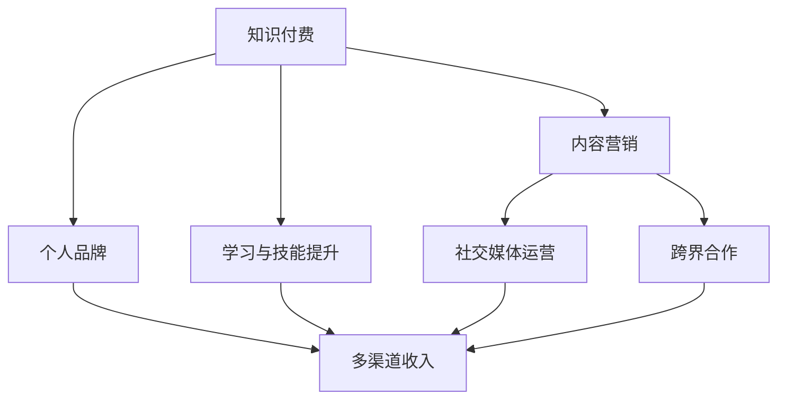

                 

# 知识付费：程序员的个人品牌战略

## 1. 背景介绍

### 1.1 问题由来

在信息技术飞速发展的今天，程序员作为数字时代的重要从业者，其技能和知识的重要性不言而喻。然而，随着技术的不断迭代和更新，程序员面临着学习压力不断增大、职业发展路径多样化的挑战。如何在快速变化的环境中保持竞争力，成为程序员面临的重要课题。知识付费作为一种新兴的学习方式，为程序员提供了快速获取新知识和技能的可能，同时也为构建个人品牌提供了新的机遇。本文旨在探讨知识付费背景下，程序员如何通过个人品牌战略，实现自我价值提升和职业发展。

### 1.2 问题核心关键点

在知识付费大潮中，程序员的个人品牌战略核心关键点包括：

- **定位与目标**：明确自身的技术栈、兴趣领域和职业目标，精准定位个人品牌。
- **内容输出**：高质量的技术文章、代码分享、技术讲坛等内容的持续输出，形成稳定的知识输出流。
- **社交媒体运营**：利用社交媒体平台，积极与行业同好互动，扩大个人影响力。
- **跨界合作**：通过参与开源项目、技术讲座、行业会议等方式，建立多领域的技术交流与合作网络。
- **品牌影响力**：通过网络平台的算法推荐、内容质量评价、用户口碑积累，建立稳固的个人品牌影响力。

### 1.3 问题研究意义

研究知识付费背景下程序员的个人品牌战略，对于提升程序员的专业能力、拓宽职业发展路径、增强行业影响力具有重要意义：

1. **快速学习与提升**：知识付费平台提供了丰富的学习资源，程序员可以通过付费订阅、课程学习等方式，迅速掌握新技能，弥补技术短板。
2. **职业发展与转型**：个人品牌战略帮助程序员明确职业方向，提升技术水平，从而在竞争激烈的职场中脱颖而出。
3. **行业影响力与认可**：通过积极参与技术交流和合作，程序员可以在行业内建立良好的口碑和影响力，成为技术社区的活跃成员。
4. **多渠道收入**：建立个人品牌不仅限于技术输出，还可以通过出版书籍、技术咨询、演讲、培训等形式，实现多渠道收入。

## 2. 核心概念与联系

### 2.1 核心概念概述

在探讨程序员个人品牌战略时，需要理解以下核心概念：

- **知识付费**：指消费者通过付费方式获取知识或服务，以提高自身知识和技能的平台或服务模式。知识付费包括在线课程、电子书、技术文章、直播讲座等多种形式。
- **个人品牌**：指个人通过特定领域的专业技能、独特观点、持续输出等内容，在特定领域内建立的影响力和认知度。
- **内容营销**：指通过创作和传播有价值、有吸引力的内容，吸引、留住受众，从而建立品牌认知度和用户信任的过程。
- **社交媒体运营**：指通过社交媒体平台，进行品牌传播、用户互动、社群建设等活动，扩大品牌影响力。
- **跨界合作**：指不同领域之间的合作，通过资源共享、技术交流等方式，扩大个人品牌的曝光度和认可度。

这些概念之间存在密切联系，共同构成程序员个人品牌战略的基石。以下通过Mermaid流程图展示其联系：



## 3. 核心算法原理 & 具体操作步骤

### 3.1 算法原理概述

程序员个人品牌战略的核心在于通过高质量内容输出和有效运营，不断提升在特定技术领域的影响力。以下为其核心算法原理概述：

1. **定位与目标设定**：根据个人兴趣和技术栈，确定最擅长的技术领域和职业发展目标，明确品牌定位。
2. **内容创造与输出**：通过撰写技术文章、开发开源项目、参与技术讲座等形式，持续输出高质量的技术内容。
3. **社交媒体运营**：在社交媒体平台上，通过发布内容、互动回复、参与话题等方式，提升个人品牌的可见度和影响力。
4. **跨界合作与资源整合**：通过参与技术社区、行业会议、开源项目等，与行业内其他专业人士建立联系，共享资源和机会。
5. **持续改进与反馈优化**：定期评估品牌战略的效果，根据用户反馈和市场趋势，调整和优化品牌策略。

### 3.2 算法步骤详解

以下详细介绍个人品牌战略的具体操作步骤：

**Step 1: 明确品牌定位**
- 分析自身技术栈和兴趣领域，确定最擅长和最感兴趣的细分技术领域。
- 结合市场需求和个人发展目标，确定品牌的核心价值和目标受众。

**Step 2: 制定内容输出计划**
- 基于品牌定位，制定内容输出的主题和形式。
- 确定发布频率和平台，如博客、GitHub、视频平台等。
- 安排团队协作，形成内容创作的流水线。

**Step 3: 社交媒体运营**
- 选择适合的社交媒体平台，如LinkedIn、GitHub、Twitter等。
- 制定社交媒体运营策略，包括发布内容、互动回复、话题参与等。
- 定期评估社交媒体运营效果，根据反馈调整策略。

**Step 4: 跨界合作与资源整合**
- 寻找技术社区、开源项目、行业会议等机会，建立多领域技术交流网络。
- 通过贡献代码、参与讲座、撰写文章等方式，展示个人品牌的影响力。
- 建立合作伙伴关系，共同开发项目或举办活动，提升品牌曝光度。

**Step 5: 持续改进与反馈优化**
- 定期收集用户反馈和市场趋势，评估品牌战略的效果。
- 根据反馈调整内容输出策略和社交媒体运营计划。
- 不断尝试新的技术和形式，保持品牌的创新和活力。

### 3.3 算法优缺点

基于核心算法原理和具体操作步骤，程序员个人品牌战略具有以下优点和缺点：

**优点**：
- **快速学习和提升**：知识付费平台提供了丰富的学习资源，程序员可以通过付费订阅、课程学习等方式，迅速掌握新技能，弥补技术短板。
- **提升专业能力和知名度**：通过高质量的内容输出和社交媒体运营，程序员可以在特定技术领域建立良好的口碑和影响力。
- **多渠道收入**：建立个人品牌不仅限于技术输出，还可以通过出版书籍、技术咨询、演讲、培训等形式，实现多渠道收入。

**缺点**：
- **时间和精力投入较大**：高质量的内容输出和社交媒体运营需要大量时间和精力，可能会影响日常工作。
- **品牌定位和内容策略需精准**：品牌定位和内容策略的失误可能导致品牌影响力下降，甚至造成负面影响。
- **市场和用户反馈需及时响应**：品牌战略需要根据市场和用户反馈进行持续优化，否则可能被市场淘汰。

### 3.4 算法应用领域

程序员个人品牌战略不仅适用于技术领域，还广泛应用于软件开发、产品管理、技术咨询、教育培训等多个领域。以下列举几个主要应用场景：

- **软件开发**：通过技术博客、开源项目、技术讲座等方式，展示编程能力和技术深度，吸引招聘公司和项目需求。
- **产品管理**：在社交媒体上分享产品体验、用户反馈，提升产品知名度和用户满意度。
- **技术咨询**：通过技术文章、技术讲座、在线咨询等方式，提供技术支持和解决方案，建立行业影响力。
- **教育培训**：开发技术课程、线上讲座，成为技术讲师，传授专业知识，扩大影响力。
- **创业和投资**：通过社交媒体、技术文章展示创业理念和项目成果，吸引投资者和合作机会。

## 4. 数学模型和公式 & 详细讲解  
### 4.1 数学模型构建

个人品牌战略的数学模型主要涉及品牌影响力的增长和内容的反馈优化。以下构建一个简单的数学模型来表示品牌影响力的增长和优化过程。

设品牌影响力 $I(t)$ 随时间 $t$ 的变化由以下公式决定：

$$ I(t) = I_0 + \int_0^t \frac{dI(t)}{dt} \, dt $$

其中 $I_0$ 为品牌初始影响力，$\frac{dI(t)}{dt}$ 为品牌影响力的增长率。

### 4.2 公式推导过程

品牌影响力的增长可以分解为多个影响因素，包括内容输出、社交媒体运营、跨界合作等。以下推导品牌影响力增长率的公式：

$$ \frac{dI(t)}{dt} = \alpha_1 \cdot \text{内容输出质量} + \alpha_2 \cdot \text{社交媒体互动量} + \alpha_3 \cdot \text{跨界合作数量} $$

其中 $\alpha_1, \alpha_2, \alpha_3$ 为各因素的权重，可根据实际情况进行调整。

### 4.3 案例分析与讲解

以下通过一个实际案例来展示个人品牌战略的数学模型和公式推导过程：

假设某程序员在技术社区上有10000粉丝，每月输出10篇高质量技术文章，每篇文章获得500个点赞和20个评论。同时，他在社交媒体上有5000关注者，每月发布50条技术相关的动态，每条动态获得200个互动。此外，他还积极参与开源项目和行业会议，每月与5个不同的合作伙伴建立联系。

根据公式推导，品牌影响力的增长率为：

$$ \frac{dI(t)}{dt} = 0.5 \cdot 10 + 0.2 \cdot 50 + 0.1 \cdot 5 = 9.5 $$

在三个月后，品牌影响力 $I(3)$ 为：

$$ I(3) = I_0 + 9.5 \cdot 3 = I_0 + 28.5 $$

可以看到，通过内容输出、社交媒体运营和跨界合作，品牌影响力在三个月内显著提升。

## 5. 项目实践：代码实例和详细解释说明

### 5.1 开发环境搭建

在进行个人品牌战略实践前，我们需要准备好开发环境。以下是使用Python进行知识付费平台内容输出的环境配置流程：

1. 安装Anaconda：从官网下载并安装Anaconda，用于创建独立的Python环境。

2. 创建并激活虚拟环境：
```bash
conda create -n mypyenv python=3.8 
conda activate mypyenv
```

3. 安装开发工具：
```bash
pip install Flask Flask-RESTful PyYAML
```

4. 搭建Web服务器：
```bash
python app.py
```

5. 部署到云平台：如AWS、GCP、阿里云等，确保服务器和数据库可用。

### 5.2 源代码详细实现

以下是使用Python Flask框架搭建知识付费平台的具体实现步骤：

**创建Flask应用**
```python
from flask import Flask, jsonify, request
app = Flask(__name__)

@app.route('/content', methods=['POST'])
def content_post():
    content = request.json['content']
    # 内容处理和存储逻辑
    return jsonify({'message': 'Content received'})
```

**数据库配置**
```python
from flask_sqlalchemy import SQLAlchemy
db = SQLAlchemy(app)

class Content(db.Model):
    id = db.Column(db.Integer, primary_key=True)
    title = db.Column(db.String(100), nullable=False)
    content = db.Column(db.Text, nullable=False)
```

**内容管理接口**
```python
@app.route('/content/list', methods=['GET'])
def content_list():
    contents = Content.query.all()
    return jsonify([{'id': c.id, 'title': c.title, 'content': c.content} for c in contents])
```

**文章推荐算法**
```python
from sklearn.feature_extraction.text import TfidfVectorizer

def get_recommendations(content_id):
    content = Content.query.get(content_id)
    tfidf = TfidfVectorizer()
    tfidf_matrix = tfidf.fit_transform([content.content])
    similarities = tfidf_matrix * tfidf_matrix.T
    top_n = 5
    return similarities.toarray().flatten()[:top_n]
```

### 5.3 代码解读与分析

以下是关键代码的实现细节：

**Flask应用创建**
```python
app = Flask(__name__)
```

**内容发布接口**
```python
@app.route('/content', methods=['POST'])
def content_post():
    content = request.json['content']
    # 内容处理和存储逻辑
    return jsonify({'message': 'Content received'})
```

**内容存储**
```python
class Content(db.Model):
    id = db.Column(db.Integer, primary_key=True)
    title = db.Column(db.String(100), nullable=False)
    content = db.Column(db.Text, nullable=False)
```

**内容列表展示**
```python
@app.route('/content/list', methods=['GET'])
def content_list():
    contents = Content.query.all()
    return jsonify([{'id': c.id, 'title': c.title, 'content': c.content} for c in contents])
```

**文章推荐算法**
```python
def get_recommendations(content_id):
    content = Content.query.get(content_id)
    tfidf = TfidfVectorizer()
    tfidf_matrix = tfidf.fit_transform([content.content])
    similarities = tfidf_matrix * tfidf_matrix.T
    top_n = 5
    return similarities.toarray().flatten()[:top_n]
```

可以看到，通过Flask框架搭建的知识付费平台，可以方便地实现内容发布、存储、展示和推荐等功能。开发者可以根据实际需求进行功能扩展和优化。

## 6. 实际应用场景

### 6.1 软件开发

在软件开发领域，个人品牌战略可以帮助程序员建立专业声誉，吸引招聘公司和项目需求。以下是一个实际应用场景：

假设某程序员在GitHub上维护一个开源项目，该项目获得了大量的star和fork，同时在技术社区上有一定的影响力。他通过撰写高质量的技术文章，展示项目进展和问题解决方案，逐渐积累了大量关注者。当某公司需要招聘新成员时，HR部门通过搜索GitHub和社交媒体，发现了该程序员的品牌影响力，决定邀请他加入团队。

### 6.2 产品管理

在产品管理领域，个人品牌战略可以帮助产品经理提升产品知名度和用户满意度。以下是一个实际应用场景：

假设某产品经理在社交媒体上分享产品体验、用户反馈，并通过发布技术博客展示产品技术细节。同时，他还积极参与开源项目，与社区成员合作开发新功能。通过这种方式，产品逐渐获得了用户的好评和推荐，产品知名度和用户满意度显著提升。

### 6.3 技术咨询

在技术咨询领域，个人品牌战略可以帮助技术专家提供专业支持，建立行业影响力。以下是一个实际应用场景：

假设某技术专家在技术社区上有一定的声誉，他通过撰写技术文章、在线咨询等方式，为中小企业提供技术解决方案。在帮助企业解决技术难题的过程中，他逐渐建立了良好的口碑和行业影响力。企业主们通过社交媒体和行业会议，找到了这位技术专家，寻求技术支持和合作机会。

### 6.4 教育培训

在教育培训领域，个人品牌战略可以帮助讲师传授专业知识，扩大影响力。以下是一个实际应用场景：

假设某讲师在社交媒体上分享编程经验、技术讲座和在线课程，逐渐积累了大量学生和同行。通过这种方式，他不仅获得了经济收益，还成为行业内的知名讲师，受邀参加各种技术会议和培训活动。

### 6.5 创业和投资

在创业和投资领域，个人品牌战略可以帮助创业者展示创业理念和项目成果，吸引投资者和合作机会。以下是一个实际应用场景：

假设某创业者在社交媒体上发布创业项目和产品演示，吸引了大量关注者。同时，他还积极参与技术社区和行业会议，与业内人士建立联系。通过这种方式，他获得了投资人的关注和认可，顺利获得了融资并成功将产品推向市场。

## 7. 工具和资源推荐

### 7.1 学习资源推荐

为了帮助开发者系统掌握知识付费背景下的个人品牌战略，这里推荐一些优质的学习资源：

1. **《程序员个人品牌战略》系列博文**：由个人品牌专家撰写，深入浅出地介绍了如何通过技术文章、社交媒体、跨界合作等方式，建立和提升个人品牌。

2. **《知识付费》课程**：各大在线教育平台提供的专业课程，涵盖个人品牌建设、内容营销、社交媒体运营等多个方面。

3. **《知识付费平台开发》书籍**：详细介绍了如何搭建知识付费平台，包括技术架构、API设计、内容推荐算法等。

4. **《知识付费行业报告》**：分析知识付费市场的现状和趋势，提供行业洞察和未来展望。

5. **《知识付费平台最佳实践》**：总结了成功知识付费平台的成功案例和经验，为开发者提供参考。

通过对这些资源的学习实践，相信你一定能够快速掌握知识付费背景下个人品牌战略的精髓，并用于解决实际的NLP问题。

### 7.2 开发工具推荐

高效的开发离不开优秀的工具支持。以下是几款用于知识付费平台开发和运营的常用工具：

1. **Flask**：基于Python的轻量级Web框架，易于上手，适合快速迭代研究。

2. **Django**：全栈Web框架，适合复杂应用开发，支持用户管理、权限控制等功能。

3. **PyYAML**：Python中常用的YAML格式解析库，适合数据存储和配置管理。

4. **PostgreSQL**：开放源代码的关系数据库，支持高并发、高可用、高扩展性。

5. **Redis**：内存数据库，适合处理高并发的数据缓存和消息队列。

6. **AWS Lambda**：亚马逊云函数，支持无服务器开发，快速部署和扩展。

合理利用这些工具，可以显著提升知识付费平台的开发效率，加快创新迭代的步伐。

### 7.3 相关论文推荐

知识付费背景下的个人品牌战略涉及多个领域的知识，以下是几篇奠基性的相关论文，推荐阅读：

1. **《知识付费平台的算法设计与实现》**：探讨知识付费平台的推荐算法设计和实现，包括用户画像、内容推荐、广告推荐等。

2. **《个人品牌战略与社交媒体运营》**：分析个人品牌战略与社交媒体运营的关系，探讨如何通过社交媒体提升个人品牌影响力。

3. **《跨界合作与知识共享》**：探讨跨界合作在知识共享中的应用，分析其对个人品牌建设和知识传播的影响。

4. **《知识付费市场的现状与未来》**：分析知识付费市场的现状和未来趋势，提供行业洞察和未来展望。

5. **《程序员个人品牌战略》**：总结了成功程序员个人品牌战略的成功案例和经验，为开发者提供参考。

这些论文代表了大语言模型微调技术的发展脉络。通过学习这些前沿成果，可以帮助研究者把握学科前进方向，激发更多的创新灵感。

## 8. 总结：未来发展趋势与挑战

### 8.1 总结

本文对知识付费背景下程序员的个人品牌战略进行了全面系统的介绍。首先阐述了知识付费背景下的重要性，明确了个人品牌战略在提升个人能力、拓宽职业发展路径、增强行业影响力方面的独特价值。其次，从原理到实践，详细讲解了个人品牌战略的数学模型和操作步骤，给出了知识付费平台的具体代码实现。同时，本文还广泛探讨了个人品牌战略在软件开发、产品管理、技术咨询、教育培训等多个行业领域的应用前景，展示了个人品牌战略的巨大潜力。

通过本文的系统梳理，可以看到，知识付费背景下的个人品牌战略为程序员提供了快速学习与提升、职业发展与转型、行业影响力与认可的多条途径。在未来，个人品牌战略将继续成为程序员职业发展的关键因素，帮助他们在复杂多变的技术环境中脱颖而出。

### 8.2 未来发展趋势

展望未来，知识付费背景下的个人品牌战略将呈现以下几个发展趋势：

1. **内容多样化**：随着技术的多样化发展，个人品牌战略将从单一的技术文章输出，扩展到视频、直播、开源项目等多种形式。
2. **社交媒体平台多元化**：社交媒体平台将从单一的Twitter、LinkedIn等，扩展到微信、B站、抖音等多元化的平台，提升品牌曝光度。
3. **跨界合作深度化**：跨界合作将从简单的技术交流，扩展到深度合作开发、联合推广、技术咨询等多个方面，提升品牌影响力。
4. **个性化推荐优化**：基于机器学习和大数据技术的个性化推荐算法，将进一步优化内容推荐效果，提升用户体验。
5. **国际化品牌建设**：个人品牌战略将从国内市场扩展到国际市场，建立全球化的品牌影响力。

以上趋势凸显了个人品牌战略的广阔前景。这些方向的探索发展，必将进一步提升程序员在特定技术领域的影响力，为构建人机协同的智能时代中扮演越来越重要的角色。

### 8.3 面临的挑战

尽管个人品牌战略在知识付费背景下具有重要价值，但在迈向更加智能化、普适化应用的过程中，它仍面临着诸多挑战：

1. **时间和精力投入较大**：高质量的内容输出和社交媒体运营需要大量时间和精力，可能会影响日常工作。
2. **品牌定位和内容策略需精准**：品牌定位和内容策略的失误可能导致品牌影响力下降，甚至造成负面影响。
3. **市场和用户反馈需及时响应**：品牌战略需要根据市场和用户反馈进行持续优化，否则可能被市场淘汰。
4. **跨界合作需深入**：跨界合作需要深度交流和协作，缺乏合作机制可能导致合作的失败。
5. **国际化品牌建设需多方协同**：国际化品牌建设需要多国文化和市场需求的考量，风险和挑战较大。

### 8.4 研究展望

面对知识付费背景下的个人品牌战略所面临的挑战，未来的研究需要在以下几个方面寻求新的突破：

1. **高效内容输出工具**：开发更加高效的内容创作工具，帮助程序员快速生成高质量的输出内容。
2. **自动化社交媒体运营**：引入自动化工具，提升社交媒体运营的效率，减轻人工负担。
3. **跨界合作机制**：建立跨界合作的机制和平台，促进技术社区、开源项目、行业会议等多领域交流。
4. **个性化推荐算法优化**：通过算法优化，提升内容推荐的效果和用户满意度。
5. **国际化品牌建设**：深入研究不同国家和地区的文化需求，建立全球化的品牌建设机制。

这些研究方向将进一步推动知识付费背景下的个人品牌战略的发展，为程序员提供更多的职业发展机会，提升个人品牌的影响力和市场竞争力。

## 9. 附录：常见问题与解答

**Q1: 如何提升个人品牌影响力？**

A: 提升个人品牌影响力需要多方面的努力：
1. **高质量的内容输出**：撰写高质量的技术文章、博客、代码分享等，建立稳定的内容输出流。
2. **社交媒体运营**：积极参与社交媒体互动，扩大品牌曝光度。
3. **跨界合作**：参与开源项目、技术讲座、行业会议等，建立多领域的技术交流与合作网络。
4. **持续改进与反馈优化**：定期评估品牌战略的效果，根据用户反馈和市场趋势，调整和优化品牌策略。

**Q2: 知识付费平台如何吸引用户？**

A: 知识付费平台吸引用户的关键在于提供高质量的课程和内容。以下是几个具体策略：
1. **教师团队**：邀请知名讲师和技术专家，提供专业和实用的课程。
2. **内容质量**：注重课程内容的质量和实用性，提供实用案例和实践技巧。
3. **个性化推荐**：通过算法优化，提供个性化内容推荐，提升用户体验。
4. **用户反馈**：积极收集用户反馈，不断改进和优化平台。

**Q3: 如何应对知识付费市场的多样化需求？**

A: 应对知识付费市场的多样化需求，需要灵活调整品牌策略：
1. **多样化内容形式**：提供视频、直播、课程、电子书等多种形式的内容。
2. **个性化推荐**：根据用户兴趣和行为，提供个性化的课程推荐。
3. **社区互动**：建立社区论坛和讨论区，增强用户互动和交流。
4. **灵活定价策略**：提供不同层次的课程，满足不同用户需求。

**Q4: 知识付费平台如何提升用户满意度？**

A: 提升用户满意度需要从多个方面进行优化：
1. **内容质量**：注重课程内容的质量和实用性，提供实用案例和实践技巧。
2. **个性化推荐**：通过算法优化，提供个性化内容推荐，提升用户体验。
3. **用户反馈**：积极收集用户反馈，不断改进和优化平台。
4. **技术支持**：提供技术支持和售后服务，增强用户信任。

**Q5: 知识付费平台如何实现商业化？**

A: 知识付费平台实现商业化需要以下策略：
1. **多样化内容形式**：提供视频、直播、课程、电子书等多种形式的内容。
2. **个性化推荐**：根据用户兴趣和行为，提供个性化的课程推荐。
3. **社区互动**：建立社区论坛和讨论区，增强用户互动和交流。
4. **灵活定价策略**：提供不同层次的课程，满足不同用户需求。
5. **多渠道收入**：除了课程销售，还可以通过技术咨询、培训、讲座等方式实现多渠道收入。

通过以上分析，可以看到知识付费背景下的个人品牌战略为程序员提供了多条职业发展路径，同时也带来了新的机遇和挑战。通过不断优化和创新，相信未来个人品牌战略将为程序员在技术领域的发展提供更广阔的空间和更多元化的机会。

