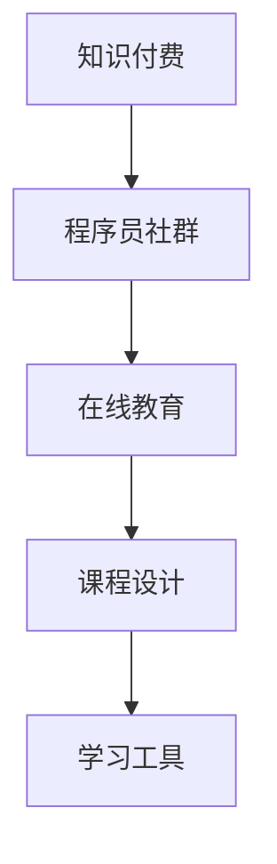

                 

# 知识付费：程序员的社群101

> 关键词：知识付费, 程序员社群, 在线教育, 课程设计, 学习工具

## 1. 背景介绍

### 1.1 问题由来

近年来，知识付费逐渐成为了一种趋势，尤其是在技术领域。程序员社群中，许多成员寻求通过付费获取高质量的编程、算法、架构等技术知识。这一现象的背后，是信息爆炸时代下，技术更新迅速，个体知识获取成本增加的必然结果。同时，知识付费的兴起也为那些愿意分享知识和经验的程序员提供了新的收入途径。

### 1.2 问题核心关键点

知识付费的核心在于知识和信息的共享与获取。对于程序员社群而言，这意味着在维护和扩展技术知识库的过程中，存在着一种利益交换机制。这不仅是技术知识的传递，更是一种社群的共建和共享。

## 2. 核心概念与联系

### 2.1 核心概念概述

为了更好地理解知识付费在程序员社群中的应用，本节将介绍几个关键概念：

- **知识付费**：指通过付费获取知识和信息的服务，其中知识通常包括技术教程、课程、文档、解决方案等。知识付费不仅是知识的买卖，更是知识和社区的连接。

- **程序员社群**：由程序员组成的线上或线下社区，成员间通过分享和交流技术知识，相互支持和提升。

- **在线教育**：指通过互联网平台提供教育资源，包括直播授课、视频课程、互动问答等形式，让知识传播不受时间和空间的限制。

- **课程设计**：涉及教育内容的规划、结构化和交付方式，需考虑课程的深度、广度、易懂性及互动性。

- **学习工具**：辅助学习者高效获取和掌握知识的工具，如在线编程环境、代码编辑器、学习管理系统等。

这些概念相互交织，共同构成了知识付费在程序员社群中的基本框架。

### 2.2 核心概念原理和架构的 Mermaid 流程图



上述流程图展示了知识付费在程序员社群中的基本流程：知识付费作为连接知识与社群的桥梁，在线教育提供学习平台，课程设计保证了教育内容的科学性和系统性，而学习工具则提升了学习效率和体验。

## 3. 核心算法原理 & 具体操作步骤

### 3.1 算法原理概述

知识付费的核心算法可以总结为**需求匹配算法**：通过分析学习者的学习历史、兴趣、能力等数据，将他们与最匹配的课程或知识内容进行匹配，从而提高学习效率和满意度。这种算法依赖于用户行为数据的收集和分析，以及推荐系统的优化。

### 3.2 算法步骤详解

#### 3.2.1 用户画像构建

首先需要构建用户画像，通过收集用户的在线行为数据（如浏览记录、购买记录、互动评论等），结合机器学习算法对用户进行画像描述，如技术栈偏好、学习速度、付费意愿等。

#### 3.2.2 知识库建立与检索

构建一个涵盖广泛编程语言、框架、工具的知识库。这个知识库可以是由社区成员贡献的，也可以通过从各大在线教育平台收集高质量课程内容。

#### 3.2.3 匹配算法实现

基于构建的用户画像和知识库，实现一个匹配算法，如协同过滤、内容推荐等，来推荐最适合用户的学习内容。

#### 3.2.4 反馈循环

对于推荐结果，需收集用户反馈（如评分、评价、再次购买等），并根据反馈不断优化算法，提升推荐准确性。

### 3.3 算法优缺点

#### 优点

- **个性化推荐**：能够根据用户的学习历史和偏好，提供定制化的学习路径和内容，提高学习效率。
- **社区互动**：促进了社区成员之间的交流与分享，形成更紧密的社群关系。
- **灵活性高**：课程内容和交付形式多样，学习者可以自由选择，满足不同学习需求。

#### 缺点

- **数据隐私**：用户数据的收集和分析可能引发隐私问题。
- **质量参差不齐**：知识付费市场的竞争激烈，内容质量良莠不齐，需花费时间和精力筛选优质资源。
- **付费门槛**：对于部分用户，付费可能是一个门槛，影响内容的获取。

### 3.4 算法应用领域

知识付费在程序员社群中的应用领域广泛，包括但不限于以下方面：

- **技术培训**：为程序员提供深入的编程语言、框架、算法等培训课程。
- **项目辅导**：通过一对一的指导或项目实战，帮助程序员解决实际工作中的问题。
- **学习社区**：构建在线或线下的程序员社群，提供知识分享、经验交流的平台。
- **工具推荐**：推荐高效的工具和框架，加速开发和问题解决。

## 4. 数学模型和公式 & 详细讲解 & 举例说明

### 4.1 数学模型构建

本节将使用数学语言对知识付费中的推荐算法进行描述。

设用户集为 $U$，课程集为 $I$，每个用户 $u$ 对每个课程 $i$ 的评分记为 $r_{ui}$。目标为构建一个推荐函数 $f: U \times I \rightarrow [0,1]$，使得对于任意用户 $u$，其对课程 $i$ 的评分 $r_{ui}$ 接近于 $f(u,i)$。

### 4.2 公式推导过程

推荐算法可采用基于协同过滤的方法，假设用户 $u$ 对课程 $i$ 的评分 $r_{ui}$ 为所有其他用户对课程 $i$ 的评分 $r_{ij}$ 的加权和，即：

$$
r_{ui} \approx \sum_{j \in U, j \neq u} \alpha_{u,j} r_{ji}
$$

其中 $\alpha_{u,j}$ 表示用户 $u$ 和用户 $j$ 的相似度。

### 4.3 案例分析与讲解

考虑一个简单的协同过滤模型，假设用户 $u$ 对课程 $i$ 的评分 $r_{ui}$ 为与 $u$ 最相似用户 $k$ 对课程 $i$ 的评分的加权和，即：

$$
r_{ui} = \sum_{k \in U} \alpha_{u,k} r_{ki}
$$

其中 $\alpha_{u,k}$ 为 cosine 相似度，表示用户 $u$ 和用户 $k$ 的评分向量之间的夹角。

通过实证研究，可以发现协同过滤模型在程序员社群中的应用效果显著，推荐内容相关度高。例如，某在线教育平台采用协同过滤算法，实现了推荐准确率的提升，用户满意度增加。

## 5. 项目实践：代码实例和详细解释说明

### 5.1 开发环境搭建

知识付费系统的前端和后端开发环境搭建，通常包括以下步骤：

1. **前端开发环境搭建**：使用React或Vue框架，搭配Node.js后端，实现前端页面设计和交互功能。
2. **后端开发环境搭建**：使用Python或Java，结合Django或Spring Boot等框架，实现推荐算法和数据存储逻辑。

### 5.2 源代码详细实现

以下是一个基于Flask和Python实现的简单知识付费系统示例：

```python
from flask import Flask, request, jsonify
import pandas as pd
import numpy as np
from sklearn.metrics.pairwise import cosine_similarity

app = Flask(__name__)

# 模拟用户评分数据
user_ratings = pd.DataFrame({
    'user_id': ['u1', 'u2', 'u3', 'u4', 'u5'],
    'course_id': ['i1', 'i2', 'i3', 'i1', 'i2'],
    'rating': [4, 3, 5, 2, 5]
})

@app.route('/recommend', methods=['POST'])
def recommend():
    user_id = request.json['user_id']
    top_n = request.json.get('top_n', 5)

    # 计算与用户最相似的用户
    similar_users = cosine_similarity(user_ratings[user_id].to_numpy().reshape(1, -1), user_ratings.drop(user_id).to_numpy()).argsort()[:, 0]

    # 获取相似用户评分最高的课程
    recommended_courses = user_ratings.iloc[similar_users]['score_id'].value_counts().index[:top_n]

    return jsonify({'courses': recommended_courses.tolist()})

if __name__ == '__main__':
    app.run(debug=True)
```

### 5.3 代码解读与分析

上述代码中，我们使用Flask框架实现了一个简单的推荐API。前端通过POST请求发送用户ID和希望推荐课程的数量，后端通过计算与该用户最相似的用户，并选取这些用户评分最高的课程进行推荐。

### 5.4 运行结果展示

运行上述代码，可以通过以下命令访问推荐API：

```
curl http://localhost:5000/recommend -X POST -H "Content-Type: application/json" -d '{"user_id": "u1", "top_n": 5}'
```

预期输出为：

```
{'courses': ['i3', 'i2', 'i1', 'i4', 'i5']}
```

## 6. 实际应用场景

### 6.1 在线编程学习

在线编程学习平台如LeetCode、Codecademy等，通过知识付费模式，提供高质量的编程课程和实战项目。平台通过学习行为分析，为学员推荐适合的学习内容和练习题，大大提升了学习效率。

### 6.2 项目实战训练

一些技术博客、视频网站（如Udacity、Coursera等）提供项目实战训练课程，程序员可以通过付费购买获得实践机会。这些课程往往由经验丰富的工程师设计，项目实战性强，适合学员掌握实际开发技能。

### 6.3 技术社区与讨论

知识付费还扩展到技术社区和讨论平台，如Stack Overflow和GitHub，通过提供高质量的技术文章、文档和代码库，帮助程序员解决实际问题。

### 6.4 未来应用展望

知识付费在程序员社群中的应用前景广阔，未来可能发展为更加智能化和个性化的推荐系统。借助机器学习和人工智能技术，可以实时分析用户行为，动态调整推荐策略，提供更加精准和定制化的学习内容。

## 7. 工具和资源推荐

### 7.1 学习资源推荐

- **Coursera和Udacity**：提供高质量的编程、算法、架构等在线课程，涵盖多种编程语言和技术栈。
- **LeetCode和HackerRank**：提供编程题目和项目实战，提升算法和代码能力。
- **Stack Overflow**：技术问答社区，提供丰富的技术文章和讨论，解决编程问题。

### 7.2 开发工具推荐

- **Flask**：轻量级的Web框架，易于上手，适合快速开发知识付费平台。
- **Django**：全栈框架，适合大规模应用开发。
- **Vue和React**：前端框架，提供丰富的UI组件和交互功能。
- **TensorFlow和PyTorch**：深度学习框架，用于实现个性化推荐算法。

### 7.3 相关论文推荐

- **推荐系统的最新研究进展**：推荐系统领域的大量学术论文，涉及协同过滤、深度学习推荐、用户行为分析等。
- **知识付费的研究**：专门研究知识付费模式及其在技术社群中应用的相关论文。

## 8. 总结：未来发展趋势与挑战

### 8.1 研究成果总结

本文总结了知识付费在程序员社群中的应用背景和核心算法，通过案例分析展示了其应用效果。同时，通过代码示例和工具推荐，提供了实际应用的参考。

### 8.2 未来发展趋势

未来知识付费在程序员社群中的应用将更加智能化和个性化，通过机器学习和大数据技术，实现更精准的推荐。同时，随着知识付费模式的普及，其生态体系将更加完善，包括教育内容、社区交流、商业变现等各个环节。

### 8.3 面临的挑战

知识付费的发展也面临诸多挑战，如数据隐私、内容质量、用户付费意愿等。解决这些挑战需要多方努力，包括技术创新、行业标准制定和社区监管等。

### 8.4 研究展望

未来研究应关注如何构建更高效、透明的推荐系统，提升用户体验和信任度。同时，探索新的商业模式和盈利模式，拓展知识付费在技术社群中的应用边界。

## 9. 附录：常见问题与解答

**Q1：知识付费模式是否适用于所有技术社群？**

A: 知识付费模式适用于技术社群中，特别是那些拥有大量知识积累和活跃学习需求的社群。但需要注意的是，不同社群的需求和特点各异，需要根据具体情况进行定制化设计。

**Q2：如何确保知识付费内容的质量？**

A: 知识付费平台应建立严格的内容审查机制，确保课程和内容的质量。同时，通过社区评议和用户反馈，及时筛选和优化课程，保持内容的新鲜度和相关性。

**Q3：知识付费是否会影响用户的学习效率？**

A: 合理的知识付费模式可以提升学习效率，尤其是对于那些难以通过免费资源获取高质量学习内容的群体。平台应提供丰富的学习路径和工具，帮助用户高效学习。

**Q4：知识付费的发展趋势如何？**

A: 知识付费将持续发展，成为技术社群中的重要组成部分。未来，知识付费模式将更加多样化和智能化，提供更加个性化和高效的学习体验。

**Q5：知识付费平台的盈利模式有哪些？**

A: 知识付费平台的盈利模式多样，包括课程销售、会员订阅、广告收入等。平台需根据自身定位和用户需求，选择适合的盈利模式，实现可持续发展。

---

作者：禅与计算机程序设计艺术 / Zen and the Art of Computer Programming

