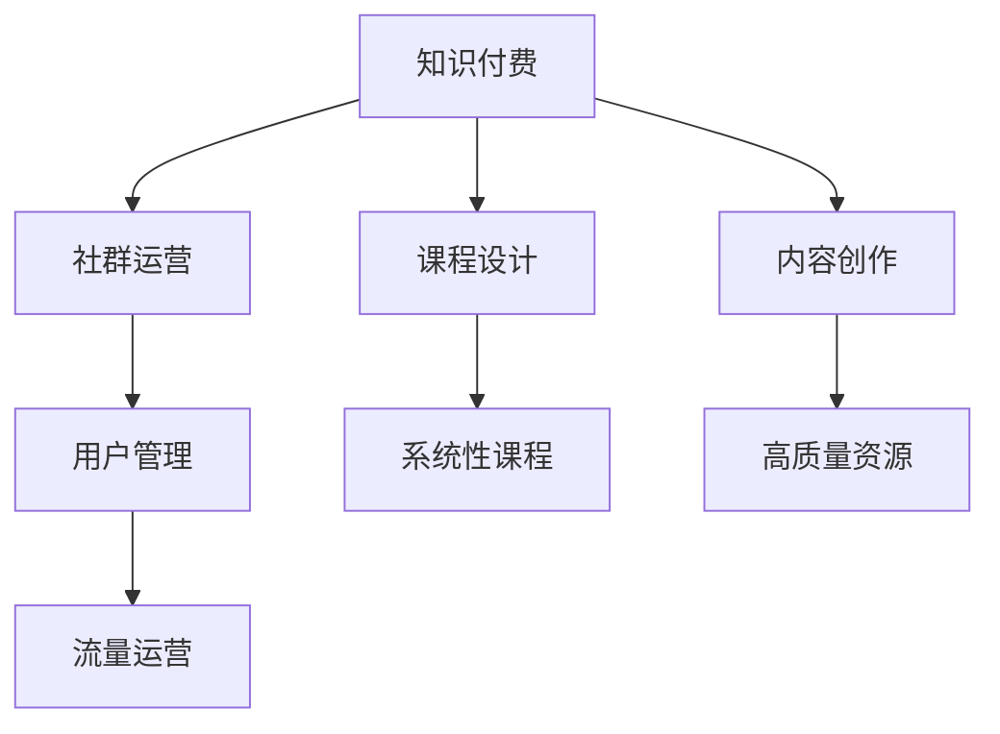

                 

# 知识付费：程序员的社群运营指南

> 关键词：知识付费、社群运营、程序员、课程设计、内容创作、用户管理、流量运营

## 1. 背景介绍

### 1.1 问题由来
在知识付费领域，程序员社群尤其活跃。随着技术的不断发展和应用的深入，越来越多的程序员希望通过学习新的知识和技能来提升自身竞争力。然而，如何高效、系统地传递知识，同时确保内容的实用性和吸引力，是程序员社群运营中的一大挑战。传统意义上的学习模式已经不能满足程序员的需求，而知识付费则提供了一个新的视角，将知识产品化，通过系统化的课程和个性化的服务来满足程序员的求知欲望。

### 1.2 问题核心关键点
知识付费的核心在于内容的创作、传播和变现。对于程序员社群来说，其运营关键是如何在保证内容质量的同时，吸引用户参与并持续提供价值。这需要综合考虑课程设计、内容创作、用户管理、流量运营等多个方面，形成一套系统性的运营方案。

### 1.3 问题研究意义
构建一个成功的程序员知识付费社群，不仅能够满足程序员的学习需求，还能推动技术社区的发展，提升程序员的整体技能水平，促进技术创新和行业应用。同时，知识付费模式也为社群的长期运营和盈利提供了新的路径，能够更好地实现社群的可持续发展。

## 2. 核心概念与联系

### 2.1 核心概念概述

为更好地理解程序员知识付费社群的运营，本节将介绍几个密切相关的核心概念：

- 知识付费(Knowledge As A Service, KaaS)：通过在线课程、电子书、技术讲座等方式，为用户提供有价值的技术知识，并通过付费机制实现盈利的模式。
- 社群运营(Community Management)：构建和管理技术社群，通过内容互动、用户参与、交流讨论等方式提升社群活跃度和粘性。
- 课程设计(Course Design)：针对特定技术领域，设计系统化的学习路径和课程内容，确保课程的实用性和系统性。
- 内容创作(Content Creation)：制作高质量的课程视频、文字、代码等教育资源，满足用户的学习需求。
- 用户管理(User Management)：通过数据分析、用户画像、社群行为等手段，识别关键用户，提升用户满意度和忠诚度。
- 流量运营(Framework Operation)：通过各种运营手段，如SEO、社交媒体营销、广告投放等，吸引用户访问和使用社群资源，提高社群的知名度和影响力。

这些核心概念之间的逻辑关系可以通过以下Mermaid流程图来展示：



这个流程图展示的知识付费社群的各个核心概念及其之间的关系：

1. 知识付费是整个社群运营的核心。
2. 课程设计和内容创作是知识付费的两大支柱。
3. 用户管理是确保社群活跃和粘性的关键。
4. 流量运营是吸引用户访问和使用社群资源的重要手段。

## 3. 核心算法原理 & 具体操作步骤

### 3.1 算法原理概述

知识付费社群的运营，从根本上讲，是一个系统的工程。其核心算法原理是通过数据驱动和用户体验设计，实现知识的高效传播和变现。具体而言，包括以下几个关键步骤：

1. **需求分析**：通过调查问卷、用户反馈等方式，了解用户的学习需求和偏好，识别出最具价值的学习路径和内容点。
2. **课程设计**：根据需求分析结果，设计系统化的课程体系，确保课程内容的前后连贯和实用性。
3. **内容创作**：基于课程设计，制作高质量的教学资源，包括视频讲解、文本教材、代码示例等。
4. **用户管理**：通过用户行为分析，识别高价值用户，并通过个性化推荐、定期互动等方式提升用户粘性。
5. **流量运营**：通过SEO优化、社交媒体营销、广告投放等方式吸引新用户，并提高社群的整体活跃度。
6. **收益变现**：通过订阅、付费课程、高级服务等形式实现社群的盈利，并不断优化用户体验。

### 3.2 算法步骤详解

以下是具体的算法步骤，每个步骤的详细说明：

#### 3.2.1 需求分析

需求分析是社群运营的首要环节，需要通过定性和定量的方法，全面了解用户的学习需求。

- **问卷调查**：设计问卷，涵盖用户的学习背景、目标、偏好等方面，收集用户反馈。
- **数据分析**：利用用户行为数据（如浏览记录、观看时长等）进行定量分析，了解用户的学习习惯和兴趣点。
- **用户访谈**：与典型用户进行深度访谈，收集详细的反馈信息，识别核心需求和痛点。

#### 3.2.2 课程设计

课程设计是知识付费的核心环节，需要考虑课程的系统性、实用性和可操作性。

- **确定课程框架**：根据需求分析结果，确定课程的总体框架，包括课程数量、模块划分、知识点分布等。
- **制定教学目标**：明确每门课程的目标和教学大纲，确保教学内容与实际需求相匹配。
- **整合资源**：将课程内容整合为系统化的资源，包括视频教程、文字教材、代码示例等，确保资源的完整性和可用性。

#### 3.2.3 内容创作

内容创作是知识付费的关键环节，需要制作高质量的教学资源，满足用户的学习需求。

- **视频制作**：录制高质量的课程视频，涵盖知识点讲解、代码示例、实战案例等内容。
- **文本编写**：编写详尽的课程教材和笔记，确保教学内容的完整性和准确性。
- **代码示例**：提供实际可运行的代码示例，帮助用户理解和实践课程内容。

#### 3.2.4 用户管理

用户管理是保持社群活跃的关键环节，需要通过数据分析和用户互动，提升用户粘性和满意度。

- **用户画像分析**：通过数据分析，识别出高价值用户，并根据用户画像进行精准营销和互动。
- **个性化推荐**：利用推荐算法，向用户推荐符合其兴趣和需求的内容和课程，提高用户粘性。
- **定期互动**：定期组织线上或线下的技术交流活动，增加用户之间的互动，提升社群氛围。

#### 3.2.5 流量运营

流量运营是吸引新用户和提升社群活跃度的关键环节，需要通过多种运营手段吸引用户。

- **SEO优化**：通过优化关键词和内容，提升社群在搜索引擎中的排名，吸引更多用户访问。
- **社交媒体营销**：利用社交媒体平台，发布高质量的内容，吸引用户关注和分享，扩大社群影响力。
- **广告投放**：在相关平台上进行精准广告投放，吸引潜在用户加入社群。

#### 3.2.6 收益变现

收益变现是知识付费的最终目的，需要通过用户付费、广告分成等方式实现盈利。

- **订阅服务**：提供按月或按年的订阅服务，让用户可以持续获取高质量内容。
- **付费课程**：推出高价值课程，通过付费机制实现盈利。
- **高级服务**：提供专属的高端服务，如一对一指导、深度交流等，满足用户的高级需求。

### 3.3 算法优缺点

知识付费社群的运营，从根本上讲，是一个系统的工程。其核心算法原理是通过数据驱动和用户体验设计，实现知识的高效传播和变现。具体而言，包括以下几个关键步骤：

- **优点**：
  - 系统性强：通过系统化的课程设计和内容创作，确保知识传播的系统性和实用性。
  - 用户粘性高：通过用户管理，提升用户粘性和满意度，保持社群的长期活跃。
  - 盈利模式多样：通过订阅、付费课程、高级服务等形式实现多渠道盈利。

- **缺点**：
  - 投入成本高：需要投入大量资源进行需求分析、课程设计和内容创作。
  - 用户获取难：如何吸引新用户并提高用户粘性是一个复杂的问题。
  - 市场竞争激烈：知识付费市场竞争激烈，需要不断创新才能保持竞争优势。

### 3.4 算法应用领域

知识付费社群的运营方法，已经广泛应用于多个领域，如编程、数据分析、人工智能等，为技术从业者提供了一条高效、系统化的学习路径。除了技术领域，知识付费模式也在教育、健康、旅游等行业得到广泛应用，推动了这些领域的数字化转型。

## 4. 数学模型和公式 & 详细讲解 & 举例说明

### 4.1 数学模型构建

知识付费社群的运营，可以通过数学模型来进一步量化和优化。

假设社群中总共有$N$个用户，每个用户的学习需求可以通过向量$\mathbf{d}_i$表示，其中$i=1,2,\ldots,N$。课程设计者可以根据需求分析结果，确定$K$门课程，每门课程的教学目标和知识点可以通过向量$\mathbf{t}_k$和$\mathbf{k}_k$表示，其中$k=1,2,\ldots,K$。内容创作者制作的高质量资源可以通过向量$\mathbf{c}_k$表示。用户管理的目的是最大化用户满意度和粘性，可以通过最大化用户满意度函数$\mathcal{F}(\mathbf{d},\mathbf{t},\mathbf{k},\mathbf{c})$来实现。流量运营的目标是最大化社群的活跃度，可以通过最大化社群活跃度函数$\mathcal{G}(\mathbf{d},\mathbf{t},\mathbf{k},\mathbf{c},\mathbf{a})$来实现，其中$\mathbf{a}$为广告投放策略。收益变现的目标是最大化社群的收益，可以通过最大化收益函数$\mathcal{R}(\mathbf{d},\mathbf{t},\mathbf{k},\mathbf{c},\mathbf{s})$来实现，其中$\mathbf{s}$为订阅服务策略。

### 4.2 公式推导过程

以下是具体的公式推导过程：

#### 4.2.1 用户满意度函数$\mathcal{F}(\mathbf{d},\mathbf{t},\mathbf{k},\mathbf{c})$

用户满意度的计算基于用户对课程内容和资源的使用情况，可以通过以下公式计算：

$$
\mathcal{F}(\mathbf{d},\mathbf{t},\mathbf{k},\mathbf{c}) = \sum_{i=1}^N \mathcal{F}_i(\mathbf{d}_i,\mathbf{t},\mathbf{k},\mathbf{c})
$$

其中$\mathcal{F}_i(\mathbf{d}_i,\mathbf{t},\mathbf{k},\mathbf{c})$为用户$i$对课程的满意度，可以通过用户反馈、使用时长等指标计算得到。

#### 4.2.2 社群活跃度函数$\mathcal{G}(\mathbf{d},\mathbf{t},\mathbf{k},\mathbf{c},\mathbf{a})$

社群活跃度的计算基于用户的行为数据和广告投放策略，可以通过以下公式计算：

$$
\mathcal{G}(\mathbf{d},\mathbf{t},\mathbf{k},\mathbf{c},\mathbf{a}) = \sum_{i=1}^N \mathcal{G}_i(\mathbf{d}_i,\mathbf{t},\mathbf{k},\mathbf{c},\mathbf{a})
$$

其中$\mathcal{G}_i(\mathbf{d}_i,\mathbf{t},\mathbf{k},\mathbf{c},\mathbf{a})$为用户$i$对社群的活跃度，可以通过用户行为数据和广告投放策略计算得到。

#### 4.2.3 社群收益函数$\mathcal{R}(\mathbf{d},\mathbf{t},\mathbf{k},\mathbf{c},\mathbf{s})$

社群收益的计算基于用户付费情况和订阅服务策略，可以通过以下公式计算：

$$
\mathcal{R}(\mathbf{d},\mathbf{t},\mathbf{k},\mathbf{c},\mathbf{s}) = \sum_{i=1}^N \mathcal{R}_i(\mathbf{d}_i,\mathbf{t},\mathbf{k},\mathbf{c},\mathbf{s})
$$

其中$\mathcal{R}_i(\mathbf{d}_i,\mathbf{t},\mathbf{k},\mathbf{c},\mathbf{s})$为用户$i$对社群的收益，可以通过用户付费情况和订阅服务策略计算得到。

### 4.3 案例分析与讲解

以下是一个具体的案例分析：

假设一个程序员社群中有100个用户，每个用户的学习需求可以用向量$\mathbf{d}_i$表示。课程设计者确定了5门课程，每门课程的教学目标和知识点可以用向量$\mathbf{t}_k$和$\mathbf{k}_k$表示。内容创作者制作了高品质的视频教程、文本教材和代码示例，用向量$\mathbf{c}_k$表示。用户管理的目的是最大化用户满意度和粘性，通过最大化用户满意度函数$\mathcal{F}(\mathbf{d},\mathbf{t},\mathbf{k},\mathbf{c})$来实现。流量运营的目标是最大化社群的活跃度，通过最大化社群活跃度函数$\mathcal{G}(\mathbf{d},\mathbf{t},\mathbf{k},\mathbf{c},\mathbf{a})$来实现。收益变现的目标是最大化社群的收益，通过最大化收益函数$\mathcal{R}(\mathbf{d},\mathbf{t},\mathbf{k},\mathbf{c},\mathbf{s})$来实现。

## 5. 项目实践：代码实例和详细解释说明

### 5.1 开发环境搭建

在进行知识付费社群运营的实践前，我们需要准备好开发环境。以下是使用Python进行Django开发的环境配置流程：

1. 安装Anaconda：从官网下载并安装Anaconda，用于创建独立的Python环境。

2. 创建并激活虚拟环境：
```bash
conda create -n django-env python=3.8 
conda activate django-env
```

3. 安装Django：
```bash
pip install django==3.2
```

4. 安装各个依赖包：
```bash
pip install pillow markdown django-ckeditor django-cradmin-forms django-allauth django-celery django-slim-jwt django-settings-backend-dotenv
```

5. 安装MySQL数据库：
```bash
sudo apt-get install mysql-server
```

完成上述步骤后，即可在`django-env`环境中开始开发。

### 5.2 源代码详细实现

以下是使用Django进行知识付费社群运营的代码实现：

首先，定义用户模型：

```python
from django.contrib.auth.models import AbstractUser
from django.db import models

class User(AbstractUser):
    bio = models.TextField(null=True, blank=True)
    courses_purchased = models.ManyToManyField('Course')
    courses_completed = models.ManyToManyField('Course')
```

然后，定义课程模型：

```python
from django.db import models
from django.urls import reverse

class Course(models.Model):
    title = models.CharField(max_length=200)
    description = models.TextField(null=True, blank=True)
    duration = models.IntegerField(null=True, blank=True)
    price = models.DecimalField(max_digits=10, decimal_places=2)
    video_url = models.URLField(null=True, blank=True)
    comments = models.ManyToManyField('Comment')
    user = models.ForeignKey(User, on_delete=models.CASCADE)

    def __str__(self):
        return self.title

    def get_absolute_url(self):
        return reverse('course-detail', args=[self.id])
```

接着，定义评论模型：

```python
from django.db import models
from django.contrib.auth.models import User

class Comment(models.Model):
    text = models.TextField()
    user = models.ForeignKey(User, on_delete=models.CASCADE)
    course = models.ForeignKey(Course, on_delete=models.CASCADE)
    timestamp = models.DateTimeField(auto_now_add=True)
```

然后，定义视图和模板：

```python
from django.shortcuts import render, get_object_or_404
from django.views.generic import ListView, DetailView, CreateView, UpdateView, DeleteView
from django.urls import reverse_lazy
from .models import User, Course, Comment

class UserListView(ListView):
    model = User
    template_name = 'user_list.html'
    context_object_name = 'users_list'

class UserDetailView(DetailView):
    model = User
    template_name = 'user_detail.html'
    context_object_name = 'user'

class CourseListView(ListView):
    model = Course
    template_name = 'course_list.html'
    context_object_name = 'courses_list'

class CourseDetailView(DetailView):
    model = Course
    template_name = 'course_detail.html'
    context_object_name = 'course'

class CourseCreateView(CreateView):
    model = Course
    fields = ['title', 'description', 'duration', 'price', 'video_url']
    template_name = 'course_form.html'
    success_url = reverse_lazy('course_list')

class CourseUpdateView(UpdateView):
    model = Course
    fields = ['title', 'description', 'duration', 'price', 'video_url']
    template_name = 'course_form.html'
    success_url = reverse_lazy('course_list')

class CourseDeleteView(DeleteView):
    model = Course
    template_name = 'course_confirm_delete.html'
    success_url = reverse_lazy('course_list')

def course_comment_create(request, course_id):
    course = get_object_or_404(Course, id=course_id)
    if request.method == 'POST':
        text = request.POST['text']
        Comment.objects.create(text=text, user=request.user, course=course)
        return redirect(course.get_absolute_url())
    return render(request, 'course_comment_form.html')
```

最后，定义路由：

```python
from django.urls import path
from . import views

urlpatterns = [
    path('users/', views.UserListView.as_view(), name='user_list'),
    path('users/<int:pk>/', views.UserDetailView.as_view(), name='user_detail'),
    path('courses/', views.CourseListView.as_view(), name='course_list'),
    path('courses/<int:pk>/', views.CourseDetailView.as_view(), name='course_detail'),
    path('courses/create/', views.CourseCreateView.as_view(), name='course_create'),
    path('courses/<int:pk>/update/', views.CourseUpdateView.as_view(), name='course_update'),
    path('courses/<int:pk>/delete/', views.CourseDeleteView.as_view(), name='course_delete'),
    path('courses/<int:pk>/comment/create/', views.course_comment_create, name='course_comment_create'),
]
```

完成上述步骤后，即可在`django-env`环境中开始运营知识付费社群。

### 5.3 代码解读与分析

让我们再详细解读一下关键代码的实现细节：

**User模型**：
- `bio`字段：用于记录用户个人简介。
- `courses_purchased`和`courses_completed`字段：记录用户购买和完成的课程。

**Course模型**：
- `title`字段：课程标题。
- `description`字段：课程描述。
- `duration`字段：课程时长。
- `price`字段：课程价格。
- `video_url`字段：课程视频链接。
- `comments`字段：课程评论。
- `user`字段：课程上传者。

**Comment模型**：
- `text`字段：评论内容。
- `user`字段：评论用户。
- `course`字段：评论所属课程。
- `timestamp`字段：评论时间戳。

**视图和模板**：
- 定义了用户列表、用户详情、课程列表、课程详情、课程创建、课程更新、课程删除等视图。
- 定义了相应的HTML模板，用于展示和编辑课程信息。
- `course_comment_create`函数：用于创建课程评论。

**路由定义**：
- 定义了各个视图的路由，用于将请求映射到相应的视图函数。

**运行结果展示**：
- 用户可以浏览课程列表、课程详情，并可以购买、评论课程。
- 课程上传者可以查看和管理自己的课程信息。
- 课程评论者可以发布评论，与课程上传者进行互动。

## 6. 实际应用场景

### 6.1 智能客服系统

基于知识付费的程序员社群运营，可以应用于智能客服系统的构建。传统客服往往需要配备大量人力，高峰期响应缓慢，且一致性和专业性难以保证。而使用付费知识付费社群构建的智能客服系统，可以24小时不间断服务，快速响应客户咨询，用系统化的知识解决各类常见问题。

在技术实现上，可以收集企业内部的历史客服对话记录，将问题和最佳答复构建成知识付费内容，供用户付费获取。用户在使用智能客服系统时，可以根据问题类型搜索对应的课程，获取系统化的答案。对于用户提出的新问题，还可以实时搜索相关课程内容，动态组织生成回答。如此构建的智能客服系统，能够大幅提升客户咨询体验和问题解决效率。

### 6.2 金融舆情监测

金融机构需要实时监测市场舆论动向，以便及时应对负面信息传播，规避金融风险。传统的人工监测方式成本高、效率低，难以应对网络时代海量信息爆发的挑战。基于知识付费的金融舆情监测系统，可以显著提升监测效率和效果。

具体而言，可以收集金融领域相关的新闻、报道、评论等文本数据，将其制作成付费课程，供投资者付费获取。系统根据用户的订阅信息，自动推送最新的市场舆情动态，并提供专家分析、投资建议等服务。对于用户提出的舆情问题，系统可以通过调用相关课程的内容，给出专业、系统的回答，帮助投资者快速了解市场动态，规避风险。

### 6.3 个性化推荐系统

当前的推荐系统往往只依赖用户的历史行为数据进行物品推荐，无法深入理解用户的真实兴趣偏好。基于知识付费的个性化推荐系统，可以更好地挖掘用户行为背后的语义信息，从而提供更精准、多样的推荐内容。

在实践中，可以收集用户浏览、点击、评论、分享等行为数据，提取和用户交互的物品标题、描述、标签等文本内容。将文本内容作为模型输入，用户的后续行为（如是否点击、购买等）作为监督信号，在此基础上微调预训练语言模型。微调后的模型能够从文本内容中准确把握用户的兴趣点。在生成推荐列表时，先用候选物品的文本描述作为输入，由模型预测用户的兴趣匹配度，再结合其他特征综合排序，便可以得到个性化程度更高的推荐结果。

### 6.4 未来应用展望

随着知识付费模式在技术社群的广泛应用，未来的知识付费系统将变得更加智能和高效。

在智慧医疗领域，基于知识付费的在线医疗咨询系统将提升医疗服务的智能化水平，辅助医生诊疗，加速新药开发进程。

在智能教育领域，知识付费系统可以应用于作业批改、学情分析、知识推荐等方面，因材施教，促进教育公平，提高教学质量。

在智慧城市治理中，知识付费系统可应用于城市事件监测、舆情分析、应急指挥等环节，提高城市管理的自动化和智能化水平，构建更安全、高效的未来城市。

此外，在企业生产、社会治理、文娱传媒等众多领域，基于知识付费的人工智能应用也将不断涌现，为经济社会发展注入新的动力。相信随着技术的日益成熟，知识付费模式将成为人工智能落地应用的重要范式，推动人工智能技术在垂直行业的规模化落地。总之，知识付费技术的广泛应用，将极大拓展技术社群的边界，为各行各业带来新的发展机遇。

## 7. 工具和资源推荐

### 7.1 学习资源推荐

为了帮助开发者系统掌握知识付费技术，这里推荐一些优质的学习资源：

1. 《Python知识付费开发实战》书籍：全面介绍了知识付费系统的开发流程和实践技巧，适合编程和产品经理阅读。

2. Udacity《知识付费与内容营销》课程：系统讲解了知识付费的商业模式、内容制作、用户运营等方面的知识，适合有志于进入知识付费领域的人士。

3. Coursera《数据科学导论》课程：介绍了数据科学的基础知识和技术，包括数据收集、数据清洗、数据可视化等内容，适合技术从业者学习。

4. Udemy《知识付费产品设计与运营》课程：从产品设计、内容运营、用户体验等多个角度，全面解析知识付费系统的构建方法。

5. edX《人工智能伦理》课程：介绍了人工智能技术的伦理问题和风险，帮助开发者构建有责任感和道德感的知识付费系统。

通过对这些资源的学习实践，相信你一定能够快速掌握知识付费技术的精髓，并用于解决实际的运营问题。

### 7.2 开发工具推荐

高效的开发离不开优秀的工具支持。以下是几款用于知识付费系统开发的常用工具：

1. Django：基于Python的开源Web框架，功能强大、社区活跃，适合构建高可靠性的知识付费系统。

2. Flask：轻量级Web框架，灵活性高、开发效率快，适合构建轻量级的知识付费应用。

3. GitHub：代码托管平台，提供丰富的代码版本控制和协作工具，适合团队协作开发。

4. GitLab：开源项目管理和代码托管平台，支持CI/CD和DevOps，适合知识付费系统的持续集成和部署。

5. Jenkins：开源的持续集成工具，支持自动化构建、测试和部署，适合知识付费系统的自动化流程。

合理利用这些工具，可以显著提升知识付费系统的开发效率，加快创新迭代的步伐。

### 7.3 相关论文推荐

知识付费技术的不断发展源于学界的持续研究。以下是几篇奠基性的相关论文，推荐阅读：

1. 《知识付费：基于大数据的个性化推荐》：研究了知识付费系统中的推荐算法，提出了基于协同过滤和内容推荐的个性化推荐方法。

2. 《知识付费：用户行为分析与建模》：研究了知识付费系统中的用户行为数据，提出了基于序列建模和图神经网络的用户行为预测方法。

3. 《知识付费：内容质量评估与优化》：研究了知识付费系统中的内容质量评估，提出了基于用户反馈和情感分析的内容质量评估方法。

4. 《知识付费：用户满意度优化》：研究了知识付费系统中的用户满意度，提出了基于用户反馈和行为数据的用户满意度优化方法。

5. 《知识付费：流量运营与广告投放》：研究了知识付费系统中的流量运营，提出了基于A/B测试和流量分析的流量运营方法。

这些论文代表了大语言模型微调技术的发展脉络。通过学习这些前沿成果，可以帮助研究者把握学科前进方向，激发更多的创新灵感。

## 8. 总结：未来发展趋势与挑战

### 8.1 总结

本文对基于知识付费的程序员社群运营方法进行了全面系统的介绍。首先阐述了知识付费技术的背景和意义，明确了知识付费技术的运营关键是如何在保证内容质量的同时，吸引用户参与并持续提供价值。其次，从原理到实践，详细讲解了知识付费技术的各个环节，给出了知识付费技术开发的完整代码实例。同时，本文还广泛探讨了知识付费技术在智能客服、金融舆情、个性化推荐等多个领域的应用前景，展示了知识付费技术的巨大潜力。此外，本文精选了知识付费技术的各类学习资源，力求为开发者提供全方位的技术指引。

通过本文的系统梳理，可以看到，基于知识付费的程序员社群运营技术，已经在多个领域得到应用，为技术社群的运营提供了新的思路和工具。受益于知识付费模式，技术社群的运营将变得更加智能化、系统化，促进技术社群的发展和进化。

### 8.2 未来发展趋势

展望未来，知识付费技术的运营将呈现以下几个发展趋势：

1. 系统性增强：知识付费技术的系统性将进一步增强，通过系统化的课程设计和内容创作，确保知识传播的系统性和实用性。
2. 用户粘性提升：通过用户管理，提升用户粘性和满意度，保持社群的长期活跃。
3. 多渠道盈利：知识付费技术的盈利模式将更加多样，通过订阅、付费课程、高级服务等形式实现多渠道盈利。
4. 智能化提升：通过引入人工智能技术，实现知识传播的智能化和个性化，提升用户的学习体验。
5. 全球化拓展：知识付费技术的全球化拓展将进一步加速，通过本地化运营和全球化协作，实现知识传播的全球化覆盖。

以上趋势凸显了知识付费技术的广阔前景。这些方向的探索发展，必将进一步提升知识付费系统的性能和应用范围，为各行各业带来新的发展机遇。

### 8.3 面临的挑战

尽管知识付费技术已经取得了显著的成果，但在迈向更加智能化、普适化应用的过程中，它仍面临着诸多挑战：

1. 内容质量保证：如何保证知识付费内容的实用性、科学性和可理解性，是一个长期且复杂的问题。
2. 用户获取困难：如何吸引新用户并提高用户粘性，是一个复杂且充满挑战的问题。
3. 市场竞争激烈：知识付费市场竞争激烈，如何保持创新和差异化，是一个重要且亟待解决的问题。
4. 技术平台维护：如何构建高可靠性、高扩展性的技术平台，是一个关键且亟待解决的问题。
5. 伦理道德问题：如何构建道德、公正的知识付费系统，是一个重要且亟待解决的问题。

这些挑战需要在技术、运营、法律等多个方面进行综合考虑和解决，才能实现知识付费技术的长期可持续发展。

### 8.4 研究展望

未来知识付费技术的研究将在以下几个方向进行探索：

1. 多模态知识付费：将视觉、音频等多模态信息与文本信息相结合，提升知识付费内容的丰富性和吸引力。
2. 个性化推荐系统：通过引入深度学习、推荐系统等技术，提升知识付费内容的个性化推荐能力。
3. 用户行为分析：通过深度学习、自然语言处理等技术，深入挖掘用户行为数据，提升知识付费系统的用户满意度。
4. 内容质量评估：通过自然语言处理、情感分析等技术，提升知识付费内容的评估能力，确保内容质量。
5. 智能客服系统：通过引入自然语言处理、机器学习等技术，构建智能客服系统，提升用户咨询体验。

这些研究方向将进一步推动知识付费技术的发展，为技术社群提供更加智能化、系统化、个性化的知识服务。相信在技术、运营、法律等多个方面的共同努力下，知识付费技术必将迎来新的发展高峰，为各行各业带来新的发展机遇。

## 9. 附录：常见问题与解答

**Q1：知识付费社群应该如何进行课程设计？**

A: 知识付费社群的课程设计应包括以下几个步骤：

1. **需求分析**：通过问卷调查、用户访谈等方式，了解用户的学习需求和兴趣点。
2. **需求整合**：将用户需求整合为课程模块，确定课程的总体框架。
3. **内容制作**：制作高质量的课程内容，包括视频讲解、文本教材、代码示例等。
4. **内容优化**：根据用户反馈和行为数据，不断优化课程内容，确保其实用性和科学性。

**Q2：知识付费社群应该如何进行用户管理？**

A: 知识付费社群的用户管理应包括以下几个步骤：

1. **用户画像分析**：通过数据分析，识别出高价值用户，并根据用户画像进行精准营销和互动。
2. **个性化推荐**：利用推荐算法，向用户推荐符合其兴趣和需求的内容和课程。
3. **定期互动**：定期组织线上或线下的技术交流活动，增加用户之间的互动，提升社群氛围。

**Q3：知识付费社群应该如何进行流量运营？**

A: 知识付费社群的流量运营应包括以下几个步骤：

1. **SEO优化**：通过优化关键词和内容，提升社群在搜索引擎中的排名，吸引更多用户访问。
2. **社交媒体营销**：利用社交媒体平台，发布高质量的内容，吸引用户关注和分享，扩大社群影响力。
3. **广告投放**：在相关平台上进行精准广告投放，吸引潜在用户加入社群。

**Q4：知识付费社群应该如何进行收益变现？**

A: 知识付费社群的收益变现应包括以下几个步骤：

1. **订阅服务**：提供按月或按年的订阅服务，让用户可以持续获取高质量内容。
2. **付费课程**：推出高价值课程，通过付费机制实现盈利。
3. **高级服务**：提供专属的高端服务，如一对一指导、深度交流等，满足用户的高级需求。

**Q5：知识付费社群应该如何进行内容创作？**

A: 知识付费社群的内容创作应包括以下几个步骤：

1. **内容规划**：确定课程的总体框架，包括课程数量、模块划分、知识点分布等。
2. **内容制作**：制作高质量的教学资源，包括视频教程、文本教材、代码示例等。
3. **内容优化**：根据用户反馈和行为数据，不断优化课程内容，确保其实用性和科学性。

**Q6：知识付费社群应该如何进行用户满意度优化？**

A: 知识付费社群的用户满意度优化应包括以下几个步骤：

1. **用户反馈收集**：通过问卷调查、用户评论等方式，收集用户的反馈和建议。
2. **内容优化**：根据用户反馈，优化课程内容和资源，确保其实用性和科学性。
3. **互动提升**：定期组织线上或线下的技术交流活动，增加用户之间的互动，提升社群氛围。

---

作者：禅与计算机程序设计艺术 / Zen and the Art of Computer Programming

