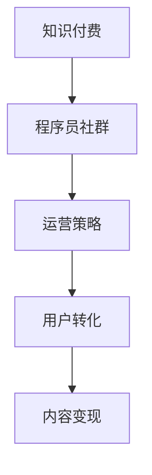

                 

# 知识付费：程序员的社群运营指导

> 关键词：知识付费, 程序员社群, 运营策略, 用户转化, 内容变现, 技术社区

## 1. 背景介绍

随着互联网和信息技术的发展，知识付费逐渐成为行业内的热门话题。对于程序员而言，技术进步日新月异，终身学习的理念深入人心。技术社群成为程序员获取新知识、交流经验的理想场所。然而，如何通过知识付费，使得社群可持续运营并实现商业化，是摆在新时代技术社群面前的一个重大挑战。本文将结合实际案例，探讨程序员社群的运营策略，为用户提供可行的知识变现模式。

## 2. 核心概念与联系

在探讨知识付费与程序员社群的运营策略之前，首先需要了解一些核心概念及其相互联系。

### 2.1 核心概念概述

1. **知识付费（Knowledge Paywall）**：用户为获取有价值的信息或知识而支付费用的模式。在知识付费中，优质内容成为稀缺资源，用户需要通过付费才能获得。
2. **程序员社群（Coding Community）**：由程序员组成的虚拟或实体社区，提供技术交流、项目合作、职业发展等多样化服务。
3. **运营策略（Operational Strategy）**：通过一系列精心设计的策略和措施，实现社群的长期可持续运营，同时实现商业化。
4. **用户转化（User Conversion）**：通过合理的营销和运营手段，将潜在用户转化为实际用户，并提升用户活跃度和粘性。
5. **内容变现（Content Monetization）**：通过优质内容的生产与传播，实现社群的商业化运营，如广告、会员订阅、课程销售等。

### 2.2 核心概念的联系

知识付费、程序员社群、运营策略、用户转化和内容变现这几个核心概念之间具有密切的联系：

- **知识付费与程序员社群**：知识付费为程序员社群提供了一种可持续的运营模式，即通过高质量内容的生产与传播，形成付费机制，实现商业化。
- **运营策略与程序员社群**：运营策略是实现程序员社群长期可持续运营的基石，涵盖内容生产、社区管理、用户互动等多个方面。
- **用户转化与程序员社群**：用户转化是社群发展的关键，即通过有效的运营手段，将潜在用户转化为活跃用户，提升社群的用户基础和活跃度。
- **内容变现与程序员社群**：内容变现是知识付费的主要形式，通过优质的内容产出与传播，实现社群的商业化运营。

这些概念之间的联系可以通过以下Mermaid流程图来展示：



## 3. 核心算法原理 & 具体操作步骤

### 3.1 算法原理概述

基于知识付费和程序员社群的运营策略，本文将主要从以下几个方面进行探讨：

- **内容定位与筛选**：定位社群内用户对知识的需求，筛选出具有高价值的内容。
- **付费模型设计**：设计合理的付费机制，让用户愿意为高质量内容付费。
- **用户行为分析**：分析用户行为，提升用户转化率和满意度。
- **内容变现模式**：探索多样化内容变现方式，实现社群商业化运营。

### 3.2 算法步骤详解

1. **内容定位与筛选**：
   - **用户需求调研**：通过问卷调查、数据分析等方式，了解社群内用户对知识的需求类型和需求程度。
   - **内容库构建**：根据调研结果，构建内容库，筛选出高价值的、用户需求大的内容。

2. **付费模型设计**：
   - **单次付费**：用户支付固定金额，获取一次性内容。
   - **订阅制**：用户按月或按年订阅，获取固定时间段内的全部内容。
   - **按需付费**：根据内容价值和使用频率，用户按需付费。

3. **用户行为分析**：
   - **用户画像**：分析用户的基本信息、行为偏好、付费习惯等，构建用户画像。
   - **行为建模**：建立用户行为模型，预测用户行为，提升用户体验。

4. **内容变现模式**：
   - **广告模式**：在社群内植入广告，实现广告变现。
   - **会员制模式**：用户支付会员费，获取社群内所有内容。
   - **课程销售**：提供高质量课程，通过课程销售变现。

### 3.3 算法优缺点

**优点**：
- **高用户粘性**：通过高质量内容的持续输出，提升用户粘性，提高用户活跃度。
- **多元化变现**：通过广告、课程销售、会员制等多样化变现模式，实现社群的商业化运营。

**缺点**：
- **内容制作成本高**：高质量内容的产出需要投入大量时间和资源。
- **用户接受度**：部分用户对知识付费模式可能存在抵触情绪，需要耐心引导和推广。

### 3.4 算法应用领域

知识付费与程序员社群的运营策略广泛应用于以下领域：

- **技术交流平台**：如Stack Overflow、GitHub等，提供高质量代码分享和技术交流。
- **技术培训平台**：如Udemy、Coursera等，提供各类技术培训课程。
- **技术问答社区**：如知乎、CSDN等，提供问题解答和经验分享。
- **开源项目**：如Apache、Linux Foundation等，通过社区管理实现商业化运营。

## 4. 数学模型和公式 & 详细讲解 & 举例说明

### 4.1 数学模型构建

假设有一个程序员社群，其中用户总数为 $N$，单个用户每月愿意支付的平均费用为 $\mu$，内容库中的优质内容数量为 $C$。社群每月的运营成本为 $C$，每个优质内容的使用频率为 $f$，则社群每月的收入 $I$ 和支出 $E$ 可以表示为：

$$
I = \mu \times N \times f
$$
$$
E = C
$$

### 4.2 公式推导过程

1. **用户转化率**：
   设社群每月新增用户数为 $n$，则用户转化率为：
   $$
   \text{转化率} = \frac{n}{N}
   $$

2. **内容使用率**：
   设每月使用优质内容的用户数为 $U$，则内容使用率为：
   $$
   \text{使用率} = \frac{U}{C}
   $$

3. **利润计算**：
   每月利润 $P$ 可以表示为：
   $$
   P = I - E = (\mu \times N \times f) - C
   $$

### 4.3 案例分析与讲解

以知乎为例，分析其知识付费与社群运营策略：

1. **内容定位与筛选**：知乎通过用户投票和编辑筛选，构建高质量内容库。
2. **付费模型设计**：知乎采用“盐选会员”模式，用户支付会员费，获取部分优质内容。
3. **用户行为分析**：知乎通过大数据分析，构建用户画像，提升内容推送的精准性。
4. **内容变现模式**：知乎通过广告、课程销售和会员制等模式实现商业化运营。

## 5. 项目实践：代码实例和详细解释说明

### 5.1 开发环境搭建

为了实现程序员社群的运营策略，需要搭建一个具备以下功能的开发环境：

1. **用户管理系统**：用于管理用户信息、订阅状态、行为记录等。
2. **内容管理系统**：用于管理内容库、版权信息、访问权限等。
3. **营销系统**：用于分析用户行为、推广活动、广告投放等。
4. **支付系统**：用于处理用户支付、发票、退款等业务。

具体步骤如下：

1. **安装开发环境**：
   ```bash
   conda create -n coding-env python=3.7
   conda activate coding-env
   pip install django flask flask Restful Django
   ```

2. **搭建后端框架**：
   ```python
   # django settings.py
   ...
   INSTALLED_APPS = [
       'django.contrib.admin',
       ...
       'myapp',
       ...
   ]
   ```

3. **搭建前端界面**：
   ```html
   <!-- templates/base.html -->
   <!DOCTYPE html>
   <html>
   <head>
       <title>程序员社群</title>
   </head>
   <body>
       
       
       
   </body>
   </html>
   ```

### 5.2 源代码详细实现

以下是一个简单的用户管理系统的代码实现：

```python
# django models.py
from django.db import models

class User(models.Model):
    name = models.CharField(max_length=100)
    email = models.EmailField(unique=True)
    created_at = models.DateTimeField(auto_now_add=True)

class Subscription(models.Model):
    user = models.ForeignKey(User, on_delete=models.CASCADE)
    plan = models.CharField(max_length=20)
    start_date = models.DateTimeField()
    end_date = models.DateTimeField()
```

### 5.3 代码解读与分析

1. **用户模型**：
   - **name**：用户姓名。
   - **email**：用户邮箱，用于登录和接收通知。
   - **created_at**：用户创建时间。

2. **订阅模型**：
   - **user**：用户与订阅之间的关系，用于管理用户的订阅状态。
   - **plan**：订阅计划，如“盐选会员”。
   - **start_date**：订阅开始日期。
   - **end_date**：订阅结束日期。

### 5.4 运行结果展示

1. **用户注册**：
   ```python
   from django.contrib.auth import get_user_model

   user = get_user_model().objects.create_user(username='username', password='password')
   ```

2. **订阅管理**：
   ```python
   from django.contrib.auth.models import User
   from .models import Subscription

   user = User.objects.get(username='username')
   subscription = Subscription.objects.create(user=user, plan='盐选会员', start_date=datetime.datetime.now(), end_date=datetime.datetime.now() + datetime.timedelta(days=30))
   ```

## 6. 实际应用场景

### 6.1 技术交流平台

技术交流平台是程序员社群的重要形式之一。知乎、Stack Overflow等平台通过高质量内容产出，吸引大量程序员加入。通过知识付费模式，平台能够实现商业化运营，同时保证内容的优质性和专业性。

### 6.2 技术培训平台

技术培训平台如Udemy、Coursera等，通过提供各类技术课程，帮助程序员掌握新技能。平台采用订阅制或按需付费模式，通过高质量课程的产出与传播，实现商业化运营。

### 6.3 技术问答社区

技术问答社区如知乎、CSDN等，通过问题解答和经验分享，帮助程序员解决实际问题。平台通过广告、课程销售和会员制等模式实现商业化运营。

## 7. 工具和资源推荐

### 7.1 学习资源推荐

1. **《知识付费的商业逻辑》**：
   - **内容**：介绍知识付费的商业逻辑、用户心理、变现模式等。
   - **价值**：提供全面而系统的知识付费理论基础，帮助你更好地理解运营策略。

2. **《程序员社群运营指南》**：
   - **内容**：介绍程序员社群的运营策略、用户管理、内容产出等。
   - **价值**：提供实用的社群运营方法和工具，提升社群的用户基础和活跃度。

### 7.2 开发工具推荐

1. **Django**：
   - **特点**：开源、易于学习、社区活跃。
   - **应用**：搭建网站、后台管理系统、API接口等。

2. **Flask**：
   - **特点**：轻量级、易于扩展、灵活性高。
   - **应用**：快速搭建小应用、API接口、微服务架构等。

### 7.3 相关论文推荐

1. **《知识付费平台的商业模式分析》**：
   - **内容**：分析知识付费平台的商业模式、用户行为、盈利模式等。
   - **价值**：提供深度分析视角，帮助你理解知识付费的商业价值。

2. **《程序员社群的运营策略研究》**：
   - **内容**：研究程序员社群的运营策略、用户管理、内容输出等。
   - **价值**：提供实证研究结果，帮助你制定更有效的运营策略。

## 8. 总结：未来发展趋势与挑战

### 8.1 总结

本文详细探讨了知识付费与程序员社群的运营策略，从内容定位与筛选、付费模型设计、用户行为分析、内容变现模式等多个方面进行了深入分析。通过实际案例和数学模型，展示了知识付费在程序员社群中的实际应用效果。

### 8.2 未来发展趋势

1. **内容个性化**：通过AI技术，实现内容推荐和个性化推送，提升用户体验。
2. **多渠道变现**：除了传统的广告和课程销售，还可以探索更多元化的变现模式，如众筹、会员制、积分系统等。
3. **跨平台协作**：通过API接口和开源技术，实现不同平台之间的数据共享和协作，提升社群的影响力和用户覆盖面。
4. **知识深度化**：除了浅层次的知识分享，还可以探索深度学习、人工智能等领域的知识，提升社群的科技含量和专业性。

### 8.3 面临的挑战

1. **内容制作成本高**：高质量内容的产出需要投入大量时间和资源。
2. **用户接受度**：部分用户对知识付费模式可能存在抵触情绪，需要耐心引导和推广。
3. **市场竞争激烈**：知识付费市场竞争激烈，需要不断创新和优化，提升竞争力。
4. **用户流失率**：用户流失率高，需要不断优化用户体验，提升用户粘性。

### 8.4 研究展望

1. **人工智能与知识付费结合**：引入AI技术，提升内容推荐和个性化推送的精准性。
2. **跨领域知识共享**：通过API接口，实现不同领域知识共享，提升社群的广度和深度。
3. **社区治理机制**：建立社区治理机制，提升用户互动和社区自治能力。
4. **可持续发展**：通过多渠道变现和跨平台协作，实现社群的可持续发展。

## 9. 附录：常见问题与解答

**Q1：如何提升社群的用户粘性？**

A：提升社群用户粘性需要从多个方面入手：
- **优质内容产出**：持续输出高质量内容，满足用户需求。
- **用户互动**：鼓励用户参与讨论，提升社区活跃度。
- **用户体验**：提升网站或应用的用户体验，减少用户流失率。

**Q2：知识付费模式如何避免用户抵触？**

A：避免用户抵触需要注意以下几点：
- **透明化**：明确告知用户付费内容的具体价值和优势，让用户明确收益。
- **多样化**：提供多种付费模式，满足不同用户需求。
- **用户教育**：通过用户教育和引导，提升用户对知识付费的认可度。

**Q3：如何进行用户行为分析？**

A：用户行为分析通常包括以下几个步骤：
- **数据采集**：通过网站、应用等渠道采集用户行为数据。
- **数据清洗**：对采集到的数据进行清洗和处理，去除无用信息。
- **行为建模**：利用机器学习算法，建立用户行为模型，预测用户行为。
- **结果应用**：根据行为模型结果，优化用户体验和运营策略。

**Q4：如何提升内容变现效率？**

A：提升内容变现效率需要从多个方面入手：
- **精准内容定位**：通过数据分析，定位用户需求，生产精准内容。
- **多样化变现模式**：除了传统的课程销售和广告，还可以探索其他变现模式，如会员制、众筹等。
- **用户教育**：通过用户教育和引导，提升用户对付费内容的认可度。

**Q5：知识付费的盈利模式有哪些？**

A：知识付费的盈利模式主要包括：
- **广告模式**：通过植入广告实现盈利。
- **会员制模式**：用户支付会员费，获取部分优质内容。
- **课程销售**：提供高质量课程，通过课程销售变现。
- **众筹模式**：用户为特定内容或项目进行众筹，实现盈利。

---

作者：禅与计算机程序设计艺术 / Zen and the Art of Computer Programming

