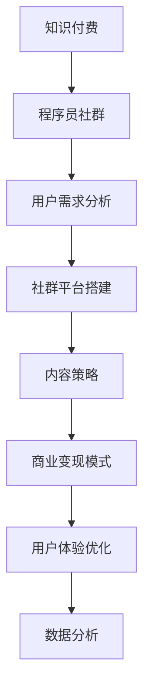

                 

# 知识付费：程序员的社群运营攻略

> 关键词：知识付费, 程序员, 社群运营, 市场调研, 用户需求分析, 社群平台搭建, 内容策略, 商业变现, 用户体验优化, 数据分析

## 1. 背景介绍

### 1.1 问题由来

随着互联网的飞速发展，知识付费成为一种快速增长的市场。2021年，中国知识付费市场规模预计达到645亿元，同比增长38.4%[[1]]。在程序员这一群体中，知识付费尤为盛行，主要原因包括技术迭代快、自学需求大以及时间成本高等。然而，虽然知识付费市场如火如荼，但众多平台的质量参差不齐，用户体验和内容质量仍是待优化之处。

### 1.2 问题核心关键点

针对知识付费平台，尤其是针对程序员社群运营的三个核心问题是：

- **用户体验优化**：如何提供优质、高效的学习资源，满足程序员的实际需求？
- **内容策略制定**：如何制定出符合市场趋势和用户需求的内容策略？
- **商业变现模式**：如何通过内容付费、广告、会员、周边产品等途径实现商业模式变现？

## 2. 核心概念与联系

### 2.1 核心概念概述

为更好地理解如何运营程序员社群，本节将介绍几个关键概念：

- **知识付费**：即用户为获取知识或技能，通过订阅、购买等方式支付费用的模式。知识付费平台主要提供教育培训、咨询、内容创作等服务。

- **程序员社群**：即一群对编程和计算机技术有共同兴趣的程序员，在平台或线下空间共同交流、学习和分享知识的社区。

- **用户需求分析**：通过调查研究、数据分析等方式，了解用户需求，为平台的内容策略制定提供依据。

- **社群平台搭建**：包括选择合适的技术平台、设计平台架构、实现用户接口等。

- **内容策略**：指在了解用户需求的基础上，制定出内容的主题、形式、更新频率等，以吸引用户并保持活跃度。

- **商业变现模式**：通过用户付费、广告、会员订阅、周边产品等多种方式实现盈利。

- **用户体验优化**：提升用户在使用平台的整体体验，包括界面设计、功能可用性、交互流程等。

- **数据分析**：通过数据挖掘、分析等手段，实时监控平台的用户行为，以指导平台运营和优化。

这些概念之间的逻辑关系可以通过以下Mermaid流程图来展示：



这个流程图展示了知识付费与程序员社群运营的相互关系，其中用户需求分析是平台运营的基础，社群平台搭建为平台提供技术支持，内容策略是用户吸引和活跃的关键，商业变现模式是平台盈利的重要环节，用户体验优化和数据分析则确保平台稳定和持续发展。

## 3. 核心算法原理 & 具体操作步骤
### 3.1 算法原理概述

**程序员社群运营的核心算法原理**是：

- **用户行为分析**：通过用户行为数据（如浏览、点击、付费等），分析用户偏好和需求。
- **内容推荐算法**：基于用户行为和内容标签，推荐符合用户兴趣的内容。
- **商业变现算法**：通过分析用户行为，制定相应的广告投放和付费策略，最大化商业价值。
- **数据分析算法**：利用机器学习等技术，分析用户行为数据，为运营策略提供数据支持。

这些算法构成了程序员社群运营的基础，核心在于通过数据驱动，提升用户黏性，实现商业变现，优化用户体验。

### 3.2 算法步骤详解

**程序员社群运营的具体操作步骤**如下：

1. **用户调研**：通过问卷调查、访谈等方式，了解用户需求，形成初步用户画像。
2. **平台搭建**：选择合适的技术栈（如React、Vue等），设计平台架构，实现功能模块。
3. **内容策略制定**：根据用户调研结果，制定内容主题、形式、更新频率等，保证内容质量与用户需求相匹配。
4. **内容制作与审核**：邀请技术专家和知名讲师制作内容，同时进行严格审核，保证内容准确性和实用性。
5. **用户推荐系统**：利用推荐算法，推荐用户可能感兴趣的内容，提高用户活跃度。
6. **商业变现策略**：根据平台运营数据，制定付费策略、广告投放等，实现盈利。
7. **用户体验优化**：根据用户反馈和行为数据，优化平台界面和功能，提升用户体验。
8. **数据分析与迭代**：通过数据分析，实时监控平台表现，发现问题，并迭代优化。

### 3.3 算法优缺点

**程序员社群运营算法的主要优点**包括：

- **数据驱动**：通过数据分析，精准把握用户需求，制定内容策略。
- **个性化推荐**：提高用户满意度和活跃度，提升平台黏性。
- **灵活变现**：根据用户行为制定灵活的变现策略，最大化商业价值。

**主要缺点**是：

- **数据隐私**：用户行为数据的收集和分析可能涉及到隐私问题。
- **内容质量控制**：内容制作和审核难度大，需要大量时间和人力投入。
- **运营成本**：技术平台搭建和持续维护需要大量资源。
- **用户体验**：用户反馈和需求变化快，需要不断迭代优化。

### 3.4 算法应用领域

程序员社群运营算法广泛应用在以下领域：

- **技术培训平台**：如Udacity、Coursera等，通过内容策略和推荐算法吸引用户，实现商业变现。
- **技术交流社区**：如Stack Overflow、GitHub等，通过用户反馈和数据分析优化平台体验。
- **知识付费平台**：如极客时间、慕课网等，通过内容推荐和变现策略提升用户价值。
- **技术论坛**：如CSDN、知乎等，通过用户行为数据，实现精准推荐和商业变现。

## 4. 数学模型和公式 & 详细讲解 & 举例说明

### 4.1 数学模型构建

**知识付费平台的核心数学模型**是用户行为模型，通过收集用户行为数据，构建用户画像，实现个性化推荐。

用户行为模型包括两部分：

- **用户画像**：描述用户属性和行为习惯，可以通过数据挖掘技术构建。
- **用户兴趣模型**：描述用户对不同内容类型的偏好，可以通过协同过滤和矩阵分解技术构建。

数学表达式如下：

$$
U = (U_1, U_2, ..., U_n) \\
I = (I_1, I_2, ..., I_m) \\
R = (r_{ij})_{n \times m}
$$

其中，$U$ 为用户画像，$I$ 为用户兴趣模型，$R$ 为平台上的内容评分矩阵。

### 4.2 公式推导过程

**用户画像的构建**：通过协同过滤和矩阵分解，计算用户画像。

协同过滤包括基于用户的协同过滤和基于项目的协同过滤。

基于用户的协同过滤公式如下：

$$
\hat{r}_{ui} = \frac{\sum_{v=1}^{N} r_{vi}p_u(v)}{\sum_{v=1}^{N}p_u(v)}
$$

其中，$r_{vi}$为项目$v$在用户$i$的评分，$p_u(v)$为用户$i$对项目$v$的兴趣程度。

基于项目的协同过滤公式如下：

$$
\hat{r}_{ui} = \frac{\sum_{u=1}^{M} r_{uv}q(v)q(u)}{\sum_{u=1}^{M}q(u)^2}
$$

其中，$r_{uv}$为项目$u$在用户$v$的评分，$q(u)$为项目$u$的兴趣程度。

**用户兴趣模型的构建**：通过矩阵分解技术，计算用户对不同内容的兴趣程度。

设用户$i$对项目$j$的评分矩阵为$R_{ij}$，用户兴趣模型为$I_i$，内容兴趣模型为$I_j$，公式如下：

$$
I_i = \sum_{j=1}^{m} \alpha_{ij} R_{ij} \\
I_j = \sum_{i=1}^{n} \beta_{ij} R_{ij}
$$

其中，$\alpha_{ij}$和$\beta_{ij}$为矩阵分解因子。

### 4.3 案例分析与讲解

**案例：知识付费平台内容的个性化推荐**

某知识付费平台有数万名用户，每天产生大量用户行为数据。平台希望通过数据驱动，实现个性化推荐。

1. **用户画像构建**：通过分析用户行为数据，计算每个用户的兴趣点，构建用户画像。
2. **用户兴趣模型计算**：利用协同过滤和矩阵分解技术，计算每个用户对不同内容的兴趣程度。
3. **内容推荐**：根据用户画像和兴趣模型，利用推荐算法，推荐用户可能感兴趣的内容。
4. **效果评估**：通过A/B测试等方法，评估推荐效果，持续迭代优化。

## 5. 项目实践：代码实例和详细解释说明
### 5.1 开发环境搭建

**开发环境搭建**流程如下：

1. **环境配置**：安装Python 3.x、pip等环境，选择合适的数据库（如MySQL、MongoDB）。
2. **技术选型**：选择合适的技术栈（如React、Vue等），设计平台架构。
3. **平台搭建**：实现用户接口、内容管理等核心功能。
4. **数据管理**：设计数据库架构，实现用户行为数据存储和管理。

### 5.2 源代码详细实现

**核心代码实现**如下：

```python
from flask import Flask, request
from pymongo import MongoClient
import json

app = Flask(__name__)

# 连接MongoDB数据库
client = MongoClient('mongodb://localhost:27017/')
db = client['knowledge']

# 用户行为数据表
collection = db['user_behavior']

# 推荐内容表
content_collection = db['content']

# 推荐内容算法实现
def recommend_content(user_id):
    # 从用户行为数据表中获取用户兴趣点
    user_interests = collection.find_one({'user_id': user_id})
    # 从内容表中获取每个内容的标签
    content_tags = collection.find_one({'id': user_id})
    # 计算推荐内容
    recommendations = []
    for content_id in content_tags['content']:
        if content_id not in user_interests['content']:
            recommendations.append(content_id)
    # 返回推荐内容列表
    return json.dumps(recommendations)

# 用户行为数据存储
@app.route('/user_behavior', methods=['POST'])
def save_user_behavior():
    user_data = request.get_json()
    user_id = user_data['user_id']
    content_id = user_data['content_id']
    collection.insert_one({'user_id': user_id, 'content_id': content_id})
    return 'User behavior saved successfully'

# 推荐内容接口
@app.route('/recommend', methods=['GET'])
def get_recommendations():
    user_id = request.args.get('user_id')
    return recommend_content(user_id)

if __name__ == '__main__':
    app.run(debug=True)
```

### 5.3 代码解读与分析

**代码解读**：

1. **环境配置和数据存储**：通过Flask框架连接MongoDB数据库，实现用户行为数据的存储和管理。
2. **推荐内容算法实现**：通过查询用户行为数据和内容标签，实现内容的推荐。
3. **用户行为数据存储**：通过API接口，保存用户行为数据。
4. **推荐内容接口**：通过API接口，获取推荐内容列表。

**代码分析**：

- **数据存储设计**：通过MongoDB数据库，实现用户行为数据的高效存储和查询。
- **推荐算法设计**：通过用户行为数据和内容标签，实现个性化推荐。
- **接口设计**：通过RESTful API接口，实现用户行为数据的存储和推荐内容的获取。

## 6. 实际应用场景
### 6.1 技术培训平台

**实际应用场景**：某技术培训平台利用程序员社群运营算法，通过个性化推荐和内容策略，吸引用户并实现商业变现。

**具体实现**：

1. **用户调研**：通过问卷调查，了解学员需求，形成学员画像。
2. **平台搭建**：搭建React前端页面，实现课程浏览、购买等功能。
3. **内容策略制定**：根据学员调研结果，制定课程主题、形式、更新频率等，保证课程质量与学员需求相匹配。
4. **内容制作与审核**：邀请技术专家和知名讲师制作课程，同时进行严格审核，保证课程准确性和实用性。
5. **用户推荐系统**：利用推荐算法，推荐学员可能感兴趣的课程，提高学员活跃度。
6. **商业变现策略**：根据平台运营数据，制定付费策略、广告投放等，实现盈利。
7. **用户体验优化**：根据学员反馈和行为数据，优化平台界面和功能，提升用户体验。
8. **数据分析与迭代**：通过数据分析，实时监控平台表现，发现问题，并迭代优化。

### 6.2 技术交流社区

**实际应用场景**：某技术交流社区利用程序员社群运营算法，通过用户反馈和数据分析，优化平台体验。

**具体实现**：

1. **用户调研**：通过问卷调查，了解用户需求，形成用户画像。
2. **平台搭建**：搭建Vue前端页面，实现问题发布、解答等功能。
3. **内容策略制定**：根据用户调研结果，制定内容主题、形式、更新频率等，保证内容质量与用户需求相匹配。
4. **内容制作与审核**：邀请技术专家和知名讲师回答问题，同时进行严格审核，保证答案准确性和实用性。
5. **用户推荐系统**：利用推荐算法，推荐用户可能感兴趣的问题，提高用户活跃度。
6. **商业变现策略**：通过广告和付费问答，实现盈利。
7. **用户体验优化**：根据用户反馈和行为数据，优化平台界面和功能，提升用户体验。
8. **数据分析与迭代**：通过数据分析，实时监控平台表现，发现问题，并迭代优化。

### 6.3 知识付费平台

**实际应用场景**：某知识付费平台利用程序员社群运营算法，通过内容推荐和变现策略，提升用户价值。

**具体实现**：

1. **用户调研**：通过问卷调查，了解用户需求，形成用户画像。
2. **平台搭建**：搭建Vue前端页面，实现课程浏览、购买等功能。
3. **内容策略制定**：根据用户调研结果，制定课程主题、形式、更新频率等，保证课程质量与用户需求相匹配。
4. **内容制作与审核**：邀请技术专家和知名讲师制作课程，同时进行严格审核，保证课程准确性和实用性。
5. **用户推荐系统**：利用推荐算法，推荐用户可能感兴趣的课程，提高用户活跃度。
6. **商业变现策略**：根据平台运营数据，制定付费策略、广告投放等，实现盈利。
7. **用户体验优化**：根据用户反馈和行为数据，优化平台界面和功能，提升用户体验。
8. **数据分析与迭代**：通过数据分析，实时监控平台表现，发现问题，并迭代优化。

### 6.4 技术论坛

**实际应用场景**：某技术论坛利用程序员社群运营算法，通过用户行为数据，实现精准推荐和商业变现。

**具体实现**：

1. **用户调研**：通过问卷调查，了解用户需求，形成用户画像。
2. **平台搭建**：搭建React前端页面，实现文章浏览、评论等功能。
3. **内容策略制定**：根据用户调研结果，制定文章主题、形式、更新频率等，保证内容质量与用户需求相匹配。
4. **内容制作与审核**：邀请技术专家和知名讲师制作文章，同时进行严格审核，保证文章准确性和实用性。
5. **用户推荐系统**：利用推荐算法，推荐用户可能感兴趣的文章，提高用户活跃度。
6. **商业变现策略**：通过广告和付费订阅，实现盈利。
7. **用户体验优化**：根据用户反馈和行为数据，优化平台界面和功能，提升用户体验。
8. **数据分析与迭代**：通过数据分析，实时监控平台表现，发现问题，并迭代优化。

## 7. 工具和资源推荐
### 7.1 学习资源推荐

**知识付费平台运营学习资源**：

1. **《数据科学导论》**：通过讲解数据挖掘、机器学习等技术，为平台运营提供数据支持。
2. **《用户体验设计》**：讲解用户体验设计的核心方法和技巧，提升平台用户体验。
3. **《商业变现模式》**：介绍商业变现的多种途径和策略，实现平台盈利。

### 7.2 开发工具推荐

**知识付费平台开发工具**：

1. **React**：React前端框架，适合搭建复杂的前端界面。
2. **Vue**：Vue前端框架，适合搭建简洁、易用的前端界面。
3. **Flask**：Python Web框架，适合快速开发后端接口。
4. **MongoDB**：NoSQL数据库，适合存储用户行为数据。

### 7.3 相关论文推荐

**知识付费平台运营相关论文**：

1. **《基于用户行为的个性化推荐算法研究》**：通过用户行为数据，实现个性化推荐。
2. **《用户体验设计中的用户需求分析》**：讲解用户体验设计的核心方法和技巧，提升平台用户体验。
3. **《商业变现模式研究》**：介绍商业变现的多种途径和策略，实现平台盈利。

## 8. 总结：未来发展趋势与挑战
### 8.1 总结

本文对程序员社群运营的算法进行了全面系统的介绍。通过用户需求分析、平台搭建、内容策略制定、商业变现模式等多个环节，详细阐述了如何通过数据驱动和算法优化，提升程序员社群的运营效果。通过系统的运营策略，可以实现平台盈利和用户体验的双赢，为知识付费平台的持续发展提供有力支撑。

通过本文的系统梳理，可以看到，程序员社群运营技术正在成为知识付费平台的重要支撑。这些运营策略不仅适用于技术培训、技术交流、知识付费、技术论坛等平台，还可以应用于其他垂直领域的知识付费运营。未来，伴随技术的不断进步和市场环境的演变，知识付费平台的运营策略将更加多元化、高效化，为程序员等专业人士提供更加优质的服务体验。

### 8.2 未来发展趋势

**未来发展趋势**：

1. **智能化推荐系统**：引入人工智能技术，提升个性化推荐精度，实现智能化推荐。
2. **多模态内容融合**：结合文字、图片、视频等多模态数据，丰富内容形式，提升用户体验。
3. **社交网络融合**：结合社交网络关系，增强用户黏性，提升用户活跃度。
4. **交互式内容设计**：通过交互式内容设计，提升用户参与度，增强平台互动性。
5. **边缘计算**：通过边缘计算技术，优化数据存储和传输，提升平台响应速度。
6. **区块链技术**：通过区块链技术，保障数据安全，提升内容版权保护。

这些趋势凸显了程序员社群运营技术的广阔前景，将进一步提升平台的用户体验和运营效率，为知识付费平台的可持续发展提供技术保障。

### 8.3 面临的挑战

**面临的挑战**：

1. **数据隐私**：用户行为数据的收集和分析可能涉及到隐私问题，需要加强数据保护。
2. **内容质量控制**：内容制作和审核难度大，需要大量时间和人力投入。
3. **运营成本**：技术平台搭建和持续维护需要大量资源，需平衡成本和收益。
4. **用户体验**：用户反馈和需求变化快，需要不断迭代优化，提升用户体验。
5. **市场竞争**：知识付费平台市场竞争激烈，需要不断创新和优化，保持平台竞争力。

这些挑战需要平台运营者综合考虑技术、市场、用户等多方面因素，持续优化平台运营策略，确保平台长期稳定发展。

### 8.4 研究展望

**未来研究展望**：

1. **数据隐私保护**：研究如何保护用户隐私，实现数据安全和用户隐私的双重保护。
2. **内容质量提升**：研究内容推荐算法和内容审核技术，提升内容质量。
3. **运营成本控制**：研究平台搭建和维护的技术优化方法，降低运营成本。
4. **用户体验优化**：研究交互式内容设计和用户体验优化技术，提升用户体验。
5. **市场竞争应对**：研究市场竞争策略，提升平台竞争力。

这些研究方向将推动程序员社群运营技术的不断进步，为知识付费平台的可持续发展提供有力保障。

## 9. 附录：常见问题与解答

**Q1：如何确定用户需求？**

A: 通过问卷调查、访谈等方式，了解用户需求，形成初步用户画像。利用用户行为数据，进一步分析用户偏好，制定内容策略。

**Q2：推荐算法如何设计？**

A: 通过协同过滤、矩阵分解、内容标签等技术，构建用户画像和内容兴趣模型，利用推荐算法实现个性化推荐。

**Q3：如何保证内容质量？**

A: 邀请技术专家和知名讲师制作内容，同时进行严格审核，保证内容准确性和实用性。

**Q4：如何优化用户体验？**

A: 根据用户反馈和行为数据，优化平台界面和功能，提升用户体验。

**Q5：如何实现商业变现？**

A: 通过内容付费、广告、会员、周边产品等多种方式实现盈利，根据平台运营数据，制定灵活的变现策略。

**Q6：如何处理用户行为数据？**

A: 通过数据分析技术，提取用户行为特征，构建用户画像，实现个性化推荐和内容策略制定。

**Q7：如何应对市场竞争？**

A: 通过不断创新和优化平台运营策略，提升平台竞争力，保持市场领先地位。

**Q8：如何实现智能化推荐系统？**

A: 引入人工智能技术，提升个性化推荐精度，实现智能化推荐。

通过本文的系统梳理，可以看到，程序员社群运营技术正在成为知识付费平台的重要支撑。这些运营策略不仅适用于技术培训、技术交流、知识付费、技术论坛等平台，还可以应用于其他垂直领域的知识付费运营。未来，伴随技术的不断进步和市场环境的演变，知识付费平台的运营策略将更加多元化、高效化，为程序员等专业人士提供更加优质的服务体验。

---

作者：禅与计算机程序设计艺术 / Zen and the Art of Computer Programming

