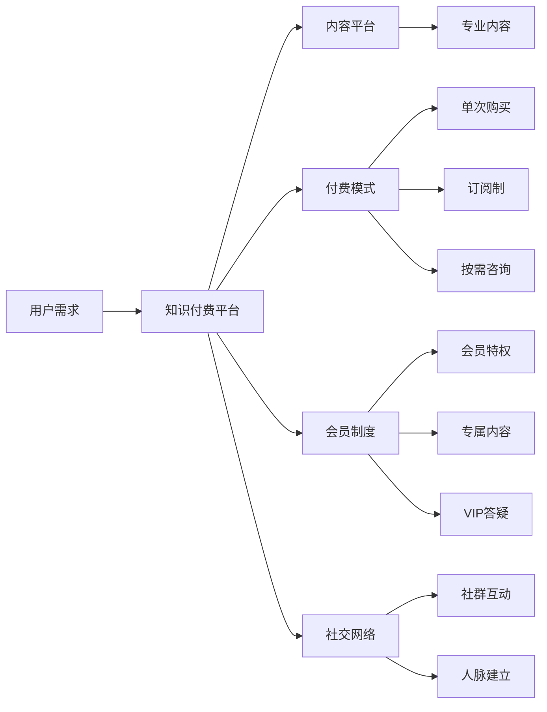

                 

# 知识付费：程序员的社群运营模板

## 1. 背景介绍

随着互联网的普及和技术的快速发展，知识付费已成为广大用户获取新知、提升技能的重要渠道。程序员作为推动技术进步的关键力量，对知识付费的需求日益旺盛。高质量的编程资源、前沿技术资讯、深度的技术分享，成为程序员社群运营的核心目标。本文将系统介绍一种基于知识付费机制的程序员社群运营模板，探讨如何构建一个高质量、活跃、可持续发展的程序员社群。

## 2. 核心概念与联系

### 2.1 核心概念概述

为了理解知识付费在程序员社群中的运营机制，我们需要先了解几个核心概念：

- **知识付费**：指用户通过付费方式获取专业知识和技能，以实现个人职业发展或解决实际问题的一种服务模式。知识付费服务包括在线课程、技术分享、实时问答等多种形式。
- **程序员社群**：指由程序员组成的线上或线下交流社区，以技术交流、项目合作、职业发展等为主题。社群成员通过互动分享，共同提升技术能力和行业认知。
- **付费模式**：指知识付费平台提供的多种收费方式，如单次购买、订阅制、按需咨询等，用户可根据自己的需求和预算选择最合适的付费方案。
- **内容平台**：指提供知识付费内容的服务平台，如Coursera、Udacity、知乎live等，通过聚合优质内容吸引用户。
- **会员制度**：指知识付费平台提供的会员服务，如会员特权、专属内容、VIP答疑等，通过等级划分激励用户持续付费。
- **社交网络**：指用户通过社群进行交流互动、建立人脉关系的网络平台，如GitHub、Stack Overflow等。

通过这些概念，我们可以构建出一个基于知识付费机制的程序员社群运营框架。

### 2.2 核心概念原理和架构的 Mermaid 流程图



此流程图展示了知识付费平台如何通过内容平台、付费模式、会员制度、社交网络等多种手段，满足用户的不同需求，形成良性互动。

## 3. 核心算法原理 & 具体操作步骤

### 3.1 算法原理概述

知识付费的运营核心在于内容平台和用户需求的匹配。社群运营模板的核心算法在于如何高效筛选和推荐高质量的内容，同时激励用户生成和分享高质量内容。

从算法角度，主要涉及以下几个关键点：

- **内容推荐算法**：通过用户行为数据（如浏览记录、付费记录等），推荐最符合用户兴趣和需求的内容。
- **付费激励机制**：设计合理的付费模式，如订阅制、按需咨询等，让用户持续支付，获取高价值内容。
- **内容审核与激励**：通过专家审核和用户评价，筛选优质内容，并给予作者一定的激励措施，促进更多高质量内容的产生。

### 3.2 算法步骤详解

#### 3.2.1 内容推荐算法

内容推荐算法主要包括协同过滤和基于内容的推荐两种方法。

- **协同过滤**：通过分析用户的历史行为，发现相似用户和项目，从而推荐相似的内容。协同过滤可分为基于用户的协同过滤和基于物品的协同过滤。
- **基于内容的推荐**：根据内容特征（如编程语言、技术栈、应用场景等），将相似的内容推荐给用户。

#### 3.2.2 付费激励机制

付费激励机制设计需要考虑用户支付意愿和付费价值。

- **单次购买**：用户支付一次费用，即可获取单一内容或一次性服务。适合高价值、高需求的内容。
- **订阅制**：用户定期支付费用，获取平台上的多种内容或服务。适合持续更新的优质内容。
- **按需咨询**：用户根据具体问题付费，获取专家解答。适合需要个性化咨询的场景。

#### 3.2.3 内容审核与激励

内容审核与激励机制设计需要考虑内容的价值和作者的动力。

- **专家审核**：邀请领域专家进行内容审核，保证内容的准确性和权威性。
- **用户评价**：建立用户评价体系，通过评分和评论，筛选优质内容。
- **作者激励**：提供流量曝光、稿费奖励等激励措施，鼓励作者创作高质量内容。

### 3.3 算法优缺点

#### 3.3.1 优点

- **提升内容质量**：通过内容推荐和审核机制，筛选高质量内容，提升用户的学习体验。
- **用户激励机制**：通过付费模式和作者激励，促进更多高质量内容的产生。
- **提升社群活跃度**：通过社交网络互动，增强用户粘性，提升社群活跃度。

#### 3.3.2 缺点

- **内容匹配难度大**：用户需求多样，内容筛选难度大，可能出现推荐偏差。
- **付费门槛高**：部分用户对付费模式敏感，可能影响用户体验。
- **内容审核复杂**：高质量内容的审核需要大量专家资源和时间，成本较高。

### 3.4 算法应用领域

知识付费机制在程序员社群中的应用非常广泛，具体包括：

- **技术培训课程**：如Python、Java、Web开发等，通过付费购买课程，系统学习编程技能。
- **技术分享与讲座**：如Github Live、技术博客、视频分享等，通过付费获取优质内容。
- **实时问答与咨询**：如Stack Overflow、GitHub Issues、知识星球等，通过付费获取专家解答。
- **项目管理与协作**：如Trello、Jira、Github等，通过付费获取高级功能和使用权限。

## 4. 数学模型和公式 & 详细讲解 & 举例说明

### 4.1 数学模型构建

知识付费平台的核心算法涉及多个模块，包括用户行为分析、内容推荐、付费模式设计等。我们可以通过以下数学模型来描述这些模块的运作：

1. **用户行为分析**：用户行为矩阵 $A \in \mathbb{R}^{N \times M}$，其中 $N$ 表示用户数，$M$ 表示行为数（如浏览、购买、评价等）。

2. **内容推荐模型**：内容特征矩阵 $B \in \mathbb{R}^{M \times D}$，其中 $D$ 表示内容特征数（如编程语言、技术栈等）。

3. **付费模式设计**：付费模式矩阵 $C \in \mathbb{R}^{D \times P}$，其中 $P$ 表示付费模式数（如单次购买、订阅制等）。

### 4.2 公式推导过程

根据上述矩阵，我们可以设计以下公式进行计算：

- **用户行为矩阵分解**：
  $$
  A = U \times V
  $$
  其中 $U \in \mathbb{R}^{N \times K}$，$V \in \mathbb{R}^{K \times M}$，$K$ 表示用户行为分解维度。

- **内容推荐矩阵分解**：
  $$
  B = W \times D
  $$
  其中 $W \in \mathbb{R}^{M \times L}$，$D \in \mathbb{R}^{L \times D}$，$L$ 表示内容特征分解维度。

- **付费模式设计**：
  $$
  C = D \times P
  $$

### 4.3 案例分析与讲解

以Github Live为例，其内容推荐和付费模式设计如下：

1. **内容推荐**：通过用户行为数据，生成用户兴趣标签。然后将内容打上相应标签，通过标签匹配进行内容推荐。

2. **付费模式**：用户可以免费观看Github Live讲座，但若想获得专家互动，则需购买VIP权限。VIP用户可享受一对一咨询、专属问答等高级服务。

## 5. 项目实践：代码实例和详细解释说明

### 5.1 开发环境搭建

构建知识付费平台涉及多个组件，包括Web前端、后端服务器、数据库、内容管理系统等。以下是基本开发环境搭建流程：

1. **选择Web框架**：如Django、Flask等，用于构建前端页面和后端逻辑。

2. **搭建数据库**：如MySQL、PostgreSQL等，用于存储用户行为数据、内容信息和交易记录。

3. **配置Web服务器**：如Nginx、Apache等，用于托管Web应用，处理请求响应。

4. **安装第三方库**：如TensorFlow、Scikit-learn等，用于机器学习和数据分析。

5. **配置部署环境**：如Docker、Kubernetes等，用于应用部署和容器化管理。

### 5.2 源代码详细实现

以下是一个简单的知识付费平台代码实现：

```python
from flask import Flask, render_template, request, jsonify
from pymongo import MongoClient

app = Flask(__name__)

@app.route('/')
def index():
    return render_template('index.html')

@app.route('/recommend')
def recommend():
    # 从数据库中获取用户行为数据
    user_behaviors = db['user_behaviors'].find()
    # 使用协同过滤算法进行内容推荐
    recommendations = collaborate_filter(user_behaviors)
    # 返回推荐内容列表
    return jsonify(recommendations)

@app.route('/purchase')
def purchase():
    # 获取用户购买的付费内容
    purchase_data = request.get_json()
    # 从数据库中查询购买记录，并进行支付处理
    purchase_record = db['purchase_records'].find_one({'user_id': purchase_data['user_id']})
    # 更新用户行为数据
    db['user_behaviors'].update_one({'_id': purchase_data['user_id']}, {'$push': {'purchase_records': purchase_record}})
    # 返回购买成功信息
    return jsonify({'success': True})

if __name__ == '__main__':
    app.run(debug=True)
```

### 5.3 代码解读与分析

上述代码实现了一个简单的知识付费平台的基本功能，包括首页、推荐页面和购买页面。

- **首页**：用于展示平台内容和活动信息，通过用户行为数据进行个性化推荐。
- **推荐页面**：基于用户行为数据，使用协同过滤算法生成推荐内容列表。
- **购买页面**：用户选择购买内容，并完成支付，更新用户行为数据。

### 5.4 运行结果展示

运行上述代码，用户可以在浏览器中访问推荐页面，查看个性化推荐内容，并进行购买操作。

## 6. 实际应用场景

知识付费平台在程序员社群中的应用场景广泛，以下列举几个典型应用：

### 6.1 技术培训课程

Github Live、CSDN学院、Udemy等平台通过付费购买课程，帮助用户系统学习编程技能和专业知识。平台提供多种付费模式，如单次购买、订阅制、VIP特权等，满足不同用户的需求。

### 6.2 技术分享与讲座

Stack Overflow Live、技术博客、YouTube频道等通过付费获取专家分享和技术讲座，用户可以获取最新的技术资讯和实践经验。专家通过付费讲座获取收入，增强其持续分享的动力。

### 6.3 实时问答与咨询

知识星球、Github Issues、知乎live等通过付费获取专家解答和实时互动，用户可以解决实际问题，获取技术支持。平台通过付费咨询，提供高质量的专家服务。

### 6.4 未来应用展望

随着知识付费平台的不断发展，未来的应用将更加广泛，具体包括：

1. **多模态内容**：将文本、音频、视频等多种形式的内容进行融合，提供更加丰富多样的知识付费体验。
2. **智能推荐**：通过机器学习算法，实现智能推荐，提升用户体验。
3. **社交互动**：在内容分享和问答环节，增加社交功能，增强用户粘性。
4. **个性化服务**：根据用户行为数据，提供个性化内容推荐和服务，满足不同用户需求。

## 7. 工具和资源推荐

### 7.1 学习资源推荐

1. **知识付费课程**：Coursera、Udacity、edX等平台提供丰富的编程和技术课程，帮助用户系统学习知识。
2. **技术博客与社区**：Github、Stack Overflow、知乎等社区提供大量技术文章和互动讨论，供用户参考学习。
3. **开发工具与框架**：Django、Flask、TensorFlow等工具和框架，用于开发和部署知识付费平台。

### 7.2 开发工具推荐

1. **Web开发框架**：Flask、Django、Spring Boot等，用于构建Web应用。
2. **数据库系统**：MySQL、PostgreSQL、MongoDB等，用于存储和管理数据。
3. **内容管理系统**：WordPress、Joomla、Drupal等，用于管理平台内容。

### 7.3 相关论文推荐

1. **协同过滤算法**：《Collaborative Filtering for Recommendation Systems》
2. **基于内容的推荐**：《A Survey of Content-Based Recommendation Systems: Architectures and Applications》
3. **机器学习推荐**：《Machine Learning Techniques for Recommender Systems》
4. **知识付费模式**：《A Study of Knowledge Payment Models in the Era of Digital Education》

## 8. 总结：未来发展趋势与挑战

### 8.1 研究成果总结

知识付费平台在程序员社群中的应用已经初具规模，但仍然面临许多挑战和问题。本文从内容推荐、付费模式、内容审核等方面进行了系统分析，并提出了解决方案。未来知识付费平台将在内容质量、用户体验、社交互动等方面进一步提升。

### 8.2 未来发展趋势

1. **智能推荐**：通过机器学习算法，提升内容推荐精准度，增强用户体验。
2. **社交互动**：在内容分享和问答环节，增加社交功能，增强用户粘性。
3. **个性化服务**：根据用户行为数据，提供个性化内容推荐和服务，满足不同用户需求。
4. **多模态内容**：将文本、音频、视频等多种形式的内容进行融合，提供更加丰富多样的知识付费体验。

### 8.3 面临的挑战

1. **内容匹配难度大**：用户需求多样，内容筛选难度大，可能出现推荐偏差。
2. **付费门槛高**：部分用户对付费模式敏感，可能影响用户体验。
3. **内容审核复杂**：高质量内容的审核需要大量专家资源和时间，成本较高。

### 8.4 研究展望

未来知识付费平台需要在内容质量、用户体验、社交互动等方面不断优化。具体研究方向包括：

1. **智能推荐算法**：提升内容推荐精准度，增强用户体验。
2. **社交互动功能**：增加用户互动功能，增强社群粘性。
3. **个性化服务**：提供个性化内容推荐和服务，满足不同用户需求。
4. **多模态内容支持**：将文本、音频、视频等多种形式的内容进行融合，提供更加丰富多样的知识付费体验。

## 9. 附录：常见问题与解答

**Q1: 知识付费平台如何保证内容质量？**

A: 通过专家审核和用户评价，筛选优质内容，并给予作者一定的激励措施，促进更多高质量内容的产生。

**Q2: 知识付费平台的推荐算法有哪些？**

A: 推荐算法包括协同过滤和基于内容的推荐两种方法，协同过滤通过用户行为数据，发现相似用户和项目，从而推荐相似的内容。基于内容的推荐根据内容特征，将相似的内容推荐给用户。

**Q3: 知识付费平台的付费模式有哪些？**

A: 付费模式包括单次购买、订阅制、按需咨询等，用户可根据自己的需求和预算选择最合适的付费方案。

**Q4: 知识付费平台如何提升用户体验？**

A: 通过智能推荐和个性化服务，提升用户的学习体验和满意度。

**Q5: 知识付费平台如何增加用户粘性？**

A: 通过增加社交互动功能，增强社群粘性，使用户更加积极参与平台活动。

---

作者：禅与计算机程序设计艺术 / Zen and the Art of Computer Programming

