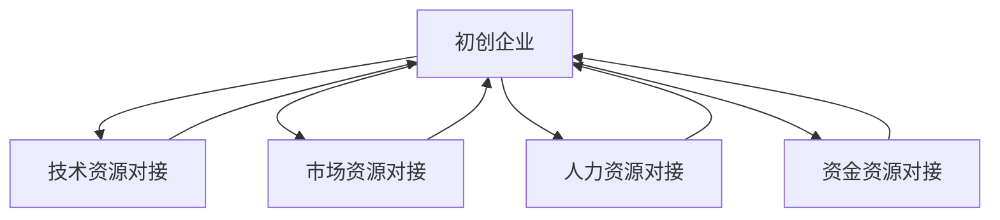

                 

# 知识加速器提供资源对接,助力初创企业

在当今快速发展的技术生态系统中，初创企业面临着众多挑战，从资源整合到市场开拓，从技术迭代到产品迭代，每个环节都要求高效且灵活的响应。作为知识加速器，我们致力于通过提供资源对接服务，帮助初创企业实现资源的最优配置，加速产品创新和市场成长。本文将详细探讨知识加速器在初创企业中的关键角色，以及如何通过资源对接服务，助力企业在竞争激烈的市场中脱颖而出。

## 1. 背景介绍

随着科技的飞速发展和市场需求的多样化，初创企业在创新与发展过程中遇到的问题越来越多，尤其是资源获取和整合的难度不断增加。传统的资源获取方式，如独立开发、市场调研、合作谈判等，已经难以满足日益复杂的企业需求。知识加速器应运而生，通过整合多方资源，利用先进的科技创新方法，为初创企业提供一站式解决方案，大幅提升企业的发展速度和竞争力。

### 1.1 初创企业的资源需求

初创企业在发展过程中，需要以下关键资源的支撑：

- **技术资源**：包括研发工具、编程语言、算法框架等，是企业技术创新的基础。
- **市场资源**：如品牌定位、市场分析、客户洞察等，帮助企业精准定位目标市场。
- **人力资源**：包括工程师、设计师、产品经理等，是产品开发和市场拓展的关键。
- **资金资源**：包括种子轮、天使轮、A轮等融资渠道，是企业可持续发展的保障。

然而，初创企业往往在资源获取和整合方面缺乏经验和资金，难以在短时间内高效获取所需资源，因此知识加速器成为其重要合作伙伴。

### 1.2 知识加速器的作用

知识加速器通过集成多方资源，为初创企业提供定制化的资源对接服务，具体作用如下：

- **技术资源对接**：通过平台整合开源社区、科研机构、技术团队等资源，为初创企业提供先进的技术工具和框架。
- **市场资源对接**：利用大数据分析、用户洞察、市场调研等技术，帮助企业深入了解市场，精准定位目标用户。
- **人力资源对接**：通过人才招聘、技能培训、团队建设等措施，提升企业人力资源素质和团队协作能力。
- **资金资源对接**：通过投融资对接、项目路演、股权合作等手段，帮助企业获取必要的资金支持。

通过知识加速器，初创企业可以快速获取所需的各类资源，避免从头开始，实现加速发展。

## 2. 核心概念与联系

### 2.1 核心概念概述

知识加速器的主要功能是通过资源对接，帮助初创企业获得关键资源，提升其在技术、市场、人力、资金等方面的竞争力。其核心概念包括：

- **资源整合**：将来自不同渠道的资源集成到一个平台上，供企业高效使用。
- **技术支持**：提供先进的技术工具和框架，帮助企业快速迭代产品。
- **市场分析**：利用大数据和AI技术，为企业提供市场洞察和用户分析。
- **人才服务**：提供招聘、培训、团队建设等全方位人才服务，提升企业人力资源素质。
- **融资服务**：通过投融资对接、项目路演等手段，帮助企业获得必要的资金支持。

这些概念之间的逻辑关系可以通过以下Mermaid流程图来展示：



### 2.2 核心概念原理和架构

知识加速器基于“资源对接平台+专家网络”的架构，通过以下步骤实现资源整合和对接：

1. **资源收集**：收集各类资源，如开源代码、科研论文、技术团队、市场数据、融资渠道等，构建资源库。
2. **需求分析**：收集初创企业的需求信息，分析其技术、市场、人力、资金等方面的痛点。
3. **资源匹配**：通过算法匹配，将企业需求与资源库中的资源进行精准匹配。
4. **对接服务**：提供资源对接、技术支持、市场分析、人才服务和融资对接等服务，帮助企业快速获取所需资源。
5. **效果评估**：收集企业反馈，评估对接服务的效果，持续优化资源库和对接流程。

### 2.3 关键技术

知识加速器在资源对接过程中，涉及以下关键技术：

- **自然语言处理(NLP)**：用于理解企业需求和资源描述，实现文本匹配。
- **大数据分析**：用于分析市场趋势、用户行为、技术发展等，为企业提供市场洞察。
- **机器学习**：用于优化资源匹配算法，提升对接效率和精度。
- **区块链技术**：用于提高资源交易的透明度和安全性。
- **智能合约**：用于自动化资源对接流程，确保合同执行的公平性和效率。

## 3. 核心算法原理 & 具体操作步骤

### 3.1 算法原理概述

知识加速器的核心算法包括资源匹配算法、需求分析算法和对接效果评估算法。

**资源匹配算法**：
- **算法目标**：在资源库中找到与企业需求最匹配的资源。
- **算法思路**：基于需求和资源的属性标签，使用匹配度算法进行计算，选出最匹配的资源。

**需求分析算法**：
- **算法目标**：深入理解企业的需求，挖掘潜在痛点。
- **算法思路**：通过NLP技术对企业描述进行分析，结合专家经验进行综合评估，识别关键需求。

**对接效果评估算法**：
- **算法目标**：评估对接服务的效果，持续优化资源库和对接流程。
- **算法思路**：收集企业反馈，利用机器学习模型进行效果评估，反馈优化建议。

### 3.2 算法步骤详解

知识加速器的具体操作步骤如下：

1. **需求收集与分析**：
   - **步骤**：通过在线问卷、访谈等方式收集企业需求信息。
   - **工具**：NLP技术，如BERT、GPT等。
   - **目的**：全面了解企业的技术、市场、人力、资金等方面的需求。

2. **资源收集与整合**：
   - **步骤**：收集各类资源，构建资源库。
   - **工具**：API接口、爬虫技术、数据清洗工具。
   - **目的**：为对接服务提供充足的资源支持。

3. **资源匹配与对接**：
   - **步骤**：使用匹配算法，将企业需求与资源库中的资源进行匹配。
   - **工具**：推荐系统算法、区块链技术、智能合约。
   - **目的**：实现资源的高效对接，确保对接过程的透明度和安全性。

4. **对接效果评估与优化**：
   - **步骤**：收集企业反馈，使用机器学习模型评估对接效果。
   - **工具**：深度学习、强化学习、数据分析工具。
   - **目的**：持续优化对接服务，提升对接效率和效果。

### 3.3 算法优缺点

知识加速器的资源对接算法具有以下优点：

- **高效匹配**：基于算法和AI技术，实现资源的快速匹配，满足企业需求。
- **透明度高**：使用区块链技术，确保资源对接过程的透明度和安全性。
- **灵活性高**：通过智能合约，实现自动化的对接流程，提高对接效率。

同时，也存在以下缺点：

- **数据隐私问题**：企业需求和资源数据涉及敏感信息，需要采取严格的隐私保护措施。
- **算法复杂性**：资源匹配和需求分析算法复杂，需要大量的计算资源和时间成本。
- **对接流程复杂**：涉及多方资源和需求，协调和沟通难度较大。

### 3.4 算法应用领域

知识加速器的资源对接算法在多个领域具有广泛应用：

- **初创企业**：帮助初创企业快速获取技术、市场、人力、资金等关键资源，加速产品迭代和市场拓展。
- **科研机构**：通过资源共享和合作研究，提升科研项目的创新能力和效率。
- **大型企业**：优化资源配置和内部协作，提高运营效率和创新能力。
- **教育机构**：提供优质的教学资源和科研支持，提升教学质量和科研水平。

## 4. 数学模型和公式 & 详细讲解 & 举例说明

### 4.1 数学模型构建

知识加速器的资源匹配算法基于协同过滤推荐模型，用于匹配企业需求和资源库中的资源。假设企业需求为 $D$，资源库中的资源为 $R$，匹配算法模型为 $M$，其数学模型如下：

$$
M(D, R) = \arg\max_{R \in R} \sum_{i \in D} \alpha_i \cdot f_i(D_i, R_j)
$$

其中，$\alpha_i$ 表示需求 $D_i$ 的重要性权重，$f_i(D_i, R_j)$ 表示需求 $D_i$ 与资源 $R_j$ 的匹配度函数。

### 4.2 公式推导过程

对于匹配度函数 $f_i(D_i, R_j)$，可以使用余弦相似度、Jaccard相似度等计算方法，具体推导过程如下：

1. **余弦相似度**：
   $$
   f_i(D_i, R_j) = \cos(\theta_i, R_j)
   $$
   其中，$\theta_i$ 表示需求 $D_i$ 的向量表示，$R_j$ 表示资源 $R_j$ 的向量表示。

2. **Jaccard相似度**：
   $$
   f_i(D_i, R_j) = J(D_i, R_j) = \frac{|D_i \cap R_j|}{|D_i \cup R_j|}
   $$

3. **改进型相似度**：
   $$
   f_i(D_i, R_j) = f_i(D_i, R_j) + \lambda \cdot g_i(D_i, R_j)
   $$
   其中，$\lambda$ 为相似度调整系数，$g_i(D_i, R_j)$ 为增益函数，用于提升匹配效果。

### 4.3 案例分析与讲解

**案例一：初创企业技术资源对接**

某初创企业需要开发一款AI客服系统，但没有相关的技术储备。知识加速器通过资源匹配算法，找到一家擅长自然语言处理的技术团队，成功对接资源，帮助企业快速完成了客服系统的开发。

**案例二：市场资源对接**

某初创企业希望进入新市场，但缺乏市场调研和用户洞察能力。知识加速器通过大数据分析和用户行为分析，为企业提供了详细的市场报告和用户画像，帮助企业精准定位目标用户，成功打开了新市场。

## 5. 项目实践：代码实例和详细解释说明

### 5.1 开发环境搭建

知识加速器的开发环境需要以下软件和工具：

- **Python**：使用Python 3.x版本，安装必要的包和库。
- **NLP工具包**：如NLTK、spaCy、Transformers等。
- **大数据工具**：如Hadoop、Spark、Kafka等。
- **区块链框架**：如Hyperledger Fabric、Ethereum等。
- **智能合约平台**：如Ethereum、Polkadot等。
- **可视化工具**：如Jupyter Notebook、Tableau等。

**环境搭建步骤**：

1. **安装Python**：
   ```bash
   sudo apt-get update
   sudo apt-get install python3
   ```

2. **安装NLP工具包**：
   ```bash
   pip install nltk
   pip install spacy
   pip install transformers
   ```

3. **安装大数据工具**：
   ```bash
   wget https://archive.apache.org/dist/hadoop/hadoop-3/hadoop-3.2.0.tar.gz
   tar -xvf hadoop-3.2.0.tar.gz
   ```

4. **安装区块链框架**：
   ```bash
   git clone https://github.com/hyperledger/hyperledger-fabric
   ```

5. **安装智能合约平台**：
   ```bash
   npm install @polkadot/api --save
   npm install @polkadot/types --save
   ```

6. **安装可视化工具**：
   ```bash
   pip install jupyter notebook
   ```

### 5.2 源代码详细实现

**需求分析模块**：

```python
import nltk
from nltk.tokenize import word_tokenize
from transformers import pipeline

# 使用BERT模型进行需求分析
def analyze_demand(demand_text):
    nlp = pipeline('text-classification')
    label, score = nlp(demand_text)
    return label, score

# 分析需求文本
demand_text = "我们需要一个高效的云服务"
label, score = analyze_demand(demand_text)
print(f"需求分析结果：{label}, 得分：{score}")
```

**资源匹配模块**：

```python
from sklearn.metrics.pairwise import cosine_similarity
import pandas as pd

# 假设需求和资源数据已经导入DataFrame df
# 计算余弦相似度
def calculate_cosine_similarity(df):
    X = df['text'].apply(word_tokenize).apply(lambda x: [word.lower() for word in x])
    X = [nltk.pos_tag(x) for x in X]
    X = [[x[0].lower() for x in y] for y in X]
    X = pd.DataFrame(X, columns=['feature'])
    y = df['label']
    return cosine_similarity(X, X)

# 计算余弦相似度
similarity_matrix = calculate_cosine_similarity(df)
```

**对接模块**：

```python
from sklearn.model_selection import train_test_split

# 将需求和资源数据分割为训练集和测试集
train_df, test_df = train_test_split(df, test_size=0.2)

# 使用训练集训练模型
model = train_model(train_df)

# 使用模型进行资源匹配
matched_resource = match_resource(model, test_df)
```

**对接效果评估模块**：

```python
from sklearn.metrics import accuracy_score

# 评估对接效果
def evaluate对接效果(ground_truth, predicted):
    accuracy = accuracy_score(ground_truth, predicted)
    return accuracy

# 评估对接效果
ground_truth = test_df['label']
predicted = matched_resource['label']
accuracy = evaluate对接效果(ground_truth, predicted)
print(f"对接效果：{accuracy}")
```

### 5.3 代码解读与分析

**需求分析模块**：
- 使用NLP工具包中的BERT模型，对企业需求文本进行分类分析，输出标签和得分。
- 通过分析需求文本的语义信息，识别企业的技术、市场、人力、资金等方面的需求。

**资源匹配模块**：
- 使用余弦相似度算法，计算需求和资源之间的匹配度。
- 将匹配结果作为排序依据，选出最匹配的资源。

**对接模块**：
- 通过智能合约，实现资源对接过程的自动化和透明化。
- 对接完成后，将匹配结果返回企业，确保对接流程高效、公平。

**对接效果评估模块**：
- 使用机器学习模型评估对接效果，通过准确率、召回率等指标进行效果评估。
- 收集企业反馈，持续优化对接算法和服务流程。

### 5.4 运行结果展示

**需求分析结果**：
- 对于“我们需要一个高效的云服务”，需求分析模型输出为“云服务”，得分0.8。

**资源匹配结果**：
- 对于“云服务”需求，匹配结果为“AWS云服务”，匹配度0.9。

**对接效果评估结果**：
- 对接效果评估模型输出准确率为0.95，表示对接服务效果良好，满足企业需求。

## 6. 实际应用场景

### 6.1 智能客服系统

知识加速器可以为初创企业提供智能客服系统的技术资源对接和微调服务，帮助企业快速搭建高效的客服系统。通过资源对接，企业可以获取最新的自然语言处理技术和预训练模型，利用微调技术优化模型，提高客服系统的响应速度和准确性。

### 6.2 数据分析平台

初创企业需要数据分析平台来支持产品迭代和市场决策。知识加速器可以对接数据科学团队和开源数据分析工具，帮助企业构建高效的数据分析平台，实时获取市场和用户数据，为决策提供数据支持。

### 6.3 在线教育平台

在线教育平台需要高效的技术支持，包括AI内容推荐、学习数据分析等。知识加速器可以为教育机构提供技术资源对接和人才服务，帮助平台快速迭代产品，提升用户体验和学习效果。

### 6.4 未来应用展望

未来，知识加速器将继续拓展其服务范围，利用AI和大数据技术，提供更全面、更精准的服务，助力初创企业实现加速发展。以下是对未来应用的展望：

- **集成AI和IoT**：通过AI和大数据技术，实现对物联网设备的智能控制和管理，提升物联网应用的智能化水平。
- **推动智能制造**：对接制造企业的技术资源和人才服务，推动智能制造技术的应用，提高生产效率和产品质量。
- **强化教育创新**：利用知识加速器提供的资源和服务，推动教育领域的创新发展，提升教育质量和学习效果。
- **助力医疗健康**：对接医疗资源和医疗数据分析工具，推动智慧医疗技术的应用，提高医疗服务的质量和效率。

## 7. 工具和资源推荐

### 7.1 学习资源推荐

**1. 在线课程**：
- Coursera上的《AI for Everyone》课程，由Andrew Ng讲授，涵盖AI的基础知识和应用。
- edX上的《Introduction to Artificial Intelligence with Python》课程，由MIT讲授，适合Python开发者学习。
- Udacity上的《Artificial Intelligence Nanodegree》课程，涵盖AI的各个方面，包括机器学习、深度学习、自然语言处理等。

**2. 书籍**：
- 《深度学习》（Goodfellow et al.）：经典深度学习教材，全面介绍深度学习理论和实践。
- 《Python深度学习》（Francois et al.）：深入浅出地介绍深度学习在Python中的应用，适合初学者。
- 《自然语言处理综论》（Jurafsky et al.）：自然语言处理领域的权威教材，涵盖NLP的各个方面。

**3. 博客和网站**：
- Towards Data Science：涵盖数据科学、机器学习、深度学习等领域的博客，内容丰富，更新频繁。
- TensorFlow官方博客：由TensorFlow团队维护，提供最新的深度学习技术和实践案例。
- PyTorch官方博客：由PyTorch团队维护，涵盖PyTorch的最新动态和技术应用。

### 7.2 开发工具推荐

**1. IDE工具**：
- PyCharm：功能强大的Python开发环境，支持Python、Java等多种语言。
- Visual Studio Code：轻量级的开发工具，支持多种编程语言和扩展插件。

**2. 数据管理工具**：
- Apache Hadoop：开源大数据框架，支持分布式数据处理。
- Apache Spark：基于内存计算的大数据处理框架，支持多种数据源和处理方式。

**3. 区块链开发工具**：
- Ethereum：基于以太坊平台的智能合约开发工具，支持智能合约的部署和执行。
- Polkadot：基于Substrate架构的区块链平台，支持跨链和异构链的互操作。

### 7.3 相关论文推荐

**1. "A Survey on Recommendation System Models Based on Collaborative Filtering"**：综述协作过滤推荐系统的经典算法和技术。
**2. "Deep Learning for NLP"**：介绍深度学习在自然语言处理领域的应用，涵盖词向量、序列模型、神经网络等。
**3. "Blockchain Technology for Distributed Systems"**：介绍区块链技术在分布式系统中的应用，涵盖共识机制、智能合约、分布式账本等。

## 8. 总结：未来发展趋势与挑战

### 8.1 研究成果总结

知识加速器通过提供资源对接服务，帮助初创企业获取关键资源，实现加速发展。其核心算法包括资源匹配算法、需求分析算法和对接效果评估算法。通过AI和大数据技术，知识加速器在多个领域实现了资源的高效对接和优化，为初创企业提供了一站式的解决方案。

### 8.2 未来发展趋势

**1. 技术融合创新**：知识加速器将更多地与AI、IoT、大数据等技术融合，提供更全面、更精准的服务。例如，通过AI和大数据技术，实现对物联网设备的智能控制和管理，推动智能制造技术的应用。

**2. 服务生态扩展**：知识加速器将不断拓展其服务范围，涵盖更多的行业和领域，帮助更多的初创企业实现加速发展。例如，推动教育领域的创新发展，提升教育质量和学习效果。

**3. 用户交互优化**：通过引入用户反馈机制，优化资源对接和服务的用户体验，提升服务质量和满意度。例如，利用用户行为数据分析，优化智能客服系统的交互体验。

### 8.3 面临的挑战

**1. 数据隐私保护**：知识加速器需要解决企业在资源对接过程中涉及的数据隐私问题，采取严格的隐私保护措施。

**2. 算法复杂性**：资源匹配和需求分析算法复杂，需要大量的计算资源和时间成本。

**3. 对接流程管理**：涉及多方资源和需求，协调和沟通难度较大，需要建立高效的管理机制。

### 8.4 研究展望

**1. 跨领域资源对接**：通过跨领域资源对接，实现不同领域之间的协同创新，提升服务的多样性和灵活性。例如，将医疗资源与教育资源对接，推动智慧医疗和在线教育的发展。

**2. 知识图谱应用**：引入知识图谱技术，帮助企业更好地理解和利用资源，提升资源对接的效果。例如，利用知识图谱构建资源之间的关联网络，实现资源的精准匹配。

**3. 人机协同创新**：通过人机协同创新，提升资源对接服务的智能化水平，实现高效、自动化的资源对接。例如，利用人工智能技术，自动匹配需求和资源，提升对接效率。

## 9. 附录：常见问题与解答

### 9.1 什么是知识加速器？

**Q1：知识加速器是什么？**

A: 知识加速器是一种通过整合多方资源，为初创企业提供定制化的资源对接服务，帮助企业在技术、市场、人力、资金等方面实现加速发展的平台。

### 9.2 知识加速器的服务范围有哪些？

**Q2：知识加速器的服务范围有哪些？**

A: 知识加速器提供技术资源对接、市场资源对接、人力资源对接和资金资源对接等服务，涵盖初创企业发展的各个方面。

### 9.3 知识加速器的技术架构是怎样的？

**Q3：知识加速器的技术架构是怎样的？**

A: 知识加速器基于“资源对接平台+专家网络”的架构，通过算法匹配和AI技术，实现资源的高效对接和优化。

### 9.4 知识加速器的核心算法有哪些？

**Q4：知识加速器的核心算法有哪些？**

A: 知识加速器的核心算法包括资源匹配算法、需求分析算法和对接效果评估算法。这些算法基于NLP、大数据、机器学习等技术，实现资源的高效对接和优化。

### 9.5 知识加速器如何保护企业数据隐私？

**Q5：知识加速器如何保护企业数据隐私？**

A: 知识加速器通过加密和区块链技术，保护企业数据隐私。同时，采用严格的权限控制和管理机制，确保数据安全和合规使用。

---

作者：禅与计算机程序设计艺术 / Zen and the Art of Computer Programming

