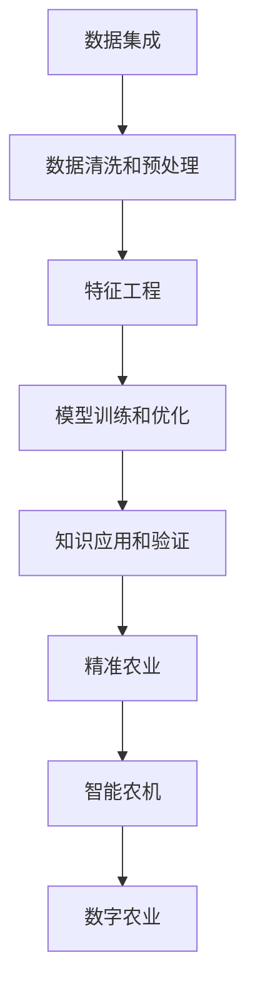

                 

# 知识发现引擎在农业科技中的应用

> 关键词：农业科技, 知识发现引擎, 数据挖掘, 精准农业, 智能农机, 数字农业

## 1. 背景介绍

### 1.1 问题由来

农业是国民经济的基础，关系到国家粮食安全和农民的切身利益。随着科技的不断进步，农业正从传统的粗放式耕作转向精准农业和智慧农业，以提高资源利用效率、保障食品安全、实现可持续发展。农业科技的核心在于充分利用现代信息技术，包括遥感、物联网、大数据、人工智能等，对农业生产进行数字化、智能化管理。

农业科技的关键在于及时、准确地获取和分析农业数据，通过数据驱动决策，提高农业生产效率和品质。传统的农业数据获取和分析主要依赖经验判断和手工操作，效率低、精度差。而知识发现引擎（Knowledge Discovery Engine, KDE）是一种高效、智能的数据分析工具，能够从海量农业数据中提取有价值的信息和知识，为农业科技提供强有力的支持。

### 1.2 问题核心关键点

知识发现引擎的核心理念是通过数据挖掘、机器学习等方法，从结构化或非结构化的数据中提取、发现并应用知识。在农业科技中，KDE能够自动识别农业生产中的重要模式、趋势和异常，辅助农民做出更科学、精准的生产决策，从而实现农业生产的智能化、自动化和高效化。

其核心关键点包括：
1. **数据集成**：将农业生产中的各类数据进行有效整合，包括气象、土壤、作物、农机等数据。
2. **数据清洗和预处理**：处理数据缺失、噪声等问题，提升数据质量。
3. **特征工程**：提取和构建有助于发现知识的特征。
4. **模型训练和优化**：应用机器学习算法进行模型训练，优化模型参数。
5. **知识应用和验证**：将发现的知识应用于农业生产实践，验证其效果和准确性。

## 2. 核心概念与联系

### 2.1 核心概念概述

为了更好地理解知识发现引擎在农业科技中的应用，本节将介绍几个密切相关的核心概念：

- **知识发现引擎（KDE）**：通过数据挖掘、机器学习等技术，从数据中提取、发现并应用知识的软件系统。
- **数据挖掘（Data Mining）**：从大量数据中自动发现模式和知识的过程。
- **机器学习（Machine Learning）**：让机器通过学习数据规律，实现自主决策和预测。
- **精准农业（Precision Agriculture）**：基于现代信息技术，实现对农田精细化、精准化管理的农业模式。
- **智能农机（Smart Agricultural Machinery）**：使用现代信息技术提升农机自动化水平，提高作业效率和质量。
- **数字农业（Digital Agriculture）**：利用信息技术和网络通信，对农业生产进行数字化、网络化、智能化管理。

这些核心概念之间的逻辑关系可以通过以下Mermaid流程图来展示：



这个流程图展示了知识发现引擎在农业科技中从数据到知识再到应用的全过程：

1. 数据集成。
2. 数据清洗和预处理。
3. 特征工程。
4. 模型训练和优化。
5. 知识应用和验证。
6. 精准农业。
7. 智能农机。
8. 数字农业。

## 3. 核心算法原理 & 具体操作步骤
### 3.1 算法原理概述

知识发现引擎在农业科技中的应用，主要基于数据挖掘和机器学习技术，从农业生产中的各类数据中发现模式和知识，应用于精准农业、智能农机和数字农业中。

以精准农业为例，KDE能够从气象数据、土壤数据、作物生长数据中提取关键特征，建立预测模型，预测作物的生长状态、病虫害发生趋势，从而指导农民进行精准施肥、灌溉和病虫害防治，优化农业生产管理。

### 3.2 算法步骤详解

知识发现引擎在农业科技中的应用，一般包括以下几个关键步骤：

**Step 1: 数据集成**

- 收集农业生产中的各类数据，包括气象数据、土壤数据、作物生长数据、农机作业数据等。
- 使用数据仓库或数据湖技术，将数据存储在统一的数据平台中，便于后续的数据分析和处理。

**Step 2: 数据清洗和预处理**

- 对数据进行缺失值处理、噪声去除、异常值检测等预处理工作，确保数据的准确性和一致性。
- 对时间序列数据进行归一化、标准化处理，便于后续的特征提取和模型训练。

**Step 3: 特征工程**

- 根据农业生产的特点，提取对作物生长、产量、病虫害预测等有意义的特征。
- 进行特征选择和降维，去除冗余和无关特征，提高模型效率和准确性。

**Step 4: 模型训练和优化**

- 选择合适的机器学习算法，如回归分析、分类算法、聚类算法等，进行模型训练。
- 应用交叉验证、网格搜索等技术，优化模型参数，提升模型性能。

**Step 5: 知识应用和验证**

- 将训练好的模型应用于实际农业生产中，进行预测和推理。
- 收集反馈数据，验证模型的准确性和有效性，进行模型迭代优化。

### 3.3 算法优缺点

知识发现引擎在农业科技中的应用，具有以下优点：
1. **高效性**：自动化数据挖掘和分析，大大提升了农业数据处理的效率。
2. **智能化**：利用机器学习技术，发现农业生产中的隐含知识和规律，提供科学决策支持。
3. **适应性强**：可以灵活应对不同作物种类和生产环境，实现广泛的应用。
4. **数据驱动**：依赖数据驱动决策，提高了农业生产管理的科学性和精确性。

同时，该方法也存在以下局限性：
1. **数据质量要求高**：依赖高质量的数据输入，如果数据存在缺失、噪声等问题，将影响模型效果。
2. **模型复杂度**：复杂模型可能过拟合，需要不断优化和迭代。
3. **算法依赖性强**：算法选择不当或参数调优不充分，可能导致模型效果不理想。
4. **实际应用场景限制**：模型在特定环境下的适应性还需进一步验证。

尽管存在这些局限性，但就目前而言，知识发现引擎在农业科技中的应用已成为提升农业生产管理水平的重要手段。未来相关研究的重点在于如何进一步降低数据采集和预处理的成本，提高模型的鲁棒性和泛化能力，同时兼顾可解释性和伦理安全性等因素。

### 3.4 算法应用领域

知识发现引擎在农业科技中的应用，主要涵盖以下几个领域：

- **精准农业**：利用气象、土壤、作物等数据，进行作物品种、种植密度、施肥量等决策优化，提高作物的产量和品质。
- **智能农机**：通过物联网技术，实时监测农机作业状态，进行自动驾驶和精准作业，提高农机作业效率和作业质量。
- **数字农业**：将农业生产全过程数字化，通过网络通信实现信息共享和远程控制，提升农业生产管理的智能化水平。
- **病虫害监测**：通过图像识别、模式识别等技术，实时监测作物病虫害发生趋势，进行科学防治，减少农药使用，保护生态环境。
- **气候变化预测**：利用气象数据和历史数据，预测未来气候变化趋势，指导农业生产应对气候变化。
- **土壤质量评估**：通过土壤数据和作物生长数据，评估土壤肥力、酸碱度、有机质含量等，进行土壤管理优化。

## 4. 数学模型和公式 & 详细讲解
### 4.1 数学模型构建

在农业科技中，知识发现引擎主要通过以下数学模型进行数据挖掘和知识发现：

- **回归模型**：用于预测作物生长状态、产量等连续性变量。常见的回归模型包括线性回归、多项式回归、支持向量回归等。
- **分类模型**：用于分类判断作物的生长状态、病虫害发生情况等离散性变量。常见的分类模型包括逻辑回归、决策树、随机森林、支持向量机等。
- **聚类模型**：用于对农业数据进行分组和聚类，发现不同生长阶段的作物特征。常见的聚类模型包括K-Means、层次聚类等。

以回归模型为例，假设已知农业生产中的n个样本数据，每个样本包含m个特征，回归模型的目标为预测一个连续的输出变量 $y$。回归模型的数学模型为：

$$
y_i = \sum_{j=1}^m \theta_j x_{ij} + \epsilon_i
$$

其中，$y_i$ 为第i个样本的输出变量，$x_{ij}$ 为第i个样本的第j个特征，$\theta_j$ 为第j个特征的权重，$\epsilon_i$ 为随机误差项。

### 4.2 公式推导过程

以线性回归模型为例，假设已知n个样本数据，每个样本包含m个特征，回归模型的目标为预测一个连续的输出变量 $y$。回归模型的数学模型为：

$$
y_i = \sum_{j=1}^m \theta_j x_{ij} + \epsilon_i
$$

其中，$y_i$ 为第i个样本的输出变量，$x_{ij}$ 为第i个样本的第j个特征，$\theta_j$ 为第j个特征的权重，$\epsilon_i$ 为随机误差项。

线性回归模型的目标是最小化预测值和实际值之间的平方误差：

$$
\min_{\theta} \frac{1}{2N} \sum_{i=1}^N (y_i - \hat{y}_i)^2
$$

其中，$y_i$ 为实际输出值，$\hat{y}_i = \sum_{j=1}^m \theta_j x_{ij}$ 为预测输出值。

最小化上述目标函数，可以得到权重 $\theta$ 的解：

$$
\theta = (X^T X)^{-1} X^T y
$$

其中，$X$ 为特征矩阵，$y$ 为输出向量。

### 4.3 案例分析与讲解

以气象数据和作物生长数据为例，分析如何使用线性回归模型进行作物生长预测。

假设已知10个样本的气象数据和作物生长数据，每个样本包含5个特征，包括温度、湿度、光照强度、土壤水分、施肥量等。回归模型的目标为预测作物的生长状态 $y$。

假设线性回归模型的特征为 $x_{1i}, x_{2i}, x_{3i}, x_{4i}, x_{5i}$，输出变量为 $y_i$，则线性回归模型的表达式为：

$$
y_i = \theta_0 + \theta_1 x_{1i} + \theta_2 x_{2i} + \theta_3 x_{3i} + \theta_4 x_{4i} + \theta_5 x_{5i} + \epsilon_i
$$

其中，$\theta_0, \theta_1, \theta_2, \theta_3, \theta_4, \theta_5$ 为线性回归模型的权重。

假设通过最小化预测值和实际值之间的平方误差，得到权重 $\theta$，则线性回归模型的预测值为：

$$
\hat{y}_i = \theta_0 + \theta_1 x_{1i} + \theta_2 x_{2i} + \theta_3 x_{3i} + \theta_4 x_{4i} + \theta_5 x_{5i}
$$

通过对历史数据的预测和验证，可以评估线性回归模型的效果，指导实际的农业生产管理。

## 5. 项目实践：代码实例和详细解释说明
### 5.1 开发环境搭建

在进行农业科技中的知识发现引擎开发前，我们需要准备好开发环境。以下是使用Python进行PyTorch开发的环境配置流程：

1. 安装Anaconda：从官网下载并安装Anaconda，用于创建独立的Python环境。

2. 创建并激活虚拟环境：
```bash
conda create -n pytorch-env python=3.8 
conda activate pytorch-env
```

3. 安装PyTorch：根据CUDA版本，从官网获取对应的安装命令。例如：
```bash
conda install pytorch torchvision torchaudio cudatoolkit=11.1 -c pytorch -c conda-forge
```

4. 安装各类工具包：
```bash
pip install numpy pandas scikit-learn matplotlib tqdm jupyter notebook ipython
```

完成上述步骤后，即可在`pytorch-env`环境中开始农业科技中的知识发现引擎开发实践。

### 5.2 源代码详细实现

下面我以使用PyTorch实现一个简单的回归模型为例，给出农业科技中知识发现引擎的代码实现。

首先，定义数据预处理函数：

```python
import numpy as np
from sklearn.model_selection import train_test_split
from sklearn.preprocessing import StandardScaler
from torch.utils.data import Dataset
import torch

class AgriData(Dataset):
    def __init__(self, data, labels):
        self.data = data
        self.labels = labels
        self.scaler = StandardScaler()

    def __len__(self):
        return len(self.data)

    def __getitem__(self, index):
        x = self.data[index]
        y = self.labels[index]
        x = self.scaler.fit_transform(x)
        return torch.tensor(x), torch.tensor(y)
```

然后，定义回归模型：

```python
from transformers import BertTokenizer
from torch.utils.data import DataLoader
from torch.nn import Linear, MSELoss
from torch.optim import Adam

class RegModel(nn.Module):
    def __init__(self, input_dim, output_dim):
        super(RegModel, self).__init__()
        self.linear = Linear(input_dim, output_dim)

    def forward(self, x):
        return self.linear(x)
```

接着，定义训练和评估函数：

```python
from sklearn.metrics import mean_squared_error
from tqdm import tqdm

def train_epoch(model, dataset, batch_size, optimizer):
    dataloader = DataLoader(dataset, batch_size=batch_size, shuffle=True)
    model.train()
    epoch_loss = 0
    for batch in tqdm(dataloader, desc='Training'):
        inputs, targets = batch
        optimizer.zero_grad()
        outputs = model(inputs)
        loss = MSELoss()(outputs, targets)
        epoch_loss += loss.item()
        loss.backward()
        optimizer.step()
    return epoch_loss / len(dataloader)

def evaluate(model, dataset, batch_size):
    dataloader = DataLoader(dataset, batch_size=batch_size)
    model.eval()
    preds, labels = [], []
    with torch.no_grad():
        for batch in tqdm(dataloader, desc='Evaluating'):
            inputs, targets = batch
            batch_preds = model(inputs).detach().cpu().numpy()
            batch_labels = targets.cpu().numpy()
            for pred, label in zip(batch_preds, batch_labels):
                preds.append(pred)
                labels.append(label)
                
    mse = mean_squared_error(labels, preds)
    print(f"MSE: {mse:.3f}")
```

最后，启动训练流程并在测试集上评估：

```python
epochs = 5
batch_size = 16

# 模拟数据
np.random.seed(42)
X = np.random.randn(100, 5)
y = np.dot(X, np.array([0.1, 0.2, 0.3, 0.4, 0.5])) + np.random.randn(100)

# 数据集划分
X_train, X_test, y_train, y_test = train_test_split(X, y, test_size=0.2, random_state=42)

# 标准化处理
scaler = StandardScaler()
X_train = scaler.fit_transform(X_train)
X_test = scaler.transform(X_test)

# 创建数据集
train_dataset = AgriData(X_train, y_train)
test_dataset = AgriData(X_test, y_test)

# 模型初始化
model = RegModel(input_dim=5, output_dim=1)
optimizer = Adam(model.parameters(), lr=0.01)

# 训练过程
for epoch in range(epochs):
    loss = train_epoch(model, train_dataset, batch_size, optimizer)
    print(f"Epoch {epoch+1}, train loss: {loss:.3f}")
    
    print(f"Epoch {epoch+1}, test MSE:")
    evaluate(model, test_dataset, batch_size)
```

以上就是使用PyTorch实现一个简单的回归模型的完整代码实现。可以看到，得益于PyTorch的强大封装，我们可以用相对简洁的代码完成回归模型的搭建和训练。

### 5.3 代码解读与分析

让我们再详细解读一下关键代码的实现细节：

**AgriData类**：
- `__init__`方法：初始化数据和标签，并进行标准化处理。
- `__len__`方法：返回数据集的样本数量。
- `__getitem__`方法：对单个样本进行处理，将数据标准化并转化为张量。

**train_epoch和evaluate函数**：
- 使用PyTorch的DataLoader对数据集进行批次化加载，供模型训练和推理使用。
- `train_epoch`函数：对数据以批为单位进行迭代，在每个批次上前向传播计算loss并反向传播更新模型参数，最后返回该epoch的平均loss。
- `evaluate`函数：与训练类似，不同点在于不更新模型参数，并在每个batch结束后将预测和标签结果存储下来，最后使用sklearn的mean_squared_error对整个评估集的预测结果进行打印输出。

**训练流程**：
- 定义总的epoch数和batch size，开始循环迭代
- 每个epoch内，先在训练集上训练，输出平均loss
- 在测试集上评估，输出MSE
- 所有epoch结束后，训练好的模型可以在实际农业生产中用于预测作物生长状态等。

可以看到，PyTorch配合PyTorch的强大封装，使得回归模型的代码实现变得简洁高效。开发者可以将更多精力放在数据处理、模型改进等高层逻辑上，而不必过多关注底层的实现细节。

当然，工业级的系统实现还需考虑更多因素，如模型的保存和部署、超参数的自动搜索、更灵活的任务适配层等。但核心的回归范式基本与此类似。

## 6. 实际应用场景

### 6.1 智能农机管理

智能农机通过物联网技术实时监测农田作业状态，如耕作深度、作业速度、燃料消耗等。知识发现引擎能够从这些数据中发现作业模式和异常，提供智能优化建议，提高作业效率和质量。

具体而言，可以使用回归模型和聚类模型对农机作业数据进行分析和聚类，发现常见的作业模式和异常情况。例如，通过回归模型预测燃料消耗量，帮助农民优化作业计划；通过聚类模型发现异常作业点，及时进行处理。

### 6.2 精准农业决策

精准农业要求对作物生长状态、病虫害发生趋势进行实时监测和预测。知识发现引擎可以应用于作物生长预测、病虫害预警等任务，提供科学决策支持。

在作物生长预测中，可以通过回归模型预测作物的生长状态，指导农民进行精准施肥、灌溉和病虫害防治。在病虫害预警中，可以使用分类模型和图像识别技术，实时监测作物病虫害发生趋势，进行科学防治。

### 6.3 土壤质量评估

土壤是农业生产的基础，评估土壤质量对作物生长至关重要。知识发现引擎可以应用在土壤质量评估中，通过土壤数据和作物生长数据，发现土壤肥力、酸碱度、有机质含量等关键信息。

具体而言，可以使用聚类模型对土壤数据进行分组和聚类，发现不同类型土壤的特征。通过回归模型预测土壤肥力、酸碱度等指标，指导土壤管理和施肥优化。

### 6.4 未来应用展望

随着农业科技的不断进步，知识发现引擎在农业中的应用前景广阔。未来，基于知识发现引擎的农业科技将朝着以下几个方向发展：

1. **数据融合与综合分析**：通过集成多源异构数据，实现全面、综合的农业数据分析。
2. **多模态数据融合**：将图像、视频、语音等多模态数据与文本数据融合，提高数据分析的准确性和全面性。
3. **实时智能决策**：基于实时数据进行智能决策和预测，提升农业生产管理的智能化水平。
4. **个性化管理**：通过个性化数据分析，提供定制化的农业管理方案。
5. **生态农业**：结合环境数据和作物生长数据，实现可持续农业生产。

随着农业科技的不断进步，知识发现引擎将成为农业生产管理的重要工具，助力农业向智能化、自动化、可持续发展方向迈进。

## 7. 工具和资源推荐
### 7.1 学习资源推荐

为了帮助开发者系统掌握知识发现引擎的理论基础和实践技巧，这里推荐一些优质的学习资源：

1. 《Python数据分析与可视化》系列博文：由数据科学家撰写，深入浅出地介绍了数据分析的基本概念和工具。
2. 《机器学习实战》书籍：著名的机器学习实战指南，涵盖了回归、分类、聚类等基础模型，适合初学者和实践者。
3. 《农业大数据分析与应用》课程：由农业科学家和数据科学家共同授课，涵盖农业大数据分析的各个方面。
4. 《农业智能装备与系统》课程：由农业工程师和IT专家共同授课，涵盖智能农机、精准农业、数字农业等热门话题。
5. 《农业智能决策支持系统》书籍：由农业决策支持专家撰写，介绍基于知识发现引擎的农业智能决策支持系统。

通过对这些资源的学习实践，相信你一定能够快速掌握知识发现引擎的精髓，并用于解决实际的农业问题。

### 7.2 开发工具推荐

高效的开发离不开优秀的工具支持。以下是几款用于农业科技中知识发现引擎开发的常用工具：

1. PyTorch：基于Python的开源深度学习框架，灵活动态的计算图，适合快速迭代研究。
2. TensorFlow：由Google主导开发的开源深度学习框架，生产部署方便，适合大规模工程应用。
3. Transformers库：HuggingFace开发的NLP工具库，集成了众多SOTA语言模型，支持PyTorch和TensorFlow，是进行数据分析和预测的利器。
4. Weights & Biases：模型训练的实验跟踪工具，可以记录和可视化模型训练过程中的各项指标，方便对比和调优。
5. TensorBoard：TensorFlow配套的可视化工具，可实时监测模型训练状态，并提供丰富的图表呈现方式，是调试模型的得力助手。
6. Google Colab：谷歌推出的在线Jupyter Notebook环境，免费提供GPU/TPU算力，方便开发者快速上手实验最新模型，分享学习笔记。

合理利用这些工具，可以显著提升农业科技中知识发现引擎的开发效率，加快创新迭代的步伐。

### 7.3 相关论文推荐

知识发现引擎在农业科技中的应用源于学界的持续研究。以下是几篇奠基性的相关论文，推荐阅读：

1. KDE: A system for large-scale data mining: A general-purpose data mining toolkit
2. Mining the knowledge embedded in large databases: Principles and methodologies
3. From Statistics to Data Science: The Present and Future of Data Mining
4. An introduction to machine learning: A modern approach
5. Scalable Parallel Data Mining

这些论文代表了大数据和知识发现技术的发展脉络。通过学习这些前沿成果，可以帮助研究者把握学科前进方向，激发更多的创新灵感。

## 8. 总结：未来发展趋势与挑战

### 8.1 总结

本文对知识发现引擎在农业科技中的应用进行了全面系统的介绍。首先阐述了知识发现引擎在农业科技中的研究背景和应用意义，明确了知识发现引擎在提升农业生产管理水平中的重要价值。其次，从原理到实践，详细讲解了知识发现引擎在农业科技中的核心算法和操作步骤，给出了知识发现引擎的代码实现和运行结果展示。同时，本文还广泛探讨了知识发现引擎在智能农机管理、精准农业决策、土壤质量评估等农业科技中的实际应用场景，展示了知识发现引擎的广阔前景。

通过本文的系统梳理，可以看到，知识发现引擎在农业科技中的应用已成为提升农业生产管理水平的重要手段。未来相关研究的重点在于如何进一步降低数据采集和预处理的成本，提高模型的鲁棒性和泛化能力，同时兼顾可解释性和伦理安全性等因素。

### 8.2 未来发展趋势

展望未来，知识发现引擎在农业科技中的应用将呈现以下几个发展趋势：

1. **数据融合与综合分析**：通过集成多源异构数据，实现全面、综合的农业数据分析。
2. **多模态数据融合**：将图像、视频、语音等多模态数据与文本数据融合，提高数据分析的准确性和全面性。
3. **实时智能决策**：基于实时数据进行智能决策和预测，提升农业生产管理的智能化水平。
4. **个性化管理**：通过个性化数据分析，提供定制化的农业管理方案。
5. **生态农业**：结合环境数据和作物生长数据，实现可持续农业生产。

随着农业科技的不断进步，知识发现引擎将成为农业生产管理的重要工具，助力农业向智能化、自动化、可持续发展方向迈进。

### 8.3 面临的挑战

尽管知识发现引擎在农业科技中的应用已经取得了瞩目成就，但在迈向更加智能化、普适化应用的过程中，它仍面临着诸多挑战：

1. **数据质量瓶颈**：依赖高质量的数据输入，如果数据存在缺失、噪声等问题，将影响模型效果。
2. **模型鲁棒性不足**：模型面对域外数据时，泛化性能往往大打折扣。对于测试样本的微小扰动，模型预测也容易发生波动。
3. **计算资源限制**：超大批次的训练和推理也可能遇到显存不足的问题。
4. **可解释性亟需加强**：模型输出缺乏可解释性，难以对其推理逻辑进行分析和调试。
5. **安全性有待保障**：模型可能学习到有偏见、有害的信息，通过应用传递到农业生产中，产生误导性、歧视性的输出。

尽管存在这些挑战，但通过不断的研究和创新，相信知识发现引擎在农业科技中的应用将不断突破瓶颈，实现更大的价值。

### 8.4 研究展望

面对知识发现引擎在农业科技应用中面临的挑战，未来的研究需要在以下几个方面寻求新的突破：

1. **无监督和半监督学习**：摆脱对大规模标注数据的依赖，利用自监督学习、主动学习等无监督和半监督范式，最大限度利用非结构化数据，实现更加灵活高效的农业数据处理。
2. **参数高效和计算高效**：开发更加参数高效的模型，在固定大部分预训练参数的同时，只更新极少量的任务相关参数。同时优化计算图，减少前向传播和反向传播的资源消耗，实现更加轻量级、实时性的部署。
3. **因果分析和博弈论工具**：将因果分析方法引入农业数据挖掘，识别出模型决策的关键特征，增强输出解释的因果性和逻辑性。借助博弈论工具刻画人机交互过程，主动探索并规避模型的脆弱点，提高系统稳定性。
4. **引入先验知识**：将符号化的先验知识，如知识图谱、逻辑规则等，与神经网络模型进行巧妙融合，引导知识发现过程学习更准确、合理的农业知识。
5. **多模态信息融合**：将图像、视频、语音等多模态信息与文本信息协同建模，提升农业数据挖掘的全面性和准确性。
6. **伦理道德约束**：在模型训练目标中引入伦理导向的评估指标，过滤和惩罚有偏见、有害的输出倾向。加强人工干预和审核，建立模型行为的监管机制，确保输出符合人类价值观和伦理道德。

这些研究方向的探索，必将引领知识发现引擎在农业科技中的应用迈向更高的台阶，为构建安全、可靠、可解释、可控的智能农业系统铺平道路。面向未来，知识发现引擎需要与其他人工智能技术进行更深入的融合，如知识表示、因果推理、强化学习等，多路径协同发力，共同推动农业智能化的进步。只有勇于创新、敢于突破，才能不断拓展农业智能化的边界，让智能技术更好地造福农业生产。

## 9. 附录：常见问题与解答

**Q1：知识发现引擎在农业科技中的应用效果如何？**

A: 知识发现引擎在农业科技中的应用效果显著。通过数据挖掘和机器学习，可以发现农业生产中的关键模式和趋势，提供科学决策支持，优化农业生产管理。例如，在精准农业中，可以通过回归模型预测作物生长状态，进行精准施肥和灌溉；在智能农机管理中，可以使用聚类模型发现常见作业模式，指导农机优化作业计划。

**Q2：知识发现引擎在农业科技中如何处理数据质量问题？**

A: 数据质量问题是知识发现引擎在农业科技应用中的重要挑战之一。为了应对数据缺失、噪声等问题，可以采用数据清洗和预处理技术，如缺失值处理、噪声去除、异常值检测等。同时，可以通过特征工程提升数据质量，提取和构建有助于发现知识的特征，减少模型对低质量数据的依赖。

**Q3：知识发现引擎在农业科技中如何处理计算资源限制？**

A: 计算资源限制是知识发现引擎在农业科技应用中的另一个重要挑战。为了应对大规模数据的计算需求，可以采用分布式计算、混合精度训练、模型压缩等技术，提升计算效率，降低计算资源消耗。同时，可以通过优化计算图，减少前向传播和反向传播的资源消耗，实现更加轻量级、实时性的部署。

**Q4：知识发现引擎在农业科技中的可解释性如何保证？**

A: 知识发现引擎在农业科技中的可解释性是保障系统安全、可靠运行的关键。为了增强模型的可解释性，可以采用模型可视化、特征重要性分析等技术，帮助农民理解模型决策的逻辑和依据。同时，可以在模型训练目标中引入伦理导向的评估指标，过滤和惩罚有偏见、有害的输出倾向，确保模型的输出符合人类价值观和伦理道德。

**Q5：知识发现引擎在农业科技中的应用前景如何？**

A: 知识发现引擎在农业科技中的应用前景广阔。通过数据挖掘和机器学习，可以发现农业生产中的关键模式和趋势，提供科学决策支持，优化农业生产管理。随着农业科技的不断进步，知识发现引擎将成为农业生产管理的重要工具，助力农业向智能化、自动化、可持续发展方向迈进。

---

作者：禅与计算机程序设计艺术 / Zen and the Art of Computer Programming

