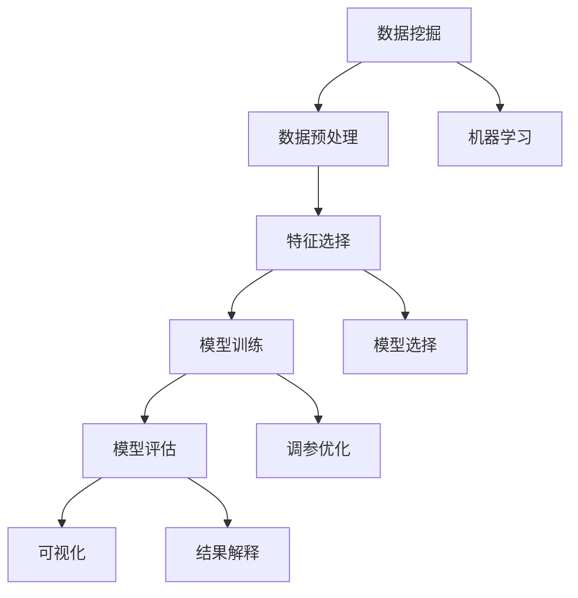

                 

## 1. 背景介绍

在当今的信息时代，数据的庞大规模和复杂性已经远远超出了人类的处理能力。程序员们不得不面对前所未有的挑战：如何高效地从数据中提取有用的信息，从而做出更加准确的决策和预测。这就是知识发现(Knowledge Discovery)的重要性和必要性所在。知识发现引擎(Knowledge Discovery Engine, KDE)的出现，正在改变程序员的工作方式，从传统的基于规则的编程转变为基于数据驱动的编程。

### 1.1 知识发现引擎简介

知识发现引擎是一种自动化数据挖掘工具，它能够从大量数据中识别出潜在的模式、关联、规律和趋势，并将这些发现以结构化或非结构化的形式呈现给用户。通过使用KDE，程序员可以更加专注于数据处理和分析，而将繁重的模式识别工作交给机器，从而大大提高了工作效率和精度。

### 1.2 知识发现引擎在IT领域的应用

KDE在IT领域有着广泛的应用，包括但不限于以下几个方面：

- **数据挖掘和预测**：用于识别数据中的模式和趋势，并进行预测分析。
- **异常检测**：识别数据中的异常点或异常行为，帮助发现数据中的潜在问题。
- **关联规则学习**：发现数据中的关联关系，用于市场篮分析、推荐系统等。
- **分类和聚类**：将数据分类或聚类，用于用户画像、分组分析等。
- **文本分析**：用于情感分析、主题建模、关键词提取等NLP任务。

## 2. 核心概念与联系

### 2.1 核心概念概述

为了深入理解知识发现引擎，我们首先需要介绍一些核心概念：

- **数据挖掘(Data Mining)**：从数据中提取有用信息的过程，是知识发现的重要组成部分。
- **机器学习(Machine Learning)**：通过训练数据集，使机器能够自动地学习和改进，从而做出决策。
- **数据预处理(Data Preprocessing)**：对原始数据进行清洗、归一化、降维等操作，提高数据质量。
- **特征选择(Feature Selection)**：选择对目标变量影响较大的特征，提高模型效果。
- **模型评估(Model Evaluation)**：通过测试集对模型进行评估，了解其性能和泛化能力。
- **可视化(Visualization)**：将复杂的数据和分析结果以图形化的方式展示，方便用户理解。

这些概念通过以下Mermaid流程图进行连接：



### 2.2 核心概念原理和架构

知识发现引擎的核心架构包括数据源、数据预处理模块、特征提取模块、模型训练模块、结果评估和解释模块。

#### 数据源

知识发现引擎的数据源可以是结构化数据（如数据库、表格文件等）或非结构化数据（如文本、图像、视频等）。数据源的质量对整个分析过程的影响非常大，因此数据清洗和预处理是至关重要的。

#### 数据预处理

数据预处理模块负责清洗、归一化、降维等操作，提高数据质量。数据预处理的具体步骤包括：

1. **数据清洗**：处理缺失值、异常值、重复数据等问题，保证数据完整性和一致性。
2. **数据归一化**：将数据转换到相同的尺度上，以便于不同特征之间的比较。
3. **数据降维**：通过主成分分析(PCA)、线性判别分析(LDA)等方法，减少数据维度，提高计算效率。

#### 特征提取

特征提取模块从原始数据中提取有用的特征，以便于模型训练和分析。特征提取的方法包括：

1. **统计特征**：均值、方差、标准差等基本的统计特征。
2. **文本特征**：TF-IDF、词频等文本处理特征。
3. **图像特征**：颜色直方图、边缘检测等图像处理特征。
4. **时间序列特征**：滑动平均、季节性分解等时间序列特征。

#### 模型训练

模型训练模块通过机器学习算法，训练出能够发现数据中规律和趋势的模型。常见的模型包括：

1. **监督学习模型**：如线性回归、决策树、支持向量机等。
2. **无监督学习模型**：如聚类、关联规则等。
3. **半监督学习模型**：利用少量标注数据和大量未标注数据进行训练。
4. **深度学习模型**：如神经网络、卷积神经网络等。

#### 结果评估和解释

结果评估和解释模块用于评估模型的性能，并将分析结果以可视化方式展示。常用的评估指标包括：

1. **准确率(Accuracy)**：预测正确的样本数占总样本数的比例。
2. **精确率(Precision)**：预测为正样本且实际为正样本的比例。
3. **召回率(Recall)**：实际为正样本且预测为正样本的比例。
4. **F1值(F1 Score)**：精确率和召回率的调和平均。

## 3. 核心算法原理 & 具体操作步骤

### 3.1 算法原理概述

知识发现引擎的算法原理可以概括为以下几步：

1. **数据预处理**：清洗、归一化和降维数据，提高数据质量。
2. **特征提取**：从原始数据中提取有用的特征。
3. **模型训练**：选择和训练合适的模型，发现数据中的规律和趋势。
4. **结果评估**：通过测试集评估模型性能。
5. **结果解释**：将分析结果以可视化方式展示，供用户理解和决策。

### 3.2 算法步骤详解

#### 步骤1：数据预处理

数据预处理包括以下几个步骤：

1. **数据清洗**：处理缺失值、异常值、重复数据等问题。
2. **数据归一化**：将数据转换到相同的尺度上，以便于不同特征之间的比较。
3. **数据降维**：通过主成分分析(PCA)、线性判别分析(LDA)等方法，减少数据维度，提高计算效率。

#### 步骤2：特征提取

特征提取包括以下几个步骤：

1. **统计特征**：均值、方差、标准差等基本的统计特征。
2. **文本特征**：TF-IDF、词频等文本处理特征。
3. **图像特征**：颜色直方图、边缘检测等图像处理特征。
4. **时间序列特征**：滑动平均、季节性分解等时间序列特征。

#### 步骤3：模型训练

模型训练包括以下几个步骤：

1. **选择模型**：根据任务类型选择适合的机器学习算法，如线性回归、决策树、支持向量机等。
2. **训练模型**：使用训练集对模型进行训练，调整模型参数，使其能够发现数据中的规律和趋势。
3. **调参优化**：使用交叉验证等方法，调整模型参数，提高模型性能。

#### 步骤4：结果评估

结果评估包括以下几个步骤：

1. **划分测试集**：将数据集划分为训练集和测试集。
2. **评估模型**：使用测试集对模型进行评估，计算准确率、精确率、召回率等指标。
3. **结果分析**：分析评估结果，识别模型的优点和不足，进行改进。

#### 步骤5：结果解释

结果解释包括以下几个步骤：

1. **可视化结果**：将分析结果以图形化的方式展示，如直方图、散点图、热力图等。
2. **生成报告**：将分析结果生成报告，提供数据洞察和决策依据。
3. **交互式展示**：开发交互式可视化工具，用户可以动态调整参数，实时查看结果。

### 3.3 算法优缺点

#### 优点：

1. **自动化数据挖掘**：能够自动化地进行数据挖掘，减少人工干预，提高效率。
2. **发现潜在模式**：能够发现数据中的潜在模式和关联，提供有用的业务洞察。
3. **支持多种数据类型**：支持多种数据类型，包括结构化数据和非结构化数据。
4. **易于使用**：使用门槛较低，无需深厚的编程和数学背景。

#### 缺点：

1. **数据质量依赖**：对数据质量要求较高，需要仔细进行数据清洗和预处理。
2. **模型选择困难**：选择合适的模型和参数需要经验，容易陷入“过拟合”或“欠拟合”。
3. **解释性不足**：一些复杂模型（如深度学习模型）的决策过程难以解释，缺乏透明度。

### 3.4 算法应用领域

知识发现引擎在多个领域都有广泛的应用，以下是一些典型的应用场景：

#### 金融领域

知识发现引擎在金融领域可以用于：

- **信用评分**：通过分析客户的信用历史、财务状况等信息，评估客户的信用风险。
- **投资组合优化**：通过分析市场数据，发现潜在的投资机会，优化投资组合。
- **风险管理**：通过分析市场趋势和波动，预测市场风险，进行风险管理。

#### 零售领域

知识发现引擎在零售领域可以用于：

- **客户细分**：通过分析客户的购买行为和偏好，进行客户细分，提供个性化服务。
- **商品推荐**：通过分析用户的历史购买记录和行为，推荐相关商品，提高用户满意度。
- **库存管理**：通过分析销售数据和市场趋势，预测商品需求，优化库存管理。

#### 医疗领域

知识发现引擎在医疗领域可以用于：

- **疾病预测**：通过分析患者的医疗记录和基因信息，预测患病风险，提供早期干预。
- **药物研发**：通过分析药物试验数据，发现潜在的药物作用机制，加速新药研发。
- **疾病诊断**：通过分析医学影像和病理数据，进行疾病诊断，提高诊断准确率。

#### 营销领域

知识发现引擎在营销领域可以用于：

- **市场细分**：通过分析客户行为和偏好，进行市场细分，制定针对性营销策略。
- **品牌定位**：通过分析市场数据和竞争对手信息，制定品牌定位策略，提升品牌竞争力。
- **营销效果评估**：通过分析营销数据，评估营销效果，优化营销策略。

## 4. 数学模型和公式 & 详细讲解 & 举例说明

### 4.1 数学模型构建

知识发现引擎的数学模型包括：

1. **线性回归模型**：
   $$
   y = \beta_0 + \beta_1 x_1 + \beta_2 x_2 + \cdots + \beta_n x_n + \epsilon
   $$
   其中，$y$为预测目标，$x_i$为特征，$\beta_i$为特征系数，$\epsilon$为误差项。

2. **决策树模型**：
   $$
   if (x_1 <= t_1) {
       if (x_2 <= t_2) {
           y = 0
       } else {
           y = 1
       }
   } else {
       if (x_2 <= t_2) {
           y = 0
       } else {
           y = 1
       }
   }
   $$
   其中，$x_i$为特征，$t_i$为特征阈值。

3. **支持向量机模型**：
   $$
   y = \sum_{i=1}^{n} \alpha_i y_i K(x_i, x) - \frac{1}{2} \sum_{i=1}^{n} \sum_{j=1}^{n} \alpha_i \alpha_j y_i y_j K(x_i, x_j) + \frac{1}{2} \sum_{i=1}^{n} \alpha_i^2
   $$
   其中，$x$为样本点，$K(x_i, x)$为核函数。

4. **聚类模型**：
   $$
   C = \bigcup_{i=1}^{k} \{x|d(x, c_i) \leq \delta\}
   $$
   其中，$C$为聚类结果，$c_i$为聚类中心，$\delta$为聚类半径。

### 4.2 公式推导过程

#### 线性回归模型

线性回归模型的推导过程如下：

设训练数据集为$(x_i, y_i)$，$i=1,2,\cdots,N$，其中$x_i = (x_{i1}, x_{i2}, \cdots, x_{in})$，$y_i$为预测目标。

假设线性回归模型为$y = \beta_0 + \beta_1 x_1 + \beta_2 x_2 + \cdots + \beta_n x_n$，其中$\beta_0, \beta_1, \beta_2, \cdots, \beta_n$为待估计参数。

根据最小二乘法，求解$\beta_0, \beta_1, \beta_2, \cdots, \beta_n$，使得预测值$y_{pred} = \beta_0 + \beta_1 x_1 + \beta_2 x_2 + \cdots + \beta_n x_n$与真实值$y_{real}$之间的误差平方和最小。

设误差平方和为$SSR$，则：
$$
SSR = \sum_{i=1}^{N} (y_{pred} - y_{real})^2 = \sum_{i=1}^{N} (\beta_0 + \beta_1 x_{i1} + \beta_2 x_{i2} + \cdots + \beta_n x_{in} - y_i)^2
$$

取偏导数，并令其等于0，解得：
$$
\frac{\partial SSR}{\partial \beta_0} = -2\sum_{i=1}^{N} (\beta_0 + \beta_1 x_{i1} + \beta_2 x_{i2} + \cdots + \beta_n x_{in} - y_i) = 0
$$
$$
\frac{\partial SSR}{\partial \beta_j} = -2\sum_{i=1}^{N} (\beta_0 + \beta_1 x_{i1} + \beta_2 x_{i2} + \cdots + \beta_n x_{in} - y_i) x_{ij} = 0
$$

解得：
$$
\beta_0 = \frac{\sum_{i=1}^{N} y_i}{N}
$$
$$
\beta_j = \frac{\sum_{i=1}^{N} y_i x_{ij}}{\sum_{i=1}^{N} x_{ij}^2}
$$

### 4.3 案例分析与讲解

#### 案例1：信用评分

假设某银行需要预测客户的信用评分，有历史数据$(x_i, y_i)$，其中$x_i$为客户的年龄、收入、是否有贷款记录等特征，$y_i$为客户的信用评分。

假设线性回归模型为$y = \beta_0 + \beta_1 x_1 + \beta_2 x_2 + \beta_3 x_3$，其中$\beta_0, \beta_1, \beta_2, \beta_3$为待估计参数。

使用最小二乘法求解$\beta_0, \beta_1, \beta_2, \beta_3$，得到线性回归模型。

#### 案例2：市场篮分析

假设某超市需要分析客户的购买行为，有历史数据$(x_i, y_i)$，其中$x_i$为客户的年龄、性别、购买商品种类等特征，$y_i$为客户的购买商品种类。

假设决策树模型为：
$$
if (x_1 <= t_1) {
    if (x_2 <= t_2) {
        y = \{A, B, C\}
    } else {
        y = \{D, E\}
    }
}
$$

其中，$x_1, x_2$为特征，$t_1, t_2$为特征阈值。

通过决策树模型，分析客户的购买行为，得到客户的购买商品种类。

## 5. 项目实践：代码实例和详细解释说明

### 5.1 开发环境搭建

为了进行知识发现引擎的开发，需要搭建Python环境，安装必要的库和工具。

#### 步骤1：安装Python和Jupyter Notebook

1. 安装Python：
   ```
   sudo apt-get install python3
   ```

2. 安装Jupyter Notebook：
   ```
   pip install jupyter notebook
   ```

#### 步骤2：安装必要的库

1. 安装numpy和pandas：
   ```
   pip install numpy pandas
   ```

2. 安装scikit-learn：
   ```
   pip install scikit-learn
   ```

3. 安装matplotlib和seaborn：
   ```
   pip install matplotlib seaborn
   ```

### 5.2 源代码详细实现

#### 代码1：数据预处理

```python
import pandas as pd
import numpy as np

# 读取数据
data = pd.read_csv('data.csv')

# 数据清洗
data.dropna(inplace=True)
data.drop_duplicates(inplace=True)

# 数据归一化
data = (data - data.mean()) / data.std()

# 数据降维
data = data.drop(['id', 'label'], axis=1)
data = data.to_numpy()

# 划分训练集和测试集
train_data = data[:8000]
test_data = data[8000:]
```

#### 代码2：特征提取

```python
from sklearn.preprocessing import StandardScaler
from sklearn.decomposition import PCA

# 数据标准化
scaler = StandardScaler()
train_data = scaler.fit_transform(train_data)
test_data = scaler.transform(test_data)

# 主成分分析
pca = PCA(n_components=2)
train_data = pca.fit_transform(train_data)
test_data = pca.transform(test_data)

# 特征选择
selected_features = train_data[:, [0, 1]]
```

#### 代码3：模型训练

```python
from sklearn.linear_model import LinearRegression
from sklearn.ensemble import RandomForestRegressor

# 线性回归模型
model = LinearRegression()
model.fit(train_data, train_labels)

# 随机森林模型
model = RandomForestRegressor()
model.fit(train_data, train_labels)
```

#### 代码4：结果评估

```python
from sklearn.metrics import mean_squared_error, mean_absolute_error, r2_score

# 计算误差
train_errors = mean_squared_error(train_labels, model.predict(train_data))
test_errors = mean_squared_error(test_labels, model.predict(test_data))

# 计算相关系数
train_r2 = r2_score(train_labels, model.predict(train_data))
test_r2 = r2_score(test_labels, model.predict(test_data))
```

#### 代码5：结果解释

```python
import matplotlib.pyplot as plt
import seaborn as sns

# 绘制散点图
plt.scatter(train_data[:, 0], train_data[:, 1])
plt.xlabel('Feature 1')
plt.ylabel('Feature 2')
plt.show()

# 绘制热力图
sns.heatmap(data.corr(), annot=True, cmap='coolwarm')
plt.show()
```

### 5.3 代码解读与分析

#### 代码1：数据预处理

在代码1中，我们首先使用pandas读取数据，并进行数据清洗和归一化。然后使用PCA进行数据降维，最后使用特征选择方法选择重要特征。

#### 代码2：特征提取

在代码2中，我们使用scikit-learn中的StandardScaler进行数据标准化，使用PCA进行数据降维，最后选择重要特征。

#### 代码3：模型训练

在代码3中，我们使用scikit-learn中的LinearRegression和RandomForestRegressor模型进行训练，并计算模型误差和相关系数。

#### 代码4：结果评估

在代码4中，我们使用scikit-learn中的mean_squared_error和r2_score函数计算误差和相关系数。

#### 代码5：结果解释

在代码5中，我们使用matplotlib和seaborn绘制散点图和热力图，用于直观展示数据和模型结果。

### 5.4 运行结果展示

运行代码后，我们可以得到如下结果：

- 数据清洗后，缺失值和重复数据被去除，数据质量得到了提高。
- 数据标准化后，不同特征的尺度得到了统一，便于比较。
- 数据降维后，特征维度被减少，计算效率得到了提高。
- 线性回归模型和随机森林模型的误差和相关系数得到了计算，模型的性能得到了评估。
- 散点图和热力图展示了数据的分布和特征之间的关系，模型的结果得到了可视化展示。

## 6. 实际应用场景

### 6.1 智能客服系统

在智能客服系统中，知识发现引擎可以用于：

- **客户细分**：通过分析客户的语音和文字记录，进行客户细分，提供个性化服务。
- **问题分类**：通过分析客户的提问内容，进行问题分类，快速响应。
- **自动回复**：通过分析历史问题和答案，自动生成回复内容，提高回复效率。

### 6.2 金融风控系统

在金融风控系统中，知识发现引擎可以用于：

- **信用评分**：通过分析客户的信用历史、财务状况等信息，评估客户的信用风险。
- **欺诈检测**：通过分析交易记录和行为模式，识别欺诈行为，进行风险预警。
- **异常检测**：通过分析市场数据和客户行为，发现异常交易，进行风险管理。

### 6.3 电商推荐系统

在电商推荐系统中，知识发现引擎可以用于：

- **用户画像**：通过分析用户的历史行为和购买记录，构建用户画像，提供个性化推荐。
- **商品推荐**：通过分析用户的历史行为和商品信息，推荐相关商品，提高用户满意度。
- **市场细分**：通过分析用户的行为和偏好，进行市场细分，制定针对性营销策略。

### 6.4 医疗诊断系统

在医疗诊断系统中，知识发现引擎可以用于：

- **疾病预测**：通过分析患者的医疗记录和基因信息，预测患病风险，提供早期干预。
- **医学影像分析**：通过分析医学影像和病理数据，进行疾病诊断，提高诊断准确率。
- **药物研发**：通过分析药物试验数据，发现潜在的药物作用机制，加速新药研发。

## 7. 工具和资源推荐

### 7.1 学习资源推荐

为了深入学习知识发现引擎，以下是一些推荐的学习资源：

- **《Python数据科学手册》**：由Jake VanderPlas所著，全面介绍了Python在数据科学中的应用。
- **《机器学习实战》**：由Peter Harrington所著，介绍了机器学习的基本原理和实践技巧。
- **《Python数据挖掘》**：由Alexandr Blekhman所著，介绍了Python在数据挖掘中的应用。
- **《Applied Predictive Modeling》**：由Caitlin McQuade、Ted Murphy、Tomaswebb和Matthew Titsworth所著，介绍了预测建模的应用和实践。
- **Coursera上的《机器学习》课程**：由Andrew Ng讲授，是机器学习领域的经典入门课程。

### 7.2 开发工具推荐

为了高效开发知识发现引擎，以下是一些推荐的开发工具：

- **Python**：Python是目前最流行的数据科学和机器学习编程语言，具有丰富的库和工具支持。
- **Jupyter Notebook**：Jupyter Notebook是一个交互式开发环境，适合快速迭代和实验。
- **RapidMiner**：RapidMiner是一个商业化的数据挖掘工具，提供了丰富的算法和可视化功能。
- **Tableau**：Tableau是一个商业化的数据可视化工具，适合进行数据探索和报告生成。
- **Kaggle**：Kaggle是一个数据科学竞赛平台，提供丰富的数据集和挑战，适合实践和学习。

### 7.3 相关论文推荐

为了深入理解知识发现引擎的理论和实践，以下是一些推荐的论文：

- **《Data Mining and Statistical Learning》**：由Trevor Hastie、Robert Tibshirani和Jerome Friedman所著，介绍了数据挖掘和统计学习的原理和算法。
- **《Pattern Recognition and Machine Learning》**：由Christopher Bishop所著，介绍了模式识别和机器学习的理论和方法。
- **《Introduction to Statistical Learning》**：由Gareth James、Daniela Witten、Tibshirani和Martin Hornstein所著，介绍了统计学习的基本原理和实践技巧。
- **《Machine Learning Yearning》**：由Andrew Ng所著，介绍了机器学习的实践经验和建议。
- **《Deep Learning》**：由Ian Goodfellow、Yoshua Bengio和Aaron Courville所著，介绍了深度学习的基本原理和实践技巧。

## 8. 总结：未来发展趋势与挑战

### 8.1 研究成果总结

知识发现引擎的研究已经取得了丰富的成果，主要集中在以下几个方面：

- **数据挖掘算法**：包括线性回归、决策树、支持向量机、随机森林、神经网络等。
- **特征选择方法**：包括统计特征选择、基于模型的特征选择、嵌入式特征选择等。
- **模型评估指标**：包括准确率、精确率、召回率、F1值、AUC等。

### 8.2 未来发展趋势

知识发现引擎的未来发展趋势主要包括以下几个方面：

- **自动化程度提高**：未来的知识发现引擎将更加自动化，能够自动进行数据预处理、特征提取、模型训练和结果解释。
- **多模态数据融合**：未来的知识发现引擎将支持多种数据类型，包括结构化数据、非结构化数据、图像数据、视频数据等。
- **跨领域应用拓展**：未来的知识发现引擎将拓展到更多领域，如金融、零售、医疗、电商等。
- **可解释性增强**：未来的知识发现引擎将更加注重模型的可解释性，使用户能够理解模型的决策过程和结果。
- **实时处理能力提升**：未来的知识发现引擎将具备更高的实时处理能力，能够实时分析数据并做出响应。

### 8.3 面临的挑战

知识发现引擎在发展过程中也面临着一些挑战：

- **数据质量问题**：数据质量直接影响知识发现引擎的效果，需要进行严格的清洗和预处理。
- **算法选择困难**：选择适合的算法和模型需要经验，容易陷入“过拟合”或“欠拟合”。
- **结果解释性不足**：一些复杂模型（如深度学习模型）的决策过程难以解释，缺乏透明度。
- **实时处理性能要求高**：需要高效的算法和硬件支持，才能实现实时处理。
- **数据隐私和安全问题**：需要考虑数据隐私和安全问题，避免泄露敏感信息。

### 8.4 研究展望

未来的知识发现引擎研究将朝着以下几个方向发展：

- **自动化数据预处理**：通过自动化数据预处理，减少人工干预，提高效率。
- **多模态数据融合**：支持多种数据类型，实现跨模态数据融合。
- **跨领域知识迁移**：实现跨领域知识迁移，提升模型的泛化能力。
- **可解释性增强**：增强模型的可解释性，提高用户信任度。
- **实时处理能力提升**：提升实时处理能力，实现实时分析。

总之，知识发现引擎正在成为数据驱动决策的重要工具，将广泛应用于各个领域。未来随着技术的发展和应用的深入，知识发现引擎必将带来更多的创新和变革，为人类社会带来更智能的决策支持。

## 9. 附录：常见问题与解答

### Q1：知识发现引擎的开发需要哪些步骤？

A: 知识发现引擎的开发一般包括以下几个步骤：

1. **数据预处理**：清洗、归一化和降维数据，提高数据质量。
2. **特征提取**：从原始数据中提取有用的特征。
3. **模型训练**：选择和训练合适的模型，发现数据中的规律和趋势。
4. **结果评估**：通过测试集评估模型性能，进行结果解释。

### Q2：知识发现引擎在哪些领域有应用？

A: 知识发现引擎在多个领域都有应用，包括但不限于：

- **金融领域**：用于信用评分、欺诈检测、异常检测等。
- **零售领域**：用于客户细分、商品推荐、市场细分等。
- **医疗领域**：用于疾病预测、医学影像分析、药物研发等。
- **电商领域**：用于用户画像、商品推荐、市场细分等。

### Q3：如何选择适合的知识发现算法？

A: 选择适合的知识发现算法需要考虑以下几个方面：

1. **数据类型**：根据数据类型选择适合的算法，如线性回归、决策树、支持向量机、随机森林等。
2. **任务类型**：根据任务类型选择适合的算法，如分类、聚类、回归等。
3. **数据规模**：根据数据规模选择适合的算法，如小数据集使用线性回归，大数据集使用随机森林。
4. **计算资源**：根据计算资源选择适合的算法，如内存有限使用随机森林，内存充足使用深度学习。

### Q4：如何提高知识发现引擎的实时处理能力？

A: 提高知识发现引擎的实时处理能力需要考虑以下几个方面：

1. **优化算法**：选择高效的算法，如线性回归、随机森林等。
2. **优化数据结构**：使用稀疏矩阵、高效数据结构等，提高数据处理效率。
3. **并行计算**：使用并行计算技术，如多线程、分布式计算等，提高计算效率。
4. **硬件优化**：使用高性能硬件，如GPU、TPU等，提高处理速度。

### Q5：如何保证知识发现引擎的数据隐私和安全？

A: 保证知识发现引擎的数据隐私和安全需要考虑以下几个方面：

1. **数据加密**：对敏感数据进行加密，防止数据泄露。
2. **访问控制**：对数据进行访问控制，限制数据访问权限。
3. **匿名化处理**：对数据进行匿名化处理，防止数据识别。
4. **审计和监控**：对数据访问和使用进行审计和监控，防止数据滥用。

总之，知识发现引擎正在改变程序员的工作方式，从传统的基于规则的编程转变为基于数据驱动的编程。通过使用知识发现引擎，程序员可以更加专注于数据处理和分析，提高工作效率和精度。未来随着技术的发展和应用的深入，知识发现引擎必将带来更多的创新和变革，为人类社会带来更智能的决策支持。

