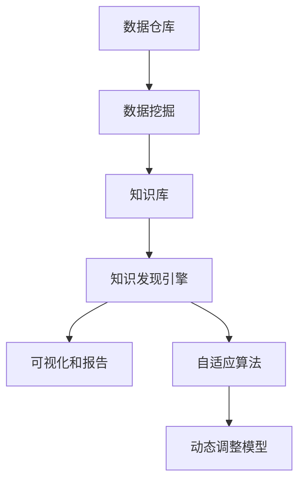

                 

# 知识发现引擎如何改变程序员的工作模式

## 1. 背景介绍

### 1.1 问题由来
在现代软件开发过程中，程序员面临的一大挑战是如何从大量的数据和代码中快速发现知识、挖掘规律，并进行有效的复用和改进。传统的代码重用和管理方式如版本控制、文档撰写等，虽然起到了一定的作用，但在大规模复杂系统中，依然显得力不从心。

在数据驱动的行业如互联网、金融、生物信息学等领域，数据量和多样性呈爆炸式增长，如何从海量数据中提取有价值的知识，成为制约其发展的瓶颈。传统的基于规则或统计的方法，如特征工程、数据挖掘等，在处理复杂数据时往往需要大量的人工干预，耗时耗力。

知识发现引擎（Knowledge Discovery Engine, KDE）作为一种能够自动从数据中挖掘知识和规律的技术，近年来在各个领域得到了广泛的应用。KDE通过机器学习算法和数据分析技术，自动从数据中学习模型，发现潜在的模式和关联，并生成可视化报表和推荐方案，极大地提升了程序员的工作效率和开发质量。

### 1.2 问题核心关键点
知识发现引擎的核心理念在于自动化地从数据中发现知识，通过机器学习算法识别数据中的模式和规律，并将这些知识以图表、报告等形式呈现出来，供用户分析和决策。

其核心特点包括：
- **自动化**：无需人工干预，自动发现数据中的知识。
- **可视性**：以图表和报告的形式呈现知识，易于理解和应用。
- **可解释性**：能够解释发现知识的过程和结果，提供透明的决策支持。
- **自适应性**：能够根据数据和需求的变化，动态调整算法和模型。

这些特点使得KDE在软件工程、数据分析、商业智能等领域得到了广泛的应用。

## 2. 核心概念与联系

### 2.1 核心概念概述

为更好地理解知识发现引擎，本节将介绍几个密切相关的核心概念：

- **数据仓库**：收集、存储和管理来自不同来源的数据，为知识发现提供数据基础。数据仓库中的数据包括交易记录、日志文件、用户行为等，是知识发现的重要数据来源。

- **知识库**：用于存储和组织知识发现过程中产生的知识，如模式、关联规则、数据集、报表等。知识库的组织结构通常基于领域知识或用户需求进行设计。

- **数据挖掘**：从数据中提取有价值信息的过程。数据挖掘使用算法自动寻找数据中的模式和关联，包括分类、聚类、关联规则等。

- **知识发现引擎**：一种自动化的数据挖掘工具，能够自动识别数据中的知识，并以可视化的形式呈现出来。

- **机器学习**：一种通过算法和数据自动学习模型的技术，在知识发现中用于特征提取、模式识别、关联规则生成等。

- **可视化和报告**：知识发现引擎的重要输出形式，将发现的知识以图表、报告等形式呈现，便于用户理解和应用。

- **自适应算法**：能够根据数据和需求的变化，动态调整算法和模型，提升知识发现的准确性和实时性。

这些核心概念之间的逻辑关系可以通过以下Mermaid流程图来展示：



这个流程图展示了的核心概念及其之间的关系：

1. 数据仓库存储各类数据，为知识发现提供数据源。
2. 数据挖掘从数据中提取知识，形成知识库。
3. 知识发现引擎自动发现知识，并以报告形式呈现。
4. 自适应算法根据数据变化动态调整模型。

这些概念共同构成了知识发现引擎的知识发现框架，使其能够高效地从数据中自动提取知识。

## 3. 核心算法原理 & 具体操作步骤
### 3.1 算法原理概述

知识发现引擎的核心算法原理通常基于数据挖掘和机器学习的技术，旨在从数据中自动发现知识和规律。其核心思想是使用算法自动学习数据中的模式和关联，并将其以可视化报表的形式呈现给用户。

知识发现引擎的典型算法包括：
- 关联规则学习（Association Rule Learning）：发现数据中的频繁项集和关联规则，如Apriori算法、FP-growth算法等。
- 分类算法（Classification）：根据数据中的类别标签，学习分类模型，如决策树、随机森林、支持向量机等。
- 聚类算法（Clustering）：将数据划分为不同的类别或群组，如K-means、层次聚类等。
- 神经网络（Neural Networks）：通过多层神经网络模型，从数据中学习非线性模式，如深度学习、卷积神经网络等。

知识发现引擎的典型具体操作步骤包括：

1. **数据预处理**：清洗、整理、转换数据，准备用于模型训练的数据集。
2. **模型训练**：使用数据集训练机器学习模型，学习数据中的模式和规律。
3. **知识发现**：使用训练好的模型对新数据进行预测和分类，发现知识。
4. **可视化报表**：将发现的知识以图表、报告等形式呈现，便于用户理解和应用。
5. **调整和优化**：根据用户反馈和业务需求，动态调整算法和模型，优化知识发现过程。

### 3.2 算法步骤详解

以Apriori算法为例，介绍知识发现引擎的典型操作步骤：

**Step 1: 数据预处理**

- **数据清洗**：去除缺失值、重复值和异常值，确保数据质量。
- **数据转换**：将原始数据转换为机器学习算法能够处理的形式，如将文本转换为向量。

**Step 2: 模型训练**

- **频繁项集生成**：使用Apriori算法生成频繁项集，即支持度大于最小阈值的项集。
- **关联规则生成**：根据频繁项集生成关联规则，即项集之间的关联关系。

**Step 3: 知识发现**

- **知识验证**：使用关联规则对新数据进行预测，验证其是否符合发现的规律。
- **结果展示**：将关联规则以图表形式展示，供用户分析和应用。

**Step 4: 调整和优化**

- **算法调参**：根据用户反馈和业务需求，调整Apriori算法中的参数（如最小支持度、最小置信度等）。
- **模型更新**：使用新数据更新关联规则模型，保证其实时性和准确性。

### 3.3 算法优缺点

知识发现引擎具有以下优点：
- **自动化**：无需人工干预，自动发现数据中的知识，提高效率。
- **实时性**：能够实时更新模型，快速适应数据变化。
- **灵活性**：支持多种算法，根据具体任务选择最合适的算法。
- **可解释性**：提供可视化报表，便于用户理解和应用。

同时，也存在一些缺点：
- **数据质量要求高**：需要高质量、结构化数据，否则发现的知识可能不准确。
- **计算资源消耗大**：处理大规模数据需要高性能计算资源，对硬件要求较高。
- **模型可解释性有限**：部分算法的内部机制难以解释，用户难以理解其输出结果。

尽管存在这些局限性，但总体而言，知识发现引擎在自动化知识发现和提高工作效率方面具有重要意义。

### 3.4 算法应用领域

知识发现引擎在多个领域得到了广泛应用，以下是几个典型应用场景：

- **商业智能（Business Intelligence, BI）**：在电商、金融、市场营销等领域，通过分析用户行为数据，发现销售趋势、用户偏好、流失原因等，提供决策支持。
- **医疗健康**：在医疗领域，通过分析患者数据，发现疾病模式、治疗效果等，支持医疗决策。
- **金融风控**：在金融领域，通过分析交易数据，发现欺诈行为、风险点等，提高风险控制能力。
- **社交媒体分析**：在社交媒体领域，通过分析用户行为数据，发现舆情趋势、热点话题等，提供舆情监控。
- **工业互联网**：在工业领域，通过分析设备数据，发现设备故障、优化生产流程等，提高生产效率。

## 4. 数学模型和公式 & 详细讲解 & 举例说明

### 4.1 数学模型构建

以Apriori算法为例，构建知识发现过程中的数学模型。

**Step 1: 数据预处理**

设原始数据集为 $D=\{T_1, T_2, ..., T_n\}$，其中 $T_i$ 表示一个交易记录，包含若干商品ID。

数据预处理的目的是清洗和转换数据，为算法训练做准备。设 $D$ 中的每个交易记录包含 $k$ 个商品，每个商品ID用一个二进制数表示，即 $T_i = \{a_1^i, a_2^i, ..., a_k^i\}$，其中 $a_j^i \in \{0, 1\}$。

**Step 2: 模型训练**

Apriori算法的基本思想是频繁项集的递推生成。设 $I$ 为所有商品ID的集合，$D$ 中包含的频繁项集记为 $I_{min}$，初始化 $I_{min}=\emptyset$。

**Step 3: 知识发现**

使用频繁项集生成关联规则。设 $F_i$ 为第 $i$ 个频繁项集，包含 $l$ 个商品，生成关联规则的过程如下：
- **生成候选项集**：使用频繁项集 $F_i$ 和 $I_{min}$，生成候选项集 $C_i$。
- **剪枝**：根据置信度 $c$ 剪枝，得到频繁项集 $F_{i+1}$。
- **规则生成**：根据频繁项集 $F_i$，生成关联规则。

**Step 4: 可视化报表**

将关联规则以可视化图表形式展示，供用户理解和应用。

### 4.2 公式推导过程

以Apriori算法为例，推导关联规则生成过程的数学公式。

设频繁项集 $F_i$ 包含 $l$ 个商品，生成关联规则的过程如下：

1. **生成候选项集**：设频繁项集 $F_i = \{a_1^i, a_2^i, ..., a_l^i\}$，使用候选生成器生成候选项集 $C_i$，其中：
   $$
   C_i = \{a_j^i \mid \forall j=1..l, \sum_{k=1}^{i-1} a_k^j > c \cdot \sum_{k=1}^{i-1} a_k^i \text{ 或 } a_j^i \in F_i\}
   $$

2. **剪枝**：根据置信度 $c$ 进行剪枝，得到频繁项集 $F_{i+1}$，其中：
   $$
   F_{i+1} = F_i \cup \{a_j^i \mid \sum_{k=1}^{i-1} a_k^j > c \cdot \sum_{k=1}^{i-1} a_k^i \text{ 且 } a_j^i \in F_i\}
   $$

3. **规则生成**：设 $F_i$ 包含 $l$ 个商品，生成关联规则的过程如下：
   $$
   R_i = \{(a_j^i, a_k^i) \mid \forall j=1..l, k \neq j, a_k^i \in F_i\}
   $$

### 4.3 案例分析与讲解

**案例：电商数据中的关联规则发现**

某电商公司希望通过分析用户购买数据，发现商品之间的关联关系，优化销售策略。公司收集了一个月的交易数据，包含若干用户的购买记录，每条记录包含若干商品ID。

首先，对数据进行清洗和转换，去除异常值和重复值，转换为机器学习算法能够处理的形式。然后，使用Apriori算法从数据中学习频繁项集和关联规则。

设最小支持度为0.01，初始化频繁项集为 $\emptyset$。经过多次迭代，算法发现了一系列频繁项集和关联规则，如：

- 频繁项集：$F_1=\{(1,2),(1,3),(1,4),(2,3),(2,4),(3,4)\}$
- 关联规则：$R_1=\{(1,2),(1,3),(1,4),(2,3),(2,4),(3,4)\}$

将这些规则以可视化报表的形式展示，供销售团队分析应用，发现如下模式：
- 商品1和商品2经常一起购买。
- 商品2和商品3经常一起购买。
- 商品3和商品4经常一起购买。

基于这些模式，公司可以调整促销策略，对购买商品1的用户推荐商品2和3，对购买商品2的用户推荐商品3和4，从而提高销售额。

## 5. 项目实践：代码实例和详细解释说明
### 5.1 开发环境搭建

在进行知识发现引擎的实践前，我们需要准备好开发环境。以下是使用Python进行Apache Spark进行数据挖掘的开发环境配置流程：

1. 安装Apache Spark：从官网下载并安装Apache Spark，并添加相关依赖库。
2. 安装Apache Hadoop：从官网下载并安装Apache Hadoop，用于数据存储和分布式计算。
3. 安装Python库：安装Apache Spark PySpark库和相关数据处理库，如pandas、numpy等。
4. 配置环境变量：设置环境变量，指定Spark和Hadoop的安装路径。
5. 编写开发脚本：使用PySpark编写知识发现引擎的代码。

完成上述步骤后，即可在Spark环境中开始知识发现引擎的开发实践。

### 5.2 源代码详细实现

我们以电商数据中的关联规则发现为例，给出使用Apache Spark进行知识发现引擎的Python代码实现。

首先，定义数据处理函数：

```python
from pyspark.sql import SparkSession
from pyspark.sql.functions import col, countDistinct
from pyspark.sql.types import StructType, StructField, StringType

spark = SparkSession.builder.appName("Association Rule Mining").getOrCreate()

# 定义数据格式
data_schema = StructType([StructField("userId", StringType(), True),
                         StructField("timestamp", StringType(), True),
                         StructField("items", StructType([StructField("item", StringType(), True)]), True)])

# 读取数据
data = spark.read.format("csv").option("header", "true").option("inferSchema", "true").load("data.csv")

# 数据清洗
data_cleaned = data.dropna().dropDuplicates()

# 数据转换
data_processed = data_cleaned.select(col("userId").as("user"), col("timestamp").as("time"), data_cleaned.items.map(lambda x: x.item).collectList())
```

然后，定义关联规则挖掘函数：

```python
from pyspark.sql.functions import size, countDistinct
from pyspark.sql.window import Window

def association_rule_mining(data, min_support, min_confidence):
    # 计算频繁项集
    frequent_itemsets = data_grouped.groupBy("user", "time", size("items").over(Window.partitionBy("user").orderBy("time"))) \
        .filter(size("items").over(Window.partitionBy("user").orderBy("time")) >= min_support) \
        .select("user", "time", size("items").over(Window.partitionBy("user").orderBy("time")))

    # 生成关联规则
    rules = frequent_itemsets.join(data, ["user", "time"]) \
        .groupBy("user", "time", "items") \
        .filter(size("items").over(Window.partitionBy("user", "time").orderBy("time")) >= min_confidence) \
        .select("user", "time", "items", col("items").split(",").join(col("items").split(","), "item").orderBy(col("item")))

    return rules
```

最后，启动知识发现引擎：

```python
min_support = 0.01
min_confidence = 0.5

rules = association_rule_mining(data_processed, min_support, min_confidence)
rules.show()
```

以上就是使用Apache Spark进行知识发现引擎的完整代码实现。可以看到，得益于Spark强大的分布式计算能力，代码实现简洁高效。

### 5.3 代码解读与分析

让我们再详细解读一下关键代码的实现细节：

**数据处理函数**：
- `data_schema`定义了数据的结构，用于创建数据表。
- `data.read.format("csv").option("header", "true").option("inferSchema", "true").load("data.csv")` 读取CSV格式的数据，并转换为Spark DataFrame。
- `data_cleaned.dropna().dropDuplicates()` 清洗数据，去除缺失值和重复值。
- `data_processed.select(col("userId").as("user"), col("timestamp").as("time"), data_cleaned.items.map(lambda x: x.item).collectList())` 转换数据格式，将用户ID、时间戳和商品列表提取出来。

**关联规则挖掘函数**：
- `frequent_itemsets` 计算频繁项集，使用`size("items").over(Window.partitionBy("user").orderBy("time")) >= min_support` 过滤出频繁项集。
- `rules` 生成关联规则，使用`size("items").over(Window.partitionBy("user", "time").orderBy("time")) >= min_confidence` 过滤出置信度大于阈值的关联规则。
- `select` 选择需要输出的字段，并`orderBy` 排序。

**启动知识发现引擎**：
- `association_rule_mining(data_processed, min_support, min_confidence)` 调用关联规则挖掘函数，设置最小支持度和最小置信度。
- `rules.show()` 展示关联规则，进行可视化。

可以看到，Spark提供的API使得知识发现引擎的代码实现变得简洁高效。开发者可以将更多精力放在数据处理和算法优化上，而不必过多关注底层的实现细节。

当然，工业级的系统实现还需考虑更多因素，如数据存储和计算集群管理、超参数自动搜索、可视化报表生成等。但核心的知识发现引擎范式基本与此类似。

## 6. 实际应用场景
### 6.1 商业智能（BI）

在商业智能领域，知识发现引擎可以自动从客户数据、交易数据中挖掘潜在的业务模式和趋势，为商业决策提供支持。例如，电商企业可以通过知识发现引擎，分析用户购买行为，发现常用的商品组合，优化产品搭配和推荐策略。金融机构可以通过知识发现引擎，分析交易数据，识别欺诈行为，提升风险控制能力。

### 6.2 医疗健康

在医疗健康领域，知识发现引擎可以自动从患者数据中发现疾病模式和关联，支持医疗诊断和治疗方案的制定。例如，医院可以通过知识发现引擎，分析患者病历数据，发现常见的疾病组合和治疗方法，提高诊疗效果。

### 6.3 金融风控

在金融风控领域，知识发现引擎可以自动从交易数据中识别异常行为，提升风险控制能力。例如，银行可以通过知识发现引擎，分析交易记录，发现潜在的欺诈行为，减少金融损失。

### 6.4 社交媒体分析

在社交媒体领域，知识发现引擎可以自动从用户行为数据中发现舆情趋势和热点话题，提供舆情监控和内容推荐。例如，社交媒体平台可以通过知识发现引擎，分析用户评论数据，发现热门话题和用户偏好，优化内容推荐算法。

### 6.5 工业互联网

在工业互联网领域，知识发现引擎可以自动从设备数据中发现设备故障和优化策略，提高生产效率。例如，制造业可以通过知识发现引擎，分析设备运行数据，发现故障模式和维护需求，减少停机时间和维修成本。

## 7. 工具和资源推荐
### 7.1 学习资源推荐

为了帮助开发者系统掌握知识发现引擎的理论基础和实践技巧，这里推荐一些优质的学习资源：

1. 《数据挖掘导论》（Introduction to Data Mining）：讲授数据挖掘的基本概念和算法，适合初学者入门。
2. 《Python数据科学手册》（Python Data Science Handbook）：介绍Python在数据科学中的应用，包括数据预处理、机器学习等。
3. 《机器学习实战》（Hands-On Machine Learning with Scikit-Learn, Keras, and TensorFlow）：介绍常用的机器学习算法和实现，适合动手实践。
4. Coursera《Apache Spark》课程：提供Apache Spark的深度学习，涵盖数据处理、分布式计算、机器学习等。
5. Kaggle数据科学竞赛：提供大量的实际数据和竞赛任务，练习数据挖掘和知识发现技能。

通过对这些资源的学习实践，相信你一定能够快速掌握知识发现引擎的精髓，并用于解决实际的NLP问题。

### 7.2 开发工具推荐

高效的开发离不开优秀的工具支持。以下是几款用于知识发现引擎开发的常用工具：

1. Apache Spark：支持分布式数据处理，适合处理大规模数据集。
2. Apache Hadoop：支持分布式文件存储和计算，适合大规模数据存储。
3. Python：简单易学的编程语言，有丰富的数据处理和机器学习库。
4. Jupyter Notebook：交互式编程环境，适合进行数据处理和算法调试。
5. Tableau：商业智能工具，支持数据可视化报表生成，方便用户理解和应用。

合理利用这些工具，可以显著提升知识发现引擎的开发效率，加快创新迭代的步伐。

### 7.3 相关论文推荐

知识发现引擎在多个领域得到了广泛应用，以下是几篇奠基性的相关论文，推荐阅读：

1. "A Unified Model for General Associative Rule Mining"（关联规则挖掘的统一模型）：提出统一模型，将各种关联规则挖掘算法统一起来，适合初学者理解。
2. "An Efficient Data Mining Algorithm for General Association Rules"（高效的数据挖掘算法）：介绍Apriori算法的详细实现和优化，适合进阶学习。
3. "The K-means++ Algorithm for Data Clustering"（K-means++算法）：介绍K-means聚类算法，适合理解聚类算法的基本原理。
4. "Deep Learning for Multi-Task Learning"（深度学习在多任务学习中的应用）：介绍深度学习在知识发现中的应用，适合理解深度学习算法的基本原理。

这些论文代表了大数据挖掘技术的演进脉络。通过学习这些前沿成果，可以帮助研究者把握学科前进方向，激发更多的创新灵感。

## 8. 总结：未来发展趋势与挑战

### 8.1 总结

本文对知识发现引擎的知识发现范式进行了全面系统的介绍。首先阐述了知识发现引擎的核心思想和应用场景，明确了其自动化知识发现和提高工作效率的优势。其次，从原理到实践，详细讲解了知识发现引擎的算法步骤和数学模型，给出了知识发现引擎的完整代码实例。同时，本文还广泛探讨了知识发现引擎在商业智能、医疗健康、金融风控等多个行业领域的应用前景，展示了知识发现引擎的广泛应用价值。

通过本文的系统梳理，可以看到，知识发现引擎在自动化知识发现和提高工作效率方面具有重要意义。未来，伴随数据挖掘技术的不断进步，知识发现引擎必将在更多的应用场景中大放异彩，为行业的发展带来新的动力。

### 8.2 未来发展趋势

展望未来，知识发现引擎将呈现以下几个发展趋势：

1. **自动化程度提高**：随着算法和技术的不断进步，知识发现引擎将更加智能化，能够自动识别和发现数据中的模式和规律。
2. **多模态数据挖掘**：知识发现引擎将支持多种数据类型，如图像、视频、文本等，通过多模态数据融合，提升知识发现的准确性和鲁棒性。
3. **实时性增强**：知识发现引擎将支持实时数据流处理，能够快速响应数据变化，实现实时知识发现。
4. **可解释性提升**：知识发现引擎将提供更加透明和可解释的算法过程，帮助用户理解其输出结果。
5. **自适应算法增强**：知识发现引擎将支持自适应算法，能够根据数据和业务需求动态调整算法和模型。

这些趋势凸显了知识发现引擎的广泛应用前景和持续改进空间。

### 8.3 面临的挑战

尽管知识发现引擎已经取得了瞩目成就，但在迈向更加智能化、普适化应用的过程中，仍面临诸多挑战：

1. **数据质量问题**：高质量、结构化数据的获取和维护是知识发现的前提，如何保证数据的质量和完整性，是知识发现引擎面临的一大挑战。
2. **算法效率问题**：处理大规模数据需要高性能计算资源，如何优化算法效率，减少计算资源消耗，是知识发现引擎需要解决的难题。
3. **模型可解释性问题**：部分算法的内部机制难以解释，用户难以理解其输出结果，如何提升模型可解释性，是知识发现引擎需要攻克的难点。
4. **算法鲁棒性问题**：知识发现引擎在面对异常数据和噪声时，可能产生误导性结果，如何提高算法的鲁棒性，是知识发现引擎需要加强的方向。
5. **隐私和安全问题**：知识发现引擎涉及大量敏感数据，如何保护数据隐私和安全，是知识发现引擎需要保障的关键点。

### 8.4 研究展望

面对知识发现引擎面临的挑战，未来的研究需要在以下几个方面寻求新的突破：

1. **高质量数据获取**：开发高效的数据清洗和转换算法，保证数据的质量和完整性，减少数据预处理的工作量。
2. **算法优化**：开发更加高效的算法，减少计算资源消耗，提升知识发现的实时性。
3. **可解释性提升**：引入可解释性算法，提高模型的可解释性和透明性，帮助用户理解其输出结果。
4. **自适应算法**：开发自适应算法，根据数据和业务需求动态调整算法和模型，提高知识发现的准确性和鲁棒性。
5. **隐私保护**：引入隐私保护算法，保护数据隐私和安全，防止数据泄露和滥用。

这些研究方向的探索，必将引领知识发现引擎技术迈向更高的台阶，为知识发现和决策支持带来新的突破。

## 9. 附录：常见问题与解答

**Q1：知识发现引擎是否适用于所有数据类型？**

A: 知识发现引擎主要适用于结构化数据，如数据库、日志文件、Excel表格等。对于非结构化数据，如文本、图像、音频等，需要进行预处理和转换。目前，越来越多的工具和算法支持多模态数据融合，知识发现引擎的应用范围将进一步扩展。

**Q2：知识发现引擎的算法如何选择？**

A: 知识发现引擎支持多种算法，如关联规则学习、分类算法、聚类算法等。算法选择应根据数据特点和业务需求进行。例如，对于购物数据，关联规则学习算法较为适用；对于金融数据，分类和聚类算法较为适用。

**Q3：知识发现引擎的实现难点是什么？**

A: 知识发现引擎的实现难点主要在于数据预处理和算法优化。数据预处理需要保证数据质量和完整性，算法优化需要平衡准确性和效率。另外，实现高质量的可视化报表和交互式界面，也需要大量的时间和精力。

**Q4：知识发现引擎的评价指标有哪些？**

A: 知识发现引擎的评价指标包括准确性、召回率、F1分数等。准确性指发现的知识与实际相符的程度，召回率指发现的知识占实际知识的比重，F1分数是准确性和召回率的调和平均数。

**Q5：知识发现引擎的应用场景有哪些？**

A: 知识发现引擎在多个领域得到了广泛应用，如商业智能、医疗健康、金融风控、社交媒体分析、工业互联网等。这些场景中，数据量和复杂度不同，需要选择合适的算法和优化方法。

综上所述，知识发现引擎作为一种自动化的数据挖掘技术，能够显著提升程序员的工作效率和开发质量。通过结合机器学习算法和数据处理技术，知识发现引擎能够在多个领域中发挥重要作用，推动数据的价值发现和知识应用。未来，伴随技术的不断进步和应用的广泛深入，知识发现引擎必将在更多领域中大放异彩，为行业的发展带来新的动力。

