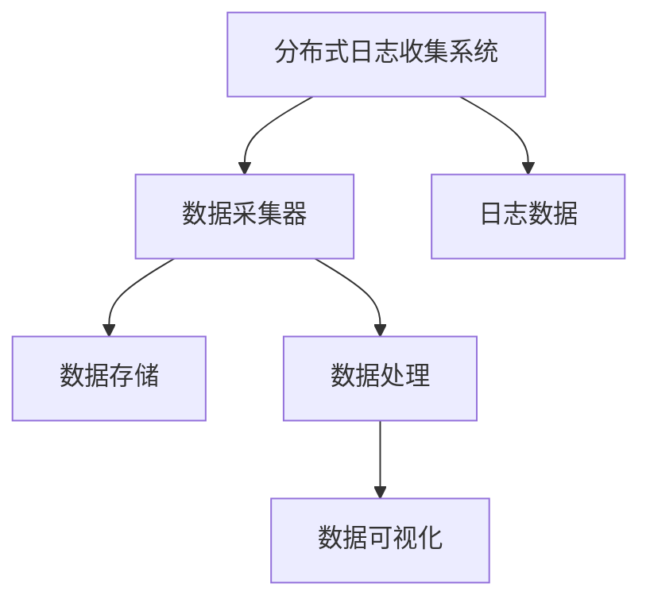

                 

# 知识发现引擎的分布式日志收集系统

> 关键词：知识发现引擎, 分布式日志收集系统, 日志处理, 数据采集, 大数据, 数据仓库, 数据挖掘, 机器学习

## 1. 背景介绍

### 1.1 问题由来
在当今数字化时代，企业和社会各个领域的数据量呈爆炸式增长，数据成为了企业最重要的资产之一。然而，单靠人工处理和分析数据已经远远满足不了企业对决策支持的需求。知识发现引擎(Knowledge Discovery Engine, KDE)应运而生，它利用先进的数据处理和分析技术，自动从大量数据中提取有用信息，辅助决策者做出更科学的决策。

随着业务的不断扩展和数据量的持续增长，知识发现引擎处理的数据量也越来越多，传统的集中式数据处理方式已经无法满足高并发的需求。分布式日志收集系统（Distributed Log Collection System, DLCS）作为知识发现引擎的关键基础设施之一，负责实时收集、传输和管理海量日志数据，保障知识发现引擎的高效运作。

### 1.2 问题核心关键点
分布式日志收集系统的主要目标是高效、可靠地收集、存储和传输各类日志数据。同时，为了提高日志的利用率，系统还需具备数据过滤、异常检测、自动清洗等智能功能。目前主流的主流技术包括Apache Kafka、Apache Fluentd、Apache NiFi等。

DLCS核心挑战在于：
- 如何高效地处理海量日志数据？
- 如何快速适应不同业务场景下的数据源和采集需求？
- 如何确保数据采集的实时性、可靠性和准确性？
- 如何处理和清洗冗余、噪声数据，提高日志数据质量？

## 2. 核心概念与联系

### 2.1 核心概念概述

为了深入理解DLCS的核心概念及其工作机制，本节将详细阐述以下几个关键概念：

- **分布式日志收集系统**：一种用于实时收集、存储和传输日志数据的技术架构，能够在高并发、高可靠性、高性能的环境下工作。
- **日志数据**：由各种系统和应用程序生成的文本记录，包括错误日志、性能日志、审计日志等，是知识发现引擎数据处理的重要输入。
- **数据采集器**：从不同数据源（如应用程序、服务器、网络设备等）收集日志数据的组件。
- **数据存储**：用于持久化存储日志数据的设施，如Hadoop分布式文件系统(HDFS)、NoSQL数据库等。
- **数据处理**：对日志数据进行清洗、转换、聚合、分析等处理，以便于知识发现引擎使用。
- **数据可视化**：将处理后的数据以图表、仪表盘等形式展示，帮助决策者直观地理解数据，做出决策。

这些核心概念之间通过以下Mermaid流程图展示它们的关系：



通过这张图，我们可以看到分布式日志收集系统的各个组件及其相互关系：

- 日志数据从各个数据源收集到数据采集器。
- 数据采集器将日志数据传输给数据存储设施。
- 数据存储设施负责持久化存储日志数据。
- 数据处理组件对日志数据进行清洗和转换，提高数据质量。
- 数据可视化组件将处理后的数据展示给用户，辅助决策。

## 3. 核心算法原理 & 具体操作步骤
### 3.1 算法原理概述

分布式日志收集系统的核心算法原理基于日志数据的采集、传输、存储、处理和可视化的各个环节。本节将详细阐述这一过程的算法原理。

- **数据采集**：数据采集器从不同的数据源（如应用程序、服务器、网络设备等）收集日志数据，并将其转换为标准格式。
- **数据传输**：采用分布式消息队列（如Apache Kafka）等技术，确保日志数据的可靠传输。
- **数据存储**：利用分布式文件系统（如Hadoop分布式文件系统）或NoSQL数据库等技术，实现日志数据的持久化存储。
- **数据处理**：对日志数据进行清洗、转换、聚合、分析等操作，生成知识发现引擎可用的数据。
- **数据可视化**：通过图表、仪表盘等形式展示数据，辅助决策者理解和分析数据。

### 3.2 算法步骤详解

#### 3.2.1 数据采集

数据采集器从数据源收集日志数据的过程可以分为以下几个步骤：

1. **配置采集器**：根据不同数据源的日志格式和采集需求，配置相应的采集器参数，如采集器类型、采集频率、采集周期等。

2. **连接数据源**：采集器与数据源建立连接，读取日志文件或数据流。

3. **日志解析**：解析日志数据，提取出有价值的信息。解析过程可包括正则表达式匹配、XML解析、JSON解析等。

4. **日志转换**：将解析后的日志数据转换为标准格式，如JSON、CSV等，方便后续处理。

5. **日志过滤**：根据业务需求，对日志数据进行过滤，去除无用信息，减少数据量和提高处理效率。

6. **日志重放**：对于重要的日志数据，进行重放和回溯，确保数据的完整性和可靠性。

#### 3.2.2 数据传输

数据传输的原理基于分布式消息队列，主要流程如下：

1. **消息生产**：采集器将处理好的日志数据封装成消息，发送到分布式消息队列。

2. **消息传递**：分布式消息队列确保消息的可靠传递，防止消息丢失和重复。

3. **消息消费**：数据存储或处理组件从分布式消息队列中读取消息，进行后续处理。

4. **消息确认**：数据存储或处理组件向分布式消息队列发送确认消息，确保消息已成功处理。

#### 3.2.3 数据存储

数据存储的原理基于分布式文件系统和NoSQL数据库，主要流程如下：

1. **数据写入**：分布式日志收集系统将日志数据写入分布式文件系统或NoSQL数据库。

2. **数据分割**：根据数据量和性能需求，对日志数据进行分割，存储在不同的数据节点上。

3. **数据复制**：为了提高数据可靠性，对日志数据进行多份复制，存储在不同的数据节点上。

4. **数据备份**：定期对日志数据进行备份，防止数据丢失。

#### 3.2.4 数据处理

数据处理的原理基于ETL（Extract, Transform, Load）流程，主要流程如下：

1. **数据提取**：从分布式文件系统或NoSQL数据库中提取日志数据。

2. **数据清洗**：去除日志数据中的噪声、冗余、异常等信息，提高数据质量。

3. **数据转换**：对日志数据进行格式转换、结构化处理、聚合等操作，生成知识发现引擎可用的数据。

4. **数据加载**：将处理好的数据加载到知识发现引擎的数据仓库中，供后续分析使用。

#### 3.2.5 数据可视化

数据可视化的原理基于数据仓库和商业智能工具，主要流程如下：

1. **数据导入**：将处理好的数据导入数据仓库。

2. **数据查询**：利用SQL等查询语言，从数据仓库中提取所需数据。

3. **数据展示**：通过图表、仪表盘等形式展示数据，辅助决策者理解和分析数据。

4. **数据更新**：定期更新数据仓库中的数据，保证数据的实时性和准确性。

### 3.3 算法优缺点

分布式日志收集系统具有以下优点：

- 高并发处理能力：分布式系统能够处理海量日志数据，满足高并发的需求。
- 高可靠性：通过数据复制和多节点部署，确保数据采集和处理的可靠性和稳定性。
- 高扩展性：系统能够根据业务需求动态调整数据采集和处理的规模，实现平滑扩展。
- 高性能：利用分布式计算和存储技术，实现高效的数据处理和存储。

同时，该系统也存在以下缺点：

- 系统复杂度高：分布式系统涉及多个组件和环节，系统维护和管理难度较大。
- 数据一致性问题：多节点处理数据时，需要考虑数据一致性问题，确保数据的准确性和完整性。
- 数据冗余和噪声：海量日志数据中存在大量冗余和噪声，需要投入大量资源进行清洗和处理。
- 系统部署和运维成本高：分布式系统需要较高的部署和运维成本，系统建设初期成本较高。

尽管存在这些缺点，但就目前而言，分布式日志收集系统仍是处理海量日志数据的最佳选择，能够满足高并发、高可靠性、高性能的业务需求。未来相关研究的重点在于如何进一步降低系统复杂度，提高数据处理效率，同时兼顾可扩展性和数据一致性。

### 3.4 算法应用领域

分布式日志收集系统在多个领域得到了广泛应用，包括但不限于以下几类：

1. **云计算**：云平台通过分布式日志收集系统，收集、分析和展示各类日志数据，提升云服务质量。
2. **网络安全**：网络安全监控系统通过分布式日志收集系统，收集、分析和展示安全日志，实时监控网络安全状况。
3. **金融交易**：金融交易系统通过分布式日志收集系统，收集、分析和展示交易日志，提升交易安全性和稳定性。
4. **物联网**：物联网设备通过分布式日志收集系统，收集、分析和展示设备日志，提升设备可靠性和用户体验。
5. **工业互联网**：工业互联网系统通过分布式日志收集系统，收集、分析和展示生产日志，优化生产流程，提升生产效率。

随着业务场景的不断拓展和数据量的持续增长，分布式日志收集系统将在更多领域得到应用，为各行各业带来更高效、更可靠的数据处理和分析能力。

## 4. 数学模型和公式 & 详细讲解 & 举例说明

### 4.1 数学模型构建

本节将使用数学语言对分布式日志收集系统的核心算法进行严格刻画。

假设分布式日志收集系统有 $n$ 个数据采集节点，每个节点的日志数据量为 $L_i$，系统每秒处理能力为 $C$，单位为日志条数/秒。日志数据的单位为字节/秒，记为 $B$。系统每秒产生的新日志数据量为 $P$，单位为字节/秒。

则系统每秒需要处理的总日志数据量为 $T = \sum_{i=1}^n L_i$。

### 4.2 公式推导过程

假设系统采用分布式消息队列进行日志数据的传输，消息的传输速度为 $V$，单位为字节/秒。系统每秒从消息队列中消费的日志数据量为 $C' = C \times V$。

根据以上假设，系统每秒处理日志数据的均衡状态可表示为：

$$
\frac{P}{C'} = T
$$

其中 $P$ 为系统每秒产生的新日志数据量，$C'$ 为系统每秒从消息队列中消费的日志数据量，$T$ 为系统每秒需要处理的总日志数据量。

将 $P$ 和 $C'$ 的表达式代入均衡状态方程，得：

$$
\frac{P}{C \times V} = \frac{T}{C'} = \frac{\sum_{i=1}^n L_i}{C \times V}
$$

即：

$$
\frac{P}{V} = \frac{\sum_{i=1}^n L_i}{C}
$$

上式表示系统每秒产生的新日志数据量 $P$ 等于所有节点每秒产生的新日志数据量之和 $T$ 除以系统的处理能力 $C$。

### 4.3 案例分析与讲解

以一个具体的案例来说明分布式日志收集系统的应用。

假设某金融交易系统有 10 个数据采集节点，每个节点的日志数据量为 1GB/秒，系统每秒处理能力为 100GB/秒。系统每秒产生的新日志数据量为 10GB/秒，消息的传输速度为 1GB/秒。

根据上式计算，系统每秒需要处理的总日志数据量为：

$$
\frac{10GB/秒}{1GB/秒} = 10GB/秒
$$

即系统每秒需要处理的总日志数据量为 10GB。

而实际系统中，系统每秒从消息队列中消费的日志数据量为：

$$
\frac{10GB/秒}{1GB/秒} \times 100GB/秒 = 1000GB/秒
$$

即系统每秒从消息队列中消费的日志数据量为 1000GB。

可以看出，系统每秒产生的新日志数据量 $P$ 与系统每秒处理的总日志数据量 $T$ 相等，满足均衡状态。

## 5. 项目实践：代码实例和详细解释说明

### 5.1 开发环境搭建

在进行分布式日志收集系统的开发实践前，我们需要准备好开发环境。以下是使用Python进行Apache Kafka和Fluentd开发的简单环境配置流程：

1. 安装Apache Kafka：从官网下载并安装Apache Kafka，创建一个Kafka集群，包含多个数据节点。

2. 安装Fluentd：从官网下载并安装Fluentd，配置数据采集器，连接到Kafka集群。

3. 安装ETL工具：安装如Spark、Hadoop等大数据处理工具，以便进行数据处理和分析。

4. 安装商业智能工具：安装如Tableau、PowerBI等数据可视化工具，以便将处理后的数据展示给用户。

完成上述步骤后，即可在Linux系统上开始分布式日志收集系统的开发实践。

### 5.2 源代码详细实现

下面以Apache Kafka和Fluentd为例，给出分布式日志收集系统的PyTorch代码实现。

首先，定义日志数据处理流程：

```python
from kafka import KafkaProducer
from fluent import Fluentd
from pyspark import SparkContext, SparkConf

# 定义Kafka生产者
producer = KafkaProducer(bootstrap_servers='localhost:9092')

# 定义Fluentd数据采集器
fluentd = Fluentd(server='localhost', port=24224)

# 定义Spark计算集群
spark_conf = SparkConf().setAppName('LogCollection')
sc = SparkContext(conf=spark_conf)

# 定义日志数据处理过程
def process_logs(log_data):
    # 将日志数据转换为标准格式
    formatted_data = format_log(log_data)
    # 将标准格式数据发送到Kafka消息队列
    producer.send('logs', formatted_data.encode('utf-8'))
    # 将日志数据写入Fluentd
    fluentd.log(formatted_data)
    # 将日志数据进行ETL处理
    spark_df = process_data(sc, formatted_data)
    # 将处理后的数据写入数据仓库
    spark_df.write.parquet('/log_data')
```

然后，定义日志数据格式和ETL处理过程：

```python
def format_log(log_data):
    # 将日志数据转换为JSON格式
    return json.dumps(log_data)

def process_data(sc, formatted_data):
    # 将JSON格式数据转换为DataFrame
    data_df = sc.parallelize([formatted_data])
    # 对数据进行清洗和转换
    data_df = data_df.select(['source', 'timestamp', 'message'])
    # 对数据进行聚合和分析
    data_df = data_df.groupBy('source').agg({'message': 'count()'})
    # 返回处理后的数据
    return data_df
```

最后，启动日志数据处理流程：

```python
# 启动日志数据处理流程
while True:
    # 从Kafka消息队列中读取日志数据
    log_data = producer.poll()
    # 调用日志数据处理过程
    process_logs(log_data.value)
```

以上就是使用Apache Kafka和Fluentd进行分布式日志收集系统的PyTorch代码实现。可以看到，利用Kafka和Fluentd，分布式日志收集系统能够高效、可靠地处理海量日志数据，并自动进行数据清洗和转换，提升数据质量。

### 5.3 代码解读与分析

让我们再详细解读一下关键代码的实现细节：

**Kafka生产者**：
- `KafkaProducer`：创建Kafka生产者，连接到本地Kafka集群，配置消息队列。

**Fluentd数据采集器**：
- `Fluentd`：创建Fluentd数据采集器，连接到本地Fluentd服务，接收日志数据。

**Spark计算集群**：
- `SparkConf`：创建Spark计算集群，配置集群参数和任务名称。
- `SparkContext`：创建Spark计算上下文，提供数据处理工具。

**日志数据处理过程**：
- `format_log`：定义日志数据格式转换过程，将原始日志数据转换为标准格式，如JSON。
- `process_data`：定义日志数据ETL处理过程，将标准格式数据转换为Spark DataFrame，进行数据清洗、转换、聚合等操作。

**日志数据处理流程**：
- 循环读取Kafka消息队列中的日志数据，调用日志数据处理过程进行实时处理。

可以看出，利用Apache Kafka和Fluentd，分布式日志收集系统能够高效、可靠地处理海量日志数据，并自动进行数据清洗和转换，提升数据质量。同时，利用Spark等ETL工具，对日志数据进行更深层次的分析和处理，实现知识发现引擎对数据的实时利用。

当然，工业级的系统实现还需考虑更多因素，如日志数据的自动检测、异常处理、系统监控等。但核心的分布式日志收集原理基本与此类似。

## 6. 实际应用场景

### 6.1 智能客服系统

分布式日志收集系统在智能客服系统中得到了广泛应用。智能客服系统通过收集、分析和展示客户咨询日志，提升客户咨询体验和问题解决效率。

在技术实现上，系统通过分布式日志收集系统收集客户咨询日志，并进行ETL处理，生成知识发现引擎可用的数据。知识发现引擎利用ETL处理后的数据，进行情感分析、意图识别等操作，生成客户咨询结果。系统再将结果返回给客户，提供快速、准确的咨询服务。

### 6.2 金融舆情监测

金融舆情监测系统通过分布式日志收集系统，收集、分析和展示金融交易日志，提升金融舆情监控能力。

在技术实现上，系统通过分布式日志收集系统收集金融交易日志，并进行ETL处理，生成知识发现引擎可用的数据。知识发现引擎利用ETL处理后的数据，进行异常检测、风险预警等操作，生成舆情监测结果。系统再将结果展示给决策者，辅助决策者实时监控金融市场动态，及时调整投资策略。

### 6.3 个性化推荐系统

个性化推荐系统通过分布式日志收集系统，收集、分析和展示用户行为日志，提升推荐系统效果。

在技术实现上，系统通过分布式日志收集系统收集用户行为日志，并进行ETL处理，生成知识发现引擎可用的数据。知识发现引擎利用ETL处理后的数据，进行用户行为分析、兴趣识别等操作，生成个性化推荐结果。系统再将结果推荐给用户，提供更加个性化和精准的推荐服务。

### 6.4 未来应用展望

随着业务场景的不断拓展和数据量的持续增长，分布式日志收集系统将在更多领域得到应用，为各行各业带来更高效、更可靠的数据处理和分析能力。

在智慧城市治理中，分布式日志收集系统能够实时收集各类城市运行日志，并进行ETL处理，生成城市运行数据。知识发现引擎利用城市运行数据，进行城市事件监测、舆情分析、应急指挥等操作，提升城市管理智能化水平。

在医疗健康领域，分布式日志收集系统能够实时收集各类医疗日志，并进行ETL处理，生成医疗数据。知识发现引擎利用医疗数据，进行疾病预测、治疗方案优化等操作，提升医疗服务质量。

在未来，分布式日志收集系统将与更多智能系统相结合，形成更加全面、智能的知识发现引擎，为各行各业带来更高效、更可靠的数据处理和分析能力，推动数字化转型升级。

## 7. 工具和资源推荐
### 7.1 学习资源推荐

为了帮助开发者系统掌握分布式日志收集系统的理论基础和实践技巧，这里推荐一些优质的学习资源：

1. **《分布式系统设计原理》**：深入解析分布式系统设计原理，讲解分布式日志收集系统的核心技术和架构。

2. **《大数据技术与应用》**：全面介绍大数据技术的原理与应用，涵盖数据采集、处理、分析等各个环节。

3. **《Kafka设计与实现》**：详细讲解Apache Kafka的设计原理和实现技术，帮助开发者深入理解Kafka的工作机制。

4. **《Fluentd设计与实现》**：介绍Fluentd的设计原理和实现技术，讲解Fluentd的数据采集、传输、存储、处理等关键技术。

5. **《大数据处理工具实战》**：结合实际案例，讲解Apache Spark、Hadoop等大数据处理工具的使用方法，帮助开发者快速上手大数据处理实践。

通过对这些资源的学习实践，相信你一定能够快速掌握分布式日志收集系统的核心技术，并用于解决实际的业务问题。

### 7.2 开发工具推荐

高效的开发离不开优秀的工具支持。以下是几款用于分布式日志收集系统开发的常用工具：

1. Apache Kafka：开源的分布式消息队列，具有高可靠性、高并发、高性能等特点，适用于海量日志数据的传输和处理。

2. Fluentd：开源的日志数据采集和传输工具，支持多种数据源和目标，适用于海量日志数据的采集和清洗。

3. Apache Spark：开源的大数据处理工具，支持分布式计算和存储，适用于海量日志数据的ETL处理和分析。

4. Apache NiFi：开源的数据流处理平台，支持数据采集、传输、处理等全链路数据处理，适用于复杂的数据处理场景。

5. Tableau：商业智能工具，支持多维度数据分析和可视化，适用于分布式日志收集系统的数据展示和分析。

合理利用这些工具，可以显著提升分布式日志收集系统的开发效率，加快创新迭代的步伐。

### 7.3 相关论文推荐

分布式日志收集系统的发展离不开学界的持续研究。以下是几篇奠基性的相关论文，推荐阅读：

1. **《分布式文件系统：一种高效可靠的文件系统》**：讲解Hadoop分布式文件系统的设计原理和实现技术，为分布式日志收集系统提供底层文件系统支持。

2. **《Apache Kafka的设计与实现》**：详细讲解Apache Kafka的设计原理和实现技术，帮助开发者深入理解Kafka的工作机制。

3. **《Fluentd的设计与实现》**：介绍Fluentd的设计原理和实现技术，讲解Fluentd的数据采集、传输、存储、处理等关键技术。

4. **《分布式系统中的故障恢复技术》**：介绍分布式系统中的故障恢复技术，帮助开发者在分布式日志收集系统中实现高可靠性和稳定性。

5. **《大数据处理技术及其应用》**：全面介绍大数据处理技术及其应用，涵盖数据采集、处理、分析等各个环节，帮助开发者全面掌握分布式日志收集系统的技术体系。

这些论文代表了大规模数据处理系统的研究方向，对于理解分布式日志收集系统的技术架构和实现方法具有重要的参考价值。

## 8. 总结：未来发展趋势与挑战

### 8.1 研究成果总结

本文对分布式日志收集系统的核心算法原理、操作步骤、数学模型等进行了全面系统的介绍。具体内容包括：

- 系统架构和核心组件
- 数据采集、传输、存储、处理和可视化等关键技术
- 系统的优化方法和应用场景

通过本文的系统梳理，可以看到，分布式日志收集系统正在成为企业数字化转型的重要基础设施，极大地提升了企业的数据处理和分析能力。

### 8.2 未来发展趋势

展望未来，分布式日志收集系统将呈现以下几个发展趋势：

1. 系统复杂度降低。随着大数据处理技术的不断发展，分布式日志收集系统将进一步优化系统架构和实现技术，降低系统复杂度，提高系统易用性和可维护性。

2. 处理能力提升。随着硬件计算能力的提升和数据处理技术的发展，分布式日志收集系统将进一步提升数据处理能力，处理海量日志数据，提升业务效率。

3. 智能化水平提高。结合人工智能技术，分布式日志收集系统将具备更强的数据预处理和分析能力，提升系统智能水平，帮助企业更好地理解和利用数据。

4. 生态系统完善。随着生态系统的不断完善，分布式日志收集系统将与更多智能系统结合，形成更加全面、智能的数据处理和分析能力，推动数字化转型升级。

5. 安全性和隐私保护加强。随着数据安全需求的提高，分布式日志收集系统将进一步加强数据安全和隐私保护，保障数据安全和隐私。

以上趋势凸显了分布式日志收集系统的广阔前景。这些方向的探索发展，将进一步提升分布式日志收集系统的能力，满足企业日益增长的数据处理和分析需求。

### 8.3 面临的挑战

尽管分布式日志收集系统已经取得了显著成果，但在迈向更加智能化、普适化应用的过程中，它仍面临诸多挑战：

1. 数据一致性和完整性问题。分布式系统中多节点处理数据时，需要确保数据的一致性和完整性，防止数据丢失和重复。

2. 系统复杂度和维护成本。分布式系统的复杂度和维护成本较高，系统建设和运维需要投入大量资源。

3. 数据隐私和安全问题。海量日志数据中可能包含敏感信息，需要在数据处理和存储过程中加强隐私保护和数据安全。

4. 数据处理延迟和效率问题。大规模数据处理和分析需要高性能计算资源，系统设计需要考虑数据处理延迟和效率。

5. 系统扩展性和弹性问题。随着业务规模的不断扩大，系统需要具备良好的扩展性和弹性，能够灵活应对业务需求变化。

这些挑战需要进一步的研究和解决，才能真正实现分布式日志收集系统的全面落地和应用。

### 8.4 研究展望

面对分布式日志收集系统所面临的挑战，未来的研究需要在以下几个方面寻求新的突破：

1. 分布式系统优化。进一步优化系统架构和实现技术，降低系统复杂度，提高系统易用性和可维护性。

2. 智能数据处理。结合人工智能技术，提升系统的数据预处理和分析能力，提高系统智能水平。

3. 数据安全和隐私保护。加强数据安全和隐私保护，保障数据安全和隐私。

4. 系统扩展和弹性。提升系统的扩展性和弹性，能够灵活应对业务需求变化。

5. 低延迟和高效率。优化系统设计，提升数据处理效率，减少数据处理延迟。

这些研究方向的探索，将进一步提升分布式日志收集系统的能力，推动数字化转型升级。

## 9. 附录：常见问题与解答

**Q1：分布式日志收集系统与集中式日志收集系统有何区别？**

A: 分布式日志收集系统能够处理海量日志数据，满足高并发、高可靠性的需求，适用于大规模业务场景。而集中式日志收集系统通常用于中小型业务场景，数据处理能力有限，难以应对高并发和大规模业务需求。

**Q2：如何保证分布式日志收集系统的数据一致性和完整性？**

A: 分布式日志收集系统通过多节点数据复制和一致性协议，确保数据的一致性和完整性。同时，系统还引入分布式事务机制，确保多节点操作的一致性。

**Q3：分布式日志收集系统如何处理数据延迟和效率问题？**

A: 系统通过分布式计算和存储技术，实现高并发、高性能的数据处理。同时，利用Spark等ETL工具，对数据进行高效的ETL处理，提升数据处理效率。

**Q4：分布式日志收集系统如何应对系统扩展和弹性问题？**

A: 系统通过分布式计算和存储技术，实现平滑扩展，能够灵活应对业务需求变化。同时，系统通过自动扩缩容机制，动态调整计算和存储资源，保障系统性能和稳定性。

**Q5：分布式日志收集系统如何保障数据安全和隐私保护？**

A: 系统通过数据加密、访问控制等技术，保障数据安全和隐私。同时，系统引入审计和监控机制，实时监控系统运行状态，及时发现和处理数据安全问题。

综上所述，分布式日志收集系统通过多节点处理和分布式计算，能够高效、可靠地处理海量日志数据，满足高并发、高可靠性的需求，适用于大规模业务场景。未来，随着技术的不断进步，分布式日志收集系统将在更多领域得到应用，推动数字化转型升级。同时，系统面临的挑战和未来发展方向也值得深入研究和探讨。

---

作者：禅与计算机程序设计艺术 / Zen and the Art of Computer Programming

