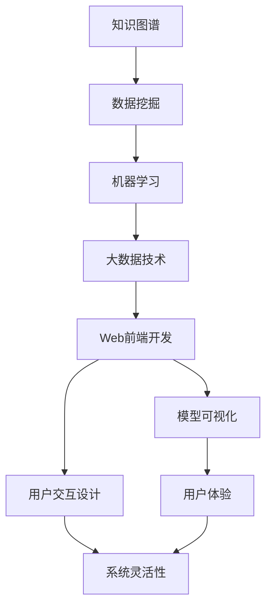

                 

# 知识发现引擎的前端技术选型与实现

> 关键词：知识图谱,数据挖掘,机器学习,大数据技术,Web前端开发,模型可视化,用户交互

## 1. 背景介绍

### 1.1 问题由来

随着互联网技术的发展，信息爆炸和数据增长的趋势使得人们对信息处理和知识发现的需求日益强烈。为了满足这一需求，从简单的网页爬虫到复杂的数据挖掘系统，从传统的数据库管理到新的知识图谱和深度学习模型，前端技术在知识发现引擎的建设过程中扮演了重要的角色。本文将详细介绍知识发现引擎的前端技术选型与实现。

### 1.2 问题核心关键点

前端技术在知识发现引擎中主要涉及以下几个关键点：

- 数据可视化与展示：如何通过Web前端技术，将复杂的数据结构直观地展示给用户。
- 用户交互设计：如何设计友好的用户界面，使用户能够方便地操作知识发现引擎，进行数据查询、筛选和分析。
- 动态渲染与更新：如何在用户交互过程中，动态地渲染数据展示界面，并实时更新。
- 数据交互与安全性：如何保证前端数据交互的安全性，防止数据泄露和滥用。
- 模型可视化与交互：如何将复杂的机器学习模型和算法结果以可视化的方式展示给用户，使用户能够理解模型决策过程。

### 1.3 问题研究意义

前端技术在知识发现引擎的构建中，对于提升用户体验、扩展用户功能、优化系统性能等方面具有重要意义：

1. 提升用户体验：通过直观的数据可视化，帮助用户理解数据，发现数据中的规律和趋势，提升数据分析效率。
2. 扩展用户功能：前端技术能够支持更丰富的用户操作和交互方式，如筛选、排序、过滤、动态数据加载等，增强系统的灵活性和交互性。
3. 优化系统性能：前端技术能够实现对复杂数据结构的处理和展示，支持快速渲染和大规模数据展示，提升系统性能。
4. 强化数据安全性：前端技术能够通过多种方式保护数据安全，如用户认证、数据加密、权限控制等，保障数据隐私和安全。
5. 提升模型可解释性：通过模型可视化技术，使复杂的机器学习算法和决策过程更加透明，提升模型的可解释性和可信度。

## 2. 核心概念与联系

### 2.1 核心概念概述

为更好地理解知识发现引擎的前端技术选型与实现，本节将介绍几个密切相关的核心概念：

- **知识图谱(Knowledge Graph)**：一种将实体和实体之间的关系以图的形式进行表示的数据结构，能够有效捕捉实体之间的复杂关系。
- **数据挖掘(Data Mining)**：通过算法从数据中提取有用信息和知识的过程，常见方法包括聚类、分类、关联规则挖掘等。
- **机器学习(Machine Learning)**：一种让计算机通过数据训练进行预测或决策的算法，包括监督学习、无监督学习和强化学习等。
- **大数据技术(Big Data Technology)**：用于处理和分析大规模数据的多种技术，包括分布式存储和计算、实时数据处理等。
- **Web前端开发(Web Frontend Development)**：指开发Web前端页面和交互功能的过程，涉及HTML、CSS、JavaScript等多种技术。
- **模型可视化(Model Visualization)**：将复杂的机器学习模型和算法结果以图形或图表的形式展示出来，增强模型的可解释性和可视性。
- **用户交互设计(User Interaction Design)**：指设计用户界面和交互方式，使用户能够方便、自然地与系统进行交互。

这些核心概念之间的逻辑关系可以通过以下Mermaid流程图来展示：



这个流程图展示出知识发现引擎的各个技术环节，以及前端技术在其中扮演的重要角色。前端技术不仅负责数据的展示和交互，还与后端的机器学习和大数据技术紧密联系，共同为用户提供全面的知识发现服务。

## 3. 核心算法原理 & 具体操作步骤

### 3.1 算法原理概述

知识发现引擎的前端技术选型与实现，其核心在于如何将复杂的数据结构和机器学习算法以可视化和用户友好的方式展示出来。这涉及以下两个主要步骤：

1. **数据可视化**：将数据结构转化为图形、图表等形式，帮助用户理解数据。
2. **模型可视化**：将机器学习模型和算法结果以直观的方式展示，增强模型的可解释性。

### 3.2 算法步骤详解

#### 3.2.1 数据可视化

1. **数据处理**：将原始数据进行清洗、归一化、过滤等处理，提取有用信息。
2. **可视化工具选择**：选择适合的可视化工具，如D3.js、ECharts等，根据数据类型和展示需求选择可视化类型，如柱状图、饼图、散点图等。
3. **数据展示**：将处理后的数据通过可视化工具绘制成图形，展示在Web前端页面上。
4. **交互设计**：设计交互界面，如数据筛选、排序、动态加载等，提升用户体验。

#### 3.2.2 模型可视化

1. **模型选择**：选择合适的机器学习模型，如决策树、随机森林、神经网络等。
2. **模型训练**：使用大数据技术对模型进行训练，得到模型参数。
3. **模型展示**：将模型参数转化为图形形式，展示在Web前端页面上。
4. **交互设计**：设计交互界面，如参数调整、模型测试等，帮助用户理解模型决策过程。

### 3.3 算法优缺点

#### 3.3.1 数据可视化

- **优点**：
  - 直观展示数据，易于用户理解和使用。
  - 支持多种数据类型和展示方式，灵活性强。
  - 动态更新和交互设计，提升用户体验。

- **缺点**：
  - 数据展示复杂度较高，需花费大量时间处理和展示。
  - 对用户交互设计要求较高，需要综合考虑用户体验和系统性能。
  - 数据安全性和隐私保护需要额外处理。

#### 3.3.2 模型可视化

- **优点**：
  - 增强模型可解释性，使用户理解模型决策过程。
  - 动态展示模型参数和结果，提升用户交互体验。
  - 多种可视化方式和工具，满足不同需求。

- **缺点**：
  - 复杂模型展示困难，需深入理解模型结构。
  - 可视化效果和用户理解度受限于展示工具和数据量。
  - 交互设计需平衡复杂性和用户体验。

### 3.4 算法应用领域

前端技术在知识发现引擎中的应用广泛，涵盖多个领域：

- **商业智能(Business Intelligence, BI)**：用于企业内部的数据挖掘和分析，提供决策支持。
- **医疗健康**：用于医疗数据的可视化，帮助医生分析患者信息，提高诊疗效率。
- **金融领域**：用于金融数据的可视化分析，提供市场分析和风险管理工具。
- **教育领域**：用于教育数据的可视化，支持学生分析和教育评估。
- **科学研究**：用于科学数据的可视化，支持科研数据分析和结果展示。

## 4. 数学模型和公式 & 详细讲解

### 4.1 数学模型构建

本节将使用数学语言对知识发现引擎的前端技术选型与实现过程进行更加严格的刻画。

记原始数据集为 $D=\{(x_i, y_i)\}_{i=1}^N$，其中 $x_i$ 为输入特征，$y_i$ 为输出标签。设知识图谱表示为 $\mathcal{G}=(\mathcal{V}, \mathcal{E})$，其中 $\mathcal{V}$ 为节点集合，$\mathcal{E}$ 为边集合，每条边表示两个实体之间的关系。设机器学习模型为 $M$，其参数为 $\theta$。

### 4.2 公式推导过程

#### 4.2.1 数据可视化

1. **数据处理**：将原始数据集 $D$ 进行清洗、归一化等处理，得到处理后的数据集 $D'$。
2. **可视化工具选择**：选择可视化工具 $V$，将处理后的数据集 $D'$ 转化为图形形式。
3. **数据展示**：将图形展示在Web前端页面上，供用户查看。

#### 4.2.2 模型可视化

1. **模型选择**：选择机器学习模型 $M$，其参数为 $\theta$。
2. **模型训练**：使用大数据技术对模型进行训练，得到模型参数 $\hat{\theta}$。
3. **模型展示**：将模型参数 $\hat{\theta}$ 转化为图形形式，展示在Web前端页面上。

### 4.3 案例分析与讲解

#### 4.3.1 数据可视化案例

假设我们要展示一个电商网站的商品销售数据。首先，我们需要对原始数据进行清洗和处理，提取有用的信息，如销售额、销售量、用户购买行为等。然后，选择合适的可视化工具，如ECharts，将其转化为柱状图、饼图、散点图等形式，展示在Web前端页面上。最后，设计交互界面，允许用户筛选、排序、动态加载数据，提升用户体验。

#### 4.3.2 模型可视化案例

假设我们要展示一个股票市场的预测模型。首先，我们需要选择合适的机器学习模型，如随机森林、神经网络等。然后，使用大数据技术对模型进行训练，得到模型参数。接着，将模型参数转化为图形形式，展示在Web前端页面上。最后，设计交互界面，允许用户调整模型参数、进行模型测试，帮助用户理解模型决策过程。

## 5. 项目实践：代码实例和详细解释说明

### 5.1 开发环境搭建

在进行前端技术选型与实现前，我们需要准备好开发环境。以下是使用JavaScript和Node.js搭建前端开发环境的流程：

1. 安装Node.js和npm：从官网下载并安装Node.js，并配置npm为全局命令行工具。
2. 安装ESLint和Prettier：这两个工具用于代码风格检查和格式化，确保代码质量。
3. 创建项目目录：创建一个新的项目目录，初始化npm包管理器。
4. 编写代码：使用JavaScript编写前端代码，并使用npm安装需要的第三方库。

### 5.2 源代码详细实现

以下是一个使用ECharts进行数据可视化的示例代码，用于展示电商网站的商品销售数据。

```javascript
import echarts from 'echarts/lib/echarts';
import 'echarts/lib/chart/pie';

const data = [
    { name: '商品A', value: 100 },
    { name: '商品B', value: 200 },
    { name: '商品C', value: 150 },
    { name: '商品D', value: 50 }
];

const option = {
    title: { text: '商品销售数据' },
    tooltip: {},
    tooltipTemplate: '{a}：{b}',
    visualMap: { type: 'piecewise' },
    series: [
        {
            name: '商品销售',
            type: 'pie',
            radius: ['50%', '90%'],
            data: data,
            itemStyle: { color: '#b3d4fc' }
        }
    ]
};

echarts.init(document.getElementById('chart'), option);
```

### 5.3 代码解读与分析

让我们再详细解读一下关键代码的实现细节：

**ECharts库引入**：
- `import echarts from 'echarts/lib/echarts';`：从ECharts库中导入echarts模块。
- `import 'echarts/lib/chart/pie';`：导入饼图图表模块。

**数据准备**：
- `const data = [...]`：定义原始数据，包括商品名称和销售量。

**可视化配置**：
- `const option = {...}`：定义ECharts的配置选项，包括图表类型、样式等。
- `title`：设置图表标题。
- `tooltip`：设置鼠标悬停时的提示信息。
- `tooltipTemplate`：设置提示信息的格式化模板。
- `visualMap`：设置数据范围映射，用于动态展示数据。
- `series`：定义数据系列，包括图表类型和数据。

**图表渲染**：
- `echarts.init(document.getElementById('chart'), option);`：初始化ECharts实例，并将配置选项传递给它。

以上代码展示了如何使用ECharts库进行简单的数据可视化，将原始数据转化为饼图形式展示。开发者可以根据具体需求，进一步定制和优化配置选项，实现更加复杂的数据可视化效果。

### 5.4 运行结果展示

运行以上代码，会在页面上生成一个饼图，展示商品A、B、C、D的销售情况。用户可以通过鼠标悬停查看详细数据，并通过数据范围映射了解销售量的分布情况。

## 6. 实际应用场景

### 6.1 商业智能(BI)

商业智能系统（BI）是知识发现引擎的前端技术选型与实现的重要应用场景之一。通过Web前端技术，商业智能系统可以将复杂的数据结构和分析结果直观地展示给决策者，帮助其做出更科学的决策。

例如，一个电商BI系统可以展示商品销售数据、用户购买行为数据、营销活动效果等，通过数据可视化，帮助企业优化营销策略，提升销售业绩。

### 6.2 医疗健康

在医疗健康领域，知识发现引擎可以用于患者数据分析、疾病预测、诊疗辅助等。通过Web前端技术，将患者数据、诊断结果等以直观的形式展示出来，帮助医生分析病情，制定诊疗方案。

例如，一个医院BI系统可以展示患者基本信息、诊断记录、治疗效果等，通过数据可视化，帮助医生分析患者病情，提高诊疗效率。

### 6.3 金融领域

金融领域的知识发现引擎可以用于市场分析、风险管理、客户分析等。通过Web前端技术，将市场数据、客户行为数据等以直观的形式展示出来，帮助金融机构做出更准确的决策。

例如，一个银行BI系统可以展示股票市场数据、客户交易记录、客户行为数据等，通过数据可视化，帮助银行分析市场趋势，预测风险。

### 6.4 教育领域

在教育领域，知识发现引擎可以用于学生数据分析、课程评价、教育评估等。通过Web前端技术，将学生数据、课程数据等以直观的形式展示出来，帮助教育机构优化教学方案，提升教育质量。

例如，一个学校BI系统可以展示学生成绩、课程评价、班级管理等，通过数据可视化，帮助学校分析学生表现，提升教学质量。

### 6.5 科学研究

在科学研究领域，知识发现引擎可以用于数据分析、结果展示等。通过Web前端技术，将科学数据、实验结果等以直观的形式展示出来，帮助科学家分析实验数据，提升研究效率。

例如，一个科研项目BI系统可以展示实验数据、实验结果、研究进展等，通过数据可视化，帮助科学家分析实验数据，提升研究效率。

## 7. 工具和资源推荐

### 7.1 学习资源推荐

为了帮助开发者系统掌握知识发现引擎的前端技术选型与实现的理论基础和实践技巧，这里推荐一些优质的学习资源：

1. **ECharts官方文档**：提供详细的API文档和示例代码，帮助开发者快速上手使用ECharts。
2. **D3.js官方文档**：提供丰富的API文档和示例代码，支持多种数据可视化方式。
3. **Highcharts官方文档**：提供详细的API文档和示例代码，支持多种图表类型。
4. **学习资源**：包括在线课程、书籍、博客等，如Coursera、edX、Udacity等。

通过对这些资源的学习实践，相信你一定能够快速掌握前端技术在知识发现引擎中的应用，并用于解决实际的NLP问题。

### 7.2 开发工具推荐

高效的开发离不开优秀的工具支持。以下是几款用于知识发现引擎开发的前端开发工具：

1. **VSCode**：一款轻量级的代码编辑器，支持JavaScript、Node.js等多种语言和框架。
2. **WebStorm**：一款专业的Web前端开发工具，支持JavaScript、TypeScript等语言。
3. **Visual Studio Code**：一款轻量级的代码编辑器，支持JavaScript、Node.js等多种语言和框架。
4. **Sublime Text**：一款流行的文本编辑器，支持多种编程语言和插件。
5. **Atom**：一款开源的文本编辑器，支持JavaScript、Node.js等多种语言和插件。

合理利用这些工具，可以显著提升知识发现引擎的开发效率，加快创新迭代的步伐。

### 7.3 相关论文推荐

知识发现引擎的前端技术选型与实现的研究源于学界的持续研究。以下是几篇奠基性的相关论文，推荐阅读：

1. **ECharts官方论文**：详细介绍ECharts库的开发过程和使用方法，提供丰富的算法和应用案例。
2. **D3.js官方论文**：详细介绍D3.js库的开发过程和使用方法，提供丰富的算法和应用案例。
3. **Highcharts官方论文**：详细介绍Highcharts库的开发过程和使用方法，提供丰富的算法和应用案例。
4. **《Web前端开发》书籍**：详细介绍Web前端开发的理论基础和实践技巧，涵盖HTML、CSS、JavaScript等多种技术。
5. **《JavaScript高级程序设计》书籍**：详细介绍JavaScript语言的高级特性和开发技巧，涵盖面向对象编程、异步编程等多种技术。

这些论文和书籍代表了大语言模型微调技术的发展脉络。通过学习这些前沿成果，可以帮助研究者把握学科前进方向，激发更多的创新灵感。

## 8. 总结：未来发展趋势与挑战

### 8.1 总结

本文对知识发现引擎的前端技术选型与实现进行了全面系统的介绍。首先阐述了知识发现引擎的前端技术选型与实现的背景和意义，明确了前端技术在知识发现引擎中的应用场景和价值。其次，从原理到实践，详细讲解了前端技术在数据可视化和模型可视化中的作用，给出了具体的代码实例和实现细节。同时，本文还广泛探讨了前端技术在商业智能、医疗健康、金融领域等实际应用场景中的应用，展示了前端技术的巨大潜力。最后，本文精选了前端技术的各类学习资源，力求为读者提供全方位的技术指引。

通过本文的系统梳理，可以看到，前端技术在知识发现引擎的构建中，对于提升用户体验、扩展用户功能、优化系统性能等方面具有重要意义。前端技术不仅负责数据的展示和交互，还与后端的机器学习和大数据技术紧密联系，共同为用户提供全面的知识发现服务。

### 8.2 未来发展趋势

展望未来，前端技术在知识发现引擎中的应用将呈现以下几个发展趋势：

1. **数据可视化技术不断进步**：随着数据量的不断增长，前端技术将不断发展，支持更复杂的数据结构和展示方式，帮助用户更直观地理解数据。
2. **模型可视化技术提升**：随着机器学习模型的复杂度不断提升，前端技术将提供更加灵活和互动的模型可视化方式，增强模型的可解释性和可视性。
3. **跨平台交互设计**：前端技术将支持更多设备平台，如移动端、桌面端、嵌入式设备等，提升用户交互体验。
4. **实时交互和动态渲染**：前端技术将支持实时交互和动态渲染，提升用户交互体验。
5. **增强现实(AR)和虚拟现实(VR)集成**：前端技术将与AR和VR技术结合，提供更加沉浸式的用户体验。
6. **人工智能与前端技术融合**：前端技术将与AI技术结合，提供更加智能和个性化的用户交互体验。

以上趋势凸显了前端技术在知识发现引擎的构建中，对于提升用户体验、扩展用户功能、优化系统性能等方面的巨大潜力。

### 8.3 面临的挑战

尽管前端技术在知识发现引擎中的应用已经取得了显著进展，但在迈向更加智能化、普适化应用的过程中，它仍面临着诸多挑战：

1. **数据量增大带来的性能瓶颈**：随着数据量的不断增长，前端技术需要处理的数据规模也将不断增大，如何保证高性能和低延迟成为一大挑战。
2. **数据交互复杂性增加**：前端技术需要支持更复杂的数据交互方式，如多维度筛选、数据聚合、数据关联等，需要不断优化和升级。
3. **数据安全性和隐私保护**：前端技术需要保护用户数据安全，防止数据泄露和滥用，需加入数据加密、权限控制等安全措施。
4. **用户交互界面的优化**：前端技术需要设计友好的用户界面，使用户能够方便地操作知识发现引擎，需要不断优化和升级。
5. **用户体验的持续提升**：前端技术需要不断提升用户体验，满足用户不断变化的需求，需要不断优化和升级。

### 8.4 研究展望

面对前端技术在知识发现引擎应用中面临的挑战，未来的研究需要在以下几个方面寻求新的突破：

1. **高性能数据处理和展示技术**：开发更加高效的数据处理和展示技术，支持大规模数据展示和实时交互，提升用户体验。
2. **智能化的交互设计**：研究智能化交互设计方法，提升用户交互体验。
3. **数据安全性和隐私保护技术**：研究数据安全性和隐私保护技术，保护用户数据安全。
4. **跨平台交互设计**：研究跨平台交互设计方法，提升用户在不同设备上的交互体验。
5. **模型可视化技术的提升**：研究更加灵活和互动的模型可视化技术，增强模型的可解释性和可视性。
6. **人工智能与前端技术的融合**：研究人工智能与前端技术的融合方法，提升系统的智能化和自动化水平。

这些研究方向的探索，必将引领前端技术在知识发现引擎中的应用迈向更高的台阶，为构建更加智能和个性化的知识发现系统铺平道路。

## 9. 附录：常见问题与解答

**Q1：前端技术选型与实现的核心关键点有哪些？**

A: 前端技术选型与实现的核心关键点包括：
- 数据可视化与展示：如何通过Web前端技术，将复杂的数据结构直观地展示给用户。
- 用户交互设计：如何设计友好的用户界面，使用户能够方便地操作知识发现引擎，进行数据查询、筛选和分析。
- 动态渲染与更新：如何在用户交互过程中，动态地渲染数据展示界面，并实时更新。
- 数据交互与安全性：如何保证前端数据交互的安全性，防止数据泄露和滥用。
- 模型可视化与交互：如何将复杂的机器学习模型和算法结果以可视化的方式展示，增强模型的可解释性。

**Q2：前端技术选型与实现对数据可视化有哪些要求？**

A: 前端技术选型与实现对数据可视化有以下要求：
- 直观展示数据：能够将复杂的数据结构转化为图形、图表等形式，帮助用户理解数据。
- 支持多种数据类型和展示方式：能够支持多种数据类型和展示方式，如柱状图、饼图、散点图等，灵活性强。
- 动态更新和交互设计：能够设计交互界面，如数据筛选、排序、动态加载等，提升用户体验。
- 数据安全性和隐私保护：能够保护数据安全，防止数据泄露和滥用，需加入数据加密、权限控制等安全措施。

**Q3：前端技术选型与实现对模型可视化有哪些要求？**

A: 前端技术选型与实现对模型可视化有以下要求：
- 增强模型可解释性：能够将复杂的机器学习模型和算法结果以图形或图表的形式展示出来，增强模型的可解释性和可视性。
- 动态展示模型参数和结果：能够动态展示模型参数和结果，帮助用户理解模型决策过程。
- 多种可视化方式和工具：能够提供多种可视化方式和工具，满足不同需求。
- 交互设计：能够设计交互界面，如参数调整、模型测试等，帮助用户理解模型决策过程。

**Q4：前端技术选型与实现对用户交互设计有哪些要求？**

A: 前端技术选型与实现对用户交互设计有以下要求：
- 友好的用户界面：能够设计友好的用户界面，使用户能够方便地操作知识发现引擎，进行数据查询、筛选和分析。
- 交互方式的多样性：能够支持多种交互方式，如点击、拖拽、键盘输入等，提升用户体验。
- 交互界面的灵活性：能够根据不同的数据结构和展示需求，设计灵活的交互界面，满足用户需求。
- 交互界面的响应性：能够保证交互界面的响应性，提升用户体验。

**Q5：前端技术选型与实现对数据交互安全性有哪些要求？**

A: 前端技术选型与实现对数据交互安全性有以下要求：
- 数据加密：能够对数据进行加密，防止数据泄露和滥用。
- 权限控制：能够对用户权限进行控制，防止未经授权的数据访问。
- 安全认证：能够进行安全认证，防止非法访问。
- 安全监控：能够进行安全监控，及时发现并处理安全问题。

---

作者：禅与计算机程序设计艺术 / Zen and the Art of Computer Programming

