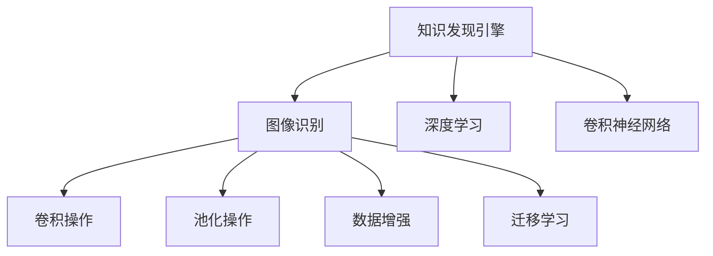

                 

# 知识发现引擎的图像识别技术应用

> 关键词：知识发现引擎,图像识别,深度学习,卷积神经网络,卷积操作,池化操作,数据增强,迁移学习,迁移学习范式

## 1. 背景介绍

### 1.1 问题由来
在信息化时代，数据已经成为一种宝贵的资源。传统的数据处理方法主要依赖统计学和数据挖掘技术，但这些方法在处理大规模、复杂的数据集时显得力不从心。知识发现(Knowledge Discovery in Databases, KDD)逐渐成为新兴的领域，旨在从大量数据中挖掘出有用的知识和规律。

随着计算机视觉技术的进步，图像识别在KDD中起到了越来越重要的作用。图像包含着丰富的信息，如何高效准确地从图像数据中提取出知识，是KDD领域的一个重要研究方向。传统的图像识别方法基于手动设计特征，难以处理复杂场景，而新兴的深度学习技术，特别是卷积神经网络(CNN)，为图像识别带来了革命性的突破。

## 2. 核心概念与联系

### 2.1 核心概念概述

为更好地理解知识发现引擎中的图像识别技术，本节将介绍几个密切相关的核心概念：

- 知识发现引擎(Knowledge Discovery Engine, KDE)：通过数据挖掘、统计学和机器学习技术，从大规模数据集中提取有用知识和规律的系统。
- 图像识别(Image Recognition)：利用计算机视觉技术，自动识别图像中物体、场景和特征的过程。
- 深度学习(Deep Learning)：一种通过多层神经网络模型进行特征学习和泛化的机器学习方法，广泛应用于图像识别、语音识别等领域。
- 卷积神经网络(Convolutional Neural Network, CNN)：一种基于卷积操作的深度学习模型，特别适用于图像和视频等二维数据的处理。
- 卷积操作(Convolution)：CNN的核心操作，通过滤波器在图像数据上滑动，提取局部特征的过程。
- 池化操作(Pooling)：用于降低卷积后的特征图尺寸，减少参数量和计算量，同时保留关键特征。
- 数据增强(Data Augmentation)：通过一系列变换，生成新的训练数据，以扩充训练集，提高模型泛化能力。
- 迁移学习(Transfer Learning)：将一个领域学习到的知识，迁移应用到另一个不同但相关的领域的学习范式。

这些核心概念之间的逻辑关系可以通过以下Mermaid流程图来展示：



这个流程图展示了一个典型的知识发现引擎应用场景，其中图像识别技术通过深度学习模型和CNN实现，同时采用了卷积、池化和迁移学习等关键技术。

## 3. 核心算法原理 & 具体操作步骤
### 3.1 算法原理概述

知识发现引擎中的图像识别技术，本质上是通过深度学习模型对图像数据进行特征学习和分类。其核心思想是：利用CNN模型，通过多层卷积和池化操作，提取图像中的关键特征，再利用全连接层进行分类。

具体来说，CNN模型由多个卷积层和池化层交替堆叠而成，每一层的输出作为下一层的输入。卷积层通过滤波器在输入图像上滑动，提取局部特征，池化层则通过聚合操作，减小特征图尺寸，提高模型泛化能力。在训练阶段，通过反向传播算法更新模型参数，最小化损失函数。在测试阶段，将新的图像输入模型，通过softmax层输出类别概率分布，选取概率最大的类别作为预测结果。

### 3.2 算法步骤详解

知识发现引擎中的图像识别技术应用通常包括以下几个关键步骤：

**Step 1: 数据预处理**
- 收集和清洗图像数据，划分为训练集、验证集和测试集。
- 对图像进行标准化和归一化处理，转换为模型可接受的格式。

**Step 2: 模型选择与初始化**
- 选择合适的CNN模型架构，如VGG、ResNet、Inception等。
- 初始化模型权重，通常使用预训练模型的小批量均值或随机初始化。

**Step 3: 模型训练**
- 将训练集数据分批次输入模型，前向传播计算损失函数。
- 反向传播计算参数梯度，根据设定的优化算法和学习率更新模型参数。
- 周期性在验证集上评估模型性能，根据性能指标决定是否触发Early Stopping。
- 重复上述步骤直至满足预设的迭代轮数或Early Stopping条件。

**Step 4: 模型评估**
- 在测试集上评估微调后模型的性能，对比微调前后的精度提升。
- 使用模型对新图像进行推理预测，集成到知识发现引擎中。

**Step 5: 持续学习**
- 持续收集新的图像数据，定期重新微调模型，以适应数据分布的变化。

以上是知识发现引擎应用图像识别技术的通用流程。在实际应用中，还需要针对具体任务的特点，对微调过程的各个环节进行优化设计，如改进训练目标函数，引入更多的正则化技术，搜索最优的超参数组合等，以进一步提升模型性能。

### 3.3 算法优缺点

知识发现引擎中的图像识别技术具有以下优点：
1. 高效准确：通过卷积操作提取局部特征，提高了特征提取的效率和准确性。
2. 模型泛化能力强：通过池化操作减小特征图尺寸，提高了模型的泛化能力。
3. 可扩展性强：通过迁移学习范式，可以快速适应新的任务和数据分布。

同时，该方法也存在一定的局限性：
1. 计算资源需求高：CNN模型参数量大，训练和推理计算复杂度高。
2. 依赖高质量标注数据：需要大量标注好的图像数据，获取成本较高。
3. 对抗样本敏感：卷积操作对输入噪声和对抗样本的鲁棒性较低。
4. 可解释性不足：模型的决策过程缺乏可解释性，难以对其推理逻辑进行分析和调试。

尽管存在这些局限性，但就目前而言，基于卷积神经网络的图像识别方法仍然是知识发现引擎中最为主流和有效的技术范式。未来相关研究的重点在于如何进一步降低计算资源需求，提高模型对抗样本的鲁棒性，同时兼顾可解释性和伦理安全性等因素。

### 3.4 算法应用领域

基于卷积神经网络的图像识别技术在知识发现引擎中的应用，已经在诸多领域取得了显著成果。

- 医疗影像分析：通过对医学影像数据进行图像识别，辅助医生诊断病情，预测病程发展趋势。
- 智能制造质量检测：利用图像识别技术对生产线上的产品进行缺陷检测，提升产品质量。
- 食品质量监控：通过图像识别技术对食品图片进行分类和分析，保证食品安全和质量。
- 交通违规检测：对交通监控摄像头拍摄的图片进行图像识别，自动识别违规行为。
- 文物修复：利用图像识别技术对历史文物图片进行修复和鉴定，保护文化遗产。
- 农业病虫害监测：通过图像识别技术对农田图片进行病虫害检测，提前采取防治措施。

除了上述这些经典应用外，知识发现引擎中的图像识别技术还广泛应用于军事、金融、司法等领域，为各行各业的知识发现提供了新的视角和工具。

## 4. 数学模型和公式 & 详细讲解  
### 4.1 数学模型构建

知识发现引擎中的图像识别技术主要通过卷积神经网络实现，其数学模型如下：

记输入图像为 $x \in \mathbb{R}^{H \times W \times C}$，其中 $H$ 和 $W$ 分别是图像的高度和宽度，$C$ 表示通道数。

假设卷积层采用 $3 \times 3$ 的卷积核，步长为 $1$，则卷积操作可以表示为：

$$
y_{i,j}^{(l+1)}=\sum_{k=0}^{C-1}\sum_{s=-1}^{1}\sum_{t=-1}^{1}x_{i+s,j+t,k} * w_{k,s,t}
$$

其中 $w_{k,s,t}$ 是第 $k$ 通道的第 $(s,t)$ 卷积核。

经过多次卷积和池化操作后，特征图尺寸逐渐减小，最终经过全连接层输出类别概率分布：

$$
\hat{y}=\text{softmax}(w^Tz+b)
$$

其中 $z$ 是卷积层和全连接层的线性变换结果，$w$ 和 $b$ 分别是全连接层的权重和偏置。

### 4.2 公式推导过程

以二分类问题为例，假设输入图像 $x$ 经过若干卷积和池化操作后得到特征图 $z$，全连接层输出为 $\hat{y} \in [0,1]$，表示样本属于正类的概率。真实标签 $y \in \{0,1\}$。则二分类交叉熵损失函数定义为：

$$
\ell(M_{\theta}(x),y) = -[y\log \hat{y} + (1-y)\log(1-\hat{y})]
$$

将其代入经验风险公式，得：

$$
\mathcal{L}(\theta) = -\frac{1}{N}\sum_{i=1}^N [y_i\log M_{\theta}(x_i)+(1-y_i)\log(1-M_{\theta}(x_i))]
$$

其中 $M_{\theta}$ 表示整个CNN模型的参数。

在训练阶段，通过反向传播算法计算梯度，更新模型参数：

$$
\theta \leftarrow \theta - \eta \nabla_{\theta}\mathcal{L}(\theta) - \eta\lambda\theta
$$

其中 $\eta$ 为学习率，$\lambda$ 为正则化系数。

### 4.3 案例分析与讲解

以MNIST手写数字识别为例，分析CNN模型的训练过程。

首先，准备数据集：
- 收集MNIST数据集，划分为训练集、验证集和测试集。
- 对图像进行标准化和归一化处理。

然后，搭建CNN模型：
- 选择LeNet-5作为基础模型。
- 添加多个卷积层和池化层，输出层采用全连接层。
- 使用ReLU作为激活函数。

接着，训练模型：
- 将训练集数据分批次输入模型，前向传播计算损失函数。
- 反向传播计算参数梯度，根据SGD优化算法更新模型参数。
- 周期性在验证集上评估模型性能，根据性能指标决定是否触发Early Stopping。
- 重复上述步骤直至满足预设的迭代轮数或Early Stopping条件。

最后，评估模型：
- 在测试集上评估微调后模型的性能，对比微调前后的精度提升。
- 使用模型对新图像进行推理预测，集成到知识发现引擎中。

通过上述步骤，可以得到一个高效的MNIST手写数字识别模型。该模型通过多层卷积和池化操作，提取了图像中的关键特征，显著提升了识别精度。

## 5. 项目实践：代码实例和详细解释说明
### 5.1 开发环境搭建

在进行图像识别技术应用的实践前，我们需要准备好开发环境。以下是使用Python进行Keras开发的环境配置流程：

1. 安装Anaconda：从官网下载并安装Anaconda，用于创建独立的Python环境。

2. 创建并激活虚拟环境：
```bash
conda create -n pytorch-env python=3.8 
conda activate pytorch-env
```

3. 安装Keras：从官网下载并安装Keras，或使用pip安装：
```bash
pip install keras tensorflow 
```

4. 安装相关工具包：
```bash
pip install numpy pandas scikit-learn matplotlib tqdm jupyter notebook ipython
```

完成上述步骤后，即可在`pytorch-env`环境中开始图像识别技术应用的实践。

### 5.2 源代码详细实现

下面我们以MNIST手写数字识别为例，给出使用Keras搭建CNN模型的PyTorch代码实现。

首先，定义数据处理函数：

```python
import numpy as np
from tensorflow import keras
from keras.datasets import mnist
from keras.utils import to_categorical

def load_data():
    (x_train, y_train), (x_test, y_test) = mnist.load_data()
    x_train = x_train / 255.0
    x_test = x_test / 255.0
    y_train = to_categorical(y_train, 10)
    y_test = to_categorical(y_test, 10)
    return x_train, y_train, x_test, y_test
```

然后，定义模型和优化器：

```python
from keras.models import Sequential
from keras.layers import Conv2D, MaxPooling2D, Flatten, Dense

model = Sequential()
model.add(Conv2D(32, (3, 3), activation='relu', input_shape=(28, 28, 1)))
model.add(MaxPooling2D((2, 2)))
model.add(Conv2D(64, (3, 3), activation='relu'))
model.add(MaxPooling2D((2, 2)))
model.add(Conv2D(64, (3, 3), activation='relu'))
model.add(Flatten())
model.add(Dense(64, activation='relu'))
model.add(Dense(10, activation='softmax'))

model.compile(optimizer='adam', loss='categorical_crossentropy', metrics=['accuracy'])
```

接着，定义训练和评估函数：

```python
from keras.utils import plot_model
from keras.callbacks import EarlyStopping

def train_model(model, x_train, y_train, x_test, y_test):
    plot_model(model, show_shapes=True)
    model.fit(x_train, y_train, batch_size=128, epochs=10, validation_data=(x_test, y_test), callbacks=[EarlyStopping(patience=3)])

def evaluate_model(model, x_test, y_test):
    loss, accuracy = model.evaluate(x_test, y_test)
    print(f'Test accuracy: {accuracy:.2f}')
```

最后，启动训练流程并在测试集上评估：

```python
x_train, y_train, x_test, y_test = load_data()

train_model(model, x_train, y_train, x_test, y_test)
evaluate_model(model, x_test, y_test)
```

以上就是使用Keras搭建CNN模型并进行MNIST手写数字识别的完整代码实现。可以看到，Keras提供了简单易用的API，可以快速搭建复杂模型，并在数据预处理、模型编译、训练和评估等方面提供全面支持。

### 5.3 代码解读与分析

让我们再详细解读一下关键代码的实现细节：

**load_data函数**：
- 从Keras自带的MNIST数据集中加载训练集和测试集。
- 对图像进行标准化处理，将像素值缩放到0到1之间。
- 将标签进行独热编码，转换为one-hot向量。

**train_model函数**：
- 使用Sequential模型，依次添加卷积层、池化层、全连接层。
- 编译模型，选择Adam优化器和交叉熵损失函数。
- 在训练集上进行模型训练，使用Early Stopping避免过拟合。

**evaluate_model函数**：
- 在测试集上评估模型，输出准确率。

**训练流程**：
- 加载数据集，搭建模型。
- 编译模型，并绘制模型架构。
- 训练模型，并在验证集上评估模型性能。
- 评估模型，输出测试集准确率。

可以看到，Keras提供了丰富的API和工具，极大地简化了深度学习模型的开发和训练过程，使初学者可以快速上手，深入学习。

## 6. 实际应用场景
### 6.1 医疗影像分析

知识发现引擎中的图像识别技术，可以应用于医疗影像分析，辅助医生诊断病情。通过深度学习模型对医学影像进行特征提取和分类，可以显著提升诊断的准确性和效率。

在实践中，可以收集并清洗医疗影像数据，将其划分为训练集和测试集。使用卷积神经网络模型对影像进行特征提取和分类，并根据医生的标注数据进行模型微调。微调后的模型可以在新的影像数据上进行预测，辅助医生进行诊断和治疗决策。

### 6.2 智能制造质量检测

在智能制造领域，图像识别技术可以用于产品质量检测。通过对生产线上的产品图片进行图像识别，自动识别产品缺陷和异常情况，及时反馈给生产线，提升产品质量和生产效率。

在实践中，可以收集产品图片数据，将其划分为训练集和测试集。使用卷积神经网络模型对产品图片进行特征提取和分类，并根据专家的标注数据进行模型微调。微调后的模型可以在新的产品图片上进行预测，实时检测产品质量，减少人工检测成本。

### 6.3 食品质量监控

在食品安全领域，图像识别技术可以用于食品质量监控。通过对食品图片进行分类和分析，可以识别出食品中的污染物和异常情况，保障食品安全和质量。

在实践中，可以收集食品图片数据，将其划分为训练集和测试集。使用卷积神经网络模型对食品图片进行特征提取和分类，并根据专家的标注数据进行模型微调。微调后的模型可以在新的食品图片上进行预测，实时监控食品质量，减少食品浪费和风险。

### 6.4 未来应用展望

随着深度学习技术的进步，基于卷积神经网络的图像识别技术将在更多领域得到应用，为各行各业带来变革性影响。

在智慧医疗领域，基于图像识别的诊断系统可以实时监测患者病情，提供快速、准确的诊断结果。在智能制造领域，图像识别技术可以实时检测产品缺陷，提高生产效率和产品质量。在农业领域，图像识别技术可以用于病虫害监测和作物分析，提高农业生产效率和产量。

此外，在智慧城市治理、智慧安防、智慧交通等领域，图像识别技术也将发挥重要作用。通过实时监测城市环境、交通状况和安防情况，提升城市管理和应急反应能力。

总之，基于卷积神经网络的图像识别技术具有广阔的应用前景，必将带来新的商业机遇和社会价值。未来，随着技术的不断进步，图像识别技术将进一步融入各行各业，为知识发现引擎提供更高效、更可靠的工具。

## 7. 工具和资源推荐
### 7.1 学习资源推荐

为了帮助开发者系统掌握知识发现引擎中的图像识别技术，这里推荐一些优质的学习资源：

1. 《深度学习》系列书籍：由多位深度学习领域专家合著，深入浅出地介绍了深度学习的基本原理和应用。
2. CS231n《卷积神经网络》课程：斯坦福大学开设的深度学习课程，讲解了CNN模型的构建和应用。
3. 《Python深度学习》书籍：适合初学者的深度学习入门书籍，详细介绍了Keras和TensorFlow的使用。
4. Keras官方文档：Keras的官方文档，提供了详细的API文档和样例代码，适合快速上手。
5. TensorFlow官方文档：TensorFlow的官方文档，提供了丰富的深度学习资源和样例代码，适合深入学习。
6. DeepLearning.ai官方课程：Coursera上的深度学习专项课程，涵盖深度学习的基础知识和应用案例。

通过对这些资源的学习实践，相信你一定能够快速掌握知识发现引擎中的图像识别技术，并用于解决实际的图像处理问题。

### 7.2 开发工具推荐

高效的开发离不开优秀的工具支持。以下是几款用于图像识别技术应用的常用工具：

1. Keras：基于Python的深度学习框架，提供了简单易用的API，适合快速搭建模型。
2. TensorFlow：由Google主导开发的深度学习框架，适合大规模工程应用。
3. PyTorch：基于Python的开源深度学习框架，灵活性高，支持动态计算图。
4. OpenCV：开源计算机视觉库，提供了丰富的图像处理和分析工具。
5. Matplotlib：Python的绘图库，适合绘制模型训练和评估过程中的图表。
6. Scikit-Image：Python的图像处理库，适合进行图像增强和预处理。

合理利用这些工具，可以显著提升图像识别技术应用的开发效率，加快创新迭代的步伐。

### 7.3 相关论文推荐

知识发现引擎中的图像识别技术的发展源于学界的持续研究。以下是几篇奠基性的相关论文，推荐阅读：

1. ImageNet Classification with Deep Convolutional Neural Networks：提出卷积神经网络模型，用于大规模图像分类任务。
2. AlexNet: One Million Training Examples for Large Scale Image Recognition：提出AlexNet模型，用于大规模图像分类和目标检测。
3. GoogleNet Inception Architecture for Computer Vision：提出Inception模型，用于大规模图像分类和目标检测。
4. VGGNet Very Deep Convolutional Networks for Large-Scale Image Recognition：提出VGG模型，用于大规模图像分类和目标检测。
5. ResNet Deep Residual Learning for Image Recognition：提出ResNet模型，用于大规模图像分类和目标检测。
6. Fast R-CNN Towards Real-Time Object Detection with Region Proposal Networks：提出Fast R-CNN模型，用于目标检测和图像分割。

这些论文代表了大规模图像识别技术的发展脉络。通过学习这些前沿成果，可以帮助研究者把握学科前进方向，激发更多的创新灵感。

## 8. 总结：未来发展趋势与挑战
### 8.1 总结

本文对知识发现引擎中的图像识别技术进行了全面系统的介绍。首先阐述了图像识别技术在KDD领域的应用背景和重要性，明确了卷积神经网络在特征提取和分类任务中的独特优势。其次，从原理到实践，详细讲解了卷积神经网络的构建和微调过程，给出了基于Keras和TensorFlow的图像识别技术应用的完整代码实例。同时，本文还广泛探讨了图像识别技术在医疗影像分析、智能制造质量检测、食品质量监控等多个领域的应用前景，展示了其广阔的想象空间。此外，本文精选了图像识别技术的学习资源和开发工具，力求为读者提供全方位的技术指引。

通过本文的系统梳理，可以看到，基于卷积神经网络的图像识别技术在知识发现引擎中的应用已经非常广泛，并且正逐步成为NLP领域的重要范式。未来，伴随深度学习技术的持续进步，图像识别技术必将在更多领域得到应用，为各行各业的知识发现提供新的视角和工具。

### 8.2 未来发展趋势

展望未来，知识发现引擎中的图像识别技术将呈现以下几个发展趋势：

1. 模型规模持续增大。随着算力成本的下降和数据规模的扩张，卷积神经网络模型的参数量还将持续增长。超大规模卷积神经网络蕴含的丰富特征提取能力，有望支持更加复杂多变的图像识别任务。

2. 迁移学习范式更加多样化。除了传统的全参数微调外，未来会涌现更多迁移学习范式，如Fine-tuning、Adaptation等，在保持预训练权重不变的情况下，快速适应新的任务和数据分布。

3. 计算效率进一步提升。通过模型剪枝、量化、模型并行等技术，减小卷积神经网络模型的计算量和存储空间，提升模型的推理效率和可扩展性。

4. 对抗样本攻击防御。面对对抗样本的攻击，未来的图像识别模型将更加鲁棒，能够有效抵御噪声和扰动，保持模型的稳定性和可靠性。

5. 可解释性和可控性增强。通过引入可解释性技术，如Attention机制、De-biasing等，增强卷积神经网络的透明性和可控性，提升模型在实际应用中的可信度。

6. 多模态融合能力提升。未来的图像识别模型将具备更强的多模态融合能力，能够同时处理视觉、语音、文本等多种信息，实现更全面的知识发现。

以上趋势凸显了知识发现引擎中图像识别技术的应用前景和潜力。这些方向的探索发展，必将进一步提升图像识别模型的性能和应用范围，为各行各业的知识发现提供更高效、更可靠的工具。

### 8.3 面临的挑战

尽管知识发现引擎中的图像识别技术已经取得了瞩目成就，但在迈向更加智能化、普适化应用的过程中，它仍面临着诸多挑战：

1. 标注成本瓶颈。虽然迁移学习范式降低了对标注样本的需求，但对于长尾应用场景，仍然难以获得充足的高质量标注数据，成为制约图像识别技术发展的瓶颈。如何进一步降低标注成本，降低对标注样本的依赖，将是未来的重要研究方向。

2. 对抗样本鲁棒性不足。当前的图像识别模型对对抗样本的鲁棒性较低，面对微小的扰动或攻击，模型输出容易发生波动。如何提高模型对抗样本的鲁棒性，增强模型的稳定性和可靠性，还需要更多的实践和探索。

3. 计算资源需求高。卷积神经网络模型参数量大，计算复杂度高，对硬件资源提出了较高要求。如何在保持高精度的同时，降低计算资源需求，提升模型的部署效率，是一个亟待解决的问题。

4. 模型可解释性不足。当前的图像识别模型往往缺乏可解释性，难以对其决策过程进行解释和调试。如何赋予模型更强的可解释性，增强其透明性和可信度，将是未来的重要研究方向。

5. 安全性有待保障。预训练卷积神经网络模型可能学习到有害信息和偏见，通过迁移学习传递到下游任务，产生误导性、歧视性的输出。如何从数据和算法层面消除模型偏见，避免恶意用途，确保输出的安全性，也是一个重要的研究方向。

6. 多模态数据整合能力不足。当前的图像识别模型往往局限于视觉信息，难以充分利用多模态数据进行联合建模。如何提高模型的多模态融合能力，实现视觉、语音、文本等多种信息的协同处理，是未来需要探索的方向。

正视图像识别技术面临的这些挑战，积极应对并寻求突破，将是大规模图像识别技术迈向成熟的必由之路。相信随着学界和产业界的共同努力，这些挑战终将一一被克服，卷积神经网络技术必将引领知识发现引擎进入新的发展阶段。

### 8.4 研究展望

面对知识发现引擎中图像识别技术所面临的种种挑战，未来的研究需要在以下几个方面寻求新的突破：

1. 探索无监督和半监督学习范式。摆脱对大规模标注数据的依赖，利用自监督学习、主动学习等无监督和半监督范式，最大限度利用非结构化数据，实现更加灵活高效的图像识别。

2. 研究参数高效和计算高效的迁移学习范式。开发更加参数高效和计算高效的迁移学习技术，在固定大部分预训练参数的同时，只更新极少量的任务相关参数，减小计算资源需求。

3. 融合因果推理和多模态学习范式。通过引入因果推理和多模态学习技术，增强卷积神经网络的因果关系建立能力，学习更加普适、鲁棒的知识发现模型。

4. 结合符号化和神经网络方法。将符号化的先验知识，如知识图谱、逻辑规则等，与神经网络模型进行巧妙融合，引导图像识别过程学习更准确、合理的知识发现模型。

5. 纳入伦理道德约束。在模型训练目标中引入伦理导向的评估指标，过滤和惩罚有偏见、有害的输出倾向，确保图像识别技术的社会责任和伦理道德。

这些研究方向的探索，必将引领卷积神经网络技术迈向更高的台阶，为知识发现引擎提供更高效、更可靠的工具。面向未来，卷积神经网络技术还需要与其他人工智能技术进行更深入的融合，如知识表示、因果推理、强化学习等，多路径协同发力，共同推动图像识别技术的进步。只有勇于创新、敢于突破，才能不断拓展知识发现引擎的边界，让图像识别技术更好地造福人类社会。

## 9. 附录：常见问题与解答

**Q1：图像识别技术是否适用于所有应用场景？**

A: 图像识别技术在知识发现引擎中的应用非常广泛，但并不是适用于所有场景。对于需要高精度、高鲁棒性的图像识别任务，如图像分类、目标检测等，卷积神经网络表现优异。但对于需要处理大规模、非结构化数据的场景，如图像分割、场景理解等，传统的方法如分割网络、稀疏编码等可能更加适用。

**Q2：如何选择合适的卷积神经网络架构？**

A: 卷积神经网络架构的选择应根据具体任务的特点进行。一般来说，简单的任务可以使用较小的网络架构，复杂的任务则需要更深层、更宽的网络。此外，还可以考虑使用预训练模型，如VGG、ResNet、Inception等，在特定领域进行微调。

**Q3：卷积神经网络是否需要依赖高质量标注数据？**

A: 卷积神经网络通常需要大量标注数据进行训练。但对于迁移学习范式，可以通过利用预训练模型和迁移学习技术，在少量标注数据上进行微调，提升模型的泛化能力和性能。

**Q4：如何缓解卷积神经网络对抗样本攻击？**

A: 对抗样本攻击是卷积神经网络面临的一个主要问题。为了缓解对抗样本攻击，可以采用对抗样本生成、对抗训练等方法，增强模型的鲁棒性和抗干扰能力。

**Q5：卷积神经网络的计算资源需求高吗？**

A: 卷积神经网络模型参数量大，计算复杂度高，对硬件资源提出了较高要求。但在实践中，可以通过模型剪枝、量化、模型并行等技术，减小计算量和存储空间，提升模型的推理效率和可扩展性。

**Q6：卷积神经网络的模型可解释性不足，如何改进？**

A: 卷积神经网络的模型可解释性不足是一个重要问题。为了改进模型可解释性，可以引入可解释性技术，如Attention机制、De-biasing等，增强模型的透明性和可信度。同时，可以通过模型可视化技术，观察模型内部机制和特征提取过程。

总之，知识发现引擎中的图像识别技术在现代科技领域的应用前景非常广阔，未来将在多个领域发挥重要作用。相信随着技术的不断进步，图像识别技术必将在知识发现引擎中大放异彩，为各行各业的知识发现提供更高效、更可靠的工具。

---

作者：禅与计算机程序设计艺术 / Zen and the Art of Computer Programming

