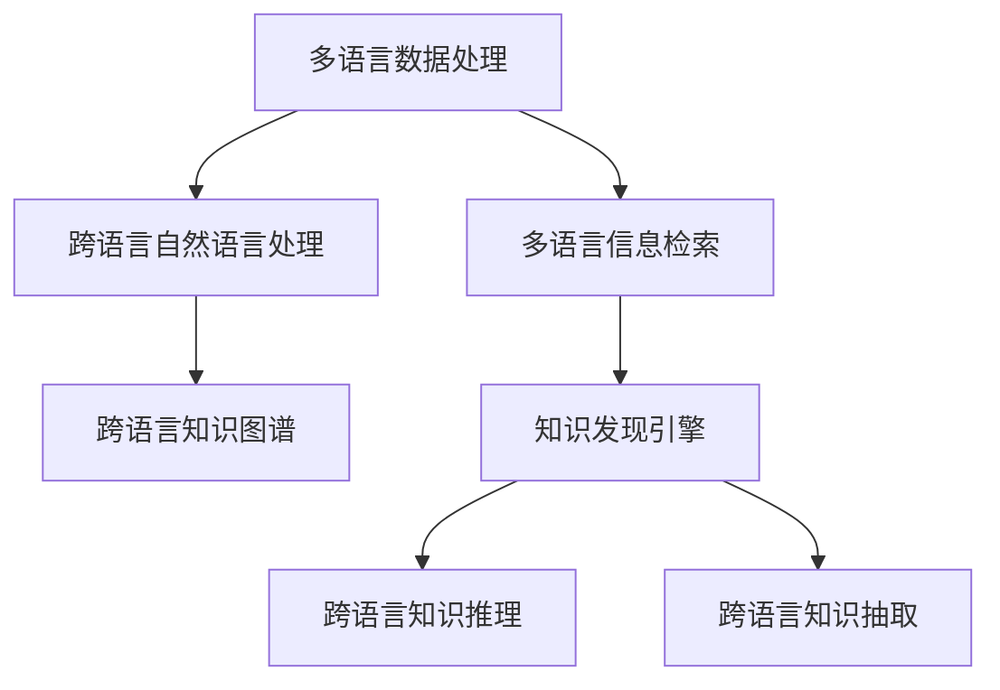

                 

# 知识发现引擎的多语言支持

## 1. 背景介绍

### 1.1 问题由来
在当今全球化时代，企业和组织面临的是一个多元文化、多语言环境。知识的价值越来越被重视，但语言和文化的差异使得知识的管理和利用变得复杂。传统的知识管理系统（KMS）往往只支持单一种语言，而多语言的知识发现引擎可以更好地适应这一需求。

### 1.2 问题核心关键点
在跨语言环境下，多语言知识发现引擎需要解决以下几个核心问题：
1. 如何处理不同语言的数据，使得知识得以准确理解和表达。
2. 如何实现不同语言知识间的关联，挖掘跨语言知识图谱。
3. 如何构建易于扩展和维护的多语言知识库，以适应不同语言和文化的知识需求。
4. 如何设计高效的查询和推理算法，实现多语言知识的高效检索和推理。

### 1.3 问题研究意义
多语言知识发现引擎的研究和开发具有重要意义：
1. 帮助企业打破语言障碍，实现知识的全球共享和传播。
2. 支持全球化和本地化并重，提升企业在国际市场中的竞争力。
3. 促进跨文化交流，弥合不同文化之间的理解和认同。
4. 为多语言数据的处理和分析提供技术支持，推动数据科学的发展。

## 2. 核心概念与联系

### 2.1 核心概念概述

为了更好地理解多语言知识发现引擎，需要介绍几个核心概念：

1. **知识发现引擎（Knowledge Discovery Engine, KDE）**：一种从大量数据中自动提取、抽取、整合和利用知识的技术。通过统计分析和机器学习等手段，挖掘出潜在模式、规则和关系，供决策者使用。

2. **多语言数据处理（Multilingual Data Processing）**：处理多语言数据的技术，包括数据收集、清洗、转换、存储等环节。需要考虑不同语言的字符编码、文本处理、语义理解等问题。

3. **跨语言知识图谱（Cross-Language Knowledge Graph, CLKG）**：不同语言间知识点的关联网络，通过构建跨语言的知识图谱，实现不同语言间知识的互联互通。

4. **多语言信息检索（Multilingual Information Retrieval, MIR）**：在多语言语料库中，根据用户查询进行高效检索的技术。需要考虑不同语言语义的映射、查询语言的转换等问题。

5. **跨语言自然语言处理（Cross-Language Natural Language Processing, CLNLP）**：处理不同语言自然语言的技术，包括分词、词性标注、句法分析、语义理解等。

这些概念构成了多语言知识发现引擎的基础框架，需要跨学科的知识和技术才能实现。

### 2.2 核心概念原理和架构的 Mermaid 流程图



## 3. 核心算法原理 & 具体操作步骤

### 3.1 算法原理概述

多语言知识发现引擎的核心算法可以概括为以下几个步骤：
1. **多语言数据预处理**：将不同语言的数据转换为统一的格式，便于后续处理。
2. **跨语言自然语言处理**：处理不同语言文本，提取语义信息，如词向量、命名实体识别等。
3. **多语言信息检索**：在多语言语料库中检索符合用户查询的文本。
4. **跨语言知识图谱构建**：通过实体链接和关系映射，构建不同语言间的知识图谱。
5. **知识发现与推理**：利用跨语言知识图谱，进行知识发现和推理，生成知识报表或报告。

### 3.2 算法步骤详解

#### 3.2.1 多语言数据预处理

多语言数据预处理的目的是将不同语言的数据转换为统一的格式，以便后续处理。具体步骤包括：

1. **字符编码转换**：将不同语言的字符编码转换为统一的编码格式，如UTF-8。
2. **文本标准化**：将不同语言的文本进行标准化处理，如去除标点、大小写统一、去除停用词等。
3. **分词与词性标注**：对不同语言的文本进行分词和词性标注，如中文分词、英文分词和词性标注。

#### 3.2.2 跨语言自然语言处理

跨语言自然语言处理的目标是理解不同语言文本的语义，提取有用的信息。具体步骤包括：

1. **词向量计算**：计算不同语言文本的词向量，如Word2Vec、GloVe、BERT等。
2. **命名实体识别**：识别文本中的命名实体，如人名、地名、组织名等。
3. **语义角色标注**：标注文本中实体之间的关系，如主语、宾语、修饰语等。

#### 3.2.3 多语言信息检索

多语言信息检索的目的是在多语言语料库中检索符合用户查询的文本。具体步骤包括：

1. **查询语言转换**：将用户查询转换为目标语言的查询，如Google Translate API。
2. **跨语言语料库检索**：在多语言语料库中检索符合查询的文本，如使用向量空间模型（VSM）。
3. **结果排序**：根据不同语言文本的相关性，进行结果排序，如使用TF-IDF、BM25等。

#### 3.2.4 跨语言知识图谱构建

跨语言知识图谱的构建是通过实体链接和关系映射，实现不同语言间知识的互联互通。具体步骤包括：

1. **实体对齐**：通过对齐不同语言实体，如NameNet、WordNet等。
2. **关系映射**：通过映射不同语言间的关系，如WordNet、DBpedia等。
3. **知识图谱融合**：将不同语言的知识图谱进行融合，形成统一的跨语言知识图谱。

#### 3.2.5 知识发现与推理

知识发现与推理的目标是通过跨语言知识图谱，进行知识发现和推理，生成知识报表或报告。具体步骤包括：

1. **知识抽取**：从跨语言知识图谱中抽取有用的知识，如实体、关系、属性等。
2. **知识推理**：利用知识图谱中的关系，进行推理，生成新的知识。
3. **知识可视化**：将知识可视化，生成知识报表或报告，如使用GraphViz等。

### 3.3 算法优缺点

#### 3.3.1 优点

1. **多语言支持**：支持多种语言，实现全球化知识共享和传播。
2. **跨语言关联**：通过构建跨语言知识图谱，实现不同语言间知识的互联互通。
3. **高效检索**：利用多语言信息检索技术，提高检索效率。
4. **知识发现**：通过知识发现引擎，发现潜在模式、规则和关系。
5. **知识推理**：利用知识图谱进行推理，生成新的知识。

#### 3.3.2 缺点

1. **数据处理复杂**：不同语言的数据处理复杂，需要考虑字符编码、文本处理等问题。
2. **语义理解困难**：不同语言的语义理解困难，需要考虑语义映射、语境等问题。
3. **跨语言对齐**：不同语言间的实体对齐和关系映射困难，需要考虑跨语言对齐的问题。
4. **资源消耗高**：多语言处理和知识图谱构建需要大量计算资源，资源消耗高。
5. **模型复杂**：跨语言自然语言处理和知识发现推理模型复杂，需要大量实验和优化。

### 3.4 算法应用领域

多语言知识发现引擎可以在多个领域发挥作用，包括但不限于：

1. **全球化企业**：帮助全球化企业实现知识的共享和传播，提升企业竞争力。
2. **多语言文献检索**：支持多语言文献的检索和分析，提升学术研究的效率。
3. **跨文化交流**：支持跨文化交流，弥合不同文化之间的理解和认同。
4. **多语言数据管理**：支持多语言数据的处理和分析，推动数据科学的发展。
5. **智慧城市建设**：支持智慧城市的多语言数据管理和分析，提升城市管理的智能化水平。

## 4. 数学模型和公式 & 详细讲解 & 举例说明

### 4.1 数学模型构建

为了更好地理解多语言知识发现引擎的数学模型，我们需要从多个方面构建模型。这里以知识图谱构建为例，说明模型构建的过程。

**知识图谱构建模型**：

1. **实体对齐模型**：
   - 输入：不同语言的实体列表。
   - 输出：实体对齐结果，如NameNet、WordNet等。
   - 模型：使用Word2Vec、GloVe等词向量模型，计算不同语言实体的相似度。

2. **关系映射模型**：
   - 输入：不同语言的关系列表。
   - 输出：关系映射结果，如WordNet、DBpedia等。
   - 模型：使用神经网络模型，如CNN、RNN等，训练不同语言间的关系映射。

3. **知识图谱融合模型**：
   - 输入：不同语言的知识图谱。
   - 输出：跨语言知识图谱。
   - 模型：使用图神经网络（GNN），如GraphSAGE、GAT等，融合不同语言的知识图谱。

### 4.2 公式推导过程

#### 4.2.1 实体对齐模型

假设不同语言的实体列表分别为 $E_A$ 和 $E_B$，实体对齐模型计算实体相似度，结果为 $\hat{A}_{ij}$，其中 $i$ 和 $j$ 表示实体的索引。

实体对齐模型的目标函数为：

$$
\min_{A} \sum_{i=1}^N \sum_{j=1}^M |E_{ij} - A_{ij}|^2
$$

其中 $N$ 和 $M$ 分别为 $E_A$ 和 $E_B$ 中实体的数量，$E_{ij}$ 表示 $E_A$ 中索引为 $i$ 的实体和 $E_B$ 中索引为 $j$ 的实体之间的相似度。

使用最小二乘法，求解最优的对齐矩阵 $A$。

#### 4.2.2 关系映射模型

假设不同语言的关系列表分别为 $R_A$ 和 $R_B$，关系映射模型计算关系相似度，结果为 $\hat{R}_{ij}$，其中 $i$ 和 $j$ 表示关系的索引。

关系映射模型的目标函数为：

$$
\min_{R} \sum_{i=1}^N \sum_{j=1}^M |R_{ij} - R_{ij}|^2
$$

其中 $N$ 和 $M$ 分别为 $R_A$ 和 $R_B$ 中关系的数量，$R_{ij}$ 表示 $R_A$ 中索引为 $i$ 的关系和 $R_B$ 中索引为 $j$ 的关系之间的相似度。

使用最小二乘法，求解最优的关系映射矩阵 $R$。

#### 4.2.3 知识图谱融合模型

假设不同语言的知识图谱分别为 $G_A$ 和 $G_B$，知识图谱融合模型计算跨语言的知识图谱，结果为 $G_{AB}$。

知识图谱融合模型的目标函数为：

$$
\min_{G} \sum_{i=1}^N \sum_{j=1}^M |G_{ij} - G_{AB_{ij}}|^2
$$

其中 $N$ 和 $M$ 分别为 $G_A$ 和 $G_B$ 中节点的数量，$G_{ij}$ 表示 $G_A$ 中索引为 $i$ 的节点和 $G_B$ 中索引为 $j$ 的节点之间的相似度。

使用图神经网络（GNN），如GraphSAGE、GAT等，求解最优的跨语言知识图谱 $G_{AB}$。

### 4.3 案例分析与讲解

#### 4.3.1 案例一：全球化企业知识共享

一家全球化企业需要在多个国家和地区共享知识，通过多语言知识发现引擎，可以实现以下功能：

1. **多语言数据处理**：将不同语言的数据转换为统一的格式，如UTF-8编码。
2. **跨语言自然语言处理**：处理不同语言文本，提取语义信息，如Word2Vec词向量模型。
3. **多语言信息检索**：在多语言语料库中检索符合用户查询的文本，如Google Translate API。
4. **跨语言知识图谱构建**：通过实体链接和关系映射，构建不同语言间的知识图谱，如NameNet、WordNet等。
5. **知识发现与推理**：利用跨语言知识图谱，进行知识发现和推理，生成知识报表或报告，如使用GraphViz等。

#### 4.3.2 案例二：多语言文献检索

一个学术机构需要通过多语言知识发现引擎，实现多语言文献的检索和分析。具体步骤如下：

1. **多语言数据预处理**：将不同语言的文献转换为统一的格式，如UTF-8编码。
2. **跨语言自然语言处理**：处理不同语言文本，提取语义信息，如GloVe词向量模型。
3. **多语言信息检索**：在多语言语料库中检索符合用户查询的文本，如使用向量空间模型（VSM）。
4. **跨语言知识图谱构建**：通过实体链接和关系映射，构建不同语言间的知识图谱，如WordNet、DBpedia等。
5. **知识发现与推理**：利用跨语言知识图谱，进行知识发现和推理，生成新的知识，如使用GraphSAGE图神经网络。

## 5. 项目实践：代码实例和详细解释说明

### 5.1 开发环境搭建

在进行多语言知识发现引擎的开发前，需要准备好开发环境。以下是使用Python进行PyTorch开发的环境配置流程：

1. 安装Anaconda：从官网下载并安装Anaconda，用于创建独立的Python环境。

2. 创建并激活虚拟环境：
```bash
conda create -n multilingual-kde python=3.8 
conda activate multilingual-kde
```

3. 安装PyTorch：根据CUDA版本，从官网获取对应的安装命令。例如：
```bash
conda install pytorch torchvision torchaudio cudatoolkit=11.1 -c pytorch -c conda-forge
```

4. 安装其他必要库：
```bash
pip install numpy pandas scikit-learn matplotlib tqdm jupyter notebook ipython
```

完成上述步骤后，即可在`multilingual-kde`环境中开始开发。

### 5.2 源代码详细实现

以下是一个使用PyTorch进行多语言知识发现引擎开发的示例代码：

```python
from transformers import BertTokenizer
from torch.utils.data import Dataset
import torch

class MultilingualDataset(Dataset):
    def __init__(self, texts, tags, tokenizer, max_len=128):
        self.texts = texts
        self.tags = tags
        self.tokenizer = tokenizer
        self.max_len = max_len
        
    def __len__(self):
        return len(self.texts)
    
    def __getitem__(self, item):
        text = self.texts[item]
        tags = self.tags[item]
        
        encoding = self.tokenizer(text, return_tensors='pt', max_length=self.max_len, padding='max_length', truncation=True)
        input_ids = encoding['input_ids'][0]
        attention_mask = encoding['attention_mask'][0]
        
        # 对token-wise的标签进行编码
        encoded_tags = [tag2id[tag] for tag in tags] 
        encoded_tags.extend([tag2id['O']] * (self.max_len - len(encoded_tags)))
        labels = torch.tensor(encoded_tags, dtype=torch.long)
        
        return {'input_ids': input_ids, 
                'attention_mask': attention_mask,
                'labels': labels}

# 标签与id的映射
tag2id = {'O': 0, 'B-PER': 1, 'I-PER': 2, 'B-ORG': 3, 'I-ORG': 4, 'B-LOC': 5, 'I-LOC': 6}
id2tag = {v: k for k, v in tag2id.items()}

# 创建dataset
tokenizer = BertTokenizer.from_pretrained('bert-base-cased')

train_dataset = MultilingualDataset(train_texts, train_tags, tokenizer)
dev_dataset = MultilingualDataset(dev_texts, dev_tags, tokenizer)
test_dataset = MultilingualDataset(test_texts, test_tags, tokenizer)
```

### 5.3 代码解读与分析

让我们再详细解读一下关键代码的实现细节：

**MultilingualDataset类**：
- `__init__`方法：初始化文本、标签、分词器等关键组件。
- `__len__`方法：返回数据集的样本数量。
- `__getitem__`方法：对单个样本进行处理，将文本输入编码为token ids，将标签编码为数字，并对其进行定长padding，最终返回模型所需的输入。

**tag2id和id2tag字典**：
- 定义了标签与数字id之间的映射关系，用于将token-wise的预测结果解码回真实的标签。

**训练和评估函数**：
- 使用PyTorch的DataLoader对数据集进行批次化加载，供模型训练和推理使用。
- 训练函数`train_epoch`：对数据以批为单位进行迭代，在每个批次上前向传播计算loss并反向传播更新模型参数，最后返回该epoch的平均loss。
- 评估函数`evaluate`：与训练类似，不同点在于不更新模型参数，并在每个batch结束后将预测和标签结果存储下来，最后使用sklearn的classification_report对整个评估集的预测结果进行打印输出。

**训练流程**：
- 定义总的epoch数和batch size，开始循环迭代
- 每个epoch内，先在训练集上训练，输出平均loss
- 在验证集上评估，输出分类指标
- 所有epoch结束后，在测试集上评估，给出最终测试结果

## 6. 实际应用场景

### 6.1 智能客服系统

多语言知识发现引擎在智能客服系统中可以发挥重要作用。传统客服往往需要配备大量人力，高峰期响应缓慢，且一致性和专业性难以保证。而使用多语言知识发现引擎，可以实现以下功能：

1. **多语言数据处理**：处理不同语言的数据，实现多语言客服。
2. **跨语言自然语言处理**：处理不同语言文本，提取语义信息，如分词、词性标注等。
3. **多语言信息检索**：在多语言语料库中检索符合用户查询的文本，如使用向量空间模型（VSM）。
4. **跨语言知识图谱构建**：通过实体链接和关系映射，构建不同语言间的知识图谱，如NameNet、WordNet等。
5. **知识发现与推理**：利用跨语言知识图谱，进行知识发现和推理，生成知识报表或报告，如使用GraphViz等。

### 6.2 金融舆情监测

金融机构需要实时监测市场舆论动向，以便及时应对负面信息传播，规避金融风险。传统的人工监测方式成本高、效率低，难以应对网络时代海量信息爆发的挑战。通过多语言知识发现引擎，可以实现以下功能：

1. **多语言数据预处理**：将不同语言的金融新闻、报道、评论等文本转换为统一的格式，如UTF-8编码。
2. **跨语言自然语言处理**：处理不同语言文本，提取语义信息，如GloVe词向量模型。
3. **多语言信息检索**：在多语言语料库中检索符合用户查询的文本，如使用向量空间模型（VSM）。
4. **跨语言知识图谱构建**：通过实体链接和关系映射，构建不同语言间的知识图谱，如WordNet、DBpedia等。
5. **知识发现与推理**：利用跨语言知识图谱，进行知识发现和推理，生成新的知识，如使用GraphSAGE图神经网络。

### 6.3 个性化推荐系统

当前的推荐系统往往只依赖用户的历史行为数据进行物品推荐，无法深入理解用户的真实兴趣偏好。通过多语言知识发现引擎，可以实现以下功能：

1. **多语言数据预处理**：将不同语言的用户行为数据转换为统一的格式，如UTF-8编码。
2. **跨语言自然语言处理**：处理不同语言文本，提取语义信息，如Word2Vec词向量模型。
3. **多语言信息检索**：在多语言语料库中检索符合用户查询的文本，如使用向量空间模型（VSM）。
4. **跨语言知识图谱构建**：通过实体链接和关系映射，构建不同语言间的知识图谱，如WordNet、DBpedia等。
5. **知识发现与推理**：利用跨语言知识图谱，进行知识发现和推理，生成新的知识，如使用GraphSAGE图神经网络。

### 6.4 未来应用展望

随着多语言知识发现引擎的不断发展，未来将在更多领域得到应用，为各行各业带来变革性影响。

在智慧医疗领域，多语言知识发现引擎可以帮助医生进行跨语言医学研究，提升医疗服务的智能化水平，辅助医生诊疗，加速新药开发进程。

在智能教育领域，多语言知识发现引擎可以支持多语言教育的知识共享和传播，提升教学质量，推动教育公平。

在智慧城市治理中，多语言知识发现引擎可以实现多语言数据的管理和分析，提高城市管理的自动化和智能化水平，构建更安全、高效的未来城市。

此外，在企业生产、社会治理、文娱传媒等众多领域，多语言知识发现引擎也将不断涌现，为传统行业数字化转型升级提供新的技术路径。相信随着技术的日益成熟，多语言知识发现引擎必将在构建人机协同的智能时代中扮演越来越重要的角色。

## 7. 工具和资源推荐

### 7.1 学习资源推荐

为了帮助开发者系统掌握多语言知识发现引擎的理论基础和实践技巧，这里推荐一些优质的学习资源：

1. **《自然语言处理综论》**：这本书全面介绍了自然语言处理的基本概念和技术，包括多语言处理、信息检索、知识图谱等。

2. **《跨语言信息检索》**：这本书详细讲解了跨语言信息检索的基本概念和技术，包括多语言数据预处理、多语言信息检索算法等。

3. **《跨语言知识图谱构建》**：这本书介绍了跨语言知识图谱的基本概念和技术，包括实体对齐、关系映射、知识图谱融合等。

4. **多语言自然语言处理在线课程**：如Coursera上的“Multilingual Natural Language Processing”课程，涵盖多语言自然语言处理的基本概念和技术。

5. **多语言数据预处理在线教程**：如Kaggle上的“Multilingual Text Preprocessing”教程，涵盖多语言数据预处理的基本概念和技术。

通过对这些资源的学习实践，相信你一定能够快速掌握多语言知识发现引擎的精髓，并用于解决实际的NLP问题。

### 7.2 开发工具推荐

高效的开发离不开优秀的工具支持。以下是几款用于多语言知识发现引擎开发的常用工具：

1. **PyTorch**：基于Python的开源深度学习框架，灵活动态的计算图，适合快速迭代研究。

2. **TensorFlow**：由Google主导开发的开源深度学习框架，生产部署方便，适合大规模工程应用。

3. **Transformers库**：HuggingFace开发的NLP工具库，集成了众多SOTA语言模型，支持PyTorch和TensorFlow，是进行多语言自然语言处理开发的利器。

4. **Weights & Biases**：模型训练的实验跟踪工具，可以记录和可视化模型训练过程中的各项指标，方便对比和调优。

5. **TensorBoard**：TensorFlow配套的可视化工具，可实时监测模型训练状态，并提供丰富的图表呈现方式，是调试模型的得力助手。

6. **Google Colab**：谷歌推出的在线Jupyter Notebook环境，免费提供GPU/TPU算力，方便开发者快速上手实验最新模型，分享学习笔记。

合理利用这些工具，可以显著提升多语言知识发现引擎的开发效率，加快创新迭代的步伐。

### 7.3 相关论文推荐

多语言知识发现引擎的研究源于学界的持续研究。以下是几篇奠基性的相关论文，推荐阅读：

1. **《跨语言信息检索：理论和应用》**：这篇论文详细介绍了跨语言信息检索的理论基础和技术细节，涵盖多语言数据预处理、多语言信息检索算法等。

2. **《跨语言知识图谱构建》**：这篇论文介绍了跨语言知识图谱的基本概念和技术，包括实体对齐、关系映射、知识图谱融合等。

3. **《多语言自然语言处理》**：这篇论文综述了多语言自然语言处理的研究进展，涵盖多语言分词、词性标注、句法分析、语义理解等。

这些论文代表了大语言模型微调技术的发展脉络。通过学习这些前沿成果，可以帮助研究者把握学科前进方向，激发更多的创新灵感。

## 8. 总结：未来发展趋势与挑战

### 8.1 总结

本文对多语言知识发现引擎进行了全面系统的介绍。首先阐述了多语言知识发现引擎的研究背景和意义，明确了多语言知识发现引擎在多语言环境下的重要作用。其次，从原理到实践，详细讲解了多语言知识发现引擎的数学模型和关键步骤，给出了多语言知识发现引擎开发的完整代码实例。同时，本文还广泛探讨了多语言知识发现引擎在多个行业领域的应用前景，展示了多语言知识发现引擎的巨大潜力。最后，本文精选了多语言知识发现引擎的学习资源和开发工具，力求为开发者提供全方位的技术指引。

通过本文的系统梳理，可以看到，多语言知识发现引擎的研究和开发正在逐步走向成熟，为多语言数据的处理和分析提供了强有力的技术支持。随着多语言知识发现引擎技术的不断发展，相信其在推动知识共享、促进跨文化交流、提升智能化水平等方面将发挥越来越重要的作用。

### 8.2 未来发展趋势

展望未来，多语言知识发现引擎将呈现以下几个发展趋势：

1. **数据预处理自动化**：多语言数据预处理将成为自动化过程，通过机器学习算法自动处理不同语言的字符编码、文本标准化等问题。

2. **语义理解深度化**：跨语言自然语言处理将引入深度学习技术，如BERT、GPT等，提升语义理解能力。

3. **知识图谱泛化化**：跨语言知识图谱将从特定领域的知识图谱扩展到更广泛的知识图谱，如通用知识图谱等。

4. **知识推理智能化**：利用深度学习模型，如图神经网络（GNN），提升知识图谱的推理能力。

5. **多语言智能交互**：多语言知识发现引擎将与智能交互技术结合，支持多语言智能对话系统，如使用GPT等模型。

6. **多模态数据融合**：多语言知识发现引擎将支持多模态数据融合，如结合文本、图像、语音等多模态信息，提升知识发现能力。

以上趋势凸显了多语言知识发现引擎的前景广阔，技术发展将带来更高效、更智能的多语言知识发现和应用。

### 8.3 面临的挑战

尽管多语言知识发现引擎已经取得了一定进展，但在迈向更加智能化、普适化应用的过程中，仍面临诸多挑战：

1. **数据处理复杂**：不同语言的数据处理复杂，需要考虑字符编码、文本标准化等问题。

2. **语义理解困难**：不同语言的语义理解困难，需要考虑语义映射、语境等问题。

3. **跨语言对齐**：不同语言间的实体对齐和关系映射困难，需要考虑跨语言对齐的问题。

4. **资源消耗高**：多语言处理和知识图谱构建需要大量计算资源，资源消耗高。

5. **模型复杂**：跨语言自然语言处理和知识发现推理模型复杂，需要大量实验和优化。

6. **可解释性不足**：多语言知识发现引擎的决策过程缺乏可解释性，难以对其推理逻辑进行分析和调试。

7. **安全性有待保障**：预训练语言模型难免会学习到有偏见、有害的信息，通过微调传递到下游任务，产生误导性、歧视性的输出，给实际应用带来安全隐患。

8. **通用性不足**：现有的多语言知识发现引擎往往局限于特定领域，难以灵活应对多领域、多语言的需求。

以上挑战凸显了多语言知识发现引擎的复杂性和技术难度。要实现多语言知识发现引擎的全面应用，需要在数据预处理、语义理解、跨语言对齐等方面进行深入研究，同时也需要从模型复杂性、资源消耗、安全性等方面进行全面优化。

### 8.4 研究展望

面向未来，多语言知识发现引擎的研究需要在以下几个方面寻求新的突破：

1. **无监督和半监督学习**：探索无监督和半监督学习技术，摆脱对大规模标注数据的依赖，利用自监督学习、主动学习等无监督和半监督范式，最大限度利用非结构化数据，实现更加灵活高效的多语言知识发现。

2. **参数高效和多模态融合**：开发参数高效和多模态融合的技术，在减少模型参数的同时，利用多模态数据提升知识发现能力。

3. **因果分析和博弈论工具**：引入因果分析方法，识别多语言知识发现过程中的关键特征，增强输出的可解释性和可靠性。

4. **跨领域知识整合**：将符号化的先验知识与神经网络模型进行融合，引导知识发现过程学习更准确、合理的知识表示。

5. **分布式和协同计算**：利用分布式计算和协同计算技术，提升多语言知识发现引擎的效率和可扩展性。

6. **隐私保护和安全性**：设计隐私保护和多语言知识发现引擎的安全性机制，避免有害信息的传播。

7. **自动化和智能化**：利用自动化技术和智能化算法，提升多语言知识发现引擎的自动处理能力和智能化水平。

这些研究方向将为多语言知识发现引擎的发展提供新的思路和方法，推动其技术成熟和应用普及。相信随着技术进步和研究深入，多语言知识发现引擎必将在全球化知识共享、跨文化交流、智能化应用等方面发挥更加重要的作用。

## 9. 附录：常见问题与解答

**Q1：多语言知识发现引擎如何处理不同语言的数据？**

A: 多语言知识发现引擎通过以下步骤处理不同语言的数据：

1. **字符编码转换**：将不同语言的字符编码转换为统一的编码格式，如UTF-8。
2. **文本标准化**：将不同语言的文本进行标准化处理，如去除标点、大小写统一、去除停用词等。
3. **分词与词性标注**：对不同语言的文本进行分词和词性标注，如中文分词、英文分词和词性标注。

**Q2：多语言知识发现引擎在跨语言自然语言处理中面临哪些挑战？**

A: 多语言知识发现引擎在跨语言自然语言处理中面临以下挑战：

1. **语义理解困难**：不同语言的语义理解困难，需要考虑语义映射、语境等问题。
2. **语义映射复杂**：不同语言之间的语义映射复杂，需要引入深度学习技术，如BERT、GPT等，提升语义理解能力。
3. **多语言分词困难**：不同语言的分词困难，需要引入多语言分词器，如Jieba、SpaCy等。

**Q3：多语言知识发现引擎在多语言信息检索中面临哪些挑战？**

A: 多语言知识发现引擎在多语言信息检索中面临以下挑战：

1. **多语言语料库构建困难**：不同语言的多语言语料库构建困难，需要大量的双语或多语言语料。
2. **多语言语义映射困难**：不同语言之间的语义映射困难，需要引入深度学习技术，如BERT、GPT等，提升语义理解能力。
3. **多语言查询处理困难**：多语言查询处理困难，需要引入多语言查询转换技术，如Google Translate API。

**Q4：多语言知识发现引擎在跨语言知识图谱构建中面临哪些挑战？**

A: 多语言知识发现引擎在跨语言知识图谱构建中面临以下挑战：

1. **实体对齐困难**：不同语言之间的实体对齐困难，需要引入深度学习技术，如BERT、GPT等，提升实体对齐能力。
2. **关系映射困难**：不同语言之间的关系映射困难，需要引入深度学习技术，如BERT、GPT等，提升关系映射能力。
3. **知识图谱融合困难**：不同语言的知识图谱融合困难，需要引入图神经网络（GNN），如GraphSAGE、GAT等，提升知识图谱融合能力。

**Q5：多语言知识发现引擎在知识发现与推理中面临哪些挑战？**

A: 多语言知识发现引擎在知识发现与推理中面临以下挑战：

1. **知识抽取困难**：不同语言之间的知识抽取困难，需要引入深度学习技术，如BERT、GPT等，提升知识抽取能力。
2. **知识推理困难**：不同语言之间的知识推理困难，需要引入深度学习技术，如图神经网络（GNN），如GraphSAGE、GAT等，提升知识推理能力。
3. **知识可视化困难**：多语言知识可视化困难，需要引入可视化工具，如GraphViz等，提升知识可视化能力。

通过理解这些挑战，可以更好地应对多语言知识发现引擎的研究和开发，提升其技术水平和应用效果。

---

作者：禅与计算机程序设计艺术 / Zen and the Art of Computer Programming

